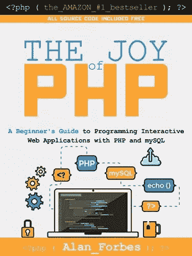
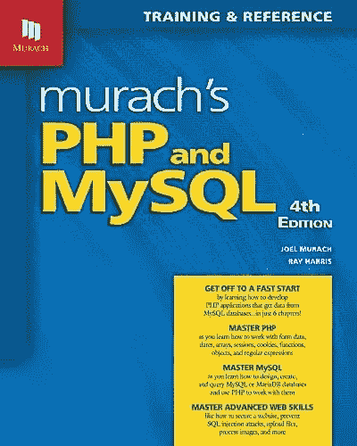
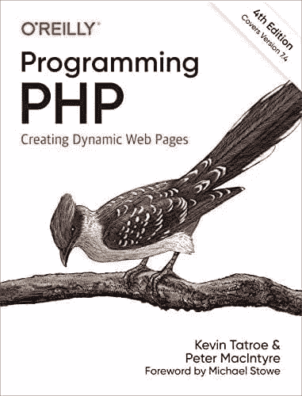
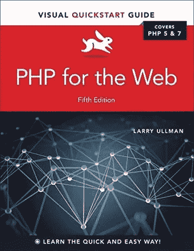
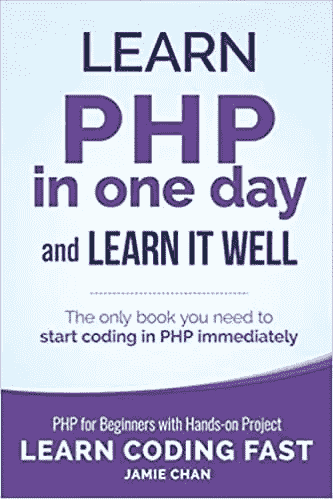
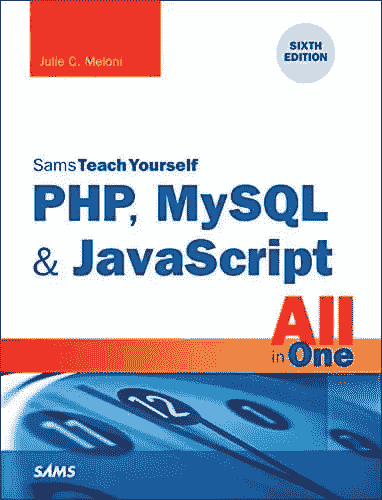
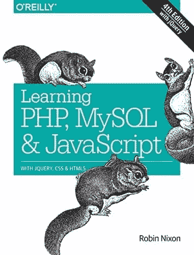
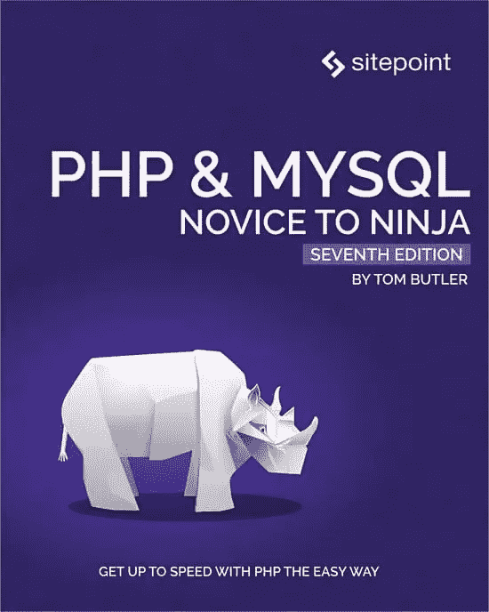

# 初学者的最佳 PHP 书籍

> 原文：<https://www.sitepoint.com/best-php-books-for-beginners/>

PHP 是一种多年来广受欢迎的编程语言。它是一种跨平台的语言，易于学习和使用，可用于多种目的，目前仍在超过 75%的网站上使用。

有几本关于这个主题的书可以帮助你开始 PHP 编程。在这篇文章中，我们收集了一些我们最喜欢的资源。

**内容:**

1.  什么是 PHP，它主要用来做什么？
2.  [谁应该学习 PHP？](#whoshouldlearnphp)
3.  [初学 PHP 的顶级书籍](#topphpbooksforbeginners)
    *   PHP 编程的乐趣:初学者指南
    *   [穆拉希的 PHP 和 MySQL](#murachsphpandmysql)
    *   [编程 PHP:创建动态网页](#programmingphpcreatingdynamicwebpages)
    *   [网页 PHP](#phpfortheweb)
    *   [PHP:一天学会 PHP，学好它](#phplearnphpinonedayandlearnitwell)
    *   [PHP，MySQL & JavaScript 全合一](#phpmysqljavascriptallinone)
    *   [学习 PHP，MySQL & JavaScript](#learningphpmysqljavascript)
    *   [PHP & MySQL:新手到忍者](#phpmysqlnovicetoninja)
4.  [如何选择一本 PHP 书籍](#howtochooseaphpbook)
5.  [让你的 PHP 技能更上一层楼](#takingyourphpskillstothenextlevel)

## 什么是 PHP，它主要用来做什么？

PHP 是一种服务器端脚本语言。它可以用来创建动态网页、网站、博客和应用程序。

PHP 最初是由拉斯马斯·勒德尔夫在 1994 年开发的，是 Perl 编程语言的一个子集。该项目于 1995 年 1 月 1 日在 GNU 通用公共许可证(GPL)下发布，同年晚些时候发布了 4.0 版本。

PHP 已经成为 web 开发中最受欢迎的开源语言之一，因为它简单易用，并且能够处理大量数据而不会显著降低网站或应用程序的速度。PHP 和 MySQL(最广泛使用的关系数据库管理系统)驱动了互联网的很大一部分，它们一起创建了丰富的交互式 web 应用程序。

## 谁应该学习 PHP？

PHP 是一种通用编程语言，可以用来创建网站。很好学，网上有很多资源可供初学者参考。

任何想学习计算机编程的人都会从学习 PHP 中受益，因为它提供了一种直观的方式来思考计算机如何工作以及代码在幕后做什么。

PHP 是构建动态网站的绝佳选择。它的开发就是为了这个目标，它提供了所有你需要的工具，不仅可以建立一个网站，还可以处理一些基本的事情，比如安全、数据库连接、会话等等。

请注意，在这篇文章中，我们将从通过亚马逊链接购买的商品中获得佣金。

## 面向初学者的顶级 PHP 书籍

现在让我们来看看我们选择的学习 PHP 的五本推荐书籍。

### PHP 编程的乐趣:初学者指南

> 你是否曾经想设计你的网站或浏览器应用程序，但认为它太难或只是不知道从哪里开始？你有没有发现互联网上的信息量太大，或者不适合你的技能，或者更糟——简直无聊透顶？你有兴趣学习 PHP 编程并从中获得乐趣吗？如果是这样，那么艾伦·福布斯的《PHP 之乐》就是适合你的书！

这本书是以对话的形式写的，易于阅读。它没有假设任何 PHP 或 web 开发的知识，所以您可以从头开始，而不必先学习任何东西。您将学习如何使用该语言及其最重要的数据类型和函数(字符串、数组等)，以及一些高级概念，如模板文件和数据库连接。

这本书以一种简单易懂的格式涵盖了你需要知道的关于 PHP 编程的一切，甚至非技术人员也能理解。

*   **作者:**艾伦·福布斯
*   **网址:**【joyofphp.com】T2([在亚马逊](https://amzn.to/3ijwt69)购买)
*   **上映日期:【2015 年 12 月**

### 穆拉希的 PHP 和 MySQL

> 我数不清这些年来为了学习这门语言，我购买了多少 PHP 书籍。穆拉希的书是第一本帮助我掌握概念并让我真正开始用 PHP 编写脚本的书……[它]比以往任何时候都更好地提供了使用 PHP 和 MySQL 开发数据库驱动的网站所需的技能，就像当今顶级 web 专业人员所做的那样。——亚马逊评论

穆拉希的 PHP 和 MySQL 是一本适合初学者的好书。它提供了 PHP 和 MySQL 基础的完整概述，包括如何在现实世界的应用程序中一起使用它们。它还提供了一些有用的例子，展示了如何使用 PHP 创建 web 数据库，比如使用 MySQLi 或 PDO 这样的库。有了这本书，你将能够用各种数据库和不同类型的网络应用程序建立网站。

这本书以一种易于理解的格式编写，任何具有 PHP 和 MySQL 基础知识的人都可以使用。它包含了大量的例子来帮助你理解这种语言是如何工作的，以及如何在实际应用中使用它。这本书还包含一章关于 MySQLi 的内容，它提供了额外的功能，使开发人员更容易使用数据库。

*   **作者:**乔尔·穆拉希
*   **网址:**【murach.com】T2([在亚马逊](https://amzn.to/3udGYuw)购买)
*   **上映日期:【2014 年 12 月**

### PHP 编程:创建动态网页

> 为什么 PHP 是 web 上使用最广泛的编程语言？这个更新的版本教你使用 PHP 7.4 的最新特性创建有效的 web 应用程序所需要知道的一切。您将从大图开始，然后深入到语言语法、编程技术和其他细节，使用示例说明正确的用法和常见的习惯用法。

*编程 PHP:创建动态网页*是一本适合初学者的好书。它以清晰易读的风格编写，涵盖了 PHP 的所有基本概念。作者还介绍了一些更高级的主题，如调试和安全性、错误处理、生成动态图像、创建 PDF 文件和解析 XML 文件。如果将这些与会话、数据库连接和利用率的基础放在一起，您就有了学习 PHP 的绝佳资源。

*   **作者:**凯文·泰特罗
*   **网址:**【oreilly.com】T2([在亚马逊](https://amzn.to/3irx71s)购买)
*   **上映日期:【2020 年 4 月**

### 面向网络的 PHP

> 有了*PHP for the World Wide Web:Visual quick start Guide*，读者可以从头开始浏览编程语言或者查找特定的任务来学习他们需要知道的东西。这种基于任务的可视化参考指南使用一步一步的说明和大量的截图来教授初级和中级用户这种流行的开源脚本语言。

这本书是为那些想学习 PHP 和 MySQL，以及如何用它们构建动态网页的人准备的。作者拉里·厄尔曼已经写了几本关于这个主题的书。这是针对那些想开始学习使用 PHP 和 MySQL(web 开发中使用的两种主要语言)编程的初学者的。它并不打算作为一个全面的参考指南，而是作为一个介绍性的文本，涵盖了任何想要在项目中使用这些技术的程序员所需的所有基础知识。

这本书从概述网站的构成开始。然后我们继续使用简单的例子来创建我们的内容，比如添加图像或文本框，然后使用 CSS 对它们进行样式化，然后再转到更复杂的主题，比如表单验证技术，这在以后处理数据库时也很有用。这种迭代形式将使你学习 PHP 如何以一种实际的、真实的方式工作。

*   **作者:**拉里·厄尔曼
*   **网址:**【larryullman.com】T2([在亚马逊](https://amzn.to/3VDhXVd)购买)
*   **上映日期:【2016 年 6 月**

### PHP:一天学会 PHP，学好

> 你不必再浪费时间和金钱从冗长的书籍、昂贵的在线课程或支离破碎的 PHP 教程中学习 PHP。这本书涵盖了 PHP 的所有主要主题，并且以简明扼要的方式编写。此外，在本书的结尾，你将被引导完成一个项目，在这个项目中，你将应用所学的概念，并了解它们是如何联系在一起的。

这本书的目标是提供一个清晰简洁的学习 PHP 的方法。复杂的例子被分解成小的、容易理解的块，这样你可以在 PHP 学习中快速进步。主题的选择包括如何设置服务器、基本数据类型以及与 web 相关的主题，如 cookies、会话和安全性。所有这些都是在精心挑选的例子的帮助下提出的。

这本书以一个项目结束，在这个项目中，你将经历书中解释的所有概念来巩固你的知识。

这本书是开始学习 PHP 网页简明实用的好方法(不要认为你会在一天内全部学会！).此外，您还可以通过 SitePoint Premium 订阅获得该服务。

*   **作者:**陈嘉上
*   **网址:**【sitepoint.com 
*   **上映日期:【2020 年 6 月**

### PHP、MySQL 和 JavaScript 集于一身

> 在很短的时间内，您就可以学习如何使用 PHP、MySQL 和 JavaScript，通过三种领先的 web 开发技术来创建动态的交互式网站和应用程序。
> 
> 不需要以前的编程经验。本书中的每一课都以前面的课为基础，采用简单明了的循序渐进的方法，使您能够学习全栈 web 应用程序开发的基本知识——从前端的 HTML、CSS 和 JavaScript，到服务器上的 PHP 脚本和 MySQL 数据库。

这是本书的另一个很好的例子，它一步一步地讲述了如何构建 web 应用程序的实际操作练习。本书不仅关注 PHP，还向您介绍 HTML、CSS、JavaScript 和 MySQL，让您创建一个不仅仅包含后端组件的 web 应用程序。

它会慢慢培养你的技能，每一章，你都会从 PHP 到 JavaScript 到 CSS 到 MySQL 找到最适合的主题。它还包括面向真正初学者的非常基础的东西，如数据库设计、表关系、规范化和 CSS box 模型——这些虽然只是基础水平，但对于构建合适的 web 应用程序是完全必要的。

总的来说，这是初学者开始构建 web 应用程序的简单指南。

*   **作者:**朱莉·梅洛尼
*   **网址:**【pearson.co】T2([在亚马逊](https://amzn.to/3OQ9RXp)购买)
*   **上映日期:【2017 年 9 月**

### 学习 PHP、MySQL 和 JavaScript

> 即使您只有基本的 HTML 知识，也可以利用开源技术和 web 标准的强大组合来构建交互式、数据驱动的网站。通过这本流行的实践指南的最新版本，您将使用当今核心技术的最新版本来处理动态 web 编程:PHP、MySQL、JavaScript、CSS、HTML5、jQuery 和强大的 React 库。

在本书中，作者 Robin Nixon 不仅向您介绍了 PHP，还介绍了 CSS 和 JavaScript 等所有其他常用技术，并添加了 Ajax 调用和 React 库等内容，教您如何构建现代且健壮的 web 应用程序。

就像这个列表中的其他书一样，这本书不仅仅关注 PHP，而是给出了一个 web 应用程序的完整概述。因此，它不太关注 PHP 的后端和脚本功能，而是更多地关注技术集成以提供完整的应用程序。

这本书探讨了所有这些概念，同时构建了一个为桌面和移动浏览器优化的功能性社交网络。

*   **作者:**罗宾·尼克松
*   **网址:**【oreilly.com】T2([在亚马逊](https://amzn.to/3ONcQ2C)购买)
*   **上映日期:【2021 年 7 月**

只是要注意，这不是一本初学者的书，不会从头开始教你 PHP 或编程。

### PHP & MySQL:从新手到忍者

> *PHP & MySQL:新手到忍者，第 7 版*是学习使用 PHP & MySQL 构建专业 web 应用程序所需的所有工具、原则和技术的实践指南。全面更新，涵盖 PHP 8.1 和现代最佳实践，这本非常实用和有趣的书涵盖了从安装到创建一个完整的在线内容管理系统的一切。

对于那些不仅想学习 PHP，还想了解如何使用 Docker(如果你想以 PHP 应用程序为生，这是一个很好的工具)这样的现代工具正确设置 PHP 环境的人来说，这是一本很好的书。这本书不仅会教你如何设置你的环境，还会通过实现一个内容管理系统，然后使用你在书中学到的新概念和新特性迭代同一个项目，让你开始使用 PHP 和 MySQL。

这本书的第七版完全使用 PHP 8.1 编写，展示了该语言的最新最佳实践。

*   **作者:**汤姆·巴特勒
*   **网址:**【sitepoint.com 
*   **上映日期:【2022 年 1 月**

## 如何选择一本 PHP 书籍

正如你从这个列表中看到的，有几种不同类型的 PHP 书籍。有些是针对希望完全专注于 PHP 的初级程序员的；有些专注于网络应用；还有一些针对的是已经掌握这门语言的高级程序员，他们希望深入更高级的主题。

要选择最适合你的书，你首先需要确定你的需求。

这个列表中的大多数书籍都专注于 PHP 和 MySQL 之间的交互，以解释 PHP 和 MySQL 的核心语言和概念，所以尝试哪本书最适合你的好方法是，你可能必须查阅每本书的内容。其中一些书更偏重于理论，如*PHP 编程的乐趣*，而另一些则围绕实际例子和项目，如 *PHP:一天学会 PHP 并学好它*。如果你想深入了解 PHP 最佳实践，并学会像高级 PHP 程序员一样思考，可以考虑 *PHP & MySQL:新手到忍者*。

您可能还想考虑一本关于浏览器交互和一般观感的 JavaScript 和 CSS 书籍。在这种情况下，像*学习 PHP、MySQL & JavaScript* 或 *PHP、MySQL & JavaScript All in One* 这样的书应该是你的首选。

总结一下，在选择 PHP 书籍的时候，一定要先明确自己的需求。那么你应该选择最符合你需求的标题。

## 让你的 PHP 技能更上一层楼

读完这些书中的一本或几本后，你可能会想接下来会是什么。通常，编程语言总是在进化，PHP 也不例外。因此，为了让你的技能更上一层楼，你可能需要考虑以下几点:

*   了解 PHP 的新特性。PHP 一直在发展并添加新的特性和范例。跟上最新的变化会对你的下一个项目产生影响。

*   了解 PHP 的最佳实践。

*   了解 PHP 中的 [OOP](https://www.sitepoint.com/premium/courses/learn-the-principles-of-object-oriented-programming-in-php-2734) (面向对象编程)。OOP 不是一个新概念，但是信不信由你，它仍然在许多 PHP 项目中使用不足。在用 PHP 编程时了解 OOP 将会使你的解决方案更加健壮、可读和可伸缩。

## 结论

如你所见，有很多好书可供 PHP 初学者选择。无论您是想通过阅读 PHP 的特殊之处来了解它，还是想了解如何在项目中有效地使用它，这些书对每个人都有帮助。

## 分享这篇文章