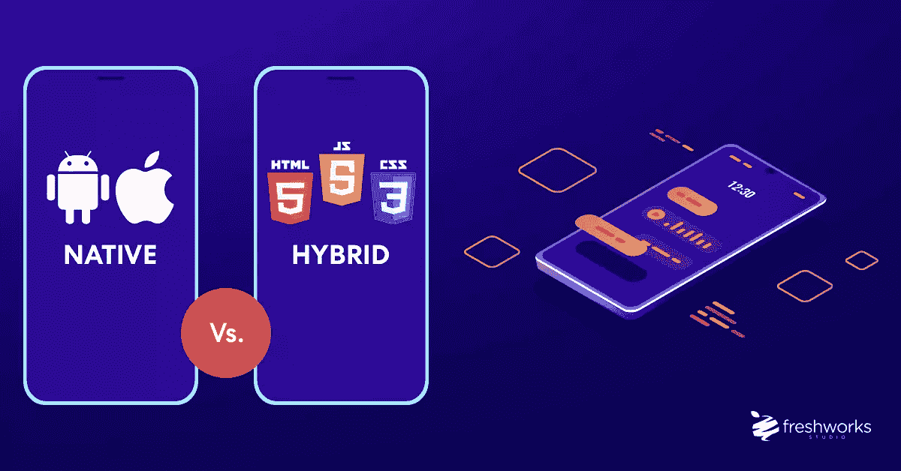
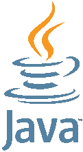
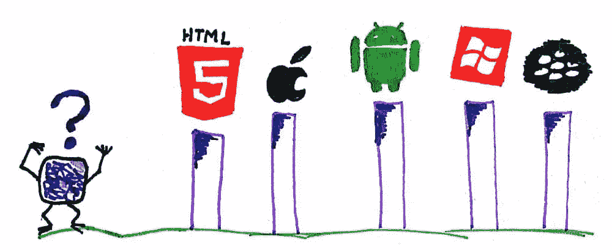
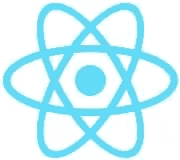

# 顶级移动应用程序开发编程语言

> 原文：<https://www.sitepoint.com/best-programming-language-for-app-development/>

在本文中，我们将探讨应用程序开发的最佳编程语言。我们将讨论哪些是我们可用的顶级编程语言和工具集。我们还将回顾每种方法的优缺点，以便您能够做出明智的决定，确定哪种方法适合您以及您的移动应用程序开发需求。

1.  [手机应用类型](#typesofmobileapps)
    *   [原生应用](#nativeapps)
    *   [混合应用](#hybridapps)
    *   [网络应用](#webapps)
    *   [如何选择开发哪种类型的应用](#howtochoosewhichtypeofapplicationtodevelop)
2.  [最好的 App 开发语言有哪些？](#whatarethebesttoolsforcrossplatformappdevelopment)(原生)
    *   [目标-C](#objectivec)
    *   雨燕
    *   [Java](#java)
    *   [锅炉](#kotlin)
3.  [本地运行时间](#nativeruntimes)
    *   Apache Cordova
    *   [电容器](#capacitor)
4.  [框架](#frameworks)
    *   [反应原生](#reactnative)
    *   [颤动](#flutter)
    *   [离子框架](#ionicframework)
    *   [类星体](#quasar)
5.  [移动应用开发平台和工具](#platformsandtoolsformobileappdevelopment)
6.  [结论](#conclusion)

移动应用程序开发是为设备(包括智能手机、平板电脑等)创建移动应用程序的过程。它涉及应用程序的构思、规划、设计、开发和测试。在当前的十年里，随着移动电话用户数量的不断增加和新的创新技术的引入，这是一个持续增长的行业。

因此，对能够开发高质量和用户友好的应用的移动应用开发者有很高的需求。美国劳工统计局表示，移动应用的激增将导致对合格开发人员的更大需求，预计 2018 年至 2028 年间需求将增长 21%。

## 移动应用的类型

本质上有两种类型的移动应用:本地应用和混合应用。

<small>[混合应用 vs 本地应用](https://commons.wikimedia.org/wiki/File:Hybrid_vs_Native_Apps_Header_1200x628_COMPRESSED.png)Merroa</small>

### 原生应用

本地应用程序是专门为一种移动操作系统开发的应用程序，比如 iOS 或 Android。原生应用是用操作系统的原生语言编写的，比如 iOS 应用的 Objective-C 或 Swift，Android 应用的 Java 或 Kotlin。

原生应用有几个优势:

*   他们可以充分利用移动设备的功能，如摄像头、GPS 和推送通知。
*   它们可以专门为移动操作系统的用户界面而设计，从而带来更好的用户体验。
*   它们可以从应用商店下载，例如 iOS 设备的应用商店和 Android 设备的谷歌 Play 商店。

然而，原生应用也有一些缺点:

*   与其他类型的应用程序相比，它们的开发成本可能更高，因为它们需要两个独立的开发团队——每个团队负责一种操作系统。
*   它们可能需要更长的开发时间，因为每个操作系统都有自己的一套规则和准则。
*   它们可能更难更新，因为每个操作系统都有自己的更新过程。

### 混合应用

混合应用程序是一种结合了 web 技术(如 HTML、CSS 和 JavaScript)和本地技术(如 Objective-C 或 Java)的应用程序。混合应用程序通常使用框架开发，如 Cordova、Ionic 或 React Native(稍后将详细介绍)。

混合应用有几个优势:

*   它们通常开发起来更容易、更快。它们建立在网络技术的基础上，有更多的开发人员可用，这可以节省资金和上市时间。
*   它们可以设计为在多种类型的移动设备上工作，包括智能手机、平板电脑和笔记本电脑。
*   他们可以利用每个平台固有的最新特性。
*   它们可以从应用商店下载，例如 iOS 设备的应用商店和 Android 设备的谷歌 Play 商店。

然而，混合应用也有一些缺点:

*   它们可能不如本地应用可靠，因为它们依赖于多种技术。
*   它们的响应能力不如本地应用，因为至少在与操作系统对话之前，它们必须与浏览器界面和 JavaScript 引擎进行通信。
*   它们可能更难更新，因为它们必须与多种类型的操作系统兼容。

最后，它们可能不如本地应用程序有吸引力，因为它们通常无法访问本地硬件，如摄像头和 GPS。

### webapps

一个**网络应用**是一个使用诸如 HTML、CSS 和 JavaScript 等网络技术开发的应用。Web 应用通常使用 Angular、React 或 Vue 等框架开发。

由于基于 HTTP 的交互的服务器/客户端性质:每个请求都需要发送到服务器，而客户端(浏览器)需要等待响应，因此 Web 应用程序的响应速度甚至比混合应用程序还要慢。当使用 PHP、Python、Ruby 或 ASP 等服务器端技术时更是如此:对于每个请求，都需要在服务器上运行一个脚本，然后才能为客户端准备好响应。

注意，*如果你想开发一个混合应用，你必须先构建一个 web 应用*。因此，坚实的网络开发知识将是必需的。(如果你需要复习 JavaScript，在 SitePoint 上查看[学习用 JavaScript 编码:地球上最流行的编程语言](https://www.sitepoint.com/learn-to-code-with-javascript-the-most-popular-programming-language-on-earth/)。)

在这个系列中，我们将有一篇关于 web 应用开发的姊妹篇文章,所以在本文的其余部分，我们将专门关注本地和混合应用。

### 如何选择开发哪种类型的应用程序

好了，让我们总结一下以上所有内容，以便于理解:

|  | 原生应用 | 混合应用程序 | Web 应用程序 |
| 赞成的意见 | 

*   The characteristics of mobile devices can be fully utilized.
*   The user interface can be specially designed for mobile devices.
*   You can download it from the App Store.

 | 

*   Can be developed using network technology.
*   It can be designed to work on many types of mobile devices.
*   You can download it from the App Store.

 | 

*   Can be developed using network technology.
*   It can be designed to work on many types of mobile devices.
*   Can not be updated through the App Store.

 |
| 骗局 | 

*   exploitation

*   It can take longer to develop

更难 | 

*   Not as good as native application
*   Not as reliable as native applications
*   Update difficulty
*   Not as good as native application

 | 

*   May not be as reliable as native applications.
*   May not respond as fast as native applications.
*   May not be as attractive as native applications.
*   The response may be slow due to server/client interaction.

 |

## App 开发最好的语言有哪些？(原生)

你应该考虑你是打算为 iOS，Android，还是两者都做开发。

然而，如果你想为两个平台开发，你需要决定你是否想创建一个在两个平台上具有相似用户体验的应用程序——在这种情况下，更好的选择可能是开发一个跨平台的应用程序——或者你是否想创建一个在每个平台上具有独特用户体验的应用程序。

### iOS 应用程序

#### 目标-C

Objective-C 是一种功能强大的通用语言，被用于开发许多流行的应用程序，如优步、Pinterest 和 Instagram。

Objective-C 是 C 编程语言的一个超集，这意味着它包括 C 的所有特性，加上一些额外的特性——例如[动态类型化](https://developer.apple.com/library/archive/documentation/General/Conceptual/DevPedia-CocoaCore/DynamicTyping.html)、[方法重载](https://stackoverflow.com/questions/2286312/method-overloading-in-objective-c)、[数据封装](https://developer.apple.com/library/archive/documentation/Cocoa/Conceptual/ProgrammingWithObjectiveC/EncapsulatingData/EncapsulatingData.html)和[自动内存管理](https://medium.com/@JanlCodes/memory-management-in-objective-c-7acc36d20caf)。

对于已经熟悉 C 或 C++的开发人员来说，C 很容易学习，因为它是建立在 C 语言之上的。然而，对于编程新手来说，这可能更困难，因为这是一种更复杂的语言。

作为一门相当古老的语言，Objective-C 有大量的教程和信息。但在这一点上，它不像 Swift 那样被广泛使用，所以同时有一个较小的开发人员社区可供学习。

资源:

*   [维基百科条目](https://en.wikipedia.org/wiki/Objective-C)
*   [Medi Assumani 为 Swift 开发人员设计的目标 C](https://medium.com/swlh/objective-c-for-swift-developers-ca8196e914ff)
*   [用苹果开发者的 Objective-C](https://developer.apple.com/library/archive/documentation/Cocoa/Conceptual/ProgrammingWithObjectiveC/Introduction/Introduction.html#//apple_ref/doc/uid/TP40011210) 编程
*   [在 iOS 应用程序中使用 C 和 C++](https://www.sitepoint.com/using-c-and-c-in-an-ios-app-with-objective-c/)

#### 迅速发生的

**[Swift](https://www.swift.org)** 是一种强大而直观的编程语言，适用于 iOS、macOS、tvOS 和 watchOS。Swift 易于使用且开源，因此任何有想法的人都可以创造出不可思议的东西。

Swift 被设计成易于初学者掌握，同时对于有经验的开发者来说仍然足够强大。

Swift 语言的一些亮点包括:

*   它由苹果公司创建，并于 2014 年在苹果全球开发者大会(WWDC)上推出
*   它是一种编译语言，所以速度快，效率高。
*   它是类型安全的，因此有助于防止错误和提高代码质量。
*   它在语言中内置了内存管理，所以您不必担心内存泄漏。
*   它也是交互式的，所以你可以写代码并立即看到结果。

简而言之，Swift 是安全、快速和交互式的。而且它很容易学习，即使你是编程新手。因此，如果你想开发一款 iOS 应用，Swift 可能是你的首选语言。

资源:

*   [Swift 之旅](https://docs.swift.org/swift-book/GuidedTour/GuidedTour.html#//apple_ref/doc/uid/TP40014097-CH2-ID1)，来自 Swift 编程语言
*   [入门](https://www.swift.org/getting-started/)，来自 Swift.org
*   [Swift 资源](https://developer.apple.com/swift/resources/)，来自苹果开发者

此外，在 SitePoint:

*   Swift:可能是世界上最好的全栈语言
*   [iOS 和 OSX 版 Swift 2.0 简介](https://www.sitepoint.com/introduction-swift-programming-language/)
*   [如何开发苹果应用:使用 Xcode & Swift 为 iOS & macOS](https://www.sitepoint.com/develop-apple-apps/) 编程
*   [创建您的首个 Swift 应用](https://www.sitepoint.com/premium/courses/create-your-first-swift-app-2972/)(全程)
*   (本书雨燕在云端)

### 安卓应用

#### Java 语言(一种计算机语言，尤用于创建网站)

**[Java](https://www.java.com/en/)** 是一种多功能且强大的编程语言，可用于开发 Android 应用程序——如 Spotify、网飞和谷歌地球。Java 也可以用于开发桌面、web 和企业应用程序。它是 T4 最受欢迎的编程语言之一。

Java 和 C 非常相似，因为它们都是使用编译器的结构化命令式语言。就像 Objective-C 一样，Java 是面向对象的，所以它很容易编写模块化和可重用的代码。正因为如此，对于已经熟悉 C 或 C++的开发人员来说，Java 应该相对容易学习。然而，对于不熟悉这些语言的开发人员来说，学习起来会更困难。

但是，请注意，Java 是一种纯面向对象的编程语言，而 C 是一种混合语言，既支持过程式编程，也支持面向对象编程。Java 使用虚拟机执行代码，C 代码直接编译成机器码。Java 代码可以跨平台移植，而 C 代码则不行。最后，Java 支持自动内存管理，而 C 不支持。

Java 是一种编译语言，所以它快速而高效。因为它是类型安全的，所以有助于防止错误和提高代码质量。Java 也有垃圾收集器，不用担心内存泄露。此外，Java 是一种流行的语言，因此有一个庞大的开发人员社区可以学习，那里有大量的文档和支持。

资源:

*   来自 SitePoint 的 [Java 文章](https://www.sitepoint.com/java/)
*   NetBeans 的视频导览
*   [使用 Android 开发者提供的 Java 8 语言特性和 API](https://developer.android.com/studio/write/java8-support)

#### 我的锅

**[科特林](https://kotlinlang.org)** 是一种专门为开发 Android 应用而设计的新语言。它运行在 Java 虚拟机(JVM)上，并且与 Java 完全兼容，因此在开发 Kotlin 应用程序时，您可以使用所有现有的 Java 库。

Kotlin 是一种静态类型语言，所以您可以在编译时捕获错误，而不是在运行时。Kotlin 还支持函数式和面向对象的编程范例。

科特林语的一些亮点包括:

*   它是一种简洁的语言，因此您可以编写更少的代码，并获得相同的结果。
*   它是安全的，因为它消除了空指针异常。
*   它可以与 Java 互操作，因此您可以在 Java 项目中使用 Kotlin 代码，反之亦然。
*   它在 [Android Studio](https://developer.android.com/studio/) 中有强大的工具支持。
*   它是由 [IntelliJ IDEA](https://www.jetbrains.com/idea/) 背后的公司 [JetBrains](https://www.jetbrains.com/) 开发的。
*   自 [Google I/O 2019](https://events.google.com/io2019/recap) 以来，Android 移动开发一直是 Kotlin-first。

简而言之，如果你想在 Android 应用上全力以赴，Kotlin 可能是你的首选。

资源:

*   [Kotlin for Android](https://kotlinlang.org/docs/android-overview.html) ，来自 Kotlin 编程语言
*   [使用 Android Developer 的 Kotlin](https://developer.android.com/kotlin) 开发 Android 应用
*   [Kotlin Koans](https://kotlinlang.org/docs/koans.html) ，来自 Kotlin 编程语言

此外，在 SitePoint:

*   [科特林文章和教程](https://www.sitepoint.com/tag/kotlin/)
*   *[编程 Kotlin 应用](https://www.sitepoint.com/premium/books/programming-kotlin-applications/)* (本书)

## 跨平台 App 开发最好的工具有哪些？

<small>[跨平台应用，由 Tsahi Levent-Levi](https://www.flickr.com/photos/86979666@N00/7809646882)</small>

正如我们已经提到的，开发本地应用程序需要花费大量的时间、金钱和精力。使用可以为多个平台生成应用程序的工具来开发跨平台应用程序会容易得多。虽然你仍然需要用你使用的框架或运行时来为 iOS 或 Android 构建应用程序，但你不需要为每个目标编写代码。

或者，如果您想要创建一个在两个平台上具有相似用户体验的应用程序，您可以开发一个跨平台语言应用程序，这允许您在两个平台上使用相同的代码库。但请记住，如果你想创建一个在每个平台上都有独特用户体验的应用程序，你可能需要用每个平台的母语开发应用程序。

### 本机运行时

原生运行时是允许您开发在多个平台上运行的应用程序的工具，例如 iOS、Android 和 Windows。使用原生运行时的优势在于，您可以重用现有代码，因此您不必为每个平台重新编写应用程序。

然而，这些也可能是棘手的设置和完全理解；但是一旦你掌握了它的窍门——并且有很多好的文档可以使用——你就应该设置好你的管道。

#### 阿帕奇科多娃

**[Cordova](https://cordova.apache.org/)** (之前的 **PhoneGap** )是一个开源的原生运行时，允许你使用 HTML、CSS 和 JavaScript 为多个平台开发应用。它提供了广泛的插件，允许您访问本机设备功能，如相机和 GPS。

科尔多瓦是一个受欢迎的选择，因为它已经上市很长时间了，有很多用户。然而，与电容器相比，它最近老化了一些。

资源:

*   [科尔多瓦概述](https://cordova.apache.org/docs/en/latest/guide/overview/)
*   [科尔多瓦命令行界面(CLI)参考](https://cordova.apache.org/docs/en/latest/reference/cordova-cli/)
*   站点上的科尔多瓦(文章和教程)

#### 电容器

**[电容](https://capacitorjs.com/)** 是一个比较新的选择，是 Ionic 打造的跨平台 app 开发工具包。它还允许您使用 HTML、CSS 和 JavaScript 开发 iOS、Android 和 Web 应用程序。它还提供对本机设备功能的访问，如摄像头和 GPS。

与 Cordova 相比，Capacitor 提供了更好的工具，更积极地维护，并且拥有企业支持(参见 [Capacitor vs Cordova:混合移动应用开发](https://ionic.io/resources/articles/capacitor-vs-cordova-modern-hybrid-app-development))。

随着社区的繁荣，电容器越来越受欢迎。

资源:

*   [电容器文件](https://capacitorjs.com/docs)
*   [电容器群落](https://capacitorjs.com/community)
*   [科尔多瓦到电容器的迁移](https://capacitorjs.com/cordova)

### 结构

有许多框架可以用来开发跨平台的应用程序。这里有一些最好的。

#### 反应自然

**[React Native](https://reactnative.dev/)** 是一个强大的 UI 框架，已经被用于开发许多流行的应用程序，如[脸书广告](https://docs.expo.dev/versions/v43.0.0/sdk/facebook-ads/)、[沃尔玛](https://medium.com/walmartglobaltech/tagged/react)和[彭博](https://www.bloomberg.com/company/stories/bloomberg-used-react-native-develop-new-consumer-app/)。就像 [React](https://reactjs.org/) 一样，是 Meta(脸书)创造的。

本质上，React Native 是一个 JavaScript 库，用于构建编译成本机代码的用户界面，因此在开发 React Native 应用程序时，您可以使用所有现有的本机库。

React Native 是开发跨平台应用的绝佳选择，因为对于已经熟悉 JavaScript 的开发人员来说，它很容易学习。此外，React Native 非常受欢迎，因此有一个大型开发人员社区可供学习。

资源:

*   [React Native Express](https://www.reactnative.express/)
*   [从 ReactNative.dev 了解基础知识](https://reactnative.dev/docs/tutorial.html)

此外，在 SitePoint:

*   【React Native 入门
*   [文章和教程](https://www.sitepoint.com/tag/react-native/)

#### 摆动

**[Flutter](https://flutter.dev/)** 是一种专门为开发跨平台应用而设计的新语言，包括移动、web、桌面和嵌入式设备。它运行在 Dart 虚拟机上，并且完全兼容 **[Dart](https://dart.dev/)** 。和 Dart 一样，Flutter 也是谷歌创造的。

Flutter 有很多库可以加快开发流程，让你快速开发 app。此外，Flutter 是反应性的，因此您可以创建响应性的用户界面。Flutter 也是开源的，可以免费使用。

然而，对于不熟悉 Dart 的开发人员来说，学习起来会更困难。

使用 Flutter 的一些大牌包括[宝马](https://flutter.dev/showcase/bmw)、[阿里巴巴](https://flutter.dev/showcase/alibaba-group)、 [Google Pay](https://flutter.dev/showcase/google-pay) ，以及[许多其他](https://flutter.dev/showcase)。

资源:

*   [入门](https://docs.flutter.dev/get-started/install)，来自 Flutter 文档
*   [颤振生态系统](https://flutter.dev/ecosystem)
*   [扑上移动](https://flutter.dev/multi-platform/mobile)
*   *[开始飘起](https://www.sitepoint.com/premium/books/beginning-flutter/)* 在 SitePoint 上预定

#### 离子框架

**[Ionic framework](https://ionicframework.com/)**是使用 HTML、CSS 和 JavaScript 开发跨平台应用的流行选择。

它最初是基于 [Angular](https://angular.io/) 框架，尽管现在它也支持 [React](https://reactjs.org/) 和 [Vue](https://vuejs.org/) 。它最初还使用 Cordova 来访问本机设备功能，尽管现在它也支持 Ionic 自己开发的电容器。

Ionic 是开发跨平台应用的绝佳选择，因为它易学易用。此外，Ionic 应用程序速度快，响应快。由于 Ionic 使用 Cordova 和电容器，您可以访问本机设备功能，如摄像头和 GPS。

有了[企业级云支持](https://ionic.io/pricing)，用 Ionic 开发的一些应用包括 [Sanvello](https://ionic.io/resources/case-studies/sanvello) 、 [T-Mobile](https://ionic.io/resources/case-studies/tmobile) 、[迪士尼](https://ionic.io/resources/case-studies/disney)、[更多](https://ionic.io/resources/case-studies)。

资源:

*   [离子生态系统](https://ionic.io/)
*   [离子框架](https://ionicframework.com/)
*   [入门](https://ionicframework.com/docs/)，来自 Ionic Docs
*   如何用 Ionic 4 & Angular 构建一个新闻应用程序，作者 Ahmed Bouchefra

#### 类星体

**[Quasar](https://quasar.dev/)** 是一个跨平台的应用程序开发框架，也使用 HTML、CSS 和 JavaScript。它建立在 [Vue.js](https://vuejs.org/) 的基础上，它使用了最新的技术，如 Vue 3、 [Vite](https://vitejs.dev/) 以使开发速度极快，并使用 Cordova 和 Capacitor 来支持原生应用程序。

[https://www.youtube.com/embed/tql0omvnoXg?rel=0](https://www.youtube.com/embed/tql0omvnoXg?rel=0)

 

Quasar 为创建[单页应用](https://en.wikipedia.org/wiki/Single-page_application)、[服务器端渲染](https://vuejs.org/guide/scaling-up/ssr.html) (SSR)、[渐进式网络应用](https://en.wikipedia.org/wiki/Progressive_web_app)、移动应用、桌面应用，甚至[浏览器扩展](https://quasar.dev/quasar-cli-vite/developing-browser-extensions/introduction)提供了一流的支持。

> 我们想通过 Quasar 实现的是提高整个 web 开发的标准。让它前进，进化。改变想法。指出何时有更好的选择。— [为什么是类星体](https://quasar.dev/introduction-to-quasar)

Quasar 是开发跨平台应用程序的绝佳选择，因为它简单易学，快速高效，提供了许多功能和出色的性能，文档也非常好。但是，到目前为止，与其他框架相比，它的采用仍然有限。

您会发现一些有用的资源，包括:

*   [入门](https://quasar.dev/start/pick-quasar-flavour)
*   [视频教程](https://quasar.dev/video-tutorials)
*   Tonino Jankov 在 SitePoint 上对 Vue.js 和类星体框架的介绍

#### 摘要

| 名字 | 许可证 | 语言 | 平台 |
| --- | --- | --- | --- |
| [反应原生](https://facebook.github.io/react-native/) | 用它 | Java Script 语言 | iOS、Android、web、macOS、Windows、Linux |
| [颤动](https://flutter.dev/) | 加州大学伯克利分校软件(Berkeley Software Distribution) | 镖 | iOS、Android、web、macOS、Windows、Linux |
| [离子型](https://ionicframework.com/) | 用它 | HTML，CSS，JavaScript | iOS、Android、web、macOS、Windows、Linux |
| [类星体](https://quasar.dev/) | 用它 | HTML，CSS，JavaScript | iOS、Android、web、macOS、Windows、Linux、电子、浏览器扩展 |

## 移动应用开发的平台和工具

有许多不同的平台和工具可用于移动应用程序开发，可以用来创建高质量的应用程序。

一些最受欢迎的包括:

*   [Android Studio](https://developer.android.com/studio) :开发 Android 应用的官方集成开发环境( [IDE](https://www.sitepoint.com/what-is-an-ide/) )。它基于 IntelliJ IDEA 平台，为代码编辑、调试和性能分析提供了一组强大的功能。Android Studio 适用于 Windows、macOS 和 Linux。

*   [Xcode](https://developer.apple.com/xcode/) :开发 iOS 和 macOS 应用的 IDE。它包括一整套用于代码编辑、调试和性能调优的功能。Xcode 仅适用于 macOS。

*   Visual Studio :开发 Windows 和 web 应用程序的强大 IDE。它包括代码编辑、调试和性能分析的广泛功能。Visual Studio 可用于 Windows 和 macOS。它的独立伙伴， [Visual Studio Code](https://code.visualstudio.com/) (VS Code)也适用于 Linux。

*   [Unity](https://unity3d.com/) :开发 3D 游戏的热门游戏引擎，也是开发移动应用的工具。它包括一整套用于代码编辑、调试和性能调优的工具。Unity 适用于 Windows、macOS 和 Linux。

*   Eclipse :一个流行的开源 IDE，用于开发 Java 应用程序。它包括代码编辑、调试和性能调优的广泛功能。Eclipse 可用于 Windows、macOS 和 Linux。

*   Titanium SDK 和 [Appcelerator](https://www.appcelerator.com/) :它们被设计为开源框架，使用 web 技术为各种平台——包括移动平台——开发跨平台。然而，Appcelerator 的产品[已经停产](https://devblog.axway.com/featured/product-update-changes-to-application-development-services-appcelerator/)，而 Titanium 的代码已经公开和开源[。](https://github.com/tidev/titanium_mobile)

## 结论

毫不奇怪，当谈到应用程序开发的最佳编程语言时，没有放之四海而皆准的答案，就像没有全面的最佳编程语言可以学习一样。根据您的应用程序需要提供的特定要求和功能，不同的语言可以提供独特的优势。

但简而言之，你可以:

*   如果你只打算瞄准 iPhone 和 iPad，使用 Objective-C 和 **Swift** 进行完整的 iOS
*   使用 Java 和 **Kotlin** 运行完整的 Android
*   用**颤动**处理两个平台
*   使用 web 技术开发一个混合应用程序,它将从一个单一的代码库处理所有平台(同时失去对一些本地特定功能的一点控制)

进行跨平台开发将会节省您的时间和金钱，但是您需要接受这样一个事实，即在利用最新最棒的平台特性时，您总是会落后几步。

无论您选择哪种语言，最终最重要的是您对自己的目标和目的有一个清晰的理解，并且您为您的项目选择了正确的工具集。

## 分享这篇文章