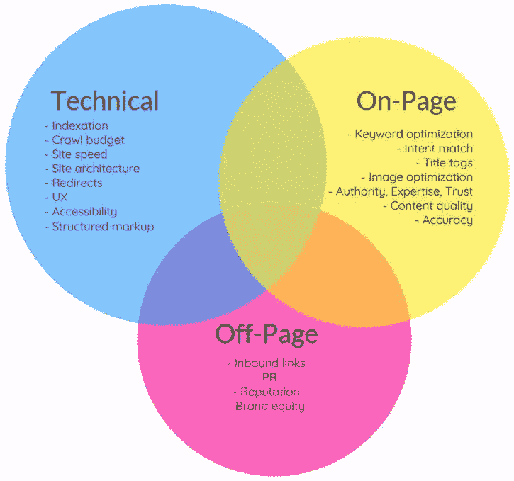
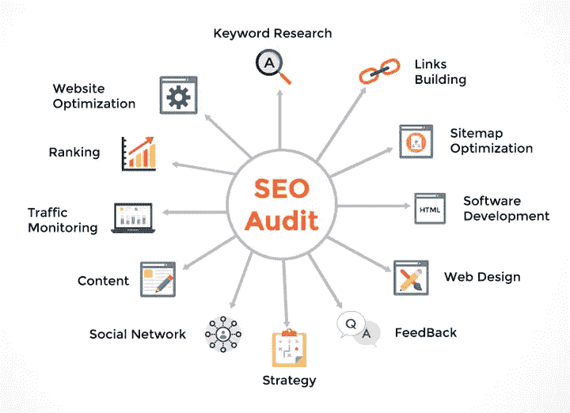
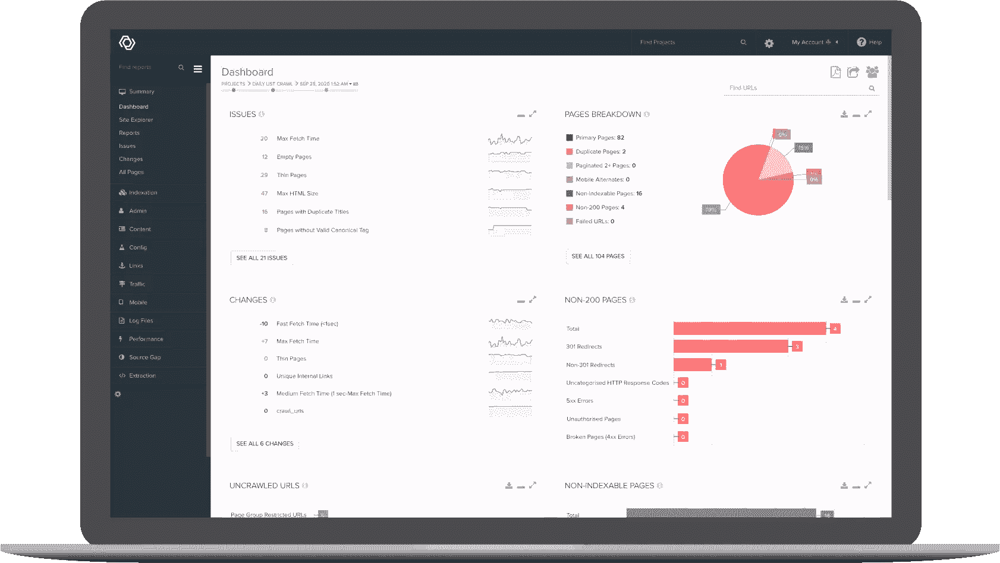
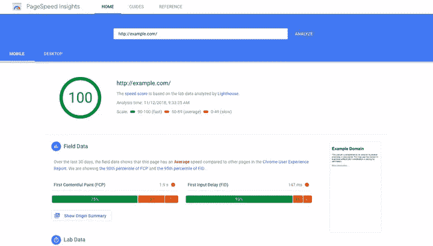

# 完成技术性搜索引擎优化审计的 8 个简单步骤

> 原文：<https://www.sitepoint.com/technical-seo-audit-simple-steps/>

技术搜索引擎优化审计帮助团队了解影响搜索引擎排名的幕后问题，如网站速度、索引和反向链接。SEO 专家对影响页面排名的所有因素有一个全面的了解是很重要的，这样团队就可以采取最好的行动来提高他们的地位。

进行日常的技术搜索引擎优化审计是建立一个伟大的搜索引擎优化战略的关键。但是，如果你还在起步阶段，刚开始在一家新公司工作，或者想学习如何完成一个技术性的搜索引擎优化审计，这可能是压倒性的。

在这篇文章中，我们将通过八个步骤来帮助你完成一个技术性的搜索引擎优化审计，[增加你网页的流量](https://www.sitepoint.com/increase-web-traffic-using-automation/)，并建立你作为一个搜索引擎优化专家的信心。

## 什么是技术搜索引擎优化审计？

大多数人认为的 SEO 就是专家们所说的**页面 SEO** 。这是专业人士优化网站内容的地方，这样它就能有机地呈现给正确的受众。

技术 SEO 不是关于出现在网站上的内容，而是关于用户和搜索机器人如何浏览每个页面的 T2。技术搜索引擎优化审计是指专家使用一份幕后技术元素的清单进行审查和改进，以提高页面在搜索引擎中的排名。

### 技术搜索引擎优化审计包括什么

当搜索引擎优化专家执行技术搜索引擎优化审计时，他们会检查一系列影响网站速度、性能和可用性的因素，并采取措施优化网页。定期，有时是每天的技术搜索引擎优化审计可以帮助专家了解他们可能不知道的技术问题。

<small>图片来源:[WordStream](https://www.wordstream.com/blog/ws/2019/05/28/technical-seo)</small>

SEO 专家和营销团队使用 Google Search Console、Google PageSpeed Insights、web crawlers、mobile crawlers 和索引工具等工具来优化他们的网页，并通过技术 SEO 审核提高搜索引擎排名。

### 何时应该完成技术搜索引擎优化审计

定期完成技术搜索引擎优化审计很重要。一些企业使用技术搜索引擎优化来帮助改善通过网络流量和转换的现金流，所以日常审计是必须的。但是对于博客和个人网站，每周或每月的搜索引擎优化审计就足够了。

除了定期维护，当你搬到一个新的网站，开始为一个新客户做自由职业，或者当你第一次被一家公司雇佣时，你应该总是完成一个技术性的 SEO 审计。当然，当你的排名停滞或下降时，技术性的搜索引擎优化审计也会派上用场。

### 在进行技术搜索引擎优化审计之前，你需要做什么

在你进行技术搜索引擎优化审计之前，你需要做几件事:

1.  **找出你客户的目标是什么**。他们是想提高 SEO，让网页[更容易被用户浏览](https://www.sitepoint.com/how-to-improve-user-experience-with-accurate-user-feedback/)，还是想优化他们网站的性能？
2.  **获得他们的工具和分析**。要执行技术搜索引擎优化审计，你需要能够访问网站的谷歌控制台，性能监测分析，以及任何其他你需要满足你的客户的期望。
3.  **签订书面协议**。无论你是签了一份工作合同还是正在进行的工作，有一份书面协议来解释你将要做什么以及如何去做是很重要的。你还需要免责声明和责任清单，这样你就不会为你控制之外的事情负责。

事先掌握所有这些信息很重要，这样你就可以为工作做准备。例如，如果你在为一家 SaaS 公司工作，你可能会被雇佣来根据他们的行业和业务类型对某些特定的登录页面进行技术搜索引擎优化审计，以便根据他们以前的搜索和用户行为将它们显示在正确的人面前。

<small>图片来源:[搜索引擎登陆](https://searchengineland.com/technical-seo-audit-what-to-look-for-385213)</small>

但是，如果你在一家零售公司工作，你的工作可能是确保页面加载速度快，没有图像问题，以及所有的 4xx 链接重定向到正确的位置。

## 一步一步的指南，以完成技术搜索引擎优化审计

让我们来看看这八个步骤中的每一个，它们将帮助你成功地完成一次技术性的 SEO 审计。

### 1.抓取您的网站

使用一个工具，扫描您的网站，检查有多少网址，多少是可索引的，多少有问题，包括任何阻碍您的网站性能的问题。

<small>图片来源:[deep crawl](https://www.deepcrawl.com/)</small>

对于 Wix 用户来说，Deepcrawl 是专业人士信任的顶级工具，但大多数人开始使用谷歌搜索控制台:

1.  决定使用哪种网站地图格式:XML、RSS、mRSS、Atom 1.0 或 Text。
2.  使用站点地图生成器手动或自动创建站点地图。
3.  将你的站点地图添加到 robots.txt 文件中，或者通过搜索控制台提交给 Google。

### 2.点索引问题

如果网站有谷歌无法抓取的页面，那么它[可能无法被正确索引](https://www.searchenginejournal.com/11-seo-tips-tricks-to-improve-indexation/288521/)。以下是一些常见的索引问题:

*   指数化误差
*   robots.txt 错误
*   网站地图问题

检查网站索引最简单的方法是使用谷歌搜索控制台中的覆盖率报告。它会告诉你哪些页面被索引，为什么其他页面被排除，这样你就可以修复它们。您可能需要优化您的爬网预算，以确保您的页面被定期索引。

### 3.检查页面上的技术元素

尽管页面元素经常被排除在技术搜索引擎优化审计之外，但关注它们被认为是需要解决的基本内务处理。以下是在技术搜索引擎优化审核过程中需要审核的页面元素列表:

*   页面标题和标题标签
*   元描述
*   规范标签
*   `hreflang`标签
*   模式标记

### 4.识别图像问题

图像优化是另一个经常被忽视的方面，它对技术性 SEO 审计至关重要。确保图片没有错误可以在许多方面帮助网站的排名，包括提高加载速度，增加谷歌图片的流量，以及提高可访问性。

确保识别出[技术图像问题](https://www.sitepoint.com/automatically-optimize-responsive-images-in-gatsby/)，例如:

*   破碎的图像
*   图像文件太大
*   链接到 HTTP 图像的 HTTPS 页面
*   缺少`alt`文本

### 5.分析内部链接

接下来，分析内部联系很重要。确定需要重定向的 4xx 状态代码。如果有任何没有内部链接的孤立页面，找出并解决它们。

### 6.检查外部链接

接下来，移动到外部链接。外部链接很重要，因为它们使网站对用户和搜索引擎更可信。确保所有的反向链接都是活动的，不会导致页面损坏，并检查所有的页面是否有链接。

### 7.测量站点速度和性能

谷歌搜索给予表现好、加载速度快的网站更好的排名位置。

<small>图片来源:[页面速度](https://developers.google.com/speedGoogle)</small>

以下是如何使用 Google PageSpeed Insights 来检查网站的性能:

*   转到 Google PageSpeed Insights 页面。
*   在框中输入您的网页 URL。
*   单击分析并查看结果。

此工具将为您提供总分、字段数据、建议和其他诊断信息，帮助您提高页面速度。

### 8.确保你的网站是移动友好的

最后，确保你审计的网站是移动友好的，反应灵敏的，并且兼容不同的浏览器。谷歌青睐于响应迅速的网页，无论用户使用何种设备，这些网页都易于加载和浏览。

这里有一个 CryptoWallet.com 如何使用移动和网络友好设计的例子:

<small>网页浏览</small>

<small>移动滚动视图</small>

使用像[Responsive Web Design Checker](https://responsivedesignchecker.com/)这样的工具或者使用 Google Chrome 中的以下步骤，很容易检查网站的响应性:

*   在谷歌浏览器中打开网页。
*   右键打开菜单，选择**检查**。
*   点击**切换设备**工具栏，查看网站在屏幕和手机上的外观。

## 包扎

技术搜索引擎优化审计有助于优化网站，让用户和索引机器人更容易理解。进行技术搜索引擎优化审计涉及到很多元素，但这八个步骤可以帮助您简化工作流程，让您不会错过任何东西。

## 分享这篇文章