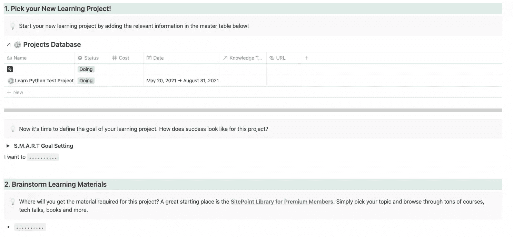
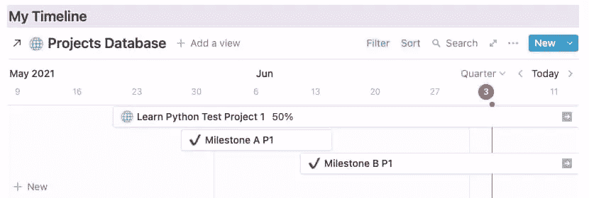
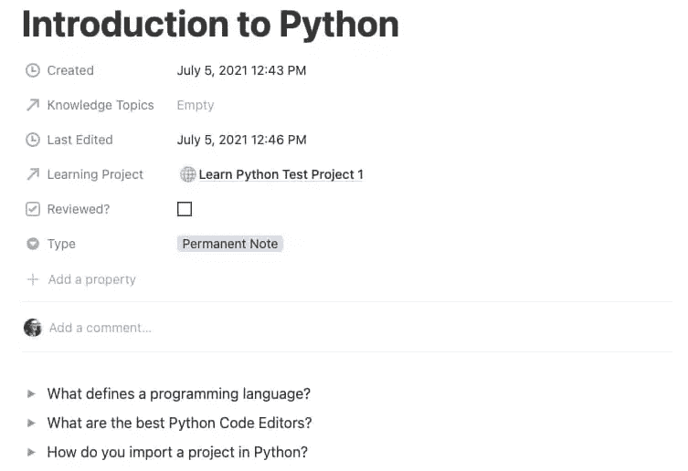
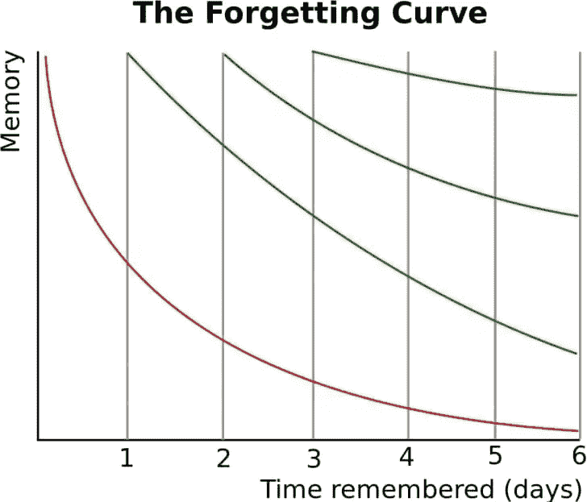
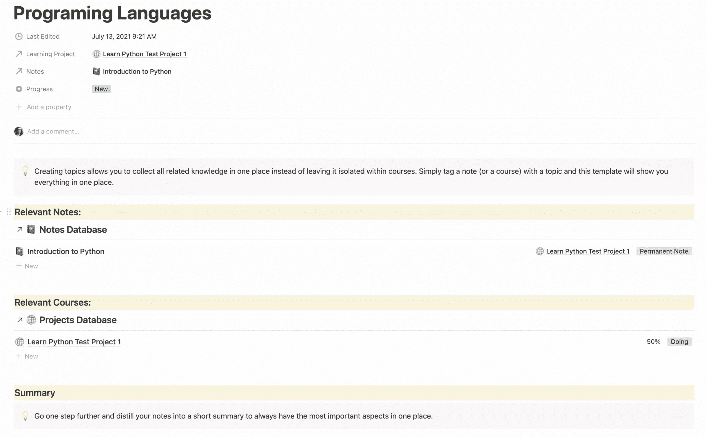

# 如何学习任何东西:超级学习初学者指南

> 原文：<https://www.sitepoint.com/how-to-learn-anything/>

我们的世界变化比以往任何时候都快。仅仅在 20 年前，今天的许多工作都是无法想象的。这带来了某种困境。如果你不知道明天需要什么，你应该专注于哪项技能？答案:[学会如何学习](https://matthiasfrank.de/learning/)。能够学习一项新技能对于跟上我们周围的变化至关重要，而*超学习*为此提供了一个很好的方法。

可惜学的好很少有人教。说到学习，我们大多数人都有不好的习惯。

在这篇文章中，我们将为你提供 3 个基于研究的学习策略，它们是每一次学习努力的关键。我们将向您介绍超学习框架，这是一种由[斯科特·扬](https://www.scotthyoung.com/)开发的学习方法，为如何在正规教育之外构建学习项目提供了有益的指导。

更重要的是，你将学习如何在[观念](https://www.notion.so/)中实施这些策略，这是一个强大的笔记工具。

## 1.如何开始你的超学习项目

首先要做的是:设置。

当谈到学习任何东西时，你的第一个冲动可能是开始做你试图学习的事情。你开始阅读这本书，解决问题或者写抽认卡。

在他的书 [Ultralearning](https://www.amazon.com/Ultralearning-Master-Outsmart-Competition-Accelerate-ebook/dp/B07K6MF8MD) (这篇文章所基于的工作)中，斯科特·扬阐明了为什么这是一个次优的方法。

想想看:你可能对你将要学习的主题了解有限(否则，你就不必了解)，所以很有可能，你也不知道学习它的最佳方法。

在传统教育中，官方课程会明确告诉你什么时候做什么，所以你习惯于不自己计划学习项目。当你在学校或大学之外开展自己的超学习项目时，首先开始做这项工作是至关重要的。

在学习项目中思考，不仅会让你的其他努力更加有效。这也将大大增加责任感，使你能够计划你的活动，并鼓励目标设定，这是一个创造动力和注意力的好方法。

在像开发人员这样拥有高度细分技能的职业中，这是一件特别重要的事情。没有一个清晰的路线图，很容易迷失在你可以学习的无数不同的事物中。

所以在开始的时候花些时间来澄清:你打算学什么？就像在传统的项目管理中，如果你不首先定义“做得好”是什么样子，就很难把事情做好。

幸运的是，对于这种计划来说，观念是一个神奇的工具。把它当成你所有学习项目的一站式商店。在我们的 SitePoint Ultralearning 模板中，我们为一个新项目设置了一个逐步安装指南，以确保您不会跳过这个至关重要的第一阶段。

### 先做你的研究

但是如果一切都是新的和不熟悉的，你怎么能定义你的项目呢？

这就是研究和所谓的元学习的用武之地。

把元学习看作是一项前期时间投资，它会让你所有其他的学习活动变得更有效率。

在这一步，你的目标是找出:

*   你到底想学什么——你这个项目的目标是什么？是为了写科学论文吗？编程一个 App？创建网页？尽可能具体。你可能不只是想“了解 HTML”，你想用它做点什么。
*   其他人用什么策略、材料和作业来实现这个目标？有大量的材料，并不是所有的学习资源都是平等的。幸运的是，SitePoint 已经为未来的开发者准备了一份令人惊叹的资源列表，所以这是一个很好的起点
*   你会在自己的学习项目中使用哪些材料？

要在观念中做到这一点，直接进入我们的 [SitePoint Ultralearning 模板](https://sitepointdotcom.notion.site/SitePoint-Ultralearning-Template-d089e951d37b4ab2a79c547f8680981d)，导航到 ***项目数据库*** ，点击 ***New*** 并从可用模板列表中选择***New Learning Project***。

这将为您的新学习项目建立一个独特的项目仪表板。更好的是:它有一个专门的设置阶段，将带你一步一步地通过这个阶段。

### 从项目管理剧本中抽出一页，并对其进行安排

一旦你做了调查，对你的目标和如何达到目标有了更好的想法，就该计划项目的细节了。

为你的项目创建一个总的时间表是很重要的。时间限制会增强你的纪律性，帮助你避免承担太多不同的任务。

如果你不确定某件事要花多少时间，不要担心。通过一些研究，你将能够得到一个初步的估计，一旦你完成了一两个超学习项目，你会在计划(和执行)方面越来越好！).

那么你到底应该计划些什么呢？以下列细节为目标:

*   你打算什么时候完成你的项目？你每天有多少时间可以投入到这个项目中？
*   接下来，将你的项目分解成更小的里程碑。作为一个经验法则，目标是在大约 2-4 周的项目持续时间内有一个里程碑。你可以比这更细化，但也不能更细。
*   一旦你有了里程碑，确定在你的超学习项目中发生的任何任务或固定事件。需要在特定的时间通过测试吗？或者有什么预定的活动吗？
*   最后，组织你的日常生活。拿出你的日历，把每周为你的学习项目留出的时间窗口都挡在外面。有两种方法可以解决这个问题。你可以选择一个固定的输出(“我需要阅读 15 页，每天做 2 个练习”)或者一个固定的输入(“我需要为此工作 2 个小时”)。如果你有兴趣了解更多关于如何组织学习周的信息，请查看这篇文章。

如果您使用的是 SitePoint Ultralearning 模板，那么设置它是轻而易举的事情。

在一个新的 Ultralearning 项目的设置部分，你会发现一个专门讨论里程碑和任务的部分。通过简单的拖放，您将能够快速安排一切。

之后，你可以切换到观念的时间表视图，以始终跟上速度。

## 2.如何更好地学习(科学)

既然你已经有了超学习项目的计划，是时候开始执行了。

细节总是取决于你的目标，但是有一些通用的指导方针来确保你最大限度地利用你的学习时间。

毕竟，没有什么比投入大量时间学习却看不到任何切实的进步更令人沮丧的了。遵循以下规则，避免这种情况并有效地学习:

### 这和你的投入没多大关系

关于学习有一个很大的误解，它经常阻碍我们的进步。

我们试图通过消耗材料来学习。

这种误解很大程度上源于正规教育中信息呈现给我们的方式。我们拿到手里的书、报告和论文，被告知要“研究它们”但这不是一种有效的学习方法。

看，你实际上并没有学到太多东西去适应你的大脑——这都是为了从大脑中获取信息。

2011 年的一项研究将学生分成了四组。

*   第一个人被允许阅读一次材料
*   第二个把材料读了四遍
*   第三个在看了一遍后创建了思维导图
*   第四组试着回忆材料的内容——一次。

第四组远远超过所有组。努力记住你读过的内容比再读三遍更有效。所谓主动练习是有效学习的关键。

当然，为了熟悉一个主题，你需要读一本书或听一场讲座。但是不要把接触新信息和实际学习新信息的过程混为一谈。

这对你的超学习项目意味着什么？

抛弃被动学习，积极实践。不要重读笔记，而是回答问题、解决练习题或完成编码挑战。

在概念中，您可以在 SitePoint Ultralearning 模板的 ***Notes*** 部分中轻松实现这一点。不要只是抄录其他材料，而是专注于写下问题。

多亏了概念中的切换功能，你可以隐藏答案，稍后再自测。

### 所有的理论都是灰色的，我的朋友

当我们把大部分学习进度集中在某个事物背后的理论上时，一个相关但略有不同的问题出现了。

同样，这是一种我们熟悉的学习方式。但问题是，我们(通常)不想积累理论知识。我们的目标是在现实世界中做一些事情。

很有可能，你现实生活中的应用程序不会是“快速阅读教科书并收集信息”，而是“建立一个网页”或“编写一个应用程序”

这并不是说你应该忽略你所选择的超学习项目的理论背景，一头扎进实验中。但值得记住的是，你实际上需要从一个项目中得到什么，通常情况下，这不是参与学术玩笑的能力(如果是，那么你可能想放松实践部分，在概念中实现一个[学术写作系统)。](https://matthiasfrank.de/academic-writing-in-notion-with-template/)

你的学习活动应该尽可能地与你的预期目标相匹配(所谓的直接实践)。在勾画你的超学习项目时要记住这一点，不要把精力浪费在对你没有任何用处的事情上。

从计划阶段就开始审视你的目标。你如何设计尽可能符合这个目标的练习？如果你想编写一个 iPhone 应用程序，练习编写 iPhone 应用程序。

当在 idea 中设置您的超学习项目时，请确保您的里程碑和任务与您的特定目标一致。如果你计划编写一个应用程序，不要只把“完成前三次应用程序设计讲座”作为一个里程碑。相反，选择类似“在 Figma 中创建应用程序 UI 大纲”或“设置示例前端”的东西

### 反馈和练习对成功至关重要

如果你围绕直接练习和积极练习来设计你的超学习项目，那么你已经有 80%的把握了。

最后的 20%并不重要，但是它们可以帮助你真正利用你的其他活动。你会问，那是什么？反馈和练习。

反馈就是将你的结果与期望的结果进行比较的过程。这在理论上听起来很容易，但实际上可能很难。好的反馈是:

*   与你的练习相关
*   尽可能快地
*   清楚地识别弱点

如果你看到反馈不好的例子，这就更容易理解了。如果你在写一篇论文或做多项选择测试，而你最终得到的只是一个最终分数，那么反馈是即时的，并且与你的练习相关，但它没有发现任何弱点。

这样的反馈是没有用的。更糟糕的是，它可能是非常有害的。糟糕的反馈会让人误以为你的超学习项目设计正确，从而阻止你寻找好的反馈。

在做你的超级学习项目时，总是质疑现有的反馈并问你自己:这真的对我有帮助吗？我如何获得更好、更相关的反馈？

演习从不同的角度处理同一个问题。假设你的目标是建立一个网站。有很多不同的事情需要考虑。有网站的设计，一般的用户界面，性能和搜索引擎优化-加上，你知道，实际的编码部分。

如果你只得到对整个产品的反馈，就很难找出你的具体问题。更高级别的反馈必然会忽略一些细节。之所以嘈杂，是因为它把几个技能子集混在了一起。

这就是练习的用处。你把更大的任务分解成小的、独立的部分，然后孤立地练习它们。这不仅提高了反馈的相关性，还将:

*   帮助你训练你的技能，而不需要投入大量的时间来完成任务
*   更快地提高你的技能，因为你可以专注于你最大的弱点，从而增加你的实践的边际效用。

在 SitePoint Ultralearning 模板中保存反馈的最佳位置是 ***注释*** 部分。只需创建一个新的笔记，放入您的反馈，并用相关的 Ultralearning 项目进行标记，就可以始终在正确的上下文中看到您的反馈。

## 3.如何记住更多你学过的东西

所以你计划了你的超学习项目，你知道如何有效地学习。让我们确保你所学的东西确实能坚持下去，并且你能看到长期的进步。

### 不要只是临时抱佛脚

当我们在大学的时候，我们经常遵循“什么都不做——考试前临时抱佛脚——然后忘记”的古老模式。不用说，如果你打算终身学习一项技能，这不是一个理想的方法。

不幸的是，遗忘是我们大脑工作的一个重要方面。随着时间的推移，我们对曾经学过的东西记得越来越少。

不过，有一个解决办法:间隔重复。

看看这个描绘了[艾宾浩斯遗忘曲线](https://en.wikipedia.org/wiki/Forgetting_curve)的图表:

如果你不时重温一些话题，你的记忆力会越来越强。它不仅打破了通常的遗忘模式。随着时间的推移，保持记忆活力所需的重复间隔不断增加。

一旦你完成了几个超学习项目，不要只关注你最新的学习项目。时不时地回去重温一下你已经学过的东西。

SitePoint Ultralearning 模板旨在使这一过程尽可能简单和顺畅。 ***笔记*** 部分会自动重铺你的旧笔记，这样就不会有任何遗漏。一旦你复习完，只需改变小复选框的状态(勾选或取消勾选)，它就会消失，直到下一次复习。

### 建立真正的直觉和掌控

通过每个超学习项目，你将学习一项新技能，并将其添加到你现有的技能清单中。随着拼图的每一块拼图，你对更大图景的理解也会增加。

如果你一直在寻找点与点之间的联系，并从一个项目到另一个项目进行比较，你的直觉将会飙升，你学习的结果将远远超过单个部分。

要做到这一点，要养成一种习惯，定期从具体的项目中推断经验和见解。我们孤立地设计超学习项目，以使进展更加可测量和可预测，但这并不意味着我们的知识应该以同样的方式碎片化。

如果你跳过这一步，那么你就冒着[创造可怕的知识仓库](https://matthiasfrank.de/personal-knowledge-management-for-beginners/)的风险。孤立存在的零碎信息。你可能知道足够多的知识来通过一个专门设计来测试这些知识的测试——但你会在现实世界中努力实现你的目标，因为在现实世界中很少存在主题之间的明确区分。

想象一下，你是一名开发人员，你可以非常非常好地使用 React 或 Bootstrap，但对底层技术(JavaScript 和 CSS)只有非常粗略的理解。当然，你将能够很好地解决标准问题。但是一旦你不得不跳出框框思考，你就被卡住了。但是你所拥有的关于基础技术的每一点信息都会极大地增强你的创新能力。

养成总是把事情联系起来的习惯。一个教训在更大的图景中处于什么位置？您可以创建哪些总体类别来表示几个超学习项目的信息？

在观念上，SitePoint 的超学习模板的知识数据库将帮助你完成这一点。用主题标记你的课程和笔记，在不同的学习项目之间建立联系。不时浏览你的主题，总结你当前的知识。交织不同的课程将极大地放大你所学到的东西，把你最重要的见解放在一个地方总是一个好主意。

## 如何将这一切结合在一起

尽管超学习理念提供了如何构建几乎任何学习项目的通用指南，而不管你的设备如何，使用专用工具可以促进许多手边的挑战。

正如我们在每一课的结尾所展示的,[观念](https://www.notion.so/)是组织你的超学习项目的好地方。如果你以前从未使用过 concept，一开始可能会有点令人生畏——但这就是为什么我们创建了可信的 [SitePoint Ultralearning 模板](https://sitepointdotcom.notion.site/SitePoint-Ultralearning-Template-d089e951d37b4ab2a79c547f8680981d)。

这是一个功能齐全的超学习环境，无需进一步设置即可使用。简单地把它复制到你的工作区，开始头脑风暴一些学习项目。

— [复制 SitePoint Ultralearning 模板](https://sitepointdotcom.notion.site/SitePoint-Ultralearning-Template-d089e951d37b4ab2a79c547f8680981d)

该模板将作为中心枢纽，帮助您养成良好的学习习惯，为您提供指导性的项目创建，并帮助您保持长期知识。

## 分享这篇文章