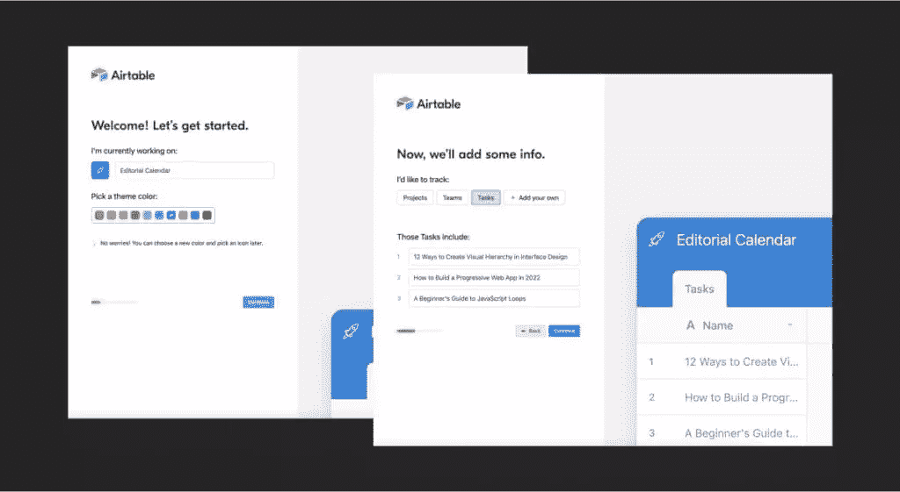
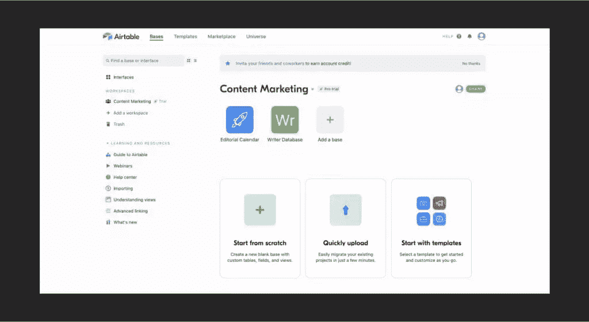
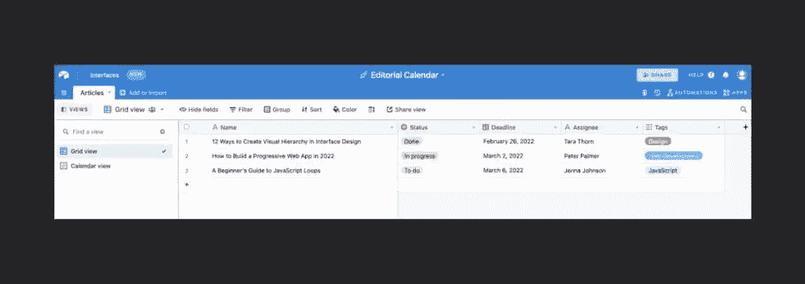
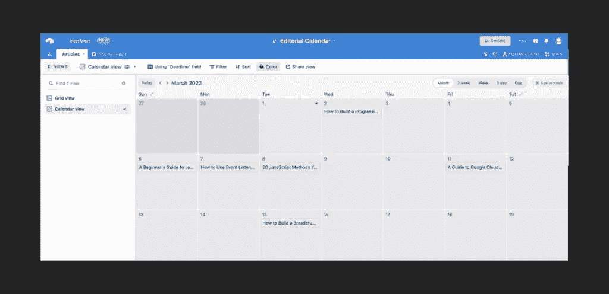
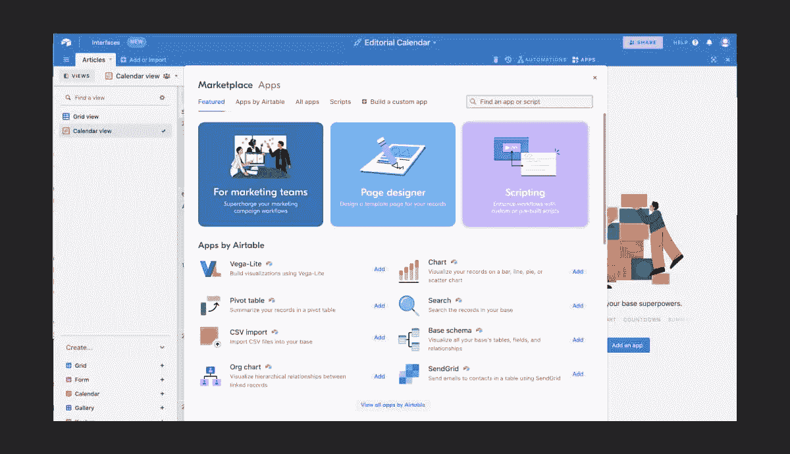
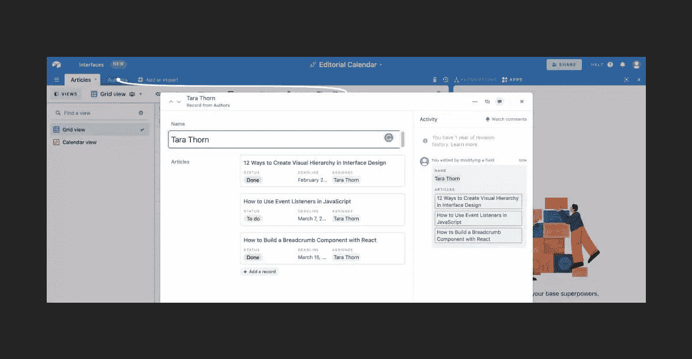

# 如何使用 Airtable:初学者指南

> 原文：<https://www.sitepoint.com/how-to-use-airtable-a-beginners-guide/>

Airtable 是一个基于云的应用程序，它将电子表格和数据库的精华结合到一个协作环境中。

无论是任务列表还是项目，你都可以用 Airtable 管理任何事情。无论您是需要一种组织任务的方式，还是希望能够在不需要协作软件的情况下与其他人一起完成一个项目，Airtable 都可以成为您的首选组织工具。

像[概念](https://www.sitepoint.com/notion-beginners-guide/)这样的应用采用[的自由形式方法](https://www.sitepoint.com/high-output-project-management-in-notion/)来管理信息，结构是 Airtable 的核心。但是不要让这欺骗了你——air table 的特性集、灵活的数据类型和自动化非常强大。

要查看 Airtable 的高级用法，请学习如何使用 Airtable 作为 CMS、Gatsby 和 React 来构建交互式甘特图。

这个 Airtable 教程将带你了解这个工具所提供的一切，并解释它如何使你的生活变得更容易。首先，让我们浏览一下与 Airtable 相关的基本组织结构和词汇。

## **掌握 Airtable 的基础知识**

### **1。在团队工作区内建立基地。**

把你团队的办公室想象成工作空间。在那个办公室里，可能有几个部门甚至团队在进行各种各样的项目。现实生活中的每个项目都是 Airtable 中的一个独立基地。

为什么 Airtable 中的项目都叫“基地”？作为数据库的缩写，每个项目都被设计用来保存信息集。Airtable 附带预设计的模板，并允许您访问其他设计模板的 Airtable 世界。你可以随时上传一个简单的电子表格，或者你甚至可以从头开始设计你自己的基础。

飞行表演队基地

根据你的团队是大是小，或者你有多少项目在进行，你可能会选择在你的企业中有几个不同的工作空间。这完全没问题，而且实际上说明了 Airtable 的另一个特性:它是完全可定制的，能够适应您的结构和工作流。Airtable 可根据您的需求进行弯曲。

### **2。然后，在数据库中设置表和记录。**

在 Airtable bases 里面，你会找到表格，或者某一类东西的列表。您可能有一个任务表或联系人表。表中的每个条目称为一条记录，每条记录都有一组附加的属性，这些属性称为字段。我们刚刚列举的每一层组织——表、记录和字段——都是完全可定制的。你可以选择存储在 Airtable 中的所有内容。

### **3。选择您的视图，或者在最佳视图之间切换。**

Airtable 允许您以无数种方式查看您的记录，包括网格、画廊、看板、日历等等。

你在 Airtable 中存储的信息的视角的灵活性可以帮助你以新的眼光看待事物，激发新的想法或使趋势可见。无论如何，对这些不同视图的访问再次强调了 Airtable 如何让您定制一切以适应您的工作流。

这些视图还可以帮助您构建逻辑，帮助您链接整个数据库中的记录。

### **4。升级到 Airtable 应用程序。**

专业和企业级 Airtable 计划可以访问应用程序，这些应用程序提供更高级的可视化功能(如数据透视表自动化、地图甚至视频)，并集成到其他应用程序中，如 Google Cloud 和第三方插件。

您可能需要来自这些其他服务的 API 密匙，但是随着大多数主要的商业平台和工具向开发人员开放，这变得越来越容易。

### **5。添加协作者。**

您可以邀请其他人作为协作者加入您的基地或工作区。您可以授予每个协作者不同级别的访问权限，从仅查看权限到创建自己的新库的权限。

## **欣赏 Airtable 最受欢迎的功能**

到目前为止，在本 Airtable 指南中，我们已经让您熟悉了与 Airtable 相关的基本结构和术语。既然我们已经介绍了基础知识，让我们考虑一下它提供的一些最酷的特性。

### 跨越不同媒介构建电子表格。

将图像放入您的电子表格中，并使它们可以跨工作表访问！Airtable 采用电子表格并将其完全放大，这样它们就不再是枯燥的严格由字母数字字符组成的行。许多讨厌传统电子表格的人对扔给他们的所有这些字母和数字感到不舒服。

### **利用导入工具标准化您的数据**

从多个来源收集信息从未像使用 Airtable 这样简单。自动导入工具允许您提取数据，完全控制数据填充的字段以及数据的格式。即使您有大量分散在多个地方并以各种方式记录的数据，您也可以使用 Airtable 的导入功能将这些数据集中到您的团队的一站式商店中。

### **颜色编码和其他组织，以提高合规性**

最好的组织技术和规则是那些有效的，但是让一群人参与到制度体系中来是很困难的，如果他们觉得麻烦的话。幸运的是，Airtable 界面是用户友好的，您可以定制的选项可以使 Airtable 比其他工具(如电子表格)更容易理解。

### **创建不同表格中对象之间的关系**

这值得重复，因为它是 Airtable 的一个如此强大的功能。它不仅可以节省时间，确保用户、基地和工作区之间的一致记录，而且与现实世界的逻辑更加一致。

现实世界中的物体和人存在于一个中心位置，尽管它们作为不同团队和其他群体的一部分是很重要的。在你的家庭单位和你的办公室中，没有一个单独的你；还是同一个你，只是接入的环境不同而已。为什么你的数据不会如此呢？嗯，有了 Airtable，就是这样。

停止用线性关系来思考你的数据；那是老派。如今，一切都是关于信息网络，以及轻松导航存在于不同数据之间的关系。

### **完全定制您的通知**

实际上，您可以使用像 Zapier 这样的第三方集成来构建 Airtable 中的工作流。某些动作或条目可以触发其他事件的发生。也许你已经设置了一个日历库，你想知道什么时候有人添加了一个即将到来的事件；您可以设置一个通知，通过您喜欢的任何媒介，尽可能多或尽可能少地共享此条目。

### **自动备份您的数据**

通过构建自动触发数据备份的工作流，节省时间并保护您的信息以备将来使用。你可以把这些备份放在你喜欢的任何地方。通过消除这一备份步骤背后的人为因素，您减少了任何人为错误的潜在影响，并增加了积极的长期结果的可能性。

### 没有“一刀切”的做法

拥有如此强大的能力来定制您的数据存储和组织的每个方面可能会显得力不从心。但这种责任伴随着最大化你的效率和充分优化你的团队工作流程的权力。

### **利用 Airtable 社区支持**

每个人都知道开始使用 Airtable 有一个学习曲线，但即使是最有经验的用户也会发现自己在如何做一些事情上遇到困难。即使你已经找到了做某事的方法，你也可能想知道是否有更好的方法。

幸运的是，Airtable 产品背后的合作和增长导向精神贯穿了它的用户社区。就好像你有一个巨大的数据库(看我们在那里做了什么？)的 Airtable 开发人员随时听候您的召唤。您可以浏览现有的讨论或发布您自己的问题，以获得您渴望的见解。Airtable 温和派，所以你会看到他们加入他们的“官方”观点。

当然，Airtable 的产品开发团队正在努力工作，确保它不断变得更好。当您使用 Airtable 时，您会发现超出本文范围的各种新功能，甚至可能刚刚上线。

你也会想出新的方法来组织你自己和你需要的数据。最后，您可以将数据管理技能和协作无缝集成到您的业务运营中。

## 分享这篇文章