# 建立一个具有傀儡和无服务器功能的链接预览器

> 原文：<https://www.sitepoint.com/puppeteer-serverless-functions-link-previewer/>

在本教程中，我们将了解如何在前端应用程序中部署无服务器功能，并创建一个 API 来生成图像并从链接中获取元数据。

有了无服务器功能，开发人员可以在他们的应用程序中创建和实现现代的特性和功能，而不必经历设置和管理后端服务器的痛苦。这些功能由云计算公司托管和部署。

[网络功能](https://www.netlify.com/products/functions/)使得在[网络功能](https://www.netlify.com/)上运行的应用程序可以轻松创建和部署无服务器功能。

## 先决条件

要跟随本教程，你需要熟悉 JavaScript、 [Vue.js](https://vuejs.org/) 、Git、GitHub 和 [Netlify](https://www.netlify.com/) 。你还应该有一个文本编辑器——比如安装了 [Vetur](https://marketplace.visualstudio.com/items?itemName=octref.vetur) 的[VS Code](https://code.visualstudio.com/)——并且在你的机器上安装了一个最新版本的 Node。你可以在这里安装节点[。您可以通过在终端中运行命令`node -v`来检查 Node 的版本。](https://nodejs.org/en/download/)

你也应该在 Netlify 上有一个帐户。如果您还没有创建一个，您可以[创建一个。](https://app.netlify.com/signup/email)

## 我们正在建造的东西

为了展示我们如何通过前端应用程序轻松设置无服务器功能，我们将构建一个带有自定义链接预览器组件的应用程序。

该组件向我们的无服务器函数发送一个带有 URL 的请求。然后，该函数使用 Puppeteer 通过 URL 从目标站点获取元数据，并生成该站点的屏幕截图。

该函数将元数据和截图发送回我们前端的组件，以在应用程序中显示为链接预览。

这里是部署在 Netlify 上的[示例项目的链接。下面是需要跟进的](https://lnkpreviewr.netlify.app) [GitHub 回购](https://github.com/miracleonyenma/link-previewer)。

## 创建和设置 Vue 应用程序

我们将使用 [Vue CLI](https://cli.vuejs.org/) 创建一个 Vue 3 应用程序。我们还将安装和设置 [Tailwind CSS](https://TailwindCSS.com/) ，这是一个实用程序优先的 CSS 框架，它提供了我们可以在应用程序中使用的类，而无需编写大量自定义 CSS。

### 安装和设置 Vue

为了快速搭建 Vue 应用程序，我们将使用 Vue CLI。要安装 Vue CLI，请运行:

```
npm install -g @vue/cli 
```

一旦安装了 CLI，我们就可以通过运行以下命令来[创建项目](https://cli.vuejs.org/guide/creating-a-project.html#vue-create):

```
vue create link-previewer 
```

这将提示我们为我们的安装选择一个预置。我们将选择“手动选择功能”，这样我们就可以选择我们需要的功能。以下是我选择的选项:

```
Please pick a preset: Manually select features
? Check the features needed for your project: Choose Vue version, Babel, PWA, Router, Vuex, Linter
? Choose a version of Vue.js that you want to start the project with: 3.x
? Use history mode for router? (Requires proper server setup for index fallback in production) Yes
? Pick a linter / formatter config: Basic
? Pick additional lint features: Lint on save
? Where do you prefer placing config for Babel, ESLint, etc.? In dedicated config files 
```

选择这些选项后，系统会询问我们是否要将选项保存为预设以备后用。选择`Y`(是)或`N`(否)，继续安装。

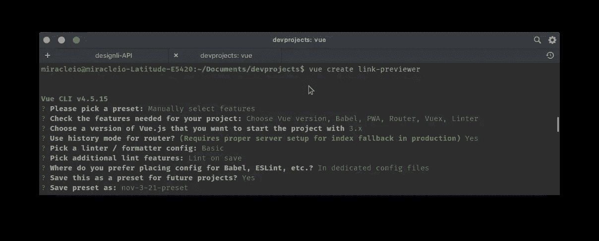

运行`cd link-previewer`进入新创建的项目。

### 安装和设置顺风 CSS

为了安装 Tailwind，我们将使用 [PostCSS 7 兼容性版本](https://TailwindCSS.com/docs/installation#post-css-7-compatibility-build)，因为 Tailwind 依赖于 PostCSS 8——在撰写本文时，Vue 3 还不支持 PostCSS 8。卸载任何以前的 Tailwind 安装，并重新安装兼容性版本:

```
npm uninstall tailwindcss postcss autoprefixer
npm install -D tailwindcss@npm:@tailwindcss/postcss7-compat postcss@^7 autoprefixer@^9 
```

#### 创建顺风配置文件

接下来，生成`tailwind.config.js`和`postcss.config.js`文件:

```
npx tailwindcss init -p 
```

这将在项目的根目录下创建一个最小的`tailwind.config.js`文件。

#### 配置顺风以移除生产中未使用的样式

在`tailwind.config.js`文件中，用所有页面和组件的路径配置`purge`选项，这样 Tailwind 就可以在产品构建中对未使用的样式进行树抖动:

```
// ./tailwind.config.js
module.exports = {
  purge: ['./index.html', './src/**/*.{vue,js,ts,jsx,tsx}'],
  ...
} 
```

#### 在 CSS 文件中包含顺风

创建`./src/assets/css/main.css`文件并使用`@tailwind`指令来包含顺风的`base`、`components`和`utilities`样式:

```
/* ./src/assets/css/main.css */
@tailwind base;
@tailwind components;
@tailwind utilities;

body{
  @apply bg-gray-50;
} 
```

Tailwind 会在构建时将这些指令与它基于配置的设计系统生成的所有样式交换。

最后，确保 CSS 文件被导入到`./src/main.js`文件中:

```
// ./src/main.js
import { createApp } from 'vue'
import App from './App.vue'
import './registerServiceWorker'
import router from './router'
import store from './store'
import './assets/css/main.css'

createApp(App).use(store).use(router).mount('#app') 
```

就这样，我们可以运行我们的服务器:

```
npm run serve 
```

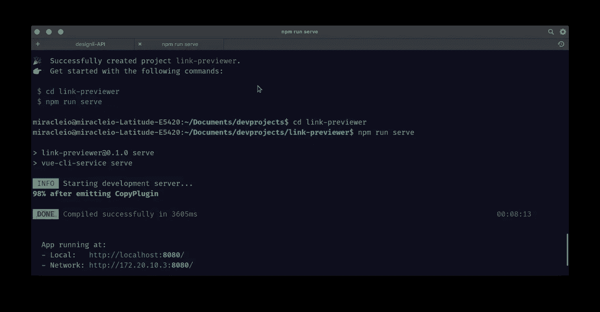

现在，应用程序正在运行，如果我们转到提供的 URL，我们应该会看到 Vue 的默认演示应用程序，并看到 Tailwind 的[预检基本样式](https://tailwindcss.com/docs/preflight)已经应用。

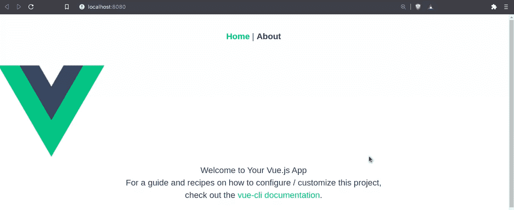

#### 安装顺风 CSS 智能感知扩展

为了更流畅的开发体验，为 VS 代码安装 [Tailwind CSS 智能感知扩展](https://marketplace.visualstudio.com/items?itemName=bradlc.vscode-tailwindcss)。

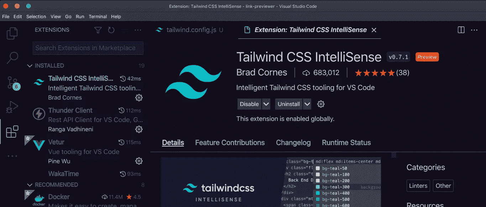

### 基本应用程序结构

下面是我们的项目文件夹应该是什么样子的概述:

```
link-previewer/
├─ functions/
│  ├─ generate-preview.js
│  └─ hello.js
├─ public/
│  ├─ favicon.ico
│  ├─ img/
│  │  └─ icons/
│  ├─ index.html
│  └─ robots.txt
├─ src/
│  ├─ main.js
│  ├─ App.vue
│  ├─ registerServiceWorker.js
│  ├─ assets/
│  │  ├─ css/
│  │  │  └─ main.css
│  │  └─ logo.png
│  ├─ components/
│  │  └─ LinkPreviewer.vue
│  ├─ router/
│  │  └─ index.js
│  ├─ store/
│  │  └─ index.js
│  └─ views/
│     ├─ About.vue
│     └─ Home.vue
├─ .git
├─ .gitignore
├─ .browserslistrc
├─ .eslintrc.js
├─ babel.config.js
├─ netlify.toml
├─ package-lock.json
├─ package.json
├─ postcss.config.js
├─ README.md
└─ tailwind.config.js 
```

## 网络功能快速介绍

[Netlify Functions](https://www.netlify.com/products/functions/) 是一个 Netlify 产品，它简化了创建和部署无服务器功能的过程。根据该产品的主页，它用于:

> 部署作为 API 端点的服务器端代码，自动运行以响应事件，或在后台处理更复杂的作业。

基本网络功能文件使用以下语法导出处理程序方法:

```
exports.handler = async function(event, context){
  return {
    statusCode: 200,
    body: JSON.stringify({message: "Hello World!"})
  }
} 
```

当函数被调用时，Netlify 提供`event`和`context`参数。当一个函数的端点被调用时，`handler`接收一个`event`对象，如下所示:

```
{
  "path": "Path parameter (original URL encoding)",
  "httpMethod": "Incoming request’s method name",
  "headers": {Incoming request headers},
  "queryStringParameters": {Query string parameters},
  "body": "A JSON string of the request payload",
  "isBase64Encoded": "A boolean flag to indicate if the applicable request payload is Base64-encoded"
} 
```

另一方面，`context`参数包含关于调用函数的上下文的信息。

在函数中，我们返回一个具有两个重要属性的对象:

*   `statusCode`，本例中为`200`
*   `body`，这是一个*字符串化的*对象。

该函数将在`/.netlify/functions/hello`从我们的站点被调用，如果成功，它将返回 200 状态代码和消息，“Hello，World！”。

现在我们对网络函数的工作原理有了一个概念，让我们看看它们的实际应用。

## 创建我们的第一个网络函数

为了创建我们的第一个 Netlify 函数，我们将在项目目录中创建一个新文件`functions/hello.js`,并输入以下内容:

```
// functions/hello.js
exports.handler = async function(event, context){
  return {
    statusCode: 200,
    body: JSON.stringify({message: "Hello World!"})
  }
} 
```

一旦我们创建了函数文件，我们必须进行一些必要的配置，以便在本地运行我们的函数。

### 设置网络配置

我们将在项目文件夹的根目录下创建一个`netlify.toml`文件，它将告诉 Netlify 在哪里可以找到我们的函数:

```
# ./netlify.toml

[functions]
  directory = "./functions" 
```

Netlify 现在将在构建时定位并部署`functions`文件夹中的函数。

## 安装 Netlify CLI

为了在本地运行我们的功能而不必部署到 Netlify，我们需要安装 [Netlify CLI](https://docs.netlify.com/cli/get-started/) 。CLI 允许我们在本地部署具有一些优秀网络特性的项目。

要安装 CLI，请确保您拥有 [Node.js](https://nodejs.org/en/download/) 版本 10 或更高版本，然后运行:

```
npm install netlify-cli -g 
```

这将全局安装 Netlify CLI，因此我们可以从任何目录运行`netlify`命令。要获得版本、用法等信息，我们可以运行:

```
netlify 
```

## 使用 Netlify Dev 运行应用程序

要使用 Netlify CLI 在本地运行我们的项目，请停止 dev 服务器(如果它是活动的)，然后运行:

```
netlify dev 
```

这是我们应该看到的:

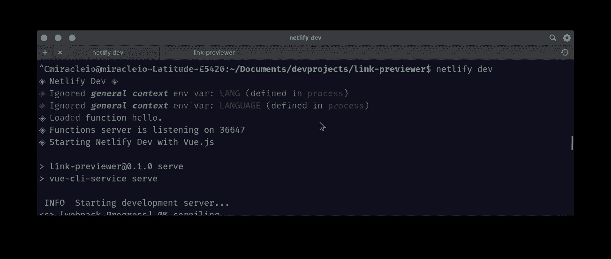

如果你仔细观察，你会发现那里发生了一些事情:

*   Netlify 试图将环境变量从我们的`.env`文件注入到构建过程中，然后这些变量可以被我们的 Netlify 函数访问。在这种情况下，我们没有`.env`文件，所以它加载在`process`中定义的默认值。

*   其次，它加载或部署位于函数目录中的函数。功能服务器部署在不同的随机端口上— `36647`。

*   最后，它会自动检测应用程序是用什么框架构建的，并运行必要的构建过程来部署应用程序。这种情况下可以看到“用 Vue.js 启动 Netlify Dev”。它还支持 React 和其他流行的框架。

然后 Netlify 在`http://localhost:8888`启动我们的开发服务器。

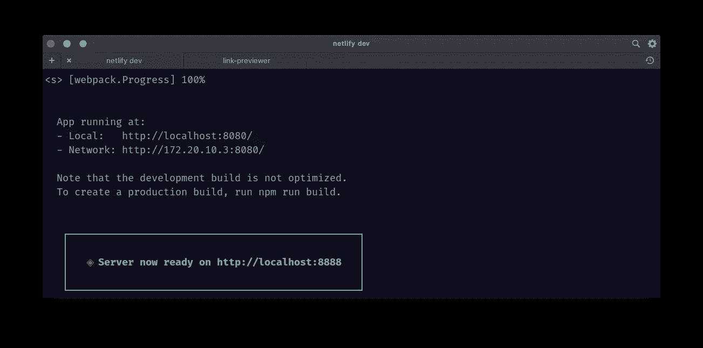

现在我们的服务器已经启动，我们的函数已经加载，我们可以调用它了。默认情况下，我们可以使用这个路径来访问我们的函数:`/.netlify/functions/<function name>`。

需要注意的重要一点是，我们不需要指定函数服务器运行的端口。我们可以使用上面的默认路由与我们的函数服务器通信。Netlify 在后台自动解析 URL 和端口。

如果我们向[发送一个`GET`请求 http://localhost:8888/。netlify/functions/hello](http://localhost:8888/.netlify/functions/hello) ，我们应该会得到`{"message":"Hello, World!"}`的响应。


太好了！我们的第一个无服务器功能成功了！

## 创建预览功能 API

现在我们的 Netlify 函数工作了，我们可以开始构建预览 API 了。下面是我们的函数 API 将要做的事情的简要概述:

*   它接收将从前端发送的目标 URL
*   它将数据传递给木偶师
*   然后，木偶师启动一个新的无头浏览器实例
*   木偶师在浏览器中打开一个新页面并导航到目标 URL
*   然后，木偶师提取`<title>`和`<meta>`标签的内容来描述目标页面
*   它捕获了页面的一个截图
*   它将截图数据发送回前端

既然我们对函数 API 要做什么有了基本的概念，我们就可以开始创建函数了。让我们从为网络功能安装和设置木偶师开始。

### 安装和配置木偶师

[puppeter](https://pptr.dev/)是一个节点库，它提供了一个高级 API 来控制无头 Chrome 或 Chromium 浏览器。它也可以配置为使用全(非无头)铬或铬。您可以使用 Puppeteer 在浏览器中手动完成大多数事情。关于木偶师的更多信息可以在木偶师文档中找到。

为了开始使用木偶师，我们将把它安装在我们的项目中。

#### 当地发展和生产木偶艺人

Puppeteer 下载了一个最新版本的 Chromium(大约 170MB 的 macOS，大约 282MB 的 Linux，大约 280MB 的 Windows)，它保证可以与 API 一起工作。

我们不能使用完整的`puppeteer`包进行生产。这是因为 Netlify Functions 的最大大小是 50MB，Chromium 包太大了。

多亏了 [Ire Aderinokun](https://ireaderinokun.com/) 的这篇[非常有用的文章](https://bitsofco.de/how-to-use-puppeteer-in-a-netlify-aws-lambda-function/)，我们仍然可以在本地和制作中与木偶师合作。我们要做的是:

将`puppeteer`作为*开发依赖* *进行本地部署:

```
npm i puppeteer --save-dev 
```

为了让木偶师在本地和生产中都能工作，我们必须安装[木偶师核心](https://www.npmjs.com/package/puppeteer-core)和`chrome-aws-lambda`作为*生产依赖*。

你可以在这里查看`puppeteer`和`puppeteer-core`T3 的区别。然而，主要的区别在于`puppeteer-core`在安装后不会自动下载 Chromium。

由于`puppeteer-core`不下载浏览器，我们将安装 [chrome-aws-lambda](https://www.npmjs.com/package/chrome-aws-lambda) ，这是一个“用于 AWS Lambda 和谷歌云功能的 Chromium 二进制文件”，我们可以在我们的网络功能中使用它。这些是将在生产中工作的包:

```
npm i puppeteer-core chrome-aws-lambda --save-prod 
```

现在我们已经安装了我们的包，让我们创建我们的函数。

#### 为木偶师使用已安装的浏览器

如果木偶师安装一个完整的浏览器在本地工作会有问题，那可能是由于缓慢的网络或带宽问题。有一个解决方法，就是使用我们已经安装的 Chrome 或 Chromium 浏览器。

我们需要的是本地机器中浏览器的路径。我们将使用它作为我们的`executablePath`，我们将把它传递给`puppeteer.launch()`方法。这告诉 Puppeteer 在哪里可以找到浏览器的可执行文件。

如果你不知道具体在哪里可以找到可执行文件的路径，打开你的浏览器，进入 [chrome://version/](chrome://version/) 显示 chrome 的版本。


复制路径并在项目的根目录下创建一个`.env`文件。

```
# ./.env
EXCECUTABLE_PATH=<path to chrome> 
```

为了获取`.env`文件的内容，我们将安装另一个包— `dotenv`:

```
npm install dotenv 
```

现在我们已经成功地安装了这个包，让我们创建 Netlify 函数。

### 创建生成预览功能

创建一个新文件，`./functions/generate-preview.js`:

```
// ./functions/generate-preview.js

const chromium = require('chrome-aws-lambda')
const puppeteer = require('puppeteer-core')

exports.handler = async function (event, context) {
  // parse body of POST request to valid object and
  // use object destructuring to obtain target url
  const { targetURL } = JSON.parse(event.body)

  // launch browser
  const browser = await puppeteer.launch({
    args: chromium.args,
    // get path to browser
    executablePath: process.env.EXCECUTABLE_PATH || await chromium.executablePath,
    headless: true
  })

  // open new page in browser
  const page = await browser.newPage()

  // set the viewport of the page
  await page.setViewport({
    width: 768,
    height: 425,
    deviceScaleFactor: 1
  })

  // set the prefers-color-scheme to dark
  await page.emulateMediaFeatures([
    {name: 'prefers-color-scheme', value:'dark'}
  ])

  // navigate to target URL and get page details and screenshot
  try{
    ...
  }
} 
```

在上面的代码中，我们做了很多事情。首先，我们从`event.body`中的请求有效负载获得`targetURL`。这将与`POST`请求一起发送。

接下来，我们使用`chrome-aws-lambda`包启动浏览器。我们使用`puppeteer.launch()`方法来实现这一点。这个方法接受一个对象作为带有一些可选属性的参数。我们传递给这个方法的一个重要属性是`executablePath`。

我们将`executablePath`分配给`process.env.EXCECUTABLE_PATH || await chromium.executablePath`,使包能够定位要启动的可用无头浏览器。

一旦浏览器启动，我们使用`browser.newPage()`方法在浏览器中打开一个新页面。我们还使用`page.setViewport()`方法为页面设置了我们想要的浏览器视窗。

注意，我们在运行任何函数时都使用了`await`关键字。这是因为木偶师是异步工作的，有些功能在执行前可能需要一些时间。

我们还可以使用`page.emulateMediaFeatures()`方法用 Puppeteer 定义页面的媒体特性，该方法采用媒体特性对象的数组。这就是我们如何将`prefers-color-scheme`设置为`dark`。

### 获取站点元数据和屏幕截图

接下来，我们将导航到目标 URL 并获取标题、描述和屏幕截图:

```
// ./functions/generate-preview.js

...
// navigate to target URL and get page details and screenshot
try {
  // navigate to the targetURL
  await page.goto(targetURL)

  // get the title from the newly loaded page
  const title = (await page.$eval(`head > title`, el => el.textContent) || null)

  // get the descriptions of the page using their CSS selectors
  const descriptions = await page.evaluate(() => {
    let descriptions = {}

    let desc = document.querySelector(`meta[name='description']`)
    let og = document.querySelector(`meta[property='og:description']`)
    let twitter = document.querySelector(`meta[property='twitter:description']`)

    desc ? descriptions.desc = desc.content : descriptions.desc = null
    og ? descriptions.og = og.content: descriptions.og = null
    twitter ? descriptions.twitter = twitter.content : descriptions.twitter = null

    return descriptions
  })

  // screenshot the page as a jpeg with a base64 encoding
  const screenshot = await page.screenshot({
    type: 'jpeg',
    encoding: 'base64'
  })

  // close the browser
  await browser.close()

  // send the page details 
  return {
    statusCode: 200,
    body: JSON.stringify({
      title,
      screenshot,
      descriptions
    })
  }

} catch (error) {

  // if any error occurs, close the browser instance 
  // and send an error code
  await browser.close()
  return {
    statusCode: 400,
    body: JSON.stringify({
      error
    })
  }
} 
```

在上面的代码中，我们使用了一个`trycatch`块来包装我们的代码，这样，如果出现任何错误，从导航到目标 URL 的`await page.goto(targetURL)`开始，我们可以捕捉错误并将其发送到我们的前端。提供无效的 URL 可能会导致错误。

如果 URL 有效，我们使用`page.$eval()`方法获取标题，这类似于 JavaScript 中常用的`document.querySelector`方法。我们将标题标签的 CSS 选择器——`head > title`——作为第一个参数传入。我们还传递一个函数`el => el.textContent`作为第二个参数，其中`el`是我们传递给函数的一个参数，也是`title`元素。我们现在可以使用`title.textContent`来获取值。

请注意，所有这些都包含在圆括号(`()`)中，并且在`page.$eval`后面还有一个`|| null`。这样一来，如果`page.$eval()`无法获得页面的标题，那么`title`就会被赋值为空。

为了获得页面的描述，我们将使用`page.evaluate()`方法，该方法允许我们运行一些客户端 JavaScript，并将一个值返回给指定的变量— `descriptions`。

我们将一个函数作为参数传递给`page.evaluate()`方法。在函数中，我们使用`document.querySelector`来获取各种元描述，比如`<meta name="description" content="<site description>" />`用于默认描述，而`<meta property="og:description" content="<site description>" />`用于 OpenGraph 描述。

获取元素后，我们使用三元运算符获取`content`，如果元素存在，则将其添加到`descriptions`对象中，如果元素不存在，则添加到`null`对象中。

一旦我们获得了描述，我们就使用`page.screenshot()`方法对页面进行截图，并使用`browser.close()`关闭浏览器。

最后，我们将在`body`属性中发送一个 JSON 对象，其`statusCode`为`200`。如果在前面的任何步骤中出现错误，它会在`catch`块中被捕获，我们会发送一个`400`的`statusCode`和错误消息。

### 测试和部署功能

让我们使用 API 测试器来测试我们的功能。你可以在你的浏览器中安装 [Postman](https://www.postman.com/) 或者 [Talend API tester](https://chrome.google.com/webstore/detail/talend-api-tester-free-ed/aejoelaoggembcahagimdiliamlcdmfm) 或者使用[迅雷客户端扩展](https://www.thunderclient.io/)，一个针对 VS 代码的 API 测试器。

您也可以使用 cURL:

```
curl -X POST -H "Content-Type: application/json" -d '{"paramName": "value"}' <URL> 
```

使用`netlify dev`命令运行该功能。

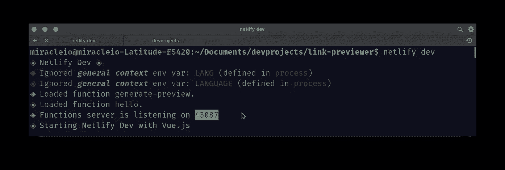

我们可以使用 functions 服务器的端口或 Netlify dev 服务器的默认端口发送一个请求给我们的函数。我将使用`http://localhost:8888/.netlify/functions/generate-preview`来发送一个`POST`请求，该请求带有一个包含`body`中的`targetURL`的对象:

```
{
  "targetURL" : "https://miracleio.me"
} 
```

当我们发送请求时，这里是我们得到的响应。


我们得到一个包含预览数据的 JSON 对象:

```
{
  "title": "Miracleio | PortfolioX",
  "screenshot": "/9j/4AAQSkZJRgABAQAAAQABAAD...",
  "descriptions": {
    "desc": "Designer & Frontend Developer portfolio site. Built by Miracleio with love ❤",
    "og": "Designer & Frontend Developer portfolio site. Built by Miracleio with love ❤",
    "twitter": null
  }
} 
```

现在，我们的无服务器功能工作了，让我们看看如何在我们的前端使用它。

## 在客户端构建链接预览功能

为了与我们的`generate-preview`函数交互，我们需要发送包含我们的`targetURL`的`POST`请求。

我们将创建显示普通链接的`LinkPreview`组件。这些组件将被传递它们的目标 URL 作为道具。在组件安装到应用程序之前，它会向我们的无服务器函数发送一个带有`targetURL`的`POST`请求，获取预览数据，并在我们将鼠标悬停在链接上时显示出来。

### 创建链接预览组件

首先，让我们创建我们的链接预览组件`src/components/LinkPreviewer.vue`。

在我们的`<script>`中，我们将通过向无服务器函数发送请求来获取链接预览数据，并将数据保存在`previewData`对象中。稍后我们将在模板中使用它来显示数据:

```
// ./src/components/LinkPreviewer.vue
...

<script> import { computed, onBeforeMount, ref } from '@vue/runtime-core'
  export default {
    // define targetURL as a prop
    props: ['targetURL'],
    setup(props) {
      // create a reactive previewData object using ref
      const previewData = ref({})

      // function to send a POST request containing the targetURL 
      // to the serverless function
      const generatePreview = async () => {
        try {
          const res = await fetch('/.netlify/functions/generate-preview', {
            method: 'POST',
            body: JSON.stringify({
              targetURL : props.targetURL
            })
          })

          const data = await res.json()
          return data
        } catch (err) {
          console.log(err)
          return null
        }
      }

      // run function before component is mounted
      onBeforeMount(async ()=>{
        // run generatePreview() to get the preview data and assign to previewData
        previewData.value = await generatePreview()

        // use object destructuring to get the different descriptions 
        // from the preview data
        const {desc, og, twitter} = previewData.value.descriptions

        // assign only one valid value to the description property 
        // in the previewData object
        previewData.value.description = computed(()=>(desc || og || twitter || ""))
      })

      // make the following entities available to the component
      return { generatePreview, previewData}
    }
  } </script> 
```

在上面的代码中，我们将`targetURL`作为一个道具传递给我们的组件。

在`setup()`中，我们将`props`作为参数传递，以便访问像`targetURL`这样的组件道具。

然后，我们使用`ref` : `const previewData = ref({})`创建一个反应性的`peviewData`对象。在一个新的`generatePreview()`函数中，我们使用`fetch`向我们的无服务器函数发送一个包含`targetURL`的`POST`请求。如果出现错误，该函数返回响应或`null`。

接下来，为了在组件安装之前运行这个函数，我们使用了`onBeforeMount()`钩子。我们传递一个`async`函数作为参数。在函数中，我们将`previewData.value`分配给`generatePreview()`函数。然后从`descriptions`属性中获取描述(`desc, og, twitter`)。

为了获得将在预览中显示的描述，我们将把`previewData.value.description`分配给`(desc || og || twitter || "")`。这样，第一个有值的属性就被赋给了`description`。

这样做是为了在我们的模板中显示预览数据:

```
<!-- ./src/components/LinkPreviewer.vue -->

<template>
  <div class="inline relative">
    <!-- display targetURL link -->
    <a class="link underline text-blue-600" 
       :href="targetURL" 
       :target="previewData ? previewData.title : '_blank'">
       {{targetURL}} 
    </a>

    <!-- display preview data if object exists -->
    <div v-if="previewData" class="result-preview absolute top-8 left-0 w-72 transform translate-y-4 opacity-0 invisible transition bg-white overflow-hidden rounded-md shadow-lg z-10">

      <!-- display image using the base64 screenshot data -->
      

      <!-- display title and description -->
      <div class="details p-4 text-left">
        <h1 class=" font-extrabold text-xl"> {{previewData.title}} </h1>
        <p> {{previewData.description}} </p>
      </div>
    </div>
  </div>
</template>

<script> ... </script>

<style scoped>
  .link:hover ~ .result-preview{
    @apply visible opacity-100 translate-y-0;
  }
</style> 
```

在上面的代码中，为了显示我们的图像——它本质上是一个`base64`字符串——我们必须将该字符串以及图像类型和编码等数据传递到`src-""`属性中。

这就是我们的`LinkPreviewer.vue`组件。让我们看看它的实际效果。在`./src/views/Home.vue`中:

```
<!-- ./src/views/Home.vue -->

<template>
  <main class="home">
    <header>
      <h1>Welcome to the link previewer app!</h1>
      <p>Here are some links that you can preview by hovering on them</p>
    </header>
    <ul class=" mb-4">
      <!-- render LinkPreviewer component for each demolink -->
      <li v-for="link in demoLinks" :key="link">
        <link-previewer :targetURL="link" />
      </li>
    </ul>
    <!-- input field to add new links -->
    <input class=" p-2 ring ring-blue-600 rounded-lg shadow-md" type="url" @keyup.enter="addLink" required placeholder="enter valid url">
  </main>
</template>

<script>
import { ref } from '@vue/reactivity'
import LinkPreviewer from '../components/LinkPreviewer.vue'

export default{
  components: { LinkPreviewer },
  setup(){
    // demo links
    const demoLinks = ref([
      'http://localhost:5000',
      'https://google.com',
      'https://miracleio.me',
      'https://miguelpiedrafita.com/'
    ])

    // function to add new links to the demoLinks array
    const addLink = ({target}) => {
      demoLinks.value.push(target.value)
      target.value = ""
    }

    return {demoLinks, addLink}
  }
}
</script> 
```

在我们的`Home.vue`文件中，我们基本上使用一个`demoLinks`链接数组来呈现一个`LinkPreviewer`组件列表，我们将它传递给组件的`targetURL`道具。

我们还有一个`<input>`元素，用来动态地向列表中添加更多的`LinkPreviewer`组件。

这是我们简单的应用程序现在的样子。

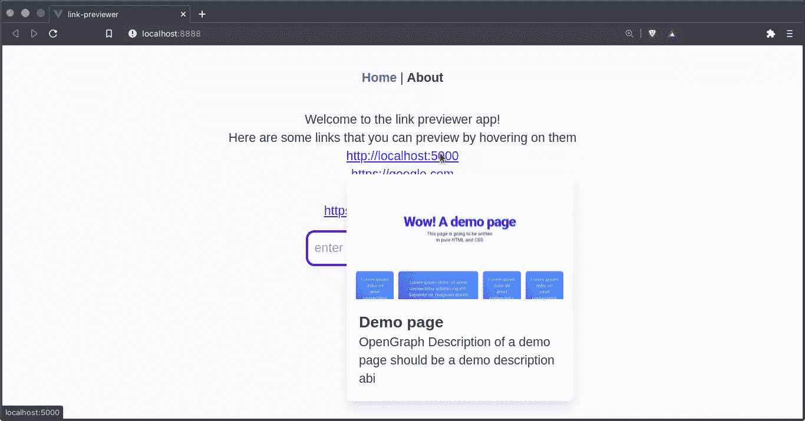

太棒了。我们的应用程序有效。因为我们已经使用 Netlify CLI 在本地运行，所以让我们看看如何使用 CLI 部署到 Netlify。

## 将应用部署到 Netlify

在将我们的应用部署到 Netlify 之前，我们必须为生产构建我们的应用:

```
npm run build 
```

这将构建我们的应用程序并创建一个`dist/`文件夹，我们可以将其部署到生产环境中。

接下来，我们需要登录我们的 Netlify 帐户:

```
netlify deploy 
```

这将使您在浏览器中登录 Netlify 帐户。

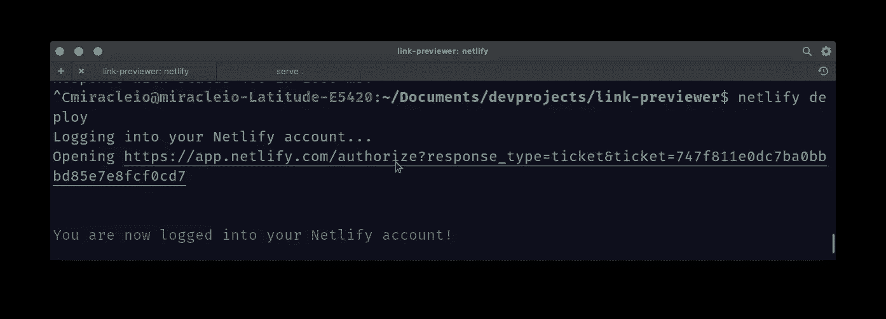

授权应用程序后，我们可以将我们的项目链接到一个新的站点。Netlify 会问我们一堆问题:

*   你想做什么？选择“创建&配置新站点”。
*   **团队？**选择`<your team>`。
*   **选择一个独特的网站名称？**选择`<site name>`。
*   **请提供一个发布目录**(如“public”或“dist”或).输入`dist`。

之后，Netlify 将上传我们的文件并部署到我们的新网站。

### 使用 GitHub 部署

或者，我们可以决定从 GitHub 部署我们的站点。你所要做的就是登录 GitHub，创建一个新的存储库，并将 URL 复制到我们新创建的 repo 中。

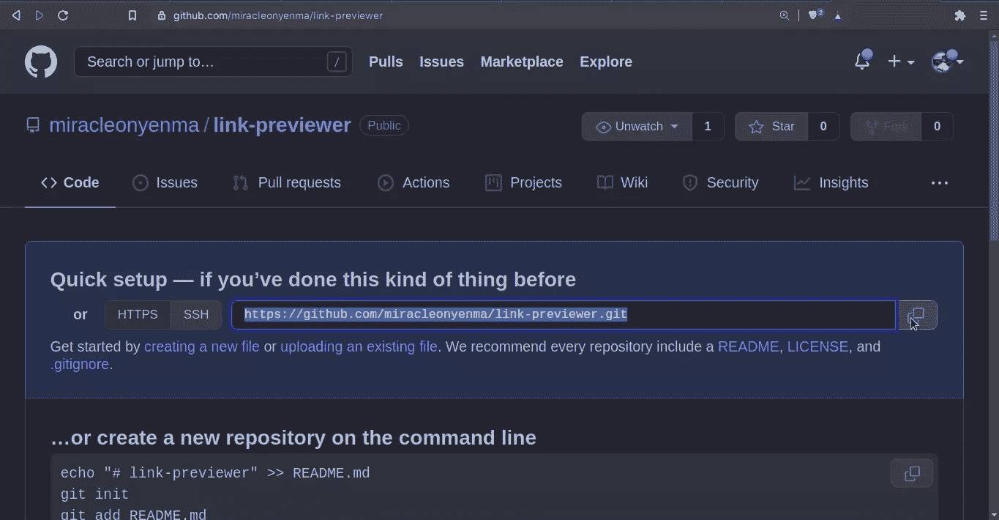

然后，我们在项目文件夹中运行以下命令:

```
git init
git add .
git commit -m "first commit"
git branch -M main
git remote add origin https://github.com/miracleonyenma/link-previewer.git
git push -u origin main 
```

*注意:由于认证问题，您可能无法从您的终端推送您的回购，并且您可能会从 Git 收到如下消息:“对密码认证的支持已于 2021 年 8 月 13 日移除。请改用个人访问令牌。这意味着您必须创建一个个人访问令牌(PAT)并使用它登录。为此，请转到 [GitHub 令牌设置](https://github.com/settings/tokens)并生成一个新令牌。选择所有需要的权限。确保您能够访问回购。生成 PAT 后，将其复制并保存在某个地方。然后再次尝试`git push -u origin main`命令，并在询问您的密码时粘贴您的 PAT。*

一旦我们将项目推送到 GitHub，就去 Netlify[从 GitHub](https://app.netlify.com/start) 创建一个新站点。

按照步骤选择存储库，并输入项目的构建设置。对于我们的 Vue 项目，构建命令是`npm run build`，部署目录是`dist`。

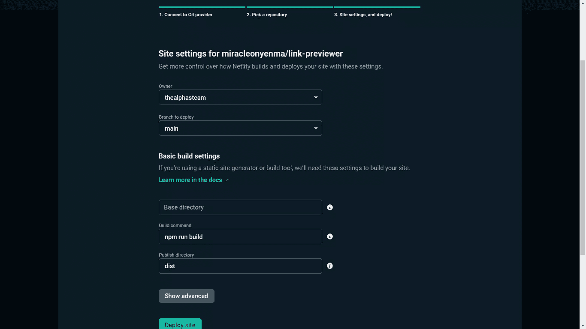

之后，点击**部署站点**。

Netlify 将部署站点，我们可以通过单击提供的部署链接来预览我们的站点。我们可以通过从顶部菜单转到**功能**来查看我们的功能。

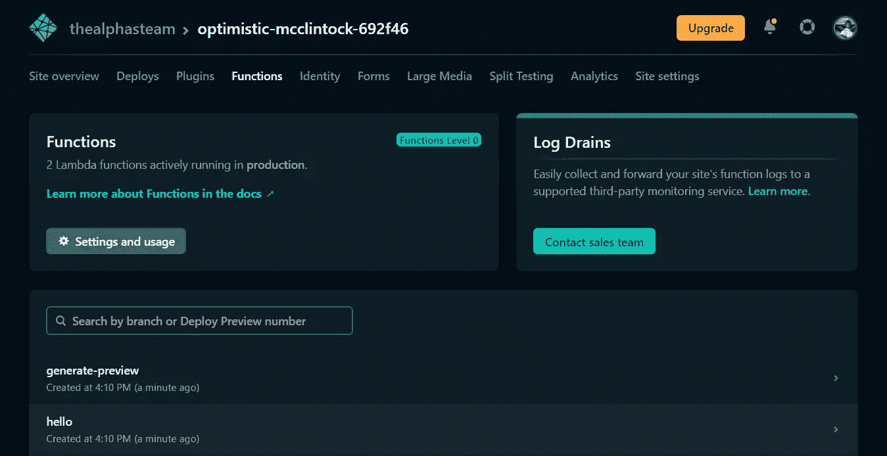

您可以选择一项功能来查看更多详细信息和日志。

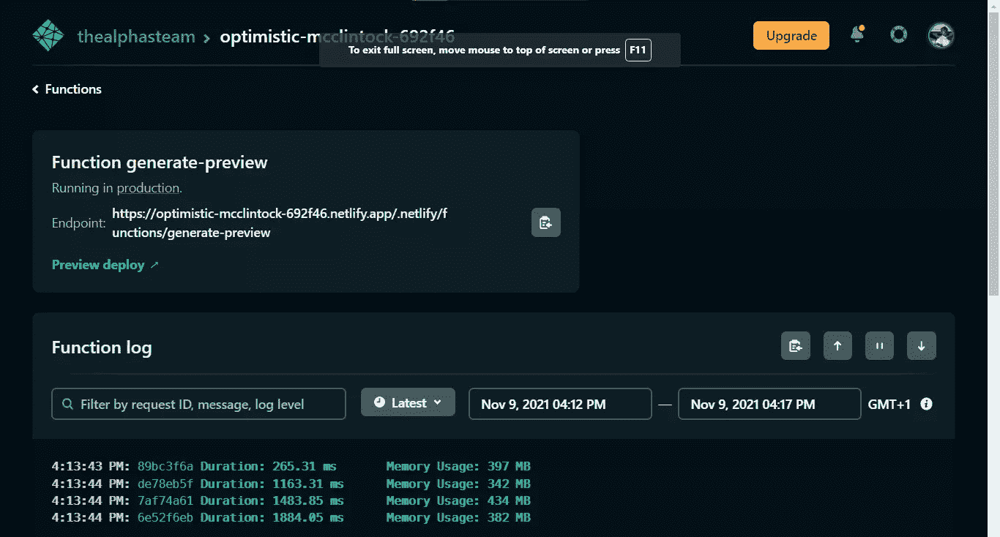

太棒了。

下面是部署在 Netlify 上的演示的链接:[https://lnkpreviewr . Netlify . app](https://lnkpreviewr.netlify.app)

## 结论

我们已经能够使用 Netlify 函数通过 Netlify 创建和部署无服务器功能。我们还了解了如何与 Vue 前端的功能进行交互。这一次，我们习惯了截图和从其他网站获取数据，并用它建立了一个链接预览器组件，但我们可以做得更多。有了无服务器功能，我们可以在前端做更多的事情，而不必设置后端服务器。

## 进一步阅读和资源

以下是一些我认为有用的资源和内容，我想你也会喜欢:

*   [项目 Github 回购](https://github.com/miracleonyenma/link-previewer)
*   [教程–网络功能](https://functions.netlify.com/tutorials/)
*   [启动并运行无服务器功能–jam stack explorer(netlify.com)](https://explorers.netlify.com/learn/up-and-running-with-serverless-functions)
*   [谷歌木偶师开发者入门](https://developers.google.com/web/tools/puppeteer/get-started)
*   [如何在 netlify-aws-lambda 函数中使用木偶师](https://bitsofco.de/how-to-use-puppeteer-in-a-netlify-aws-lambda-function/)
*   [如何使用木偶师在一个具有 Netlify 无服务器功能的 API 中自动化 Chrome——Space Jelly](https://spacejelly.dev/posts/how-to-use-puppeteer-to-automate-chrome-in-an-api-with-netlify-serverless-functions/)

## 分享这篇文章