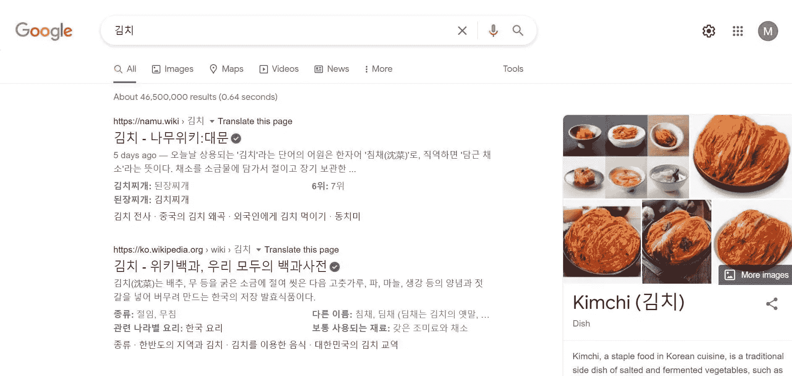
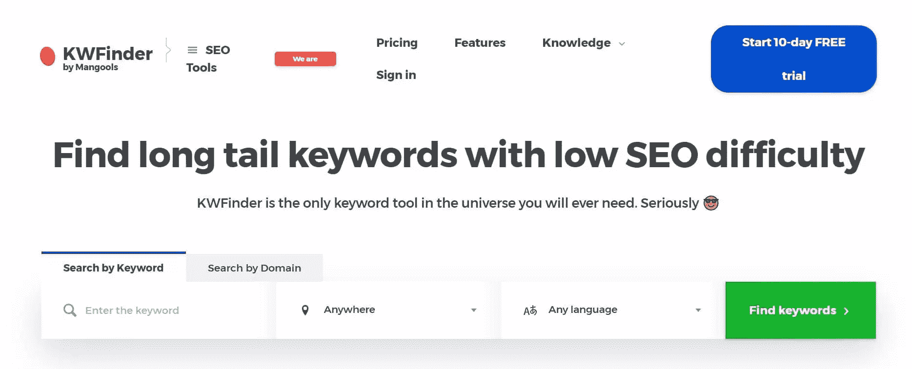
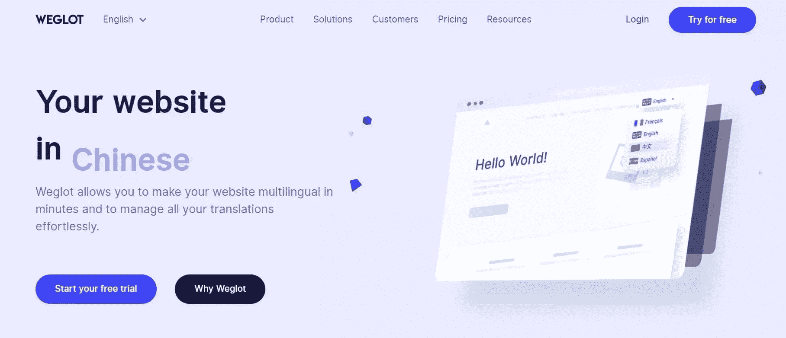
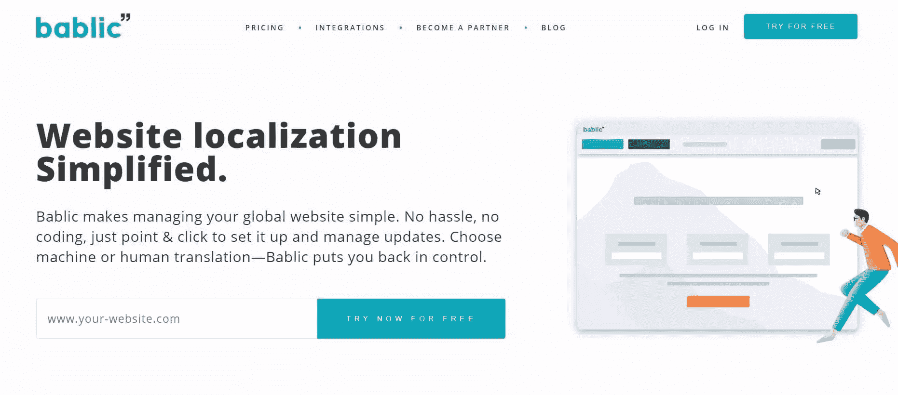
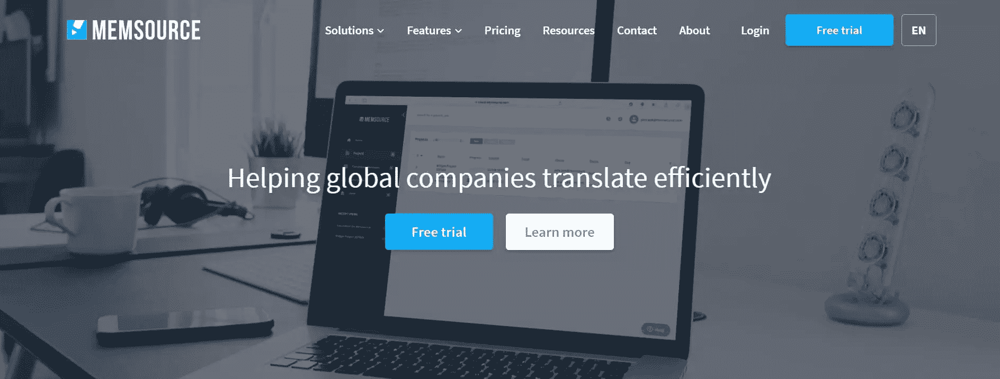

# 国际化:如何提高多语言网站的流量

> 原文：<https://www.sitepoint.com/internationalization-multilingual-site/>

对于那些希望迎合不同语言并从当今全球化世界中获益的公司来说，网站国际化可能是有利的。在本文中，我们将向您展示国际化和本地化的技巧，以及提高国际化网站的 SEO。

首字母缩略词 GILT(全球化、国际化、本地化和翻译)指的是企业超越国界、迎合国际市场的过程。

在国际化的过程中，企业主寻找提高网站流量的技巧。他们遵循 SEO 最佳实践，寻找战略关键词并监控其结果。但是有一个鲜为人知的技巧，你可能在国际化的过程中低估了:翻译你的网站。

2021 年，英语是全球使用最多的语言，因为有 13.5 亿人使用英语。但是英语只被大约 25%的全球互联网用户使用[。](https://blog.weglot.com/top-multilingual-website-stats-and-website-localization-trends-2021/)

技术使得商家有可能确保他们网站的用户界面能够支持外国地区或语言。因此，以国际化为目标的商家应该考虑翻译他们的网站，特别是如果他们有能力进行全球运输的话。这样，他们的业务或公司可以扩大规模。

如果您正在寻找关于国际化和本地化过程的技巧，以下是您需要了解的内容。

## 什么是网站国际化和本地化？

国际化是一个过程，包括确保您的网站可以容纳多种语言，并有适当的网站架构来做到这一点。

在网站设计和开发阶段，国际化可能需要更大的字符编码来适应外国脚本。同样，用户界面必须有足够的空间来容纳中文、韩文或俄文字符所需的字母数。它还应该能够迎合要求个人从右到左阅读的语言，而不是通常的从左到右的格式。

例如，宜家的国际化指导手册有简单明了的插图，便于消费者理解安装流程，无论其国籍如何。


同时，本地化是使产品或信息与你的特定目标市场产生共鸣的过程。它确保网站和你的营销信息符合当地的文化因素和惯例。

例如，本地化的产品页面必须使用适当的度量系统、遵循法律要求、使用本地货币、数字格式等等。

材料的国际化和本地化的过程，往往缩写为 i18n 和 L10n。

本地化和国际化可以改善您与世界各地消费者的沟通。在消费者使用不同语言的市场，如欧洲或亚洲国家，这一过程无疑是一个优势。

## 网站本地化和国际化的好处

全世界有数十亿人的母语不是英语。因此，希望扩大业务范围并提高在国外的吸引力的电子商务商家应该考虑采用多语言网站。

让我们来看看国际化和本地化的一些好处。

### 1.国际化让你可以与本地企业竞争

一个国际化的网站可以让商家在英语不是主要语言的世界上与当地商家竞争。

毫不奇怪，消费者更喜欢用他们的母语与他们交流的网站。一项有趣的研究发现，73%的购物者更喜欢在使用他们自己语言的网站上购物。

### 2.国际化和本地化可以提高可搜索性

比方说，你想扩大你的电子商务业务到法国和西班牙。

这些市场的购物者在输入搜索结果时使用他们自己的母语。所以如果你的网站没有被翻译，他们就无法在谷歌上找到你的产品页面。

在这种情况下，本地化和国际化提高了您的搜索能力。没有 i18n 和 L10n，你适应国际市场的机会就很渺茫。

### 3.国际化可以增加销售额

本地化过程有助于提高转化率。

[46%的网站用户](https://lingmointernational.com/blog/6-ways-a-multilingual-website-can-increase-web-traffic/)表示本地化内容被认为更值得信赖，这增加了他们购买该品牌产品的可能性。

事实上，经历了本地化过程的企业已经取得了令人羡慕的成果。

生活时尚服装品牌 La Machine Cycle Club [通过三种语言的网站本地化，转化率提高了 25%](https://weglot.com/customers/la-machine-cycle-club/) 。

同样，瑞典电子商务品牌 Ron Dorff 的本地化工作包括将 150 个产品页面翻译成三种语言。结果，他们的国际销售额增加了 70%[流量增加了 400%](https://weglot.com/customers/ron-dorff/) 。

这些成功的故事证明了本地化和国际化可以对你的销售产生很大的影响。因为你可以更好地与消费者沟通，你可以实现更高的转化率。

### 4.国际化和本地化是一种具有成本效益的客户获取策略

网站国际化和本地化不一定是昂贵的努力。像 [Weglot](https://weglot.com/) 这样的软件和 [WordPress 插件](https://weglot.com/)可以以最小的成本翻译你的网站——而且它们非常实惠。

## 成功网站本地化和国际化的 9 个策略

适应国际消费者的过程涉及哪些步骤？以下是成功国际化流程的最佳实践。

### 1.研究特定的目标市场

国际消费者在搜寻交易、便宜货和超酷产品时会使用不同的搜索词、俚语或短语。同样，他们在购买产品或服务时也可能有不同的习俗或惯例。

这意味着你需要研究你的目标市场，分析你的竞争对手。我们强烈建议联系本地营销人员、搜索引擎优化专家或代理机构来指导你完成这个过程。

### 2.翻译 SEO 元素

在人们查看你的登陆页面之前，他们会评估元描述和搜索引擎优化标题。如果这些页面没有被翻译成他们的母语，你就不太可能出现在搜索结果的顶端。

例如，当在谷歌中输入“김치”或泡菜时，搜索结果的顶部是带有韩语标题和描述的页面。这意味着当这些元素没有被翻译时，你可能会不知不觉地把人们拒之门外。



这正是我们建议翻译以下 SEO 元素的原因:

*   标题
*   元描述
*   图像 alt 标签
*   统一资源定位器

### 3.确保翻译的页面是可索引的

每个翻译的页面必须有一个可访问的网址或 URL。这样，谷歌可以对你网站的国际版本进行索引和排名。

谷歌有三个网址选项，使网站的地理定位过程变得容易:

*   **特定国家域名**。例如:`websitename.com/blog-post`(英语)和`websitename.jp/blog-post`(日本)
*   **子域与 gTLD** 。例如:`websitename.com/features`(英语)和`jp.websitename.com/features`(日本)
*   **子目录下有 gTLD** 。例如:`websitename.com/features`(英语)和`websitename.com/jp/features`(日本)

尽管没有最好的选择，Google [概述了每种 URL 结构的优缺点。](https://developers.google.com/search/docs/advanced/crawling/managing-multi-regional-sites?hl=en&visit_id=637670478103993847-2743980044&rd=1)


<small>[图片来源](https://lh3.googleusercontent.com/KS2cphe5C-Eco2QCI86gdDvqs8Lkqo6o5SvfEPU0CBkeYHmhwso1NHsdTH4RDJeg86y4_7cFPDTr28kvSf_FD8A9w70DmMsWHuzaIvj8xspdE8VaNMKJvaEcV_d8lkQHk-IsSa5Q=s0)</small>

### 4.使用`hreflang`属性

Hreflang 属性让搜索引擎决定页面的语言。

通过这种方式，谷歌可以根据用户的位置或语言将他们引导到合适的页面。

假设`https://websitename.com`是英语和默认版本，而`https://websitename.com/jp`是日语版本。凭借`hreflang`属性，谷歌将把日本消费者引向日本网站。

`hreflang`属性通常出现在头中:

```
<link rel="alternate" hreflang="lang_code" href="url_of_page" /> 
```

当将其添加到页面的`<head>`部分时，源代码如下所示:

```
<head>
  <title>Coffee Brews </title>
  <link rel="alternate" hreflang="en-us" href="http://en-us.websitename.com/page.html" />
  <link rel="alternate" hreflang="en" href="http://en.example.com/page.html" />
  <link rel="alternate" hreflang="jp" href="http://jp.websitename.com/page.html" />
  <link rel="alternate" hreflang="x-default" href="http://www.example.com/" />
</head> 
```

### 5.创建多语言网站地图

多语言网站地图将网站信息集中在一个地方。

这包括图像、视频、资源文件等等。在`yoursite.com/sitemap.xml`发现的。

有两种方法可以创建一个站点地图:创建一个全球站点地图，或者根据翻译网站的语言选择多个站点地图。

当翻译的登录页面是主网站的变体时，建议使用全球网站地图。相比之下，您也可以根据网站的语言或国家代码拥有独立的多个网站地图。

这可能是这样的:

*   **主版本** : `http://www.mysite.com/en/index.html`
*   **日文版** : `http://www.mysite.com/jp/jp/index.html`
*   **韩版** : `http://www.mysite.com/kr/kr/index.html`

开发者可以通过遵循 [Sitemaps XML 协议](https://www.sitemaps.org/protocol.html)来创建一个站点地图。但你也可以使用 WordPress SEO 插件或专用软件应用程序，自动创建一个符合谷歌偏好的网站地图。

### 6.进行关键词研究

不同的语言也会有不同的表现最佳的关键字。

虽然你可以确定你所在地区表现最好的关键词，但你不能直接翻译它们，然后假设结果是某个地区表现最好的关键词。相反，你需要对每个国家或地区进行单独的关键词研究，以提高你的本地化网站的排名。

好消息是，[谷歌关键词规划器](https://ads.google.com/home/tools/keyword-planner/)可以帮你找到本地化网站的最佳关键词。你也可以使用 [KWFinder](https://kwfinder.com/) 进行不同国家的关键词研究。



为了获得最佳结果，请联系能够识别该地区最佳搜索词的本地化服务。

### 8.使用网站国际化工具和插件

本地化可能是一项成本高昂的工作。你需要从不同国家招聘多名翻译，并等待数周或数月，直到你的网站完全翻译成你想要的语言。

幸运的是，有许多翻译插件和工具可以确保快速的本地化和开发过程。

以下是我们推荐的一些顶级工具:

#### 韦格洛



Weglot 是一个 WordPress 插件，可以让你在几分钟内翻译你的网站。

**主要特性:**

*   从 100 多种语言中选择，促进网站的本地化。
*   自动检测和翻译网站内容、媒体文件和来自第三方应用程序的信息。
*   将 Google 的最佳 SEO 实践应用于本地化，例如翻译元数据、向源代码添加`hreflang`属性以及使用特定语言的 URL。
*   提供后期编辑工具，让人工翻译实时编辑。

**价格:**每月 9.90 美元起。

### Bablic



Bablic 是一个翻译平台，用户可以选择机器翻译还是人工翻译来进行网站本地化。

**主要特性:**

*   自动检测新内容并即时应用翻译。
*   可以使您的网站 100%被搜索引擎索引，提高多种语言的搜索引擎优化排名，翻译元标签和定制多语言 URL。
*   能够将翻译后的网站与其相应的域名或 URL 结构关联起来(如`site.kr`、`site.sg`、`site.jp`)。

**价格:**基本计划每月 24 美元起。

### Memsource(来源)



[Memsource](https://www.memsource.com/) 是一个翻译管理系统，支持 500 多种语言和 30+机器翻译引擎。

**主要特性:**

*   使用人工智能技术来识别可以轻松翻译的内容，以便于本地化。
*   为从事网站本地化工作的项目经理和语言学家提供协作环境。
*   包括适用于 web、桌面和移动设备的卡特彼勒编辑器。

**价格:**每个项目经理账户两个免费语言学家账户 27 美元。

### 9.请翻译人员进行内容本地化

先进的工具和插件可以在瞬间翻译你的登陆页面。即便如此，本地化也需要与文化相关的拷贝。因此，您需要一名人工翻译来检查内容，以及检查数字格式、日期和货币。

机器翻译当然很快，但它没有考虑你的产品和服务背后的上下文。不同的语言也采用不同的句子结构，因此语法错误的直接翻译可能会危及公司的信誉。

为了避免这些陷阱，请当地的专业人士来审查你的内容。

### 10.在本地网站建立链接

与相关网站建立链接可以提高你的搜索排名和品牌知名度。然而，如果你想将你的网站本地化，并在国外排名，你需要该地区其他本地化网站的链接。

首先，列出你希望排名和撰写客座博文的国家或城市的热门网站。这些网站中的大多数可能使用消费者的母语，所以要和本地作者联系。这需要一个耗时的过程，但它将有助于提高品牌知名度，让你与当地竞争对手平起平坐。

## 包扎

有许多方法可以确保成功的网站国际化和本地化。

借助现代插件和工具，您可以确保快速轻松的本地化。另外，你还可以自动索引你的网站和翻译搜索引擎优化网站。虽然这些 i18n 和 L10n 工具是可靠的，但您还需要一名人工翻译来校对和检查翻译页面的准确性。

希望这些建议能帮助你的网站本地化。

## 分享这篇文章