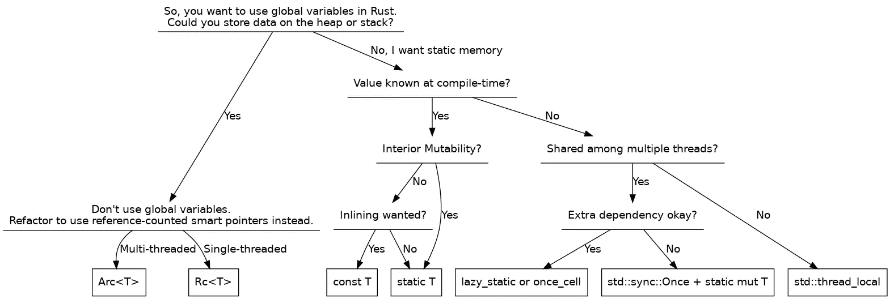

# 如何在 Rust 中惯用全局变量

> 原文：<https://www.sitepoint.com/rust-global-variables/>

在 Rust 中声明和使用全局变量可能很棘手。通常对于这种语言，Rust 通过迫使我们非常明确来确保健壮性。

在本文中，我将讨论 Rust 编译器想要拯救我们的陷阱。然后，我将向您展示适用于不同场景的最佳解决方案。

## 概观

在 Rust 中实现全局状态有很多选择。如果你赶时间，这里有一个我的建议的快速概述。



您可以通过以下链接跳转到本文的特定部分:

*   无全局:[重构为圆弧 <t>/ Rc</t>](#refactortheexample)
*   编译时初始化的全局变量:[常量 T /静态 T](#whenthevalueisknownatcompiletime)
*   使用外部库方便运行时初始化全局变量: [lazy_static / once_cell](#externallibraries)
*   实现自己的运行时初始化:[STD::sync::Once+static mut T](#multithreadedglobalswithruntimeinitialization)
*   单线程运行时初始化的特例: [thread_local](#singlethreadedglobalswithruntimeinitialization)

## Rust 中首次使用全局变量的幼稚尝试

让我们从一个不使用全局变量的例子开始。假设我想在一个全局字符串中存储程序的开始时间。稍后，我想从多个线程中访问该值。

Rust 初学者可能会尝试使用`let`像 Rust 中的任何其他变量一样声明一个全局变量。完整的程序可能如下所示:

```
use chrono::Utc;

let START_TIME = Utc::now().to_string();

pub fn main() {
    let thread_1 = std::thread::spawn(||{
        println!("Started {}, called thread 1 {}", START_TIME.as_ref().unwrap(), Utc::now());
    });
    let thread_2 = std::thread::spawn(||{
        println!("Started {}, called thread 2 {}", START_TIME.as_ref().unwrap(), Utc::now());
    });

    // Join threads and panic on error to show what went wrong
    thread_1.join().unwrap();
    thread_2.join().unwrap();
} 
```

在[操场](https://play.rust-lang.org/?version=stable&mode=debug&edition=2018&gist=51f73323b3d86ebbb1a89376d9235850)上自己试试吧！

[https://play.rust-lang.org/?version=stable&mode=debug&edition=2018&code=use%20chrono%3A%3AUtc%3B%0A%0Alet%20START_TIME%20%3D%20Utc%3A%3Anow().to_string()%3B%0A%0Apub%20fn%20main()%20%7B%0A%20%20%20%20let%20thread_1%20%3D%20std%3A%3Athread%3A%3Aspawn(%7C%7C%7B%0A%20%20%20%20%20%20%20%20println!(%22Started%20%7B%7D%2C%20called%20thread%201%20%7B%7D%22%2C%20START_TIME.as_ref().unwrap()%2C%20Utc%3A%3Anow())%3B%0A%20%20%20%20%7D)%3B%0A%20%20%20%20let%20thread_2%20%3D%20std%3A%3Athread%3A%3Aspawn(%7C%7C%7B%0A%20%20%20%20%20%20%20%20println!(%22Started%20%7B%7D%2C%20called%20thread%202%20%7B%7D%22%2C%20START_TIME.as_ref().unwrap()%2C%20Utc%3A%3Anow())%3B%0A%20%20%20%20%7D)%3B%0A%20%20%20%20%0A%20%20%20%20%2F%2F%20Join%20threads%20and%20panic%20on%20error%20to%20show%20what%20went%20wrong%0A%20%20%20%20thread_1.join().unwrap()%3B%0A%20%20%20%20thread_2.join().unwrap()%3B%0A%7D](https://play.rust-lang.org/?version=stable&mode=debug&edition=2018&code=use%20chrono%3A%3AUtc%3B%0A%0Alet%20START_TIME%20%3D%20Utc%3A%3Anow().to_string()%3B%0A%0Apub%20fn%20main()%20%7B%0A%20%20%20%20let%20thread_1%20%3D%20std%3A%3Athread%3A%3Aspawn(%7C%7C%7B%0A%20%20%20%20%20%20%20%20println!(%22Started%20%7B%7D%2C%20called%20thread%201%20%7B%7D%22%2C%20START_TIME.as_ref().unwrap()%2C%20Utc%3A%3Anow())%3B%0A%20%20%20%20%7D)%3B%0A%20%20%20%20let%20thread_2%20%3D%20std%3A%3Athread%3A%3Aspawn(%7C%7C%7B%0A%20%20%20%20%20%20%20%20println!(%22Started%20%7B%7D%2C%20called%20thread%202%20%7B%7D%22%2C%20START_TIME.as_ref().unwrap()%2C%20Utc%3A%3Anow())%3B%0A%20%20%20%20%7D)%3B%0A%20%20%20%20%0A%20%20%20%20%2F%2F%20Join%20threads%20and%20panic%20on%20error%20to%20show%20what%20went%20wrong%0A%20%20%20%20thread_1.join().unwrap()%3B%0A%20%20%20%20thread_2.join().unwrap()%3B%0A%7D)

这是 Rust 的无效语法。`let`关键字不能在全局范围内使用。我们只能用`static`或者`const`。后者声明一个真正的常量，而不是变量。只有`static`给了我们一个全局变量。

这背后的原因是`let`在运行时在堆栈上分配一个变量。注意，当在堆上分配时，情况仍然如此，如在`let t = Box::new();`中。在生成的机器码中，仍然有一个指针指向存储在堆栈中的堆。

全局变量存储在程序的[数据段](https://en.wikipedia.org/wiki/Data_segment)中。它们有一个固定的地址，在执行过程中不会改变。因此，[代码段](https://en.wikipedia.org/wiki/Data_segment#Text)可以包含常量地址，完全不需要堆栈上的空间。

好了，我们可以理解为什么我们需要不同的语法了。Rust 作为一种现代系统编程语言，想要非常明确地说明内存管理。

让我们用`static`再试一次:

```
use chrono::Utc;

static START_TIME: String = Utc::now().to_string();

pub fn main() {
    // ...
} 
```

编译器还不高兴:

```
error[E0015]: calls in statics are limited to constant functions, tuple structs and tuple variants
 --> src/main.rs:3:24
  |
3 | static start: String = Utc::now().to_string();
  |                        ^^^^^^^^^^^^^^^^^^^^^^ 
```

嗯，所以静态变量的初始值不能在运行时计算。那也许就让它不初始化吧？

```
use chrono::Utc;

static START_TIME;

pub fn main() {
    // ...
} 
```

这会产生一个新的错误:

```
Compiling playground v0.0.1 (/playground)
error: free static item without body
 --> src/main.rs:21:1
  |
3 | static START_TIME;
  | ^^^^^^^^^^^^^^^^^-
  |                  |
  |                  help: provide a definition for the static: `= <expr>;` 
```

所以那也不行！在任何用户代码运行之前，所有静态值都必须完全初始化并且有效。

如果您是从另一种语言(如 JavaScript 或 Python)过来的，这可能看起来是不必要的限制。但是任何一个 C++专家都可以告诉你关于静态初始化顺序惨败的故事，如果我们不小心的话，会导致一个未定义的初始化顺序。

例如，想象这样的事情:

```
static A: u32 = foo();
static B: u32 = foo();
static C: u32 = A + B;

fn foo() -> u32 {
    C + 1
}

fn main() {
    println!("A: {} B: {} C: {}", A, B, C);
} 
```

在这段代码中，由于循环依赖，没有安全的初始化顺序。

如果是不关心安全的 C++，结果会是`A: 1 B: 1 C: 2`。它在任何代码运行之前进行零初始化，然后在每个编译单元中从上到下定义顺序。

至少它定义了结果是什么。然而，当静态变量来自不同的`.cpp`文件，因此来自不同的编译单元时,“惨败”就开始了。那么顺序是不确定的，通常取决于编译命令行中文件的顺序。

在 Rust 中，零初始化不是一件事。毕竟零对于很多类型来说都是无效值，比如`Box`。此外，在 Rust 中，我们不接受奇怪的订购问题。只要我们远离`unsafe`，编译器应该只允许我们写理智的代码。这就是为什么编译器阻止我们使用简单的运行时初始化。

但是我可以通过使用相当于空指针的`None`来规避初始化吗？至少这都是按照锈型系统。我当然可以把初始化移到主函数的顶部，对吗？

```
static mut START_TIME: Option<String> = None;

pub fn main() {
    START_TIME = Some(Utc::now().to_string());
    // ...
} 
```

啊，好吧，我们得到的错误是…

```
error[E0133]: use of mutable static is unsafe and requires unsafe function or block
  --> src/main.rs:24:5
  |
6 |     START_TIME = Some(Utc::now().to_string());
  |     ^^^^^^^^^^ use of mutable static
  |
  = note: mutable statics can be mutated by multiple threads: aliasing violations or data races will cause undefined behavior 
```

在这一点上，我可以用一个`unsafe{...}`块来包装它，这样它就可以工作了。有时候，这是一个有效的策略。也许是为了测试剩余的代码是否如预期的那样工作。但这不是我想给你看的惯用解决方案。因此，让我们来探索编译器保证安全的解决方案。

## 重构示例

你可能已经注意到这个例子根本不需要全局变量。通常，如果我们能想到一个没有全局变量的解决方案，我们应该避免使用它们。

这里的想法是将声明放在主函数中:

```
pub fn main() {
    let start_time = Utc::now().to_string();
    let thread_1 = std::thread::spawn(||{
        println!("Started {}, called thread 1 {}", &start_time, Utc::now());
    });
    let thread_2 = std::thread::spawn(||{
        println!("Started {}, called thread 2 {}", &start_time, Utc::now());
    });

    // Join threads and panic on error to show what went wrong
    thread_1.join().unwrap();
    thread_2.join().unwrap();
} 
```

唯一的问题是借用检查器:

```
error[E0373]: closure may outlive the current function, but it borrows `start_time`, which is owned by the current function
  --> src/main.rs:42:39
   |
42 |     let thread_1 = std::thread::spawn(||{
   |                                       ^^ may outlive borrowed value `start_time`
43 |         println!("Started {}, called thread 1 {}", &start_time, Utc::now());
   |                                                     ---------- `start_time` is borrowed here
   |
note: function requires argument type to outlive `'static` 
```

这个错误并不明显。编译器告诉我们，产生的线程可能比主函数的堆栈框架中的值`start_time`活得更长。

技术上，我们可以看到这是不可能的。线程是连接的，因此主线程不会在子线程完成之前退出。

但是编译器不够聪明，无法解决这种特殊情况。一般来说，当产生一个新线程时，所提供的闭包只能借用具有静态生存期的项。换句话说，借用的值必须在整个程序生命周期内有效。

对于任何刚开始学习 Rust 的人来说，这可能是您想要接触全局变量的地方。但至少有两种解决方案比这简单得多。最简单的方法是克隆字符串值，然后将字符串的所有权转移到闭包中。当然，这需要额外的分配和一些额外的内存。但是在这种情况下，它只是一个很短的字符串，对性能没有什么影响。

但是如果它是一个更大的共享对象呢？如果你不想克隆它，把它放在一个引用计数的智能指针后面。 [Rc](https://doc.rust-lang.org/std/rc/struct.Rc.html) 是单线程引用计数型。 [Arc](https://doc.rust-lang.org/std/sync/struct.Arc.html) 是可以在线程间安全共享值的原子版本。

所以，为了让编译器满意，我们可以如下使用`Arc`:

```
/* Final Solution */
pub fn main() {
    let start_time = Arc::new(Utc::now().to_string());
    // This clones the Arc pointer, not the String behind it
    let cloned_start_time = start_time.clone();
    let thread_1 = std::thread::spawn(move ||{
        println!("Started {}, called thread 1 {}", cloned_start_time, Utc::now());
    });
    let thread_2 = std::thread::spawn(move ||{
        println!("Started {}, called thread 2 {}", start_time, Utc::now());
    });

    // Join threads and panic on error to show what went wrong
    thread_1.join().unwrap();
    thread_2.join().unwrap();
} 
```

在[操场](https://play.rust-lang.org/?version=stable&mode=debug&edition=2018&gist=d2f6ba289c511d6708879409f632541d)上自己试试吧！

[https://play.rust-lang.org/?version=stable&mode=debug&edition=2018&code=use%20chrono%3A%3AUtc%3B%0Ause%20std%3A%3Async%3A%3AArc%3B%0A%0Apub%20fn%20main()%20%7B%0A%20%20%20%20let%20start_time%20%3D%20Arc%3A%3Anew(Utc%3A%3Anow().to_string())%3B%0A%20%20%20%20%2F%2F%20This%20clones%20the%20Arc%20pointer%2C%20not%20the%20String%20behind%20it%0A%20%20%20%20let%20cloned_start_time%20%3D%20start_time.clone()%3B%0A%20%20%20%20let%20thread_1%20%3D%20std%3A%3Athread%3A%3Aspawn(move%20%7C%7C%7B%0A%20%20%20%20%20%20%20%20println!(%22Started%20%7B%7D%2C%20called%20thread%201%20%7B%7D%22%2C%20cloned_start_time%2C%20Utc%3A%3Anow())%3B%0A%20%20%20%20%7D)%3B%0A%20%20%20%20let%20thread_2%20%3D%20std%3A%3Athread%3A%3Aspawn(move%20%7C%7C%7B%0A%20%20%20%20%20%20%20%20println!(%22Started%20%7B%7D%2C%20called%20thread%202%20%7B%7D%22%2C%20start_time%2C%20Utc%3A%3Anow())%3B%0A%20%20%20%20%7D)%3B%0A%20%20%20%20%0A%20%20%20%20%2F%2F%20Join%20threads%20and%20panic%20on%20error%20to%20show%20what%20went%20wrong%0A%20%20%20%20thread_1.join().unwrap()%3B%0A%20%20%20%20thread_2.join().unwrap()%3B%0A%7D](https://play.rust-lang.org/?version=stable&mode=debug&edition=2018&code=use%20chrono%3A%3AUtc%3B%0Ause%20std%3A%3Async%3A%3AArc%3B%0A%0Apub%20fn%20main()%20%7B%0A%20%20%20%20let%20start_time%20%3D%20Arc%3A%3Anew(Utc%3A%3Anow().to_string())%3B%0A%20%20%20%20%2F%2F%20This%20clones%20the%20Arc%20pointer%2C%20not%20the%20String%20behind%20it%0A%20%20%20%20let%20cloned_start_time%20%3D%20start_time.clone()%3B%0A%20%20%20%20let%20thread_1%20%3D%20std%3A%3Athread%3A%3Aspawn(move%20%7C%7C%7B%0A%20%20%20%20%20%20%20%20println!(%22Started%20%7B%7D%2C%20called%20thread%201%20%7B%7D%22%2C%20cloned_start_time%2C%20Utc%3A%3Anow())%3B%0A%20%20%20%20%7D)%3B%0A%20%20%20%20let%20thread_2%20%3D%20std%3A%3Athread%3A%3Aspawn(move%20%7C%7C%7B%0A%20%20%20%20%20%20%20%20println!(%22Started%20%7B%7D%2C%20called%20thread%202%20%7B%7D%22%2C%20start_time%2C%20Utc%3A%3Anow())%3B%0A%20%20%20%20%7D)%3B%0A%20%20%20%20%0A%20%20%20%20%2F%2F%20Join%20threads%20and%20panic%20on%20error%20to%20show%20what%20went%20wrong%0A%20%20%20%20thread_1.join().unwrap()%3B%0A%20%20%20%20thread_2.join().unwrap()%3B%0A%7D)

这是一个关于如何在线程间共享状态同时避免全局变量的快速纲要。除了我到目前为止向您展示的内容，您可能还需要[内部可变性](https://doc.rust-lang.org/book/ch15-05-interior-mutability.html)来修改共享状态。对内部可变性的全面讨论超出了本文的范围。但是在这个特殊的例子中，我会选择`Arc<Mutex<String>>`来为`start_time`添加线程安全的内部可变性。

## 当全局变量值在编译时已知时

根据我的经验，全局状态最常见的用例不是变量，而是常量。在 Rust 中，它们有两种类型:

*   常量值，用`const`定义。这些是由编译器内联的。内部可变性是不允许的。
*   静态变量，用`static`定义。它们在数据段中接收一个固定的空间。内部可变性是可能的。

它们都可以用[编译时常数](https://doc.rust-lang.org/std/keyword.const.html#compile-time-constants)初始化。这些可以是简单的值，如`42`或`"hello world"`。或者它可以是一个包含其他几个编译时常量和函数的表达式，标记为`const`。只要我们避免循环依赖。(您可以在 Rust 参考资料的[中找到有关常量表达式的更多详细信息。)](https://doc.rust-lang.org/reference/const_eval.html)

```
use std::sync::atomic::AtomicU64;
use std::sync::{Arc,Mutex};

static COUNTER: AtomicU64 = AtomicU64::new(TI_BYTE);

const GI_BYTE: u64 = 1024 * 1024 * 1024;
const TI_BYTE: u64 = 1024 * GI_BYTE; 
```

通常，`const`是更好的选择——除非您需要内部可变性，或者您特别想避免内联。

如果您需要内部可变性，有几种选择。对于大多数原语，在 [std::sync::atomic](https://doc.rust-lang.org/std/sync/atomic/) 中都有相应的原子变量。它们提供了一个干净的 API 来自动加载、存储和更新值。

在没有原子的情况下，通常的选择是锁。Rust 的标准库提供了一个[读写锁](https://doc.rust-lang.org/std/sync/struct.RwLock.html) ( `RwLock`)和一个[互斥锁](https://doc.rust-lang.org/std/sync/struct.Mutex.html) ( `Mutex`)。

但是，如果您需要在运行时计算值，或者需要堆分配，那么`const`和`static`就没有帮助。

## Rust 中带运行时初始化的单线程全局变量

我写的大多数应用程序只有一个线程。在这种情况下，锁定机制是不必要的。

然而，我们不应该直接使用`static mut`并将访问包装在`unsafe`中，仅仅因为只有一个线程。这样，我们可能会以严重的内存损坏而告终。

例如，从全局变量不安全地借用可能会同时给我们多个可变引用。然后我们可以用其中一个来迭代一个向量，用另一个从同一个向量中删除值。迭代器可能会超出有效内存边界，这是安全 Rust 可以防止的潜在崩溃。

但是标准库有办法在单个线程中“全局”存储安全访问的值。我说的是[线程局部变量](https://doc.rust-lang.org/std/thread/struct.LocalKey.html)。在存在许多线程的情况下，每个线程都获得一个独立的变量副本。但是在我们的例子中，对于单线程，只有一个副本。

线程局部变量由`thread_local!`宏创建。访问它们需要使用闭包，如下例所示:

```
use chrono::Utc;

thread_local!(static GLOBAL_DATA: String = Utc::now().to_string());

fn main() {
    GLOBAL_DATA.with(|text| {
        println!("{}", *text);
    });
} 
```

这不是所有解决方案中最简单的。但是它允许我们执行任意的初始化代码，这些代码将在第一次访问值时运行。

谈到内部可变性，线程局部变量真的很好。与所有其他解决方案不同，它不需要[同步](https://doc.rust-lang.org/std/marker/trait.Sync.html)。这允许使用 [RefCell](https://doc.rust-lang.org/std/cell/struct.RefCell.html) 实现内部可变性，避免了[互斥](https://doc.rust-lang.org/std/sync/struct.Mutex.html)的锁定开销。

线程局部变量的绝对性能高度依赖于平台。但是我在我自己的 PC 上做了一些快速测试，将它与依靠锁的内部可变性进行比较，发现它快了 10 倍。我不期望结果会在任何平台上翻转，但是如果您非常关心性能，请确保运行您自己的基准。

下面是一个如何使用`RefCell`实现内部可变性的例子:

```
thread_local!(static GLOBAL_DATA: RefCell<String> = RefCell::new(Utc::now().to_string()));

fn main() {
    GLOBAL_DATA.with(|text| {
        println!("Global string is {}", *text.borrow());
    });

    GLOBAL_DATA.with(|text| {
        *text.borrow_mut() = Utc::now().to_string();
    });

    GLOBAL_DATA.with(|text| {
        println!("Global string is {}", *text.borrow());
    });
} 
```

在[操场](https://play.rust-lang.org/?version=stable&mode=debug&edition=2018&gist=b14e53d011da0b9300ffbadc83dfa535)上自己试试吧！

[https://play.rust-lang.org/?version=stable&mode=debug&edition=2018&code=use%20chrono%3A%3AUtc%3B%0Ause%20std%3A%3Acell%3A%3ARefCell%3B%0Athread_local!(static%20GLOBAL_DATA%3A%20RefCell%3CString%3E%20%3D%20RefCell%3A%3Anew(Utc%3A%3Anow().to_string()))%3B%0A%0Afn%20main()%20%7B%0A%20%20%20%20GLOBAL_DATA.with(%7Ctext%7C%20%7B%0A%20%20%20%20%20%20%20%20println!(%22Global%20string%20is%20%7B%7D%22%2C%20*text.borrow())%3B%0A%20%20%20%20%7D)%3B%0A%20%20%20%20%0A%20%20%20%20GLOBAL_DATA.with(%7Ctext%7C%20%7B%0A%20%20%20%20%20%20%20%20*text.borrow_mut()%20%3D%20Utc%3A%3Anow().to_string()%3B%0A%20%20%20%20%7D)%3B%0A%20%20%20%20%0A%20%20%20%20GLOBAL_DATA.with(%7Ctext%7C%20%7B%0A%20%20%20%20%20%20%20%20println!(%22Global%20string%20is%20%7B%7D%22%2C%20*text.borrow())%3B%0A%20%20%20%20%7D)%3B%0A%7D](https://play.rust-lang.org/?version=stable&mode=debug&edition=2018&code=use%20chrono%3A%3AUtc%3B%0Ause%20std%3A%3Acell%3A%3ARefCell%3B%0Athread_local!(static%20GLOBAL_DATA%3A%20RefCell%3CString%3E%20%3D%20RefCell%3A%3Anew(Utc%3A%3Anow().to_string()))%3B%0A%0Afn%20main()%20%7B%0A%20%20%20%20GLOBAL_DATA.with(%7Ctext%7C%20%7B%0A%20%20%20%20%20%20%20%20println!(%22Global%20string%20is%20%7B%7D%22%2C%20*text.borrow())%3B%0A%20%20%20%20%7D)%3B%0A%20%20%20%20%0A%20%20%20%20GLOBAL_DATA.with(%7Ctext%7C%20%7B%0A%20%20%20%20%20%20%20%20*text.borrow_mut()%20%3D%20Utc%3A%3Anow().to_string()%3B%0A%20%20%20%20%7D)%3B%0A%20%20%20%20%0A%20%20%20%20GLOBAL_DATA.with(%7Ctext%7C%20%7B%0A%20%20%20%20%20%20%20%20println!(%22Global%20string%20is%20%7B%7D%22%2C%20*text.borrow())%3B%0A%20%20%20%20%7D)%3B%0A%7D)

顺便提一下，尽管 WebAssembly 中的线程不同于 x86_64 平台上的线程，但这种带有`thread_local!` + `RefCell`的模式也适用于编译 Rust 以在浏览器中运行。在这种情况下，使用一种对多线程代码安全的方法将是大材小用。(如果在浏览器中运行 Rust 的想法对你来说是新的，请随意阅读我以前写的一篇名为“ [Rust 教程:JavaScript Devs](https://www.sitepoint.com/rust-tutorial-introduction-javascript-devs/)Rust 简介”的文章。)

关于线程局部变量的一个警告是它们的实现依赖于平台。通常，您不会注意到这一点，但是请注意， [drop 语义因此是平台相关的](https://doc.rust-lang.org/std/thread/struct.LocalKey.html#platform-specific-behavior)。

尽管如此，多线程全局的解决方案显然也适用于单线程的情况。如果没有内部可变性，它们似乎和线程局部变量一样快。

接下来让我们来看看。

## 带有运行时初始化的多线程全局变量

对于运行时初始化的安全全局变量，标准库目前还没有很好的解决方案。然而，使用 [std::sync::Once](https://doc.rust-lang.org/std/sync/struct.Once.html) ，如果你知道自己在做什么，就有可能构建出安全使用`unsafe`的东西。

官方文档中的[示例是一个很好的起点。如果您还需要内部可变性，您必须将这种方法与读写锁或互斥体结合起来。这看起来可能是这样的:](https://doc.rust-lang.org/std/sync/struct.Once.html#examples-1)

```
static mut STD_ONCE_COUNTER: Option<Mutex<String>> = None;
static INIT: Once = Once::new();

fn global_string<'a>() -> &'a Mutex<String> {
    INIT.call_once(|| {
        // Since this access is inside a call_once, before any other accesses, it is safe
        unsafe {
            *STD_ONCE_COUNTER.borrow_mut() = Some(Mutex::new(Utc::now().to_string()));
        }
    });
    // As long as this function is the only place with access to the static variable,
    // giving out a read-only borrow here is safe because it is guaranteed no more mutable
    // references will exist at this point or in the future.
    unsafe { STD_ONCE_COUNTER.as_ref().unwrap() }
}
pub fn main() {
    println!("Global string is {}", *global_string().lock().unwrap());
    *global_string().lock().unwrap() = Utc::now().to_string();
    println!("Global string is {}", *global_string().lock().unwrap());
} 
```

在[操场](https://play.rust-lang.org/?version=stable&mode=debug&edition=2018&gist=54b65ae08be815dcbe8515d3890af86f)上自己试试吧！

[https://play.rust-lang.org/?version=stable&mode=debug&edition=2018&code=use%20std%3A%3Aborrow%3A%3ABorrowMut%3B%0Ause%20std%3A%3Async%3A%3A%7BMutex%2C%20Once%7D%3B%0Ause%20chrono%3A%3AUtc%3B%0A%0Astatic%20mut%20STD_ONCE_COUNTER%3A%20Option%3CMutex%3CString%3E%3E%20%3D%20None%3B%0Astatic%20INIT%3A%20Once%20%3D%20Once%3A%3Anew()%3B%0A%0Afn%20global_string%3C%27a%3E()%20-%3E%20%26%27a%20Mutex%3CString%3E%20%7B%0A%20%20%20%20INIT.call_once(%7C%7C%20%7B%0A%20%20%20%20%20%20%20%20%2F%2F%20Since%20this%20access%20is%20inside%20a%20call_once%2C%20it%20is%20safe%0A%20%20%20%20%20%20%20%20unsafe%20%7B%0A%20%20%20%20%20%20%20%20%20%20%20%20*STD_ONCE_COUNTER.borrow_mut()%20%3D%20Some(Mutex%3A%3Anew(Utc%3A%3Anow().to_string()))%3B%0A%20%20%20%20%20%20%20%20%7D%0A%20%20%20%20%7D)%3B%0A%20%20%20%20%2F%2F%20As%20long%20as%20this%20function%20is%20the%20only%20place%20with%20access%20to%20the%20static%20variable%2C%0A%20%20%20%20%2F%2F%20giving%20out%20read-only%20borrow%20here%20is%20safe%20because%20it%20is%20guaranteed%20no%20more%20mutable%0A%20%20%20%20%2F%2F%20references%20will%20exist%20at%20this%20point%20or%20in%20the%20future.%0A%20%20%20%20unsafe%20%7B%20STD_ONCE_COUNTER.as_ref().unwrap()%20%7D%0A%7D%0Apub%20fn%20main()%20%7B%0A%20%20%20%20println!(%22Global%20string%20is%20%7B%7D%22%2C%20*global_string().lock().unwrap())%3B%0A%20%20%20%20*global_string().lock().unwrap()%20%3D%20Utc%3A%3Anow().to_string()%3B%0A%20%20%20%20println!(%22Global%20string%20is%20%7B%7D%22%2C%20*global_string().lock().unwrap())%3B%0A%7D](https://play.rust-lang.org/?version=stable&mode=debug&edition=2018&code=use%20std%3A%3Aborrow%3A%3ABorrowMut%3B%0Ause%20std%3A%3Async%3A%3A%7BMutex%2C%20Once%7D%3B%0Ause%20chrono%3A%3AUtc%3B%0A%0Astatic%20mut%20STD_ONCE_COUNTER%3A%20Option%3CMutex%3CString%3E%3E%20%3D%20None%3B%0Astatic%20INIT%3A%20Once%20%3D%20Once%3A%3Anew()%3B%0A%0Afn%20global_string%3C%27a%3E()%20-%3E%20%26%27a%20Mutex%3CString%3E%20%7B%0A%20%20%20%20INIT.call_once(%7C%7C%20%7B%0A%20%20%20%20%20%20%20%20%2F%2F%20Since%20this%20access%20is%20inside%20a%20call_once%2C%20it%20is%20safe%0A%20%20%20%20%20%20%20%20unsafe%20%7B%0A%20%20%20%20%20%20%20%20%20%20%20%20*STD_ONCE_COUNTER.borrow_mut()%20%3D%20Some(Mutex%3A%3Anew(Utc%3A%3Anow().to_string()))%3B%0A%20%20%20%20%20%20%20%20%7D%0A%20%20%20%20%7D)%3B%0A%20%20%20%20%2F%2F%20As%20long%20as%20this%20function%20is%20the%20only%20place%20with%20access%20to%20the%20static%20variable%2C%0A%20%20%20%20%2F%2F%20giving%20out%20read-only%20borrow%20here%20is%20safe%20because%20it%20is%20guaranteed%20no%20more%20mutable%0A%20%20%20%20%2F%2F%20references%20will%20exist%20at%20this%20point%20or%20in%20the%20future.%0A%20%20%20%20unsafe%20%7B%20STD_ONCE_COUNTER.as_ref().unwrap()%20%7D%0A%7D%0Apub%20fn%20main()%20%7B%0A%20%20%20%20println!(%22Global%20string%20is%20%7B%7D%22%2C%20*global_string().lock().unwrap())%3B%0A%20%20%20%20*global_string().lock().unwrap()%20%3D%20Utc%3A%3Anow().to_string()%3B%0A%20%20%20%20println!(%22Global%20string%20is%20%7B%7D%22%2C%20*global_string().lock().unwrap())%3B%0A%7D)

如果你正在寻找更简单的东西，我可以强烈推荐两个板条箱中的一个，我将在下一节讨论。

## 用于管理 Rust 中全局变量的外部库

基于流行度和个人口味，我想推荐两个我认为是 Rust 中 easy 全局变量的最佳选择的库，截止到 2021 年。

[Once Cell](https://crates.io/crates/once_cell) 目前被认为是标准库。(见本[追踪刊](https://github.com/rust-lang/rust/issues/74465)。)如果您使用的是夜间编译器，那么您已经可以通过将`#![feature(once_cell)]`添加到项目的`main.rs`中来使用不稳定的 API 了。

下面是一个在稳定编译器上使用`once_cell`的例子，带有额外的依赖性:

```
use once_cell::sync::Lazy;

static GLOBAL_DATA: Lazy<String> = Lazy::new(||Utc::now().to_string());

fn main() {
    println!("{}", *GLOBAL_DATA);
} 
```

在[操场](https://play.rust-lang.org/?version=stable&mode=debug&edition=2018&gist=da7b3377df1c0cf522ce36e4466bf510)上自己试试吧！

[https://play.rust-lang.org/?version=stable&mode=debug&edition=2018&code=use%20once_cell%3A%3Async%3A%3ALazy%3B%0Ause%20chrono%3A%3AUtc%3B%0A%0Astatic%20GLOBAL_DATA%3A%20Lazy%3CString%3E%20%3D%20Lazy%3A%3Anew(%7C%7CUtc%3A%3Anow().to_string())%3B%0A%0Afn%20main()%20%7B%0A%20%20%20%20println!(%22%7B%7D%22%2C%20*GLOBAL_DATA)%3B%0A%7D](https://play.rust-lang.org/?version=stable&mode=debug&edition=2018&code=use%20once_cell%3A%3Async%3A%3ALazy%3B%0Ause%20chrono%3A%3AUtc%3B%0A%0Astatic%20GLOBAL_DATA%3A%20Lazy%3CString%3E%20%3D%20Lazy%3A%3Anew(%7C%7CUtc%3A%3Anow().to_string())%3B%0A%0Afn%20main()%20%7B%0A%20%20%20%20println!(%22%7B%7D%22%2C%20*GLOBAL_DATA)%3B%0A%7D)

最后，还有[惰性静态](https://crates.io/crates/lazy_static)，目前最流行的初始化全局变量的方法。它使用一个带有小语法扩展(`static ref`)的宏来定义全局变量。

同样的例子，从`once_cell`翻译成`lazy_static`:

```
#[macro_use]
extern crate lazy_static;

lazy_static!(
    static ref GLOBAL_DATA: String = Utc::now().to_string();
);

fn main() {
    println!("{}", *GLOBAL_DATA);
} 
```

在[操场](https://play.rust-lang.org/?version=stable&mode=debug&edition=2018&gist=e3a938e2d286620c48316de06d6ef7da)上自己试试吧！

[https://play.rust-lang.org/?version=stable&mode=debug&edition=2018&code=use%20chrono%3A%3AUtc%3B%0A%0A%23%5Bmacro_use%5D%0Aextern%20crate%20lazy_static%3B%0A%0Alazy_static!(%0A%20%20%20%20static%20ref%20GLOBAL_DATA%3A%20String%20%3D%20Utc%3A%3Anow().to_string()%3B%0A)%3B%0A%0Afn%20main()%20%7B%0A%20%20%20%20println!(%22%7B%7D%22%2C%20*GLOBAL_DATA)%3B%0A%7D](https://play.rust-lang.org/?version=stable&mode=debug&edition=2018&code=use%20chrono%3A%3AUtc%3B%0A%0A%23%5Bmacro_use%5D%0Aextern%20crate%20lazy_static%3B%0A%0Alazy_static!(%0A%20%20%20%20static%20ref%20GLOBAL_DATA%3A%20String%20%3D%20Utc%3A%3Anow().to_string()%3B%0A)%3B%0A%0Afn%20main()%20%7B%0A%20%20%20%20println!(%22%7B%7D%22%2C%20*GLOBAL_DATA)%3B%0A%7D)

在`once_cell`和`lazy_static`之间的决定本质上可以归结为你更喜欢哪种语法。
同样，两者都支持内部可变性。把`String`包在`Mutex`或者`RwLock`里就行了。

## 结论

据我所知，这些都是在 Rust 中实现全局变量的(明智的)方法。我希望它更简单。但是全球国家本质上是复杂的。结合 Rust 的内存安全保证，一个简单的包罗万象的解决方案似乎是不可能的。但是我希望这篇文章已经帮助你看清了过多的可用选项。

一般来说，Rust 社区倾向于给用户最大的权力——这使得事情变得更加复杂。

很难掌握所有的细节。因此，我花了很多空闲时间来研究 Rust 的特性，探索其可能性。在这个过程中，我通常会实施或大或小的爱好项目——比如视频游戏——并将它们上传到我的 GitHub 档案中。然后，如果我在语言实验中发现一些有趣的东西，我会把它写在我的[私人博客](https://www.jakobmeier.ch)上。如果你想阅读更深入的 Rust 内容，请查看！

## 分享这篇文章