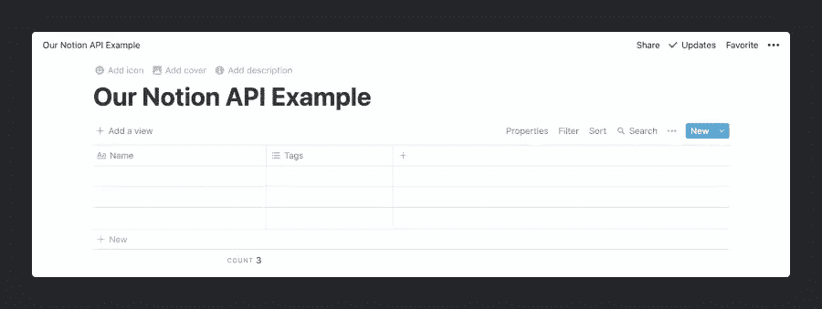
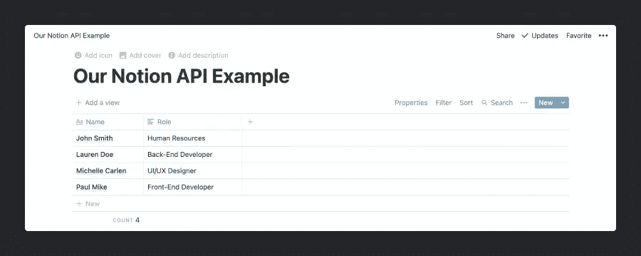
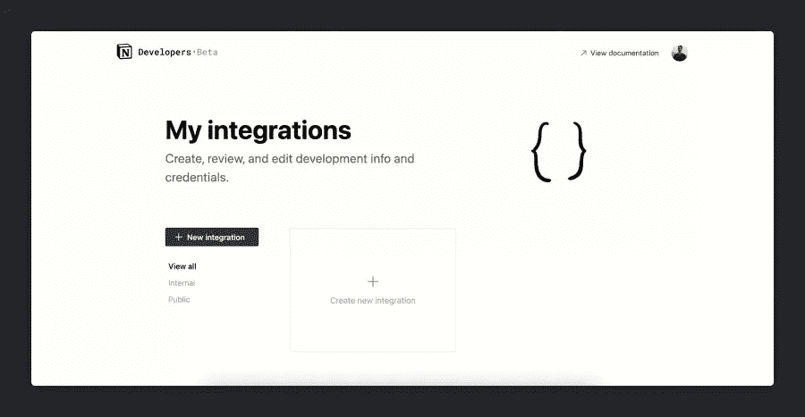
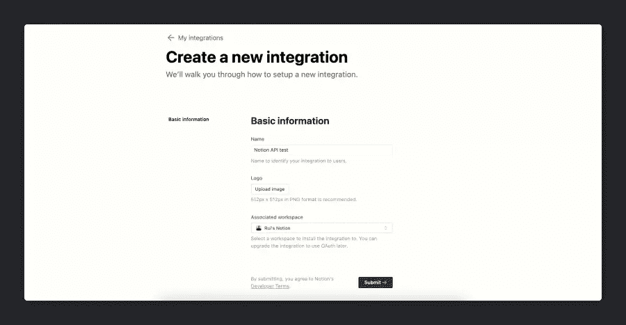
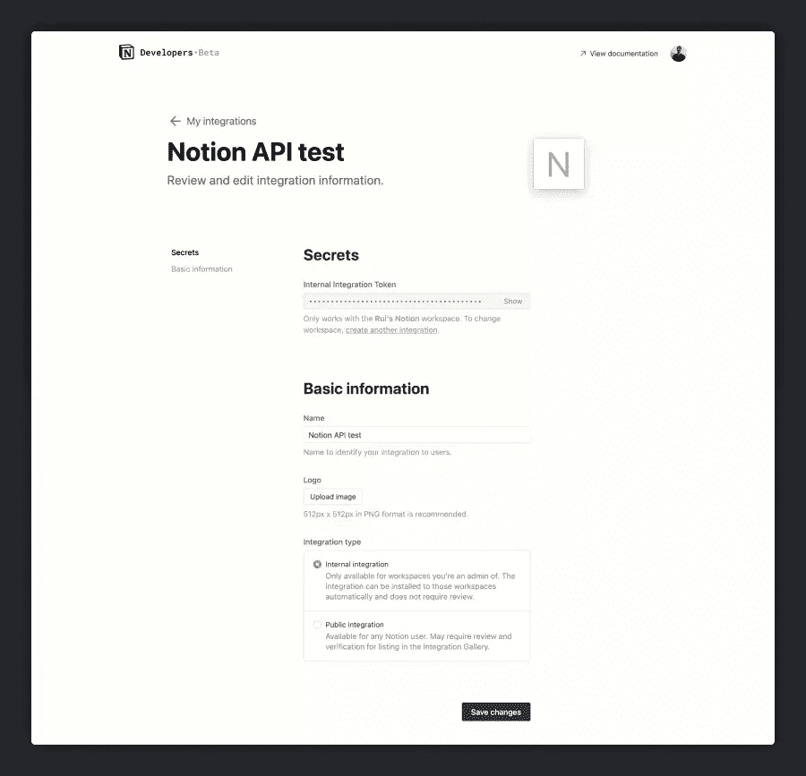
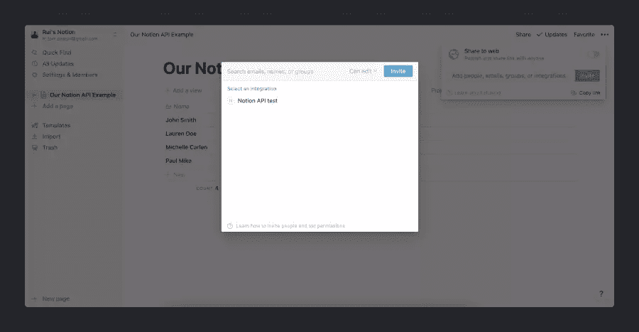
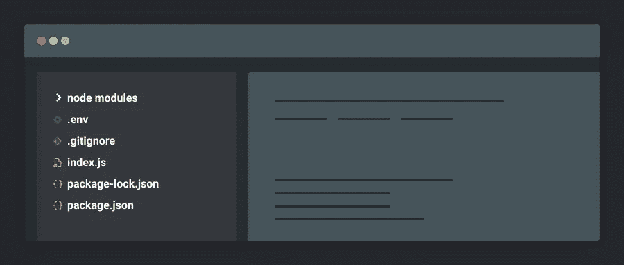
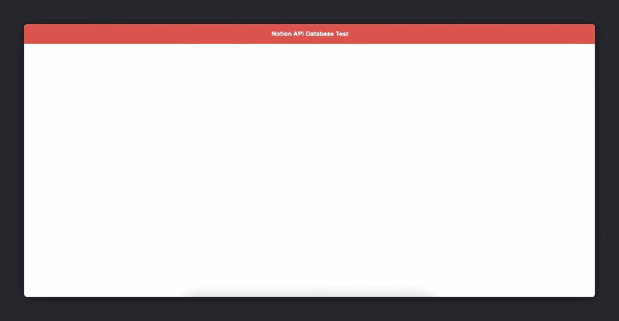
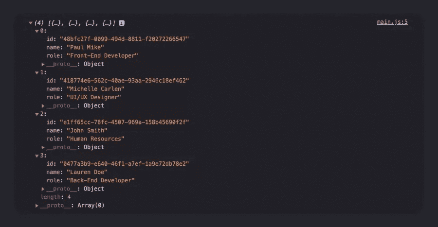
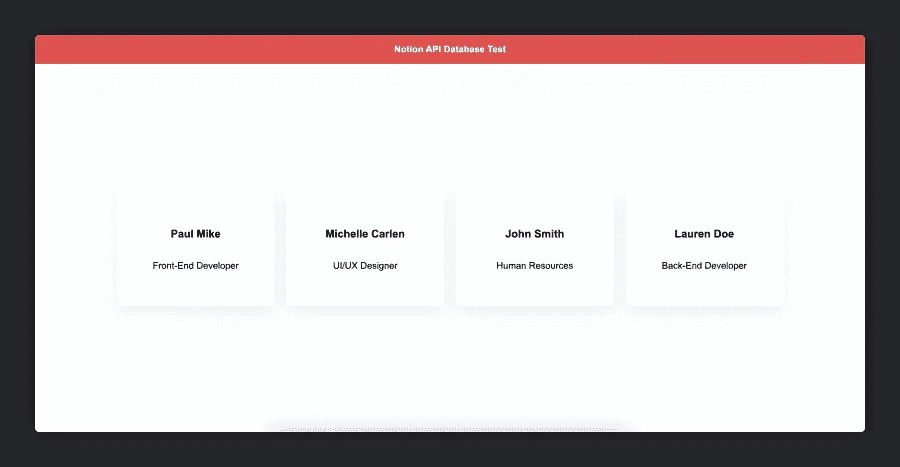

# 概念 API 及其 JavaScript SDK 入门

> 原文：<https://www.sitepoint.com/notion-api-javascript-sdk/>

**[概念](https://www.sitepoint.com/notion-beginners-guide/)是一个多功能应用程序，用于组织各种内容，从笔记到日历和提醒。opinion 最近发布了自己的 <abbr title="application programming interface">API</abbr> ，在本文中，我们将使用这个 API 创建一个小型接口，将 opinion 连接到我们自己的数据库。**

在[公测](https://developers.notion.com/changelog/hello-world-notion-api-is-now-in-public-beta)中，ideal 向全世界发布了它的 API。它有很好的文档，非常容易访问，更重要的是，对于我们 JavaScript 开发者来说，它还提供了一个用于 JavaScript 的 [SDK。🎉](https://github.com/makenotion/notion-sdk-js)

虽然这篇文章不需要以前的知识(我将提供所有需要的步骤)，但我们将处理前端和后端代码，因为涉及到一点 Node.js 和 Express 设置。

## 设置

我们的设置将分为两个部分。第一部分将涵盖我们在软件和 API 概念上需要遵循的步骤。在第二个例子中，我们将通过初始化一个文件夹、添加概念依赖、创建初始的`index.js`和编辑`package.json`来获得代码，以使一切正常工作。

为了跟进，您需要一个概念帐户(下面会详细介绍)，以及安装在您的机器上的[节点的最新副本。一如既往，教程的](https://www.sitepoint.com/quick-tip-multiple-versions-node-nvm/)[代码可以在 GitHub](https://github.com/sitepoint-editors/notion-api) 上找到。

### 概念设置

如果您还没有概念帐户，请点击[此链接](https://www.notion.so/login)创建一个。它有一个非常慷慨的免费层，你不必添加任何支付信息！

创建您的帐户并登录后，选择**添加页面**并为其命名，创建一个新页面。对于本教程，我们将选择`Table`数据库。这会给我们一个空桌子，这正是我们想要的！



下一步是在我们的`database`上创建一些列，并用一些模拟数据填充它们。对于本教程，我们将只处理`Name`和`Role`字段，就像我们正在处理一个公司的雇员数据库一样。



现在我们就去[文档网站](https://developers.notion.com/)。你会在右上角看到一个**我的集成**链接。如果你点击它，你会被引导到一个显示“我的集成”的屏幕，当然，你的是空的。



按**创建新的集成**，填写您的标题，并确保选择您的`Associated workspace`(它将被默认选择，但请确保这一点)。按下**提交**，你将被引导到一个带有`Internal Integration Token`(我们将在我们的代码中使用它)和两个选项框的新页面，这两个选项框用于你想要使用你的集成的地方。除了复制您的`token`并按下**保存更改**之外，您不需要在这个页面上做任何事情。

*注:在撰写本文时，[似乎没有办法删除集成](https://www.reddit.com/r/Notion/comments/ofcrmc/integration_delete/)，所以明智地命名它们。*





现在回到你的概念空间。在我们新创建的数据库上，我们想按下**共享**，然后**邀请**。然后，您将能够选择您新创建的集成。选择它并按下**邀请**，你的概念设置就完成了。干得好！🙌



### 代码设置

现在让我们做一些代码。打开您的终端，在您选择的位置执行`mkdir notion-api-test`(这将创建一个名为`notion-api-test`的文件夹)，之后，使用`cd notion-api-test`进入您的文件夹，并执行`npm init -y`(该命令将创建一个`package.json`，进行一些基本设置，并且`-y`标志会自动回答一些提示，因此您不必为它们费心)。

正如我之前提到的，我们将使用[idea-SDK-js](https://github.com/makenotion/notion-sdk-js)，为此我们需要将其作为一个依赖项进行安装，因此我们将使用`npm install @notionhq/client`。
现在，在你的代码编辑器上打开你的`notion-api-test`，在`root`上创建一个首字母`index.js`，并编辑`package.json scripts`，替换为以下内容:

```
"scripts": {
    "start": "node index"
}, 
```

让我们也创建一个`.gitignore`文件和另一个名为`.env`的文件。`.gitignore`允许你在里面放不同的文件/文件夹名，这意味着当你推送代码时，这些文件/文件夹不会被添加到你的 repo 中。这非常重要，因为我们的`integration token`(还记得吗？)会在`.env`文件里面，像这样:

```
NOTION_API_KEY = YOUR_TOKEN_HERE 
```

这意味着在你的`.gitignore`中，你应该在第一行加上:

```
.env 
```

现在我们有了一个`.env`文件，我们还应该添加一个新的依赖项， [dotenv](https://github.com/motdotla/dotenv) ，这样您就可以加载您的`NOTION_API_KEY`变量了。你可以通过做`npm install dotenv`来做到。

代码设置现在完成了，你的文件夹应该看起来如下所示。🎉



## 从概念 API 中提取数据

现在无聊的部分已经结束了，让我们进入正题吧！我们的`index.js`文件将是一个 Node.js 文件，下面的代码块显示了我们的起始代码和每一行的确切作用！

```
// this will allow us to import our variable
require("dotenv").config();
// the following lines are required to initialize a Notion client
const { Client } = require("@notionhq/client");
// this line initializes the Notion Client using our key
const notion = new Client({ auth: process.env.NOTION_API_KEY }); 
```

这里我们还需要一个额外的东西，那就是我们在概念工作空间上创建的数据库的 ID。这可以从浏览器的 URL 栏获得。它位于工作区名称(如果有)和斜杠(`myworkspace/`)之后，问号(`?`)之前。ID 长度为 32 个字符，包含数字和字母。

```
https://www.notion.so/myworkspace/a8aec43384f447ed84390e8e42c2e089?v=...
                                  |--------- Database ID --------| 
```

出于安全目的，您还应该将这个 ID 粘贴到您的`.env`文件中，这样看起来就像这样:

```
NOTION_API_KEY = YOUR_TOKEN_HERE
NOTION_API_DATABASE = YOUR_DATABASE_ID_HERE 
```

然后我们将它导入到我们的`index.js`中，如下所示:

```
const databaseId = process.env.NOTION_API_DATABASE; 
```

现在，为了确保我们的 API 正常工作，让我们创建一个调用数据库的函数。为此，我们将创建一个`async function`:

```
const getDatabase = async () => {
  const response = await notion.databases.query({ database_id: databaseId });

  console.log(response);
};

getDatabase(); 
```

如果您现在在您的终端中运行`npm start`，您应该看到一个带有一个数组的`results`属性的`object`的日志。该数组包含数据库中的条目。要研究它们，我们可以做以下事情:

```
const getDatabase = async () => {
  const response = await notion.databases.query({ database_id: databaseId });

  const responseResults = response.results.map((page) => {
    return {
      id: page.id,
      name: page.properties.Name.title[0]?.plain_text,
      role: page.properties.Role.rich_text[0]?.plain_text,
    };
  });

  // this console.log is just so you can see what we're getting here
  console.log(responseResults);
  return responseResults;
}; 
```

上面的代码通过我们的`results`(匹配我们数据库中的条目)进行映射，我们将不同属性的路径映射到我们选择的名称(在本例中，`id`、`name`和`role`)。请注意对象路径有多具体。我使用了[可选链接](https://developer.mozilla.org/en-US/docs/Web/JavaScript/Reference/Operators/Optional_chaining)来处理数据库中的空白行，或者没有填写这些字段的行。

无论哪种方式，都可以随意使用不同的属性，要知道这是一个反复试验的问题，每个 API 的行为和组织信息的方式都是不同的。这里最重要的事情是遍历每个属性，直到我们得到我们要找的信息。

如果您不喜欢查看每个属性并使用`console.log()`,您可以随时使用 Postman 来检查响应。不幸的是，这不在本教程的范围之内，但是您可以查看“[如何通过邮递员](https://www.sitepoint.com/master-api-workflow-postman/)掌握您的 API 工作流”的帖子来尝试一下！

这里还有一个重要的注意事项:注意我们使用的`notion.databases.query`。如果你看一下[概念 API 文档](https://developers.notion.com/reference/post-database-query)，你会发现我们正在使用`POST | Query a database`。我们可以只使用`GET | Retrieve a database`，但在这里我想挑战你阅读文档，并尝试不同的排序列表！

在我们包装这一部分之前，让我们更改我们的`getDatabase`函数，这样我们就可以正确地将它导入到我们将要创建的另一个文件中。它应该如下所示:

```
exports.getDatabase = async function () {
  const response = await notion.databases.query({ database_id: databaseId });

  const responseResults = response.results.map((page) => {
    return {
      id: page.id,
      name: page.properties.Name.title[0]?.plain_text,
      role: page.properties.Role.rich_text[0]?.plain_text,
    };
  });

  return responseResults;
}; 
```

## 设置 Express 服务器

上一步完成后，我们现在可以成功地检索我们的结果。但是为了能够正确地使用它们，我们需要创建一个服务器，最简单的方法是使用 [Express](https://expressjs.com/) ，因为我们使用的是 Node.js。因此，我们将从运行`npm install express`开始，并在根目录下创建一个名为`server.js`的新文件。

如果`express`让你困惑，不要担心。我们将使用它来促进我们的工作，并为我们的应用程序创建一个快速的后端和服务器。没有它，我们将无法正确地检索我们的数据，因为我们正在代码中初始化我们的概念客户端。

在我们的`server.js`文件中，我们将从导入`express`开始，这个模块中有我们的代码(`index.js`)、我们的`getDatabase`函数、一个端口号和一个初始化我们的`express`函数的变量:

```
const express = require("express");
// our module
const moduleToFetch = require("./index");
// our function
const getDatabase = moduleToFetch.getDatabase;

const port = 8000;
const app = express();

// this last command will log a message on your terminal when you do `npm start`
app.listen(port, console.log(`Server started on ${port}`)); 
```

因为我们现在将我们的代码导入到一个新文件`server.js`中，我们应该在`package.json`上更改我们的`start`命令来查找`server`，所以它看起来应该是这样的:

```
"scripts": {
    "start": "node server"
}, 
```

如果您现在运行`npm start`，您将看到`Server started on 8000`消息，这意味着我们的设置工作正常！干得好！

既然我们的`express`应用正在工作，我们需要让我们的数据库与它一起工作，我们可以用`app.get()`来做这件事。这个方法需要一个路径(在我们的例子中这无关紧要)和一个回调函数(它将调用我们的`getDatabase`函数):

```
app.get("/users", async (req, res) => {
  const users = await getDatabase();
  res.json(users);
}); 
```

如上所述，上面的代码使用了`app.get`方法，在我们的回调函数中，我们从函数中获取结果，并且我们使用了`.json()` Express 中间件函数，该函数将请求解析为可读和可用的数据。(你可以在[官方文件](https://expressjs.com/en/api.html#express.json)中了解更多信息。)

这意味着我们现在成功地访问了我们的数据，并且我们已经创建了一个“获取”它的路径。最后一步，我们应该将`app.use(express.static("public"));`添加到我们的`server.js`文件中，这样最终结果看起来就像这样:

```
const express = require("express");
// our module
const moduleToFetch = require("./index");
// our function
const getDatabase = moduleToFetch.getDatabase;

const port = 8000;
const app = express();

// the code line we just added
app.use(express.static("public"));

app.get("/users", async (req, res) => {
  const users = await getDatabase();
  res.json(users);
});

app.listen(port, console.log(`Server started on ${port}`)); 
```

这最后一点代码告诉我们的后端到`use`一个特定的文件夹，我们将在那里创建我们的前端代码，这将是`public`文件夹。在这里，我们将使用 HTML、CSS 和 JavaScript 来访问我们在后端创建的这个`/users`路径。我们开始吧！

## 显示来自概念 API 的数据

我们首先在项目的根目录下创建一个名为`public`的文件夹。这是我们的前端代码所在的地方。

HTML 和 CSS 部分很简单，所以我将主要把代码留在这里，专注于 JavaScript 部分，因为这就是我们在这里的目的！

我们的 HTML ( `/public/index.html`)将如下所示:

```
<!DOCTYPE html>
<html lang="en">
  <head>
    <meta charset="UTF-8" />
    <meta http-equiv="X-UA-Compatible" content="IE=edge" />
    <meta name="viewport" content="width=device-width, initial-scale=1.0" />
    <title>Notion API Test</title>
    <link rel="stylesheet" href="style.css" />
  </head>
  <body>
    <div id="banner">Notion API Database Test</div>
    <div id="wrapper">
      <div id="container"></div>
    </div>

    <script type="module" src="./main.js"></script>
  </body>
</html> 
```

我们的 CSS ( `/public/style.css`)将会是这样的:

```
body,
html {
  padding: 0;
  margin: 0;

  height: 100vh;
  width: 100vw;
  font-family: Arial, Helvetica, sans-serif;

  position: relative;
}

#banner {
  height: 50px;

  display: flex;
  justify-content: center;
  align-items: center;

  background-color: #ef4444;
  color: white;
  font-weight: bold;
}

#wrapper {
  display: flex;
  justify-content: center;
  align-items: center;
  height: calc(100vh - 50px);
}

#container {
  width: 80vw;
  margin: auto;

  display: grid;
  grid-template-columns: repeat(auto-fit, minmax(250px, 1fr));
  grid-auto-rows: 200px;
  gap: 20px;
}

.userContainer {
  display: flex;
  flex-direction: column;
  justify-content: center;
  align-items: center;

  box-shadow: rgba(149, 157, 165, 0.2) 0px 8px 24px;
  border-radius: 10px;
} 
```

如果您现在在项目上运行`npm start`并访问 http://localhost:8000，您应该会看到您的前端代码。



现在是我们的`public/main.js`文件！我们的第一步是请求我们在后端创建的路由(`/users/`)，这将允许我们获取数据库信息:

```
const getDataFromBackend = async () => {
  const rest = await fetch("http://localhost:8000/users");
  const data = await rest.json();

  return data;
};

// Note that top-level await is only available in modern browsers
// https://caniuse.com/mdn-javascript_operators_await_top_level
const res = await getDataFromBackend();
console.log(res); 
```

当您记录这个函数的返回值时，您将在您的开发人员工具中看到我们以前只能在终端上看到的相同信息，这意味着我们现在能够在前端使用我们的数据了！干得好！🎉



现在让我们在`<div id="container"></div>`中显示这些数据，这将非常容易。我们将从执行一个`getElementById`来获取适当的元素开始，然后我们将创建一个运行`getDataFromBackend()`的函数，并迭代我们的`data`数组中的每个对象，然后*将这些内容推*到我们的 HTML 中。以下是我的方法:

```
// Add data to HTML
const addData = async () => {
  const data = await getDataFromBackend();

  data.forEach((value) => {
    const div = document.createElement("div");
    div.classList.add("userContainer");
    div.innerHTML = ` <h3>${value.name}</h3>
        <p>${value.role}</p> `;

    container.append(div);
  });
};

addData(); 
```

因此，我们的`data`变量(在`addData`函数中)是我们可以看到的相同的记录信息(对象数组),我们通过用`userContainer`类创建一个`<div>`来循环访问它，在它里面我们有数据库中每个条目的`name`和`role`。

如果您现在运行您的代码，您应该会看到类似下图的东西！



## 将数据写入我们的概念数据库

这将是我们实验概念 API 的一个很好的停止点，但是我们可以做得更多！现在让我们*通过使用`Create Page` POST 请求(可以在[这里找到](https://developers.notion.com/reference/post-page))向我们的数据库添加*新条目，这样我们就有了一个使用了几乎所有概念 API 功能的功能齐全的应用程序。

因此，我们在这里的想法是在我们的前端添加一个表单，当填写并提交时，会将新数据推送到我们的数据库，然后显示在我们的前端！

让我们从在我们的`index.js`上添加一个名为`newEntryToDatabase`的新函数开始。考虑到文档，我们现在应该做`const response = await notion.pages.create()`，我们应该传递一个匹配当前数据库的对象。它也有两个参数，`name`和`role`，对于这个项目来说，看起来像这样:

```
exports.newEntryToDatabase = async function (name, role) {
  const response = await notion.pages.create({
    parent: {
      database_id: process.env.NOTION_API_DATABASE,
    },
    properties: {
      Name: {
        title: [
          {
            text: {
              content: name,
            },
          },
        ],
      },
      Role: {
        rich_text: [
          {
            text: {
              content: role,
            },
          },
        ],
      },
    },
  });

  return response;
}; 
```

注意我们在这个物体上做了什么。我们基本上是在做和我们在`getDatabase`上用`responseResults`变量做的一样的事情，通过遍历每个属性，直到我们到达我们实际上想要处理的属性。这里，我们使用参数作为属性值。如果这看起来令人困惑，那绝对没问题；查看本节的链接文档，查看更多示例！

现在，跳到我们的`server.js`，让我们不要忘记导入我们的新函数，在文件的顶部有`const newEntryToDatabase = moduleToFetch.newEntryToDatabase;`。我们还将使用`app.post()`做一个`POST`请求。这里我们还需要一个路由(它将是`/submit-form`)，我们的回调函数应该从请求(我们填充的表单字段)中获取`name`和`role`，并使用这两个参数调用`newEntryToDatabase`。然后，我们通过重定向到我们的基本路由`/`来完成我们的功能，并且我们也结束了我们的请求。

我们的`server.js`文件还需要一个`app.use()`函数中的一点代码，这个函数就是`express.urlencoded`。这是 Express 的中间件，所以我们可以使用`POST`请求，因为我们实际上是在发送数据:

```
const express = require("express");
const moduleToFetch = require("./index");
const getDatabase = moduleToFetch.getDatabase;
// importing our function
const newEntryToDatabase = moduleToFetch.newEntryToDatabase;
const port = 8000;

const app = express();

app.use(express.static("public"));
app.use(
  express.urlencoded({
    extended: true,
  })
);

app.get("/users", async (req, res) => {
  const users = await getDatabase();
  res.json(users);
});

// our newly added bit of code
app.post("/submit-form", async (req, res) => {
  const name = req.body.name;
  const role = req.body.role;
  await newEntryToDatabase(name, role);
  res.redirect("/");
  res.end();
});

app.listen(port, console.log(`Server started on ${port}`)); 
```

我们的后端现在已经完成了，我们应该致力于我们的前端代码。此时，您应该*重新启动您的 Express 服务器*，以便它能够识别这些更改。

公平地说，在你的前端代码中，你唯一需要的是一个带有`method="POST"`和`action="/submit-form"`的 HTML 中的`<form>`。这基本上告诉我们的代码这应该是什么类型的表单，并且还将它链接到一个路由(`/submit-form`)，这是我们为处理请求而创建的。

因此，类似下面的内容就足够了:

```
<form method="POST" action="/submit-form">
  <input type="text" name="name" placeholder="Insert user name" required />
  <input type="text" name="role" placeholder="Insert user role" required />
  <input type="submit" />
</form> 
```

如果我们填写字段并提交表单，然后重新加载页面，我们会看到一个新条目，如果我们进入我们的概念工作区，我们会在那里看到该条目。功能齐全。干得好！🎉

但是为了改进我们的界面，这里的想法是我们将有一个`button`，当点击它时，将打开一个带有`form`的模态(也有可能关闭它而不填充它)，所以这里是我的 HTML:

```
<!-- The rest of the code above -->
<div id="wrapper">
  <div id="container"></div>
</div>

<div id="addUserFormContainer">
  <button id="closeFormButton">Close</button>
  <form method="POST" action="/submit-form" id="addUserForm">
    <h1 id="formTitle">Add a new user to your database</h1>
    <input
      type="text"
      name="name"
      placeholder="Insert user name"
      class="inputField"
      required
    />
    <input
      type="text"
      name="role"
      placeholder="Insert user role"
      class="inputField"
      required
    />
    <input type="submit" id="submitFormInput" />
  </form>
</div>

<button id="newUserButton">Add a new user</button>

<script type="module" src="./main.js"></script>
<!-- The rest of the code below --> 
```

下面是应该伴随它的 CSS:

```
/* The rest of the code above */
#newUserButton {
  position: absolute;
  bottom: 10px;
  right: 10px;

  padding: 10px 20px;

  background-color: #ef4444;
  color: white;
  font-weight: bold;

  border: none;
  border-radius: 4px;
}

#addUserFormContainer {
  position: absolute;
  top: 0;
  left: 0;

  height: 100vh;
  width: 100vw;

  display: none;
  flex-direction: column;
  justify-content: center;
  align-items: center;

  background: rgba(255, 255, 255, 0.4);
  backdrop-filter: blur(20px);
}

#closeFormButton {
  position: absolute;
  top: 10px;
  right: 10px;

  padding: 10px 20px;

  background-color: black;
  color: white;
  font-weight: bold;

  border: none;
  border-radius: 4px;
}

#formTitle {
  margin-bottom: 40px;
}

#addUserForm {
  padding: 50px 100px;
  width: 300px;

  display: flex;
  flex-direction: column;
  justify-content: center;
  align-items: center;

  background: white;

  box-shadow: rgba(149, 157, 165, 0.2) 0px 8px 24px;
}

#addUserForm input {
  width: 100%;
  box-sizing: border-box;
}

.inputField {
  margin-bottom: 20px;
  padding: 10px 20px;

  border: 1px solid #b3b3b3;
  border-radius: 4px;
}

#submitFormInput {
  padding: 10px 20px;
  margin-bottom: none;

  background-color: #ef4444;
  color: white;
  font-weight: bold;

  border: 1px solid #ef4444;
  border-radius: 4px;
} 
```

如果你现在访问你的页面，你只会看到一个红色的按钮，没有真正的实用工具，所以现在我们需要工作在我们的 JavaScript 上。因此，让我们进入我们的`/public/main.js`文件！

这里，我们将从抓取`#newUserButton`、`#closeFormButton`和`#addUserFormContainer`开始:

```
const container = document.getElementById("container");
// the new variables
const openFormButton = document.getElementById("newUserButton");
const closeFormButton = document.getElementById("closeFormButton");
const addUserFormContainer = document.getElementById("addUserFormContainer"); 
```

现在，在我们的`openFormButton`中，我们将添加一个`click`事件监听器，它将用`display: flex`来结束我们的`addUserFormContainer`:

```
openFormButton.addEventListener("click", () => {
  addUserFormContainer.style.display = "flex";
}); 
```

现在，如果您单击**添加新用户**按钮，它将打开表单。

要关闭我们的`form`模态，我们只需要通过按下`closeFormButton`来移除我们正在添加的这个`flex`，所以它应该看起来像这样:

```
closeFormButton.addEventListener("click", () => {
  addUserFormContainer.style.display = "none";
}); 
```

然后…我们结束了！现在，当您在表单中输入姓名和角色时，它们将被添加到您的概念数据库中，并显示在应用程序的前端。

我们刚刚建立了一个功能齐全的网站，获得一个数据库，处理数据，显示它，还允许您添加到它！是不是很不可思议？

这里有一个简短的视频演示完成的结果。

<video style="width: 100%;" preload="metadata" controls="" width="300" height="150"><source type="video/mp4" src="https://uploads.sitepoint.com/wp-content/uploads/2021/07/1625990871notion-api-example.mp4" br=""></来源/ ></video>

## 更进一步

虽然这个演示展示了一些概念 API 的重要用途，但我们的应用程序仍有改进的空间。例如，建议实现一些错误处理，或者加载微调器来显示应用程序何时与概念通信(因此没有响应)。此外，不要总是查询 API 来检索数据，您可以很容易地将它转换成一个单页应用程序，只需查询 API 一次，然后将我们正在处理的数据保存在状态中。

如果你想在实现这些方面得到帮助，或者想展示你的解决方案，为什么不去 SitePoint 论坛告诉我们呢？

## 结论

在这个项目中，我们最终探索了几乎所有的概念 API 的功能，我认为这非常清楚它实际上有多神奇！

我希望这篇文章让你对概念 API 有了一个全面的了解，并启发你用它创造更多的东西！

如果你想快速测试这个项目，你可以从我们的 [GitHub repo](https://github.com/sitepoint-editors/notion-api) 中克隆它。

## 分享这篇文章