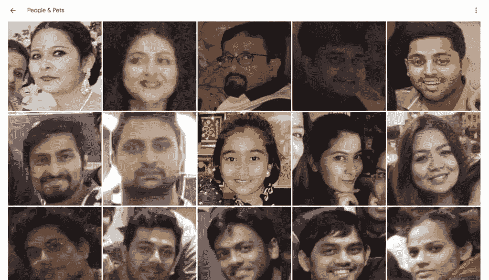
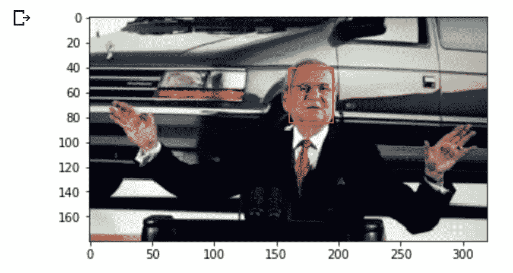
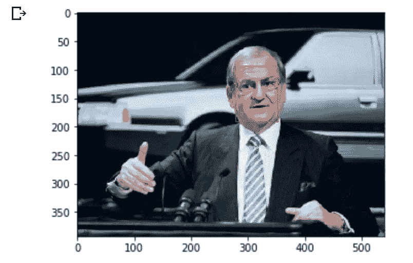
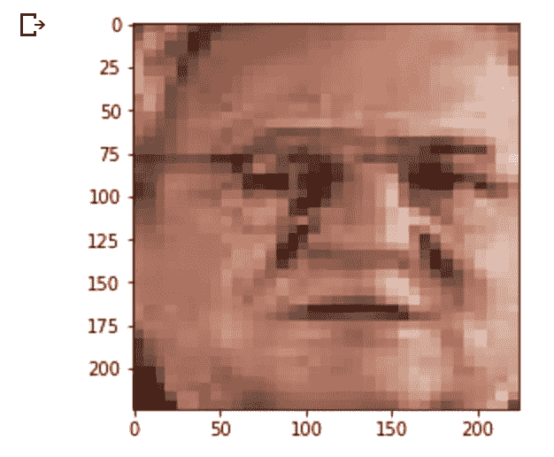
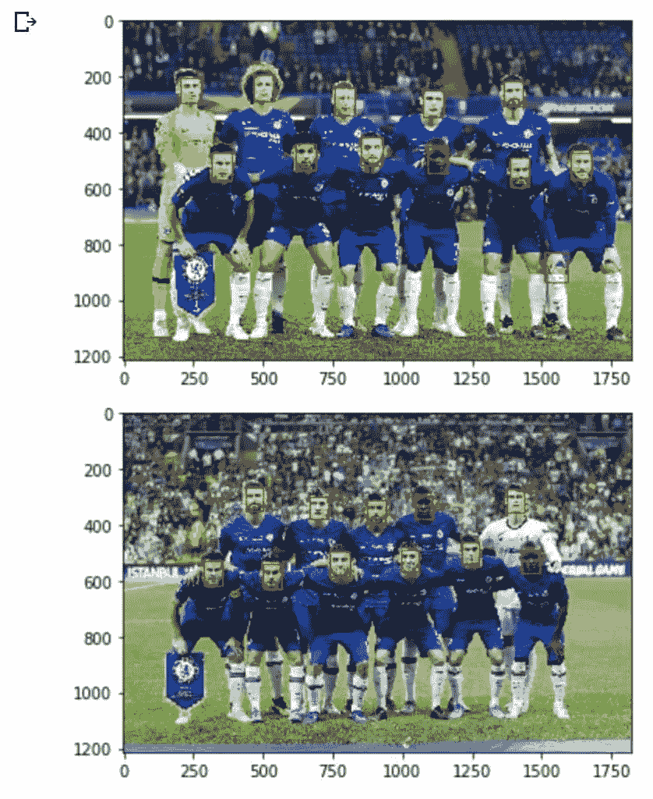
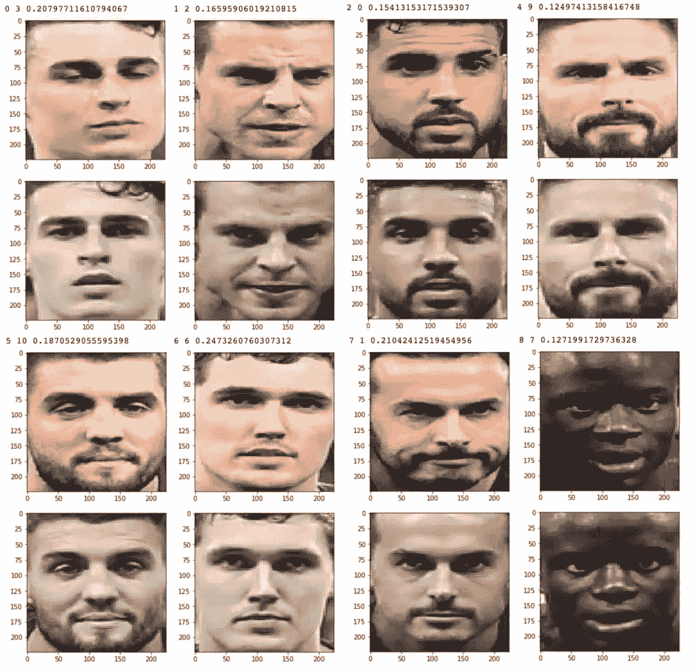

# 基于 Keras 的人脸检测和识别

> 原文：<https://www.sitepoint.com/keras-face-detection-recognition/>

如果你是谷歌照片的普通用户，你可能已经注意到该应用程序是如何从你备份到云端的照片中自动提取人脸并进行分组的。

Face Recognition in the Google Photos web application

像谷歌这样的照片应用程序通过检测人脸来实现这一点(还有宠物！)中，然后将相似的面孔组合在一起。图像中人脸的检测和分类是利用神经网络进行深度学习的常见任务。

在本教程的第一步，我们将使用 Keras 中预训练的 MTCNN 模型来检测图像中的人脸。一旦我们从图像中提取了人脸，我们将计算这些人脸之间的相似性得分，以确定它们是否属于同一个人。

## 先决条件

在开始检测和识别人脸之前，您需要设置您的开发环境。首先，在对图像进行任何处理之前，您需要通过 Python“读取”图像。我们将使用绘图库`matplotlib`来读取和操作图像。通过安装程序`pip`安装最新版本:

```
pip3 install matplotlib 
```

要使用 CNN 算法的任何实现，您需要安装`keras`。使用以下命令下载并安装最新版本:

```
pip3 install keras 
```

我们将用于人脸检测的算法是 MTCNN(多任务卷积神经网络)，基于论文“[使用多任务级联卷积网络的联合人脸检测和对准](https://arxiv.org/abs/1604.02878)”(张等，2016)。Python3.4 [中 TensorFlow 的 MTCNN 算法的实现作为一个包](https://pypi.org/project/mtcnn/)可用。运行以下命令通过`pip`安装软件包:

```
pip3 install mtcnn 
```

为了在从图像中提取人脸后进行比较，我们将使用由牛津大学视觉几何小组开发的 VGGFace2 算法。VGG 算法的基于 TensorFlow 的 Keras 实现以软件包的形式提供，供您安装:

```
pip3 install keras_vggface 
```

虽然您可能觉得需要构建和训练自己的模型，但您需要庞大的训练数据集和强大的处理能力。由于本教程的重点是这些模型的效用，所以它使用了该领域专家现有的、经过训练的模型。

既然您已经成功安装了必备组件，让我们直接进入教程吧！

## 步骤 1:用 MTCNN 模型进行人脸检测

这一步的目标如下:

*   检索本地服务器外部托管的图像
*   通过`matplotlib`的`imread()`功能读取图像
*   通过 MTCNN 算法检测和探索人脸
*   从图像中提取人脸

### 1.1 存储外部图像

您可能经常对托管在外部服务器上的图像进行分析。对于这个例子，我们将使用野马之父李·艾柯卡的两张图片，主持人分别是 [BBC](https://www.bbc.com/news/world-us-canada-48851380) 和[底特律新闻](https://www.detroitnews.com/story/business/columnists/daniel-howes/2019/07/03/iacocca-last-supreme-auto-bosses/1637512001/)网站。

为了将图像临时存储在本地以供我们分析，我们将从其 URL 中检索每个图像，并将其写入本地文件。让我们为此定义一个函数`store_image`:

```
import urllib.request

def store_image(url, local_file_name):
  with urllib.request.urlopen(url) as resource:
    with open(local_file_name, 'wb') as f:
      f.write(resource.read()) 
```

现在，您可以简单地使用 URL 和要存储图像的本地文件来调用该函数:

```
store_image('https://ichef.bbci.co.uk/news/320/cpsprodpb/5944/production/_107725822_55fd57ad-c509-4335-a7d2-bcc86e32be72.jpg',
            'iacocca_1.jpg')
store_image('https://www.gannett-cdn.com/presto/2019/07/03/PDTN/205798e7-9555-4245-99e1-fd300c50ce85-AP_080910055617.jpg?width=540&height=&fit=bounds&auto=webp',
            'iacocca_2.jpg') 
```

成功检索图像后，让我们检测其中的人脸。

### 1.2 检测图像中的人脸

为此，我们将创建两个导入— `matplotlib`用于读取图像，而`mtcnn`用于检测图像中的人脸:

```
from matplotlib import pyplot as plt
from mtcnn.mtcnn import MTCNN 
```

使用`imread()`功能读取图像:

```
image = plt.imread('iacocca_1.jpg') 
```

接下来，将一个`MTCNN()`对象初始化到`detector`变量中，并使用`.detect_faces()`方法来检测图像中的人脸。让我们看看它会返回什么:

```
detector = MTCNN()

faces = detector.detect_faces(image)
for face in faces:
  print(face) 
```

对于每张脸，返回一个 Python 字典，其中包含三个键。`box`键包含图像中面部的边界。它有四个值:左上顶点的 x 和 y 坐标，包含该面的矩形的宽度和高度。其他键是`confidence`和`keypoints`。`keypoints`键包含一个字典，该字典包含检测到的面部特征及其坐标:

```
{'box': [160, 40, 35, 44], 'confidence': 0.9999798536300659, 'keypoints': {'left_eye': (172, 57), 'right_eye': (188, 57), 'nose': (182, 64), 'mouth_left': (173, 73), 'mouth_right': (187, 73)}} 
```

### 1.3 突出显示图像中的人脸

现在我们已经成功检测到一张脸，让我们在它上面画一个矩形来突出显示图像中的脸，以验证检测是否正确。

要绘制矩形，请从`matplotlib.patches`导入`Rectangle`对象:

```
from matplotlib.patches import Rectangle 
```

让我们定义一个函数`highlight_faces`来首先显示图像，然后在检测到的人脸上画矩形。首先，通过`imread()`读取图像，并通过`imshow()`绘制图像。对于每个检测到的人脸，使用`Rectangle()`类绘制一个矩形。

最后，使用`.show()`方法显示图像和矩形。如果您使用的是 Jupyter 笔记本，您可以使用`%matplotlib inline` magic 命令来显示内联绘图:

```
def highlight_faces(image_path, faces):
  # display image
  image = plt.imread(image_path)
  plt.imshow(image)

  ax = plt.gca()

  # for each face, draw a rectangle based on coordinates
  for face in faces:
    x, y, width, height = face['box']
    face_border = Rectangle((x, y), width, height,
                          fill=False, color='red')
    ax.add_patch(face_border)
  plt.show() 
```

现在让我们使用`highlight_faces()`功能显示图像和检测到的面部:

```
highlight_faces('iacocca_1.jpg', faces) 
```

Detected face in an image of Lee Iacocca. Source: [BBC](https://www.bbc.com/news/world-us-canada-48851380)

让我们显示第二个图像和在其中检测到的面部:

```
image = plt.imread('iacocca_2.jpg')
faces = detector.detect_faces(image)

highlight_faces('iacocca_2.jpg', faces) 
```

[The Detroit News](https://www.detroitnews.com/story/business/columnists/daniel-howes/2019/07/03/iacocca-last-supreme-auto-bosses/1637512001/)

在这两幅图像中，可以看到 MTCNN 算法正确地检测到了人脸。现在让我们从图像中提取这张脸，对它进行进一步的分析。

### 1.4 提取面部用于进一步分析

在这一点上，你从探测器上知道了人脸的坐标。使用列表索引提取人脸是一项相当简单的任务。然而，我们使用的 VGGFace2 算法需要将人脸的大小调整为 224 x 224 像素。我们将使用 PIL 图书馆来调整图像的大小。

函数`extract_face_from_image()`从图像中提取所有人脸:

```
from numpy import asarray
from PIL import Image

def extract_face_from_image(image_path, required_size=(224, 224)):
  # load image and detect faces
  image = plt.imread(image_path)
  detector = MTCNN()
  faces = detector.detect_faces(image)

  face_images = []

  for face in faces:
    # extract the bounding box from the requested face
    x1, y1, width, height = face['box']
    x2, y2 = x1 + width, y1 + height

    # extract the face
    face_boundary = image[y1:y2, x1:x2]

    # resize pixels to the model size
    face_image = Image.fromarray(face_boundary)
    face_image = face_image.resize(required_size)
    face_array = asarray(face_image)
    face_images.append(face_array)

  return face_images

extracted_face = extract_face_from_image('iacocca_1.jpg')

# Display the first face from the extracted faces
plt.imshow(extracted_face[0])
plt.show() 
```

这是从第一张图像中提取的人脸的样子。

Extracted and resized face from first image

## 第二步:用 VGGFace2 模型进行人脸识别

在这一节中，让我们首先在已经检索到的两张李·艾柯卡图像上测试这个模型。然后，我们将继续比较 2018 年和 2019 年切尔西足球队首发 11 人的图像。然后你将能够评估该算法是否在图像之间识别出共同球员的脸。

### 2.1 比较两张脸

在本节中，您需要导入三个模块:`VGGFace`来准备要在人脸识别模型中使用的提取的人脸，以及来自 SciPy 的`cosine`函数来计算两张人脸之间的距离:

```
from keras_vggface.utils import preprocess_input
from keras_vggface.vggface import VGGFace
from scipy.spatial.distance import cosine 
```

让我们定义一个函数，它将提取的人脸作为输入，并返回计算的模型分数。该模型返回一个矢量，该矢量表示人脸的特征:

```
def get_model_scores(faces):
  samples = asarray(faces, 'float32')

  # prepare the data for the model
  samples = preprocess_input(samples, version=2)

  # create a vggface model object
  model = VGGFace(model='resnet50',
      include_top=False,
      input_shape=(224, 224, 3),
      pooling='avg')

  # perform prediction
  return model.predict(samples)

faces = [extract_face_from_image(image_path)
         for image_path in ['iacocca_1.jpg', 'iacocca_2.jpg']]

model_scores = get_model_scores(faces) 
```

由于每个人脸的模型分数是向量，我们需要找到两张人脸的分数之间的相似性。我们通常可以使用欧几里德或余弦函数来计算相似性。

人脸的矢量表示适合余弦相似性。下面是一个例子对[余弦距离和欧几里德距离的详细比较。](https://cmry.github.io/notes/euclidean-v-cosine)

`cosine()`函数计算两个向量之间的余弦距离。这个数字越低，你们的脸就越匹配。在我们的例子中，我们将把阈值放在距离`0.4`处。这个阈值是有争议的，并且会随着您的用例而变化。您应该根据数据集的案例研究来设置此阈值:

```
if cosine(model_scores[0], model_scores[1]) <= 0.4:
  print("Faces Matched") 
```

在这种情况下，李·艾柯卡的两张面孔相匹配:

```
Faces Matched 
```

### 2.2 比较两幅图像中的多张人脸

让我们在教程的这一部分好好利用这个模型。我们将比较 2018-19 赛季欧洲联赛对阵斯拉维亚布拉格的比赛[和 2019-20 赛季欧洲超级杯对阵 T2 的比赛](https://weaintgotnohistory.sbnation.com/2019/4/18/18485509/chelsea-vs-slavia-prague-europa-league-confirmed-lineups-how-to-watch-highlights-live-blog)中切尔西足球俱乐部首发 11 场比赛的两张图像中的人脸。虽然许多球员都出现在两个比赛日的球队中，但让我们看看该算法是否能够检测到所有共同的球员。

首先，让我们从 URL 中检索资源，检测每张图像中的人脸并突出显示它们:

```
store_image('https://cdn.vox-cdn.com/thumbor/Ua2BXGAhneJHLQmLvj-ZzILK-Xs=/0x0:4872x3160/1820x1213/filters:focal(1877x860:2655x1638):format(webp)/cdn.vox-cdn.com/uploads/chorus_image/image/63613936/1143553317.jpg.5.jpg',
            'chelsea_1.jpg')

image = plt.imread('chelsea_1.jpg')
faces_staring_xi = detector.detect_faces(image)

highlight_faces('chelsea_1.jpg', faces_staring_xi)

store_image('https://cdn.vox-cdn.com/thumbor/mT3JHQtZIyInU8_uGxVH-TCbF50=/0x415:5000x2794/1820x1213/filters:focal(1878x1176:2678x1976):format(webp)/cdn.vox-cdn.com/uploads/chorus_image/image/65171515/1161847141.jpg.0.jpg',
            'chelsea_2.jpg')

image = plt.imread('chelsea_2.jpg')
faces = detector.detect_faces(image)

highlight_faces('chelsea_2.jpg', faces) 
```

[SBNation](https://weaintgotnohistory.sbnation.com/)

在我们继续之前，这里是两场比赛的 11 个开始:

*   [斯拉维亚布拉格比赛首发 XI](https://www.skysports.com/football/chelsea-vs-slavia-prague/406471) :帕克、阿兹皮里库塔、路易斯、克里斯滕森、埃莫森、坎特、巴克利、科瓦契奇、哈扎德、佩德罗、吉鲁
*   [斯拉维亚布拉格比赛首发 XI](https://www.skysports.com/football/liverpool-vs-chelsea/407280) :帕克、阿兹皮里库塔、克里斯滕森、祖玛、埃莫森、坎特、若日尼奥、科瓦契奇、佩德罗、吉鲁、普利希奇

我们有八个玩家，他们是两个开始 XIs 共有的，并且理想情况下应该被算法匹配。

让我们首先计算分数:

```
slavia_faces = extract_face_from_image('chelsea_1.jpg')
liverpool_faces = extract_face_from_image('chelsea_2.jpg')

model_scores_starting_xi_slavia = get_model_scores(slavia_faces)
model_scores_starting_xi_liverpool = get_model_scores(liverpool_faces)
``
for idx, face_score_1 in enumerate(model_scores_starting_xi_slavia):
  for idy, face_score_2 in enumerate(model_scores_starting_xi_liverpool):
    score = cosine(face_score_1, face_score_2)
    if score <= 0.4:
      # Printing the IDs of faces and score
      print(idx, idy, score)
      # Displaying each matched pair of faces
      plt.imshow(slavia_faces[idx])
      plt.show()
      plt.imshow(liverpool_faces[idy])
      plt.show() 
```

这是算法匹配的面部对列表。请注意，它已经能够匹配所有八对人脸。

Eight Correctly Recognized Faces (Kepa, Azpilicueta, Emerson, Giroud, Kante, Pedro, Christensen, Kovacic)

虽然我们成功地匹配了图像中的每一张脸，但我想后退一步来讨论分数的影响。如前所述，没有一个通用的阈值可以将两幅图像匹配在一起。您可能需要根据分析中的新数据重新定义这些阈值。例如，当 Google 相册无法以编程方式确定一对照片的最佳阈值时，它也会接受您的输入。

Google Photos taking user inputs for face matching

最好的方法是在匹配不同类型的人脸时仔细评估案例。面部表情及其角度也在决定精确度方面发挥了作用。在我们的用例中，请注意我是如何故意使用开始 11 点的照片的，因为玩家正盯着摄像机！你可以试着把首发的 11 张脸和那些庆祝奖杯的脸匹配起来，我敢肯定准确率会下降。

## 结论

在本教程中，我们首先使用 MTCNN 模型检测图像中的人脸，并在图像中高亮显示它们，以确定该模型是否正确工作。接下来，我们使用 VGGFace2 算法以向量的形式从人脸中提取特征，并匹配不同的人脸以将它们分组在一起。

你使用不同的算法来检测和匹配人脸吗？一定要在推特上让我知道！

## 分享这篇文章