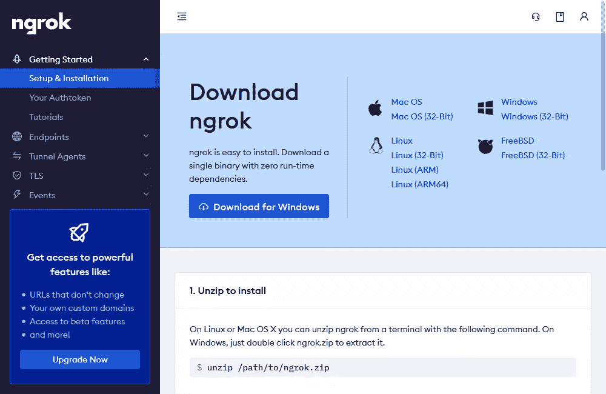
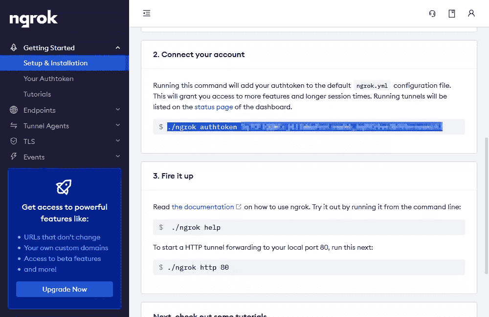
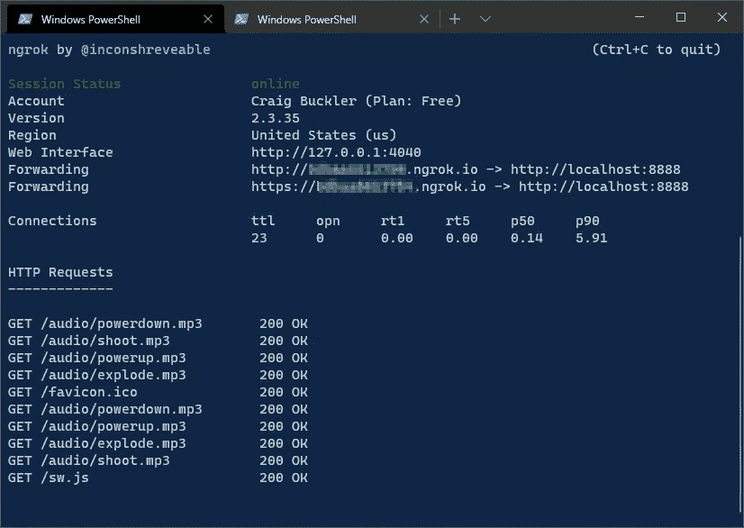
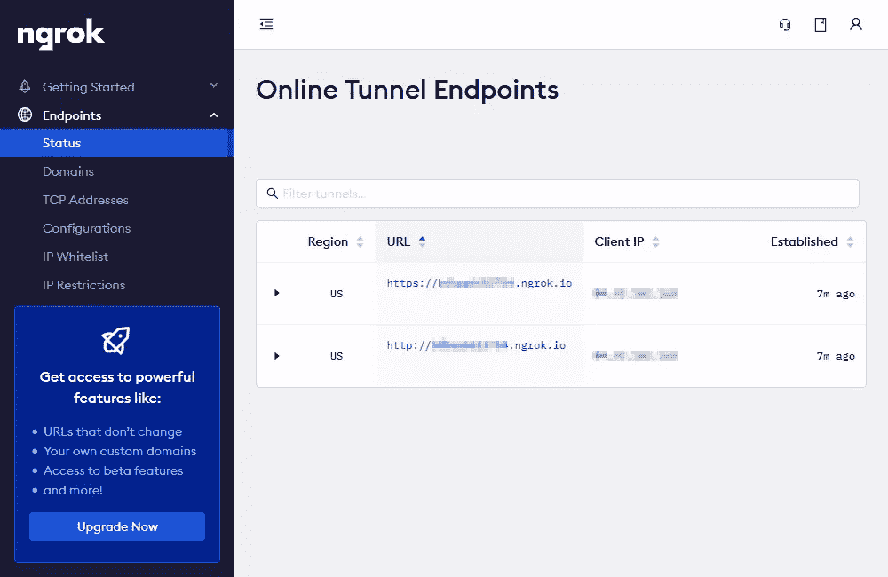

# ngrok 分步指南:轻松共享您的本地服务器

> 原文：<https://www.sitepoint.com/use-ngrok-test-local-site/>

本教程演示了一种在任何地方与任何人共享本地主机服务器的方法，使用 ngrok 创建一个到本地机器的安全隧道。

向项目经理或客户展示你的应用程序的最新特性并不容易，除非他们就坐在离你不远的地方。也许可以提交更改并部署到一个公共的临时服务器，但是如果您只是寻求一个关于小部件颜色的意见或者证明他们荒谬的建议是无用的，那么这个过程可能是不切实际的！

理想情况下，你需要某种方式让[共享对你的`localhost`服务器](https://www.sitepoint.com/accessing-localhost-from-anywhere/)的访问。ngrok 提供了这种解决方案。我们将向您展示如何为任何目的设置它，并留给您最好的 ngrok 替代方案(以防万一)。

## What is ngrok?

您的开发机器可能连接到防火墙后的安全网络。为了解决访问限制，ngrok 在您的机器上运行一个小的客户端进程，创建一个到云服务的私有连接隧道。您的`localhost`开发服务器被映射到一个`ngrok.io`子域，远程用户可以访问这个子域。无需暴露端口、设置转发或进行其他网络更改。

ngrok 客户端软件适用于 Windows、macOS 和 Linux。

## 本地隧道安全吗？

ngrok 建立的连接隧道是安全的，只能向你打开的`localhost`端口传输数据。很难造成任何损害，但它的安全性取决于您正在测试的应用程序。

在大多数情况下，您将使用 ngrok 通过向某人发布一个随机生成的 URL 来临时授予他们访问权限。最好假设任何人都可以在隧道打开时访问您的应用程序。当隧道处于活动状态时，您可能需要禁用*“删除所有文件”*选项！

## 服务费用是多少？

基本的 ngrok [服务](https://ngrok.com/pricing)是免费的，每分钟允许多达 4 个隧道和 40 个连接。商业选项从每月 5 美元开始，提供进一步的连接和自定义域。

## 获取 ngrok 下载

首先，在浏览器中打开 ngrok.com，点击**注册**进行注册。谷歌或 GitHub 帐户是最简单的，但你可以选择标准注册，并提供电子邮件地址和密码。我们将向您发送一封电子邮件验证链接。

登录后，您将被定向到 ngrok 仪表板，在那里您可以下载适用于您的操作系统的客户端。



按照针对您的操作系统的任何特定说明，下载并解压缩该文件。然后，需要通过运行页面下方的 **Connect your account** 部分中显示的命令来添加您的身份验证令牌。



```
./ngrok authtoken <token> 
```

*注意:Windows 用户会输入`./ngrok.exe`。*

## 如何使用 ngrok

使用正常的启动命令启动您的 web 应用程序，然后记下端口以及它是在`http`还是`https`上运行。要启动新隧道，请运行:

```
./ngrok <protocol> <port> 
```

例如，如果您的站点在`http://localhost:8888`提供服务，请输入:

```
./ngrok http 8888 
```

终端会清除并显示状态，有两个**转发** `http`和`https`地址，如`http://123456789.ngrok.io/`。您可以将任一 URL 传递给另一个人，这样他们就可以从任何地方访问您的应用程序。ngrok 激活时，终端显示请求日志。



位于*dashboard.ngrok.com/endpoints/status*的 ngrok 状态面板也显示了当前活动的 URL 和客户端 IP 地址的列表。(您可能需要刷新浏览器来更新它。)



完成后，在终端中按`Ctrl` | `Cmd` + `C`退出 ngrok。输入以下内容可获得更多帮助和选项:

```
./ngrok help 
```

## ngrok 替代方案

ngrok 可能是最简单和最知名的`localhost`隧道服务，但是替代选项包括:

*   [**LocalXpose**](https://localxpose.io/) :一种商业服务，选项免费。需要注册，但是基于终端和图形用户界面的客户端是可用的。
*   localhost.run :通过 SSH 运行的免费服务，因此不需要客户端或注册。
*   [**localtunnel**](https://localtunnel.github.io/www/) :开源的 Node.js 客户端。不需要注册。
*   [**JPRQ**](https://github.com/azimjohn/jprq) :开源的 Python 客户端。不需要注册。
*   [**sish**](https://github.com/antoniomika/sish) :开源的，基于 Docker 的容器客户端。不需要注册。

ngrok 和类似的安全隧道服务可以彻底改变您向其他远程工作人员演示 web 应用程序的方式。这将有助于测试并减少令人沮丧的反馈延迟。

## 分享这篇文章