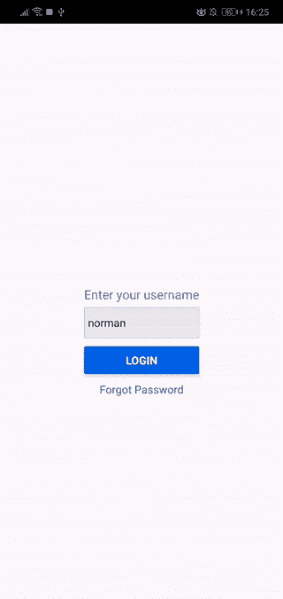
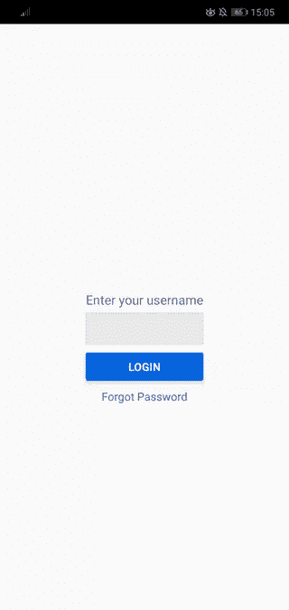
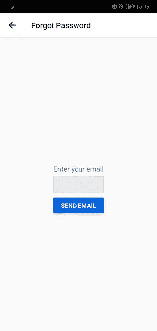
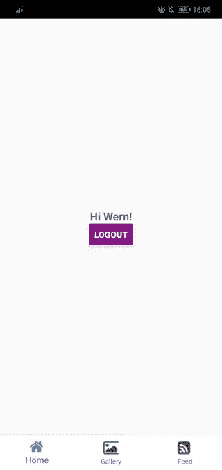
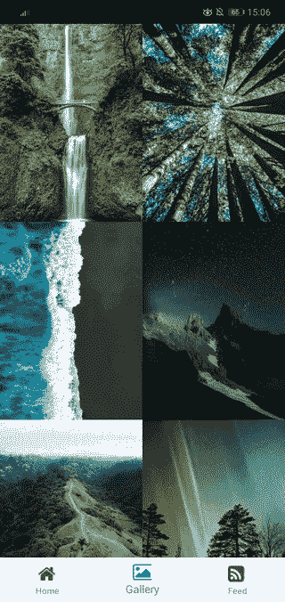

# React 本机导航库入门

> 原文：<https://www.sitepoint.com/react-native-navigation-library/>

React 原生应用开发最重要的一个方面是导航。它让用户能够找到他们想要的页面。这就是为什么选择最适合自己需求的导航库很重要。

如果你的应用程序有很多界面相对复杂的屏幕，也许值得探索一下 [React 原生导航](https://github.com/wix/react-native-navigation)而不是 [React 导航](https://reactnavigation.org/)。这是因为 React 导航总会有性能瓶颈，因为它与应用程序的其他部分使用相同的 JavaScript 线程。您的 UI 越复杂，需要传递给那个桥的数据就越多，这可能会降低它的速度。

在本教程中，我们将了解 Wix 的 React 本机导航库，这是一个可供选择的导航库，适用于那些为 React 本机应用程序寻求更流畅导航性能的人。

### 先决条件

学习本教程需要 React 和 React Native 的知识。以前的经验与导航库，如反应导航是可选的。

读者还希望在本地安装[节点](https://www.sitepoint.com/quick-tip-multiple-versions-node-nvm/)和[纱线](https://classic.yarnpkg.com/en/docs/install)，以及一个 React 本地开发环境。你可以在这里找到设置[的帮助。务必选择 *React Native CLI Quickstart* 。](https://reactnative.dev/docs/environment-setup)

## 应用概述

为了演示如何使用这个库，我们将创建一个使用它的简单应用程序。该应用程序总共有五个屏幕:

*   **初始化**:这是应用程序的初始屏幕。如果用户已登录，它将自动导航到主屏幕。如果没有，用户将被导航到登录屏幕。
*   **登录**:这允许用户登录，以便他们可以查看主页、画廊和提要。简单来说，登录只会被嘲笑；不涉及实际的认证码。从该屏幕，用户还可以转到忘记密码屏幕。
*   **ForgotPassword** :填充屏幕，要求输入用户的电子邮件地址。这只是用来演示堆栈导航。
*   **Home** :用户登录时看到的初始屏幕。从这里，他们还可以通过底部的选项卡导航导航到画廊或提要屏幕。
*   **图库**:填充屏幕，显示图库 UI。
*   **Feed** :填充屏幕，显示新闻 feed UI。

这是该应用程序的外观:



你可以在这个 [GitHub repo](https://github.com/sitepoint-editors/RNNavigation) 上找到样例 app 的源代码。

## 引导应用程序

让我们从生成一个新的 React 本地项目开始:

```
npx react-native init RNNavigation 
```

接下来，安装应用程序的依赖项:

*   我们将要使用的导航库。因为它的名字很长，从现在起我将把它称为 RNN。
*   `@react-native-async-storage/async-storage`:用于将数据保存到应用的本地存储器。
*   `react-native-vector-icons`:显示底部标签导航图标。

```
yarn add react-native-navigation @react-native-async-storage/async-storage react-native-vector-icons 
```

一旦安装了这些，我们需要将相应的本机模块链接到应用程序。注意，我只打算介绍 React Native 0.60 及以上版本的模块链接。如果你使用的是旧版本的 React Native，你将不得不通过旧的方式来完成，那就是使用`react-native link`命令。这将链接我们刚刚安装的所有包的本机模块。但是有时会发生错误，所以您必须查看软件包的文档并查看他们的手动安装说明。

如果你用的是 React Native 0.60 及以上，我们就要用不同的方式链接 RNN、异步存储、矢量图标。

对于 RNN，您可以通过在项目目录的根目录下执行以下命令来实现:

```
npx rnn-link 
```

对于 AsyncStorage，您可以通过执行以下命令(仍然在项目的根目录下)来实现:

```
npx pod-install 
```

最后，对于矢量图标，你必须导航到 Android 应用的`android`目录和 iOS 应用的`ios`目录。对于 Android，编辑`android/app/build.gradle`文件，并在最后一个`apply from`调用后添加以下内容:

```
apply from: "../../node_modules/react-native-vector-icons/fonts.gradle" 
```

对于 iOS，在`ios`目录中执行以下命令:

```
pod install 
```

最后，像这样更新`index.js`:

```
import { Navigation } from "react-native-navigation";
import App from "./App";

Navigation.registerComponent('com.myApp.WelcomeScreen', () => App);
Navigation.events().registerAppLaunchedListener(() => {
   Navigation.setRoot({
     root: {
       stack: {
         children: [
           {
             component: {
               name: 'com.myApp.WelcomeScreen'
             }
           }
         ]
       }
     }
  });
}); 
```

## 尝试这个项目

在我们开始实际构建应用程序之前，让我们先测试一下这个项目，看看模块是否安装成功。首先，运行 Metro Bundler:

```
npx react-native start 
```

然后在任一平台上运行应用程序:

```
npx react-native run-android
npx react-native run-ios 
```

如果包没有问题，您应该能够看到默认的 React 本地项目欢迎屏幕。如果您看到此屏幕，您现在可以继续构建应用程序。否则，请查看下面的**常见问题**部分来解决问题。

### 常见问题

1.  通常出现的第一个问题是本地模块的链接失败。这通常发生在 RNN，因为他们有一个用于链接本地模块的自定义脚本。根据您使用的 React 原生版本，这可能会失败。如果是这种情况，请遵循文档中的手动安装说明:

*   [安卓](https://wix.github.io/react-native-navigation/docs/installing#ios)
*   [iOS](https://wix.github.io/react-native-navigation/docs/installing#ios)

1.  第二个常见问题是这样的:“React Native multidex error:一个. dex 文件中方法引用的数量不能超过 64K”。当应用程序(和您正在使用的库)超过一定数量的方法时，就会出现这种情况。这种情况下是 64000 左右(准确的说是 65536)。这是 Android 构建架构的[极限。要解决这个问题，您可以启用多指数支持。为此，打开您的`android/app/build.gradle`文件并在`defaultConfig`和`dependencies`下添加以下内容:](https://developer.android.com/studio/build/multidex)

```
defaultConfig {
  // ...
  multiDexEnabled true
}
// ...
dependencies {
  // ...
  implementation 'com.android.support:multidex:1.0.3'
} 
```

这是您在尝试遵循本教程时可能会遇到的两个最常见的问题。如果您遇到任何其他问题，请让我知道或搜索该问题。通常，有人已经遇到过这个问题，你可以在 GitHub 的项目问题上找到这个问题。

## 构建应用程序

现在，我们终于准备好开始构建应用程序了。

### 索引. js

首先，打开项目根目录下现有的`index.js`,用下面的代码替换它的内容。这是应用程序的入口。如果你注意到了，我们不再需要使用 React Native 的 [AppRegistry](https://reactnative.dev/docs/appregistry) 来注册主要的应用组件。相反，我们现在使用 RNN 的`registerComponent()`方法。这与我们之前对`MainActivity.java`和`AppDelegate.m`文件的更新有关。

`registerComponent()`方法接受屏幕的唯一名称和用于呈现屏幕的组件。注册完成后，我们调用`registerAppLaunchedListener()`方法将应用程序的根屏幕设置为`LoadingScreen`。这类似于`AppRegistry.registerComponent()`的功能:

```
// index.js
import { Navigation } from "react-native-navigation";
import Icon from "react-native-vector-icons/FontAwesome";
Icon.loadFont();

import Loading from "./src/screens/Loading"; // the loading screen

import "./loadIcons"; // file for loading the icons to be used in the bottom tab navigation

Navigation.registerComponent("LoadingScreen", () => Loading);

Navigation.events().registerAppLaunchedListener(() => {
  // set the root component
  Navigation.setRoot({
    root: {
      component: {
        name: "LoadingScreen",
      },
    },
  });
}); 
```

### 装载屏幕

加载屏幕是应用程序的入口。但是你可能会问为什么加载屏幕？为什么不用登录界面呢？这是因为我们的示例应用程序有一个模拟登录系统，这意味着我们首先必须确定用户是否已经登录。使用加载屏幕比最初加载登录屏幕时发现用户已经登录要好得多，因此我们必须将用户导航到主屏幕。

首先创建一个`src/screens/Loading.js`文件，并添加以下内容:

```
// src/screens/Loading.js
import React, { Component } from "react";
import { View, Text, ActivityIndicator, StyleSheet } from "react-native";

import { goToLogin, goToTabs } from "../../navigation"; // import the functions for loading either the login screen or the tabs screen (shows home screen by default)

import AsyncStorage from "@react-native-async-storage/async-storage"; 
```

接下来，创建组件本身。当组件被挂载时，我们试图从本地存储中获取登录用户的`username`。如果存在，我们将用户导航到选项卡，否则导航到登录屏幕:

```
export default class Loading extends Component {
  async componentDidMount() {
    const username = await AsyncStorage.getItem("username");
    if (username) {
      goToTabs(global.icons, username);
    } else {
      goToLogin();
    }
  }

  render() {
    // show loading indicator
    return (
      <View style={styles.container}>
        <ActivityIndicator size="large" color="#0000ff" />
      </View>
    );
  }
}

const styles = StyleSheet.create({
  container: {
    flex: 1,
    justifyContent: "center",
    alignItems: "center",
  },
}); 
```

在上面的代码中，注意我们将`global.icons`作为参数传递给了`goToTabs()`函数。该值被设置在我们之前从`index.js`文件导入的`loadIcons.js`中。它的工作是加载用于底部标签的图标，稍后您将会看到。

### 导航. js

在这里，我们注册应用程序的所有屏幕，并声明用于在登录屏幕和选项卡式屏幕之间导航的导航功能:

```
// navigation.js
import { Navigation } from "react-native-navigation";

import Login from "./src/screens/Login";
import ForgotPassword from "./src/screens/ForgotPassword";
import Home from "./src/screens/Home";
import Feed from "./src/screens/Feed";
import Gallery from "./src/screens/Gallery";

Navigation.registerComponent("LoginScreen", () => Login);
Navigation.registerComponent("ForgotPasswordScreen", () => ForgotPassword);
Navigation.registerComponent("HomeScreen", () => Home);
Navigation.registerComponent("FeedScreen", () => Feed);
Navigation.registerComponent("GalleryScreen", () => Gallery); 
```

`goToLogin()`函数创建一个堆栈导航。在 RNN，这些导航类型被称为“布局”。目前，只有三个:堆栈、标签和抽屉。在本教程中，我们将只使用堆栈和选项卡，但下面是对每一个的简要概述:

*   :您导航到的每个新屏幕都位于当前屏幕之上。所以当你回到前一个屏幕时，想法是简单地从堆栈中“弹出”当前屏幕。我们将使用堆栈导航在登录屏幕和密码屏幕之间导航。
*   **[标签](https://wix.github.io/react-native-navigation/docs/bottomTabs)** :每个屏幕都可以通过底部标签导航进入。每个选项卡上都有图标和文本来描述用户导航到的屏幕。如果应用程序中有两个或更多的主屏幕，这种类型的导航通常会使用。底部的选项卡导航允许在这些屏幕之间轻松访问。我们将使用选项卡导航在主页、画廊和订阅源屏幕之间导航。
*   **[抽屉](https://wix.github.io/react-native-navigation/docs/sideMenu)** :也叫侧菜单。之所以称之为抽屉，是因为它通常隐藏在一个汉堡图标中，只有点击时才会显示其下的菜单。

回到代码，我们只添加了登录屏幕作为堆栈导航的子元素，尽管 ForgotPassword 屏幕也是它的一部分。如前所述，我们将使用堆栈导航在登录屏幕和 ForgotPassword 屏幕之间导航。然而，我们只是作为一个孩子在这里添加了登录屏幕。添加它只会使它成为堆栈的默认屏幕。在堆栈导航中，您应该只将该特定堆栈的初始屏幕添加为子堆栈，稍后您将会看到这一点。

对孩子的最低要求是为每个屏幕添加`name`属性。这是用于渲染的屏幕名称。该名称应该与您注册组件时使用的名称相同:

```
export const goToLogin = () =>
  Navigation.setRoot({
    root: {
      stack: {
        // create a stack navigation
        id: "stackMain",
        children: [
          {
            component: {
              name: "LoginScreen",
            },
          },
        ],
      },
    },
  }); 
```

*注意:为导航提供一个 ID 并不是必需的，但是这是一个好的实践——特别是当你知道你将在你的应用中多次使用相同的布局类型的时候。*

接下来，添加`goToTabs()`函数。与前面的函数不同，它接受两个参数:`icons`和`username`。`icons`是用于各个选项卡的图标阵列，而`username`是登录用户的用户名。这次，我们使用的是`bottomTabs`导航。顾名思义，这允许用户使用底部选项卡在屏幕之间导航。您可以使用以下格式创建底部标签:

```
const iconColor = "#444";
const selectedIconColor = "#0089da";

export const goToTabs = (icons, username) => {
  Navigation.setRoot({
    root: {
      bottomTabs: {
        // create a bottom tabs navigation

        id: "bottomTabsMain",
        children: [
          {
            component: {
              name: "HomeScreen",
              options: {
                bottomTab: {
                  fontSize: 11,
                  text: "Home",
                  icon: icons[0],
                  iconColor,
                  selectedIconColor,
                },
              },

              // pass the username as a navigation prop to the Home screen
              passProps: {
                username,
              },
            },
          },

          {
            component: {
              name: "GalleryScreen",
              options: {
                bottomTab: {
                  fontSize: 11,
                  text: "Gallery",
                  icon: icons[1],
                  iconColor,
                  selectedIconColor,
                },
              },
            },
          },

          {
            component: {
              name: "FeedScreen",
              options: {
                bottomTab: {
                  fontSize: 11,
                  text: "Feed",
                  icon: icons[2],
                  iconColor,
                  selectedIconColor,
                },
              },
            },
          },
        ],
      },
    },
  });
}; 
```

正如您从上面的代码中看到的，这几乎使用了与堆栈导航相同的格式。唯一的区别是，这一次，我们还为个体`bottomTab`指定了一个`options`属性。这些选项主要用于配置单个选项卡的样式。它们是不言自明的，所以我不会详细说明，但我只想解释一下`icon`属性。默认情况下，它接受一个`require('./path/to/image.png')`调用所需的本地映像。但是既然我们已经安装了矢量图标，我们也可以用它作为图标源。唯一的问题是我们不能真正提供一个 React 组件作为`icon`的值，因为它需要一个资源。`icons`参数接受一组图标资源，这就是我们正在使用的。在下一节中，您将了解我们是如何加载这些内容的。

*注意:你可以在[官方文档的](https://wix.github.io/react-native-navigation/docs/style-options)中找到更多底部标签的样式选项。找`bottomTabs`或者`bottomTab`就行了。*

### load icons . js-载入图示. js

这是我们之前在`index.js`文件中导入的`loadIcons`文件的代码。这使用了来自 [FontAwesome](https://fontawesome.com/) 的图标。这里，我们使用`getImageSource()` [方法](https://github.com/oblador/react-native-vector-icons#static-methods)从矢量图标中获取实际的图像资源。这允许我们将其用作底部选项卡的图标:

```
// loadIcons.js
import Icon from "react-native-vector-icons/FontAwesome";
Icon.loadFont();

(function() {
  Promise.all([
    Icon.getImageSource("home", 11), // name of icon, size
    Icon.getImageSource("image", 11),
    Icon.getImageSource("rss-square", 11),
  ]).then(async (values) => {
    global.icons = values; // make it available globally so we don't need to load it again
  });
})(); 
```

### 登录屏幕



登录屏幕是用户未登录时将看到的默认屏幕。在这里，他们可以通过输入用户名登录，也可以点击**忘记密码**查看重置密码的屏幕。如前所述，所有这些都只是模仿，并没有使用实际的身份验证代码:

```
// src/screens/Login.js
import React, { Component } from "react";
import { Navigation } from "react-native-navigation";
import {
  View,
  Text,
  TextInput,
  Button,
  TouchableOpacity,
  StyleSheet,
} from "react-native";
import AsyncStorage from "@react-native-async-storage/async-storage";

import { goToTabs } from "../../navigation";

export default class Login extends Component {
  static get options() {
    return {
      topBar: {
        visible: false, // need to set this because screens in a stack navigation have a header by default
      },
    };
  }

  state = {
    username: "",
  };

  render() {
    return (
      <View style={styles.wrapper}>
        <View style={styles.container}>
          <View style={styles.main}>
            <View style={styles.fieldContainer}>
              <Text style={styles.label}>Enter your username</Text>
              <TextInput
                onChangeText={(username) => this.setState({ username })}
                style={styles.textInput}
              />
            </View>

            <Button title="Login" color="#0064e1" onPress={this.login} />

            <TouchableOpacity onPress={this.goToForgotPassword}>
              <View style={styles.center}>
                <Text style={styles.link_text}>Forgot Password</Text>
              </View>
            </TouchableOpacity>
          </View>
        </View>
      </View>
    );
  }

  // next: add login code
}
//

const styles = StyleSheet.create({
  wrapper: {
    flex: 1,
  },
  container: {
    flex: 1,
    alignItems: "center",
    justifyContent: "center",
    padding: 20,
  },
  fieldContainer: {
    marginTop: 20,
  },
  label: {
    fontSize: 16,
  },
  textInput: {
    height: 40,
    marginTop: 5,
    marginBottom: 10,
    borderColor: "#ccc",
    borderWidth: 1,
    backgroundColor: "#eaeaea",
    padding: 5,
  },
}); 
```

这是登录密码。这只是将`username`存储到本地存储器，并将用户导航到选项卡式屏幕:

```
login = async () => {
  const { username } = this.state;
  if (username) {
    await AsyncStorage.setItem("username", username);
    goToTabs(global.icons, username);
  }
}; 
```

最后，这里是通过堆栈导航导航到另一个屏幕的代码。只需调用`Navigation.push()`方法，将当前屏幕的 ID 作为第一个参数传入，将您想要导航到的屏幕作为第二个参数传入。`name`应该是您之前在`navigation.js`文件中调用`Navigation.registerComponent()`时使用的那个:

```
goToForgotPassword = () => {
  Navigation.push(this.props.componentId, {
    component: {
      name: "ForgotPasswordScreen",
    },
  });
}; 
```

### 忽略密码屏幕



如前所述，这个屏幕只是用来填充演示堆栈导航。确保`topBar`设置为`visible`，因为这是返回登录屏幕的后退按钮所在的位置:

```
// src/screens/ForgotPassword.js
import React, { Component } from "react";
import { View, Text, TextInput, Button, StyleSheet } from "react-native";

export default class ForgotPassword extends Component {
  static get options() {
    return {
      topBar: {
        visible: true, // visible
        title: {
          text: "Forgot Password",
        },
      },
    };
  }

  state = {
    email: "",
  };

  render() {
    return (
      <View style={styles.wrapper}>
        <View style={styles.container}>
          <View style={styles.main}>
            <View style={styles.fieldContainer}>
              <Text style={styles.label}>Enter your email</Text>
              <TextInput
                onChangeText={(email) => this.setState({ email })}
                style={styles.textInput}
              />
            </View>

            <Button
              title="Send Email"
              color="#0064e1"
              onPress={this.sendEmail}
            />
          </View>
        </View>
      </View>
    );
  }

  //
  sendEmail = async () => {};
}
//

const styles = StyleSheet.create({
  wrapper: {
    flex: 1,
  },
  container: {
    flex: 1,
    alignItems: "center",
    justifyContent: "center",
    padding: 20,
  },
  fieldContainer: {
    marginTop: 20,
  },
  label: {
    fontSize: 16,
  },
  textInput: {
    height: 40,
    marginTop: 5,
    marginBottom: 10,
    borderColor: "#ccc",
    borderWidth: 1,
    backgroundColor: "#eaeaea",
    padding: 5,
  },
}); 
```

你也可以有一个单独的按钮返回到上一个屏幕。您所要做的就是调用`Navigation.pop()`方法:

```
Navigation.pop(this.props.componentId); 
```

### 主屏幕



主屏幕是选项卡式导航的默认屏幕，所以这是用户登录时默认看到的内容。这个屏幕显示了作为导航道具传递的用户名以及一个注销按钮。单击 logout 按钮将简单地从本地存储器中删除`username`,并将用户导航回登录屏幕:

```
// src/screens/Home.js
import React, { Component } from "react";
import { View, Text, Button, StyleSheet } from "react-native";
import Icon from "react-native-vector-icons/FontAwesome";
Icon.loadFont();

import AsyncStorage from "@react-native-async-storage/async-storage";

import { goToLogin } from "../../navigation";

export default class Home extends Component {
  render() {
    const { username } = this.props;
    return (
      <View style={styles.container}>
        <Text style={styles.text}>Hi {username}!</Text>
        <Button onPress={this.logout} title="Logout" color="#841584" />
      </View>
    );
  }
  //

  logout = async () => {
    await AsyncStorage.removeItem("username");
    goToLogin();
  };
}

const styles = StyleSheet.create({
  container: {
    flex: 1,
    justifyContent: "center",
    alignItems: "center",
  },
  text: {
    fontSize: 18,
    fontWeight: "bold",
  },
}); 
```

如果您想知道我们是如何访问`username`的，我们之前已经将它作为导航文件中的一个导航道具进行了传递:

```
// navigation.js
{
  component: {
    name: "HomeScreen",
    options: {
      ...
    },

    // here:
    passProps: {
      username
    },

  }
}, 
```

### 画廊屏幕



画廊屏幕只是一个填充屏幕，所以我们不会钻研太多。基本上，它只是显示一个照片库用户界面:

```
// src/screens/Gallery.js
import React, { Component } from "react";
import {
  View,
  Text,
  FlatList,
  Image,
  Dimensions,
  StyleSheet,
} from "react-native";

const { width } = Dimensions.get("window");
const base_width = width / 2;

const images = [
  {
    id: 1,
    src: require("img/blake-richard-verdoorn-20063-unsplash.jpg"),
  },
  {
    id: 2,
    src: require("img/casey-horner-487085-unsplash.jpg"),
  },
  {
    id: 3,
    src: require("img/sacha-styles-XK7thML3zEQ-unsplash.jpg"),
  },
  {
    id: 4,
    src: require("img/eberhard-grossgasteiger-1036384-unsplash.jpg"),
  },
  {
    id: 5,
    src: require("img/justin-kauffman-449060-unsplash.jpg"),
  },
  {
    id: 6,
    src: require("img/vincent-guth-182001-unsplash.jpg"),
  },
];

export default class Gallery extends Component {
  render() {
    return (
      <View style={styles.container}>
        <FlatList
          data={images}
          keyExtractor={(item, index) => item.id.toString()}
          numColumns={2}
          renderItem={this.renderImage}
        />
      </View>
    );
  }
  //

  renderImage = ({ item }) => {
    return (
      <Image source={item.src} style={{ width: base_width, height: 250 }} />
    );
  };
}

const styles = StyleSheet.create({
  container: {
    flex: 1,
  },
}); 
```

请注意，您需要[从我们的 repo](https://github.com/sitepoint-editors/RNNavigation/tree/master/src/images) 中复制图像，或者用您自己的图像替换它们。

### 进料筛


就像画廊屏幕一样，提要屏幕也是一个填充器。它只是显示了一个新闻提要用户界面:

```
// src/screens/Feed.js
import React, { Component } from "react";
import {
  View,
  Text,
  FlatList,
  Image,
  TouchableOpacity,
  StyleSheet,
} from "react-native";

const news_items = [
  {
    id: 1,
    title: "The HTML Handbook",
    summary:
      "HTML is the foundation of the marvel called the Web. Discover all you need to know about it in this handy handbook!",
    image: require("img/amanda-phung-1281331-unsplash.jpg"),
  },
  {
    id: 2,
    title: "Angular RxJs In-Depth",
    summary:
      "In this tutorial, we'll learn to use the RxJS 6 library with Angular 6 or Angular 7...",
    image: require("img/daniil-silantev-318853-unsplash.jpg"),
  },
  {
    id: 3,
    title: "How to Create Code Profiles in VS Code",
    summary:
      "This post piggybacks off of the work done by @avanslaars who is a fellow instructor at egghead.io....",
    image: require("img/vincent-van-zalinge-38358-unsplash.jpg"),
  },
];

export default class Feed extends Component {
  render() {
    return (
      <View style={styles.container}>
        <FlatList
          data={news_items}
          keyExtractor={(item, index) => item.id.toString()}
          renderItem={this.renderItem}
        />
      </View>
    );
  }
  //

  renderItem = ({ item }) => {
    return (
      <TouchableOpacity onPress={this.goToNews}>
        <View style={styles.news_item}>
          <View style={styles.news_text}>
            <View style={styles.text_container}>
              <Text style={styles.title}>{item.title}</Text>
              <Text>{item.summary}</Text>
            </View>
          </View>
          <View style={styles.news_photo}>
            <Image source={item.image} style={styles.photo} />
          </View>
        </View>
      </TouchableOpacity>
    );
  };
  //

  goToNews = () => {};
}
//

const styles = StyleSheet.create({
  container: {
    flex: 1,
  },
  news_item: {
    flex: 1,
    flexDirection: "row",
    paddingRight: 20,
    paddingLeft: 20,
    paddingTop: 20,
    paddingBottom: 20,
    borderBottomWidth: 1,
    borderBottomColor: "#E4E4E4",
  },
  news_text: {
    flex: 2,
    flexDirection: "row",
    padding: 15,
  },
  title: {
    fontSize: 28,
    fontWeight: "bold",
    color: "#000",
    fontFamily: "georgia",
  },
  news_photo: {
    flex: 1,
    justifyContent: "center",
    alignItems: "center",
  },
  photo: {
    width: 120,
    height: 120,
  },
}); 
```

## 运行应用程序

此时，您应该能够运行该应用程序了。从运行 Metro Bundler 开始:

```
npx react-native start 
```

然后在您的设备或模拟器上运行应用程序:

```
npx react-native run-android
npx react-native run-ios 
```

试用该应用程序，看看它的性能是否优于 React 导航(如果你以前用过的话)。

## 结论和下一步措施

在本教程中，您学习了如何使用 React 本机导航库。具体来说，您学习了如何设置 React 本机导航以及如何使用堆栈和选项卡导航。您还了解了如何从 React 本地矢量图标加载图标，而不是使用图像图标。

下一步，你可能想看看如何定制[动画](https://wix.github.io/react-native-navigation/docs/style-animations)，如何实现[侧菜单导航](https://wix.github.io/react-native-navigation/docs/sideMenu)，或者查看不同布局类型的[示例。](https://wix.github.io/react-native-navigation/docs/stack)

如果你仍然不确定在你的下一个项目中使用哪个导航库，一定要看看这篇文章:“ [React 导航与 React 本地导航:哪个适合你？](https://blog.logrocket.com/react-navigation-vs-react-native-navigation-which-is-right-for-you-3d47c1cd1d63/)

你可以在这个 [GitHub repo](https://github.com/sitepoint-editors/RNNavigation/tree/master/src/images) 上找到样例 app 的源代码。

## 分享这篇文章