# 如何查找和修复常见的网站可访问性问题

> 原文：<https://www.sitepoint.com/how-to-find-fix-common-website-accessibility-issues/>

现在是 21 世纪 20 年代，所以我们不应该再为无障碍环境辩护了。一个可访问的网站意味着你接触到更多的人，你接触到的人(甚至是有能力的人)都可以更容易地使用你的网站，你也不会被起诉。有了开发人员和设计人员可用的工具和资源，现在确保您有一个可访问的站点比以往任何时候都容易。

在 Polypane，可访问性是我们关注的三个核心领域之一，另外两个是性能和响应性设计。如果你不熟悉 Polypane，它是一款专门为网络开发者设计的网络浏览器。它有各种你在普通浏览器中找不到的工具——让你更加有效和高效的工具。要了解更多关于 Polypane 的信息，请查看介绍文章。

在这篇文章中，我们将关注一些常见的可访问性问题，并找到在您的站点中审计和修复它们的方法，以确保它尽可能地可访问。下面是我们要看的内容:

*   我的文本是否有足够的对比度，如果没有，我该如何解决？
*   我的网站如何寻找有视觉障碍的人，如色盲或远视？像明亮的阳光或具有夜间模式的设备这样的环境障碍怎么办？
*   我的页面结构对依赖它的人有意义吗？
*   我如何确保我的站点没有任何代码质量问题，我为提高可访问性所做的事情真的有帮助吗？
*   我的网站在小屏幕上运行良好吗？
*   我如何确保我的网站对于喜欢深色或者不擅长运动的用户来说工作得很好？

## 对比

我的文本是否有足够的对比度，如果没有，我该如何解决？

理想情况下，文本对比是在设计过程中处理的，使用像 [Stark](https://www.getstark.co/) 这样的工具可以很容易地测试单个文本和背景对。但不幸的是，情况并非总是如此。虽然网上有很多地方可以检查给定的文本颜色和背景(我们甚至[建立了我们自己的在线颜色对比测试器](https://polypane.app/color-contrast/)，你的网页可能有许多不同的颜色和背景，对于任何合理复杂的网站，你可能事先不知道所有的组合。

这使得人们很容易忽略通常显示在白色背景上的灰色文本，但有一个地方是浅灰色的，或者是不透明的深色文本，只适用于某些背景。

在 Polypane 中，几乎所有与元素的交互都会对该特定元素进行快速对比检查。我们的算法确定了真实的文本和背景颜色，考虑了颜色、不透明度和所有背景颜色。然后，我们将它合并到实际感知的文本和背景颜色中，并进行比较。

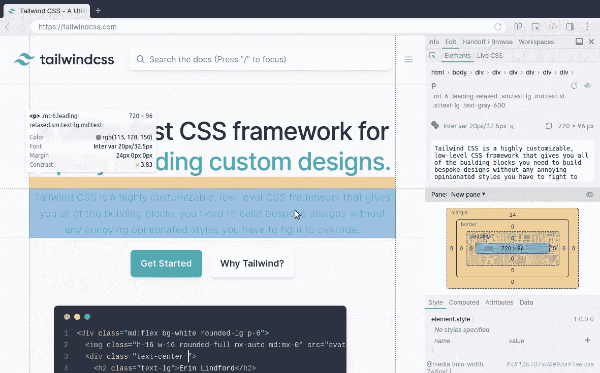

我们将在元素工具提示和元素面板中显示结果，以及其他信息，如字体系列和字体大小。这样，你的文本对比总是一目了然。

不过，这仍然要靠运气，所以 Polypane 也有色彩对比覆盖。这将遍历整个页面，找到所有独特的文本和背景组合，检查所有组合，并为每个元素添加标签。所有通过的对比对都有一个带有对比的标签，任何失败的对比都有一个警告标签，所以你不能忽略任何一个。

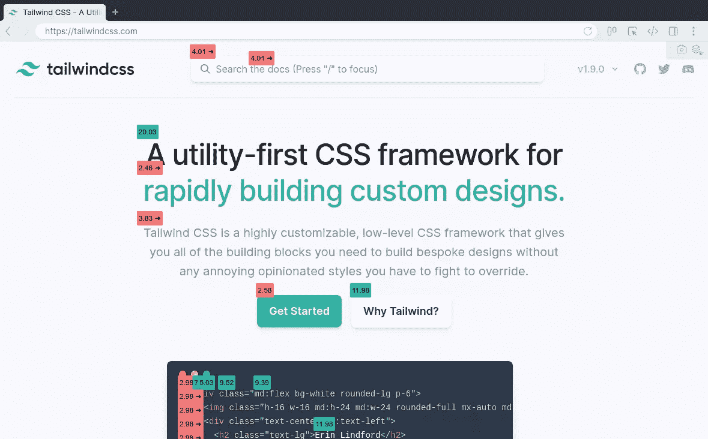

我们让发现对比问题变得非常容易。但是你怎么解决它们呢？

如果幸运的话，你可以从你的设计系统中使用另一种颜色，但是如果你没有，或者如果这是一次性的颜色对，你必须回到你的设计师那里，或者使用在线对比度测试器，自己找到另一种颜色——这是一个繁琐而耗时的过程，也是我想做点什么的事情。

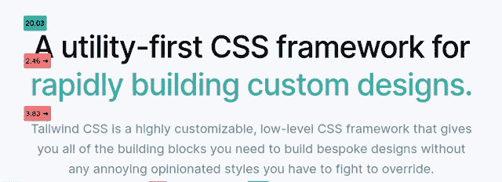

对于每一个失败的对比度对，Polypane 都会计算出一个与背景有足够对比度的文本颜色，并向您建议，以便于复制。你甚至可以通过鼠标悬停来预览。(我们提到的在线对比度检查器也为您建议了改进的颜色。)

## 视觉和情境障碍

我的网站如何寻找有视觉障碍的人，如色盲或远视？像明亮的阳光或具有夜间模式的设备这样的环境障碍怎么办？

不是每个访问你网站的人都会有完美的视力。事实上，你的大量访问者肯定会有某种形式的视觉障碍。虽然你可以确保遵循关于最小文本尺寸的指导方针，而不是仅仅通过使用颜色来传达任何信息，但这很容易忽略一个问题。获得共鸣的最好方法是尝试模拟其他人如何体验你的网站。

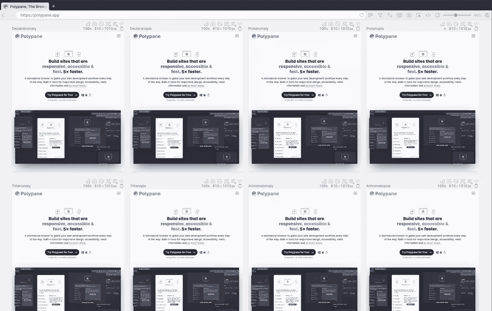

### 色盲

全世界有 8%到 10%的男性是色盲(女性更少，为 0.5%)，他们分为三个不同的群体:红绿色盲、蓝黄色盲和全色盲。Polypane 让你用我们的可及性覆盖图模拟所有这些。

你应该用这些模拟器来测试，以确保你不仅仅依靠颜色来传达信息。例如，如果您在出错时只是将输入字段的边框变成红色，您会发现这几乎是不可察觉的，或者在打开这些模拟器的情况下是不可察觉的。相反，您应该提供第二个非彩色指示器，比如错误消息，以便向您的用户传达这个问题。

红绿色盲是最常见的，绝大多数色盲患者都有这种情况。在 Polypane 中，我们提供了四种不同的模拟器:Deuteranopia、Deuteranomaly、Protanopia 和 Protanomaly。这里的*-异常*变异是不太严重的版本，而 *-opia* 变异将被归类为“完全”红绿色盲。

顾名思义，患有这种色盲的人很难区分红色和绿色，也很难区分棕色和橙色以及某些蓝色和紫色。你可以看到，例如，常见的“绿色是好的，红色是坏的”元素的颜色会成为一个问题。

蓝黄色盲更为罕见，在全世界男性中仅占 0.0002%。它的技术名称是“tritanopia”，tritanopia 是不太严重的版本。这种类型的色盲使人们对蓝光不那么敏感，使任何灰色的东西的蓝色部分。

最后，全色盲在全世界 0.00003%的男性中最为罕见。它的正确名称是“色盲”，其中“色盲”是不太严重的版本，人们看到一些颜色，但它严重变暗。

值得注意的是，Polypane 中的模拟器(以及任何模拟器)都是近似的。尤其是不太严重的变异，其范围从几乎不明显到接近全部，因此模拟器在那里选择了一个中间地带。

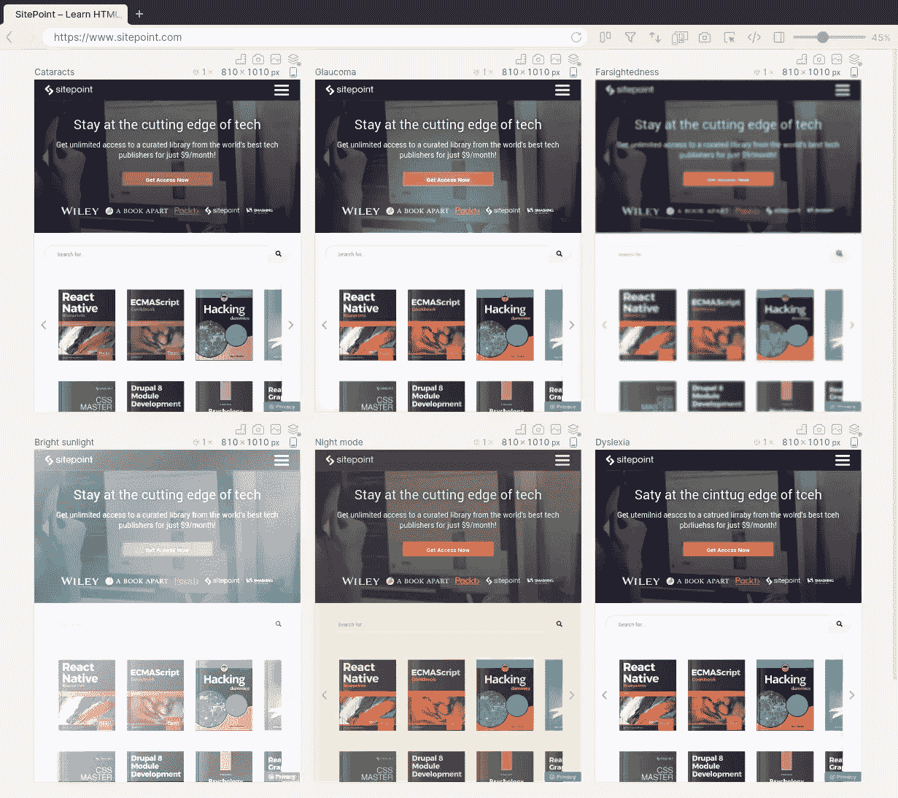

### 视力模糊

这就是色盲，但世界上有更多的人有某种形式的远视(全世界大约 10%)，这可能导致屏幕看起来模糊。这可能是“常规”远视，或其他视觉障碍，如白内障和青光眼。

白内障是失明的主要原因。它会逐渐模糊你的晶状体。青光眼是导致失明的第二大常见原因，会降低你的周边视力，其次是中央视力。它有时被称为隧道视觉，尽管这是一个涵盖多种不同损伤的术语。

使用这些模拟器，你会发现阅读普通文本是多么困难。视力模糊的人通常可以通过眼镜或放大镜来弥补，但这仍然有助于确保您的页面保持可扫描性。确保您的头文件足够大，能够被这些模拟器读取。这将确保您的页面是可扫描的，没有太多的压力。

### 情境障碍

并非所有的视觉障碍都是身体上的。有些也是情境性的:它们只在你处于特定情境时才会发生。Polypane 可以让你模拟其中的两种:明亮的阳光和夜间模式。

在明亮的阳光下很难看清屏幕。它们被洗掉了，有眩光，只有最大的对比度仍然可读。也许不是所有的网站都应该在明亮的阳光下使用，但是如果你有一个移动的或者反应灵敏的网站，它最终会在明亮的阳光下显示在屏幕上。这是一个很好的模拟器来检查你的细微对比是否太细微。

另一方面，夜间模式是过去几年来在大多数操作系统中慢慢出现的，出现在计算机和移动设备上。夜间模式将减少夜间屏幕中的蓝色量，使屏幕对您的眼睛更加放松，并减少褪黑激素的抑制。褪黑激素是让你昏昏欲睡的东西，当你周围的自然光变暗时，你会产生更多的褪黑激素。如果你一直在电脑前工作到凌晨 2 点，一点也不觉得累，褪黑激素被抑制就是原因。

大多数操作系统的夜间模式旨在防止屏幕上显示的任何问题，但如果你依赖黄色来传达意思，那么当所有东西都略带黄色时，这些可能会丢失。

### 阅读障碍

全世界大约有 5%到 10%的人有某种形式的阅读障碍，这是一种阅读障碍。虽然这不是情境障碍，但它确实会影响人们对你网站的视觉体验。

一些专家认为甚至可能超过 15%,因为许多有阅读障碍的人没有意识到他们有阅读障碍。因为没有办法把我们的阅读体验和其他人的进行比较，所以很难知道你的阅读体验什么时候会有显著的不同。

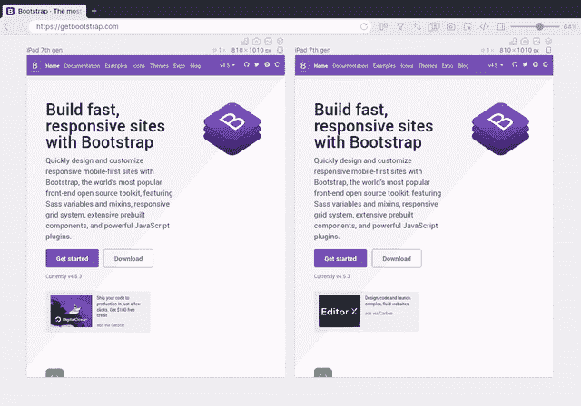

一些患有诵读困难症的人将其描述为看到屏幕上的字母四处舞动，这就是我们的诵读困难症模拟器所显示的。每个单词中的字母在你看的时候都是杂乱无章，重新排序的。它们大部分还是可读的，但是比平常要费更多的力气。

不是每个有阅读障碍的人都有这样的阅读经历，模拟器的使用更多的是为了获得共鸣。但是，如果你被一个混乱的单词卡住了，因为它很长或者字母可以组成多个单词，你可以考虑把它换成一个更简单、更清晰的单词。

## 页面结构

我的页面结构对依赖它的人有意义吗？

你的页面结构，就像你的标题和地标(像`body`、`nav`、`main`、`aside`和`section`这样的元素)比你想象的更重要。许多辅助技术，比如屏幕阅读器，可以让用户调出所有标题、地标或链接的列表，让他们快速浏览，看看是否找到了他们要找的部分。

让你的页面有一个逻辑顺序是很重要的，标题不要跳过一个层次，适当的地标(比如导航，页眉和页脚)。当你的站点由许多组件和模板构成时，你可能无法很好地了解所有的标题及其顺序，直到它们被呈现在页面上，并且不是所有的地标都有匹配的标题。

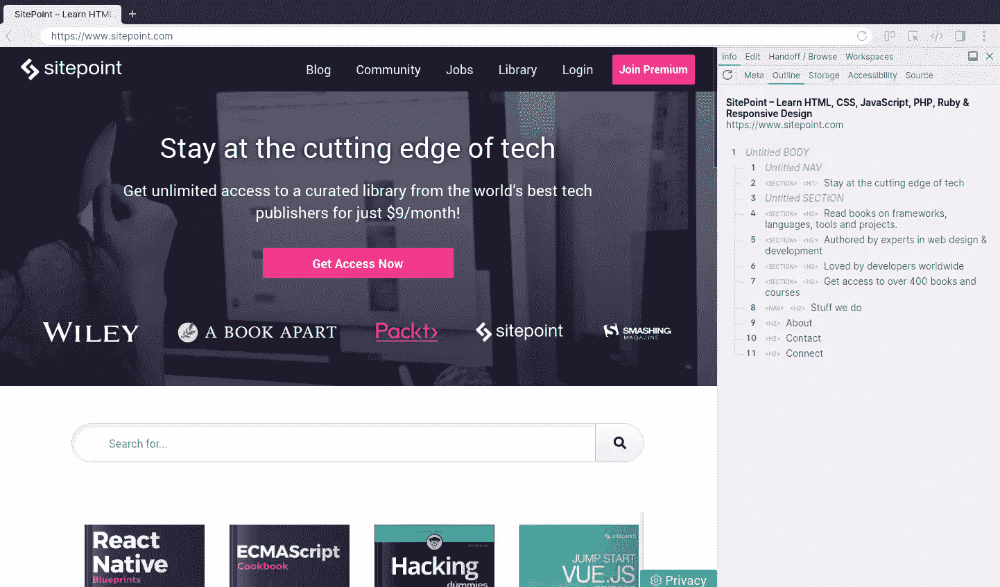

Polypane **Outline** 面板实现了 HTML5 outline 算法来可视化页面和标题结构。这样可以很容易地看到你跳过的标题级别，以及是否有丢失标题的地标。

## 代码质量

我如何确保我的站点没有任何代码质量问题，我为提高可访问性所做的事情真的有帮助吗？

不可否认，可访问性是一个很大的领域。这篇文章已经提到了对比问题、不同的视觉和情境损伤以及文档结构，但这只是皮毛。有很多事情会对你网站上的用户体验产生负面影响，比如缺少图片的属性，没有文本的链接，不明确的页面语言等等。如果你不需要为每一页都做一个庞大的清单，而只是简单的指出问题，那就太好了。在 Polypane 中，有多种方法可以做到这一点:通过我们内置的辅助功能面板，以及两个覆盖图——a11y . CSS 和 Tota11y。

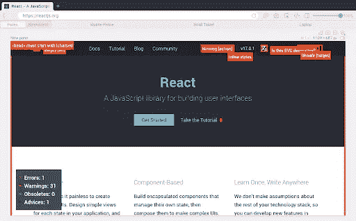

A11y.css 是一个 css 文件，它突出了页面中可能存在的风险和错误——主要针对可访问性，但也针对可能导致可访问性问题的错误，如缺少字符集。它可能有点碍手碍脚，因为它在任何它认为您应该检查的东西周围画了厚厚的边框，甚至是有意为之的东西(比如空的`alt`属性)。

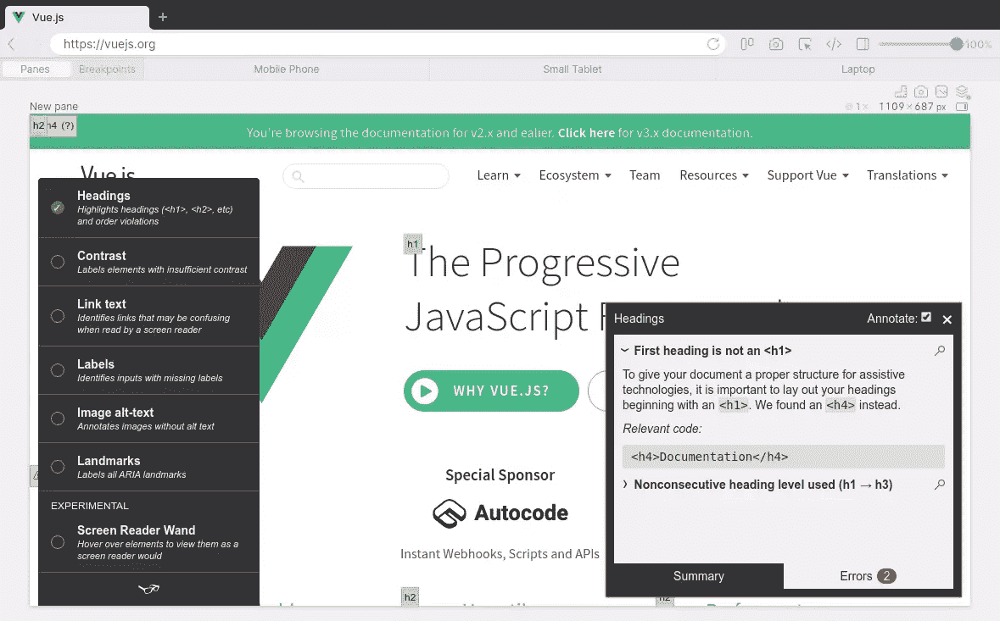

另一方面，由可汗学院开发的 Tota11y 是一系列不同工具的集合。有一个工具可以列出标题和地标(并突出显示任何违反顺序的情况)，找到对比度问题(尽管不如 Polypane 内置的颜色对比度检查器彻底)，并突出显示任何可能导致问题的链接、图像或标签(由于缺少内容，以及缺少或空的`alt`或`for`属性)。

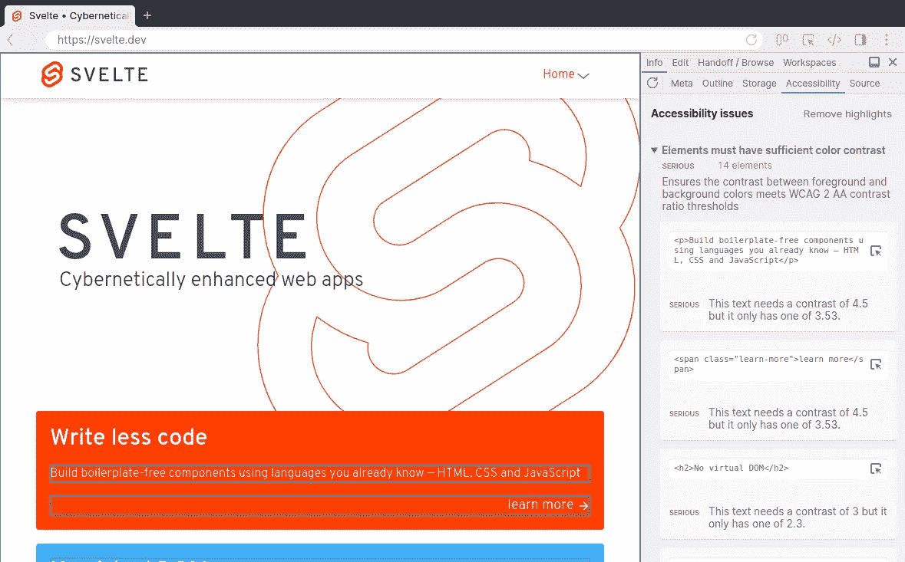

最后，Polypane 自带可访问性面板，可以基于流行的 Axe 规则集运行可访问性检查。当你运行一个测试时，Polypane 会分析你的整个页面，并把所有的问题分成四类:严重、严重、中等和轻微。

关键和严重的问题才是真正需要解决的重要问题。关键问题是像图像丢失`alt`文本和咏叹调的错误使用。

您可以展开每个发现的问题，以获得有关受其影响的元素以及每个元素的具体问题的更多信息。

对我们来说，重要的是这些错误是可操作的:它们不仅仅告诉你哪里错了，还会给你如何处理它们的建议和意见。例如，对于缺少`alt`属性的图像，我们解释了内容和表现图像之间的区别，对于颜色对比度问题，我们将建议一种具有足够对比度的颜色。

在“辅助功能”面板中，您可以单击任何元素并将其显示在元素检查器中，在元素检查器中，您通常可以通过更新属性或样式来修复问题。一旦你完成了，把它复制到你的源文件上，问题就解决了！

有趣的是，当构建可访问性面板并用它检查许多不同的网站时，更常见的是看到 ARIA 被滥用作为一个问题，而不是缺少 ARIA 是一个问题。可访问性是一个复杂的话题，人们很容易认为自己在做正确的事情，但实际上却让事情变得更加困难。个人知识和手工测试是非常宝贵的，但是自动化测试提供了一个很好的抽查。

## 较小的屏幕

我的网站在小屏幕上运行良好吗？

已经有很多关于响应式设计的文章，但这也是一个重要的易访问性问题。首先，根据 WCAG 规则 1.4.10，在 320 像素宽的屏幕上产生水平滚动条是不允许的。在更宽的屏幕上，虽然不算违规，但看起来会相当不和谐和混乱。

寻找水平溢出的原因是一件非常痛苦的事情，因为大多数时候并不清楚是哪个元素引起的。您最终在 dev 工具中随机删除元素，希望找到元素。那是许多乏味的工作。

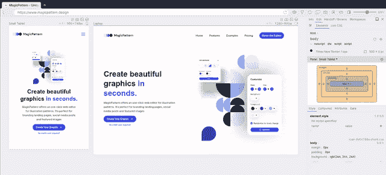

打开“布局调试”覆盖后，Polypane 会检测是否有水平滚动条，并找到导致滚动条的元素。然后，它将它们涂成红色，以便您可以找到并修复它们，例如，通过确保父元素具有溢出:隐藏，或者通过确保您的内容适合可用空间。

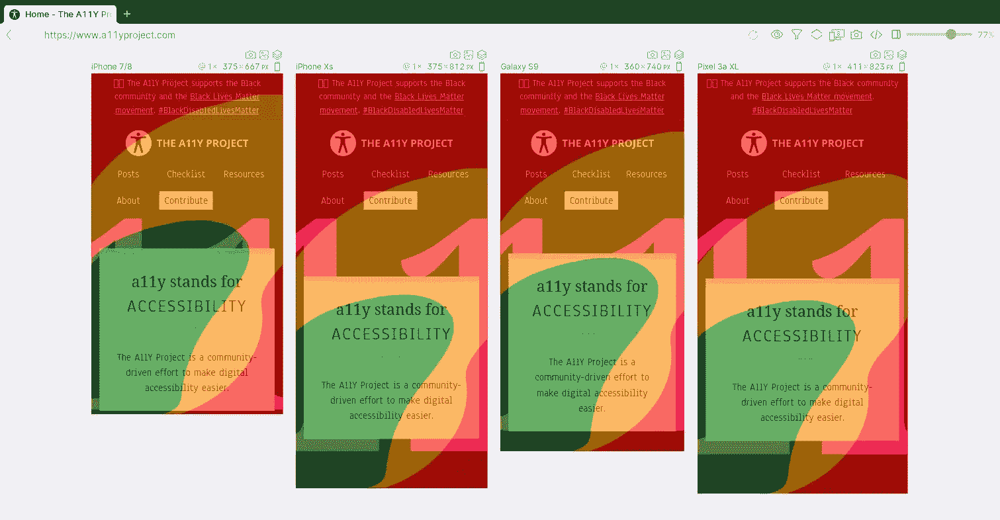

尽管手机屏幕比你的桌面小，但随着屏幕尺寸的增加，当你用一只手拿着手机时，很难轻松地触及屏幕的所有部分。通过可达性叠加，我们可以显示当您将手机握在手中(右手或左手)时，屏幕的哪些部分更容易或更难触及。

用一只手拿着你的手机，屏幕的底部比顶部更容易够到，这取决于你的网站。将重要的项目放在屏幕底部实际上会更方便用户。将项目放置在屏幕底部在应用程序中非常常见，我们看到更多的网站和网络应用程序也在向这种模式迁移。

## 黑暗模式和运动

我如何确保我的网站对于喜欢深色或者不擅长运动的用户来说工作得很好？

黑暗模式虽然流行，但对于那些觉得明亮的电脑屏幕令人痛苦或难以直视的人来说，也是一种潜在的辅助功能。一个好的深色模式可能是反转颜色(Mac 上的一个功能)或强制颜色(Edge 和 Windows 上的一个功能，它将所有颜色强制到一个指定的调色板，通常在黑色背景上有浅色文本)之类的东西的良好外观替代方案。

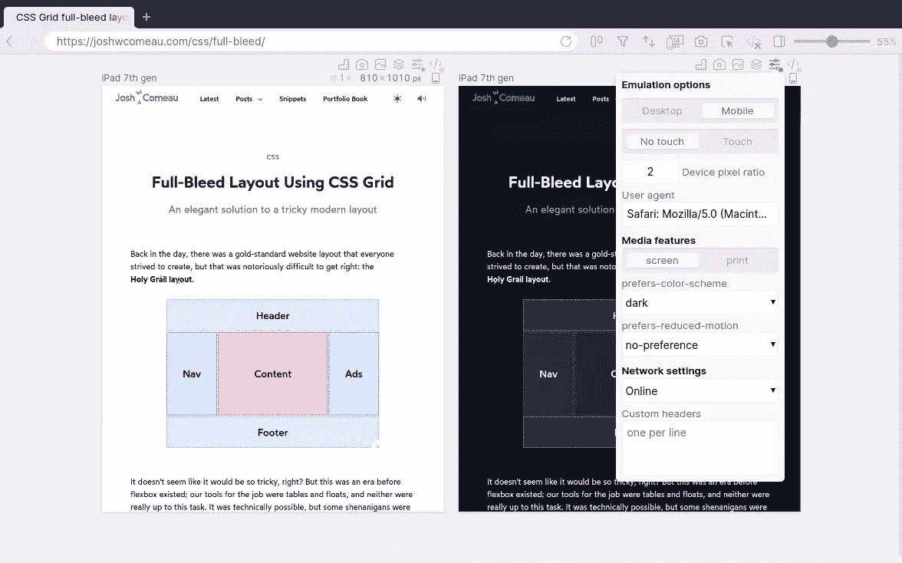

为了测试和实现你的黑暗模式，使用“prefers-color-scheme: dark”，你可以将你的整个操作系统切换到黑暗模式，深入到浏览器开发工具(**设置**菜单> **更多工具** > **渲染** >向下滚动>在**仿真**下拉菜单中选择“黑暗”)或者在 Polypane 中，你可以弹出打开选项下拉菜单并单击“黑暗”来切换到单一窗格的黑暗模式，因此很容易看到它

同样，前庭失调的人会对网站上的移动感到不适，比如大型动画和过渡。对于他们来说,“偏好-减少-运动:减少”媒体查询可以是一个解决方案。设置好之后，淡化动画和过渡就很重要了。你不需要禁用所有的动画(虽然这也是可行的)，但是要尽量让它不那么哗哗响，更微妙的褪色。同样，如果你打开了平滑滚动，这是一个巨大的移动，所以要确保“滚动行为”设置为“自动”，而不是“平滑”。

在 Polypane 中测试这一点同样简单:打开**选项**菜单，将首选减少运动选项切换到“减少”。现在你可以单独测试它，或者和你的正规网站一起测试。

我希望这能让你体会到你可能遇到的可访问性问题的类型，如何处理它们，以及 Polypane 试图使它们更容易解决的方法。Polypane 有一个免费试用版,可以让你在注册后五分钟内运行你的第一个可访问性审计。

## 分享这篇文章