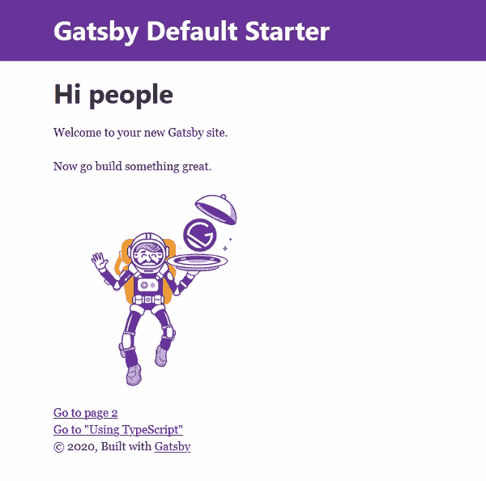
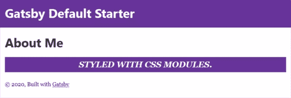
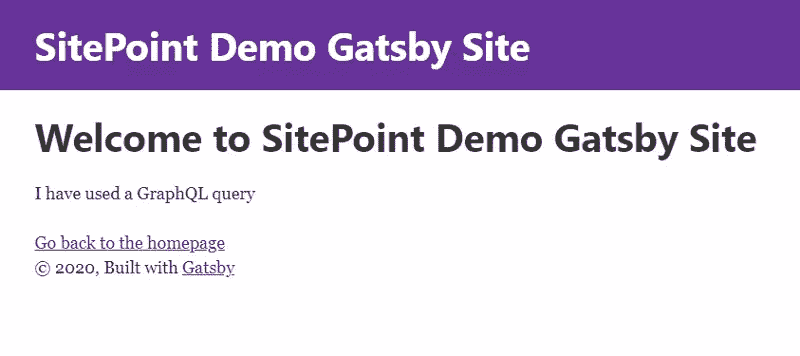

# 盖茨比入门:构建您的第一个静态站点

> 原文：<https://www.sitepoint.com/gatsby-guide/>

**考虑投资 [Jamstack](https://www.sitepoint.com/learn-jamstack/#foundations) 生态系统？如果你的答案是肯定的，那么[Gatsby](https://www.gatsbyjs.com/)——最流行、最强大的 Jamstack 静态站点生成器之一——可能就是你正在寻找的。这是我们的盖茨比入门指南。**

JAM 代表 JavaScript、API 和标记。换句话说，虽然在请求/响应周期中，站点或应用程序的动态部分由客户端的 JavaScript 处理，但所有服务器端的流程都是使用 JavaScript 通过 HTTPS 访问的 API 进行的，并且模板化标记是在部署时预先构建的，通常使用静态站点生成器。那是果酱饼。它性能卓越，扩展成本低廉，并提供更好的安全性和流畅的开发人员体验。

## 为什么要使用静态网站

静态站点模型并不适合所有类型的项目，但是当它适合时，它有许多优点。以下是其中的几个。

### 速度

第一次提出请求时，网站在浏览器中加载所需的时间是影响用户体验的一个重要因素。用户很快就会变得不耐烦，在慢速连接上情况只会变得更糟。缺少数据库调用和预先生成的内容使得静态网站的加载速度非常快。

静态站点由静态文件组成，这些文件可以通过内容交付网络(cdn)在世界范围内轻松提供。这使得利用离请求发出地更近的数据中心成为可能。

### 简化托管

静态网站的托管可以很快建立起来。因为没有数据库或服务器端代码、特殊语言或框架来支持，所有的主机必须做的就是提供静态文件。

### 更好的安全性

如果没有服务器端代码或数据库，黑客就无法攻击任何东西。让服务器保持最新的安全修复程序和补丁没有任何麻烦。当涉及到网站的安全性时，所有这些意味着更多的安心。

### 更好的开发者体验

通过 Netlify 或 Vercel 这样的托管公司建立静态网站非常简单，通过持续部署，您只需将您的更改推送到您选择的代码库中，它们就会立即反映在活动版本中。

## 盖茨比是什么？

盖茨比是当今最流行的网站建设工具之一。它不仅仅是一个静态的站点生成器。事实上，它是一个“基于 React 的、用于创建网站和应用的开源框架。”由于 Gatsby 构建在 [React](https://reactjs.org/) 之上，所有 React 的优点都唾手可得，这使您能够利用这个强大的库将交互式组件构建到您的静态网站中。Gatsby 也是用 [GraphQL](https://graphql.org/) 构建的，所以你可以查询数据并以任何你想要的方式显示在你的网站上。

## 安装 Gatsby 并创建您的项目

盖茨比是用 [webpack](https://webpack.js.org/) 组装的，但是你不需要担心复杂的设置操作；盖茨比 CLI 将为您打理一切。

对于本教程，我假设您已经在本地安装了 Node.js。如果不是这样，那么就去节点主页[下载适合您系统的正确二进制文件](https://nodejs.org/en/download/)。或者，您可以考虑使用版本管理器来安装 Node。我们有一个关于使用版本管理器的[教程。](https://www.sitepoint.com/quick-tip-multiple-versions-node-nvm/)

Node 与 npm 捆绑在一起，NPM 是节点包管理器，我们将使用它来安装我们将要使用的一些库。您可以[在这里](https://www.sitepoint.com/beginners-guide-node-package-manager/)了解更多关于使用 npm 的信息。

您可以通过从命令行发出以下命令来检查两者是否安装正确:

```
node -v
> 12.18.4

npm -v
> 6.14.8 
```

您需要做的第一件事是安装 Gatsby CLI。这是一个`npm`包，可以让你在几秒钟内创建一个 Gatsby 站点。在您的终端中，写下:

```
npm install -g gatsby-cli 
```

随着 Gasby CLI 安装在您的机器上，您可以继续创建您的网站。我将称它为 *sitepoint-demo* ，但是你可以随意称呼它。在您的终端中，键入:

```
gatsby new sitepoint-demo 
```

一旦 Gatsby CLI 安装了所有必要的文件并对它们进行了适当的配置，您就拥有了一个功能完整的 Gatsby 网站，供您进行定制和构建。要访问它，进入`sitepoint-demo`文件夹:

```
cd sitepoint-demo 
```

并启动本地服务器:

```
gatsby develop 
```

最后，在 http://localhost:8000 上打开一个窗口，你会发现你闪亮的盖茨比网站看起来像这样:



为了快速建立并运行一个网站，Gatsby 利用了几个官方的启动样板以及强大的社区提供的启动程序。你刚刚创建的网站使用了 [Gatsby 默认启动程序](https://github.com/gatsbyjs/gatsby-starter-default)，但是你可以在 [Gatsby 网站](https://www.gatsbyjs.org/starters/)上找到更多。

如果您想使用不同于默认启动器的启动器，您需要在命令行中指定它的 URL，遵循以下模式:

```
gatsby new [SITE_DIRECTORY_NAME] [URL_OF_STARTER_GITHUB_REPO] 
```

例如，假设你想为你的网站设计一个材质外观。创建它的最快方法是通过在终端中键入以下命令来使用 Gatsby Material Starter:

```
gatsby new sitepoint-demo https://github.com/Vagr9K/gatsby-material-starter 
```

太好了！现在让我们来看看你的全新盖茨比项目中的文件。

## 参观你的盖茨比网站

一个好的起点是`/src/`目录。你会发现。

### `pages`目录

目录包含你站点的页面。每个页面都是一个 React 组件。例如，您站点的主页代码位于`/pages/index.js`中，如下所示:

```
import React from "react"
import { Link } from "gatsby"
import Layout from "../components/layout"
import Image from "../components/image"
import SEO from "../components/seo"

const IndexPage = () => (
<Layout>  <SEO title="Home" />  <h1>Hi people</h1>  <p>Welcome to your new Gatsby site.</p>  <p>Now go build something great.</p>  <div style={{ maxWidth: `300px`, marginBottom: `1.45rem` }}>  <Image />  </div>  <Link to="/page-2/">Go to page 2</Link>  <Link to="/using-typescript/">Go to "Using TypeScript"</Link>  </Layout>
)

export default IndexPage 
```

这是 React 组件的典型代码。

> 组件可以让你将用户界面分割成独立的、可重用的部分，并独立地考虑每一部分。…从概念上讲，组件就像 JavaScript 函数。它们接受任意输入(称为“props”)并返回描述屏幕上应该显示什么的 React 元素。— [反应文档](https://reactjs.org/docs/components-and-props.html)。

### `components`目录

目录是你为你的网站找到一般组件的地方。默认的启动器带有以下组件:标题(`header.js`)、图像(`image.js`)、布局(`layout.js`)和 SEO ( `seo.js`)。您可以自由定制这些组件，并将您自己的组件添加到同一个目录中。

现在，您已经准备好开始对您的新站点进行更改，并根据您的喜好进行定制。

## 如何改变你的盖茨比网站

让我们试着修改主页上显示的信息。在您的代码编辑器中打开`pages/index.js`,用这段代码替换`<h1>`标签下的两段代码:

```
<p>Welcome to my SitePoint Demo Site!</p> 
```

当然，您可以在`<p>`标签之间添加任何想要的文本。

只要你点击*保存*，由于盖茨比的**热重装**开发环境，你的更改就会显示在浏览器中。这意味着当您开发 Gatsby 站点时，页面在后台被监视，这样当您保存您的工作时，更改将立即可见，而不需要刷新页面或重启浏览器。

盖茨比让添加新页面变得很容易。例如，让我们通过在`/pages/`目录中创建一个新文件`about.js`来添加一个关于页面，并输入以下内容:

```
import React from "react"

const AboutPage = () => <h1>About Me</h1>

export default AboutPage 
```

上面的代码是一个显示一些文本的**反应功能组件**。

保存您的工作并导航到[http://localhost:8000/About](http://localhost:8000/about)，您应该会在屏幕上看到关于我的标题`<h1>`。

您可以使用 **Gatsby 链接组件**从主页快速链接到新的 About 页面。要了解它是如何工作的，请在代码编辑器中打开`index.js`，并在`</Layout>`结束标记之前找到这段代码:

```
<Link to="/page-2/">Go to page 2</Link> 
```

接下来，用`/about/`替换`to`属性的值，用关于的*替换*转到第 2 页*文本:*

```
<Link to="/about/">About</Link> 
```

保存您的工作，您应该在屏幕上看到您的新链接。点击*关于*链接，立即进入关于页面。

Gatsby 使用内部链接的**链接组件。对于外部链接，你应该使用传统的`<a>`标签，就像在普通的 HTML 网站上一样。**

现在，让我们通过改变一些样式来试验您的 Gatsby 站点的外观。

## 设计你的盖茨比网站

Gatsby 提供了许多将样式规则应用到您的网站的选项。

### 全局样式表

一个常见的选择是使用一个全局`.css`文件，其中包含适用于整个网站的规则。首先，在`/src/`目录中添加一个`/styles/`目录，并在其中添加一个`global.css`文件:`/src/styles/global.css`。您可以自由地为目录和样式表文件选择任何您喜欢的名称。在`global.css`中，添加下面的 CSS 声明，该声明将应用于整个网站:

```
body {
  background-color: yellow;
} 
```

现在，保存您的工作。哎呀，什么都没发生！反正还没有。为了让它工作，你需要采取额外的步骤。在代码编辑器中打开`gatsby-browser.js`,导入刚刚创建的样式表:

```
import "./src/styles/global.css" 
```

回到你的浏览器，你应该会看到你网站的背景色变成了亮黄色。作为一种颜色选择不理想，但它的作品！

### 具有共享布局组件的全局样式

尽管添加一个全局样式表并将其导入到`gatsby-browser.js`中可以很好地工作，但是向 Gatsby 网站添加全局样式的推荐方式是使用一个**共享布局组件**。Gatsby 默认启动程序自带了这个组件及其相关的样式表。

为了了解它是如何工作的，让我们从`gatsby-browser.js`中删除上面的导入语句并保存文件。你应该会看到你的网站背景变回白色。然后，在代码编辑器中打开`layout.js`和`layout.css`(你会在`components/`目录中找到这两个文件)。

在`layout.js`的顶部，注意 import 语句，它使包含在`layout.css`中的 CSS 规则对共享布局组件可用，因此对整个网站可用:

```
import "./layout.css" 
```

在`layout.css`中，找到 body 元素的 CSS 声明。应该在 8 号线左右。看起来是这样的:

```
body {
  margin: 0;
  -webkit-font-smoothing: antialiased;
  -moz-osx-font-smoothing: grayscale;
  color: hsla(0, 0%, 0%, 0.8);
  font-family: georgia, serif;
  font-weight: normal;
  word-wrap: break-word;
  font-kerning: normal;
  -moz-font-feature-settings: "kern", "liga", "clig", "calt";
  -ms-font-feature-settings: "kern", "liga", "clig", "calt";
  -webkit-font-feature-settings: "kern", "liga", "clig", "calt";
  font-feature-settings: "kern", "liga", "clig", "calt";
} 
```

现在为背景色添加一个规则，如下所示:

```
background-color: yellow; 
```

保存您的工作，您应该会看到您的网站的背景颜色再次变成黄色。

### 组件范围的样式:CSS 模块

> 一个 [CSS 模块](https://github.com/css-modules/css-modules)是一个 CSS 文件，默认情况下所有的类名和动画名都在本地范围内。

使用 CSS 模块，您的样式只应用于特定的组件，这有助于保持组件的自包含性，因此易于维护和重用。

CSS 模块与 Gatsby 捆绑在一起，文档推荐这种向 Gatsby 组件和 React 组件添加样式的方式。

按照以下步骤在你的“关于”页面中添加一个别致的段落组件。

#### 创建精美的段落组件

在 Gatsby 默认的基于 Starter 的项目的`/components/`目录中，创建一个文件并将其命名为`fancy-paragraph.js`。

在代码编辑器中打开`fancy-paragraph.js`,输入以下代码:

```
import React from "react"
import fancyParagraphStyles from "./fancy-paragraph.module.css"

const FancyParagraph = (props) => <p className={fancyParagraphStyles.fancy}>{props.paragraphText}</p>

export default FancyParagraph 
```

这是一个简单的 React 功能组件——除了导入花哨段落 CSS 模块的语句之外，没有什么新东西，我们还没有创建这个模块。

该组件使用花式段落模块中包含的样式作为`className`属性中的值。正如您所看到的，这个值看起来非常像一个普通的 JavaScript 对象，它使用`.fancy`(类名)作为`fancyParagraphStyles`对象的属性。您将在 CSS 模块中为该类编写样式。

#### 创建花式段落 CSS 模块

在`/components/`中，创建另一个文件，并将其命名为`fancy-paragraph.module.css`。打开这个文件，按照你喜欢的的方式*设计`.fancy`类。只是普通的 CSS。这是我的样子:*

```
.fancy {
  font-size: 1.5rem;
  text-align: center;
  line-height: 1.2;
  padding: 0.5rem;
  color: #fff;
  background-color: rebeccapurple;
  font-weight: 800;
  font-style: italic;
  text-transform: uppercase;
} 
```

现在，您已经准备好在 Gatsby 站点的任何地方使用您的`FancyParagraph`组件和您喜欢的样式了。

让我们在你的“关于”页面上添加一个有趣的段落。

#### 将花式段落组件添加到“关于”页面

首先将这两条导入语句添加到您的 About 页面，就在已经存在的 React 导入的下面:

```
import Layout from "../components/layout"
import FancyParagraph from "../components/fancy-paragraph" 
```

上面的代码片段使 Gatsby Layout 组件(您将在 About 页面中使用)和刚刚创建的 Fancy Paragraph 组件可用于 About 页面。

接下来，修改您的`AboutPage`功能组件，如下所示:

```
const AboutPage = () => (
<Layout>  <h1>About Me</h1>  <FancyParagraph paragraphText="Styled with CSS Modules." />  </Layout>
) 
```

您的新组件就像任何其他 React 组件一样工作。只需将它放在页面上您希望它出现的确切位置，就大功告成了。这个特殊的组件利用 React props 使段落文本更加动态。

保存你的工作并导航到“关于”页面，在那里你会看到你的精彩段落。我的看起来像这样:



任务完成！

### 组件范围的样式:内联样式

JS 对象形式的内联 CSS 样式是您可以使用的另一种样式选项。

您的 Gatsby 默认的基于 Starter 的项目展示了这种技术的实际应用。例如，在您的编辑器中打开`index.js`，并在`IndexPage`组件中找到这段代码:

```
<div style={{ maxWidth: `300px`, marginBottom: `1.45rem` }}>  <Image />  </div> 
```

注意 CSS 样式是如何应用到包含`Image`组件的`<div>`的:样式采用 JS 对象的形式，其中 CSS 属性名是键，CSS 值是它们对应的值。

另外，请注意复合 CSS 属性名是如何删除破折号(-)并使用 camelCase 约定的——例如，`marginBottom`，而不是 CSS `margin-bottom`。

## 向您的 Gatsby 站点添加内容

使用 Gatsby 进行构建还有一个好处，那就是能够从几乎任何地方获取数据。因此，您不局限于构建通常依赖于 Markdown 的静态网站，您的团队可以使用他们选择的后端轻松管理内容。

大量的专用插件使 Gatsby 能够从多个来源获取数据——例如，文件系统、API、WordPress 等。—将数据合并到一个数据层中，并提供给您的网站。

对于简单的网站，也可以绕过 Gatsby 的数据层，在不使用 GraphQL 或任何源代码插件的情况下填充你的网站[。这种方法，也称为**非结构化数据**方法，允许您获取数据并在`createPages` API 内的`createPage`动作中使用它。虽然 JavaScript 开发人员对从 API 获取数据已经足够熟悉，因此可能比使用 GraphQL 更有吸引力，但缺点是取消 Gatsby 数据层也意味着取消它所提供的许多好处——例如性能、开发期间的热重新加载、快速映像优化等等。](https://www.gatsbyjs.com/docs/using-gatsby-without-graphql/)

如果您想了解更多关于非结构化数据方法的信息，请查看 GitHub repo 。

### 将 GraphQL 查询手动输入 Gatsby 页面

如果你有一两个页面，内容很少，几乎没有变化，你甚至可以将文本直接硬编码到 Gatsby 页面中，就像我们在上面的演示中所做的那样。

如果您需要提取简单的数据，如站点标题和描述，您可以直接在页面中输入 GraphQL 查询。要做到这一点，熟悉一下[GraphQL](https://www.gatsbyjs.com/docs/running-queries-with-graphiql/)会有所帮助，这是一个 GraphQL IDE(集成开发环境)，用于创建可以在[http://localhost:8000/_ _ _ graph QL](http://localhost:8000/___graphql)上访问的 graph QL 查询。

假设你想在页面上显示你的站点标题。首先，确保标题已经在`gatsby-config.js`里面了。我的看起来像这样:您可以输入您喜欢的任何标题，也可以保留默认标题:

```
module.exports = {
  siteMetadata: {
    title: `SitePoint Demo Gatsby Site`,
    ...
  },
  ... 
```

接下来，在 GraphQL 的帮助下构建 graph QL 查询。最后，对初学者的第 2 页页面(`src/pages/page-2.js`)进行以下更改，现在应该是这样的:

```
const SecondPage = ({data}) => (
  <Layout>  <SEO title="Page two" />  <h1>Welcome to {data.site.siteMetadata.title}</h1>  <p>I have used a GraphQL query</p>  <Link to="/">Go back to the homepage</Link>  </Layout>
)

export const query = graphql` query testQuery {
    site {
      siteMetadata {
        title
      }
    }
  } `
export default SecondPage 
```

注意，我们将一个`data`属性传递给组件，它包含 GraphQL 查询的结果。

重启您的服务器，然后您将能够看到第 2 页上显示的站点标题([http://localhost:8000/page-2/](http://localhost:8000/page-2/))。



然而，只有当管理内容的人熟悉编码时，这种方法才有意义。此外，如果有一天您决定更改文本，您将不得不在项目目录中搜索页面并手动替换内容。

你可以在 [Gatsby docs](https://www.gatsbyjs.com/docs/page-query/) 上阅读关于这个方法的所有细节。

### 从文件系统中提取数据

您可以使用 [gatsby-source-filesystem](https://www.gatsbyjs.com/plugins/gatsby-source-filesystem/) 插件将数据从本地文件系统导入 gatsby 应用程序。使用过静态站点生成器(如 Jekyll 或 Hugo)的人可能对这种方法很熟悉。

Gatsby default starter 已经安装了这个插件，您可以在代码编辑器中打开`gatsby-config.js`来轻松验证:

```
plugins: [
    `gatsby-plugin-react-helmet`,
    {
      resolve: `gatsby-source-filesystem`,
      options: {
        name: `images`,
        path: `${__dirname}/src/images`,
      },
    }, ... 
```

在获取数据之后，您需要一个 transformer 插件来帮助您将文件节点转换成您可以在站点中使用的各种数据类型——例如，`gatsby-transformer-json`用于 JSON 数据，`gatsby-transformer-remark`用于 Markdown 文件，等等。

在盖茨比文件的[部分找到所有细节。](https://www.gatsbyjs.com/docs/sourcing-from-the-filesystem/)

如果你选择 [Markdown 文件作为 Gatsby 站点的数据源](https://www.gatsbyjs.com/docs/adding-markdown-pages/)，你可以选择使用`gatsby-plugin-mdx`将 JSX 可重用组件嵌入到文本中，这是一个 Gatsby 插件，为你的站点增加了 [MDX](https://mdxjs.com/) 支持。以下是好处:

> 这在内容驱动的网站中非常有用，在这些网站中，您希望能够引入图表或警报等组件，而无需配置插件。它强调组合而不是配置，并在交互式博客文章、记录设计系统或具有沉浸式或动态交互的长篇文章中大放异彩。——[盖茨比文件](https://www.gatsbyjs.com/docs/mdx/)。

### 无头 CMS

CMS 代表内容管理系统。传统的 CMS 同时提供后端和前端功能。一个无头的或者分离的 CMS 仅仅局限于后端，因此把所有的前端问题留给了开发者的偏好。这种安排对于像 Gatsby 这样的站点生成器来说是理想的，因为它允许内容团队成员仍然使用他们喜欢的管理界面，同时开发人员充分利用使用 Gatsby、React 和 GraphQL 的好处。

像 WordPress、Drupal、Contentful、Sanity 等流行的 CMS 平台提供了 headless 支持，Gatsby 生态系统提供了适当的插件和指南来帮助您进行集成。

查看 Gatsby docs 中的这篇[文章，了解更多关于从您选择的 CMS 中提取数据的信息。](https://www.gatsbyjs.com/docs/headless-cms/)

## 部署您的 Gatsby 站点

有些公司让静态网站的托管变得超级快捷和方便。其中最受欢迎的有:

*   [Netlify](https://www.netlify.com/)
*   [亚马逊 S3](https://aws.amazon.com/s3/)
*   github pages
*   [Firebase 托管](https://firebase.google.com/docs/hosting/)

### 将您的盖茨比网站部署到 Netlify

让我们用 Netlify 来推出你全新的盖茨比网站。Netlify 提供了“结合全球部署、持续集成和自动 HTTPS 的一体化工作流程”

它非常适合托管静态网站。

首先，您需要创建 Gatsby 项目的生产版本。为此，请在终端中输入以下命令:

```
gatsby build 
```

现在你有了一个名为`public`的文件夹，其中包含了你的网站需要在浏览器中运行的所有静态文件。

下一步是将您的 Gatsby 项目放入像 GitHub 这样的存储库中。Netlify 支持 GitHub、GitLab 或 Bitbucket:每次您对代码进行修改时，Netlify 都会使用您选择的工具运行一次构建，并将结果部署到它的快速加载 CDN 中。

要开始，只需登录 Netlify，从 Git 中选择 *New site，选择您的存储库，输入您的构建命令和您的公共文件夹的名称，然后单击 *Deploy site* 。*

您可以在 Gatsby docs 网站上的这篇[文章中详细查看部署过程。](https://www.gatsbyjs.com/docs/deploying-to-netlify/)

恭喜你，你的盖茨比网站开通了！

### 关于构建过程的更多信息

在部署之前运行 build 命令会创建一个生产版本的 Gatsby 支持的网站，该网站具有高性能和良好用户体验所需的所有优化。Gatsby 在这个过程中创建的静态 HTML 页面反过来将[再水合](https://www.gatsbyjs.com/docs/glossary#hydration)到 React 应用程序中。这意味着，当 Gatsby 页面进入 web 浏览器时，JavaScript 代码被下载，从而支持 DOM 操作等。换句话说，你的网站变成了一个成熟的 React 应用。

你可以在[盖茨比文件](https://www.gatsbyjs.com/docs/overview-of-the-gatsby-build-process/)上阅读详细内容。

### 盖茨比之云

2019 年，《盖茨比》创始人凯尔·马修斯(Kyle Mathews)宣布推出[盖茨比云](https://www.gatsbyjs.com/cloud/)。用他的话说，盖茨比·克劳德是

> 一个稳定、可信的工具商业平台，使网站创建者能够建立更好的网站。Gatsby Cloud 通过可互操作的开箱即用解决方案增强了我们的内容网格平台，以更快地启动网站，并推动业务成功。— [宣布盖茨比云](https://www.gatsbyjs.com/blog/2019-11-14-announcing-gatsby-cloud/)

换句话说，Gatsby Cloud 是一个基于云的基础设施，当您创建、更新和部署您的 Gatsby 网站时，它可以提供大量的好处。功能包括:

*   **Cloud Quickstart** ，它使非技术用户能够使用 CMS、一些虚拟内容和 Gatsby starter 在几分钟内创建项目。
*   **实时预览**，这对于实时和在上下文中预览更改非常有用，从而促进在您的网站上工作的团队成员之间的交流和协作。
*   **CMS 集成**，这是快速和无痛的，利用可用于数百个内容管理系统和 API 的[插件](https://www.gatsbyjs.org/plugins/?=gatsby-source&__hstc=247646936.24c96d4250f902ff2a0bece740fee9e7.1598370434651.1600710285438.1600881659128.13&__hssc=247646936.5.1600881659128&__hsfp=1336313893)。
*   **增量构建**，2020 年 4 月推出的 [Gatsby 云特性](https://www.gatsbyjs.com/blog/2020-04-22-announcing-incremental-builds/)。当您选择的 CMS 中的数据发生变化时，增量构建将只重建需要的内容，从而显著提高性能。

还有更多…

## 盖茨比插件

盖茨比的很多超能力都来源于[外挂](https://www.gatsbyjs.com/plugins/)。Gatsby 插件是 Node.js 包，您可以使用 npm 将其安装到您的项目中。盖茨比生态系统提供了大量的插件，让你可以做几乎任何事情。我已经谈到了插件在从多个来源获取数据并准备供 Gatsby 网站使用方面的作用，但也有插件用于添加带有[主题](https://www.gatsbyjs.com/docs/themes/)的预打包功能，集成像 Google Analytics 这样的第三方服务，从 React 组件自动创建页面，处理 Sass 萨斯文件，等等。

如果 JavaScript 是你的谋生之道，你也可以尝试创建自己的插件。查看 [Gatsby 插件创作页面](https://www.gatsbyjs.com/docs/creating-plugins/)了解更多细节。

## 后续步骤和资源

要真正掌握盖茨比，去它的网站看看官方教程和 T2 文档。我认为他们是一流的。

此外，为了充分利用 Gatsby，我建议您熟练使用 GraphQL 操作数据。利用 GraphQL 网站上令人敬畏的[教程。](https://www.graphql.com/tutorials/)

最后，一定要看看我们的 [Jamstack Foundations](https://www.sitepoint.com/learn-jamstack/#foundations) 收藏，在那里你会找到我们关于 Jamstack 的指南，以及像 Gatsby 这样的 Jamstack 工具，它们能最好地帮助你学习。

## 分享这篇文章