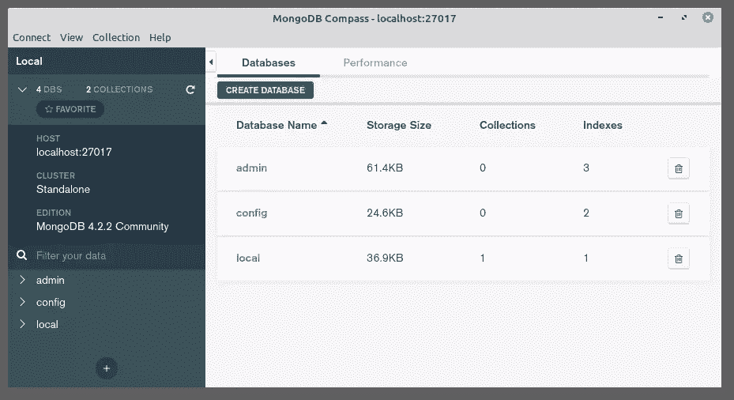
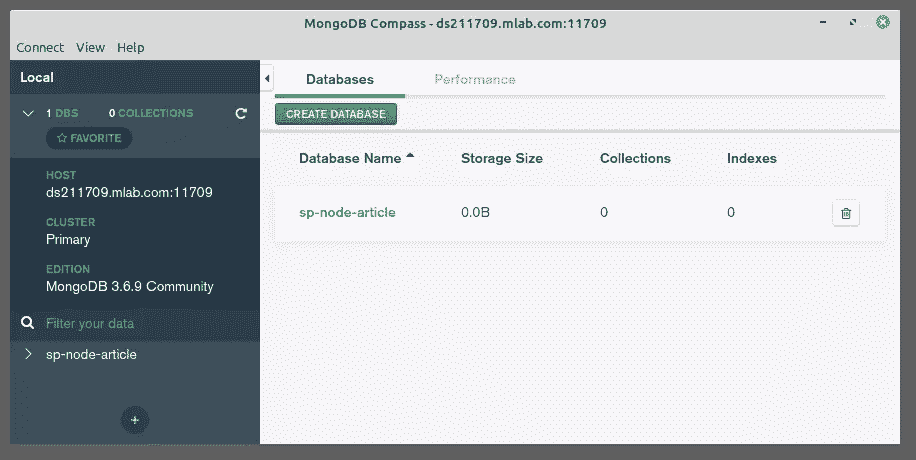
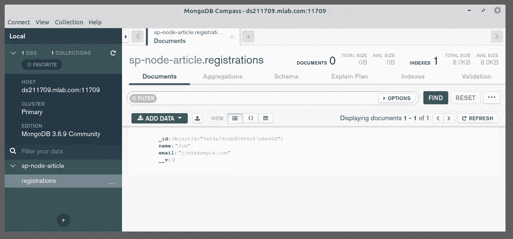

# 用 Node，Bootstrap 和 MongoDB 构建一个简单的初学者应用程序

> 原文：<https://www.sitepoint.com/build-simple-beginner-app-node-bootstrap-mongodb/>

如果你刚刚开始使用 Node.js，并想尝试构建一个 web 应用程序，事情往往会变得有点令人不知所措。一旦你超越了“你好，世界！”教程，很多资料都是让你复制粘贴代码，很少或者根本没有解释你在做什么或者为什么。

这意味着，当你完成的时候，你已经做了一些漂亮闪亮的东西，但是你能应用到下一个项目的东西相对较少。

在本教程中，我将采取一种稍微不同的方法。从零开始，我将演示如何使用 Node.js 构建一个简洁的 web 应用程序，但我不会关注最终结果，而是将重点放在构建真实应用程序时可能遇到的一系列事情上。这些包括路由、模板、处理表单、与数据库交互，甚至基本的认证。

这不会是 JavaScript 101。如果这是你想要的东西，请看这里。然而，它将适合那些对 JavaScript 语言相当有信心的人，以及那些期待[在 Node.js](https://www.sitepoint.com/premium/books/node-js-web-development-fourth-edition/) 中迈出第一步的人。

## 我们将会建造什么

我们将使用 [Node.js](https://nodejs.org/en/) 和 [Express framework](http://expressjs.com/) 构建一个带有基本验证的简单注册表单，该表单将其数据持久化到 [MongoDB 数据库](https://www.mongodb.com/)。我们将添加一个视图来列出成功的注册，我们将使用基本的 HTTP 认证来保护它，并且我们将使用 [Bootstrap](https://getbootstrap.com/) 来添加一些样式。本教程的结构便于你一步一步地学习。然而，如果你想提前看到最终结果，[本教程的代码也可以在 GitHub](https://github.com/jameshibbard/demo-node-app) 上找到。

## 基本设置

在开始编码之前，我们需要在机器上安装 Node、npm 和 MongoDB。我不会深入讨论各种安装说明，但是如果你在设置上有任何问题，请[访问我们的论坛](https://www.sitepoint.com/community/)寻求帮助。

### 节点. js

许多网站会推荐你去官方的节点下载页面获取你系统的节点二进制文件。虽然这可行，但我建议您使用版本管理器。这是一个程序，允许您安装多个版本的节点，并在它们之间随意切换。使用版本管理器有很多好处。例如，它消除了潜在的权限问题，否则你会看到安装软件包的管理员权限。

如果你喜欢使用版本管理器，请参考我们的快速提示:[使用 nvm](https://www.sitepoint.com/quick-tip-multiple-versions-node-nvm/) 安装 Node.js 的多个版本。否则，从上面的链接中为您的系统获取正确的二进制文件并安装它们。

### npm

npm 是与 Node 捆绑在一起的 JavaScript 包管理器，所以这里不需要额外安装。我们将在本教程中广泛使用 npm，所以如果你需要复习，请参考[NPM 初学者指南——节点包管理器](https://www.sitepoint.com/beginners-guide-node-package-manager/)。

### MongoDB

MongoDB 是一个文档数据库，它将数据存储在灵活的类似 JSON 的文档中。如果你以前从未使用过 Mongo，你可能想看看我们对 MongoDB 的初学者友好介绍。

使用 Mongo 最快的方法是使用 mLabs 之类的服务。他们有一个免费的沙盒计划，该计划提供一个在共享虚拟机上运行的 0.5GB 存储的单个数据库。对于一个只有少量用户的简单应用来说，这已经足够了。如果这听起来是你的最佳选择，请参考他们的[快速入门指南](http://docs.mlab.com/)。

你也可以在本地安装 Mongo。为此，请访问[官方下载页面](https://www.mongodb.com/download-center/community)并下载适用于您的操作系统的社区服务器的正确版本。每个下载链接下面都有一个详细的、特定于操作系统的安装说明链接，如果您遇到问题，可以参考这个链接。

### MongoDB GUI

尽管按照本教程学习并不是绝对必要的，但是您可能也想安装 [Compass，这是 MongoDB](https://www.mongodb.com/products/compass) 的官方 GUI。该工具帮助您可视化和操作数据，允许您使用完整的 CRUD 功能与文档进行交互。

### 检查所有的东西是否安装正确

要检查节点和 npm 是否安装正确，请打开终端并键入:

```
node -v 
```

其次是:

```
npm -v 
```

这将输出每个程序的版本号(编写时分别为`12.14.1`和`6.13.6`)。

如果您在本地安装了 Mongo，您可以使用以下命令检查版本号:

```
mongo --version 
```

这应该输出一堆信息，包括版本号(`4.2.2`在编写的时候)。

### 使用 Compass 检查数据库连接

如果您已经在本地安装了 Mongo，您可以通过在终端中键入以下命令来启动服务器:

```
mongod 
```

接下来，打开指南针。您应该能够接受默认值(服务器:`localhost`，端口:27017)，按下*连接*按钮，并建立到数据库服务器的连接。



*<small>MongoDB 罗盘连接本地主机</small>*

注意，数据库`admin`、`config`和`local`是自动创建的。

#### 使用云托管解决方案

如果您正在使用 mLabs，创建一个数据库订阅(如他们的[快速入门指南](http://docs.mlab.com/)中所述)，然后记下连接细节。

打开指南针，点击*新建连接*，然后*分别填写连接字段*。选择*用户名/密码*作为认证方式，然后填写其余的详细信息。最后，点击*连接*，你就可以开始比赛了。

*注意:如果您希望使用一个连接字符串，它应该是这样的:`mongodb://<dbuser>:<dbpassword>@ds211709.mlab.com:11709/?authSource=<dbname>`。*



*<small>MongoDB 罗盘连接 mLabs</small>*

注意，我调用了我的数据库`sp-node-article`。你可以随便叫你的名字。

## 初始化应用程序

一切设置正确后，我们需要做的第一件事是初始化我们的新项目。为此，创建一个名为`demo-node-app`的文件夹，进入该目录并在终端中键入以下内容:

```
npm init -y 
```

这将在项目根目录下创建并自动填充一个`package.json`文件。我们可以使用这个文件来指定我们的依赖关系，并创建各种各样的 [npm 脚本](https://www.sitepoint.com/guide-to-npm-as-a-build-tool/)，这将有助于我们的开发工作流程。

### 安装快速

Express 是 Node.js 的轻量级 web 应用程序框架，它为我们编写 web 应用程序提供了一组强大的功能。这些特性包括路由处理、模板引擎集成和一个中间件框架，它允许我们对请求和响应对象执行额外的任务。在 Express 中没有什么是在 plain Node.js 中做不到的，但使用 Express 意味着我们不必重新发明轮子，它减少了样板文件。

所以还是装[快递](http://expressjs.com/)吧。为此，请在您的终端中运行以下命令:

```
npm install express 
```

这会看到 Express 被添加到`package.json`文件的`dependencies`部分。这向运行我们代码的任何人发出信号，Express 是我们的应用程序正常运行所需要的包。

### 安装 nodemon

[nodemon](https://github.com/remy/nodemon) 是一个方便的工具。它将监视启动目录中的文件，如果检测到任何变化，它将自动重启节点应用程序(意味着您不必这么做)。与 Express 相反，nodemon 不是该应用程序正常运行所必需的(它只是帮助我们进行开发)，因此使用以下命令安装它:

```
npm install --save-dev nodemon 
```

这将把 nodemon 添加到`package.json`文件的`dev-dependencies`部分。

### 创建一些初始文件

我们差不多完成设置了。我们现在需要做的就是在启动应用程序之前创建几个初始文件。

在`demo-node-app`文件夹中创建一个`app.js`文件和一个`start.js`文件。同样创建一个`routes`文件夹，里面有一个`index.js`文件。完成后，事情应该是这样的:

```
.
├── app.js
├── node_modules
│   └── ...
├── package.json
├── package-lock.json
├── routes
│   └── index.js
└── start.js 
```

现在，让我们给这些文件添加一些代码。

在`app.js`中:

```
const express = require('express');
const routes = require('./routes/index');

const app = express();
app.use('/', routes);

module.exports = app; 
```

这里，我们将把`express`模块和 routes 文件(的导出值)导入到应用程序中。我们使用的`require`函数是一个内置的节点函数，它从另一个文件或模块导入一个对象。如果你想复习导入和导出模块，请阅读[了解 module.exports 和 Node.js 中的导出](https://www.sitepoint.com/understanding-module-exports-exports-node-js/)。

之后，我们将使用 [express](http://expressjs.com/en/api.html#express) 函数创建一个新的 Express 应用程序，并将其赋给一个`app`变量。然后，我们告诉应用程序，无论何时收到来自正斜杠的请求，它都应该使用 routes 文件。

最后，我们导出我们的 app 变量，以便它可以被导入并在其他文件中使用。

在`start.js`中:

```
const app = require('./app');

const server = app.listen(3000, () => {
  console.log(`Express is running on port ${server.address().port}`);
}); 
```

在这里，我们将导入我们在`app.js`中创建的 Express 应用程序。(注意，我们可以在`require`语句中去掉文件名中的`.js`。)然后，我们告诉我们的应用程序在端口 3000 上监听传入的连接，并向终端输出一条消息，表明服务器正在运行。

而在`routes/index.js`:

```
const express = require('express');

const router = express.Router();

router.get('/', (req, res) => {
  res.send('It works!');
});

module.exports = router; 
```

在这里，我们将 Express 导入到我们的 routes 文件中，然后从中获取路由器。然后，我们使用路由器以“它工作了！”来响应对根 URL(在本例中是`http://localhost:3000`)的任何请求消息。

### 启动应用程序

最后，让我们添加一个 npm 脚本，让 nodemon 开始观看我们的应用程序。更改`package.json`文件的`scripts`部分，如下所示:

```
"scripts": {
  "watch": "nodemon ./start.js"
}, 
```

`package.json`文件的`scripts`属性非常有用，因为它允许您指定在不同场景中运行的任意脚本。这意味着您不必重复输入冗长且难以记忆语法的命令。如果你想了解更多关于 npm 脚本能做什么，请阅读[把 Grunt 踢出去！使用 npm 作为构建工具的指南](https://www.sitepoint.com/guide-to-npm-as-a-build-tool/)。

现在，从终端键入`npm run watch`并访问 [http://localhost:3000](http://localhost:3000) 。

你应该看到“它工作了！”

## 用泥料制作基本模板

从路由处理程序中返回内联响应固然很好，但是它不太具有可扩展性，这就是模板引擎的用武之地。如[快递单据](http://expressjs.com/en/guide/using-template-engines.html)所述:

> 模板引擎使您能够在应用程序中使用静态模板文件。在运行时，模板引擎用实际值替换模板文件中的变量，并将模板转换为发送给客户端的 HTML 文件。

在实践中，这意味着我们可以定义模板文件，并告诉我们的路线使用它们，而不是内联编写一切。让我们现在做那件事。

创建一个名为`views`的文件夹，并在该文件夹中创建一个名为`form.pug`的文件。将以下代码添加到这个新文件中:

```
form(action="." method="POST")
  label(for="name") Name:
  input(
    type="text"
    id="name"
    name="name"
  )

  label(for="email") Email:
  input(
    type="email"
    id="email"
    name="email"
  )

  input(type="submit" value="Submit") 
```

正如你可以从文件结尾推断的那样，我们将在应用中使用 [pug 模板引擎](https://pugjs.org)。Pug(以前叫做 Jade)自带了一个对缩进敏感的语法，用于编写动态的、可重用的 HTML。希望上面的例子很容易理解，但是如果你在理解它做什么时有任何困难，只要等到我们在浏览器中查看它，然后检查页面源代码以查看它产生的标记。

如果你想在继续之前了解更多关于 Pug 的知识，请阅读我们的教程[Pug 初学者指南](https://www.sitepoint.com/a-beginners-guide-to-pug/)。

### 安装 Pug 并将其集成到 Express 应用程序中

接下来，我们需要安装 pug，将其保存为一个依赖项:

```
npm install pug 
```

然后配置`app.js`使用 Pug 作为布局引擎，并在`views`文件夹中寻找模板:

```
const express = require('express');
const path = require('path');
const routes = require('./routes/index');

const app = express();

app.set('views', path.join(__dirname, 'views'));
app.set('view engine', 'pug');

app.use('/', routes);

module.exports = app; 
```

你会注意到我们还需要节点的本地[路径模块](https://nodejs.org/api/path.html)，它提供了处理文件和目录路径的工具。这个模块允许我们使用[连接方法](https://nodejs.org/docs/latest/api/path.html#path_path_join_paths)和[_ _ 目录名](https://nodejs.org/docs/latest/api/modules.html#modules_dirname)(返回当前正在执行的脚本所在的目录)构建到`views`文件夹的路径。

### 改变路线以使用我们的模板

最后，我们需要告诉我们的路线使用我们的新模板。在`routes/index.js`中:

```
router.get('/', (req, res) => {
  res.render('form');
}); 
```

这使用 Express 的响应对象上的[呈现方法](http://expressjs.com/en/4x/api.html#res.render)将呈现的视图发送给客户机。

所以让我们看看它是否有效。由于我们使用 nodemon 来观察我们的应用程序的变化，您应该能够简单地刷新您的浏览器，并看到我们的野兽派杰作。

### 为 Pug 定义一个布局文件

如果您打开浏览器并检查页面源代码，您会看到 Express 只发送了表单的 HTML:我们的页面缺少 doctype 声明，以及 head 和 body 部分。让我们通过为所有模板创建一个主布局来解决这个问题。

为此，在`views`文件夹中创建一个`layout.pug`文件，并添加以下代码:

```
doctype html
html
  head
    title= `${title}`

  body
    h1 My Amazing App

    block content 
```

这里首先要注意的是以`title=`开头的那一行。将等号附加到属性是 Pug 用于插值的方法之一。你可以在这里了解更多信息。我们将使用它将标题动态地传递给每个模板。

第二件要注意的事情是以关键字`block`开始的那一行。在模板中，块仅仅是 Pug 的一个“块”,子模板可以替换它。我们将很快看到如何使用它，但是如果你渴望了解更多，请阅读 Pug 网站上的[这一页。](https://pugjs.org/language/inheritance.html)

### 使用子模板中的布局文件

剩下要做的就是通知我们的`form.pug`模板它应该使用布局文件。为此，请更改`views/form.pug`，如下所示:

```
extends layout

block content
  form(action="." method="POST")
    label(for="name") Name:
    input(
      type="text"
      id="name"
      name="name"
    )

    label(for="email") Email:
    input(
      type="email"
      id="email"
      name="email"
    )

    input(type="submit" value="Submit") 
```

在`routes/index.js`中，我们需要为模板传递一个合适的标题来显示:

```
router.get('/', (req, res) => {
  res.render('form', { title: 'Registration form' });
}); 
```

现在，如果您刷新页面并检查源代码，情况应该会好很多。

## 在 Express 中处理表单

目前，如果你点击我们表单的*提交*按钮，你会被重定向到一个带有消息的页面:“无法发布/”。这是因为当提交时，我们的表单将它的内容回发到`/`，我们还没有定义处理它的路径。

让我们现在做那件事。将以下内容添加到`routes/index.js`:

```
router.post('/', (req, res) => {
  res.render('form', { title: 'Registration form' });
}); 
```

这与我们的 GET 路由相同，除了我们使用`router.post`来响应不同的 HTTP 动词。

现在，当我们提交表单时，错误消息将消失，表单应该会重新呈现。

### 处理表单输入

下一个任务是检索用户通过表单提交的任何数据。为此，我们需要安装一个名为 [body-parser](https://www.npmjs.com/package/body-parser) 的包，它将使表单数据在请求体上可用:

```
npm install body-parser 
```

我们还需要告诉我们的应用程序使用这个包，所以将以下内容添加到`app.js`:

```
const bodyParser = require('body-parser');
...
app.use(bodyParser.urlencoded({ extended: true }));
app.use('/', routes);

module.exports = app; 
```

请注意，有多种方法可以格式化您发送到服务器的数据，使用 body-parser 的 [urlencoded](https://www.npmjs.com/package/body-parser#bodyparserurlencodedoptions) 方法允许我们处理作为`application/x-www-form-urlencoded`发送的数据。

然后我们可以尝试将提交的数据记录到终端。像这样更改路由处理程序:

```
router.post('/', (req, res) => {
  console.log(req.body);
  res.render('form', { title: 'Registration form' });
}); 
```

现在，当您提交表单时，您应该会看到如下内容:

```
{name: 'Jim', email: 'jim@example.com'} 
```


*<small>表格输出记录到终端</small>*

### 关于请求和响应对象的注释

到目前为止，您可能已经注意到了我们在 Express 中处理路线的模式:

```
router.METHOD(route, (req, res) => {
  // callback function
}); 
```

每当有人访问与它指定的路由相匹配的 URL 时，就会执行回调函数。回调函数接收到一个`req`和`res`参数，其中`req`是一个充满传入信息(比如表单数据或查询参数)的对象，而`res`是一个充满将数据发送回用户的方法的对象。还有一个可选的`next`参数，如果您实际上不想发回任何数据，或者如果您想将请求交给其他事情来处理，这个参数会很有用。

不必深入讨论，这是一个被称为中间件(特别是路由器级中间件)的概念，它在 Express 中非常重要。如果你有兴趣了解更多关于 Express 如何使用中间件的信息，我推荐你阅读 [Express 文档](http://expressjs.com/en/guide/using-middleware.html)。

### 验证表单输入

现在让我们检查用户是否已经填写了我们的两个字段。我们可以使用 [express-validator 模块](https://www.npmjs.com/package/express-validator)来做到这一点，这是一个中间件，提供了许多有用的方法来净化和验证用户输入。

您可以像这样安装它:

```
npm install express-validator 
```

并要求我们在`routes/index.js`中需要的功能:

```
const { check, validationResult } = require('express-validator'); 
```

我们可以将它包含在我们的路由处理器中，如下所示:

```
router.post('/',
  [
    check('name')
      .isLength({ min: 1 })
      .withMessage('Please enter a name'),
    check('email')
      .isLength({ min: 1 })
      .withMessage('Please enter an email'),
  ],
  (req, res) => {
    ...
  }); 
```

如您所见，我们使用`check`方法来验证`req.body`上的两个属性，即`name`和`email`。在我们的例子中，只需要检查这些属性是否存在就足够了(也就是说，它们的长度大于 1)，但是如果你想做更多的事情[，你可以在这里查看所有的验证器](https://github.com/validatorjs/validator.js#validators)。

第二步，我们可以调用 [validationResult](https://express-validator.github.io/docs/validation-result-api.html) 方法来查看验证是通过还是失败。如果没有出现错误，我们可以继续显示“感谢注册”消息。否则，我们需要将这些错误传递回模板，以便通知用户有问题。

如果验证失败，我们还需要将`req.body`传递回模板，这样任何有效的表单输入都不会被重置:

```
router.post(
  '/',
  [
    ...
  ],
  (req, res) => {
    const errors = validationResult(req);

    if (errors.isEmpty()) {
      res.send('Thank you for your registration!');
    } else {
      res.render('form', {
        title: 'Registration form',
        errors: errors.array(),
        data: req.body,
      });
    }
  }
); 
```

现在我们必须对我们的`form.pug`模板做一些修改。我们首先需要检查一个`errors`属性，如果它存在，循环任何错误并在列表中显示它们:

```
extends layout

block content
  if errors
    ul
      for error in errors
        li= error.msg
  ... 
```

如果`li=`看起来很奇怪，记住 Pug 通过在标签名后面加上等号来进行插值。

最后，我们需要检查一个`data`属性是否存在，如果存在，使用它来设置各个字段的值。如果它不存在，我们将把它初始化为一个空对象，这样当您第一次加载它时，表单仍然可以正确呈现。我们可以用一些 JavaScript 来做到这一点，在 Pug 中用一个减号表示:

```
-data = data || {} 
```

然后，我们引用该属性来设置字段值:

```
input(
  type="text"
  id="name"
  name="name"
  value=data.name
) 
```

*注意:在 Pug 中，默认情况下所有属性都是转义的。也就是用转义序列替换特殊字符来防止攻击(比如跨站脚本)。*

这为我们提供了以下信息:

```
extends layout

block content
  -data = data || {}

  if errors
    ul
      for error in errors
        li= error.msg

  form(action="." method="POST")
    label(for="name") Name:
    input(
      type="text"
      id="name"
      name="name"
      value=data.name
    )

    label(for="email") Email:
    input(
      type="email"
      id="email"
      name="email"
      value=data.email
    )

    input(type="submit" value="Submit") 
```

现在，当您提交一个成功的注册时，您应该会看到一条感谢消息，当您没有填写两个字段就提交表单时，模板应该会重新显示一条错误消息。

## 与数据库交互

我们现在想将表单与数据库挂钩，这样我们就可以保存用户输入的任何数据。如果您在本地运行 Mongo，不要忘记用命令`mongod`启动服务器。

### 指定连接详细信息

我们需要一个地方来指定我们的数据库连接细节。为此，我们将使用一个配置文件(该文件*不应该*被检查到版本控制中)和 [dotenv 包](https://www.npmjs.com/package/dotenv)。Dotenv 将把我们的连接细节从配置文件加载到节点的 [process.env](https://nodejs.org/docs/latest/api/process.html#process_process_env) 中。

像这样安装它:

```
npm install dotenv 
```

并要求在`start.js`顶部:

```
require('dotenv').config(); 
```

接下来，在项目根目录下创建一个名为`.env`的文件(注意以点开始的文件名可能会导致它在某些操作系统上被隐藏),并在第一行输入您的 Mongo 连接细节。

如果您在本地运行 Mongo:

```
DATABASE=mongodb://localhost:27017/<dbname> 
```

如果您使用的是 mLabs:

```
DATABASE=mongodb://<dbuser>:<dbpassword>@ds211709.mlab.com:11709/<dbname>?authSource=<dbname> 
```

注意，MongoDB 的本地安装没有默认用户或密码。这肯定是您希望在生产中更改的，否则会有安全风险。

### 连接到数据库

为了建立到数据库的连接并在其上执行操作，我们将使用[mongose](https://www.npmjs.com/package/mongoose)。Mongoose 是 MongoDB 的 ODM(对象文档映射器)，正如你在[项目的主页](http://mongoosejs.com)上看到的:

> Mongoose 提供了一个直接的、基于模式的解决方案来建模您的应用程序数据。它包括内置的类型转换、验证、查询构建、业务逻辑挂钩等等。

这实际上意味着它在 Mongo 上创建了各种抽象，这使得与数据库的交互更加容易，并减少了我们必须编写的样板文件的数量。如果您想了解更多关于 Mongo 如何工作的信息，请务必阅读我们对 MongoDB 的介绍。

要安装 Mongoose:

```
npm install mongoose 
```

然后，在`start.js`中要求:

```
const mongoose = require('mongoose'); 
```

连接是这样进行的:

```
mongoose.connect(process.env.DATABASE, {
  useNewUrlParser: true,
  useUnifiedTopology: true
});

mongoose.connection
  .on('open', () => {
    console.log('Mongoose connection open');
  })
  .on('error', (err) => {
    console.log(`Connection error: ${err.message}`);
  }); 
```

注意我们如何使用在`.env`文件中声明的`DATABASE`变量来指定数据库 URL。

这就是`start.js`现在的样子:

```
require('dotenv').config();
const mongoose = require('mongoose');

mongoose.connect(process.env.DATABASE, {
  useNewUrlParser: true,
  useUnifiedTopology: true
});

mongoose.connection
  .on('open', () => {
    console.log('Mongoose connection open');
  })
  .on('error', (err) => {
    console.log(`Connection error: ${err.message}`);
  });

const app = require('./app');
const server = app.listen(3000, () => {
  console.log(`Express is running on port ${server.address().port}`);
}); 
```

当你保存文件时，nodemon 将重启应用程序，如果一切顺利，你应该会看到消息“Mongoose 连接打开”。

### 定义一个 Mongoose 模式

MongoDB *可以作为一个松散的数据库，这意味着没有必要提前描述数据的样子。然而，我们使用 mongose 与之交互，mongose 中的一切都以一个[模式](http://mongoosejs.com/docs/guide.html)开始。在 Mongoose 中，每个模式都映射到一个 MongoDB 集合，并定义该集合中文档的形状。*

为此，在项目根目录中创建一个`models`文件夹，并在该文件夹中创建一个名为`Registration.js`的新文件。

将以下代码添加到`Registration.js`:

```
const mongoose = require('mongoose');

const registrationSchema = new mongoose.Schema({
  name: {
    type: String,
    trim: true,
  },
  email: {
    type: String,
    trim: true,
  },
});

module.exports = mongoose.model('Registration', registrationSchema); 
```

这里，我们只是定义一个类型(因为我们已经有了验证),并利用 [trim 辅助方法](https://mongoosejs.com/docs/api.html#schemastringoptions_SchemaStringOptions-trim)从用户输入中删除任何多余的空白。然后我们[从模式定义中编译一个模型](http://mongoosejs.com/docs/models.html)，并将其导出用于我们应用程序的其他地方。

最后一个样板文件是要求`start.js`中的模型:

```
...

require('./models/Registration');
const app = require('./app');

const server = app.listen(3000, () => {
  console.log(`Express is running on port ${server.address().port}`);
}); 
```

### 将数据保存到数据库

现在我们准备将用户数据保存到数据库中。让我们从要求 Mongoose 并将我们的模型导入到我们的`routes/index.js`文件开始:

```
const express = require('express');
const mongoose = require('mongoose');
const { check, validationResult } = require('express-validator');

const router = express.Router();
const Registration = mongoose.model('Registration');
... 
```

现在，当用户向服务器发送数据时，如果验证通过，我们可以继续创建一个新的`Registration`对象并尝试保存它。由于数据库操作是一个返回承诺的异步操作，我们可以在它的末尾链接一个`.then()`来处理成功的插入，链接一个`.catch()`来处理任何错误:

```
if (errors.isEmpty()) {
  const registration = new Registration(req.body);
  registration.save()
    .then(() => { res.send('Thank you for your registration!'); })
    .catch((err) => {
      console.log(err);
      res.send('Sorry! Something went wrong.');
    });
} else {
  ...
}

... 
```

现在，如果您在注册表单中输入您的详细信息，它们应该被持久化到数据库中。您可以使用 Compass 来检查这一点(如果它还在运行，请确保点击左上角的刷新按钮)。



*<small>使用 Compass 检查我们的数据是否保存到 MongoDB</small>*

### 从数据库中检索数据

为了完善这个应用程序，让我们创建一个最终路线，它列出了我们所有的注册。希望您现在应该对这个过程有一个合理的想法。

向`routes/index.js`添加一条新路线，如下所示:

```
router.get('/registrations', (req, res) => {
  res.render('index', { title: 'Listing registrations' });
}); 
```

这意味着我们还需要一个相应的视图模板(`views/index.pug`):

```
extends layout

block content
  p No registrations yet :( 
```

现在，当您访问 http://localhost:3000/registrations 时，您应该会看到一条消息，告诉您没有任何注册。

让我们通过从数据库中检索我们的注册并将它们传递给视图来解决这个问题。我们仍然会显示“还没有注册”的消息，但前提是真的没有注册。

在`routes/index.js`中:

```
router.get('/registrations', (req, res) => {
  Registration.find()
    .then((registrations) => {
      res.render('index', { title: 'Listing registrations', registrations });
    })
    .catch(() => { res.send('Sorry! Something went wrong.'); });
}); 
```

这里，我们使用 Mongo 的[集合#find 方法](https://docs.mongodb.com/manual/reference/method/db.collection.find/)，如果不带参数调用，它将返回集合中的所有记录。因为数据库查找是异步的，所以我们在呈现视图之前等待它完成。如果返回了任何记录，这些记录将被传递到视图模板的`registrations`属性中。如果没有记录返回，`registrations`将是一个空数组。

在`views/index.pug`中，我们可以检查交给我们的任何东西的长度，或者循环查看并把记录输出到屏幕上，或者显示一条“没有注册”的消息:

```
extends layout

block content

  if registrations.length
    table
      tr
        th Name
        th Email
      each registration in registrations
        tr
          td= registration.name
          td= registration.email
  else
    p No registrations yet :( 
```

## 添加 HTTP 身份验证

我们将添加到应用程序中的最后一个功能是 [HTTP 认证](https://en.wikipedia.org/wiki/Basic_access_authentication)，锁定成功注册的列表，防止被窥探。

为此，我们将使用 [http-auth 模块](https://www.npmjs.com/package/http-auth)，我们可以使用以下命令安装它:

```
npm install http-auth 
```

接下来，我们需要在`routes/index.js`中要求它，以及我们前面遇到的路径模块:

```
const path = require('path');
const auth = require('http-auth'); 
```

接下来，让它知道在哪里可以找到我们将在其中列出用户和密码的文件(在本例中，是项目根目录中的`users.htpasswd`):

```
const basic = auth.basic({
  file: path.join(__dirname, '../users.htpasswd'),
}); 
```

接下来创建这个`users.htpasswd`文件，并添加用冒号分隔的用户名和密码。这可以是纯文本，但是 http-auth 模块也支持散列密码，所以您也可以通过诸如 [Htpasswd Generator](http://www.htaccesstools.com/htpasswd-generator/) 之类的服务来运行密码。

对我来说，`users.htpasswd`的内容看起来是这样的:

```
jim:$apr1$FhFmamtz$PgXfrNI95HFCuXIm30Q4V0 
```

这翻译成用户:`jim`，密码:`password`。

最后，将其添加到您希望保护的路线中，您就可以开始了:

```
router.get('/registrations', basic.check((req, res) => {
  ...
})); 
```

## 在 Express 中提供静态资产

让我们使用 [Bootstrap](https://getbootstrap.com/) 对应用程序进行一些润色并添加一些样式。我们可以使用内置的 [express.static 中间件函数](http://expressjs.com/en/starter/static-files.html)在 Express 中提供静态文件，如图像、JavaScript 文件和 CSS 文件。

设置它很容易。只需在`app.js`中添加以下一行:

```
app.use(express.static('public')); 
```

现在我们可以加载位于`public`目录中的文件。

### 用引导程序设计应用程序

在项目根目录下创建一个`public`目录，在`public`目录下创建一个`css`目录。将[缩小版的引导程序 v4](https://getbootstrap.com/docs/4.4/getting-started/download/) 下载到这个目录，确保它被命名为`bootstrap.min.css`。

接下来，我们需要在 pug 模板中添加一些标记。

在`layout.pug`中:

```
doctype html
html
  head
    title= `${title}`
    link(rel='stylesheet', href='/css/bootstrap.min.css')
    link(rel='stylesheet', href='/css/styles.css')

  body
    div.container.listing-reg
      h1 My Amazing App

      block content 
```

这里，我们包含了之前创建的`css`文件夹中的两个文件，并添加了一个包装器 div。

在`form.pug`中，我们给错误消息和表单元素添加了一些类名:

```
extends layout

block content
  -data = data || {}

  if errors
    ul.my-errors
      for error in errors
        li= error.msg

  form(action="." method="POST" class="form-registration")
    label(for="name") Name:
    input(
      type="text"
      id="name"
      name="name"
      class="form-control"
      value=data.name
    )

    label(for="email") Email:
    input(
      type="email"
      id="email"
      name="email"
      class="form-control"
      value=data.email
    )

    input(
      type="submit"
      value="Submit"
      class="btn btn-lg btn-primary btn-block"
    ) 
```

在`index.pug`中，更多的是相同的:

```
extends layout

block content

  if registrations.length
    table.listing-table.table-dark.table-striped
      tr
        th Name
        th Email
      each registration in registrations
        tr
          td= registration.name
          td= registration.email
  else
    p No registrations yet :( 
```

最后，在`css`文件夹中创建一个名为`styles.css`的文件，并添加以下内容:

```
body {
  padding: 40px 10px;
  background-color: #eee;
}
.listing-reg h1 {
  text-align: center;
  margin: 0 0 2rem;
}

/* css for registration form and errors*/
.form-registration {
  max-width: 330px;
  padding: 15px;
  margin: 0 auto;
}
.form-registration {
  display: flex;
  flex-wrap: wrap;
}
.form-registration input {
  width: 100%;
  margin: 0px 0 10px;
}
.form-registration .btn {
  flex: 1 0 100%;
}
.my-errors {
  margin: 0 auto;
  padding: 0;
  list-style: none;
  color: #333;
  font-size: 1.2rem;
  display: table;
}
.my-errors li {
  margin: 0 0 1rem;
}
.my-errors li:before {
  content: "! Error : ";
  color: #f00;
  font-weight: bold;
}

/* Styles for listing table */
.listing-table {
  width: 100%;
}
.listing-table th,
.listing-table td {
  padding: 10px;
  border-bottom: 1px solid #666;
}
.listing-table th {
  background: #000;
  color: #fff;
}
.listing-table td:first-child,
.listing-table th:first-child {
  border-right: 1px solid #666;
} 
```

现在当你刷新页面，你应该看到所有的自举荣耀！

## 结论

我希望你喜欢这个教程。虽然我们没有打造下一个脸书，但我希望我仍然能够帮助你在基于节点的 web 应用程序的世界中起步，并在这个过程中为你的下一个项目提供一些可靠的信息。

当然，很难在一个教程中涵盖所有内容，有很多方法可以详细说明我们在这里构建的内容。例如，你可以查看[我们关于部署节点应用](https://www.sitepoint.com/how-to-deploy-node-applications-heroku-vs-now-sh/)的文章，并尝试将其发布到 [Heroku](https://www.heroku.com/) 或 [now](https://zeit.co/now) 。或者，您可以用删除注册的能力来增强 CRUD 功能，或者甚至编写几个测试来测试应用程序的功能。

无论你从这里走到哪里，都可以在 Twitter 上向我提问或发表评论。

## 分享这篇文章