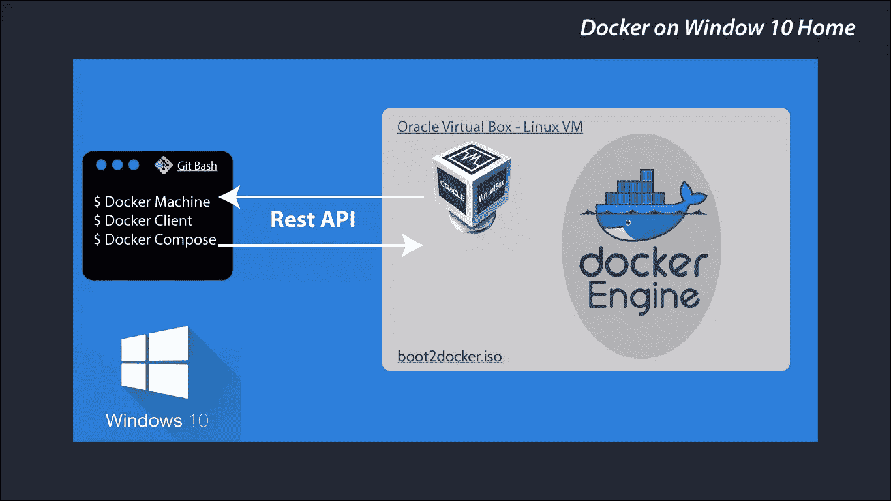
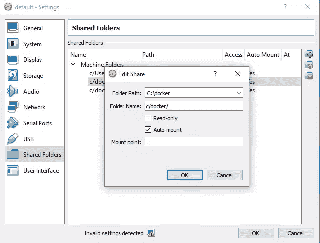
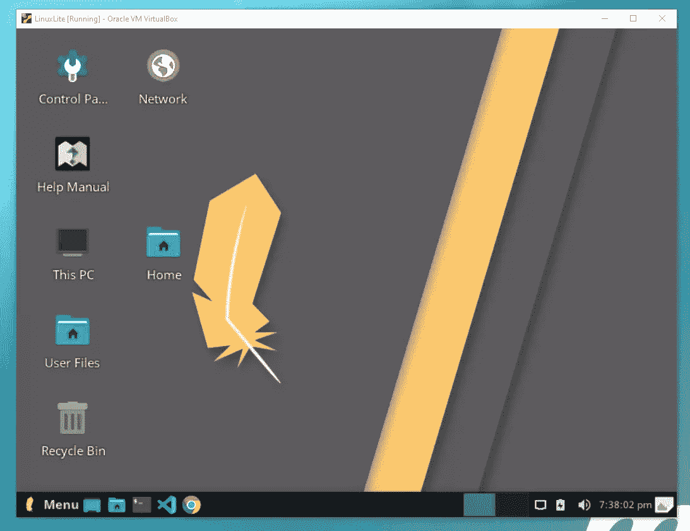

# 如何在 Windows 10 Home 上安装 Docker

> 原文：<https://www.sitepoint.com/docker-windows-10-home/>

**如果你曾经尝试过为 Windows 安装 [Docker，你可能已经意识到这个安装程序不会在 Windows 10 Home 上运行。仅 Windows Pro、企业或教育支持 Docker。升级你的 Windows 许可证是昂贵的，也是没有意义的，因为你仍然可以在 Windows 上运行 Linux 容器而不依赖于](https://docs.docker.com/docker-for-windows/install/) [Hyper-V](https://docs.docker.com/machine/drivers/hyper-v/) 技术，这是 Docker for Windows 的一个要求。**

如果你计划运行 [Windows 容器](https://hub.docker.com/_/microsoft-windows-base-os-images)，你需要一个特定版本的 Windows Server。查看 [Windows 容器版本兼容性矩阵](https://docs.microsoft.com/en-us/virtualization/windowscontainers/deploy-containers/version-compatibility)了解详情。

99.999%的时候，您只需要一个 Linux 容器，因为它支持使用开源和。NET 技术。此外，Linux 容器可以运行在任何发行版和流行的 CPU 架构上，包括`x86_64`、`ARM`和`IBM`。

在本教程中，我将向您展示如何借助 [Docker Machine](https://docs.docker.com/machine/) 在运行 Docker Engine 的 Windows Home 上快速设置 Linux VM。以下是构建和运行 Docker 容器所需的软件列表:

*   Docker Machine :在虚拟主机上安装 Docker 引擎的 CLI 工具
*   **Docker 引擎**:运行在 Linux 内核之上；用于构建和运行容器
*   Docker 客户端:通过 REST API 向 Docker 引擎发布命令的 CLI 工具
*   Docker Compose:一个定义和运行多容器应用程序的工具

我将展示如何在以下环境中执行安装:

1.  在 Windows 上使用 [Git Bash](https://git-scm.com/downloads)
2.  在 Linux 2 的 Windows 子系统上(运行 Ubuntu 18.04)

首先，请允许我解释 Docker 安装将如何在 Windows 上工作。

想在码头工人知识方面打下更多的基础吗？阅读 SitePoint Premium 上的[Learning Docker-第二版](https://www.sitepoint.com/premium/books/learning-docker-second-edition/)。

## 它是如何工作的

您可能知道，Docker 需要一个 Linux 内核来运行 Linux 容器。为了在 Windows 上工作，你需要设置一个 Linux 虚拟机，在 Windows 10 Home 中作为来宾运行。



设置 Linux 虚拟机可以手动完成。最简单的方法是使用 Docker Machine 通过运行一个命令来完成这项工作。这个 Docker Linux VM 既可以在本地系统上运行，也可以在远程服务器上运行。Docker 客户端将使用 SSH 与 Docker 引擎通信。每当您创建和运行映像时，实际的过程都将发生在虚拟机中，而不是在您的主机(Windows)上。

让我们进入下一节，设置安装 Docker 所需的环境。

## 初始设置

您的系统上可能安装了也可能没有安装以下应用程序。我假设你不知道。如果是这样，请确保升级到最新版本。我还假设你运行的是 Windows 最新的稳定版本。在写这篇文章的时候，我正在使用 Windows 10 家庭版 1903。让我们开始安装以下内容:

1.  为 Windows 安装 [Git Bash。这将是我们运行 Docker 命令的主要终端。](https://git-scm.com/downloads)

2.  安装 [Chocolatey](https://chocolatey.org/) ，一个用于 Windows 的软件包管理器。这将使安装其余程序的工作更加容易。

3.  安装 [VirtualBox](https://www.virtualbox.org/wiki/Downloads) 及其扩展。或者，如果您已经完成了 Chocolatey 的安装，您可以在提升的 PowerShell 终端中简单地执行以下命令:

    ```
    C:\ choco install virtualbox 
    ```

4.  如果您想尝试在 WSL2 环境中运行 Docker，您需要首先设置 WSL2。你可以按照这个[教程](https://www.sitepoint.com/wsl2-windows-terminal/)一步一步的指导。

## Docker 引擎设置

安装 Docker 引擎非常简单。首先我们需要安装 Docker 机器。

1.  按照第[页](https://docs.docker.com/machine/install-machine/)上的说明安装对接机。或者，您可以在提升的 PowerShell 终端中执行此命令:

    ```
    C:\ choco install docker-machine 
    ```

2.  使用 Git Bash 终端，使用 Docker 机器安装 Docker 引擎。这将下载一个包含 Docker 引擎的 Linux 映像，并使用 VirtualBox 将其作为虚拟机运行。只需执行以下命令:

    ```
    $ docker-machine create --driver virtualbox default 
    ```

3.  接下来，我们需要配置在运行 Docker 容器时公开哪些端口。这样做将允许我们通过`localhost<:port>`访问我们的应用程序。你想加多少都可以。为此，您需要从开始菜单启动 **Oracle VM VirtualBox** 。在侧边菜单上选择**默认**虚拟机。接下来点击*设置* > *网络* > *适配器 1* > *端口转发*。您应该会发现已经为您设置好的`ssh`转发端口。你可以像这样添加更多:

    

4.  接下来，我们需要允许 Docker 挂载位于您硬盘上的卷。默认情况下，您只能从`C://Users/`目录挂载。要添加不同的路径，只需进入 **Oracle VM VirtualBox** GUI。选择**默认**虚拟机，进入*设置* > *共享文件夹*。通过单击加号添加一个新的。像这样输入字段。如果有一个选项叫做**永久**，启用它。

    

5.  要消除上面截图中看到的无效设置错误，只需在设置选项的显示选项卡下增加视频内存。在这种情况下，视频内存并不重要，因为我们将以无头模式运行 VM。

6.  要启动 Linux VM，只需在 Git Bash 中执行这个命令。Linux 虚拟机将会启动。给它一些时间来完成引导过程。应该不会超过一分钟。每次启动主机操作系统时，您都需要这样做:

    ```
    $ docker-machine start vbox 
    ```

7.  接下来，我们需要设置 Docker 环境变量。这是为了允许 Docker 客户端和 Docker 组合与运行在 Linux VM 中的 Docker 引擎进行通信。您可以通过执行 Git Bash 中的命令来做到这一点:

    ```
    # Print out docker machine instance settings
    $ docker-machine env default

    # Set environment variables using Linux 'export' command
    $ eval $(docker-machine env default --shell linux) 
    ```

    每次启动新的 Git Bash 终端时，都需要设置环境变量。如果您想避免这种情况，您可以复制`eval`输出并将其保存在您的`.bashrc`文件中。它应该是这样的:

    ```
    export DOCKER_TLS_VERIFY="1"
    export DOCKER_HOST="tcp://192.168.99.101:2376"
    export DOCKER_CERT_PATH="C:\Users\Michael Wanyoike\.docker\machine\machines\default"
    export DOCKER_MACHINE_NAME="default"
    export COMPOSE_CONVERT_WINDOWS_PATHS="true" 
    ```

    **重要的**:对于`DOCKER_CERT_PATH`，你需要将 Linux 文件路径改为 Windows 路径格式。还要注意，分配的 IP 地址可能与您每次启动`default`虚拟机时保存的不同。

在下一节中，我们将安装 Docker 客户机和 Docker Compose。

## Docker 工具设置

对于本节，您需要在管理模式下使用 PowerShell 安装以下工具。这些工具打包在 Docker for Windows installer 中。由于安装程序拒绝在 Windows 10 Home 上运行，我们将使用 Chocolatey 单独安装这些程序:

```
C:\ choco install docker-cli
C:\ choco install docker-compose 
```

一旦安装过程完成，您就可以切换回 Git Bash 终端。您可以继续使用 PowerShell，但是我更喜欢使用 Linux 语法来执行命令。让我们执行以下命令来确保 Docker 正在运行:

```
# Start Docker VM
$ docker-machine start default

# Confirm Docker VM is running
$ docker-machine ls

# Configure Docker Envrionment to use Docker Vm
$ eval $(docker-machine env default --shell linux)

# Confirm Docker is connected. Should output Docker VM specs
$ docker info

# Run hello-world docker image. Should output "Hello from Docker"
$ docker run hello-world 
```

如果以上所有命令都成功运行，这意味着您已经成功安装了 Docker。如果您想尝试一个更有雄心的例子，我有一个小的 Node.js 应用程序，我已经将它配置为在 Docker 容器上运行。首先，您需要使用 PowerShell 以管理员权限安装 [GNU Make](https://chocolatey.org/packages/make) :

```
C:\ choco install make 
```

接下来，执行以下命令。运行这个 Node.js 示例将确保您在 Windows 文件系统上没有暴露端口和挂载卷的问题。首先，导航到已经在 VirtualBox 设置中挂载的文件夹。接下来，执行以下命令:

```
$ git clone git@github.com:brandiqa/docker-node.git

$ cd docker-node/website

$ make 
```

当您点击最后一个命令时，您应该会看到类似的输出:

```
docker volume create nodemodules
nodemodules
docker-compose -f docker-compose.builder.yml run --rm install
npm WARN optional SKIPPING OPTIONAL DEPENDENCY: fsevents@1.2.9 (node_modules/fsevents):
npm WARN notsup SKIPPING OPTIONAL DEPENDENCY: Unsupported platform for fsevents@1.2.9: wanted {"os":"darwin","arch":"any"} (current: {"os":"linux","arch":"x64"})

audited 9731 packages in 21.405s

docker-compose up
Starting website_dev_1 ... done
Attaching to website_dev_1
dev_1  |
dev_1  | > docker-node@1.0.0 start /usr/src/app
dev_1  | > parcel src/index.html --hmr-port 1235
dev_1  |
dev_1  | Server running at http://localhost:1234 
```

获得上面的输出意味着成功地进行了卷装载。打开`localhost:1234`确认可以访问网站。这将确认您已经正确配置了端口。您可以编辑源代码，例如更改`App.jsx`中的`h1`标题。保存文件后，浏览器页面应该会自动刷新。这意味着热模块重载从 Docker 容器开始工作。

我想提醒您注意正在使用的`docker-compose.yml`文件。为了让**热模块重载**在 Windows 中从 Docker 容器工作，需要满足以下条件:

1.  使用包裹时，在您的`package.json`启动脚本中指定 HMR 港:

    parcel src/index . html–hmr-port 1235

2.  在虚拟机的端口转发规则中，确保这些端口对主机系统公开:

    *   One thousand two hundred and thirty-four
    *   One thousand two hundred and thirty-five
3.  `inotify`在`vboxsf`文件系统上不起作用，因此无法检测到文件更改。解决方法是通过`docker-compose.yml`中的环境变量为 [`Chokidar`](https://github.com/paulmillr/chokidar) 设置轮询。下面是完整的文件，这样您可以看到它是如何设置的:

    ```
    version: '3'
    services:
      dev:
        image: node:10-jessie-slim
        volumes:
          - nodemodules:/usr/src/app/node_modules
          - ./:/usr/src/app
        working_dir: /usr/src/app
        command: npm start
        ports:
          - 1234:1234
          - 1235:1235
        environment:
        - CHOKIDAR_USEPOLLING=1
    volumes:
      nodemodules:
        external: true 
    ```

现在，我们已经在 Windows 10 home 上实现了 Docker，让我们为感兴趣的人在 WSL2 上设置它。

## 用于 Linux 2 的 Windows 子系统

在 WSL2 上安装 Docker 并不像看起来那么简单。遗憾的是，最新版本的 Docker 引擎无法在 WSL2 上运行。然而，有一个旧版本`docker-ce=17.09.0~ce-0~ubuntu`，它能够在 WSL2 中很好地运行。我不会在这里讨论这个。相反，我将向您展示如何从 WSL 终端访问运行在我们之前设置的 VM 中的 Docker 引擎。

我们要做的就是安装 Docker 客户端和 Docker compose。假设您正在运行 WSL2 Ubuntu 终端，执行以下命令:

1.  使用官方说明安装 Docker:

    ```
    # Update the apt package list.
    sudo apt-get update -y

    # Install Docker's package dependencies.
    sudo apt-get install -y \
        apt-transport-https \
        ca-certificates \
        curl \
        software-properties-common

    # Download and add Docker's official public PGP key.
    curl -fsSL https://download.docker.com/linux/ubuntu/gpg | sudo apt-key add -

    # Verify the fingerprint.
    sudo apt-key fingerprint 0EBFCD88

    # Add the `stable` channel's Docker upstream repository.
    #
    # If you want to live on the edge, you can change "stable" below to "test" or
    # "nightly". I highly recommend sticking with stable!
    sudo add-apt-repository \
    "deb [arch=amd64] https://download.docker.com/linux/ubuntu \
    $(lsb_release -cs) \
    stable"

    # Update the apt package list (for the new apt repo).
    sudo apt-get update -y

    # Install the latest version of Docker CE.
    sudo apt-get install -y docker-ce

    # Allow your user to access the Docker CLI without needing root access.
    sudo usermod -aG docker $USER 
    ```

2.  使用本[官方指南](https://docs.docker.com/compose/install/)安装 Docker Compose。另一种方法是使用 PIP，它将简单地安装最新的稳定版本:

    ```
    # Install Python and PIP.
    sudo apt-get install -y python python-pip

    # Install Docker Compose into your user's home directory.
    pip install --user docker-compose 
    ```

3.  通过在`/etc/wsl.conf`中插入此内容，修复 WSL 终端中的 Docker 挂载问题。如果文件不存在，则创建该文件:

    ```
    [automount]
    root = /
    options = "metdata" 
    ```

    您需要重新启动计算机，此设置才能生效。

4.  假设 Linux Docker VM 正在运行，您需要将 WSL 环境中的 Docker 工具连接到它。如果可以从 Ubuntu 终端访问`docker-machine`，运行`eval`命令。否则，您可以在您的`.bashrc`文件中插入以下 Docker 变量。这是我的一个例子:

    ```
    export DOCKER_HOST="tcp://192.168.99.101:2376"
    export DOCKER_CERT_PATH="/c/Users/Michael Wanyoike/.docker/machine/machines/vbox"
    export DOCKER_MACHINE_NAME="vbox"
    export COMPOSE_CONVERT_WINDOWS_PATHS="true" 
    ```

    您需要重启终端或执行`source ~/.bashrc`以使设置生效。运行 Docker 命令应该可以在 WSL 中顺利运行。

## 切换到 Linux

我们现在要结束这篇文章了。在 Windows 10 中设置 Docker 的步骤有点冗长。如果你打算重新格式化你的机器，你将不得不再次经历同样的过程。如果你的工作是在多台运行 Windows 10 Home 的机器上安装 Docker 就更糟糕了。

更简单的解决方案是转到 Linux 进行开发。您可以创建一个分区并设置双引导。您也可以使用 VirtualBox 在 Windows 中安装并运行完整的 Linux 发行版。看看你想尝试哪个[流行发行版](https://distrowatch.com/dwres.php?resource=popularity)。我使用 [Linux Lite](https://www.linuxliteos.com/) ，因为它是轻量级的，基于 Ubuntu。有了 VirtualBox，您可以尝试任意多的发行版。



如果您使用的是基于 Ubuntu 的发行版，您可以使用以下命令轻松安装 Docker:

```
# Install https://snapcraft.io/ package manager
sudo apt install snapd

# Install Docker Engine, Docker Client and Docker Compose
sudo snap install docker

# Run Docker commands without sudo
sudo usermod -aG docker $USER 
```

您需要注销，然后重新登录，以使最后一个命令生效。之后，您可以运行任何 Docker 命令而不会出现问题。您不需要担心安装或端口的问题。Docker 引擎在 Linux 中作为服务运行，默认情况下会自动启动。无需调配 Docker 虚拟机。一切都是现成的，不需要依靠黑客。

## 摘要

我希望你在 Windows 10 Home 上安装和运行 Docker 已经一帆风顺了。我认为这种技术应该可以在 Windows 7 等旧版本上使用。万一你遇到问题，只要浏览一下说明，看看你是否遗漏了什么。但是，请注意，我并没有介绍 Docker 的所有特性。您可能会遇到需要解决方法的 bug 或不受支持的功能，或者根本没有解决方案。如果是这样的话，如果你想使用 Docker 获得更流畅的开发体验，我建议你直接切换到 Linux。

## 分享这篇文章