# 如何使用 Git Branches & Buddy 组织项目代码

> 原文：<https://www.sitepoint.com/use-git-branches-buddy/>

*这篇文章是与[好友](https://buddy.works?utm_source=sp_git_buddy&utm_medium=cpc&utm_campaign=bz_sitepoint&utm_content=tutorial)合作创作的。感谢您对使 SitePoint 成为可能的合作伙伴的支持。*

在本文中，您将学习如何为您的分支工作流建立持续集成/部署管道。我们将使用 [Buddy](https://buddy.works?utm_source=sp_git_buddy&utm_medium=cpc&utm_campaign=bz_sitepoint&utm_content=tutorial) CI/CD 服务来建立管道。我们将使用一个基本的 JavaScript 项目，其中我们将建立几个开发分支。我将向您展示如何对每种类型的分支进行自动化测试。我还将介绍分支工作流的概念，并展示一些您可以在项目中采用的例子。

## 先决条件

要跟随本教程，您只需要基本的 Node.js 技能。您还需要熟悉 Git。这里有几篇文章可以帮助你:

*   [给初学者的 Git](https://www.sitepoint.com/git-for-beginners/)
*   [团队 Git](https://www.sitepoint.com/getting-started-git-team-environment/)
*   本书，[跳转开始 Git](https://www.sitepoint.com/premium/books/jump-start-git?utm_source=blog&utm_medium=articles)

为了设置我们的管道，我们需要使用 [Jest](https://jestjs.io/) 编写一些测试。如果您是 Jest 的新手，您不需要学习 Jest 本文的重点是学习如何建立管道来自动挑选新的分支并为您构建它们。在此之前，我们应该研究一下我们可以使用的各种分支策略。

## 零分支策略

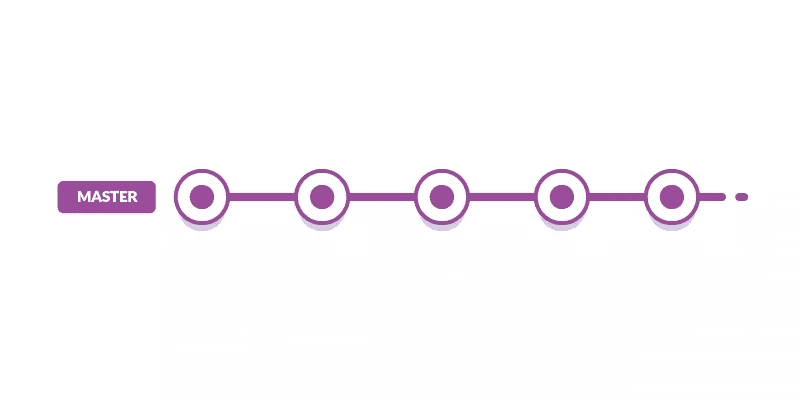

**零分支策略**只是“你没有使用任何分支策略”的一种花哨说法它也被称为基本的 T4 工作流程。您只有一个`master`分支，在那里您可以直接提交和构建您的发布。如果项目是:

*   小而简单
*   几乎不需要更新
*   由独立开发者管理

这些项目包括教程、演示、原型、初学者项目模板和个人项目。然而，这种方法有几个缺点:

*   如果不止一个人在项目中工作，可能会发生多个合并冲突
*   您将无法同时开发多个功能和修复问题
*   移除和恢复功能将是一项艰巨的任务
*   你的团队会花太多时间处理版本控制问题，而不是开发新功能

所有这些问题都可以通过采用分支策略来解决。这将为您提供:

*   能够独立工作，并在不影响团队成员的情况下将变更推送到共享存储库
*   能够将团队成员的代码与您的更改合并，并快速解决可能出现的任何冲突
*   确保代码标准得到维护，协作工作顺利进行，而不管团队的规模如何

请注意，您可以自由选择许多类型的分支工作流。您还可以创建最适合自己的自定义分支工作流。先说最简单的分支策略。

## 制定分支战略


在这个策略中，您建立了一个名为`develop`的长期分支，它与`master`分支并行运行。所有工作首先提交给`develop`分公司。这是一个安全的地方，在这里您可以引入可能会破坏项目的新代码。您将需要一个[测试策略](https://www.sitepoint.com/learning-javascript-test-driven-development-by-example/)来确保您在合并变更时不会将 bug 引入`master`分支。

此工作流程的优点是:

*   易于实施
*   只要在`develop`分支上完成实验工作，`master`分支就保持稳定和健康
*   当一个特性正在被实现时，一个热修复程序可以在任何时候在`master`分支上被实现

这种工作流程的缺点是:

*   多个功能不能同时开发
*   只有一个开发人员(最多两个)可以积极参与项目
*   仅使用`develop`分支删除和恢复特征是一个挑战

让我们看看另一个可以缓解这些挑战的工作流程。

## 特征分支策略

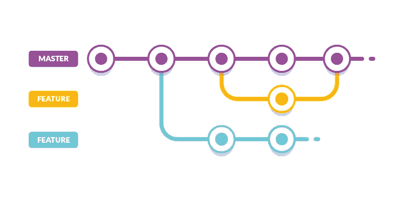

在这个工作流程中，每当您想要开发一个新的特性时，您都要设置一个新的`feature`分支。如果出现问题，您可以随时在`master`分行申请`hotfix`。开发人员在将他们的`feature`分支合并到 master 之前，需要先从`master`分支获取最新的补丁。

您将需要为您的分支命名约定，以便跟踪当前正在开发的特性和错误修复。以下是您可以在互联网上找到的一些格式建议:

*   `users/username/description`
*   `users/username/workitem`
*   `bugfix/description`
*   `features/feature-name`
*   `features/feature-area/feature-name`
*   `features/id`(‘id’由项目管理工具生成)
*   `hotfix/description`

这种策略的优点是:

*   您可以让大量开发人员在您的项目中同时处理多个特性
*   如果您改变主意，很容易删除功能并在以后恢复它们
*   您可以很容易地跟踪每个开发人员在做什么

这种策略的缺点是:

*   对于实现一个功能依赖于另一个尚未开发的功能的情况，并行开发功能并不总是可行的。这意味着在所有从属特征完成之前，不能将特征推送到主特征

让我们看看下一个策略，看看我们如何能减轻这个问题。

## Gitflow 分支策略

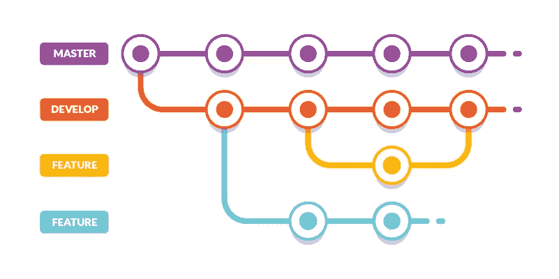

如果您能够将“开发”和“特性”分支工作流结合起来，您就可以得到一个抵消彼此缺点的解决方案。Vincent Driessen 写了一篇博客文章，描述了一个先进的 git 分支模型，该模型可以帮助大型团队在复杂项目上高效协作，并将版本控制问题降至最低。

Gitflow 是一个可定制的模型，允许您选择最适合您的项目和团队的特性。如果你正在使用 Gitflow，你可以采用丹尼尔·库默的 `git-flow` git 扩展。这些工具允许开发人员基于 Vincent 的模型执行高级存储库操作。我不会深入探讨这个问题，但这里有一些你需要知道的。

优点:

*   适合从事复杂项目的大型团队
*   易于跟踪活动功能和组织发布

缺点:

*   小项目的过度杀伤

现在，让我们看看如何使用 Buddy CI 服务在我们的分支机构实现任务自动化。

## 分支模型管线

我们需要首先建立一个简单的项目，并使用它来建立我们的管道。我们将创建仅自动提取变更并运行测试的管道。首先，创建一个新的 GitHub 存储库。称之为`buddy-demo`。

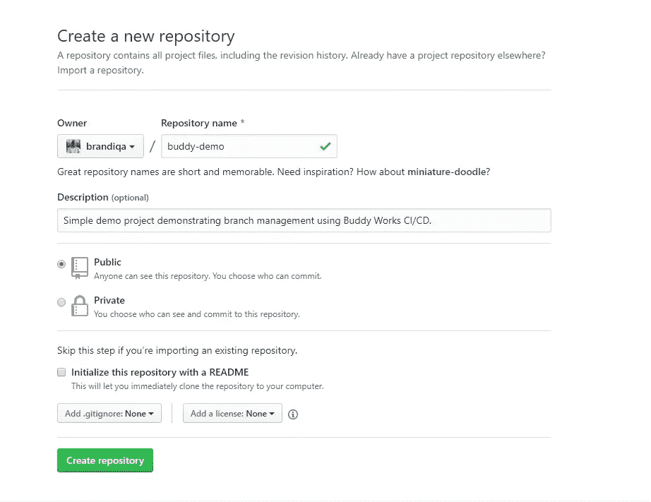

接下来，下载下面的 starter 项目并将其推送到您的 repo 中:

```
$ git clone git@github.com:brandiqa/react-parcel-starter.git buddy-demo
$ git remote rm origin
# Replace `username` with yours
$ git remote add origin git@github.com:username/buddy-demo.git
$ git config master.remote origin
$ git config master.merge refs/heads/master
$ git push -u origin master 
```

该项目是一个使用[包](https://parceljs.org)构建的基本 React 项目。您可以运行以下命令来确保其运行:

```
$ npm install
$ npm start 
```

如果您使用的是 Visual Studio 代码，请按`F5`启动浏览器。否则，打开浏览器页面并导航到 [localhost:1234](http://localhost:1234) 。

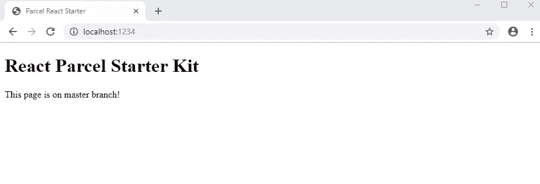

如你所见，没什么花哨的。在将它部署到我们的伙伴 CI 之前，我们需要编写一个测试。为此，我们将使用 [Jest 测试框架](https://jestjs.io/):

```
$ npm install -D jest 
```

当执行`npm test`命令时，更新`package.json`脚本段以运行`jest`。

```
 "scripts": {
   //...
    "test": "jest"
  }, 
```

让我们更新一下`src\App.jsx`:

```
<div>
  <h1>React Parcel Starter Kit</h1>
  <p>This page is on master branch!</p>
</div> 
```

接下来，让我们编写一个通过的假测试。创建文件`App.test.js`并插入以下代码:

```
test("Fake Test 1", () => {
  expect(true).toBeTruthy();
}); 
```

执行命令`npm test`以确认我们的测试通过。

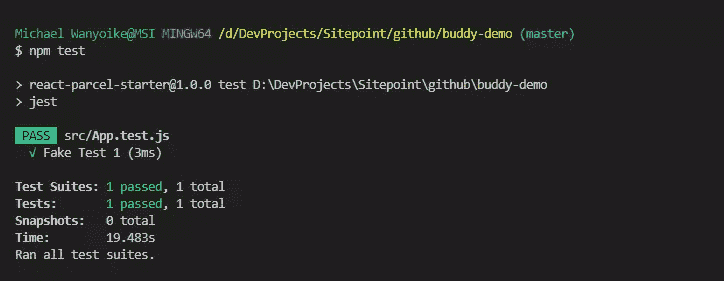

提交您的更改并将其推送到您的 GitHub repo。接下来，我们将在 [Buddy](https://buddy.works?utm_source=sp_git_buddy&utm_medium=cpc&utm_campaign=bz_sitepoint&utm_content=tutorial) 建立我们的 CI 渠道。如果你是这个平台的新手，只需用你的 GitHub 账户注册一个免费账户。请注意，Buddy 支持除 GitHub 之外的许多远程存储库服务:

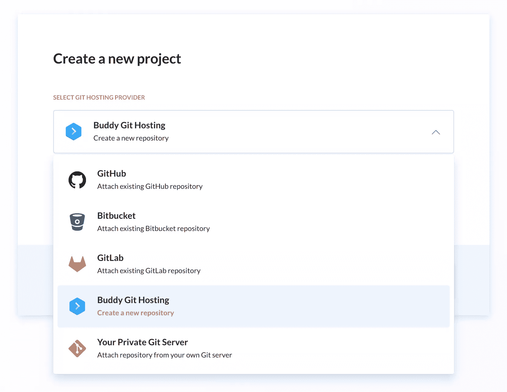

无论您选择哪个服务商，Buddy 都会列出您可以为其设置自动化的储存库。在我们的例子中，我们将选择`buddy-demo`项目。点击`Add a new pipeline`按钮，然后在下一页填写以下详细信息:

*   **姓名**–主人
*   **触发模式**–按下时
*   **分支**–单个分支:主

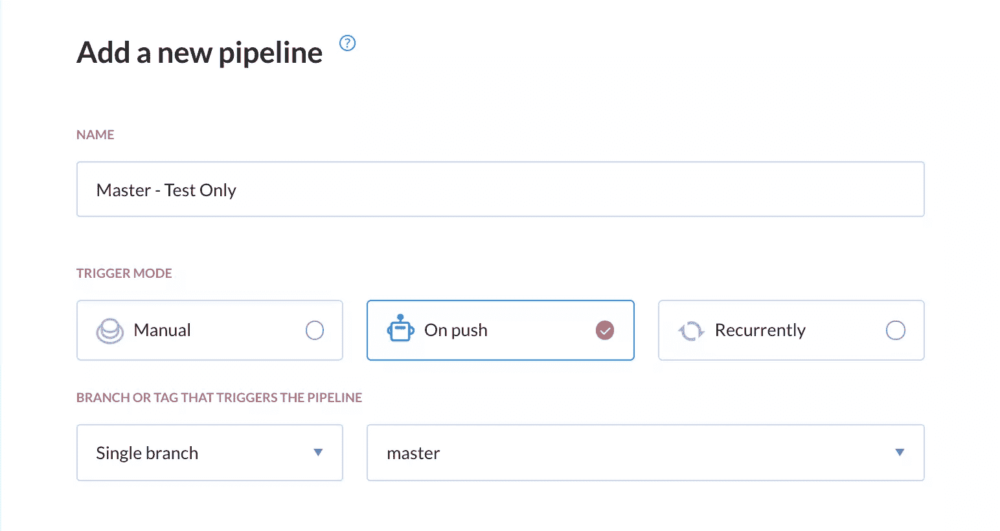

在我们的主管道中，我们将为以下项目设置行动:

*   运行测试
*   捆绑应用程序
*   部署到 web 服务器

在下一页中，您将看到定义动作的不同方法。选择`Node.js`，在下一页上，确保已经指定了以下命令:

```
npm install
npm test 
```

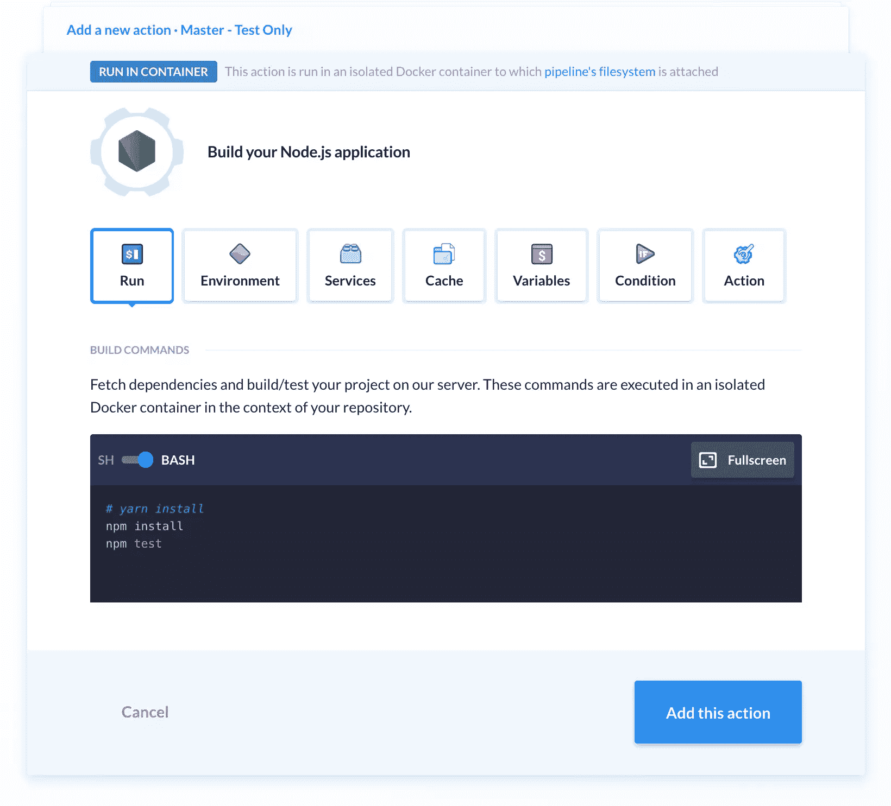

您可以在`Action`选项卡上将动作名称重命名为“运行测试”。我想指出的是，如果您的测试需要数据库服务，您可以通过`Services`选项卡设置一个:

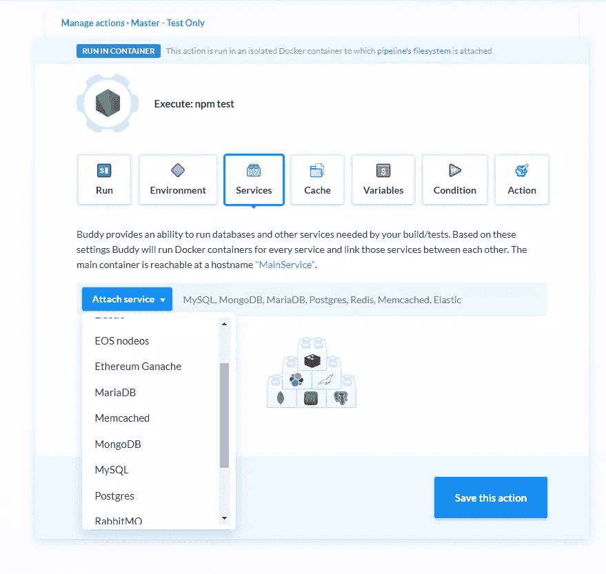

大多数流行的数据库已经得到支持。只需选择一个数据库类型，并提供连接详细信息和凭据。完成后点击`Add this Action`按钮。在下一页，单击底部的`plus`按钮添加“捆绑资产”操作。再次选择`Node.js`,在下一页输入以下命令:

```
npm run build 
```

在`Action`选项卡中，将动作重命名为`Bundle Assets`。完成后点击`Add this Action`。再次点击`plus`符号，添加“部署到生产”动作。Buddy 本身支持将项目部署到不同类型的托管供应商:

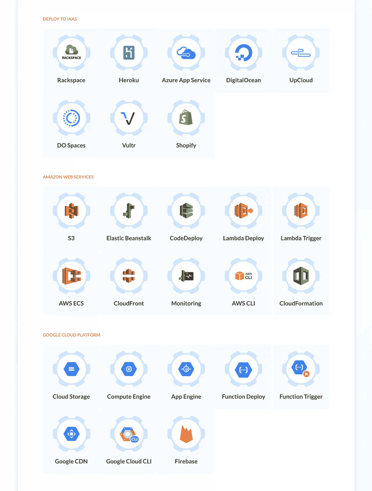

如果您拥有这些服务的帐户，请随意使用任何部署选项。如果没有，请选择允许您设置免费帐户来部署应用程序的提供商。就我而言，我已经有了一个可以使用的共享虚拟主机计划帐户。通常，你会有自己的主网站，`www.domainname.com`来托管你的项目的现场制作版本。

您需要从您的`develop`或`integration`分支管道部署一个单独的中转站点(通常对公众隐藏)。暂存网站可以只是一个子域，不应该被搜索引擎索引。试运行站点将允许开发人员、项目经理和 beta 测试人员在发布到实际生产站点之前确认新功能是否正常工作。

要将您的应用程序部署到共享或专用的 web 托管服务器(使用 CPanel)，只需使用 FTP 方法。Buddy 还提供了一个 sFTP 方法，在上传到您的服务器时，它会加密您的项目资产包。以下是我如何设置自己的示例:


您需要使用 CPanel 设置一个新的 FTP 帐户。确保您的新 FTP 用户帐户的主目录直接指向`www`或`sub-domain`文件夹。否则，您可能无法通过 FTP 访问正确的托管目录。一旦在管道中设置了所有三个操作，您就可以:

*   手动运行管道
*   将新代码推送到您的远程 repo，Buddy 会自动为您运行它

完成后，完整的管道应该是这样的:

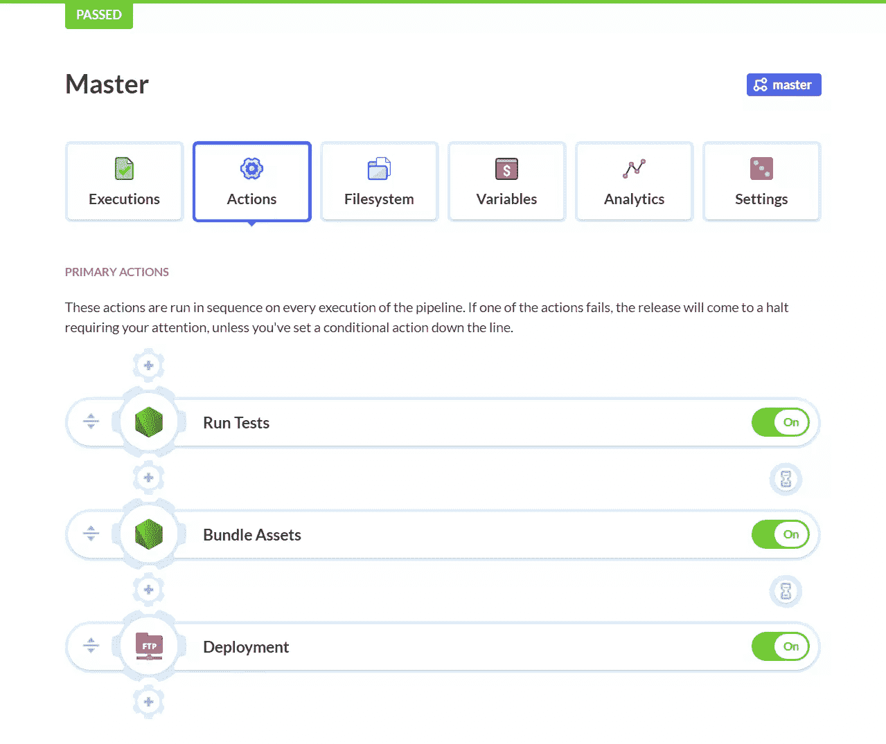

假设您正在使用 Gitflow 工作流或类似的东西，您可能需要为以下项目设置额外的管道:

*   开发/集成部门
*   特征分支
*   修补程序分支

`develop`分支管道将几乎与`master`分支管道相同。但是您需要为部署提供不同的配置，以便将代码部署到一个临时站点。功能和修补程序分支管道将只需要至少配置`testing`动作。您可能想要限制您可以在功能分支管道中运行的测试数量。您可以通过简单地将它附加到 test 命令:`jest --coverage --changedSince=master`来轻松地做到这一点。这将只测试还没有被推入`master`分支的新代码。

由于会有多个`feature`和`hotfix`分支，您可能想知道如何为这种情况建立一个管道。简单—只需使用通配符选项:

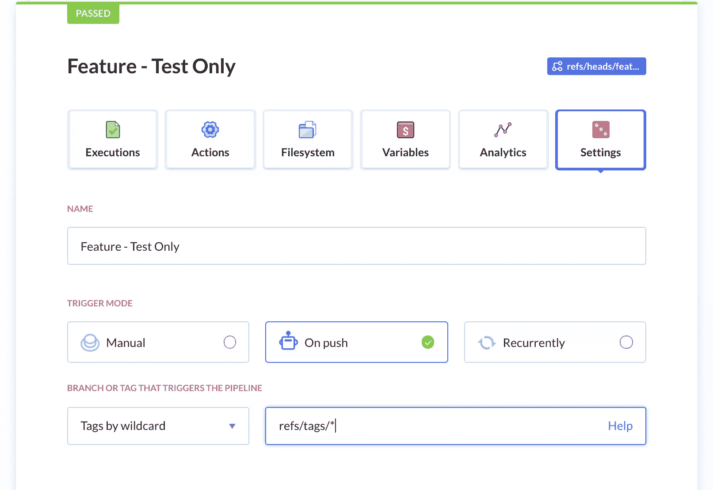

为了确认您的`develop` / `feature*` / `hotfix*`管道正在工作，只需在您的计算机上创建分支。在这种情况下，让我们创建一个随机的`feature`分支:

```
git checkout -b feature/task-1 
```

然后在`App.test.js`中创建新的测试:

```
test("Fake Test 2 for Fake Feature", () => {
  expect(true).toBeTruthy();
}); 
```

接下来，提交更改并将分支推送到 GitHub repo:

```
$ git add .
$ git commit -m "Added first feature branch"
$ git push -u origin feature/task-1
[feature/task-1 049bef2] Added first feature branch
 1 file changed, 4 insertions(+) 
```

如果您快速切换到 Buddy account dashboard，您应该看到您的管道选择您的新分支并运行您定义的操作。这就是我们如何为您的项目所采用的任何分支策略工作流建立管道。

## 摘要

最后一点，如果你打算拥有长期存在的分支机构，最好先在你的共享回购上建立它们。这样，当您开始创建新的管道时，您可以简单地使用`Select Branch`选项来选择您的长期分支。

我们现在已经到了教程的结尾。作为一个挑战，继续为`hotfix`和`develop`设置管道。创建一些分支，编写一些失败的测试，看看会发生什么。您还可以继续研究更多关于 Git 分支策略的内容。如果你准备好了，你甚至可以安装`git-flow`并使用这个工具定制你自己的分支工作流程。然后，设置您的[好友](https://buddy.works?utm_source=sp_git_buddy&utm_medium=cpc&utm_campaign=bz_sitepoint&utm_content=tutorial)管道来支持您的定制 git 分支工作流。

## 分享这篇文章