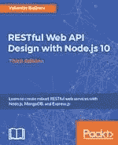

# SitePoint Premium 新版本:SSGs、交互设计、节点和 Vue

> 原文：<https://www.sitepoint.com/sitepoint-premium-new-releases-ssgs-interaction-design-node-vue/>

我们正努力通过 SitePoint Premium 让您在自己的领域保持领先地位。我们有很多新书可以在图书馆借阅——让我们给你介绍一下。

## Hexo 简介

在本指南中，我们将介绍 Hexo，这是一个开源的静态站点生成器，适用于构建博客和文档网站。我们将介绍安装、使用布局、生成帖子和提供内容、定制和安装第三方主题，以及部署到 Heroku。

➤阅读了 Hexo 的介绍。

## 彻底改变

这份重要的交互设计指南考察了移动应用、触摸界面和屏幕尺寸考虑因素，考察了目标导向的设计方法、产品设计方法、移动平台和消费电子产品的设计、当代界面、界面推荐等等。

➤读[关于脸](https://www.sitepoint.com/premium/books/about-face/read?utm_source=blog&utm_medium=articles)。

## Drupal 8 开发指南第二版

了解 Drupal 8 带来的增强的内容创作体验，以及如何对其进行定制。利用多语言工具提供国际化网站。了解如何使用 Drupal 的配置管理系统从开发、准备和生产阶段进行部署。

➤阅读了 Drupal 8 开发指南第二版。

## 用 Hugo 创建静态网站的初学者指南

本教程描述了如何使用雨果，一个静态网站生成器(SSG)写的 go。Hugo 拥有丰富的功能，由于 go 而非常快，并且有许多第三方主题、活跃的社区和详细的文档。

➤和雨果一起阅读了《创建静态网站初学者指南》。

## 使用 Node.js 10 的 RESTful Web API 设计–第三版

使用 Node.js 10 从头开始设计和实现可扩展和可维护的 RESTful 解决方案。探索 Node.js 10、Express 4.0 和 MongoDB 的新特性。将 MongoDB 集成到 Node.js 应用程序中，以存储和保护数据。

➤用 Node.js 10 阅读了 [RESTful Web API 设计——第三版](https://www.sitepoint.com/premium/books/restful-web-api-design-with-node-js-10-third-edition/read?utm_source=blog&utm_medium=articles)。

## Learn Vue.js:收藏

对于那些在 Vue.js 上寻找全面指南的人，我们已经在亚马逊上提供了我们的收藏作为 Kindle 书籍。是 Jump Start Vue.js 的绝佳伴侣！

> 自 2014 年发布以来，Vue.js 的受欢迎程度迅速上升，现在被认为是主要的前端框架之一，这不无道理。其基于组件的架构设计灵活且易于采用，这使得它可以轻松集成到项目中并与非 Vue 代码一起使用，就像构建复杂的客户端应用程序一样。

➤购买 [Learn Vue.js:收藏](https://www.amazon.com/Learn-Vue-js-Collection-James-Hibbard-ebook/dp/B07SXTF3MJ/ref=sr_1_2?keywords=learn+vue.js+the+collection&qid=1560413740&s=gateway&sr=8-2)。

## 还会有更多…

我们几乎每天都在 SitePoint Premium 上发布新内容，所以下周我们将带着最新更新回来。别忘了:如果你还没有查看我们的产品，可以去我们的[图书馆转转](https://www.sitepoint.com/?utm_source=blog&utm_medium=articles)。

## 分享这篇文章