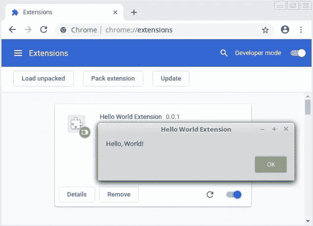
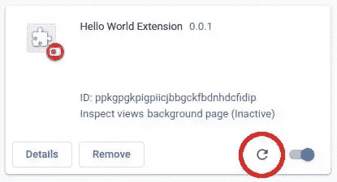
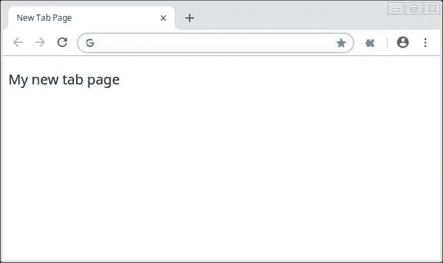
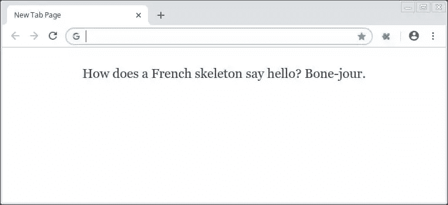
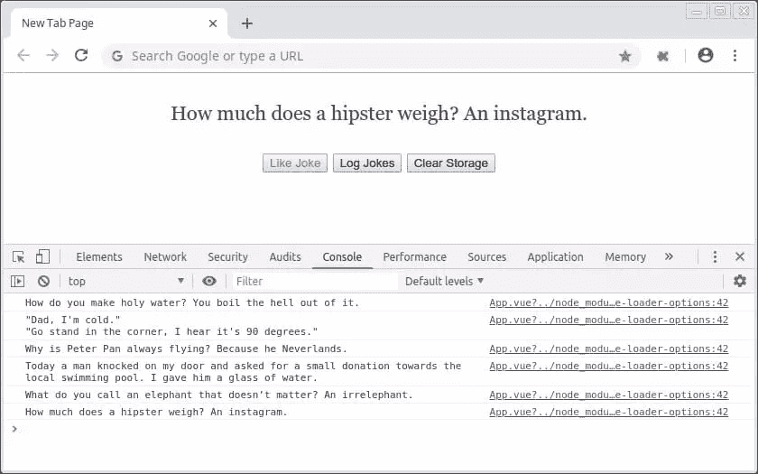
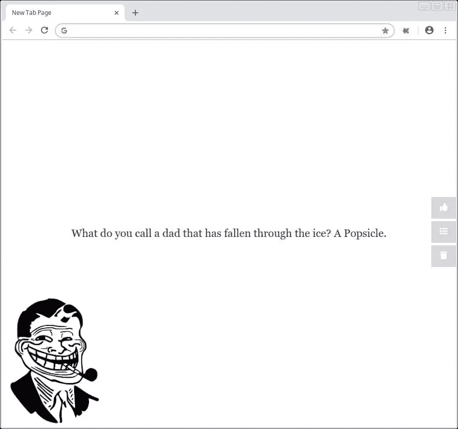

# 如何用 Vue 构建一个 Chrome 扩展

> 原文：<https://www.sitepoint.com/build-vue-chrome-extension/>

在本教程中，我将向你展示如何构建一个简单的 Vue Chrome 扩展。我们的扩展将改变新标签页的行为。对于扩展的 JavaScript 部分，我将使用 Vue.js 框架，因为[它将允许我们快速启动并运行](https://www.sitepoint.com/replace-jquery-vue/)，并且工作起来非常有趣。

浏览器扩展是可以修改和增强 web 浏览器功能的小程序。它们可以用于各种任务，例如阻止广告、管理密码、组织标签、改变网页的外观和行为等等。

好消息是[浏览器扩展并不难编写](https://www.sitepoint.com/build-a-chrome-extension/)。它们可以使用你已经熟悉的网络技术——HTML、CSS 和 JavaScript——来创建，就像普通的网页一样。然而，与普通的网页不同，扩展可以访问许多特定于浏览器的 API，这就是乐趣所在。你可能已经在你的 web 开发工作流程中使用了[浏览器扩展](https://www.sitepoint.com/10-top-chrome-extensions-for-your-web-development-workflow/)。

本教程的代码可以在 GitHub 上找到。

## Chrome 扩展的基础

任何 Chrome 扩展的核心部分是一个[清单文件](https://developer.chrome.com/extensions/manifest)和一个[后台脚本](https://developer.chrome.com/extensions/background_pages)。清单文件是 JSON 格式的，提供了关于扩展的重要信息，比如它的版本、资源或者它需要的权限。后台脚本允许扩展对特定的浏览器事件做出反应，比如创建新的选项卡。

为了演示这些概念，让我们先写一个“Hello，World！”Chrome 扩展。

新建一个名为`hello-world-chrome`的文件夹和两个文件:`manifest.json`和`background.js`:

```
mkdir hello-world-chrome
cd hello-world-chrome
touch manifest.json background.js 
```

打开`manifest.json`并添加以下代码:

```
{
  "name": "Hello World Extension",
  "version": "0.0.1",
  "manifest_version": 2,
  "background": {
    "scripts": ["background.js"],
    "persistent": false
  }
} 
```

`name`、`version`和`manifest_version`都是必填字段。`name`和`version`字段可以是你想要的；[清单版本](https://developer.chrome.com/extensions/manifestVersion)应该设置为 2(从 Chrome 18 开始)。

`background`键允许我们注册一个后台脚本，列在`scripts`键之后的数组中。除非扩展使用 [chrome.webRequest API](https://developer.chrome.com/extensions/webRequest) 来阻止或修改网络请求，否则`persistent`键应该设置为`false`。

现在让我们将下面的代码添加到`background.js`中，让浏览器在安装扩展时打招呼:

```
chrome.runtime.onInstalled.addListener(() => {
  alert('Hello, World!');
}); 
```

最后，让我们安装扩展。打开 Chrome，在地址栏输入`chrome://extensions/`。您应该会看到一个页面，显示您已经安装的扩展。

因为我们想从一个文件(而不是 Chrome 网络商店)安装我们的扩展，我们需要使用页面右上角的开关激活*开发者模式*。这将增加一个额外的菜单栏，带有选项 *Load unpacked* 。点击此按钮，选择您之前创建的`hello-world-chrome`文件夹。点击*打开*，你应该会看到扩展已经安装好了，还有一个“Hello，World！”弹出窗口出现。



恭喜你！你刚刚做了一个 Chrome 扩展。

## 覆盖 Chrome 的新标签页

下一步是当我们打开一个新标签页时，让我们的扩展问候我们。我们可以通过使用[覆盖页面 API](https://developer.chrome.com/extensions/override) 来做到这一点。

注意:在你继续之前，请确保禁用任何覆盖 Chrome 新标签页的扩展。一次只有一个扩展可以改变这种行为。

我们将首先创建一个要显示的页面，而不是新的选项卡页面。姑且称之为`tab.html`。这应该与您的清单文件和后台脚本位于同一个文件夹中:

```
<!DOCTYPE html>
<html lang="en">
<head>
  <meta charset="UTF-8">
  <title>My New Tab Page!</title>
</head>
<body>
  <h1>My New Tab Page!</h1>
  <p>You can put any content here you like</p>
</body>
</html> 
```

接下来我们需要告诉扩展这个页面。我们可以通过在清单文件中指定一个`chrome_url_overrides`键来实现，如下所示:

```
"chrome_url_overrides": {
  "newtab": "tab.html"
} 
```

最后，您需要重新加载扩展以使更改生效。你可以通过点击 Chrome 扩展页面上 Hello World 扩展的*重新加载*图标来实现。



现在，当你打开一个新的标签，你应该会看到你的自定义信息。

## 向扩展添加 Vue

现在，我们已经有了一个非常基本的扩展实现，是时候考虑一下其他期望的功能了。当用户打开一个新标签，我希望扩展:

*   从精彩的[icanhazdadjoke.com](https://icanhazdadjoke.com/)那里拿来一个笑话。
*   以一种格式良好的方式向用户显示这个笑话。
*   为用户显示一个喜欢笑话的按钮。这样就把玩笑留到`chrome.storage`了。
*   显示一个按钮，供用户列出喜爱的笑话。

当然，您可以使用普通的 JavaScript 或 jQuery 之类的库来完成所有这些工作——如果这是您喜欢的，请随意！

然而，出于本教程的目的，我将使用 Vue 和令人敬畏的 [vue-web-extension](https://github.com/Kocal/vue-web-extension) 样板文件来实现这个功能。

使用 Vue 可以让我更快地写出更好、更有条理的代码。正如我们将看到的，样板文件提供了几个脚本，这些脚本消除了构建 Vue Chrome 扩展时的一些常见任务(例如，无论何时进行更改，都必须重新加载扩展)。

### vue-web-扩展-样板文件

本节假设您的计算机上安装了 Node 和 npm。如果不是这种情况，你可以进入[项目的主页](https://nodejs.org/en/)并为你的系统获取相关的二进制文件，或者你可以[使用版本管理器](https://www.sitepoint.com/quick-tip-multiple-versions-node-nvm/)。我建议使用版本管理器。

我们还需要安装 [Vue CLI](https://cli.vuejs.org/) 和 [@vue/cli-init 包](https://github.com/vuejs/vue-cli/tree/dev/packages/%40vue/cli-init#vuecli-init):

```
npm install -g @vue/cli
npm install -g @vue/cli-init 
```

做完这些，让我们拿一份样板文件:

```
vue init kocal/vue-web-extension new-tab-page 
```

这将打开一个向导，询问您一系列问题。为了保持本教程的重点，我回答如下:

```
? Project name new-tab-page
? Project description A Vue.js web extension
? Author James Hibbard <jim@example.com>
? License MIT
? Use Mozilla's web-extension polyfill? No
? Provide an options page? No
? Install vue-router? No
? Install vuex? No
? Install axios? Yes
? Install ESLint? No
? Install Prettier? No
? Automatically install dependencies? npm 
```

你可以修改你的答案来适应你的喜好，但是可以肯定的是你选择安装 axios。我们将用这个来获取笑话。

接下来，转到项目目录并安装依赖项:

```
cd new-tab-page
npm install 
```

然后，我们可以使用样板文件提供的脚本之一来构建我们的新扩展:

```
npm run watch:dev 
```

这将把扩展构建到项目根目录下的一个`dist`文件夹中，以便开发和观察变化。

要将扩展添加到 Chrome 中，需要经历与上述相同的过程，确保选择`dist`文件夹作为扩展目录。如果一切按计划进行，您应该会看到一个“Hello world！”扩展初始化时的消息。

### Vue Chrome 扩展项目设置

让我们花点时间看看我们的新项目，看看样板文件给了我们什么。当前文件夹结构应该如下所示:

```
.
├── dist
│   └── <the built extension>
├── node_modules
│   └── <one or two files and folders>
├── package.json
├── package-lock.json
├── scripts
│   ├── build-zip.js
│   └── remove-evals.js
├── src
│   ├── background.js
│   ├── icons
│   │   ├── icon_128.png
│   │   ├── icon_48.png
│   │   └── icon.xcf
│   ├── manifest.json
│   └── popup
│       ├── App.vue
│       ├── popup.html
│       └── popup.js
└── webpack.config.js 
```

正如您所看到的，从项目根目录下的配置文件中，样板文件正在使用 webpack。这太棒了，因为这为我们的后台脚本提供了[热模块重载](https://webpack.js.org/concepts/hot-module-replacement)。

`src`文件夹包含了我们将用于扩展的所有文件。清单文件和`background.js`应该很熟悉，但是还要注意一个包含 Vue 组件的`popup`文件夹。当样板文件将扩展构建到`dist`文件夹中时，它将通过 [vue-loader](https://github.com/vuejs/vue-loader) 传输任何`.vue`文件，并输出浏览器可以理解的 JavaScript 包。

在`src`文件夹中还有一个`icons`文件夹。如果你看看 Chrome 的工具栏，你应该会看到我们的扩展的一个新图标(也被称为[浏览器动作](https://developer.chrome.com/extensions/browserAction))。这是从这个文件夹中提取的。如果你点击它，你会看到一个弹出窗口，显示“Hello world！”这是由`popup/App.vue`创造的。

最后，请注意一个包含两个脚本的`scripts`文件夹——一个用于删除`eval`用法以符合 Chrome Web Store 的内容安全策略，另一个用于将您的扩展打包成. zip 文件，这是将它上传到 Chrome Web Store 时所必需的。

在`package.json`文件中也声明了各种脚本。我们将使用`npm run watch:dev`开发扩展，稍后使用`npm run build-zip`生成一个 ZIP 文件上传到 Chrome 网络商店。

## 为新选项卡页面使用 Vue 组件

从从`background.js`中删除烦人的`alert`语句开始。

现在让我们在`src`文件夹中创建一个新的`tab`文件夹来存放新标签页的代码。我们将在这个新文件夹中添加三个文件— `App.vue`、`tab.html`、`tab.js`:

```
mkdir src/tab
touch src/tab/{App.vue,tab.html,tab.js} 
```

打开`tab.html`并添加以下内容:

```
<!DOCTYPE html>
<html lang="en">
<head>
  <meta charset="UTF-8">
  <title>New Tab Page</title>
  <link rel="stylesheet" href="tab.css">
</head>
<body>
  <div id="app"></div>
  <script src="tab.js"></script>
</body>
</html> 
```

这里没什么特别的。这是一个简单的 HTML 页面，它将保存我们的 Vue 实例。

接下来，在`tab.js`中添加:

```
import Vue from 'vue';
import App from './App';

new Vue({
  el: '#app',
  render: h => h(App)
}); 
```

在这里，我们导入 Vue，为我们希望用应用程序替换的元素传递一个选择器，然后告诉它呈现我们的`App`组件。

最后，在`App.vue`中:

```
<template>
  <p>{{ message }}</p>
</template>

<script> export default {
  data () {
    return {
      message: "My new tab page"
    }
  }
} </script>

<style scoped> p {
  font-size: 20px;
} </style> 
```

在使用这个新的选项卡页面之前，我们需要更新清单文件:

```
{
  "name":"new-tab-page",
  ...
  "chrome_url_overrides": {
    "newtab": "tab/tab.html"
  }
} 
```

我们还需要让样板文件编译我们的文件，并将它们复制到`dist`文件夹中，这样它们就可以用于扩展。

像这样修改`webpack.config.js`，更新`entry`和`plugins`键:

```
entry: {
  'background': './background.js',
  'popup/popup': './popup/popup.js',
  'tab/tab': './tab/tab.js'
}, 
```

```
plugins: [
  ...
  new CopyPlugin([
    { from: 'icons', to: 'icons', ignore: ['icon.xcf'] },
    { from: 'popup/popup.html', to: 'popup/popup.html', transform: transformHtml },
    { from: 'tab/tab.html', to: 'tab/tab.html', transform: transformHtml },
    ...
  }) 
```

您需要重新启动`npm run watch:dev`任务才能使这些更改生效。完成后，重新加载扩展并打开一个新标签。您应该会看到“我的新标签页”显示。



## 在我们的 Vue Chrome 扩展中获取和显示笑话

好了，我们已经覆盖了 Chrome 的新标签页，并用一个迷你 Vue 应用程序取而代之。现在让我们让它做的不仅仅是显示消息。

按如下方式更改`src/tab/App.vue`中的模板部分:

```
<template>
  <div>
    <div v-if="loading">
      <p>Loading...</p>
    </div>
    <div v-else>
      <p class="joke">{{ joke }}</p>
    </div>
  </div>
</template> 
```

将`<script>`部分修改如下:

```
<script>
import axios from 'axios';

export default {
  data () {
    return {
      loading: true,
      joke: "",
    }
  },
  mounted() {
    axios.get(
      "https://icanhazdadjoke.com/",
      { 'headers': { 'Accept': 'application/json' } }
    )
      .then(res => {
        this.joke = res.data.joke;
        this.loading = false;
      });
  }
}
</script> 
```

最后，将`<style>`部分修改如下:

```
<style>
body {
  height: 98vh;
  text-align: center;
  color: #353638;
  font-size: 22px;
  line-height: 30px;
  font-family: Merriweather,Georgia,serif;
  background-size: 200px;
  display: flex;
  align-items: center;
  justify-content: center;
}

.joke {
  max-width: 800px;
}
</style> 
```

如果您正在运行`npm run watch:dev`任务，那么扩展应该会自动重新加载，并且每当您打开一个新的选项卡页面时，您应该会看到一个笑话显示。



一旦您验证了它的工作，让我们花一分钟来理解我们做了什么。

在模板中，我们使用了一个 [v-if](https://vuejs.org/v2/guide/conditional.html) 块来显示加载消息或笑话，这取决于`loading`属性的状态。最初，这将被设置为`true`(显示加载消息)，然后我们的脚本将发出一个 Ajax 请求来检索笑话。一旦 Ajax 请求完成，`loading`属性将被设置为`false`，导致组件被重新呈现，我们的笑话被显示。

在`<script>`部分，我们导入 axios，然后声明几个数据属性——前面提到的`loading`属性和一个`joke`属性来保存笑话。然后我们利用`mounted` [生命周期挂钩](https://vuejs.org/v2/guide/instance.html#Instance-Lifecycle-Hooks)，它在我们的 Vue 实例挂载后触发，向 [joke API](https://icanhazdadjoke.com/api) 发出 Ajax 请求。一旦请求完成，我们更新我们的两个数据属性，使组件重新呈现。

到目前为止，一切顺利。

## 将笑话保存到 Chrome 的存储器中

接下来，让我们添加一些按钮，允许用户喜欢一个笑话，并列出喜欢的笑话。因为我们将使用 [Chrome 的存储 API](https://developer.chrome.com/extensions/storage) 来保存笑话，所以添加第三个按钮来从存储器中删除所有喜欢的笑话可能是值得的。

首先，将以下内容添加到`manifest.json`的底部:

```
"permissions": [ "storage" ] 
```

这使得 Vue Chrome 扩展可以访问`chrome.storage` API。

重新加载扩展，然后将按钮添加到`v-else`块:

```
<div v-else>
  <p class="joke">{{ joke }}</p>

  <button @click="likeJoke" :disabled="likeButtonDisabled">Like Joke</button>
  <button @click="logJokes" class="btn">Log Jokes</button>
  <button @click="clearStorage" class="btn">Clear Storage</button>
</div> 
```

这里没什么太令人兴奋的。请注意我们将 like 按钮的`disabled`属性绑定到 Vue 实例上的数据属性以确定其状态的方式。这是因为用户不应该喜欢一个笑话超过一次。

接下来，将点击处理程序和`likeButtonDisabled`添加到我们的脚本部分:

```
export default {
  data () {
    return {
      loading: true,
      joke: "",
      likeButtonDisabled: false
    }
  },
  methods: {
    likeJoke(){
      chrome.storage.local.get("jokes", (res) => {
        if(!res.jokes) res.jokes = [];
        res.jokes.push(this.joke);
        chrome.storage.local.set(res);
        this.likeButtonDisabled = true;
      });
    },
    logJokes(){
      chrome.storage.local.get("jokes", (res) => {
        if(res.jokes) res.jokes.map(joke => console.log(joke));
      });
    },
    clearStorage(){
      chrome.storage.local.clear();
    }
  },
  mounted() { ... }
} 
```

这里我们声明了三个新方法来处理三个新按钮。

`likeJoke`方法在 Chrome 的存储器中寻找一个`jokes`属性。如果它丢失了(也就是说，用户还没有喜欢上一个笑话)，它将它初始化为一个空数组。然后，它将当前笑话推送到这个数组上，并将其保存回存储器。最后，它将`likeButtonDisabled`数据属性设置为`true`，禁用 like 按钮。

`logJokes`方法也在 Chrome 的存储器中寻找一个`jokes`属性。如果找到一个，它将遍历所有条目，并将它们记录到控制台。

希望`clearStorage`方法的作用是清楚的。

继续在扩展中尝试这个新功能，并确信它是可行的。



## 为 Vue Chrome 扩展增添光彩

好的，这看起来是可行的，但是按钮很难看，页面有点单调。让我们通过给扩展添加一些润色来结束这一部分。

下一步，安装 [vue-awesome](https://www.npmjs.com/package/vue-awesome) 库。这将允许我们在页面上使用一些字体很棒的图标，并使这些按钮看起来更好一些:

```
npm install vue-awesome 
```

在`src/tab/tab.js`向我们的 Vue 应用程序注册库:

```
import Vue from 'vue';
import App from './App';
import "vue-awesome/icons";
import Icon from "vue-awesome/components/Icon";

Vue.component("icon", Icon);

new Vue({
  el: '#app',
  render: h => h(App)
}); 
```

现在像这样修改模板:

```
<template>
  <div>
    <div v-if="loading" class="centered">
      <p>Loading...</p>
    </div>
    <div v-else>
      <p class="joke">{{ joke }}</p>

      <div class="button-container">
        <button @click="likeJoke" :disabled="likeButtonDisabled" class="btn"><icon name="thumbs-up"></icon></button>
        <button @click="logJokes" class="btn"><icon name="list"></icon></button>
        <button @click="clearStorage" class="btn"><icon name="trash"></icon></button>
      </div>
    </div>
  </div>
</template> 
```

最后，让我们给按钮添加更多的样式，包括一张每个人最喜欢的父亲的图片:

```
<style>
body {
  height: 98vh;
  text-align: center;
  color: #353638;
  font-size: 22px;
  line-height: 30px;
  font-family: Merriweather,Georgia,serif;
  background: url("https://uploads.sitepoint.com/wp-content/uploads/2018/12/1544189726troll-dad.png") no-repeat 1% 99%;
  background-size: 200px;
  display: flex;
  align-items: center;
  justify-content: center;
}

.joke {
  max-width: 800px;
}

.button-container {
  position: absolute;
  right: 0px;
  top: calc(50% - 74px);
}

.btn {
  background-color: #D8D8D8;
  border: none;
  color: white;
  padding: 12px 16px;
  font-size: 16px;
  cursor: pointer;
  display: block;
  margin-bottom: 5px;
  width: 50px;
}

.btn:hover {
  background-color: #C8C8C8;
}

.btn:disabled {
  background-color: #909090;
}
</style> 
```

应该会重新加载扩展。试着打开一个新标签，你应该会看到类似这样的东西。



## 将扩展上传到 Chrome 网络商店

如果你想让其他人下载你的扩展，你可以通过 [Chrome 网上商店](https://chrome.google.com/webstore/category/extensions)来完成。

要做到这一点，你首先需要一个谷歌账户，你可以用它登录到[开发者仪表板](https://chrome.google.com/webstore/developer/dashboard)。系统会提示你输入开发者的详细信息，在你发布第一个应用之前，你必须一次性支付 5 美元的开发者注册费用(通过信用卡)。

接下来，您需要为您的应用程序创建一个 ZIP 文件。您可以通过运行`npm run build-zip`在本地完成这项工作。这将在您的项目根目录下创建一个`dist-zip`文件夹，其中包含一个准备上传到 Web 商店的 ZIP 文件。

对于最小的扩展，这是您真正需要做的。然而，在你上传任何东西之前，有必要阅读 Chrome 网上商店官方发布的指南。

## 结论

就这样，我们结束了。在本教程中，我强调了 Chrome 扩展的主要部分，并展示了如何使用 [vue-web-extension](https://github.com/Kocal/vue-web-extension) 样板快速构建 Vue Chrome 扩展。我们最后看了如何上传一个扩展到网上商店和所有相关的东西。

我希望你喜欢这篇教程，并且可以用它来开始构建你自己的 Chrome 扩展。如果你做了什么酷的东西，请告诉我。

## 分享这篇文章