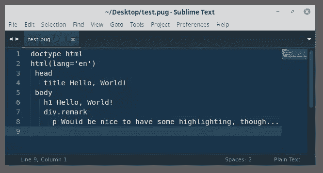
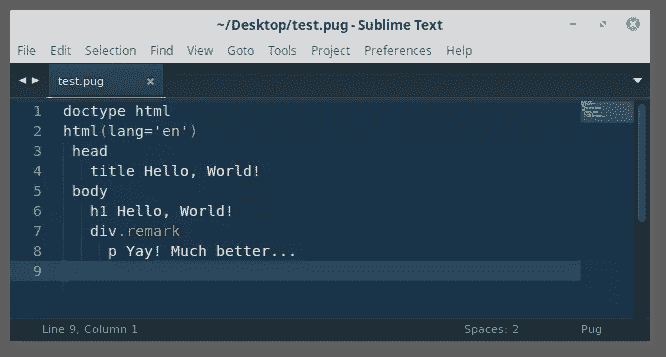

# Pug HTML 模板预处理器指南

> 原文：<https://www.sitepoint.com/a-beginners-guide-to-pug/>

作为网页设计者或开发者，我们很可能都要编写自己的 HTML。虽然这不是最困难的任务，但它经常会让人觉得有点无聊或重复。这就是 Pug HTML 预处理器的用武之地。

HTML 也是静态的，这意味着如果您想要显示动态数据(例如，从 API 获取)，您最终总是会在 JavaScript 中得到 HTML 字符串的混搭。调试和维护这可能是一场噩梦。Pug 是一个用于节点和浏览器的模板引擎。它编译成 HTML，并有一个简化的语法，这可以让你更有生产力和你的代码更可读。Pug 使得编写可重用的 HTML 以及呈现从数据库或 API 提取的数据变得容易。

在本指南中，我将演示如何使用 Pug。我们将从从 npm 安装它开始，浏览它的基本语法，然后看几个在 Pug 中使用 JavaScript 的例子。最后，我们将通过构建一个简单的使用 Pug 作为模板引擎的 Node/Express 项目来探索 Pug 的一些更高级的特性。

## 哈巴狗是做什么用的？

在我们开始研究 Pug 之前，让我们花一点时间来理解其中涉及的概念。

模板引擎是一个负责将模板(可以用多种语言中的任何一种编写)编译成 HTML 的程序。模板引擎通常会从外部来源接收数据，并将其注入到正在编译的模板中。下图对此进行了说明。

Credit: Dreftymac, [TempEngWeb016](https://en.wikipedia.org/wiki/File:TempEngWeb016.svg), [CC BY-SA 3.0](https://creativecommons.org/licenses/by-sa/3.0/legalcod)

这种方法允许您重用静态 web 页面元素，同时根据您的数据定义动态元素。它还有助于关注点的分离，保持应用程序逻辑与显示逻辑的隔离。

如果您的站点或 web 应用程序是数据驱动的，您更有可能从模板引擎中受益，例如用于管理员工的员工目录、列出各种产品供用户购买的 web 商店，或者具有动态搜索功能的站点。

如果您从 API 获取少量数据(在这种情况下，您可以只使用 JavaScript 的原生[模板字符串](https://developer.mozilla.org/en-US/docs/Web/JavaScript/Reference/Template_literals))，或者如果您正在创建一个小型静态站点，则不需要模板引擎。

## 一点历史

另外值得注意的是，Pug 过去被称为 Jade，直到 2015 年因商标索赔而被迫更名。名称更改在 2.0 版中生效。

网上仍然有很多与玉石相关的资料。虽然其中一些可能仍然非常有效，但名称的改变与主要版本的变动相一致，这意味着 Pug 的语法与它的前身相比有几处不同、被弃用和被删除。这些都记录在[这里](https://github.com/pugjs/pug/issues/2305)。

如果你有兴趣了解更多，你可以在[本期 GitHub](https://github.com/pugjs/pug/issues/2184)中阅读最初的更名公告。否则，一定要在你的 Pug 相关的谷歌搜索中添加“模板”这个词，以避免搜索结果充满了杂种狗。

## 安装帕格

在我们开始编写一些 Pug 之前，我们需要安装 Node、npm(与 Node 捆绑在一起)和 [pug-cli 包](https://www.npmjs.com/package/pug-cli)。

安装 Node/npm 有几个选项。要么直接去[项目的主页](https://nodejs.org/en/download/)下载适合你系统的二进制文件，要么使用版本管理器，比如 [nvm](https://github.com/creationix/nvm) 。我建议尽可能使用版本管理器，因为这将允许您安装不同的节点版本，并在它们之间随意切换。它还将消除一系列潜在的权限错误。

您可以查看我们的教程“[使用 nvm](https://www.sitepoint.com/quick-tip-multiple-versions-node-nvm/) 安装 Node.js 的多个版本”以获得更深入的指导。

一旦 Node 和 npm 安装在您的系统上，您就可以像这样安装`pug-cli`包:

```
npm i -g pug-cli 
```

您可以通过在终端中键入`pug --version`来检查安装过程是否正确运行。这将输出您已经安装的 Pug 版本和 CLI 版本。

在编写本报告时，情况如下:

```
$ pug --version
pug version: 2.0.3
pug-cli version: 1.0.0-alpha6 
```

### 编辑器中的语法高亮显示

如果您的编辑器没有为 Pug 提供语法突出显示，那么寻找一个扩展来添加这个功能将是一个好主意。

我目前使用的是 Sublime Text 3，开箱后，这是一个`.pug`文件的样子:



为了解决这个问题，可以安装 [Sublime Pug 包](https://packagecontrol.io/packages/Pug):



语法高亮将使处理 Pug 文件变得更加容易，尤其是那些任意长度的文件。

### 不安装就尝试 Pug HTML

如果您想了解本教程中更简单的例子，您也可以在各种在线代码平台上运行它们。

例如，CodePen 就有 Pug 支持。简单地创建一个新的笔，然后选择*设置* > *HTML* ，选择 Pug 作为你的预处理器。这将允许您在 HTML 窗格中输入 Pug 代码，并实时看到结果。

额外的好处是，您可以单击 HTML 窗格中的向下箭头，并选择*查看编译的 HTML* 来查看 Pug 生成的标记。

## Pug HTML 的基本语法

现在我们已经安装了 Pug，让我们来试一试。创建一个名为`pug-examples`的新目录，并在其中进行更改。然后再创建一个名为`html`的目录和一个名为`index.pug`的文件:

```
mkdir -p pug-examples/html
cd pug-examples
touch index.pug 
```

*注意:`touch`命令是特定于 Linux/macOS 的。Windows 用户会做`echo.> index.pug`来达到同样的目的。*

工作方式是，我们将在`index.pug`中编写我们的 Pug 代码，并让`pug-cli`观察这个文件的变化。当它检测到任何错误时，它将获取`index.pug`的内容并在`html`目录中将其呈现为 HTML。

要启动它，在`pug-examples`目录中打开一个终端并输入:

```
pug -w . -o ./html -P 
```

您应该会看到如下所示的内容:

```
watching index.pug
rendered /home/jim/Desktop/pug-examples/html/index.html 
```

*注意:在上面的命令中，`-w`选项代表监视，圆点告诉 Pug 监视当前目录中的所有内容，`-o ./html`告诉 Pug 输出其在`html`目录中的 HTML，`-P`选项修饰了输出。*

现在让我们根据上面的截图(抱怨缺少语法突出显示的那个)创建页面。将以下内容输入`index.pug`:

```
doctype html
html(lang='en')
 head
   title Hello, World!
 body
   h1 Hello, World!
   div.remark
     p Pug rocks! 
```

保存`pug.index`，然后检查`./html/index.html`的内容。您应该看到以下内容:

```
<!DOCTYPE html>
<html lang="en">
  <head>
    <title>Hello, World!</title>
  </head>
  <body>
    <h1>Hello, World!</h1>
    <div class="remark">
      <p>Pug rocks!!</p>
    </div>
  </body>
</html> 
```

不错吧，嗯？Pug CLI 获取了我们的 Pug 文件，并将其呈现为常规的 HTML。

这个例子突出了关于帕格的几个要点。首先，**对空白敏感**，这意味着 Pug 使用缩进来确定哪些标签相互嵌套。例如:

```
div.remark
  p Pug rocks!! 
```

上面的代码产生了这样的结果:

```
<div class="remark">
  <p>Pug rocks!!</p>
</div> 
```

现在看看这段代码:

```
div.remark
p Pug rocks!! 
```

这会产生以下结果:

```
<div class="remark"></div>
<p>Pug rocks!!</p> 
```

使用什么级别的缩进并不重要(如果有必要，甚至可以使用制表符)，但是强烈建议您保持缩进级别的一致性。在这篇文章中，我将使用两个空间。

其次， **Pug 没有任何结束标签**。这显然会为您节省相当多的击键次数，并为 Pug 提供一个清晰易读的语法。

现在我们已经掌握了一些基本的 Pug，让我们快速浏览一下它的语法。如果这些看起来令人困惑，或者你想更深入地了解，一定要查阅该项目的优秀文档。

### 文档类型

您可以使用 Pug 生成许多文档类型声明。

例如，`doctype html`将编译成标准的 HTML5 文档类型`<!DOCTYPE html>`，而`doctype strict`将给我们`<!DOCTYPE html PUBLIC "-//W3C//DTD XHTML 1.0 Strict//EN" "https://www.w3.org/TR/xhtml1/DTD/xhtml1-strict.dtd">`。Pug 将尽最大努力确保其输出对文档类型有效。

### 标签

如前所述，Pug 没有任何结束标记，而是依靠缩进来嵌套。这可能需要一点时间来适应，但是一旦你习惯了，它会使代码变得清晰易读。举例来说:

```
nav
  navbar-default  div
    h1 My Website!
  ul
    li
      a Home
    li
      a Page 1
    li
      a Page 2
  input 
```

上面的代码编译成这样:

```
<nav>
  <div>
    <h1>My Website!</h1>
  </div>
  <ul>
    <li><a>Home</a></li>
    <li><a>Page 1</a></li>
    <li><a>Page 2</a></li>
  </ul>
  <input/>
</nav> 
```

注意，Pug 足够聪明，可以为我们关闭任何自结束标记(比如`<input />`元素)。

### 类别、id 和属性

使用`.className`和`#IDname`符号来表示类和 id。例如:

```
nav#navbar-default  
  div.container-fluid
    h1.navbar-header My Website! 
```

帕格还为我们提供了一条便捷的捷径。如果没有指定标签，它将采用一个`<div>`元素:

```
nav#navbar-default  
  .container-fluid
    h1.navbar-header My Website! 
```

这两者都编译成:

```
<nav id="navbar-default">
  <div class="container-fluid">
    <h1 class="navbar-header">My Website!</h1>
  </div>
</nav> 
```

使用括号添加属性:

```
 ul
    li
      a(href='/') Home
    li
      a(href='/page-1') Page 1
    li
      a(href='/page-2') Page 2

  input.search(
    type='text'
    name='search'
    placeholder='Enter a search term...'
  ) 
```

这将导致以下结果:

```
<ul>
  <li><a href="/">Home</a></li>
  <li><a href="/page-1">Page 1</a></li>
  <li><a href="/page-2">Page 2</a></li>
</ul>
<input class="search" type="text" name="search" placeholder="Enter a search term..."/> 
```

关于属性还有很多要说的。例如，您可以使用 JavaScript 在属性中包含变量，或者为属性分配一组值。我们将在下一节继续在 Pug 中使用 JavaScript。

### 纯文本和文本块

Pug 提供了各种方法将纯文本直接添加到呈现的 HTML 中。

我们已经看到了如何内联添加纯文本:

```
h1.navbar-header My Website! We can write anything we want here … 
```

另一种方法是在一行前面加上一个管道字符(`|`):

```
p
  | You are logged in as
  | user@example.com 
```

这为我们提供了以下信息:

```
<p>
  You are logged in as
  user@example.com
</p> 
```

当处理大块的文本时，你可以在标签名后面加一个点`.`,或者在右括号后面，如果标签有属性的话:

```
p. Lorem ipsum dolor sit amet, consectetur adipiscing elit, sed do eiusmod
  tempor incididunt ut labore et dolore magna aliqua. Ut enim ad minim
  veniam, quis nostrud exercitation ullamco laboris nisi ut aliquip ex ea
  commodo consequat. 
```

这导致:

```
<p>
  Lorem ipsum dolor sit amet, consectetur adipiscing elit, sed do eiusmod
  tempor incididunt ut labore et dolore magna aliqua. Ut enim ad minim
  veniam, quis nostrud exercitation ullamco laboris nisi ut aliquip ex ea
  commodo consequat.
</p> 
```

### 评论

最后，可以像这样添加注释:

```
// My wonderful navbar
nav#navbar-default 
```

此注释将被添加到呈现的 HTML:

```
<!-- My wonderful navbar-->
<nav id="navbar-default"></nav> 
```

你这样开始评论:

```
//- My wonderful navbar
nav#navbar-default 
```

当你这样做的时候，注释会保留在 Pug 文件中，但是不会出现在 HTML 中。

注释必须出现在自己的行上。在这里，注释将被视为纯文本:

```
nav#navbar-default // My wonderful navbar 
```

多行注释也是可能的:

```
//
  My wonderful navbar
  It is just so, awesome!
nav#navbar-default 
```

### 基本语法演示

下面你可以找到一个引导式布局的演示，它展示了我们到目前为止所讨论的技术:

参见 [CodePen](https://codepen.io) 上 site point([@ site point](https://codepen.io/SitePoint))
的 Pen [基础 Pug 演示](https://codepen.io/SitePoint/pen/wOgKPr/)。