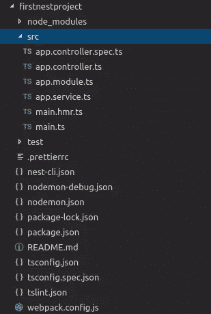
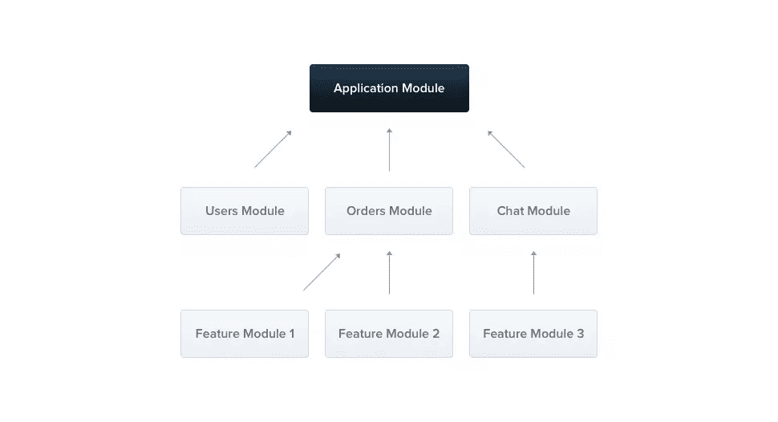
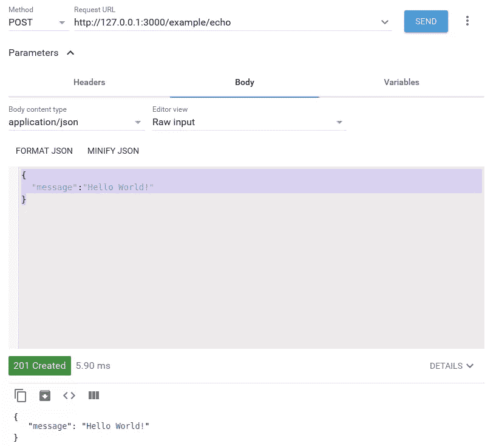

# 面向 Angular 开发者的 Nest.js 简介

> 原文：<https://www.sitepoint.com/introduction-to-nest-js-for-angular-developers/>

在这篇文章中，我们将为 Angular 开发者介绍 Nest.js。Nest.js 对这个群体来说特别有趣，因为它受到了 [Angular](https://www.sitepoint.com/premium/books/build-a-real-world-app-with-angular?utm_source=blog&utm_medium=articles) 的极大启发，并且是为 [TypeScript](https://www.sitepoint.com/premium/courses/setting-up-and-kick-starting-typescript-2933?utm_source=blog&utm_medium=articles) 构建的。那么 Nest.js 是什么？

Nest.js 是一个开源的 MIT 许可的渐进式节点框架，用 TypeScript 编写，与 Angular 共享许多概念。它面向服务器端，可用于为企业构建高效、可靠和可伸缩的 web 应用程序。它是由 Kamil Mysliwiec 建造的。

Nest.js 结合了[面向对象编程](https://en.wikipedia.org/wiki/Object-oriented_programming)、[函数式编程](https://en.wikipedia.org/wiki/Functional_programming)和[函数式反应编程](https://en.wikipedia.org/wiki/Functional_reactive_programming)的最佳概念。

Nest.js 有很多特性，比如:

*   可扩展性:由于其模块化架构，Nest 允许您在项目中使用其他现有的库。
*   体系结构:Nest 有一个项目的体系结构，它提供了毫不费力的可测试性、可伸缩性和可维护性。
*   多功能性:Nest 为构建各种服务器端应用程序提供了一个生态系统。
*   进步性:Nest 利用最新的 JavaScript 特性，在软件开发中实现成熟的解决方案和设计模式。

由于它利用了 TypeScript 和 Angular 的基本概念，Angular 开发人员可以很快学会它，并且能够为他们的 Angular 应用程序创建后端，而无需求助于其他服务器端框架。

在幕后，Nest.js 利用了 Node.js 开发者已经使用了很长时间的现有的、成熟的库，比如 Express.js 和 TypeORM。

[Express](https://expressjs.com/) 是一个用于 [Node.js](https://nodejs.org/en/) 的快速、非个人化、极简的 web 框架，它提供了许多 HTTP 实用程序，可以轻松快速地构建健壮的 REST APIs。对于 [TypeORM](https://typeorm.io/#/) ，它是类型脚本语言和现代 JavaScript 最成熟的 ORM ( [对象关系映射器](https://en.wikipedia.org/wiki/Object-relational_mapping))。它支持活动记录和数据映射模式，允许您在最流行的现有数据库系统(如 MySQL、PostgreSQL 和 Oracle)上构建高质量、松散耦合、可伸缩和可维护的应用程序。

## 先决条件

要开始使用 Nest.js，您需要一些先决条件。因为本入门教程假设您是 Angular 开发人员，所以您可能已经具备了所有这些:

*   Node.js 和 NPM 安装在您的系统上。您可以从[官方网站](https://nodejs.org/en/download/)安装这两个软件，或者按照您的系统文档获取说明。
*   熟悉打字稿或有工作经验。作为 Angular 开发人员，您已经使用过 TypeScript，因为 Angular 是基于 TypeScript 的。

## 正在安装 Nest CLI

Nest CLI 是一个命令行界面实用程序，允许您使用基本文件和必要的依赖项快速生成项目。它还允许您搭建各种构件，如组件和模块，为开发中的应用程序提供服务，并构建最终的生产就绪应用程序。Nest CLI 基于 [Angular Devkit](https://github.com/angular/devkit) 包，使用 [nodemon](https://nodemon.io/) 来观察文件变化。

让我们从安装 Nest CLI 开始。打开一个新终端并运行以下命令:

```
npm install -g @nestjs/cli 
```

> 请注意，在基于 Debian 的系统或 macOS 中，您可能需要在命令前添加 sudo，或者在 Windows 中使用管理员 CMD 提示符。如果你想在你的系统上全局安装软件包而不是超级用户，你需要[修改你的 npm 权限](https://docs.npmjs.com/resolving-eacces-permissions-errors-when-installing-packages-globally)。

安装 CLI 后，您可以使用它快速生成 Nest.js 项目并使用它们。

## 生成您的第一个嵌套项目

安装完 CLI 后，让我们生成第一个项目。回到您的终端，运行以下命令:

```
nest new firstnestproject 
```

CLI 将要求您提供有关项目的一些信息，例如描述、版本和作者。您可以提交这些详细信息，或者将其留空，然后点击**输入**。

CLI 将创建一组文件和文件夹，然后提示您选择要在项目中使用的包管理器。您可以选择 npm 或 yarn，但出于本教程的目的，我们将继续使用 npm。

成功安装所需的依赖项后，您可以导航到项目的根文件夹，并运行以下命令来启动一个基于 nodemon 的实时重载开发服务器:

```
npm run start:dev 
```

您可以使用您的 web 浏览器导航到`http://127.0.0.1:3000/`，您的 Nest 服务器正在此监听。你应该能看到一个带有 **Hello World 的页面！**。

您可以让这个服务器继续运行，并为我们将在本教程中运行的其他命令启动一个新的终端。

## 项目结构

我们生成的 Nest.js 项目有一个预定义的结构，其中包含可测试性、可伸缩性和可维护性的最佳实践。让我们更详细地看看。

这是项目结构的屏幕截图:



该项目有一个`node_modules`文件夹和一个`package.json`文件，这是每个 Node.js 项目所必需的。它还具有:

*   用于配置类型脚本的 [`tsconfig.json`文件](https://www.typescriptlang.org/docs/handbook/tsconfig-json.html)
*   nodemon 配置的`nodemon.json`文件
*   一个用于打字稿林挺的`tslint.json`文件
*   CLI 配置的`nest-cli.json`
*   一个包含项目实际代码的`src/`文件夹
*   包含测试的`test/`文件夹。

## 创建嵌套模块

Nest.js 项目具有模块化架构。这是来自[维基百科](https://en.wikipedia.org/wiki/Modular_programming)的模块化编程定义:

> 模块化编程是一种软件设计技术，它强调将程序的功能分成独立的、可互换的**模块**，这样每个模块都包含执行所需功能的一个方面所需的一切。

在 Nest.js 中，您可以创建一个模块作为用`@Module()` decorator 注释的 TypeScript 类，它提供了将用于组织应用程序结构的元数据。

这是来自官方 Nest.js 网站的一张图片，展示了如何在示例应用中构建模块:



> 每个 Nest.js 应用程序至少有一个模块，称为**根**模块。

您可以使用带有`nest generate module`命令的 CLI 创建模块。让我们在项目中创建一个模块。回到您的终端，确保导航到项目的根文件夹，并运行以下命令:

```
nest generate module example 
```

这将生成`src/example/example.module.ts`文件，并将更新`src/app.module.ts`文件以包含新创建的模块。

如果我们打开模块文件，我们将获得基本嵌套模块的以下内容:

```
import { Module } from '@nestjs/common';

@Module({})
export class ExampleModule {} 
```

这是一个简单的 TypeScript 类，用`@nestjs/common`包中的`@Module()`装饰器进行了装饰。

现在，如果您打开`src/app.module.ts`文件中的主应用程序模块，您应该会看到导入的模块:

```
import { Module } from '@nestjs/common';
import { AppController } from './app.controller';
import { AppService } from './app.service';
import { ExampleModule } from './example/example.module';

@Module({
  imports: [ExampleModule],
  controllers: [AppController],
  providers: [AppService],
})
export class AppModule {} 
```

`ExampleModule`从`./example/example.module`路径导入并添加到`imports`数组。

## 创建嵌套控制器

在 Nest.js 中，控制器用于处理传入的 HTTP 请求并返回响应。它们被映射到路线。

您可以通过定义一个 TypeScript 类并使用`@Controller()`装饰器来创建一个控制器。

在您的终端中，运行以下命令来生成控制器:

```
nest generate controller example/example 
```

我们创建了一个名为`example`的控制器，并在名称前面加上了`example/`路径，这指示 CLI 将这个控制器作为我们之前创建的`example`模块的一部分。

打开`src/example/example/example.controller.ts`文件，你应该会看到下面的代码:

```
import { Controller } from '@nestjs/common';

@Controller('example')
export class ExampleController {} 
```

如果你打开`src/example/example.module.ts`文件，你会看到控制器被导入并包含在`example`模块的`imports`数组中:

```
import { Module } from '@nestjs/common';
import { ExampleController } from './example/example.controller';

@Module({
  imports: [ExampleModule],
  controllers: [ExampleController]
})
export class ExampleModule {} 
```

让我们回到我们的`example`控制器，创建一些路线。重新打开`src/example/example/example.controller.ts`文件并添加以下导入:

```
import { Get, Post, Body } from  '@nestjs/common'; 
```

接下来，添加一个`index()`方法:

```
 @Get()
    index() {
      return "Example Controller!";
    } 
```

我们用`@Get()`装饰器装饰该方法，以创建一个接受 GET 请求的路由，并用**示例控制器返回一个响应！**正文。我们可以从`127.0.0.1:3000/example` URL 访问这条路径。您应该会看到一个空白页面，上面有**示例控制器！**正文。

接下来，让我们添加一个接受 POST 请求的路由。添加以下方法:

```
 @Post('echo')
    echo(@Body() data): any {
        return data;
    } 
```

我们创建一个`example/echo`路由，它将接收一个 JSON 对象并将其返回。我们使用`@Body()`装饰器从响应中提取主体。使用 REST API 客户端(cURL 或 Postman 等。)，您可以将带有一些数据的 POST 请求发送到`127.0.0.1:3000/example/echo` URL 并取回数据。这里有一个例子:



## 结论

在本文中，我们为 Angular 开发人员介绍了 Nest.js 框架。我们还看到了如何安装 Nest CLI，并使用它来创建一个示例项目和各种工件，如模块和控制器。关于其他概念的更深入的细节，你可以阅读[官方文件](https://docs.nestjs.com/)。

## 分享这篇文章