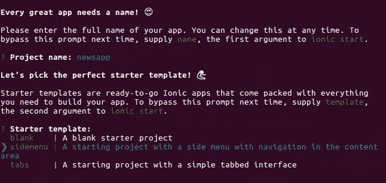
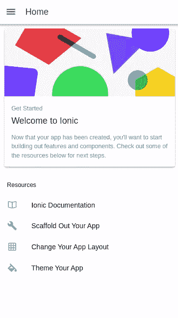
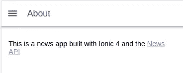
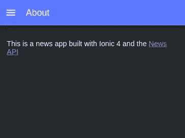
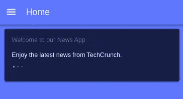
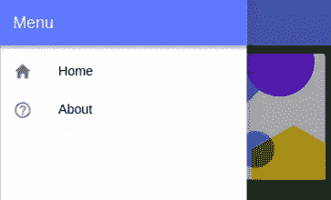
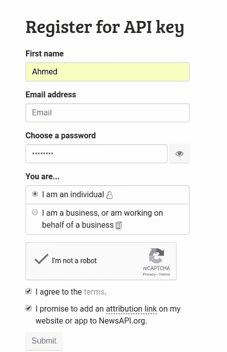
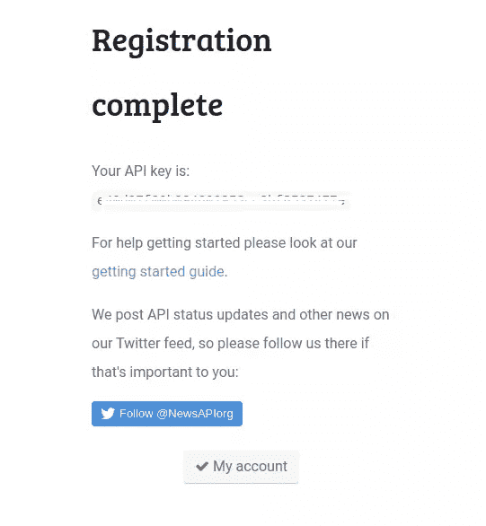

# 如何用 Ionic 4 & Angular 构建新闻 App

> 原文：<https://www.sitepoint.com/ionic-4-angular-build-app/>

在本教程中，我们将使用 Ionic 4 来构建一个新闻应用程序，它利用了第三方新闻 API 。

Ionic 4 是 Ionic 的最新版本，这是一个最初基于 Cordova 和 Angular 构建的移动框架。Ionic 允许用户使用 HTML、CSS 和 JavaScript 及其相关的 web 技术创建混合移动应用。

Ionic 4 之所以是最好的版本，是因为它现在是框架不可知的。这意味着它不再依赖 Angular，你可以将它用于任何你熟悉的框架或库，或者普通的 JavaScript。

但是在撰写本文时，Ionic CLI 只支持基于 Angular 生成 Ionic 项目，所以我们将使用 Angular/Ionic 项目来构建我们的新闻应用程序。

查看我们将要构建的应用程序的托管版本，并从这个 [GitHub 库获取源代码。](https://github.com/techiediaries/ionic-news-app)

## 先决条件

让我们从能够轻松地学习本教程所需的先决条件开始。

*   您需要在开发机器上安装 Node.js 和 npm。如果不是这样，最简单的方法就是去[官方网站](https://www.nodejs.org)为你的系统下载二进制文件。Node.js 不是 Ionic 本身的要求，而是 Ionic CLI(以及幕后的 Angular CLI)的要求，它是我们将用来生成 Ionic 项目的工具。
*   我们将在 Angular 中使用 Ionic，它基于 TypeScript，所以您需要熟悉 TypeScript 的基本概念。

## 安装 Ionic CLI 4

Ionic CLI 4 是 CLI 的最新版本。打开一个终端，运行以下命令将其安装到您的系统上:

```
$ npm install -g @ionic/cli 
```

请注意，如果您使用的是基于 Debian 的系统或 macOS，您可能需要在命令前添加`sudo`来全局安装包。对于 Windows，如果您遇到任何权限错误，您可以使用具有管理员访问权限的命令提示符。在所有系统中，您可以通过使用节点版本管理器重新安装 npm(推荐)或手动更改 npm 的默认目录来避免 npm 权限错误。参见[文档](https://docs.npmjs.com/resolving-eacces-permissions-errors-when-installing-packages-globally)。

接下来，您可以通过运行以下命令来生成基于 Angular 的项目:

```
$ ionic start 
```

CLI 将交互地询问您项目的必要信息，例如**名称**(输入**新闻应用**或您喜欢的任何名称)和启动模板(选择**侧菜单**，这将为您提供一个带有侧菜单和框导航的启动项目)。

接下来，按下**键，输入**,指示 CLI 开始生成文件并从 npm 安装依赖项。



最后，CLI 将询问您是否要**安装免费的 Ionic Appflow SDK 并连接您的应用程序？【是/否】T1。如果你不想整合 Ionic 提供的云服务，你可以输入 **n** 。**

Appflow 是一个面向 Ionic 开发者的持续集成和部署平台。Appflow 帮助开发人员以前所未有的速度不断构建和发布他们的 iOS、Android 和 web 应用。你可以从[官方文档](https://ionicframework.com/docs/appflow/)中找到更多关于 Appflow 的信息。

接下来，您可以导航到项目的根文件夹，并运行以下命令来启动一个实时重新加载的开发服务器:

```
$ cd ./newsapp
$ ionic serve 
```

您的申请可从`http://localhost:8100`地址获得。

这是此时应用程序的屏幕截图:



您可以看到，我们已经有了一个相当不错的初始应用程序，还没有进行任何开发。让我们对我们的项目做一些改变。

这个项目已经有了两个页面——**主页**和**列表**。离开第一页，删除**列表**页面。

首先，移除`src/app/list`文件夹。接下来，打开`src/app/app-routing.module.ts`文件并删除列表页面的 route 条目:

```
const routes: Routes = [
  {
    path: '',
    redirectTo: 'home',
    pathMatch: 'full'
  },
  {
    path: 'home',
    loadChildren: './home/home.module#HomePageModule'
  },
  {
    path: 'list',
    loadChildren: './list/list.module#ListPageModule'
  }
]; 
```

我们有三个路由，一个是重定向到`/home`路由的空路径，一个是显示主页的`/home`路由，一个是显示列表页面的`/list`路由。你只需要移除最后一个对象。

您还需要从侧边菜单中删除列表页面的链接。打开`src/app/app.component.ts`文件。找到组件中定义的 appPages 数组:

```
 public appPages = [
    {
      title: 'Home',
      url: '/home',
      icon: 'home'
    },
    {
      title: 'List',
      url: '/list',
      icon: 'list'
    }
  ]; 
```

然后简单的移除第二个对象:`{ title: 'List', url: '/list', icon: 'list'}`。

现在，让我们为我们的应用程序创建一个 about 页面。在您的终端中，运行以下命令:

```
$ ionic generate page about 
```

该命令将生成一个包含一堆文件的`src/app/about`文件夹，并将更新`src/app/app-routing.module.ts`文件以包含所生成页面的路径:

```
import { NgModule } from '@angular/core';
import { Routes, RouterModule } from '@angular/router';

const routes: Routes = [
  {
    path: '',
    redirectTo: 'home',
    pathMatch: 'full'
  },
  {
    path: 'home',
    loadChildren: './home/home.module#HomePageModule'
  },
  { path: 'about', loadChildren: './about/about.module#AboutPageModule' }
];

@NgModule({
  imports: [RouterModule.forRoot(routes)],
  exports: [RouterModule]
})
export class AppRoutingModule {} 
```

让我们在侧边菜单中添加一个关于页面的链接。打开`src/app/app.component.ts`文件并更新`appPages`数组:

```
 public appPages = [
    {
      title: 'Home',
      url: '/home',
      icon: 'home'
    },
    {
      title: 'About',
      url: '/about',
      icon: 'help-circle-outline'
    }
  ]; 
```

这是此时菜单的屏幕截图:


接下来，打开`src/app/about/about.page.html`并在页面的工具栏上添加一个菜单图标，这允许用户打开侧菜单:

```
<ion-header>
  <ion-toolbar>
    <ion-buttons slot="start">
      <ion-menu-button></ion-menu-button>
    </ion-buttons>
    <ion-title>
      About
    </ion-title>
  </ion-toolbar>
</ion-header>

<ion-content padding>

</ion-content> 
```



现在让我们给我们的应用程序 UI 添加一些主题。

打开`src/app/about/about.page.html`，给菜单工具栏添加一种原色，给内容部分添加一种深色:

```
<ion-header>
  <ion-toolbar color="primary">
    <ion-buttons slot="start">
      <ion-menu-button></ion-menu-button>
    </ion-buttons>
    <ion-title>
      About
    </ion-title>
  </ion-toolbar>
</ion-header>

<ion-content color="dark" padding>
<p>
  This is a news app built with Ionic 4 and the <a href="https://newsapi.org/">News API</a>
</p>
</ion-content> 
```

这是该页面的屏幕截图:



接下来，让我们为主页设置主题。打开`src/app/home/home.page.html`文件，并用以下内容替换其内容:

```
<ion-header>
  <ion-toolbar color="primary">
    <ion-buttons slot="start">
      <ion-menu-button></ion-menu-button>
    </ion-buttons>
    <ion-title>
      Home
    </ion-title>
  </ion-toolbar>
</ion-header>

<ion-content color="primary">
    <ion-card>
      <ion-card-header>
        <ion-card-subtitle>Welcome to our News App</ion-card-subtitle>
      </ion-card-header>
      <ion-card-content>
        <p>
          Enjoy the latest news from TechCrunch. 
        </p>
        <ion-spinner *ngIf="!articles"  name="dots"></ion-spinner>
      </ion-card-content>
    </ion-card>
</ion-content> 
```

接下来，打开`src/app/home/home.page.scss`文件并添加:

```
ion-card{
  --background: #021b46;
  --color: #fff;
} 
```



此外，打开`src/app/app.component.html`文件，向菜单工具栏添加一种原色:

```
 <ion-toolbar color="primary">
          <ion-title>Menu</ion-title>
        </ion-toolbar> 
```



## 获取新闻数据

现在让我们看看如何从第三方新闻 API 中检索新闻数据，该 API 可从[NewsAPI.org/](https://newsapi.org/)获得，它为开源和开发项目提供了一个免费计划。

您首先需要前往[这里](https://newsapi.org/register)注册一个 API 密钥:



填写表格并提交。您应该被重定向到可以复制 API 密钥的页面:



## 添加服务

接下来，让我们创建一个从新闻 API 获取数据的服务。在您的终端中，运行以下命令:

```
$ ionic generate service api 
```

接下来，打开`src/app/app.module.ts`文件，然后导入`HttpClientModule`并将其添加到`imports`数组中:

```
// [...]
import { HttpClientModule } from '@angular/common/http';

@NgModule({
  declarations: [AppComponent],
  entryComponents: [],
  imports: [
    // [...]
    HttpClientModule,
  ],
  // [...]
})
export class AppModule {} 
```

接下来，打开`src/app/api.service.ts`文件并通过服务构造函数注入`HttpClient`:

```
import { Injectable } from '@angular/core';
import { HttpClient } from '@angular/common/http';

@Injectable({
  providedIn: 'root'
})
export class ApiService {

  constructor(private httpClient: HttpClient) { }
} 
```

接下来，定义一个`API_KEY`变量，它将保存来自新闻 API 的 API 键:

```
export class ApiService {
  API_KEY = 'YOUR_API_KEY'; 
```

最后，添加一个向 TechCrunch 新闻的端点发送 GET 请求的方法:

```
 getNews(){
    return this.httpClient.get(`https://newsapi.org/v2/top-headlines?sources=techcrunch&apiKey=${this.API_KEY}`);
  } 
```

这就是我们需要为服务添加的所有内容。

打开`src/app/home/home.page.ts`文件，通过组件构造器导入，然后注入`ApiService`:

```
import { Component } from '@angular/core';
import { ApiService } from '../api.service';

@Component({
  selector: 'app-home',
  templateUrl: 'home.page.html',
  styleUrls: ['home.page.scss'],
})
export class HomePage {
  constructor(private apiService: ApiService){}
} 
```

接下来，添加一个 articles 变量来保存检索到的新闻:

```
export class HomePage {
  articles; 
```

添加一个`ionViewDidEnter()`方法，调用`ApiService`的`getNews()`方法来检索新闻:

```
 ionViewDidEnter(){

    this.apiService.getNews().subscribe((data)=>{
      console.log(data);
      this.articles = data['articles'];
    });
  } 
```

最后，让我们遍历 articles 变量并在主页上显示新闻。

再次打开`src/app/home/home.page.html`文件并添加以下代码:

```
 <ion-card *ngFor="let article of articles">
    <ion-img src="{{article.urlToImage}}"></ion-img>
    <ion-card-header>
      <ion-card-subtitle>{{article.title}}</ion-card-subtitle>
    </ion-card-header>
    <ion-card-content>
      <p>
        {{article.description}}
      </p>
      <ion-button ion-button fill="outline" href="{{article.url}}" large>Read full article</ion-button>

    </ion-card-content>
  </ion-card> 
```

我们简单地使用`ngFor`指令循环遍历`articles`变量，并显示卡片组件中每篇文章的图像、标题、描述和 URL。

这是结果的截图:


你可以在网上托管这个应用程序(作为 PWA ),或者构建它并[在应用商店](https://ionicframework.com/docs/v1/guide/publishing.html)上发布它。你可以从这个[链接](https://www.techiediaries.com/ionic-news-app)和这个 [GitHub 库](https://github.com/techiediaries/ionic-news-app)的源代码中找到一个实况版本。

## 结论

我们用 Ionic 4 和 Angular 从头开始构建了一个新闻应用程序。该应用程序仍然有很大的改进空间，所以可以随意使用它并自行扩展。例如，您可以添加 TechCrunch 以外的来源，并允许用户选择新闻来源。

## 分享这篇文章