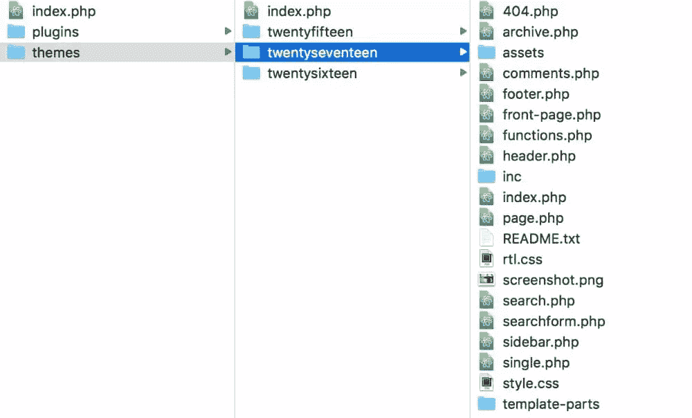
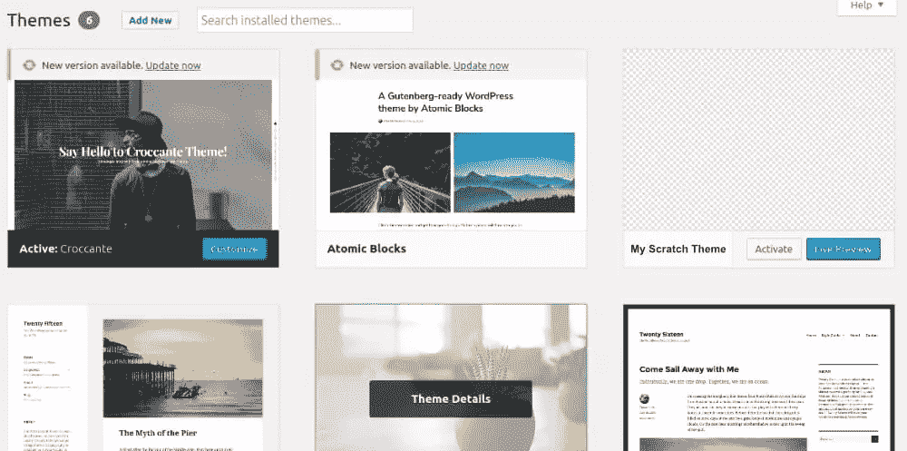
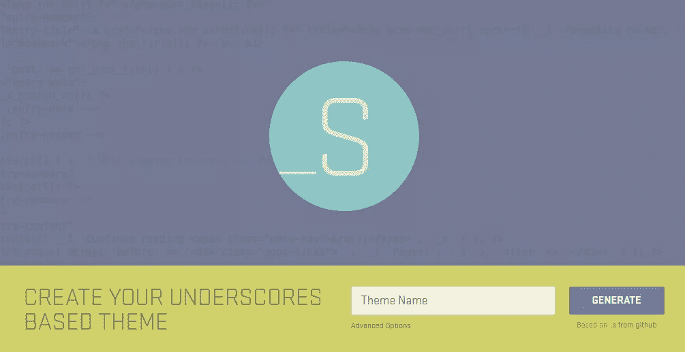
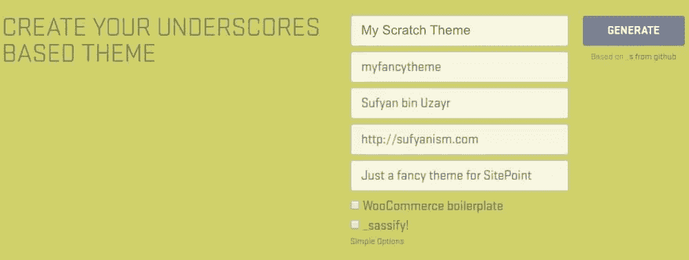
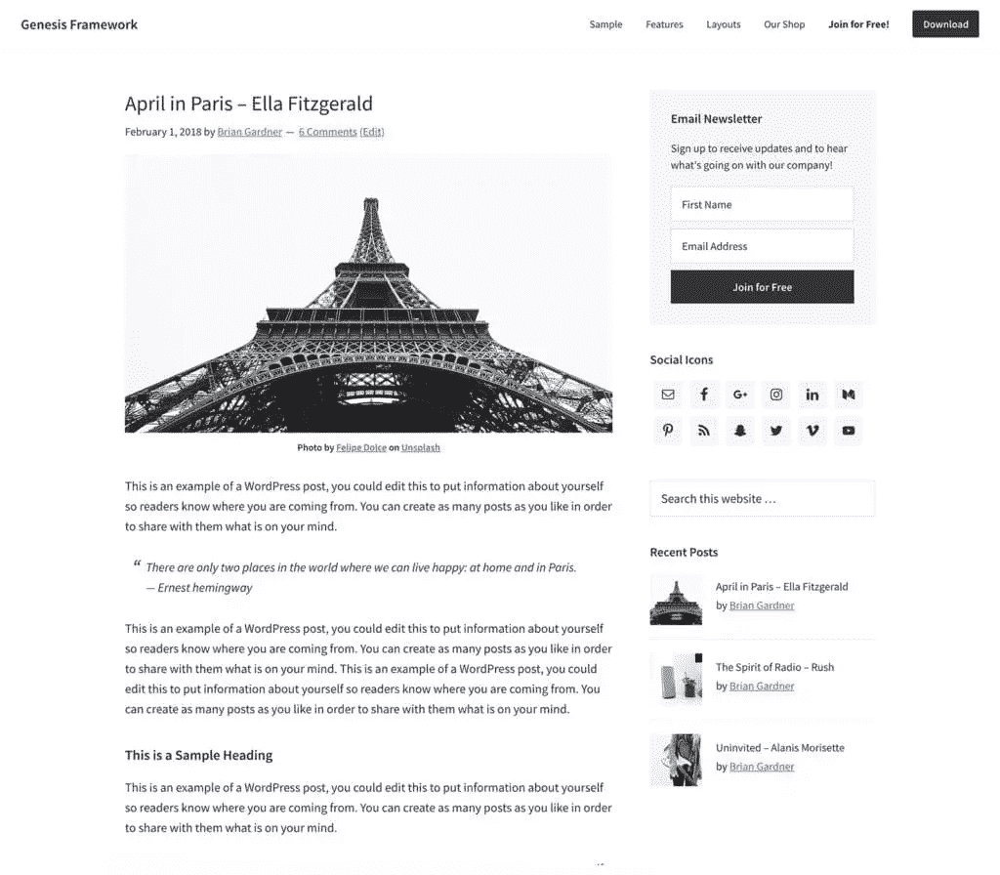

# 创建你自己的 WordPress 主题的三种方法

> 原文：<https://www.sitepoint.com/creating-wordpress-themes-overview/>

WordPress 用户选择一个现成的主题是很常见的。但是你也可以创造一个你自己的主题。本文涵盖了实现这一目标的各种方法。

选项范围从对现有主题进行编辑，到完全从头开始创建你自己的 WordPress 主题。介于这两个极端之间的是各种其他选项，包括复制和修改主题，以及使用一系列工具来帮助您构建自己的主题。

WordPress 主题由一系列文件组成，所有文件都包含在一个文件夹中，这个文件夹位于`/themes/`文件夹:`wp-content/themes/`中。



## 选项 1:修改现有主题

修改现有的主题可能是最简单的选择。你可能只是想做一些小的改变，比如颜色，字体大小，或者简单的布局改变。

在这种情况下，你最好的选择是创建一个[子主题](https://codex.wordpress.org/Child_Themes)。一个子主题引用了一个已存在的主题，只是修改了你想要改变的部分。使用子主题的好处是，如果当你更新 WordPress 时父主题被更新，你的改变不会被清除。

要创建子主题，请在您的`/themes/`文件夹中创建一个新文件夹。一个方便的技巧是在父主题的名称后面加上`-child`,这样可以清楚地看出子主题是什么。所以，如果你正在创建一个 2017 主题的子主题，你的子主题文件夹可能会被命名为`/twentyseventeen-child/`。


在这个子文件夹中，您至少需要一个`style.css`文件和一个`functions.php`文件。在这些文件中，你需要添加一些代码来告诉 WordPress 哪个是父主题，样式表在哪里，以及你想在你的子主题中添加的任何新功能。

让你的孩子主题运行起来的最后一步是进入 WordPress 管理面板，进入*外观>主题*来激活你的孩子主题。

关于这个过程的完整指南，请访问。为了帮助设置一个子主题，你也可以使用 WordPress [子主题配置器](https://wordpress.org/plugins/child-theme-configurator/)工具。

## 选项 2:改编现有主题

如果你热衷于深入研究 WordPress 的代码，你可以复制一个现有的主题，并根据你的意愿进行修改。

这可能包括删除所有当前的样式并创建自己的样式。您还可以深入研究其他主题文件，删除不需要的元素并添加其他元素。例如，您可能想要改变主题的 HTML 结构。为此，您需要打开各种文件，如`header.php`、`index.php`和`footer.php`，并用您自己的模板元素更新 HTML 部件。


在此过程中，您可能会发现复制的主题中有许多您不再需要的功能，例如帖子评论和各种侧边栏元素，如类别和书签。您可以在各种主题文件中找到这些元素的 PHP 代码片段，您可以简单地删除它们或将它们移到其他位置。

这可能需要一点搜索来找出哪些文件包含了你想要删除或移动的元素，但是这是一个熟悉你的 WordPress 主题的好方法来像这样挖掘文件。

这里的另一个选择，而不是复制一个现有的主题，是从一个“开始主题”开始，我们将在下面看到。

## 选项 3:从头开始构建主题

一个更令人畏惧的选择——但也更有趣！—就是完全从零开始创建自己的主题。这实际上比听起来简单，因为至少你只需要两个文件— `style.css`和`index.php`。


然而，这将导致一个非常有限的主题！至少，您可能需要一个用于自定义功能的`functions.php`文件，以及用于站点各个部分的其他几个模板文件，比如用于显示 404 页的 404.php 模板文件。

在这个例子中，我们在主题目录中创建了一个名为`/scratch-theme/`的文件夹。(当然，你会想选一个比这更好的名字。)文件将作为 WordPress 主题的主样式表。在这个 CSS 文件中，我们首先需要添加一些标题文本。这是一个基本的例子:

```
/*
Theme Name: My Scratch Theme
Theme URI: https://sitepoint.com
Author: Sufyan bin Uzayr
Author URI: http://sufyanism.com
Description: Just a fancy starter theme for SitePoint
Version: 1
License: GNU General Public License v2 or later
License URI: http://www.gnu.org/licenses/gpl-2.0.html
Tags: clean, starter
*/ 
```

你现在可以去 WordPress 管理*主题*部分，在那里我们会看到我们现在的主题列表。



此时，它不提供任何定制的样式和布局，但仍然可以被激活和使用。(你可以上传一个名为“截图”的图片文件到主题的根文件夹，最好是 880 x 660px，为主题添加缩略图。)

关于 WordPress 主题开发的更深入的指导，请查看 [WordPress Codex 主题开发指南](https://codex.wordpress.org/Theme_Development)。

从头开始创建一个非常基本的 WordPress 主题是相当简单的，但是超越它就更有挑战性了。在决定这是否超出你的能力范围之前，让我们看看一些可以帮助你的工具。

## 使用起始主题

starter 主题是一个基本的或者空白的 WordPress 主题，只包括最基本的结构代码。这意味着一个 starter WordPress 主题有一些基本的功能，但不提供任何定制或调整。这是一个非常方便的建立你独特主题的起点。

当选择开发的起始主题时，有几种选择，其中最流行的是[下划线](http://underscores.me/)。它由 WordPress 的创建者 Automattic 维护，并且是 WordPress 最近发布的默认主题的基础。



其他选项包括由 ZURB 维护的 [FoundationPress](https://foundationpress.org/) 。


Bones 是另一个简单易懂的准系统 WordPress 主题，可以作为主题开发的一个很好的起点。
[HTML5 Blank](http://html5blank.com/) 是另一个选项，它为主题开发提供了一个可靠的、有据可查的代码基础。

### 在主题开发中使用下划线

要开始使用下划线，请在下划线主页上输入您的主题详细信息。



您也可以选择包含 WooCommerce 样板文件——如果目标主题可能支持 WooCommerce，例如购物车和结账页面的自定义布局等，这将非常有用。点击*生成*，就这样！我们的主题将生成并可供下载。在生成的 ZIP 文件中，我们可以找到我们的主题目录。

下划线生成的 WordPress 主题有相当多的模板，以及用于自定义布局和 JavaScript 元素的单独部分。这意味着我们的主题结构已经准备好了，模板文件也是如此，它们以 PHP 标签和注释的形式提供了最少的代码。我们可以直接开始，修改我们需要的东西，去掉我们不需要的东西。

这显然节省了大量时间，因为我们不需要手动创建每个模板文件。

## 使用 WordPress 主题框架

与 CSS、JavaScript 和 PHP 的框架类似，主题框架提供了一套标准化的工具，作为开发人员，您可以使用这些工具来创建自己的主题。主题框架带有预定义的约定，通过节省编码和构建这些约定所花费的时间和精力，可以帮助主题开发。

如今，许多 WordPress 主题框架都有如下特性:

*   定制挂钩和过滤器
*   主题中使用的自定义函数
*   自定义回拨
*   与定制库(如 jQuery 等)的集成或兼容性。

这些 WordPress 主题框架本身也有一些额外的优势。很明显，它们使构建 WordPress 主题的任务变得更快更容易。有些还提供定制的特性和编码规范，可以让新开发人员快速编码并更有效地掌握诀窍。当然，这也意味着你比从零开始构建一个主题时有更少的控制，但是根据你的需求和专业水平，一个初学者友好的主题框架可以被证明是有用的。

### 挑选一个 WordPress 主题框架

有相当多的 WordPress 主题框架可供选择。一个流行的选择是 StudioPress 的[创世纪框架](https://my.studiopress.com/themes/genesis/)。Genesis 售价 59.95 美元，具有定制页面模板、多种可定制布局选项以及对即将推出的 WordPress 编辑器 Gutenberg 的完全支持等功能。



另一个有价值的高级选项是优雅主题的 [Divi 主题](https://www.elegantthemes.com/gallery/divi/)。Divi 加载了实时设计元素、可定制的布局和页面模板、可拖动和可视编辑的资源等。换句话说，Divi 是一个伪装成主题框架的页面生成器，可以让你导出你的开发设置，并快速组合网站。

如果你在寻找免费的东西，那么 [Gantry](http://gantry.org/) 非常值得一看。这个开发人员友好且健壮的主题框架并不仅仅用于 WordPress。由 RocketTheme 构建的 Gantry 更像是从 Joomla、WordPress 和 GravCMS 等公司采用的定制扩展和模板方法的集合体。

[https://www.youtube.com/embed/H0RCz-ziJoo?rel=0](https://www.youtube.com/embed/H0RCz-ziJoo?rel=0)

<br>

Gantry 允许编码人员在其上构建强大的前端主题和模板。它也有许多定制的预制模板和皮肤，以及可视化的可编辑界面，让非编码人员的生活更轻松。

在这个领域有很多其他有价值的竞争者，你可以在网上搜索“WordPress 主题构建器”或类似的东西。

## 结论

这篇文章简要介绍了修改或创建你自己的 WordPress 主题的选项。我们从创建一个子主题的最简单的选项开始，它只包含一些修改现有主题的文件。

接下来，我们通过复制和修改一个现有的主题来进行更深入的研究。这是一个挖掘 WordPress 主题的有趣方式，学习它是如何工作的，并根据你的确切需求进行定制，而不必重新发明轮子，从头开始。

一个更大胆的选择是从头开始编写整个主题。我们在这里仅仅触及了这一点，但是我们已经准备了一系列文章来深入展示如何做到这一点。

作为一种快速从头开始构建主题的方法，我们研究了下划线这样的起始主题和创世纪这样的主题框架。在某种意义上，这给我们带来了一个完整的循环，因为其中一些提供了拖放/所见即所得工具，不需要太多的技术知识，如果您不想钻研代码，这可能是最用户友好的选择。

希望这个简短的介绍能让你更好地理解如何开始创建一个符合你需求的 WordPress 主题。

## 分享这篇文章