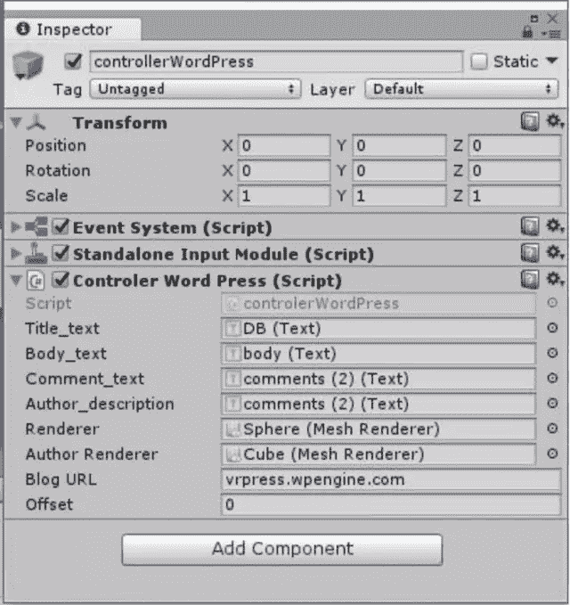
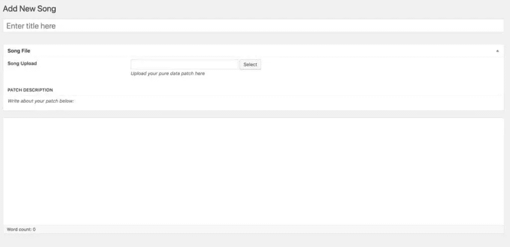

# 为扩展现实(XR)未来准备您的内容

> 原文：<https://www.sitepoint.com/extended-reality-preparing-content/>

*这篇关于为扩展现实(XR)未来做准备的文章[最初由 Torque 杂志](https://torquemag.io/2018/04/preparing-your-content-for-the-extended-reality-xr-future/)发表，经允许在此转载。*

你可能听说过科技行业关于虚拟现实、增强现实和混合现实的创新。这些媒介可以广义地定义为扩展现实或 XR。

我第一次涉足 XR 开发是在 2010 年，当时我正在探索 Flash 开发。我的申请很简单；向网络摄像头显示快速响应(QR)码，该程序会将 3D 模型叠加到标记上。事后看来，这是一个改变我一生的时刻。这是我第一次操作数字 3D 物体，也是我第一次通过网络进行增强现实体验。

在未来几年，随着我们开始融合物理和数字自我之间的界限，屏幕的概念可能会成为一种事后想法。我们很可能会被我们环境的个性化版本所包围，所有这些个性化都将作为元数据存储在某个数据库中。对每个人来说，拥有控制这个元的能力是至关重要的，我很乐观 WordPress 会在这方面有一席之地，因为这是它真正闪耀的地方。WordPress 允许你做内容管理中所有困难的事情，而不需要知道它是如何工作的。我不需要知道如何从头开始建立一个用户系统…我可以直接使用 WordPress。

内容和元将会是我们生活中的一个常量，在我看来，WordPress 已经在未来与 REST API 的结合中获得了一个非常好的位置。任何可以发出 HTTP 请求的东西现在都可以从 WordPress 获取数据，并基于这些数据做出明智的决定。随着 GraphQL 等不同概念的发展，这种方法的结构可能会在未来几年发生变化，但总的来说，对于 WordPress 来说，restful 数据处理方式的需求可能会保持不变。

## 一个 MVP WordPress 在 XR 中会是什么样子？

去年，我试图建立一个最小可行的 VR WordPress，仅仅使用我们在一个标准 WordPress 实例中可用的特性。我使用 Unity3D 作为我的原型，因为它是最低的入门门槛(免费)。这个原型的想法很简单；使用帖子数据来填充 VR 世界中的 UI 元素，并将帖子的特色 360°图像用作用户周围的天空盒。我想象的用例是一个模拟旅游博客。

这看起来是这样的:

<video class="wp-video-shortcode" id="video-169663-1" width="716" height="402" preload="metadata" controls=""><source type="video/mp4" src="https://uploads.sitepoint.com/wp-content/uploads/2018/10/1539909478mars.mp4?_=1">[https://uploads.sitepoint.com/wp-content/uploads/2018/10/1539909478mars.mp4](https://uploads.sitepoint.com/wp-content/uploads/2018/10/1539909478mars.mp4)</video>

以下是数据流和必要条件:



这真的不是一个太粗糙的概念。我们使用 WWW 函数通过 C#进行 REST 调用。我们将从 WordPress 返回的数据保存到一个变量中，Unity Dev 将使用简单的拖放编辑器工具分配这个变量。Unity 获取已定义的 UI 元素，并将存储在变量中的文本应用于它们映射的文本对象。

我已经在回购后的[开源了这个项目。(注:这是去年在一次为期两天的黑客马拉松中完成的。这与生产就绪代码相差甚远。)](https://github.com/anthonyburchell/VR-WordPress/)

## C#是如何解析 JSON 的

值得一提的是，REST API 返回 JSON。JavaScript 名副其实，所以 C#中没有针对 JSON 的健壮的原生解析器也就不足为奇了。(你当然可以在 Unity 中使用 Javascript，我发现这个项目最好使用 C#。)我用来解析 JSON 的脚本叫做 [SimpleJSON](http://wiki.unity3d.com/index.php/SimpleJSON) 。虽然这可能看起来有点吓人，但在我花了 2 天时间构建这个项目之前，我对 C#了解甚少。通过阅读 SimpleJSON 示例，您可以很快看到发生了什么。让我们开始吧！

对于下面的代码，我们正在查看[资产文件夹](https://github.com/anthonyburchell/VR-WordPress/blob/master/Assets/controlerWordPress.cs0)中的`controllerWordPress.cs`脚本。

下面的协同程序`DownloadFile`被用作一种全局调用，用于其他被提供 REST 端点 URL 的协同程序使用的数据:

```
private IEnumerator DownloadFile(string url, System.Action<string> result)
   {
       AddToLog("Downloading " + url);

       WWW www = new WWW(url);

       yield return www;

       if (www.error != null)

       {

           AddToLog(www.error);

       }

       else

       {

           AddToLog("Downloaded " + www.bytesDownloaded + " bytes");

       }

       result(www.text);

   } 
```

然后我们有了`DownloadJsonFile`协程，它下载 json 并将其存储到 jsonString 对象中:

```
private IEnumerator DownloadJsonFile(string url)

   {

       jsonString = null;

       if (continueBody = true)

       {

           yield return StartCoroutine(DownloadFile(url, fileContents => jsonString = fileContents));

           Debug.Log(jsonString);

           jsonLogString = TruncateStringForEditor(jsonString);

           find_feat_image = true;

           find_comments = true;

           foundBody = true;

       }

   } 
```

`Start`函数调用上面 Unity editor 工具脚本定义的变量(见控制器 WordPress 截屏),并在程序初始化后立即启动`DownloadJsonFile`协程。请特别注意偏移值。如果我们想改变环境，我们可以简单地给变量加 1，并设置状态机监听何时转储数据并移动到下一个房间/post。好玩！

```
void Start() {

       StartCoroutine(DownloadJsonFile("http://" + blogURL + "/wp-json/wp/v2/posts?order=desc&per_page=1&offset=" + offset)).ToString();

       Renderer renderer = GetComponent<Renderer>();

   } 
```

在 update 函数中，我们检查条件是否为真，以便触发数据的重新呈现。有更好的设计模式来实现这一点。再说一次，这是 MVP，在黑客马拉松的这一点上，我已经远离了鲍尔默的巅峰，他让我找到了导航方面的东西。

```
void Update () {

       if (foundBody == true)

       {

           var jsonData = JSON.Parse(jsonString);

           jsonImageFinal = jsonData[0]["featured_media"];

           title_text.text = jsonData[0]["title"]["rendered"];

           body_text.text = stripHtml(jsonData[0]["content"]["rendered"]);

           postID = jsonData[0]["id"];

           authorUrl = jsonData[0]["_links"]["author"][0]["href"];

           foundBody = false;

           find_author = true;

       } 
```

有一些对 Gravitar 图像和作者信息的请求，但总的来说，这是我的 MVP VR WordPress 如何解析 JSON 数据的高级视图。您可以在最后一个代码块中看到，经过一点调整后，您开始发现事情看起来更像我们在 PHP/JS 领域中习惯使用的数据对象。这就是它强大的地方。

## 我们如何对此进行扩展？

这才是真正有趣的地方。有了 WordPress，你可以以任何你认为合适的方式构建你自己的定制元。这个元可以运行一大堆函数来决定要保存在数据库中的最终状态。使用该元，可以改变整个级别的变量，如着色器颜色或照明属性。也许只是布尔元决定了当特定用户进入房间时，XR 中会发生一些令人惊奇的事情。我有一个特别的项目，我想作为这个概念的 V2 来探索。想象一下，走进一个 3D 渲染版本的在线商店，用户可以在那里以实际尺寸实际挑选产品。这使得用户能够在一个物理空间中体验你的产品。为了增强体验，开发者可以附加一个看不见的碰撞盒来跟随玩家的脖子后面。如果用户在商店里看到他们喜欢的东西，他们可以简单地伸出脖子，与盒子碰撞到`add to cart`。有点像把它扔在你的背包里。🙂

让我们看一个已经在实践中的更真实的例子。我目前在做一个基于音乐的 VR 游戏，叫做[破碎之地](http://www.brokenplace.com/)。我用 WordPress 将歌曲文件放入玩家的本地游戏目录。这些歌曲文件是一种叫做纯数据的开源语言。我已经建立了我的 WordPress 站点来接受。pd MIME 类型，并创建了一个向 REST API 公开的“songs”自定义 post 类型。

下面来看看我的“歌曲”自定义帖子类型编辑器:



这让我可以在游戏中保持内容新鲜，而不必做版本或补丁发布。这确保了我的每一个用户都能获得相同的最新和最好的内容。这也打开了向站点添加用户来贡献内容的可能性，而不需要一些复杂的后端。我不是一个经验丰富的游戏开发者。我不可能从零开始建立一个用户系统。使用 WordPress，我可以精确地创建用户角色和功能。最终，我可以有一个允许用户跳转到他们自己的歌曲的登录屏幕，这是可行的。

在我游戏的当前状态下，我只是简单地调用那个 post 类型，并使用存储在 meta 中的 URL 提取文件。然后，游戏下载文件，将其存储在本地，并加载歌曲。你会从截图中注意到，这个游戏没有任何迹象表明它在使用 WordPress。神奇！


随着我们走向一个更加 XR 驱动的世界，我很高兴看到 WordPress 在其中的位置。我们消费内容的方式是不断变化的，但是有了像 WordPress 这样的平台，我们能够适应和创造如此多的新的和引人入胜的数字体验。

## 分享这篇文章