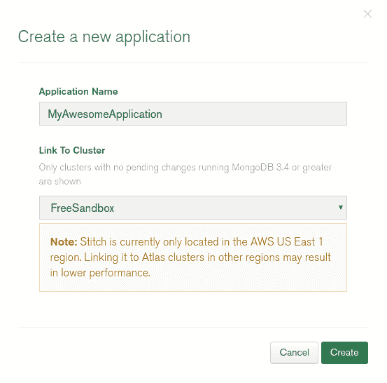
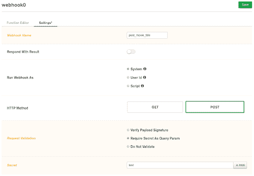
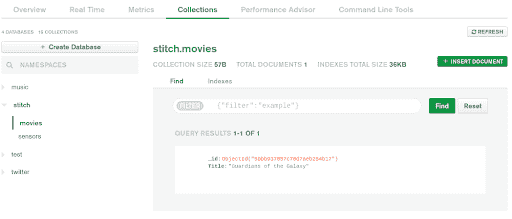
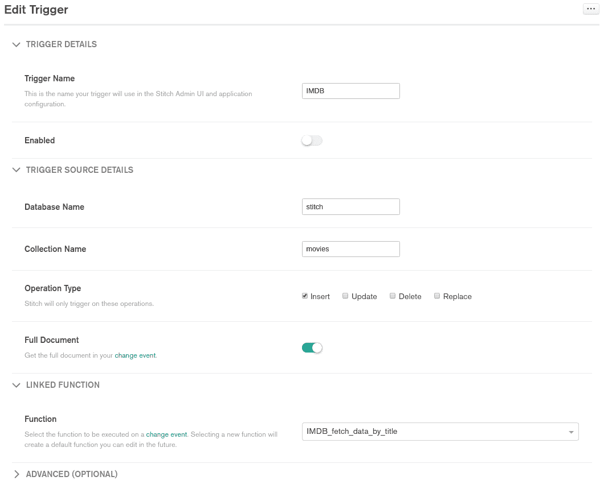
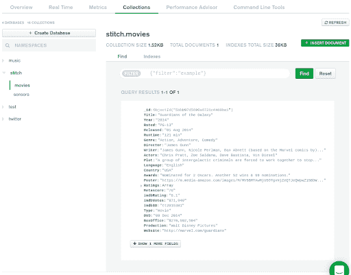

# 如何用 MongoDB Stitch 丰富数据

> 原文：<https://www.sitepoint.com/how-to-enrich-data-with-mongodb-stitch/>

*本文最初发表于 [MongoDB](https://synd.co/2AblyTz) 。感谢您对使 SitePoint 成为可能的合作伙伴的支持。*

以下是我们在本教程中要实现的目标:

首先，我们将使用 [MongoDB Stitch](https://www.mongodb.com/cloud/stitch) 为 MongoDB 编写一个文档。

我们的 MongoDB 集合中的结果将如下所示:

```
{
"_id": ObjectId("5bb27712dced5f37bebf388c"),
"Title":"Guardians of the Galaxy"
} 
```

其次，触发器将捕获这个新插入并启动一个函数。

最后，这个函数将使用给定的电影标题调用[OMDB 外部 API](http://www.omdbapi.com/) ，获取关于该电影的数据，最后用从这个 API 收集的数据充实我们的 MongoDB 文档。

这是我们在 MongoDB 集合中期望的最终结果:

```
{  
   "_id": ObjectId("5bb27712dced5f37bebf388c"),
   "Title":"Guardians of the Galaxy",
   "Year":"2014",
   "Rated":"PG-13",
   "Released":"01 Aug 2014",
   "Runtime":"121 min",
   "Genre":"Action, Adventure, Comedy",
   "Director":"James Gunn",
   "Writer":"James Gunn, Nicole Perlman, Dan Abnett (based on the Marvel comics by), Andy Lanning (based on the Marvel comics by), Bill Mantlo (character created by: Rocket Raccoon), Keith Giffen (character created by: Rocket Raccoon), Jim Starlin (characters created by: Drax the Destroyer,  Gamora & Thanos), Steve Englehart (character created by: Star-Lord), Steve Gan (character created by: Star-Lord), Steve Gerber (character created by: Howard the Duck), Val Mayerik (character created by: Howard the Duck)",
   "Actors":"Chris Pratt, Zoe Saldana, Dave Bautista, Vin Diesel",
   "Plot":"A group of intergalactic criminals are forced to work together to stop a fanatical warrior from taking control of the universe.",
   "Language":"English",
   "Country":"USA",
   "Awards":"Nominated for 2 Oscars. Another 52 wins & 99 nominations.",
   "Poster":"https://m.media-amazon.cimg/M/MV5BMTAwMjU5OTgxNjZeQTJeQWpwZ15BbWU4MDUxNDYxODEx._V1_SX300.jpg",
   "Ratings":[  
      {  
         "Source":"Internet Movie Database",
         "Value":"8.1/10"
      },
      {  
         "Source":"Rotten Tomatoes",
         "Value":"91%"
      },
      {  
         "Source":"Metacritic",
         "Value":"76/100"
      }
   ],
   "Metascore":"76",
   "imdbRating":"8.1",
   "imdbVotes":"871,949",
   "imdbID":"tt2015381",
   "Type":"movie",
   "DVD":"09 Dec 2014",
   "BoxOffice":"$270,592,504",
   "Production":"Walt Disney Pictures",
   "Website":"http://marvel.com/guardians",
   "Response":"True"
} 
```

## 先决条件

所以首先，如果你想在家里尝试这个，是非常容易的。这里唯一的要求是创建一个免费的 [MongoDB Atlas](http://cloud.mongodb.com/) 集群。[这段视频](https://www.youtube.com/watch?v=ZpA2FIn761U)将向你展示步骤。

MongoDB Stitch 是我们的无服务器平台，由 MongoDB 基于 MongoDB Atlas 构建。一旦我们的 MongoDB Atlas 集群可以使用了，就将一个 MongoDB Stitch 应用程序链接到它:

*   点击左侧面板上的“缝合应用程序”，

*   然后点击“创建新应用程序”，

*   为您的应用程序选择您想要的名称，

*   将其链接到您的免费 MongoDB Atlas 集群。

    [](https://webassets.mongodb.com/_com_assets/cms/image00-ekyu9mjpyt.png)

## 行动

为了能够向 MongoDB 发送文档，我们将使用 HTTP POST 服务。

*   在左侧面板中，点击“服务”，
*   然后点击“添加服务”，
*   选择名为“IMDB”的服务，

注意:“IMDB”将在函数代码中重用。如果您选择其他名称，请确保相应地更新代码。

*   点击“添加服务”，

*   点击"添加传入的 Webhook "、

*   并复制下面的截图。

    [](https://webassets.mongodb.com/_com_assets/cms/image01-5wsxlgxmze.png)

完成后，点击“保存”按钮，你将进入“功能编辑器”屏幕。

输入以下代码:

```
exports = function(payload, response) {
  const mongodb = context.services.get("mongodb-atlas");
  const movies = mongodb.db("stitch").collection("movies");
  var body = EJSON.parse(payload.body.text());
  movies.insertOne(body)
  .then(result => {
    response.setStatusCode(201);
  });
}; 
```

再次点击“保存”按钮。

现在我们的服务已经准备好了，我们可以测试它了！

转到“设置”，你会发现你的网页挂钩网址。您现在可以像这样向 MongoDB Stitch 发送一个 HTTP POST 请求:

```
curl -H "Content-Type: application/json" -d '{"Title":"Guardians of the Galaxy"}' https://webhooks.mongodb-stitch.com/api/client/v2.0/app/stitchtapp-abcde/service/IMDB/incoming_webhook/post_movie_title?secret=test 
```

注意:我使用了 curl 命令，但也可以随意使用 Postman 或任何你习惯的命令。

我们可以通过查看 MongoDB Atlas 集群中“stitch.movies”集合的内容来检查它是否工作:

[](https://webassets.mongodb.com/_com_assets/cms/image02-62orqelqv0.png)

现在我们可以使用 Stitch 将新文档插入到 MongoDB Atlas 中，我们将创建触发器。

*   在左侧面板中，单击“触发器”，

*   然后点击“添加数据库触发器”，

*   并执行以下操作。

    [](https://webassets.mongodb.com/_com_assets/cms/image03-se6qbvdqgk.png)

这是创建新函数所需的代码:

```
exports = function(changeEvent) {
  var docId = changeEvent.documentKey.\_id;
  var title = encodeURIComponent(changeEvent.fullDocument.Title.trim());

  var movies = context.services.get("mongodb-atlas").db("stitch").collection("movies");
  var imdb\_url = "http://www.omdbapi.com/?apikey=a12b1234&t=" + title;

  const http = context.services.get("IMDB"); // change the name of the service here if you used a different name.
    return http
      .get({ url: imdb\_url })
      .then(resp => {
        var doc = EJSON.parse(resp.body.text());
        movies.updateOne({"\_id":docId}, doc);
        });
}; 
```

正如你在代码中间看到的，我使用的是 OMDB API，我用一个假的 API 密钥替换了它。

您可以在这里创建自己的免费 API 密匙，只需一个有效的电子邮件地址:[http://www.omdbapi.com/apikey.aspx](http://www.omdbapi.com/apikey.aspx)——每天限 1000 次呼叫。

一旦完成，您就可以用自己的密钥替换我的假 API 密钥(用黄色突出显示)。

现在已经准备好了，我们只需要通过重复之前使用的 CURL 命令来测试它。如果你有更好的电影名字，请随意使用；-).

我删除了我们在添加触发器之前所做的测试，现在我的集合中有以下内容:

[](https://webassets.mongodb.com/_com_assets/cms/image04-zs5ry6j64q.png)

让我们回顾一下我们所做的事情:

*   我们使用 MongoDB Stitch 托管的 HTTP POST 服务插入了一个新文档，该服务只包含一个“_id”(由 MongoDB 自动填充)和一个“Title”。
*   这个文档的插入被触发器检测到，该触发器使用这个“Title”作为参数调用外部 Web API。
*   然后，我们解析从这个 API 获得的结果体，并更新几毫秒前插入的文档。

## 结论

只需几行代码，您就可以用 MongoDB Stitch 丰富数据。这是利用您的微服务架构并最终切换到事件驱动架构的一个很好的方式。

## 后续步骤

感谢您花时间阅读我的帖子。我希望你觉得有用和有趣。

如果 MongoDB Stitch 是你正在考虑生产的东西，你可以在这里发现[如何计费](https://docs.mongodb.com/stitch/admin/billing/)。

如果你想使用 [MongoDB](https://synd.co/2PzZ7gf) Stitch 查询你在 [MongoDB](https://synd.co/2PzZ7gf) Atlas 中的数据，我推荐[这篇来自 Michael Lynn](https://medium.com/@michael.lynn/creating-a-data-enabled-api-in-10-minutes-with-mongodb-stitch-6d23578fed6d) 的文章。

## 分享这篇文章