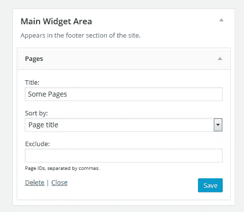

# WordPress 插件开发简介

> 原文：<https://www.sitepoint.com/an-introduction-to-wordpress-plugin-development/>

你是否正在寻找一个关于 WordPress 插件开发的介绍，它将讨论所有重要的步骤，并在整个过程中帮助你？如果是这样，你很幸运。本教程将概述你需要知道的关于设计你自己的插件的基础知识和一些最佳实践的要点。


## 什么是 WordPress 插件？

插件是 WordPress 最强大的资产之一。本质上，插件是你在你的网站上激活的模块，以提供一系列的功能或元素。

您可以添加到网站的功能取决于每个特定插件的用途。有大量的插件可供选择，从简单的插件(如添加样式或小主题变化的插件)到广泛的插件(提供重大变化，如电子商务集成或第三方连接)。

插件不同于你的主题，它们独立工作，使用钩子、过滤器、短代码、小部件和自定义代码来执行它们的功能。

## 优势、劣势和注意事项

插件很棒，它们为开发者和管理员提供了一种扩展和重用功能的方式。虽然它们是一个很好的工具，但是它们仍然有各自的优点和缺点。

### 强项

*   你可以添加几乎任何主题的插件，并期望它能正常工作。插件是模块化的，所以你可以复制到一个新的项目(或分发)这是伟大的。
*   插件充当所有代码和元素的容器。如果你要在主题中构建类似的功能，你可能会把元素搞混。有了插件，所有需要运行的东西都在一个包里。
*   它们很容易制作，可以利用 WordPress 的 action 和 filter 钩子。
*   可以以面向对象的方式轻松创建，从而创建更健壮、更易于管理的代码。

### 弱点

*   对网站主题的有限访问。插件不能直接输出代码到主题的某个位置。一个主题必须为你的插件提供一个输出区域，比如内容区域或者通过一个小部件区域。
*   插件冲突确实会发生。有时候，另一个插件(甚至是主题)会对你的插件产生负面影响，它会破坏你的体验(例如，你可能正在使用 WordPress 媒体上传器，它已经被修改，不再像预期的那样工作，破坏了你的插件)。
*   对模板和设计的有限访问。插件应该提供功能，主题提供风格。

## 核心概念–动作、过滤器、短代码、小部件等等

让我们花点时间来谈谈插件开发的一些关键方面。

如果你从事过 WordPress 主题的工作，你可能对这些领域很熟悉，但是，对这些概念如何工作的深刻理解将帮助你构建易于使用和维护的功能。

## 动作(挂钩)

一个`action`钩子是一个由 WordPress 在特定时间执行的活动。当这个动作被触发时，它会找到所有附加到这个动作的函数，并以正确的顺序执行它们。

WordPress 的核心功能定义了几十个动作，每个动作都有一个唯一的名字。例如，当 WordPress 保存一篇文章(比如一篇文章、页面或其他内容类型)时，它将调用动作`save_post`，该动作将寻找任何与该动作相关的功能。

使用 [`do_action()`](https://codex.wordpress.org/Function_Reference/do_action) 功能定义所有动作。该函数接受以下参数

*   `$tag`(必需)
*   `$args`(可选一个或多个变量)

总的来说，每个动作都有自己的名字(标签)和可选数量的附加有用变量(可以有多个或零个附加变量)

### 一个简单的 WordPress 动作

我们来考虑一下`save_post`动作钩。该操作接受四个值。第一个值是动作的名称，而另外三个是可以访问的附加变量(包含文章的 id、文章对象本身以及文章是否存在并正在被更新)

```
//the save_post action hook
do_action(`save_post`, $post_ID, $post, $update); 
```

您可以挂接这个操作，这样当一篇文章保存后，您可以做其他事情，如发送和电子邮件或更新数据库。

### 创造你自己的行动

虽然 WordPress 提供了大量的动作，但是你可以自己定义。创建你自己的动作会给你一个简单的方法在你的主题或插件中的设定点调用你的功能。

让我们使用`do_action`函数来创建我们的新动作。我们将创建一个动作，它将在单个`pages`的`title`之后被直接调用。

```
//create a new action to be used after our page title
do_action('page_subtitle', $post); 
```

当显示一个单独的`page`时，它会正常显示标题，然后它会点击我们的`page_subtitle`动作。WordPress 将检查任何与这个动作相关的函数并执行它们(它将传入全局的`$post`变量，这样函数就知道应该在哪个页面显示副标题)。

### 通过调用您的操作来执行您的函数

要在一个动作发生时调用一个特定的函数，你需要使用 [`add_action()`](https://codex.wordpress.org/Function_Reference/add_action) 来附加你的函数。`add_action`采用以下参数。

*   `$hook`(必需)
*   `$function_to_add`(必需)
*   `$priority` (optional)
*   `$accepted_args`(可选，但当动作有多个传递的变量时是必需的)

#### 使用强制参数

您可以通过提供钩子名称和要调用的函数的强制值来调用`add_action`函数。这是调用你的行为的最简单的方法。

```
//when 'save_post' is triggered, call our saving function
add_action('save_post','save_my_custom_post');
//defines our function that will handle our saving
function save_my_custom_post($post_id){
    //you will do your saving here
} 
```

正如你所看到的，当`save_post`动作发生时，我们把我们的`save_my_custom_post`函数附加到它上面，让我们在保存后可以做一些事情。

#### 使用所有参数(理解优先级和 accepted_args 值)

有时使用强制值是不够的。您可能需要手动设置`$priority`和`$accepted_args`值，以使您的操作生效。

动作的`priority`决定了功能执行的顺序。默认情况下，动作将使用`10`的值作为其优先级。您可以将该值设置得更高或更低，以使您的函数执行得更早或更晚。当你的主题或者插件也使用相同的动作钩子时，这是很有用的(这样你就可以指定你的函数何时运行)。

`accepted_args`表示在`add_action`调用中传递了多少变量。一个动作接受的默认参数数量是一个。然而，如果你的动作需要多个变量，你必须告诉 WordPress 它需要多少个变量。让我们来看看`save_post`的行动。

```
//the save post action, defined in WordPress
do_action( 'save_post', $post_ID, $post, $update );

//add our function onto the 'save_post' hook, supplying priority and args
add_action('save_post','save_my_page_extended,10,3);

//function executed on save (we want all three variables)
function save_my_page_extended($post_ID, $post, $update){
    //access all of our variables to do some work
} 
```

`save_post`动作有多个变量可以传递给它，因此我们必须设置它的优先级以及它将传递的变量的数量。一旦我们告诉 WordPress 我们将接受多个变量，我们可以将这些变量添加到我们的函数中，我们将能够访问它们。

#### 行动摘要

总的来说，你将在你的主题或者插件中使用 [`do_action`](https://codex.wordpress.org/Function_Reference/do_action) 函数在一个设定的位置执行代码(设置任何被挂钩的函数可用的值)。然后，您将使用 [`add_action`](https://codex.wordpress.org/Function_Reference/add_action) 功能来挂钩您的特定功能。您可以调用最少的动作(动作的名称和您想要调用的函数)，或者您也可以提供将要传递的变量的优先级和数量，

## 过滤器(挂钩)

WordPress `filter`是一个钩子，它接受一个变量(或一系列变量)并在它们被修改后返回。这些过滤器经常被使用，以便您有一种方法来操作默认信息。

WordPress 捆绑了几十个这样的过滤器，它们是使用 [`apply_filters()`](https://codex.wordpress.org/Function_Reference/apply_filters) 功能创建的。该函数接受以下参数

*   `$tag`(必需)
*   `$value`(必需)
*   `$var` (optional)

`$tag`变量是过滤器的名称。
`$value`是将被过滤的变量或值。
`$var`变量是可选的，但是允许你传递额外的值到你的函数中。

插件和主题通常会创建这些过滤器，这样你就可以改变元素而不必修改源代码本身(使它们可扩展)。这些过滤器通常定义在函数内部。

### 一个简单的 WordPress 过滤器

`get_the_excerpt`过滤器是一个过滤器，您可以在 posts 循环中使用它来访问摘录。

这个过滤器被定义为 WordPress 核心的一部分，只定义了过滤器的名称和要调用的函数，它没有定义任何可选的参数。

```
//get the except for a post, as defined in /wp-includes/post-template.php
echo apply_filters( 'the_excerpt', get_the_excerpt() ); 
```

您可以将自己的函数附加到`the_excerpt`过滤器上，然后在返回摘录之前对其进行操作(例如，您可以将它包装在一个容器中，更改其内容或修剪其长度)。

#### 创建您自己的过滤器

让我们看一个例子。如果我们在一个插件中创建一个名字数组，我们可以通过使用`apply_filters`钩子告诉 WordPress 这些值可以被任何与它们挂钩的函数改变，从而使它可以过滤。

```
//make our name value array filterable
$name_values = apply_filters('filter_name_array_values',
            array('Joanna','Peter')
); 
```

创建这样的过滤器将让其他开发人员(或您自己)以动态的方式更改这些值。一般来说，如果你在一个函数中或者执行某种功能，提供过滤器来使你的元素可扩展是一个很好的实践。

#### 执行您的过滤器

当你想执行你的过滤器时，你需要使用 [`add_filter()`](https://codex.wordpress.org/Function_Reference/add_filter) 功能。该函数采用以下值

*   `$tag`(必需)
*   `$function_to_add`(必需)
*   `$priority` (optional)
*   `$accepted_args`(如果我们有多个传递的参数，则可选但必须)

`add_filter`功能的工作方式与`add_action`相似。您定义了想要调用的过滤器的名称，以及将要调用的函数，您就可以开始了。让我们看看如何使用它来过滤我们在前面的例子中创建的名字列表。

```
//Change the saved name values by filtering them
function add_new_names($names){
    $names[] = 'Simon';
    return $names;
}
add_filter('filter_name_array_values','add_new_names'); 
```

如你所见，我们将`add_new_names`函数附加到了`filter_name_array_values`过滤器上，并接受了一个变量`$names`。当我们用`apply_filters`定义过滤器时，我们将默认值设置为一个数组，其中包含 Joanna 和 Peter 的值。

我们这里的函数将获取现有的值(为了简单起见，我们在这里称之为`$names`),并在它的末尾添加一个新值，称为 Simon。

在最后，我们返回这些值。**返回值非常非常重要，否则你会破坏一切**。必须返回这些值的原因是，附加到该过滤器的任何附加函数都将接收这些值。如果你不归还它们，它们就没用了。

#### 过滤器摘要

您将使用 [`apply_filters`](https://codex.wordpress.org/Function_Reference/apply_filters) 功能在您的主题或插件中创建过滤器(提供您想要过滤的值)。然后您将使用 [`add_filter`](https://codex.wordpress.org/Function_Reference/add_filter) 函数将您的特定函数挂接到这个过滤器上，允许您操作过滤后的变量并返回它)。

## 短代码

关于短码的更全面的文章，你可以阅读或查看 WordPress Codex 上的[短码 API，或者阅读我以前关于](https://codex.wordpress.org/Shortcode_API)[定制 WordPress 短码](https://www.sitepoint.com/custom-shortcodes-for-wordpress/)的文章。下面是一个简短的总结，可以帮助您使用短代码。

因为你的插件通常不能访问你的主题文件，所以你需要一种方式向最终用户显示你的定制功能，同时让你的站点管理员可以很容易地定制。

短代码是实现这一点的完美方式，因为它们允许开发人员创建可以用简单的值和属性修改的复杂功能。这些短代码被添加到可视化编辑器(或其他位置)中，当用户查看时，它们会执行您的代码。

编辑器中的简短代码:


在前端处理和显示时的短代码:


### 关于短代码的快速课程

您需要使用 [`add_shortcode()`](https://codex.wordpress.org/Function_Reference/add_shortcode) 功能创建您的短代码。这个函数将接受第一个变量作为你的短代码的`name`，第二个变量作为`output_function`。

`output_function`本身将接受三个值；`attributes`、`content`和`name`。在这个函数中，您将构建您的短代码并返回它进行显示。

在我们的例子中，函数的参数将被更详细地研究，现在可以忽略它们。

让我们看一个简单的例子:

```
//Add our shortcode
add_shortcode('test_shortcode','my_shortcode_output');
//perform the shortcode output
function my_shortcode_output($atts, $content = '', $tag){
    $html = '';
    $html .= '<p>Hello World</p>';
    return $html;
} 
```

现在，当我们将短代码`[test_shortcode]`添加到编辑器中时，它将运行我们的函数并将结果转换为`<p>Hello World</p>`

## 小工具

如果你想学习更多关于小部件的知识，你应该从 [WordPress 小部件 API 代码页](https://codex.wordpress.org/Widgets_API)开始。本页概述了您需要的大部分内容，并提供了一个有文档记录的工作示例。

小部件很重要，因为它们提供了另一种执行插件代码的方式，同时提供了一个易于使用的界面。

带有配置选项的示例短代码。


因为大多数主题将支持一个或多个侧边栏；添加你自己的小部件可以让你快速的在主题中显示你的信息。

小部件比短代码更复杂，但遵循相同的原则——为其输出定义一些选项，然后在前端显示出来。

### 小部件简介

要创建一个小部件，你需要扩展 [`WP_Widget`](https://developer.wordpress.org/reference/classes/wp_widget/) 类。WordPress 已经创建了一个面向对象的窗口小部件方法，它们作为一个类存在；这个类需要扩展以提供您的功能。

让我们看一个基本的小部件示例:

```
//class for our widget
class my_widget extends WP_widget{
    //constructor (sets basic elements for the widget)
    public function __construct(){
        parent::__construct(
            'my_widget', // Base ID
            'My Widget', // Name
            array( 'description' => 'An awesome widget') // Args
        );
        add_action('widgets_init',array($this,'register_widget'));
    }
    //handles front end display
    public function widget($args,$instance ){
        echo $args['before_widget'];
        echo $instance['title'];
        echo $args['after_widget'];
    }
    //handles back end widget display
    public function form($instance){
        $title = (isset($instance['title']) ? $instance['title'] : '');
        echo '<input type="text" id="' . $this->get_field_id('title') . '" name="' . $this->get_field_name('title') . '" value="' . $title  . '"/>';
    }
    //handles saving
    public function save($new_instance, $old_instance){
        $instance = array();
        $title = $new_instance['title'];
        return $instance;
    }
    //registers the widget with WordPress
    public function register_widget(){
        register_widget('my_widget');
    }
}
$my_widget = new my_widget; 
```

这将产生一个基本的小部件，您可以在其中保存一个文本值，并将其显示到前端，因为您可以看到输出非常无聊。


在即将到来的真实世界的例子中，我们将更深入地研究小部件。

## 类(面向对象的设计)

面向对象设计(OOD)是一种不同的开发技术，在这种技术中，你围绕`classes`的概念来构建你的功能。

类是在单个实体中存储相关函数和值的一种方式，为您的开发提供了一个单一的位置。面向对象设计的总体目的是创建一个执行您的功能的`object`。

插件是面向对象设计的完美候选，因为它们是为执行网站任务而创建的独立模块。你的插件通常会包含自己的 CSS 和 JavaScript 文件，以及潜在的图片和额外的 PHP 文件，所以使用面向对象的设计开发会使你的开发更容易。

我们即将到来的真实世界的例子将完全面向对象。如果你有兴趣阅读更多，你可以阅读我的文章[用 WordPress](https://www.sitepoint.com/object-orientated-development-with-wordpress/ "Object Orientated Development") 进行面向对象的开发。

## 后续步骤

这篇文章向你介绍了 WordPress 插件开发所需的许多核心概念。在下一篇文章中，我们将带着[详细看看真实世界示例](https://www.sitepoint.com/real-world-example-wordpress-plugin-development/)的代码。

## 分享这篇文章