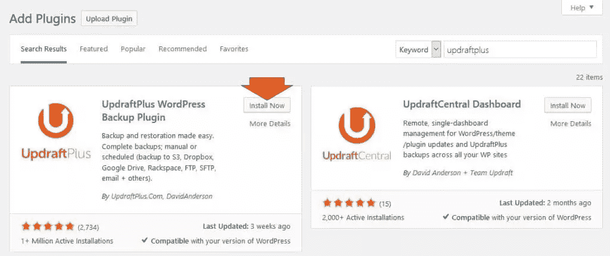
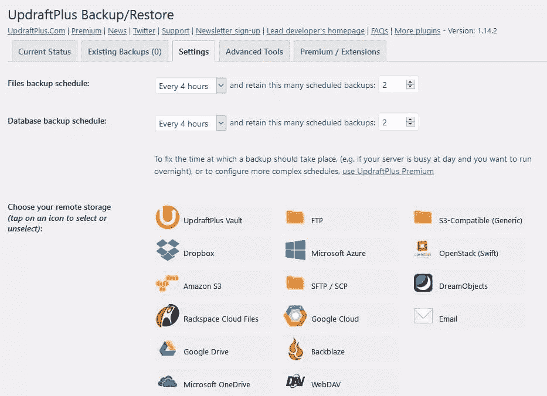
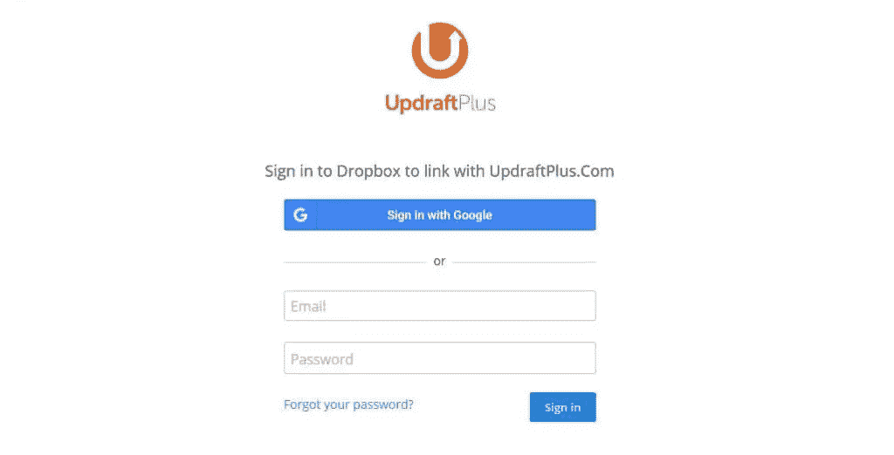
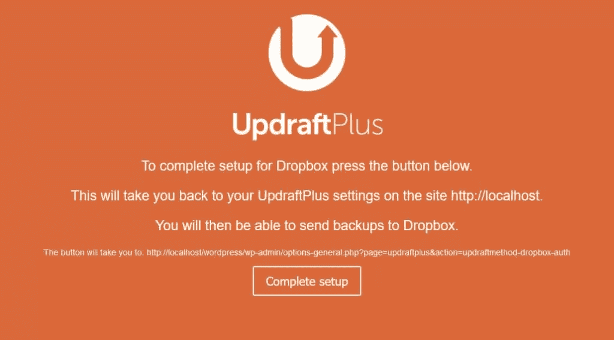
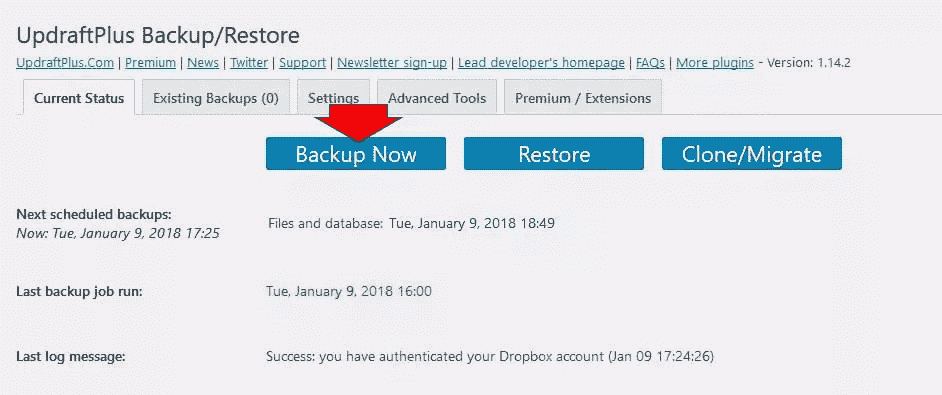
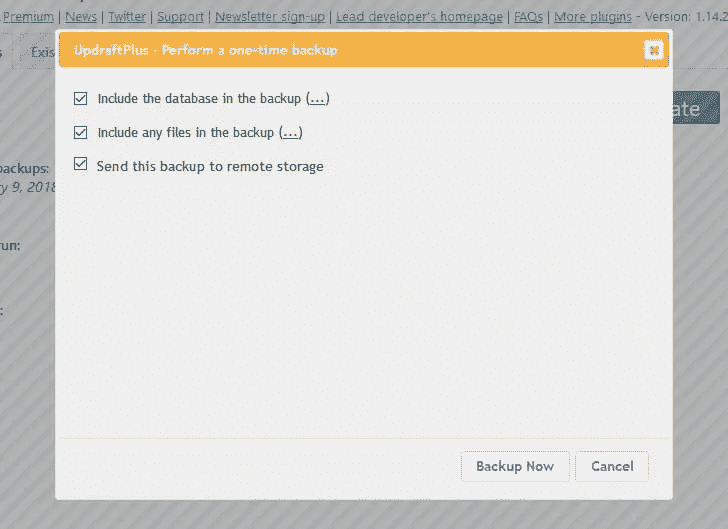
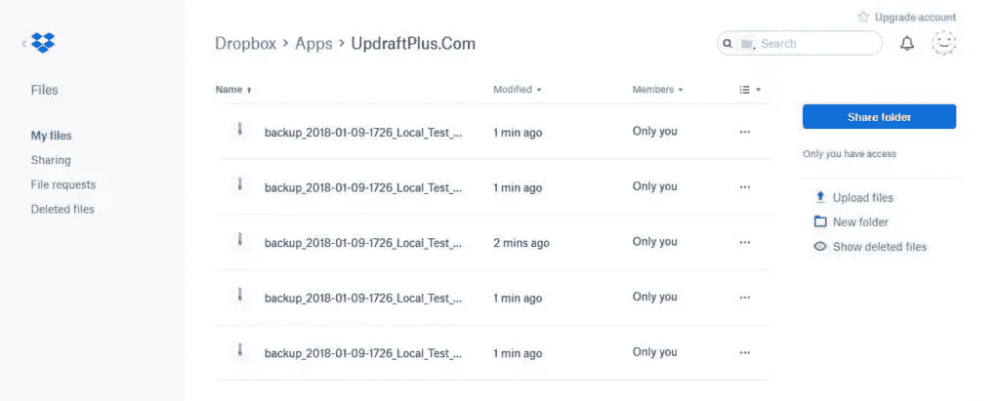
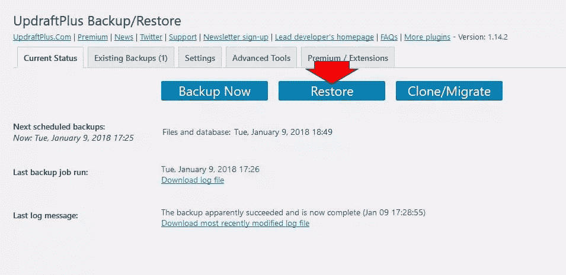
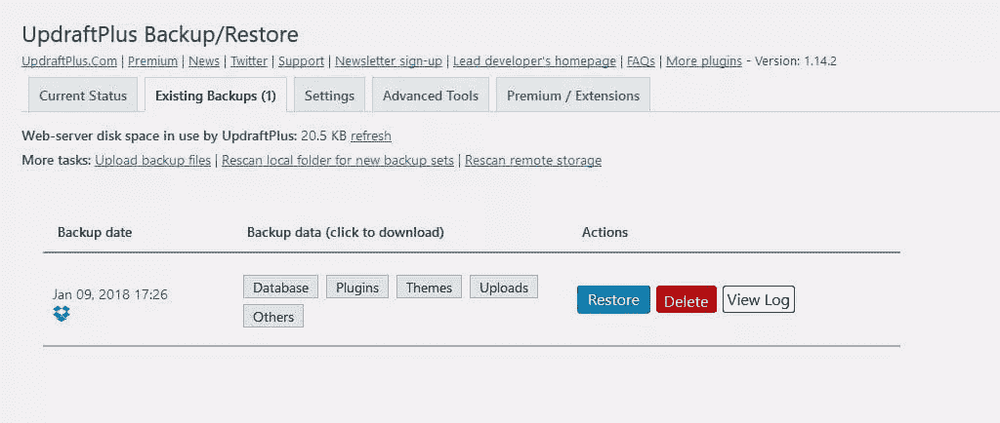
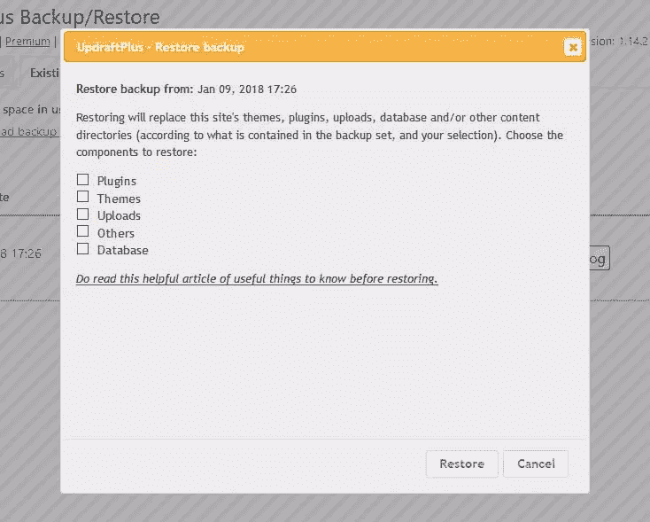

# 如何轻松地远程备份 WordPress:一步一步的指南

> 原文：<https://www.sitepoint.com/back-up-wordpress-remotely-guide/>

*这篇关于如何远程备份 WordPress 的文章最初是由 Torque 杂志发表的[，经允许在此转载。](https://torquemag.io/2018/01/back-up-wordpress-remotely/)*

学习远程备份 WordPress 是你能做的最重要的事情之一。没有什么比失去你所有的努力工作并且没有办法把它找回来更糟糕的了。出于这个原因，建立一个备份解决方案是任何网站所有者必须做的。

但是，您在哪里安全地存储站点的副本呢？你的硬盘？你网站所在的服务器？嗯，硬盘故障，服务器停机，计算机被盗或变得无法访问。你的 WordPress 备份也是如此。

因此，一个更好的主意是将 WordPress 备份到云存储或其他非现场位置。而这正是本文所要讨论的。下面，你会找到如何备份你的 WordPress 站点的逐步说明。你还将学习几个插件选项和服务来创建云中的 WordPress 备份。

让我们开始吧。

## 远程备份 WordPress:下面是如何做的

在下面的例子中，我们将使用 [UpdraftPlus](https://wordpress.org/plugins/updraftplus/) 。这个插件允许你将你的站点备份到一个远程位置，即使是在它的免费版本中。许多其他选项(下面将详细介绍)需要购买高级版本才能使用该功能。除此之外，正如您将看到的，UpdraftPlus 还使过程变得非常简单。

### 1.安装插件

自然，首先要做的是安装备份解决方案。为此，请前往**插件>添加新的**并搜索**升级插件**。

当它出现在搜索结果中时，点击**立即安装**进行加载。一旦 WordPress 完成下载和安装，点击**激活**。

### 2.设置您的远程存储

一旦插件在你的网站上，你可以在**设置>更新和备份**下找到它的选项面板。在**设置**下，你可以配置它备份你网站的时间和地点。

我们将首先处理设置远程存储空间。正如你所看到的，UpdraftPlus 提供了一大堆选项，从它自己的 FTP 服务到 Dropbox、电子邮件、微软 OneDrive 和谷歌 Drive。

在这个例子中，我们将使用 Dropbox。这项服务提供了一个免费的基本账户，有 2GB 的空间，可以很好地保护你的 WordPress 备份的安全。然而，对于这里的任何远程选项，步骤实际上都是相同的。

你要做的第一件事就是点击 Dropbox 图标。然后，向下滚动并保存更改。当您这样做时，您将看到以下消息:

点击链接授权您的 Dropbox 帐户。如果您尚未登录，下一步是输入您的凭据。

之后，您必须通过点击**允许**来授权 UpdraftPlus 访问您的帐户。

在随后的屏幕中点击**完成设置**完成设置。这也将带你回到你的网站。

干得好，您完成了第一步！

### 3.运行备份

现在设置已经完成，是时候第一次备份你的站点了。这样做很简单:只需转到 UpdraftPlus 设置的第一个选项卡，点击写着**立即备份**的蓝色大按钮。

这将打开以下弹出窗口:

在这里，确保勾选所有框，以便包括您的数据库和站点文件，并让 UpdraftPlus 将它们发送到您的远程存储。

然后点击底部的**立即备份**。这将启动备份过程，并显示一个状态指示条，以便您可以跟踪进度。

根据网站的大小，这可能需要一段时间。你在这期间去喝杯咖啡怎么样？顺便说一下，你可以通过[提前清理你的 WordPress 站点](http://torquemag.io/2016/05/optimize-your-site-with-spring-cleaning-tips-for-wordpress-site-optimization/)来节省时间。这将使它更小，从而更容易备份。

一旦完成，当你回到你的 Dropbox 账户时，你应该会发现一个名为`Apps`的新文件夹，里面有另一个名为`UpdraftPlus.com`的目录。在那里，你可以找到你保存的文件。

### 4.设置自动日程安排

但是，依靠手动备份并不是最有效的方式。尤其是因为很容易忘记去做，这就违背了整个目的。解决方案:备份自动化。

谢天谢地，UpdraftPlus 提供了开箱即用的功能。在**设置**选项卡下，我们前面已经看到了选项。

使用下拉菜单选择插件备份站点文件和数据库的频率。选项包括每四小时、八小时或十二小时、每天、每周、每两周或每月一次。

哪个时间间隔最有意义取决于您的站点。一个有很多评论的非常活跃的博客比那些很少改变的静态网站需要更频繁的备份。

除此之外，您还可以选择手头的备份数量。同样，这取决于你的网站的性质。

接下来，您可以找到其他选项来配置要从备份中排除的内容。完成备份后，您还可以请求插件通过电子邮件发送报告。最后，在**专家设置**下，您可以启用调试模式，定义分割档案的大小，删除或保留本地备份文件，以及控制 SSL 设置。

一旦满意，保存您的设置，您的自动备份应该完全正常。请注意，在保存时，您可能需要重新授权对远程存储的访问。

### 如何从远程恢复

好了，现在你宝贵的网站正在定期备份到一个安全的地方。然而，当不可思议的事情发生时，您必须从保存的版本中恢复它，您该怎么办呢？

当你远程备份你的 WordPress 站点时，最好的事情之一就是你也可以使用远程备份来恢复它。UpdraftPlus 让这个过程变得非常方便。

例如，假设您的站点完全崩溃并烧毁，您需要取回保存的版本。那样的话，建立一个全新的 WordPress 站点，在上面安装 UpdraftPlus 就足够了。之后，像以前一样连接到 Dropbox(或您选择的远程备份位置)。然后，点击大的**恢复**按钮。

在下一个菜单中，如果列表为空，请选中**重新扫描远程存储**。这将使用您现有的远程备份填充您的列表。

点击右侧的**恢复**，您就可以开始恢复您需要的组件。

就是这样。剩下的就自己发生了。

### 高级功能

虽然 UpdraftPlus 的基本功能足以远程备份 WordPress，但它的高级版本提供了额外的选项，使它更加有用:

*   微调您的备份计划(例如，在夜间流量较低时备份您的站点)
*   排除/包含文件和数据库表
*   在 Dropbox 中创建子文件夹，将不同站点的备份分开
*   备份 WordPress Multisite 并在多个远程位置保存您的站点
*   上升气流拱顶或云中的存储空间
*   备份数据库的加密
*   通过远程备份克隆和迁移 WordPress 站点的能力

您可以[单独购买这些选项中的许多选项](https://updraftplus.com/shop/)，或者在 [UpdraftPlus Premium](https://updraftplus.com/shop/updraftplus-premium/) 中获得所有选项，起价为 70 美元。不过对于基础保障来说，免费版绝对够用。

## 远程备份你的 WordPress 站点的其他插件

当然，UpdraftPlus 并不是将 WordPress 备份到异地的唯一方法。其他插件也可以。这里有一些选择。

### [后退](https://wordpress.org/plugins/backwpup/)

另一个免费选项，包括远程备份到与 UpdraftPlus 类似的服务范围。该插件使设置自动日程变得容易。它还可以优化，检查和修复您的数据库。

专业版带有优先支持，备份到 Google Drive 的可能性(包含在 UpdraftPlus 的开箱即用中)和其他功能。

### [复印机](https://wordpress.org/plugins/duplicator/)

这个插件是我个人最喜欢的用于迁移 WordPress 网站的插件之一，它也可以作为一个备份解决方案。

但是，对于远程位置的计划备份，您需要购买高级版本，一年的备份和支持起价为 39 美元。如果质量和免费插件一样，这可能是值得投资的。

### [BackupBuddy](https://ithemes.com/purchase/backupbuddy/)

BackupBuddy 是一个仅高级的解决方案。它允许你创建一个时间表，并备份你的网站到 Dropbox，FTP，亚马逊 S3，电子邮件等等。他们甚至有自己的服务，提供实时备份。另外，BackupBudy 可以复制、迁移和恢复 WordPress 站点。一个网站的计划起价为 80 美元/年。

### [VaultPress](https://wordpress.org/plugins/vaultpress/)

最后，我们有 VaultPress，它为您的站点提供每日或实时云备份。该服务包含在 [Jetpack](https://wordpress.org/plugins/jetpack/) 中，但是，您需要订阅才能使用。

计划起价为 3.50 美元/月，但是，对于实时远程备份，需要专业计划，起价为 29 美元/月或 299 美元/年。你还需要安装 Jetpack 插件(参见我们的 [Jetpack 指南](http://torquemag.io/2014/11/the-ultimate-guide-to-jetpack/)了解更多信息)并获得一个 WordPress.com 账户。然而，根据您的需求和站点，这种努力可能是值得的。

## 简言之，WordPress 远程备份…

备份解决方案是任何 WordPress 网站必不可少的一部分。如果没有，失去站点和没有机会恢复的风险就太大了。

虽然任何解决方案都比没有好，但是远程备份 WordPress 是一个特别好的选择。它在云中保存你的站点的副本，使它们不太可能发生什么事情，并让你从世界上的任何地方都能访问你的备份。

在这篇文章中，我们已经讨论了如何在 UpdraftPlus 的帮助下远程备份 WordPress。这个插件是为你的 WordPress 站点设置基本远程备份的一个很好的免费选项。它还有许多高级选项，使体验更好。

如果你想寻找另一种解决方案，你也可以在这篇文章中找到一些。无论你选择哪一个，重要的是你有一个合适的系统。在最坏的情况下，它会大大降低你的血压。我保证。

## 分享这篇文章