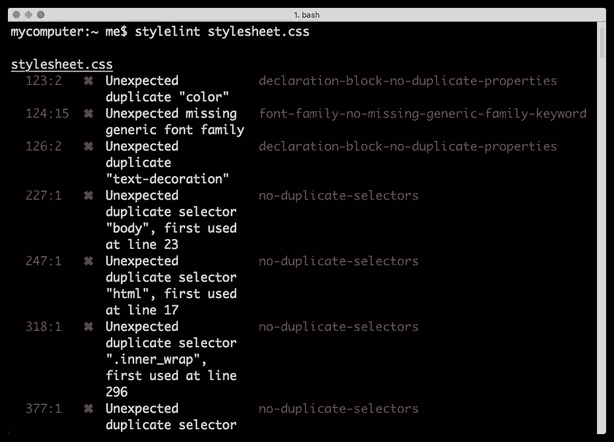

# CSS 调试和优化:代码质量工具

> 原文：<https://www.sitepoint.com/css-debugging-and-optimization-code-quality-tools/>

*以下对 CSS 代码质量工具的介绍摘自蒂芙尼的新书 [CSS Master，第二版](https://www.sitepoint.com/premium/l/css-master2)。*

在你成为 CSS 大师的道路上，你需要知道如何排除故障和优化你的 CSS。如何诊断和修复渲染问题？你如何确保你的 CSS 不会给最终用户带来性能延迟？您如何确保代码质量？

知道使用哪些工具将有助于确保您的前端工作良好。

在本文中，我们将讨论帮助你分析 CSS 质量的工具。我们将关注两个:

*   stylelint
*   UnCSS

stylelint 是一个林挺工具。一个 **linter** 是一个检查代码潜在问题点的应用程序，执行编码约定，比如空格代替制表符缩进。stylelint 可以发现重复的选择器、无效的规则或不必要的特殊性等问题。这些对 CSS 的可维护性影响最大。

另一方面，UnCSS 检查 CSS 中未使用的选择器和样式规则。它解析一个样式表和一个 HTML 页面列表，返回一个去掉了无用规则的 CSS 文件。

这两个工具都使用 Node.js，并且可以使用 npm 进行安装。

如果你在一个小网站上工作，比如一个个人博客或一些不经常更新的页面，这些工具标记的许多问题可以安全地忽略。您将花费时间进行重构，但在可维护性和速度方面却没有什么收获。然而，对于更大的项目，它们是无价的。它们将帮助您在可维护性问题开始之前就阻止它们。

## stylelint

stylelint 帮助你避免错误，并在你的风格中执行惯例。它有超过 160 个错误捕捉规则，并允许你通过插件创建自己的规则。

### stylelint 安装和配置

像安装任何其他 npm 软件包一样安装 stylelint:

```
npm install -g stylelint 
```

一旦安装完毕，我们需要在使用之前配置 stylelint。stylelint 没有附带默认的配置文件。相反，我们需要创造一个。在您的项目目录中创建一个`.stylelistrc`文件。这个文件将包含我们的配置规则，可以使用 JSON (JavaScript 对象表示法)或 YAML (YAML 不是标记语言)语法。本节中的示例使用 JSON。

我们的`.stylelistrc`文件必须包含一个具有`rules`属性的对象。`rules`的值本身将是一个包含一组`stylelist`规则及其值的对象:

```
{
    "rules": {}
} 
```

例如，如果我们想将`!important`从声明中删除，我们可以将 [`declaration-no-important`](https://stylelint.io/user-guide/rules/declaration-no-important/) 设置为`true`:

```
{
    "rules": {
        "declaration-no-important": true
    }
} 
```

stylelint 支持 150 多种规则，用于检查语法错误、缩进和换行符一致性、无效规则和选择器特异性。您将在 [stylelint 用户指南](https://stylelint.io/user-guide/rules/)中找到规则及其可用值的完整列表。

### 从基本样式 lint 配置开始

您可能会发现从基本配置开始，然后根据您的项目需求进行定制会更容易。 [`stylelint-config-recommended`](https://github.com/stylelint/stylelint-config-recommended) 基本配置是一个很好的起始配置。它启用所有“可能的错误”规则。使用 npm 安装它:

```
npm install -g stylelint-config-recommended 
```

然后，在您的项目目录中，创建一个包含以下行的`.stylelistrc`文件:

```
{
    "extends": "/absolute/path/to/stylelint-config-recommended"
} 
```

将`/absolute/path/to/`替换为安装`stylelint-config-recommended`的目录。全局 npm 包通常可以在 Windows 10 系统的`%AppData%\npm\node_modules`目录中找到，在 Unix/Linux 和 macOS 系统的`/usr/local/lib/node_modules`中找到。键入`npm list -g`找到您的全球`node_modules`目录。

然后，我们可以通过添加一个`rules`属性来扩充我们的配置。例如，为了不允许供应商前缀，我们的`.stylelistrc`文件应该类似于下面的内容:

```
{
    "extends": "/absolute/path/to/stylelint-config-recommended",
    "rules": {
       "value-no-vendor-prefix": true
    }
} 
```

如果我们想将选择器的最大特异性限制在`0,2,0`呢？这将允许像`.sidebar .title`这样的选择器，但不允许`#footer_nav.`这样的选择器。我们可以通过在配置中添加一个`selector-max-specificity`规则来实现这一点:

```
{
    "extends": "/absolute/path/to/stylelint-config-recommended",
    "rules": {
       "value-no-vendor-prefix": true,
       "selector-max-specificity": "0,2,0"
    }
} 
```

### 使用 stylelint

要使用`stylelint`lint CSS 文件，运行`stylelint`命令，将 CSS 文件的路径作为参数传递:

```
stylelint stylesheet.css 
```

或者，您可以 lint 特定目录中的所有 CSS 文件，甚至是递归的:

```
stylelint "./css/**/*.css" 
```

stylelint 还可以使用`style`元素对嵌入在 HTML 文件中的 CSS 进行 lint 处理。只需将 HTML 文件的路径作为参数传递。

完成后，stylelint 将显示包含错误的文件列表，以及它们的类型和位置，如下图所示。

Terminal output from stylelint

## UnCSS

解析你的 HTML 和 CSS 文件，删除不用的 CSS。如果您的项目包含诸如 Bootstrap 之类的 CSS 框架或使用重置样式表，请考虑将 UnCSS 添加到您的工作流中。它将从你的代码中去除不必要的 CSS 和字节。

### UnCSS 安装

与其他 npm 软件包一样，您可以使用以下命令安装 UnCSS:

```
npm install -g uncss 
```

### 从命令行使用 UnCSS

UnCSS 需要包含链接 CSS 文件的 HTML 页面的文件路径或 URL。例如:

```
uncss https://www.sitepoint.com/ 
```

UnCSS 将解析 HTML 及其链接的样式表，并将优化的 CSS 打印到标准输出。要重定向到文件，请使用重定向运算符(`>`):

```
uncss https://www.sitepoint.com/ > optimized.css 
```

您还可以向命令行传递多个文件路径或 URL。UnCSS 将分析每个文件并转储包含影响一个或多个页面的规则的优化 CSS:

```
uncss index.html article-1.html article-2.html > optimized.css 
```

有关命令的完整列表以及如何使用 UnCSS 和 Node.js 脚本的示例，请参考 UnCSS 文档。

## 考虑一个任务运行器或构建工具

运行这些工具可能看起来像是很多额外的工作。为此，考虑在您的工作流程中添加一个任务运行器或构建系统。流行的有[咕噜](http://gruntjs.com)、[大口](http://gulp.js)、[网络包](https://webpack.js.org/)。这三家公司都有强大的文档和规模可观的开发人员社区。

这些任务运行器和构建系统的伟大之处在于它们自动化了连接和优化任务。它们也不局限于 CSS。大多数构建工具还包括用于优化 JavaScript 和图像的插件。

因为配置和构建脚本文件通常是 JSON 和 JavaScript，所以您可以轻松地跨项目重用它们，或者与团队共享它们。在插件的帮助下，本文提到的每个工具都可以与 Grunt、Gulp 或 webpack 集成。

然而，最重要的是，采取务实的方法来构建您的工具包。添加您认为可以增强工作流程并提高输出质量的工具。

*要阅读更多关于 CSS 调试和优化的内容，请查阅蒂芙尼的书， **[CSS 大师，第二版](https://www.sitepoint.com/premium/l/css-master2)** 。*

相关文章:

*   [CSS 调试和优化:基于浏览器的开发工具](https://www.sitepoint.com/css-debugging-and-optimization-browser-based-developer-tools/)
*   [CSS 调试和优化:用 CSSO 缩小](https://www.sitepoint.com/css-debugging-and-optimization-minification-csso/)

## 分享这篇文章