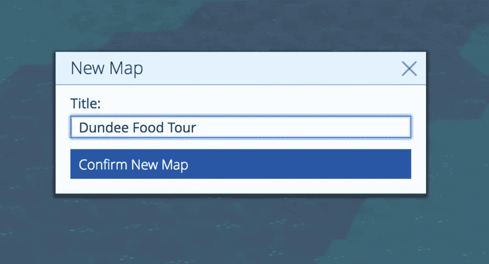
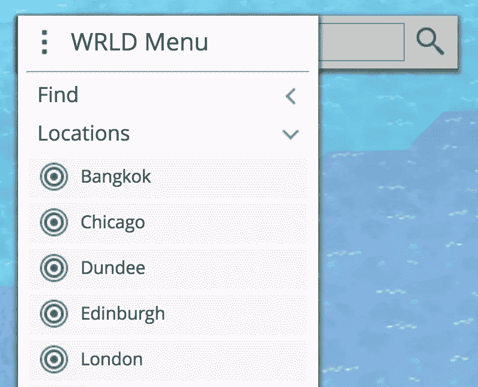
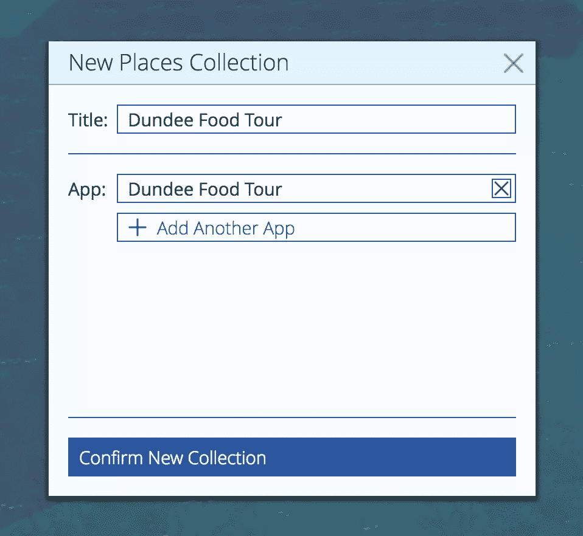
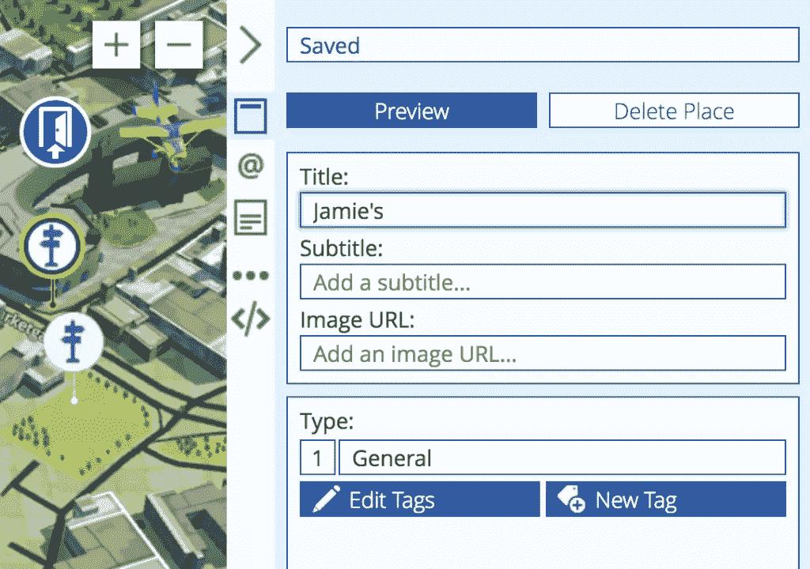
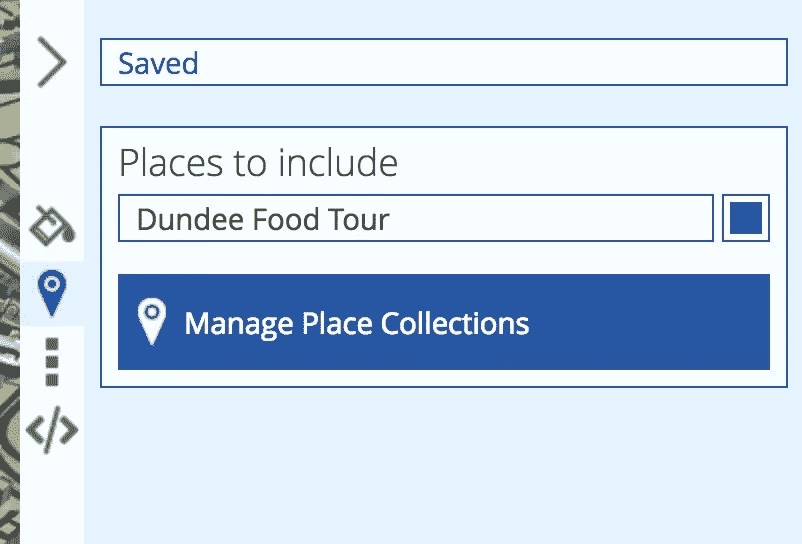
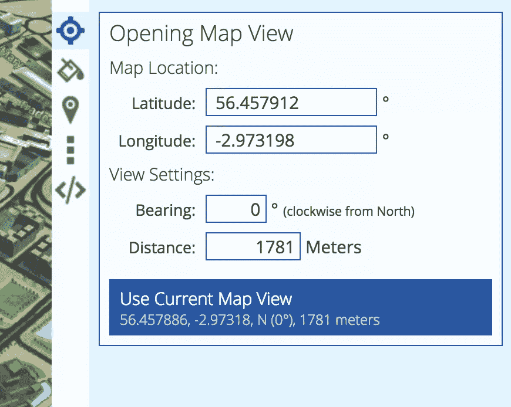

# 如何与 WRLD 一起打造蔻驰假日橱窗

> 原文：<https://www.sitepoint.com/how-to-build-a-coach-holiday-showcase-with-wrld/>

*本文是与 [WRLD](https://www.wrld3d.com/?utm_source=sitepoint&utm_medium=referral&utm_campaign=sp-a6-how-to-build-a-coach-holiday-showcase-with-wrld&utm_content=text-sp-home-1) 合作创作的。感谢您对使 SitePoint 成为可能的合作伙伴的支持。*

自 2000 年代末以来，地图一直是网络的主要内容，如今比以往任何时候都更加无处不在。它们有多种用途，从补充公司的联系页面到绘制地理区域内的名胜古迹。随着计算能力变得越来越便宜，3D 地图越来越受欢迎，它可以展示建筑物的规模和周围地形的性质，为这种体验增添了一点新奇感，并提供了实际的好处。

3D 地图的供应商之一是 WRLD。纽约、伦敦、巴黎和曼谷等主要城市都是使用真实地理数据以 3D 方式生成的。这些数据可以用来创作包含兴趣点和其他有用元数据的自定义地图，由于他们的[传单](http://leafletjs.com/)驱动的 JavaScript 库，可以用几行代码将它们放入网页；这个工作流将是我们文章的重点。

使用 WRLD 的地图设计器，我们将构建一个长途汽车假期的地图，然后我们将它集成到 Node.js 支持的网站中。

## 入门指南

在我们使用 WRLD 的地图设计器之前，我们必须[注册](https://accounts.wrld3d.com/users/sign_up/?utm_source=sitepoint&utm_medium=referral&utm_campaign=sp-a6-how-to-build-a-coach-holiday-showcase-with-wrld&utm_content=text-sp-register)。创建并验证您的帐户后登录。

导航到[地图设计器](https://mapdesigner.wrld3d.com/portal/latest/?utm_source=sitepoint&utm_medium=referral&utm_campaign=sp-a6-how-to-build-a-coach-holiday-showcase-with-wrld&utm_content=text-sp-map-designer)。该页面将列出您已经创建的所有地图，并允许您创建新的地图。点击*创建地图*启动设计器。

我们将一起创建一个邓迪美食之旅的地图。点击左边的*新地图*，在合成的*新地图*模式中，输入标题*邓迪美食之旅*，然后点击*确认新地图*。



现在我们已经创建了我们的地图，我们需要选择一个开始的位置。单击搜索输入旁边的菜单按钮，单击*位置*，然后选择 Dundee。



## 添加我们的第一名

要在地图上添加位置，我们必须使用 WRLD 的 Places Designer，它有助于创建可以导入和重用的地点集。

在右侧，单击地点标记图标，然后是*管理地点集合*。这将在相同的地理位置打开设计器。让我们通过点击*新地点集合*来添加我们的第一个地点集合。将标题设置为*邓迪美食之旅*，然后添加对我们的邓迪美食之旅应用程序的引用，这将把地点集合与我们的地图链接起来。使用*确认新系列*完成此工作。



点击搜索框旁边的*新地点标记*。邓迪美食之旅的建筑上应该会出现一个标记，但是如果需要的话，可以把它拖到位。在右边的窗格中，输入 Dundee Food Tour 的标题—这将自动保存。



按照这种方法添加尽可能多的地方，一旦你觉得已经足够了，就返回地图设计器。我们的新集合应该已经被检测到并自动包含在我们的地图中，但是我们可以通过单击右侧的 places 标记并选择我们的 place set 来手动配置它。



在我们在网站上展示地图之前，我们应该设定一个起点。拖动并缩放地图，直到找到最佳视图，然后使用右边的十字准线图标，打开*打开地图视图*表单，并点击*使用当前地图视图*。



## 包括网站上的地图

尽管 WRLD 提供了令人印象深刻的详细 3D 模型，但该平台的真正力量是将地图嵌入网站和其他应用程序的能力。除了公开各种用于直接查询数据的 HTTP APIs，还有用于在许多平台上渲染地图的库，包括 iOS、Android 和 web。我们将使用 [wrld.js](https://github.com/wrld3d/wrld.js) 库，这也是 npm 上的[库。](https://www.npmjs.com/package/wrld.js)

### 安装

我们将添加地图的样板网站可以在 [GitHub](https://github.com/jamesseanwright/wrld-tours) 找到。请克隆此存储库并安装所需的依赖项:

```
git clone https://github.com/jamesseanwright/wrld-tours.git
cd wrld-tours
nvm install # this will install the version of Node.js found in .nvmrc. Make sure nvm is installed
npm i 
```

要验证项目是否按预期工作，运行`npm run watch`；这将使用 [nodemon](https://github.com/remy/nodemon) 启动项目，当有任何更改时会自动重启。在你的浏览器中打开[http://localhost:8001/trips](http://localhost:8001/trips)，你应该会看到一个只有一个项目的旅行列表。

### 获取和配置您的开发者令牌

我们的应用程序将使用来自 WRLD 的两个 HTTP APIs 的数据，这两个 API 受到开发人员令牌的保护。要获得您的令牌，请登录并前往[我的帐户](https://accounts.wrld3d.com/#account?utm_source=sitepoint&utm_medium=referral&utm_campaign=sp-a6-how-to-build-a-coach-holiday-showcase-with-wrld&utm_content=text-sp-my-account)部分，然后单击*开发者令牌*选项卡；一定要抄下来。


在我们 app 的代码库中，打开`server`目录下的`config.json`，将你的 token 粘贴为`devToken`的值；该属性将用于进行下一步中提到的 API 调用。

```
{
    "devToken": "insert your dev token here"
} 
```

### 调用 WRLD 的 HTTP APIs

在编辑器中打开项目，并转到`server`目录中的`trips.json`文件。这是我们网站上列出的所有可用行程的散列图，用连字符分隔。这些都可以通过`/trips`路线到达，所以我们可以通过 [`/trips/dundee-food-tour`](http://localhost:8001/trips/dundee-food-tour) 到达邓迪美食之旅。您会注意到邓迪美食之旅的条目有两个空属性，`mapSceneId and poiSetId`。我们稍后将回到这个问题。

让我们看看获取地图数据的客户端代码。打开`TripView.js` ( **非 TripView <ins>s</ins> 。js** )并学习`onNavigatedTo`方法。这将调用服务器提供给客户端的两个端点:

```
const [mapScene, poiSet] = await Promise.all([
    callEndpoint(endpoints.mapScene),
    callEndpoint(endpoints.poiSet),
]); 
```

这些并不直接指向 WRLD API。相反，它们是由我们自己的服务器公开的，这样我们的开发者令牌就不会泄露给浏览器。让我们来看看`server/apiRouter.js`中的这些路线:

```
router.get('/mapscenes/:id', (req, res) => {
    res.status(404).send();
});

router.get('/pois/:poiSetId', (req, res) => {
    res.status(404).send();
}); 
```

目前，他们表现得好像不存在一样。为了实现它们，我们可以使用已经导入的`request`模块将我们的请求转发给各自的 WRLD API，并将其流回浏览器:

```
router.get('/mapscenes/:id', (req, res) => {
    request.get(`https://wrld.mp/v1.1/mapscenes/${req.params.id}?token=${config.devToken}`)
        .pipe(res);
});

router.get('/pois/:poiSetId', (req, res) => {
    request.get(`https://poi.wrld3d.com/v1.1/poisets/${req.params.poiSetId}/pois/?token=${config.devToken}`)
        .pipe(res);
}); 
```

每当客户端 JavaScript 为一次旅行进行评估时，它将使用相关的 id 调用这些端点，使开发人员令牌远离浏览器。

### 验证我们的端点

为了检查这是否有效，我们可以直接调用我们自己的 API 端点。为了获得我们的地图场景和地点集合各自的 id，我们可以用我们的开发者令牌调用 WRLD API 目录，即:

*   `https://wrld.mp/v1.1/mapscenes/?token=[your dev token]`
*   `https://poi.wrld3d.com/v1.1/poisets/?token=[your dev token]`

然后，我们可以获取`id`属性，并将它们传递给我们自己的本地端点，例如 http://localhost:8001/API/map scenes/10786 和 http://localhost:8001/API/pois/4149。如果我们已经正确地实现了这些路由，那么我们应该从 WRLD API 接收数据。

### 更新行程定义

返回到`trips.json`文件。还记得两个空属性吗，`mapSceneId`和`poiSetId`？将它们各自的值设置为您为地图场景和地点集合获取的 id，例如:

```
"mapSceneId": "10597",
"poiSetId": "4160" 
```

### 渲染地图

我们现在准备将 API 数据绘制到浏览器呈现的地图上。让我们回到`TripView.js`文件。

在对我们的端点(即`Promise.all([...`)的调用下面，用这些精确的参数调用`wrld.map`:

```
const map = wrld.map(document.querySelector('.map-container'), mapScene.api_key, mapScene); 
```

使用 wrld.js，我们将它作为`wrld`导入到这个文件中，我们将我们的地图渲染到一个带有`.map-container`类的`HTMLDivElement`中，传递 API 键和由我们的`/api/mapscene`端点返回的地图数据。如果您在浏览器中打开邓迪美食之旅旅行页面(即[http://localhost:8001/trips/Dundee-Food-Tour](http://localhost:8001/trips/dundee-food-tour))，您应该会看到我们的地图以及预期的打开视图。

### 添加我们的地点收藏

最后，我们将在地图上为集合中的每个地方添加标记。在`TripView`中，实现`addPointsToMap`方法:

```
static addPointsToMap(map, points) {
    points.forEach(({ lat, lon, title, height_offset }) => {
        const popup = wrld.popup({
            elevation: height_offset,
            closeOnClick: false,
            closeButton: false,
        });

        popup.setLatLng([lat, lon])
            .setContent(title)
            .addTo(map);
    });
} 
```

这里，我们获取由`/api/pois`端点返回的原始点数据，并将它们映射到地图标记中，根据`wrld.popup`方法的需要转换它们。

确保传递给`onNavigatedTo`底部的`TripView.addPointsToMap`的第一个参数命名正确，即:

```
const map = wrld.map(document.querySelector('.map-container'), mapScene.api_key, mapScene);

TripView.addPointsToMap(map, poiSet); 
```

在浏览器中重新加载页面后，我们会发现这些点已经添加到地图中，并附有每个地点的名称。

## 摘要

基于网络的地图可以很容易地表达各种环境中的信息，其中我们已经实现了一个面向消费者的焦点。通过 WRLD 和几行 JavaScript，我们增强了网站的体验，从而增加了潜在的参与度。我希望这已经展示了网络地图的多功能性和重要性。

## 分享这篇文章