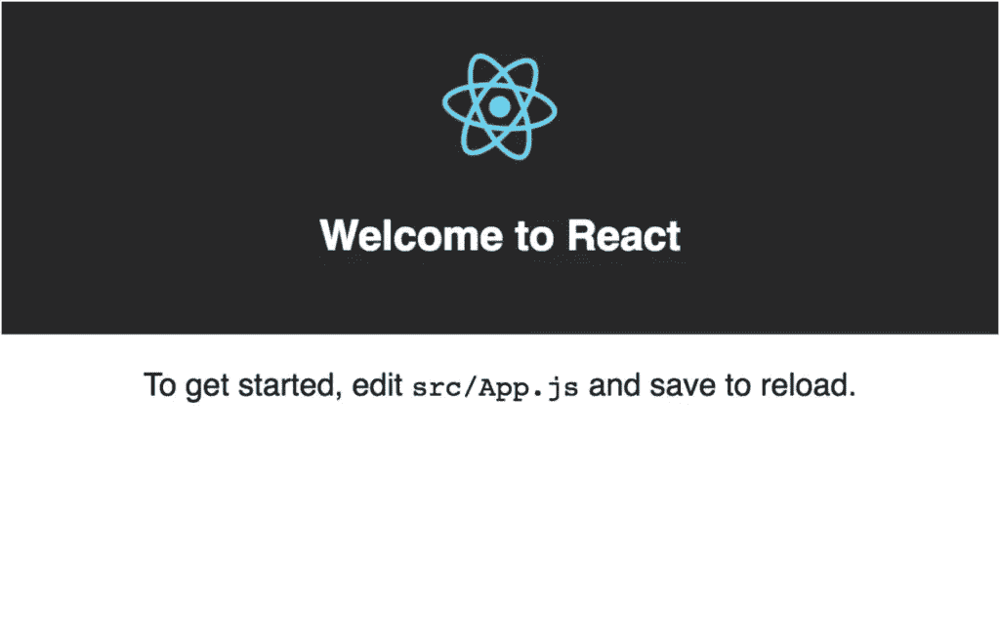
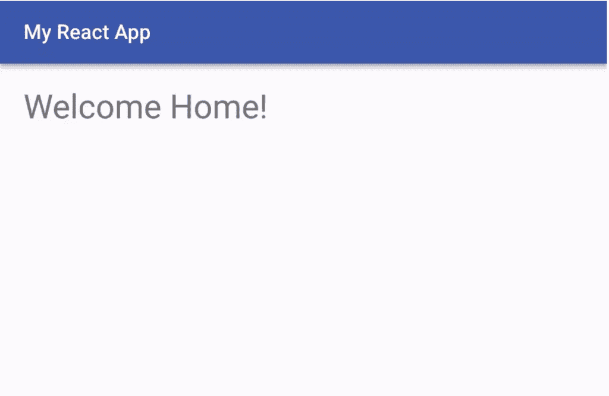
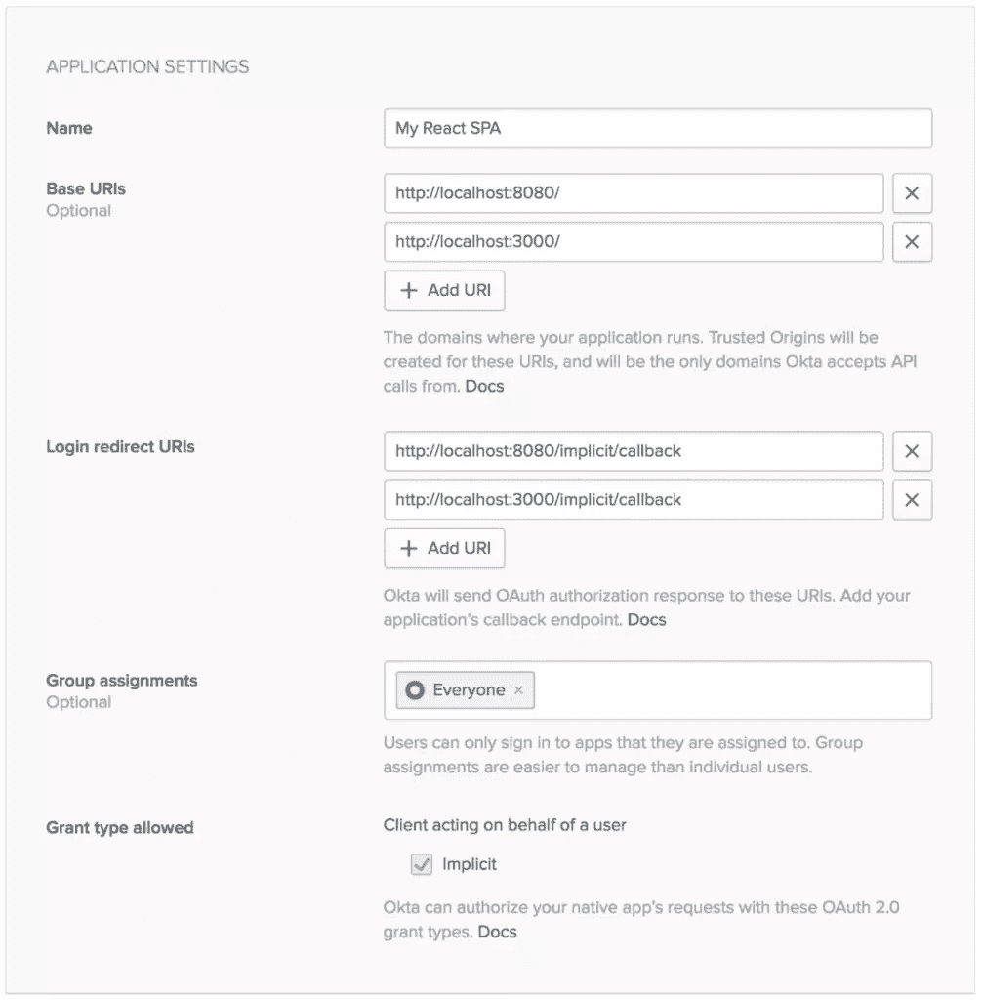
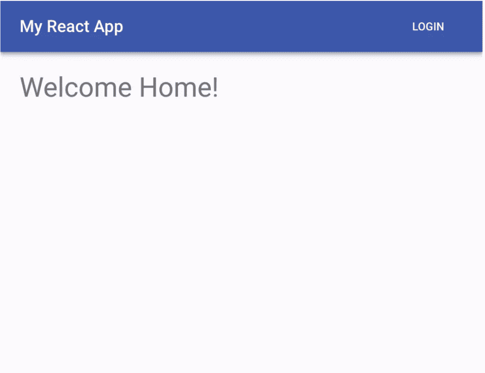
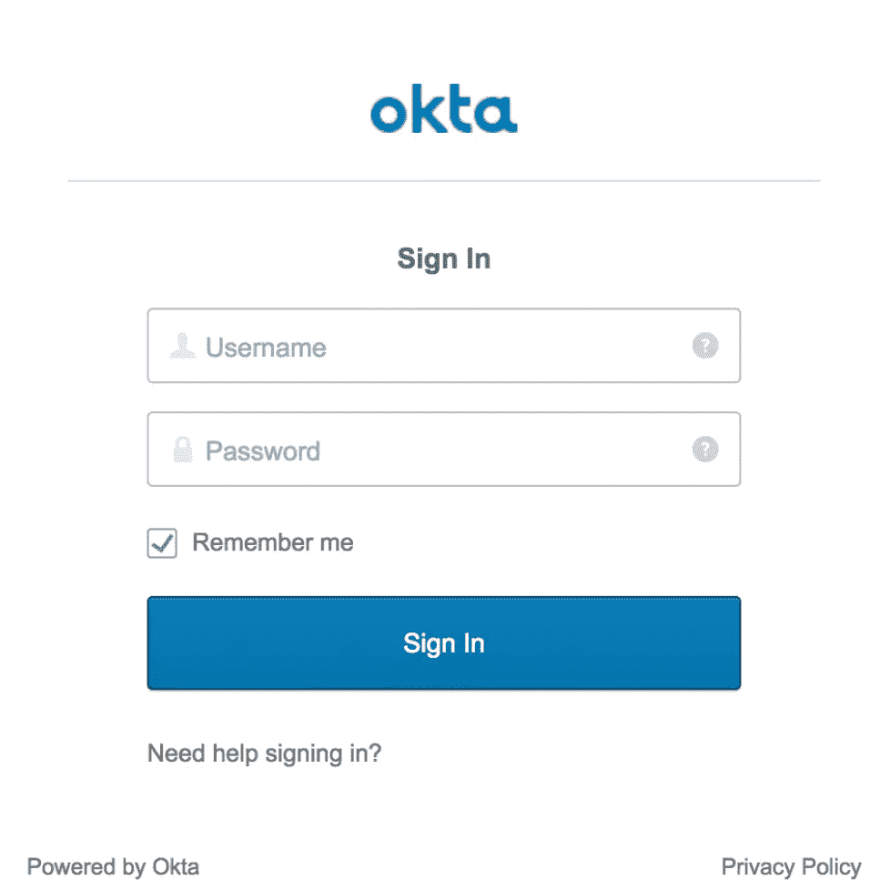
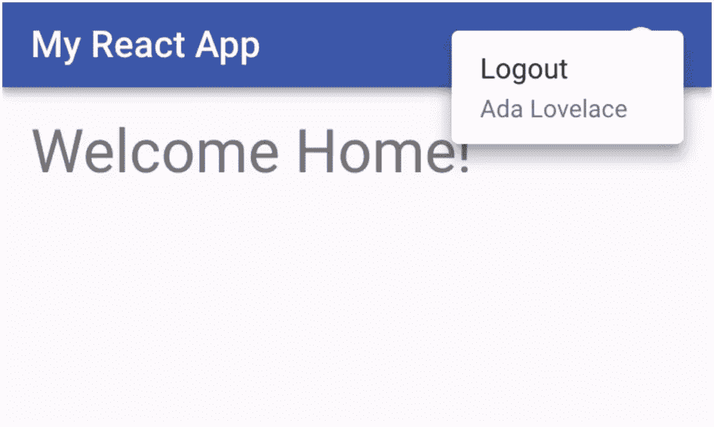
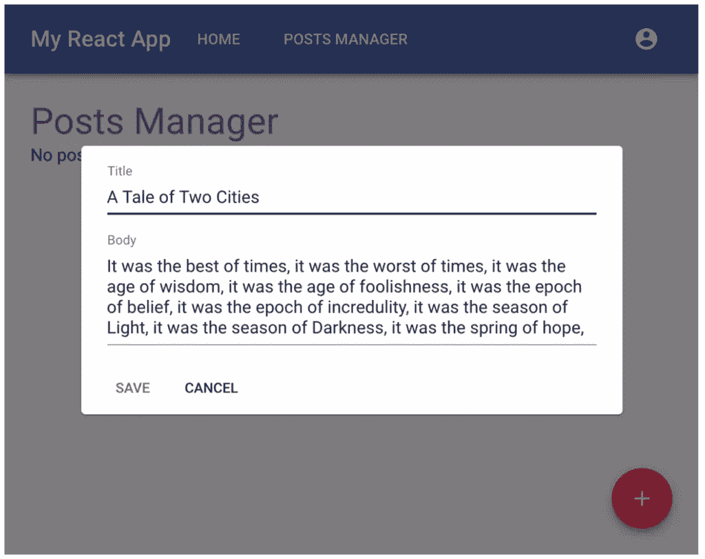
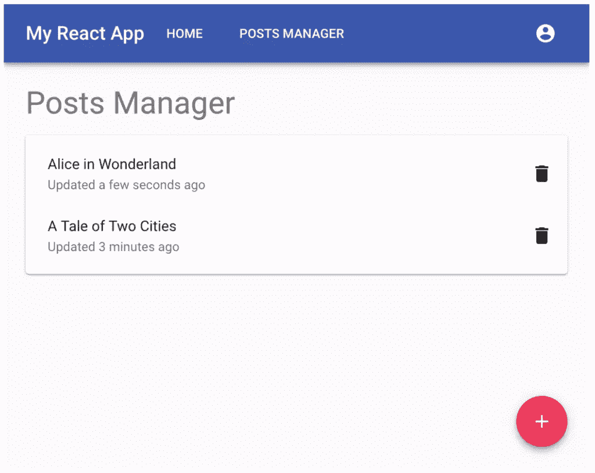

# 用 Node 和 React 构建一个基本的 CRUD 应用程序

> 原文：<https://www.sitepoint.com/build-a-basic-crud-app-with-node-and-react/>

*这篇文章最初发表在[Okta 开发者博客](https://developer.okta.com/blog/2018/07/10/build-a-basic-crud-app-with-node-and-react)上。感谢您对使 SitePoint 成为可能的合作伙伴的支持。*

今天有很多 JavaScript 框架。似乎每个月我都会听到一个新的消息。它们都有各自的优势，通常都是为了用现有的框架解决某种问题。到目前为止，我最喜欢使用的是 React。其中最棒的一点是 React 生态系统中有多少开源组件和库，所以您有很多选择。如果你优柔寡断，这真的很难做到，但是如果你喜欢按自己的方式做事的自由，那么反应可能是你最好的选择。

在本教程中，我将带您在 React 中创建一个前端 web 应用程序，在 Node 中创建一个后端 REST API 服务器。前端将有一个主页和一个帖子管理器，帖子管理器隐藏在安全的用户认证后面。作为一项附加的安全措施，后台也不允许你创建或编辑帖子，除非你通过了正确的身份验证。

教程将使用 [Okta 的 OpenID Connect (OIDC)](https://developer.okta.com/docs/api/resources/oidc) 来处理认证。在前端， [Okta React SDK](https://github.com/okta/okta-oidc-js/tree/master/packages/okta-react) 将用于请求令牌并在请求中提供给服务器。在后端， [Okta JWT 验证器](https://github.com/okta/okta-oidc-js/tree/master/packages/jwt-verifier)将确保用户被正确认证，否则抛出错误。

后端将用作为服务器的 [Express](https://www.expressjs.com/) 编写，用 [Sequelize](http://docs.sequelizejs.com/) 建模和存储数据，用 [Epilogue](https://github.com/dchester/epilogue) 快速创建一个没有大量样板文件的 REST API。

## 为什么要反应？

React 是过去几年中最受欢迎的 JavaScript 库之一。它背后的一个最大的概念，也是使它如此快速的原因，是使用一个虚拟 DOM(文档对象模型，或 DOM，是描述网页布局的东西)并批量对真实 DOM 进行小的更新。React 并不是第一个这样做的库，现在也有不少，但它确实让这个想法流行起来。这个想法是 DOM 很慢，但是 JavaScript 很快，所以您只需说出您希望最终输出是什么样子，然后在后台对 DOM 做出这些更改。如果不需要进行更改，那么它不会影响 DOM。如果只有一个小的文本字段发生变化，它将只修补那个元素。

React 通常也与 JSX 联系在一起，尽管没有 JSX 也可以使用 React。JSX 允许你在 JavaScript 中混合 HTML。不用使用模板来定义 HTML 并将这些值绑定到视图模型，您可以用 JavaScript 编写所有内容。值可以是普通的 JavaScript 对象，而不是需要解释的字符串。您还可以编写可重用的 React 组件，这些组件最终看起来就像代码中的任何其他 HTML 元素。

下面是一些 JSX 代码的例子，应该很容易理解:

```
const Form = () => (
  <form>
    <label>
      Name
      <input value="Arthur Dent" />
    </label>
    <label>
      Answer to life, the universe, and everything
      <input type="number" value={42} />
    </label>
  </form>
);

const App = () => (
  <main>
    <h1>Welcome, Hitchhiker!</h1>
    <Form />
  </main>
); 
```

…如果您用普通的 JavaScript 编写相同的代码，而不使用 JSX，它看起来会是这样:

```
const Form = () => React.createElement(
  "form",
  null,
  React.createElement(
    "label",
    null,
    "Name",
    React.createElement("input", { value: "Arthur Dent" })
  ),
  React.createElement(
    "label",
    null,
    "Answer to life, the universe, and everything",
    React.createElement("input", { type: "number", value: 42 })
  )
);

const App = () => React.createElement(
  "main",
  null,
  React.createElement(
    "h1",
    null,
    "Welcome, Hitchhiker!"
  ),
  React.createElement(Form, null)
); 
```

我发现 JSX 的形式更容易阅读，但这只是，你知道，我的看法，伙计。

## 创建您的 React 应用程序

开始使用 React 的最快方法是使用 [Create React App](https://github.com/facebook/create-react-app) ，这是一个生成渐进式 web 应用(PWA)的工具，所有的脚本和样本都整齐地隐藏在一个叫做`react-scripts`的东西后面，所以你可以专注于编写代码。它也有各种不错的开发特性，比如每当你做了改变就更新代码，以及为生产编译它的脚本。你可以使用`npm`或`yarn`，但在本教程中我将使用`yarn`。

要安装`create-react-app`和`yarn`，只需运行:

```
npm i -g create-react-app@1.5.2 yarn@1.7.0 
```

**注意**:我会添加版本号来帮助这篇文章适应未来。不过一般来说，你可以省去版本号(例如`npm i -g create-react-app`)。

现在用以下命令引导您的应用程序:

```
create-react-app my-react-app
cd my-react-app
yarn start 
```

默认应用程序现在应该运行在端口 3000 上。请在`http://localhost:3000`查看。



## 在“与材料反应”用户界面中创建一个基本主页

为了让事情看起来更好，而不需要写很多额外的 CSS，你可以使用一个 UI 框架。Material UI 是 React 的一个伟大框架，它实现了[谷歌的 Material Design](https://material.io/) 原则。

添加依赖项:

```
yarn add @material-ui/core@1.3.1 
```

素材推荐 Roboto 字体。您可以通过编辑`public/index.html`并在`head`标签中添加下面一行来将其添加到您的项目中:

```
<link rel="stylesheet" href="https://fonts.googleapis.com/css?family=Roboto:300,400,500"> 
```

您可以将组件分离到单独的文件中，以帮助组织事物。首先，在你的`src`目录下创建几个新文件夹:`components`和`pages`

```
mkdir src/components
mkdir src/pages 
```

现在创建一个`AppHeader`组件。这将作为导航栏链接到页面，以及显示标题和你是否登录。

**src/components/app header . js**

```
import React from 'react';
import {
  AppBar,
  Toolbar,
  Typography,
} from '@material-ui/core';

const AppHeader = () => (
  <AppBar position="static">
    <Toolbar>
      <Typography variant="title" color="inherit">
        My React App
      </Typography>
    </Toolbar>
  </AppBar>
);

export default AppHeader; 
```

还要创建一个主页:

**src/pages/Home.js**

```
import React from 'react';
import {
  Typography,
} from '@material-ui/core';

export default () => (
  <Typography variant="display1">Welcome Home!</Typography>
); 
```

现在继续，实际上只是清空示例应用程序，用以下内容替换`src/App.js`:

**src/App.js**

```
import React, { Fragment } from 'react';
import {
  CssBaseline,
  withStyles,
} from '@material-ui/core';

import AppHeader from './components/AppHeader';
import Home from './pages/Home';

const styles = theme => ({
  main: {
    padding: 3 * theme.spacing.unit,
    [theme.breakpoints.down('xs')]: {
      padding: 2 * theme.spacing.unit,
    },
  },
});

const App = ({ classes }) => (
  <Fragment>
    <CssBaseline />
    <AppHeader />
    <main className={classes.main}>
      <Home />
    </main>
  </Fragment>
);

export default withStyles(styles)(App); 
```

Material UI 使用 JSS(JavaScript 中日益流行的 CSS 趋势中的许多风格之一)，这就是`withStyles`所提供的。

`CssBaseline`组件将为页面添加一些不错的 CSS 默认值(例如，从正文中移除边距)，所以我们不再需要`src/index.css`。你也可以删除一些其他文件，现在我们已经删除了大部分的`Hello World`演示应用。

```
rm src/index.css src/App.css src/logo.svg 
```

在`src/index.js`中，删除对`index.css`的引用(显示`import './index.css';`的行)。此时，添加以下内容作为`src/index.js`的最后一行，以打开热模块重新加载，这将使您所做的更改在应用程序中自动更新，而无需刷新整个页面:

```
if (module.hot) module.hot.accept(); 
```

此时，您的应用程序应该如下所示:



## 使用 Okta 为您的 Node + React 应用程序添加身份验证

如果没有安全的[身份管理](https://developer.okta.com/product/user-management/)，你永远不会把你的新应用发布到互联网上，对吗？好吧，Okta 使这比你可能习惯的更容易和更可伸缩。Okta 是一种云服务，允许开发人员创建、编辑和安全存储用户帐户和用户帐户数据，并将它们与一个或多个应用程序连接。我们的 API 使您能够:

*   [认证](https://developer.okta.com/product/authentication/)和[授权](https://developer.okta.com/product/authorization/)您的用户
*   存储用户数据
*   执行基于密码的[社交登录](https://developer.okta.com/authentication-guide/social-login/)
*   通过[多重身份验证](https://developer.okta.com/use_cases/mfa/)保护您的应用
*   还有更多！查看我们的[产品文档](https://developer.okta.com/documentation/)

如果你还没有，那么[注册一个永远免费的开发者账户](https://developer.okta.com/signup/)。登录你的开发者控制台，导航到**应用**，然后点击**添加应用**。选择**单页 App** ，然后点击**下一步**。

因为 Create React App 默认运行在端口 3000 上，所以您应该将其添加为基本 URI 和登录重定向 URI。您的设置应该如下所示:



点击**完成**保存你的应用，然后复制你的**客户端 ID** 并作为一个变量粘贴到你的项目根目录下的一个名为`.env.local`的文件中。这将允许您在代码中访问该文件，而无需在源代码管理中存储凭据。您还需要添加您的组织 URL(不带`-admin`后缀)。环境变量(除了`NODE_ENV`之外)需要以`REACT_APP_`开头，以便 Create React App 读取它们，因此文件应该看起来像这样:

**.env.local**

```
REACT_APP_OKTA_CLIENT_ID={yourClientId}
REACT_APP_OKTA_ORG_URL=https://{yourOktaDomain} 
```

向 React 应用添加 Okta 认证的最简单方法是使用 [Okta 的 React SDK](https://github.com/okta/okta-oidc-js/tree/master/packages/okta-react) 。您还需要添加路由，这可以使用 [React 路由器](https://reacttraining.com/react-router/)来完成。我还会让你开始添加图标到应用程序中(现在作为一个头像图标来显示你已经登录)。材质 UI 提供了材质图标，但是在另一个包中，所以你也需要添加它。运行以下命令添加这些新的依赖项:

```
yarn add @okta/okta-react@1.0.2 react-router-dom@4.3.1 @material-ui/icons@1.1.0 
```

为了让 routes 在 React 中正常工作，您需要将整个应用程序包装在一个`Router`中。类似地，要允许在应用程序中的任何地方访问身份验证，您需要将应用程序包装在 Okta 提供的`Security`组件中。Okta 也需要访问路由器，所以`Security`组件应该嵌套在路由器内部。您应该修改您的`src/index.js`文件，如下所示:

**src/index.js**

```
import React from 'react';
import ReactDOM from 'react-dom';
import { BrowserRouter } from 'react-router-dom';
import { Security } from '@okta/okta-react';

import App from './App';
import registerServiceWorker from './registerServiceWorker';

const oktaConfig = {
  issuer: `${process.env.REACT_APP_OKTA_ORG_URL}/oauth2/default`,
  redirect_uri: `${window.location.origin}/implicit/callback`,
  client_id: process.env.REACT_APP_OKTA_CLIENT_ID,
};

ReactDOM.render(
  <BrowserRouter>
    <Security {...oktaConfig}>
      <App />
    </Security>
  </BrowserRouter>,
  document.getElementById('root'),
);
registerServiceWorker();

if (module.hot) module.hot.accept(); 
```

现在在`src/App.js`中，你可以使用`Route` s。这些告诉应用程序，如果当前的 URL 与给定的`path`匹配，就只呈现某个组件。将您的`Home`组件替换为一个路由，该路由仅在指向根 URL ( `/`)时呈现组件，并为`/implicit/callback`路径呈现 Okta 的`ImplicitCallback`组件。

**src/App.js**

```
--- a/src/App.js
+++ b/src/App.js
@@ -1,4 +1,6 @@
 import React, { Fragment } from 'react';
+import { Route } from 'react-router-dom';
+import { ImplicitCallback } from '@okta/okta-react';
 import {
   CssBaseline,
   withStyles,
@@ -21,7 +23,8 @@ const App = ({ classes }) => (
     <CssBaseline />
     <AppHeader />
     <main className={classes.main}>
-      <Home />
+      <Route exact path="/" component={Home} />
+      <Route path="/implicit/callback" component={ImplicitCallback} />
     </main>
   </Fragment>
 ); 
```

接下来，您需要一个登录按钮。这个文件有点大，因为它包含一些逻辑来检查用户是否经过身份验证。我将首先向您展示整个组件，然后介绍每个部分的功能:

**src/components/log in button . js**

```
import React, { Component } from 'react';
import {
  Button,
  IconButton,
  Menu,
  MenuItem,
  ListItemText,
} from '@material-ui/core';
import { AccountCircle } from '@material-ui/icons';
import { withAuth } from '@okta/okta-react';

class LoginButton extends Component {
  state = {
    authenticated: null,
    user: null,
    menuAnchorEl: null,
  };

  componentDidUpdate() {
    this.checkAuthentication();
  }

  componentDidMount() {
    this.checkAuthentication();
  }

  async checkAuthentication() {
    const authenticated = await this.props.auth.isAuthenticated();
    if (authenticated !== this.state.authenticated) {
      const user = await this.props.auth.getUser();
      this.setState({ authenticated, user });
    }
  }

  login = () => this.props.auth.login();
  logout = () => {
    this.handleMenuClose();
    this.props.auth.logout();
  };

  handleMenuOpen = event => this.setState({ menuAnchorEl: event.currentTarget });
  handleMenuClose = () => this.setState({ menuAnchorEl: null });

  render() {
    const { authenticated, user, menuAnchorEl } = this.state;

    if (authenticated == null) return null;
    if (!authenticated) return <Button color="inherit" onClick={this.login}>Login</Button>;

    const menuPosition = {
      vertical: 'top',
      horizontal: 'right',
    };

    return (
      <div>
        <IconButton onClick={this.handleMenuOpen} color="inherit">
          <AccountCircle />
        </IconButton>
        <Menu
          anchorEl={menuAnchorEl}
          anchorOrigin={menuPosition}
          transformOrigin={menuPosition}
          open={!!menuAnchorEl}
          onClose={this.handleMenuClose}
        >
          <MenuItem onClick={this.logout}>
            <ListItemText
              primary="Logout"
              secondary={user && user.name}
            />
          </MenuItem>
        </Menu>
      </div>
    );
  }
}

export default withAuth(LoginButton); 
```

React 组件有状态管理的概念。每个组件都可以被传递道具(在像`<input type="number" value={3} />`、`type`和`number`这样的组件中会被认为是道具)。它们也可以保持自己的状态，状态有一些初始值，可以用一个叫做`setState`的函数来改变。任何时候`props`或`state`改变，组件将重新呈现，如果需要对 DOM 进行改变，它们就会发生。在一个组件中，您可以分别使用`this.props`或`this.state`来访问它们。

在这里，您将创建一个新的 React 组件并设置初始状态值。直到你查询`auth`道具，你才知道是否有用户，所以你把`authenticated`和`user`设置为`null`。Material UI 将使用`menuAnchorEl`来知道在哪里锚定让你注销用户的菜单。

```
class LoginButton extends Component {
  state = {
    authenticated: null,
    user: null,
    menuAnchorEl: null,
  };

  // ...
} 
```

React 组件也有自己的生命周期方法，这些方法是可以用来在组件生命周期的某些阶段触发动作的钩子。在这里，当组件第一次挂载时，您将检查用户是否已经过身份验证，如果是，则获取关于用户的更多细节，比如他们的姓名和电子邮件地址。每当组件更新时，您也希望重新运行这个检查，但是您需要注意的是，只有在情况不同时才更新状态，否则您会陷入一个无限循环(组件更新，所以您给组件新的值，组件更新，您给它新的值，等等。).`withAuth`函数是一个高阶组件(HOC ),它包装了原始组件并返回另一个包含`auth`属性的组件。

```
class LoginButton extends Component {
  // ...

  componentDidUpdate() {
    this.checkAuthentication();
  }

  componentDidMount() {
    this.checkAuthentication();
  }

  async checkAuthentication() {
    const authenticated = await this.props.auth.isAuthenticated();
    if (authenticated !== this.state.authenticated) {
      const user = await this.props.auth.getUser();
      this.setState({ authenticated, user });
    }
  }

  // ...
}

export default withAuth(LoginButton); 
```

以下函数是辅助函数，稍后用于用户登录或注销，以及打开或关闭菜单。将函数写成箭头函数可以确保`this`是指组件的实例化。如果没有这个，如果一个函数在组件之外的某个地方被调用(例如在一个`onClick`事件中)，你将失去对组件的访问，并且不能在组件上执行函数或者访问`props`或者`state`。

```
class LoginButton extends Component {
  // ...

  login = () => this.props.auth.login();
  logout = () => {
    this.handleMenuClose();
    this.props.auth.logout();
  };

  handleMenuOpen = event => this.setState({ menuAnchorEl: event.currentTarget });
} 
```

所有的 React 组件必须有一个`render()`功能。这就是告诉 React 在屏幕上显示什么，即使它不应该显示任何东西(在这种情况下，您可以返回`null`)。

当您还不确定身份验证状态时，您可以只返回`null`,这样按钮就不会被呈现。一旦 Okta `this.props.auth.isAuthenticated()`返回，该值要么是`true`要么是`false`。如果是`false`，你会想要提供一个`Login`按钮。如果用户已经登录，您可以显示一个头像图标，该图标有一个带有注销按钮的下拉菜单。

```
class LoginButton extends Component {
  // ...

  render() {
    const { authenticated, user, menuAnchorEl } = this.state;

    if (authenticated == null) return null;
    if (!authenticated) return <Button color="inherit" onClick={this.login}>Login</Button>;

    const menuPosition = {
      vertical: 'top',
      horizontal: 'right',
    };

    return (
      <div>
        <IconButton onClick={this.handleMenuOpen} color="inherit">
          <AccountCircle />
        </IconButton>
        <Menu
          anchorEl={menuAnchorEl}
          anchorOrigin={menuPosition}
          transformOrigin={menuPosition}
          open={!!menuAnchorEl}
          onClose={this.handleMenuClose}
        >
          <MenuItem onClick={this.logout}>
            <ListItemText
              primary="Logout"
              secondary={user && user.name}
            />
          </MenuItem>
        </Menu>
      </div>
    );
  }
} 
```

下一步是将这个`LoginButton`组件添加到您的标题中。为了将它显示在页面的右侧，您可以放置一个空的间隔符`div`，它的`flex`值为 1。因为其他对象没有被告知要弯曲，所以间隔将尽可能多地占据空间。像这样修改你的`src/components/AppHeader.js`文件:

**src/components/app header . js**

```
--- a/src/components/AppHeader.js
+++ b/src/components/AppHeader.js
@@ -3,16 +3,27 @@ import {
   AppBar,
   Toolbar,
   Typography,
+  withStyles,
 } from '@material-ui/core';

-const AppHeader = () => (
+import LoginButton from './LoginButton';
+
+const styles = {
+  flex: {
+    flex: 1,
+  },
+};
+
+const AppHeader = ({ classes }) => (
   <AppBar position="static">
     <Toolbar>
       <Typography variant="title" color="inherit">
         My React App
       </Typography>
+      <div className={classes.flex} />
+      <LoginButton />
     </Toolbar>
   </AppBar>
 );

-export default AppHeader;
+export default withStyles(styles)(AppHeader); 
```

现在，您应该可以使用右上角的按钮登录和退出您的应用程序。



当您单击登录按钮时，您将被重定向到您的 Okta 组织 URL 以处理身份验证。您可以使用在开发人员控制台中使用的相同凭据登录。



成功登录后，您将返回到您的应用程序，现在应该会看到一个图标，显示您已登录。如果你点击图标，你会在注销按钮上看到你的名字。点击该按钮会让您停留在主页上，但会让您再次注销。




## 添加节点 REST API 服务器

既然用户可以安全地进行身份验证，那么您可以构建 REST API 服务器来对 post 模型执行 CRUD 操作。此时，您需要向您的项目添加相当多的依赖项:

```
yarn add @okta/jwt-verifier@0.0.12 body-parser@1.18.3 cors@2.8.4 dotenv@6.0.0 epilogue@0.7.1 express @4.16.3 sequelize@4.38.0 sqlite@2.9.2
yarn add -D npm-run-all@4.1.3 
```

在 src 目录下为服务器创建一个新文件夹:

```
mkdir src/server 
```

现在创建一个新文件`src/server/index.js`。为了简单起见，我们只使用一个文件，但是你可以在这个文件夹中有一个完整的文件子树。将它保存在一个单独的文件夹中可以让你观察这个子目录中的变化，并且只在这个文件发生变化时才重新加载服务器，而不是在任何时候`src`中的任何文件发生变化。同样，我将发布整个文件，然后解释下面的一些关键部分。

**src/server/index.js**

```
require('dotenv').config({ path: '.env.local' });

const express = require('express');
const cors = require('cors');
const bodyParser = require('body-parser');
const Sequelize = require('sequelize');
const epilogue = require('epilogue');
const OktaJwtVerifier = require('@okta/jwt-verifier');

const oktaJwtVerifier = new OktaJwtVerifier({
  clientId: process.env.REACT_APP_OKTA_CLIENT_ID,
  issuer: `${process.env.REACT_APP_OKTA_ORG_URL}/oauth2/default`,
});

const app = express();
app.use(cors());
app.use(bodyParser.json());

app.use(async (req, res, next) => {
  try {
    if (!req.headers.authorization) throw new Error('Authorization header is required');

    const accessToken = req.headers.authorization.trim().split(' ')[1];
    await oktaJwtVerifier.verifyAccessToken(accessToken);
    next();
  } catch (error) {
    next(error.message);
  }
});

const database = new Sequelize({
  dialect: 'sqlite',
  storage: './test.sqlite',
});

const Post = database.define('posts', {
  title: Sequelize.STRING,
  body: Sequelize.TEXT,
});

epilogue.initialize({ app, sequelize: database });

epilogue.resource({
  model: Post,
  endpoints: ['/posts', '/posts/:id'],
});

const port = process.env.SERVER_PORT || 3001;

database.sync().then(() => {
  app.listen(port, () => {
    console.log(`Listening on port ${port}`);
  });
}); 
```

下面加载了我们在 React 应用程序中使用的环境变量。这样我们可以使用相同的 env 变量，并且只需要在一个地方设置它们。

```
require('dotenv').config({ path: '.env.local' }); 
```

这将设置 HTTP 服务器并添加一些设置以允许跨源资源共享(CORS ),并将自动解析 JSON。

```
const app = express();
app.use(cors());
app.use(bodyParser.json()); 
```

您可以在这里检查用户是否得到了正确的身份验证。首先，如果没有`Authorization`头，就抛出一个错误，这就是发送授权令牌的方式。令牌实际上会看起来像`Bearer aLongBase64String`。您希望将 Base 64 字符串传递给 Okta JWT 验证器，以检查用户是否经过了正确的身份验证。验证者将首先向发行者发送一个请求，以获取有效签名的列表，然后在本地检查令牌是否有效。在后续的请求中，这可以在本地完成，除非它发现一个还没有签名的声明。

如果一切正常，对`next()`的调用告诉 Express 继续处理请求。但是，如果声明无效，将会引发一个错误。然后，错误被传递到`next`中，告诉 Express 出错了。然后，Express 将向客户端发回一个错误，而不是继续。

```
app.use(async (req, res, next) => {
  try {
    if (!req.headers.authorization) throw new Error('Authorization header is required');

    const accessToken = req.headers.authorization.trim().split(' ')[1];
    await oktaJwtVerifier.verifyAccessToken(accessToken);
    next();
  } catch (error) {
    next(error.message);
  }
}); 
```

这是你设置序列的地方。这是创建数据库模型的一种快捷方式。您可以使用各种各样的数据库进行排序，但是在这里您可以使用 SQLite 快速启动并运行，而不需要任何其他依赖。

```
const database = new Sequelize({
  dialect: 'sqlite',
  storage: './test.sqlite',
});

const Post = database.define('posts', {
  title: Sequelize.STRING,
  body: Sequelize.TEXT,
}); 
```

尾声与序列式和快速式配合得很好。它像胶水一样将两者结合在一起，仅用几行代码就创建了一组 CRUD 端点。首先，用 Express 应用程序和 Sequelize 数据库模型初始化 Epilogue。接下来，您告诉它为`Post`模型创建您的端点:一个用于帖子列表，它将有`POST`和`GET`方法；一个用于单个帖子，将有`GET`、`PUT`和`DELETE`方法。

```
epilogue.initialize({ app, sequelize: database });

epilogue.resource({
  model: Post,
  endpoints: ['/posts', '/posts/:id'],
}); 
```

服务器的最后一部分是告诉 Express 开始监听 HTTP 请求的地方。您需要告诉 sequelize 初始化数据库，当它完成时，Express 就可以开始监听您决定的端口。默认情况下，由于 React 应用程序正在使用`3000`，我们将只添加一个使其成为端口`3001`。

```
const port = process.env.SERVER_PORT || 3001;

database.sync().then(() => {
  app.listen(port, () => {
    console.log(`Listening on port ${port}`);
  });
}); 
```

现在你可以对`package.json`做一些小的改动，让它更容易同时运行前端和后端。替换默认的`start`脚本并添加几个其他脚本，这样您的脚本部分看起来就像这样:

**package.json**

```
 "scripts": {
    "start": "npm-run-all --parallel watch:server start:web",
    "start:web": "react-scripts start",
    "start:server": "node src/server",
    "watch:server": "nodemon --watch src/server src/server",
    "build": "react-scripts build",
    "test": "react-scripts test --env=jsdom",
    "eject": "react-scripts eject"
  } 
```

现在你可以简单地运行`yarn start`，服务器和 React 应用程序将同时运行，并在相关更改发生时重新加载。如果出于某种原因需要更改端口，可以分别用`PORT`和`SERVER_PORT`环境变量更改 React 应用程序的端口和服务器的端口。比如`PORT=8080 SERVER_PORT=8081 yarn start`。

## 将帖子管理器页面添加到 Node + React 应用程序中

现在您有了一个节点后端来管理您的帖子，您可以通过添加另一个页面来链接 React 前端。这将发送获取、创建、编辑和删除帖子的请求。它还会随每个请求一起发送所需的授权令牌，这样服务器就知道您是一个有效的用户。

React Router 的一个优点是它允许您在 URL 中使用变量。这将允许我们在 URL 中使用一篇文章的 ID，所以你可以去`/posts/2`查看第 2 篇文章。考虑到这一点，您可以创建一个无论何时当您在页面的那个部分时都会打开的模态，要关闭该模态，您需要做的就是导航回`/posts`。

React 中的表单可能有点麻烦。您可以使用一个基本的`form`元素，但是您还需要监听`onChange`事件，更新组件的状态，并在`input`元素上设置新的值。为了使表单更容易，至少有一些库，但是我将向您展示如何使用 [React Final Form](https://github.com/final-form/react-final-form) 来删除许多样板文件。

对于一些辅助函数，你还需要[重组](https://github.com/acdlite/recompose)、[洛达什](https://lodash.com/)和[时刻](https://momentjs.com/)。您可以使用以下命令将它们全部安装为依赖项:

```
yarn add react-final-form@3.6.4 final-form@4.8.3 recompose@0.27.1 lodash@4.17.10 moment@2.22.2 
```

### 创建帖子编辑器组件

创建一个将在 Post Manager 页面中使用的`PostEditor`组件。目前，帖子只有`title`和`body`字段。

**src/components/post editor . js**

```
import React from 'react';
import {
  withStyles,
  Card,
  CardContent,
  CardActions,
  Modal,
  Button,
  TextField,
} from '@material-ui/core';
import { compose } from 'recompose';
import { withRouter } from 'react-router-dom';
import { Form, Field } from 'react-final-form';

const styles = theme => ({
  modal: {
    display: 'flex',
    alignItems: 'center',
    justifyContent: 'center',
  },
  modalCard: {
    width: '90%',
    maxWidth: 500,
  },
  modalCardContent: {
    display: 'flex',
    flexDirection: 'column',
  },
  marginTop: {
    marginTop: 2 * theme.spacing.unit,
  },
});

const PostEditor = ({ classes, post, onSave, history }) => (
  <Form initialValues={post} onSubmit={onSave}>
    {({ handleSubmit }) => (
      <Modal
        className={classes.modal}
        onClose={() => history.goBack()}
        open
      >
        <Card className={classes.modalCard}>
          <form onSubmit={handleSubmit}>
            <CardContent className={classes.modalCardContent}>
              <Field name="title">
                {({ input }) => <TextField label="Title" autoFocus {...input} />}
              </Field>
              <Field name="body">
                {({ input }) => (
                  <TextField
                    className={classes.marginTop}
                    label="Body"
                    multiline
                    rows={4}
                    {...input}
                  />
                )}
              </Field>
            </CardContent>
            <CardActions>
              <Button size="small" color="primary" type="submit">Save</Button>
              <Button size="small" onClick={() => history.goBack()}>Cancel</Button>
            </CardActions>
          </form>
        </Card>
      </Modal>
    )}
  </Form>
);

export default compose(
  withRouter,
  withStyles(styles),
)(PostEditor); 
```

### 创建帖子管理器页面组件

您还需要一个页面来呈现文章列表，并注入文章编辑器。创建一个新文件`src/pages/PostsManager.js`。我将再次发布整个文件，然后带您浏览每一部分。

**src/pages/postsmanager . js**

```
import React, { Component, Fragment } from 'react';
import { withAuth } from '@okta/okta-react';
import { withRouter, Route, Redirect, Link } from 'react-router-dom';
import {
  withStyles,
  Typography,
  Button,
  IconButton,
  Paper,
  List,
  ListItem,
  ListItemText,
  ListItemSecondaryAction,
} from '@material-ui/core';
import { Delete as DeleteIcon, Add as AddIcon } from '@material-ui/icons';
import moment from 'moment';
import { find, orderBy } from 'lodash';
import { compose } from 'recompose';

import PostEditor from '../components/PostEditor';

const styles = theme => ({
  posts: {
    marginTop: 2 * theme.spacing.unit,
  },
  fab: {
    position: 'absolute',
    bottom: 3 * theme.spacing.unit,
    right: 3 * theme.spacing.unit,
    [theme.breakpoints.down('xs')]: {
      bottom: 2 * theme.spacing.unit,
      right: 2 * theme.spacing.unit,
    },
  },
});

const API = process.env.REACT_APP_API || 'http://localhost:3001';

class PostsManager extends Component {
  state = {
    loading: true,
    posts: [],
  };

  componentDidMount() {
    this.getPosts();
  }

  async fetch(method, endpoint, body) {
    try {
      const response = await fetch(`${API}${endpoint}`, {
        method,
        body: body && JSON.stringify(body),
        headers: {
          'content-type': 'application/json',
          accept: 'application/json',
          authorization: `Bearer ${await this.props.auth.getAccessToken()}`,
        },
      });
      return await response.json();
    } catch (error) {
      console.error(error);
    }
  }

  async getPosts() {
    this.setState({ loading: false, posts: await this.fetch('get', '/posts') });
  }

  savePost = async (post) => {
    if (post.id) {
      await this.fetch('put', `/posts/${post.id}`, post);
    } else {
      await this.fetch('post', '/posts', post);
    }

    this.props.history.goBack();
    this.getPosts();
  }

  async deletePost(post) {
    if (window.confirm(`Are you sure you want to delete "${post.title}"`)) {
      await this.fetch('delete', `/posts/${post.id}`);
      this.getPosts();
    }
  }

  renderPostEditor = ({ match: { params: { id } } }) => {
    if (this.state.loading) return null;
    const post = find(this.state.posts, { id: Number(id) });

    if (!post && id !== 'new') return <Redirect to="/posts" />;

    return <PostEditor post={post} onSave={this.savePost} />;
  };

  render() {
    const { classes } = this.props;

    return (
      <Fragment>
        <Typography variant="display1">Posts Manager</Typography>
        {this.state.posts.length > 0 ? (
          <Paper elevation={1} className={classes.posts}>
            <List>
              {orderBy(this.state.posts, ['updatedAt', 'title'], ['desc', 'asc']).map(post => (
                <ListItem key={post.id} button component={Link} to={`/posts/${post.id}`}>
                  <ListItemText
                    primary={post.title}
                    secondary={post.updatedAt && `Updated ${moment(post.updatedAt).fromNow()}`}
                  />
                  <ListItemSecondaryAction>
                    <IconButton onClick={() => this.deletePost(post)} color="inherit">
                      <DeleteIcon />
                    </IconButton>
                  </ListItemSecondaryAction>
                </ListItem>
              ))}
            </List>
          </Paper>
        ) : (
          !this.state.loading && <Typography variant="subheading">No posts to display</Typography>
        )}
        <Button
          variant="fab"
          color="secondary"
          aria-label="add"
          className={classes.fab}
          component={Link}
          to="/posts/new"
        >
          <AddIcon />
        </Button>
        <Route exact path="/posts/:id" render={this.renderPostEditor} />
      </Fragment>
    );
  }
}

export default compose(
  withAuth,
  withRouter,
  withStyles(styles),
)(PostsManager); 
```

默认情况下，后端设置为在本地机器的端口 3001 上运行，因此这将它设置为后备。但是，如果您想在另一台服务器或另一个端口上运行它，您需要一种方法来编辑它。你可以用`API=https://api.example.com yarn start:web`运行应用程序来覆盖它。

```
const API = process.env.REACT_APP_API || 'http://localhost:3001'; 
```

当组件第一次挂载时，您还没有任何数据。您可能需要一些指示来表明页面仍在加载，所以将状态设置为`loading: true`可以让您稍后知道这一点。将初始 posts 设置为一个空数组使得后面的代码更简单，因为你可以总是假设你有一个数组，即使它是空的。然后，一旦组件安装完毕，您将需要获取一组帖子。

```
class PostsManager extends Component {
  state = {
    loading: true,
    posts: [],
  };

  componentDidMount() {
    this.getPosts();
  }

  // ...
} 
```

这里您设置了一个简单的助手函数，向服务器发送请求。这使用了所有现代浏览器内置的`fetch`功能。助手接受一个`method`(例如`get`、`post`、`delete`)、一个`endpoint`(这里可以是`/posts`或类似`/posts/3`的特定帖子)和一个`body`(一些可选的 JSON 值，在本例中是帖子内容)。

这还设置了一些头来告诉后端它发送的任何主体都将是 JSON 格式，并且它通过从 Okta 获取访问令牌来设置授权头。

```
class PostsManager extends Component {
  // ...

  async fetch(method, endpoint, body) {
    try {
      const response = await fetch(`${API}${endpoint}`, {
        method,
        body: body && JSON.stringify(body),
        headers: {
          'content-type': 'application/json',
          accept: 'application/json',
          authorization: `Bearer ${await this.props.auth.getAccessToken()}`,
        },
      });
      return await response.json();
    } catch (error) {
      console.error(error);
    }
  }

  // ...
} 
```

这里是您调用`fetch`助手函数的地方。

您有一个获取 post(`getPosts`)的函数，它也将把`loading`设置为`false`，因为它是组件第一次加载时被调用的函数。

还有另一个保存文章的功能，它处理添加新文章以及修改现有文章的情况。由于帖子将基于路线以模态加载，一旦帖子更新，浏览器被告知返回到`/posts`。

最后一个功能是删除一个帖子。`confirm`函数实际上阻塞了用户界面，所以通常不推荐它用于这样的应用程序，但是对于演示来说它工作得很好。这是一个内置的浏览器功能，它只是给出一个弹出窗口要求你确认，并根据你的回答返回`true`或`false`。

保存或删除一篇文章后，再次调用`getPosts`命令以确保所有文章都是最新的。

```
class PostsManager extends Component {
  // ...

  async getPosts() {
    this.setState({ loading: false, posts: await this.fetch('get', '/posts') });
  }

  savePost = async (post) => {
    if (post.id) {
      await this.fetch('put', `/posts/${post.id}`, post);
    } else {
      await this.fetch('post', '/posts', post);
    }

    this.props.history.goBack();
    this.getPosts();
  }

  async deletePost(post) {
    if (window.confirm(`Are you sure you want to delete "${post.title}"`)) {
      await this.fetch('delete', `/posts/${post.id}`);
      this.getPosts();
    }
  }

  // ...
} 
```

`renderPostEditor`函数将被传递到一个`Route`中，这样它只在你查看一个特定的帖子时才呈现。如果你还在加载帖子，你不会想要渲染任何东西，所以你可以返回`null`。在文章加载之后，您可以使用`id`参数来查找匹配的文章。如果出于某种原因你没有找到，你应该重定向回`/posts`页面，因为它可能是一个错误的网址(也许那篇文章已经被删除了)。

唯一的例外是一个特殊的路由`/posts/new`，它将用于创建一个新的帖子。在这种情况下，你不想重定向。现在您已经有了一个 post 模型，您可以从上面呈现`PostEditor`组件，并将模型传递给它以在模态中呈现。

```
class PostsManager extends Component {
  // ...

  renderPostEditor = ({ match: { params: { id } } }) => {
    if (this.state.loading) return null;
    const post = find(this.state.posts, { id: Number(id) });

    if (!post && id !== 'new') return <Redirect to="/posts" />;

    return <PostEditor post={post} onSave={this.savePost} />;
  };

  // ...
} 
```

这是主要的渲染函数。当没有文章时，它应该显示一条消息“没有文章可显示”，除非文章仍在加载。你可以选择渲染一个装载符号，但是现在什么都不渲染就足够了。

当有帖子时，它会呈现一个简单的列表，主要文本是帖子的标题，一些潜台词是上次更新的时间。更新后的文本使用`moment`来呈现类似`10 minutes ago`的用户友好字符串，而不是原始时间戳。

通过添加`component={Link}`和`to`值，您实际上是将列表项变成了一个链接，将您带到文章的路径(例如`/posts/5`)。你可以做同样的事情来发送你创建一个新的职位，通过创建浮动动作按钮(FAB)，你可以在许多材料设计应用程序上看到。

```
class PostsManager extends Component {
  // ...

  render() {
    const { classes } = this.props;

    return (
      <Fragment>
        <Typography variant="display1">Posts Manager</Typography>
        {this.state.posts.length > 0 ? (
          <Paper elevation={1} className={classes.posts}>
            <List>
              {orderBy(this.state.posts, ['updatedAt', 'title'], ['desc', 'asc']).map(post => (
                <ListItem key={post.id} button component={Link} to={`/posts/${post.id}`}>
                  <ListItemText
                    primary={post.title}
                    secondary={post.updatedAt && `Updated ${moment(post.updatedAt).fromNow()}`}
                  />
                  <ListItemSecondaryAction>
                    <IconButton onClick={() => this.deletePost(post)} color="inherit">
                      <DeleteIcon />
                    </IconButton>
                  </ListItemSecondaryAction>
                </ListItem>
              ))}
            </List>
          </Paper>
        ) : (
          !this.state.loading && <Typography variant="subheading">No posts to display</Typography>
        )}
        <Button
          variant="fab"
          color="secondary"
          aria-label="add"
          className={classes.fab}
          component={Link}
          to="/posts/new"
        >
          <AddIcon />
        </Button>
        <Route exact path="/posts/:id" render={this.renderPostEditor} />
      </Fragment>
    );
  }
} 
```

为了访问 Okta SDK，您需要再次使用`withAuth` HOC。这一次实际上有一些其他的 hoc 要添加，所以您可以使用一个名为`compose` from 的实用函数来用多个 hoc 包装您的组件。

```
export default compose(
  withAuth,
  withRouter,
  withStyles(styles),
)(PostsManager); 
```

### 添加路线和导航链接

好了，你现在在最后冲刺阶段。你只需要告诉应用程序何时呈现文章管理器页面，以及到达那里的链接。

将`PostsManager`页添加到`src/App.js`中。Okta 提供了一个`SecureRoute`组件，它是 React 路由器的`Route`组件的扩展。这将确保如果您尝试转到该页面但没有登录，您将被重定向到登录页面。如果你在那个页面上并退出，你将被重定向到主页。

**src/App.js**

```
--- a/src/App.js
+++ b/src/App.js
@@ -1,6 +1,6 @@
 import React, { Fragment } from 'react';
 import { Route } from 'react-router-dom';
-import { ImplicitCallback } from '@okta/okta-react';
+import { SecureRoute, ImplicitCallback } from '@okta/okta-react';
 import {
   CssBaseline,
   withStyles,
@@ -8,6 +8,7 @@ import {

 import AppHeader from './components/AppHeader';
 import Home from './pages/Home';
+import PostsManager from './pages/PostsManager';

 const styles = theme => ({
   main: {
@@ -24,6 +25,7 @@ const App = ({ classes }) => (
     <AppHeader />
     <main className={classes.main}>
       <Route exact path="/" component={Home} />
+      <SecureRoute exact path="/posts" component={PostsManager} />
       <Route path="/implicit/callback" component={ImplicitCallback} />
     </main>
   </Fragment> 
```

您还需要添加几个链接来访问帖子管理器并返回到主页。您可以在之前制作的 App Header 组件中实现这一点。

**src/components/app header . js**

```
--- a/src/components/AppHeader.js
+++ b/src/components/AppHeader.js
@@ -1,6 +1,8 @@
 import React from 'react';
+import { Link } from 'react-router-dom';
 import {
   AppBar,
+  Button,
   Toolbar,
   Typography,
   withStyles,
@@ -20,6 +22,8 @@ const AppHeader = ({ classes }) => (
       <Typography variant="title" color="inherit">
         My React App
       </Typography>
+      <Button color="inherit" component={Link} to="/">Home</Button>
+      <Button color="inherit" component={Link} to="/posts">Posts Manager</Button>
       <div className={classes.flex} />
       <LoginButton />
     </Toolbar> 
```

## 测试您的 React + Node CRUD 应用程序

现在，您有了一个全功能的单页面应用程序，连接到 REST API 服务器，通过 Okta 的 OIDC 进行身份验证。

现在就开始测试这款应用吧。如果它们还没有运行，确保启动服务器和前端。在您的终端中，从您的项目目录运行`yarn start`。

导航至`http://localhost:3000`。你应该能够随心所欲地添加、编辑、查看和删除帖子！





## 了解关于 React、Node 和 Okta 的更多信息

希望这篇文章对你有所帮助。如果你是新的反应者，也许你离决定你是爱它还是恨它更近了一步。如果你是一个 React 老手，也许你会发现向一个新的或现有的应用程序添加身份验证是多么容易。或者您可能已经了解了 Node。

如果你想查看本文中示例应用的源代码，你可以在[https://github.com/oktadeveloper/okta-react-node-example](https://github.com/oktadeveloper/okta-react-node-example)找到。

如果你仍然渴望更多的内容，Okta 开发者博客上有很多很棒的帖子。这篇文章并不是松散地基于[用 Vue.js 和 Node](https://developer.okta.com/blog/2018/02/15/build-crud-app-vuejs-node) 构建一个基本的 CRUD 应用，如果你有兴趣了解更多关于 Vue.js 的内容，我肯定会推荐你看看这篇文章。

*   [渐进式网络应用的终极指南](https://developer.okta.com/blog/2017/07/20/the-ultimate-guide-to-progressive-web-applications)
*   [用 Node、React 和 Okta 建立用户注册](https://developer.okta.com/blog/2018/02/06/build-user-registration-with-node-react-and-okta)
*   [在 15 分钟内构建带有用户认证的 React 应用](https://developer.okta.com/blog/2017/03/30/react-okta-sign-in-widget)
*   [构建一个 React 原生应用，并使用 OAuth 2.0 进行认证](https://developer.okta.com/blog/2018/03/16/build-react-native-authentication-oauth-2)
*   [教程:用 Node.js 构建一个基本的 CRUD App](https://developer.okta.com/blog/2018/06/28/tutorial-build-a-basic-crud-app-with-node)

一如既往，我们希望听到您的意见。请在评论中或在 Twitter [@oktadev](https://twitter.com/oktadev) 上提出问题或反馈。

*’[用 Node 和 React](https://developer.okta.com/blog/2018/07/10/build-a-basic-crud-app-with-node-and-react) 构建一个基本的 CRUD App 最初发表于 2018 年 7 月 10 日 Okta 开发者博客上。*

## 分享这篇文章