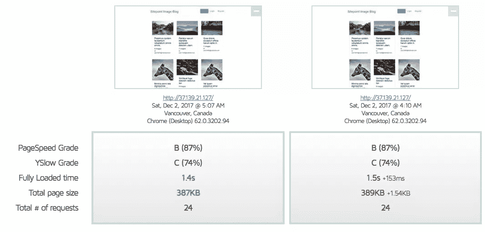
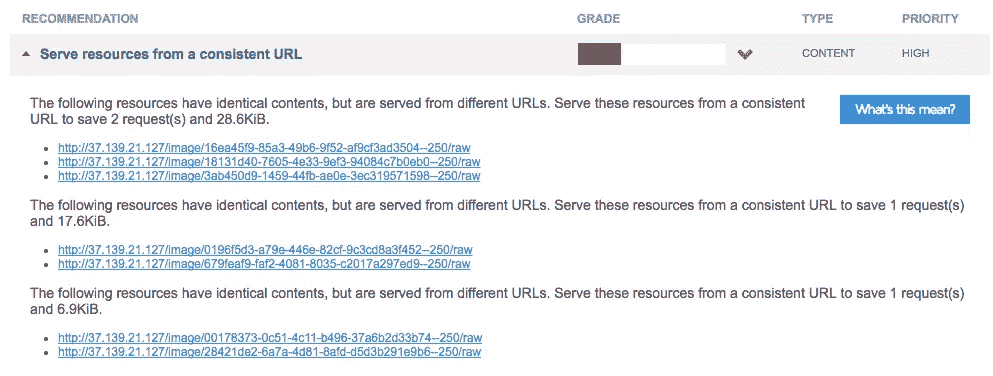
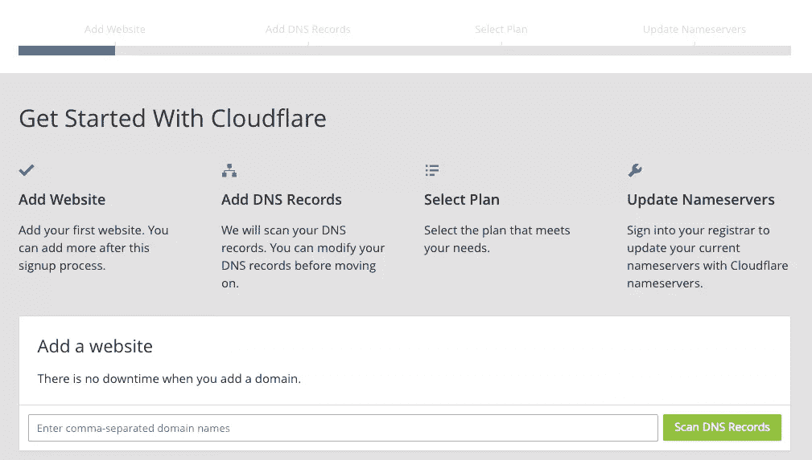
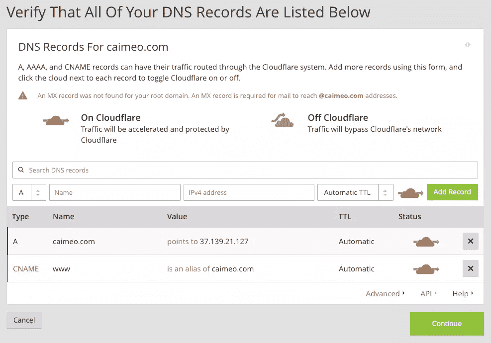
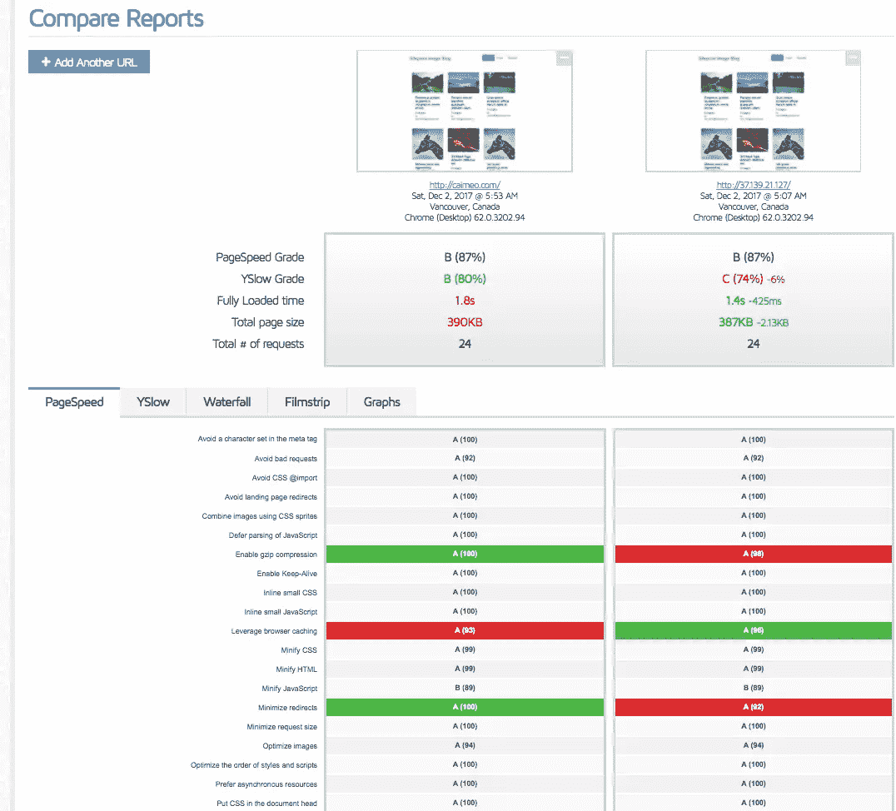
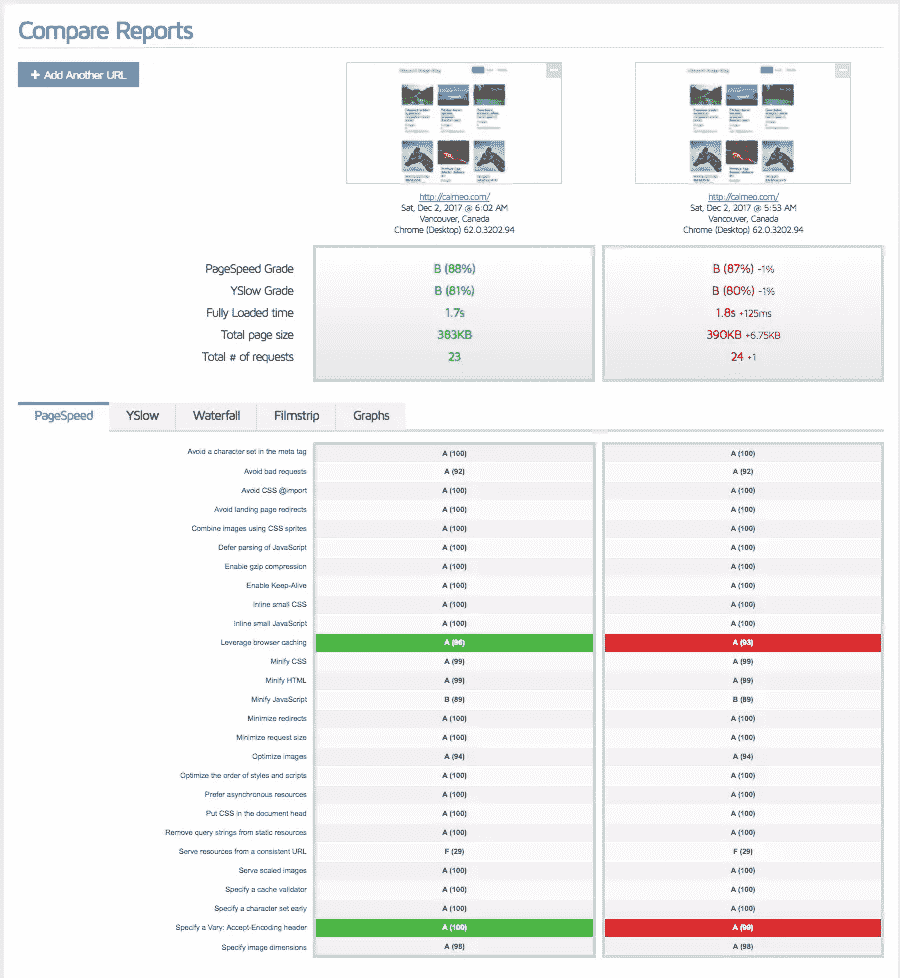
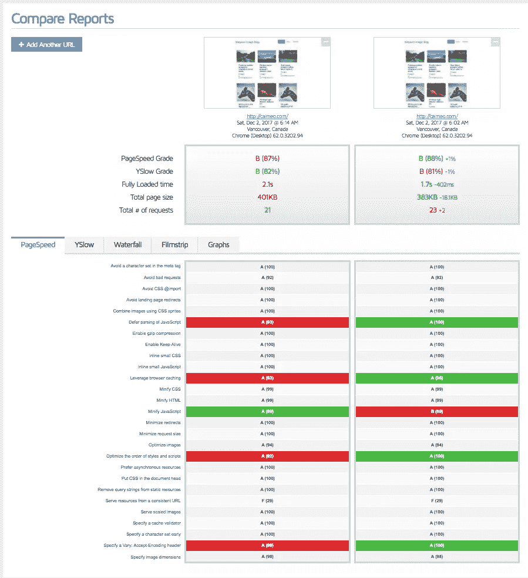
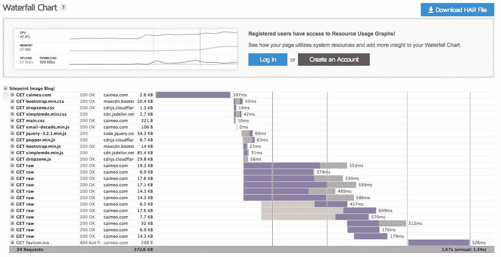
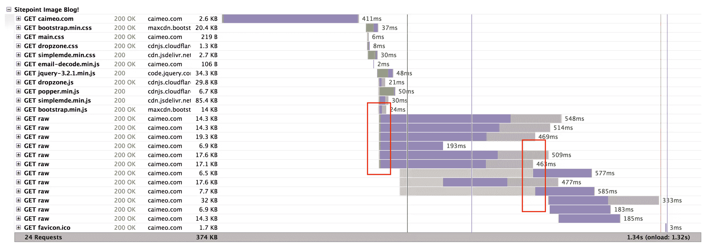

# 如何使用 Varnish 和 Cloudflare 实现最大程度的缓存

> 原文：<https://www.sitepoint.com/how-to-use-varnish-and-cloudflare-for-maximum-caching/>

本文是构建一个示例应用程序——一个多图片画廊博客——的系列文章的一部分，用于性能基准测试和优化。(点击此处查看[回购](https://github.com/sitepoint-editors/multi-image-gallery-blog/)。)

* * *

**正如我们在[这篇报道](https://gtmetrix.com/reports/37.139.21.127/qllqEqzI)中看到的，我们网站的登陆页面加载非常快，总体来说得分很高，但它可以使用另一层缓存甚至 CDN 来做得更好。**

*要了解更多关于 GTMetrix 和其他可用于测量和调试性能的工具，请参见[改善页面加载性能:Pingdom、YSlow 和 GTmetrix](https://www.sitepoint.com/improving-page-load-performance-pingdom-yslow-gtmetrix)* 。

让我们利用我们在之前的 [Varnish 帖子](https://www.sitepoint.com/how-to-boost-your-server-performance-with-varnish)中所学到的知识，以及在[CDN 简介](https://www.sitepoint.com/what-is-a-cdn-and-how-does-it-work)和 [Cloudflare](https://www.sitepoint.com/making-website-faster-safer-cloudflare/) 帖子*中获得的知识，真正地*调整我们服务器的内容交付。

## 光泽面

Varnish 创建的唯一目的是作为常规服务器前的一种超级缓存。

注意:鉴于 Nginx 本身已经是一个非常好的服务器，人们通常会选择其中一个，而不是两个都选。两者兼而有之没有什么坏处，但是你必须小心可能发生的破坏缓存的问题。重要的是正确地设置它们，以便其中一个的缓存不会保持陈旧，而另一个的缓存是新的。这可能导致在不同的时间向不同的访问者显示不同的内容。设置这个有点超出了本文的范围，将在以后的指南中介绍。

我们可以通过执行以下步骤来安装清漆:

```
curl -L https://packagecloud.io/varnishcache/varnish5/gpgkey | sudo apt-key add -
sudo apt-get update
sudo apt-get install -y apt-transport-https 
```

Ubuntu 的当前 repos 列表没有 Varnish 5+可用，因此需要额外的存储库。如果文件`/etc/apt/sources.list.d/varnishcache_varnish5.list`不存在，创建它。添加以下内容:

```
deb https://packagecloud.io/varnishcache/varnish5/ubuntu/ xenial main
deb-src https://packagecloud.io/varnishcache/varnish5/ubuntu/ xenial main 
```

然后，运行:

```
sudo apt-get update
sudo apt-get install varnish
varnishd -V 
```

结果应该是这样的:

```
$ varnishd -V
varnishd (varnish-5.2.1 revision 67e562482)
Copyright (c) 2006 Verdens Gang AS
Copyright (c) 2006-2015 Varnish Software AS 
```

然后，我们将服务器的默认端口更改为 8080。我们这样做是因为 Varnish 将位于端口 80，并根据需要将请求转发到 8080。如果你按照本系列开始时的指示在[家园改进版](https://www.sitepoint.com/quick-tip-get-homestead-vagrant-vm-running/)上进行本地开发，你需要编辑的文件将在`/etc/nginx/sites-available/homestead.app`中。否则很可能会在`/etc/nginx/sites-available/default`里。

```
server {
    listen 8080 default_server;
    listen [::]:8080 default_server ipv6only=on; 
```

接下来，我们将通过编辑`/etc/default/varnish`来配置 Varnish 本身，并用 80:

```
DAEMON_OPTS="-a :80 \
   -T localhost:6082 \
   -f /etc/varnish/default.vcl \
   -S /etc/varnish/secret \
   -s malloc,256m" 
```

同样的事情需要在`/lib/systemd/system/varnish.service`中完成:

```
ExecStart=/usr/sbin/varnishd -j unix,user=vcache -F -a :80 -T localhost:6082 -f /etc/varnish/default.vcl -S /etc/varnish/secret -s malloc,256m 
```

最后，我们可以重启 Varnish 和 Nginx 以使更改生效:

```
sudo service nginx restart
sudo /etc/init.d/varnish stop
sudo /etc/init.d/varnish start
systemctl daemon-reload 
```

最后一个命令是为了让先前编辑的`varnish.service`守护进程设置也能重新加载，否则它将只考虑`/etc/default/varnish`文件的更改。`start` + `stop`程序对于上光是必要的，因为当前有一个错误，除非这样做，否则不能正确释放端口。

将[的结果](https://gtmetrix.com/reports/37.139.21.127/glFx4bp0)与之前的结果进行比较，我们可以看到，由于登录页面已经进行了极大的优化，所以差异非常小。



### 旁注

这两个低等级主要是我们“没有从一致的 URL 提供服务”的结果，正如 GTMetrix 所说:



发生这种情况是因为我们使用随机图像来填充我们的图库，随机样本很小，所以其中一些是重复的。这很好，当网站投入生产时，这不会是一个问题。事实上，这是一个非常罕见的情况，默认情况下，一个网站在生产中比在开发中得分更高。

## 云耀斑

接下来我们来设置 Cloudflare。首先，我们注册一个帐户:



因为 Cloudflare 需要应用一些 DNS 设置，因此需要有一个连接到 IP 地址的域(即，没有办法像我们目前在测试中所做的那样，只使用目标服务器的 IP 地址)，我们应该为此注册一个演示域。我有一个旧域名`caimeo.com`,我可以在这个时候使用，但首先，该域名需要连接到数字海洋水滴的 IP 地址，并带有 A 记录:


然后，Cloudflare 将扫描并复制这些现有记录，如果系统无法识别所有记录，您还可以添加任何缺失的记录。



在流程结束时，需要更新原注册商的域名服务器，以便它们指向 Cloudflare 的域名服务器。此时，Cloudflare 完全控制了您的域(尽管可能需要 24 小时才能传播到所有可能的访问者)。

您可以使用 Cloudflare dashboard 查看应用于给定域的帐户级别和设置。


服务激活后，我们可以将新的 GTMetrix 结果与旧的结果进行比较。



虽然 YSlow 现在喜欢我们的比例增加了 6%，但似乎我们还可以做得更多，因为 Cloudflare 集成显然使我们的网站速度下降了 23%。

首先，让我们尝试打开自动缩小(在 Cloudflare 控制面板中的速度下)并完全清除缓存(在缓存下)。然后，我们将在[比较](https://gtmetrix.com/compare/z0NWEDAx/glFx4bp0)之前运行几次测试，这样缓存就能正常预热。



那更好！更多的测试运行可能会使加载时间更接近最初的 1.4 秒，但让我们也看看 CloudFlare 的 Rocket Loader 工具。它还处于测试阶段，工作原理是将它能找到的所有 JavaScript 捆绑在一起——甚至是外部文件——并异步加载这些文件。然后，它在浏览器中本地缓存这些资源，而不是从远程服务器重新获取它们。对比[这里](https://gtmetrix.com/compare/pl4FTEZ2/z0NWEDAx)。



可悲的是，这还有待改进。YSlow 确实更喜欢我们，因为我们缩小得更好，请求更少，但工具似乎错误地配置了一些以前工作得更好的设置。让我们将其关闭并清除缓存，以前的设置更好。

## 其他可能的调整

### 不要忘记网站图标！

添加一个 favicon 总是一个好主意——更少的 404 请求，它在浏览器中会看起来更好。此外，瀑布屏幕清楚地告诉我们，在这 1.6 秒中，大约有 330 毫秒是用来等待 favicon 的！



嘣！有了我们的网站图标，我们[又砍掉了](https://gtmetrix.com/reports/caimeo.com/3dpHYXBS)300 毫秒。

### Nginx 调整

你可能是跳过 [Nginx 优化一](https://www.sitepoint.com/improving-performance-perception-pingdom-gtmetrix)才来到这个帖子的。建议你也应用那本书的提示。在这篇文章中执行的调整实际上已经应用到了该网站的一个实时版本上，所以是在与那篇文章不同的服务器上。清漆和 Nginx 在这里一前一后调整产生更好的结果:

```
location ~* \.(?:ico|css|js|gif|jpe?g|png|/raw)$ {
    expires 14d;
} 
```


### HTTP/2

考虑用 Varnish 激活 HTTP/2。看到瀑布图中的这些阻挡线了吗？



这是因为它们一次加载几个，而其他的要等前面的加载完成。有了 HTTP/2，这个问题就消失了，整个网站通过同一个连接下载几个文件的速度快多了。一个警告是，该网站需要一个证书。用[让我们加密](https://letsencrypt.org/)，现在实现起来非常简单。另一个警告是，您需要重新构建包含 HTTP/2 模块的 Nginx，因此需要在服务器上做一些调整。最后的警告是，HTTP/2 仍然在 Varnish 的 beta 支持中，可能不应该太依赖*。*

要了解如何配置 Varnish 和 HTTP/2，请参见本教程。

## 结论

我们实施了 Varnish 作为额外的缓存层，并将 Cloudflare 的免费计划作为我们的 CDN，从而大幅提高了我们的 GTMetrix 得分。虽然我们的优化过程对于这么简单的应用程序来说可能有点过头了，但从第一天开始就知道我们的应用程序能够在不中断的情况下每秒处理成千上万的用户，这非常令人放心——所有这些都是在一台 10 美元的服务器上完成的。

如果我们遗漏了任何步骤，而您发现了我们可以做的其他性能技巧，请告诉我们！

## 分享这篇文章