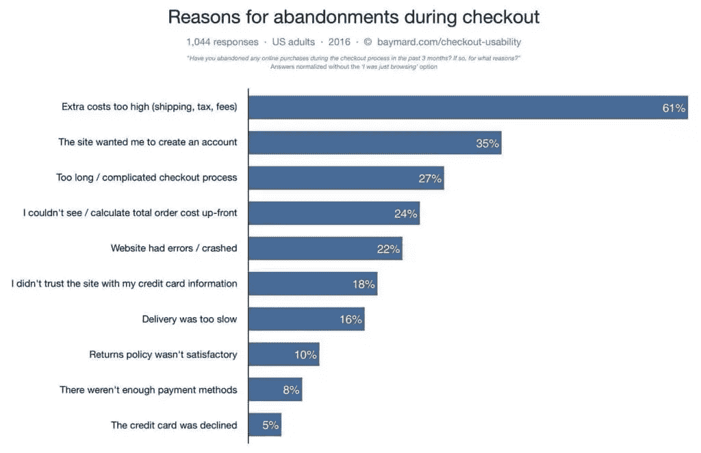
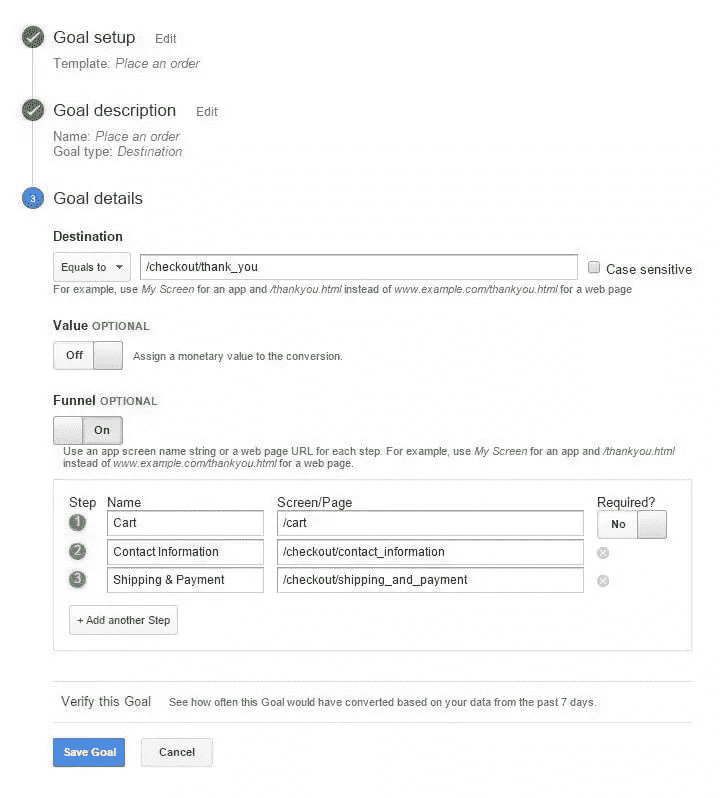
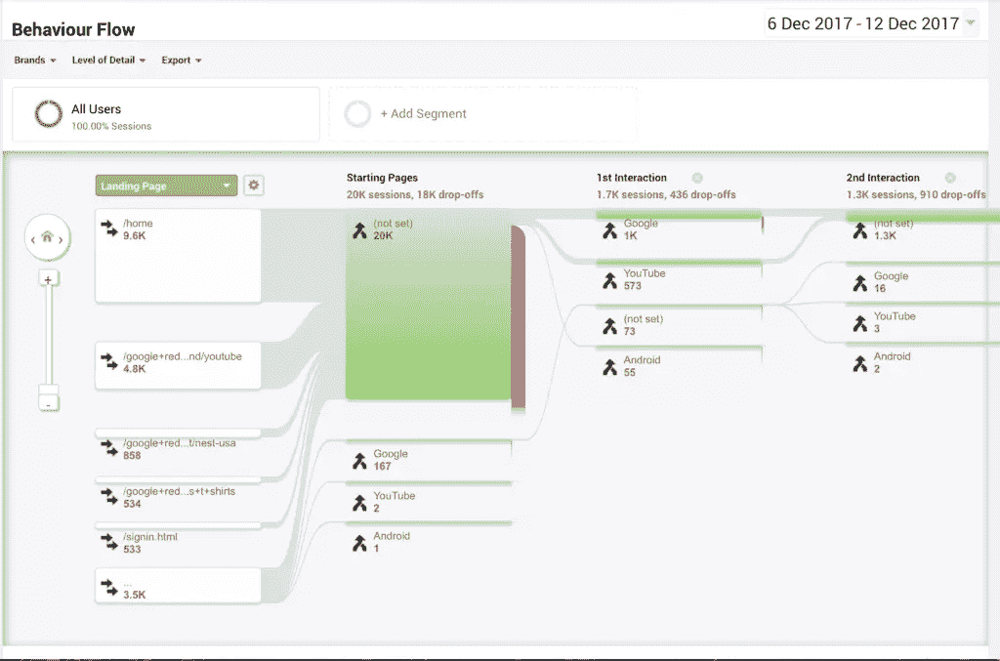

# 分析如何解释你放弃结账

> 原文：<https://www.sitepoint.com/how-analytics-can-explain-your-abandoned-checkouts/>

如果你从事电子商务，你应该知道用户经常在结账时丢弃购物车。事实上，研究表明，购物车的平均弃车率为 *67.91%* ，尽管在某些情况下可能高达 80%。很烦吧？

用户为什么要这么做？答案就在你的分析中。

人们出于各种原因放弃签出，这些原因可能因用户人口统计、地理位置等因素而异。它甚至可能是意外运费的冲击，或者用户不相信他们的敏感信息在你的网站上是安全的。

当然，UX 在其中也扮演了重要的角色。用户讨厌:

*   损坏的功能
*   混乱的结账流程
*   退房前注册。

四分之三的放弃结账是由于次优的用户体验，但是这些原因中的哪一个正在侵蚀你的收入呢？

像 Google Analytics，Hotjar，Fullstory，Crazy Egg 和 Optimizely 这样的工具可以帮助我们破译是什么导致了我们的购物车被遗弃，并提出有效的解决方案来改善 UX。

事实上，你可以轻松回收 5-10%的废弃手推车。是不是很酷？

首先，我们将检测用户在哪里离开我们的网站，然后*为什么*他们离开我们的网站，然后我们如何改善 UX，使未来的用户不会离开我们的网站。结果呢？更多收入！

同样值得注意的是，虽然 59%的购物体验发生在移动设备上，但只有 15%的美元花在了移动设备上。这表明一些最常见的 UX 缺点是特定于移动设备的。

## 我们可以用什么工具来分析用户行为？

通过分析用户人口统计和用户行为，你可以改善网站的用户体验。尽管有很多工具可以让你做到这一点，但我今天将使用 Google Analytics(免费)和 Crazy Egg(平价)来浏览这个教程。

通过快速设置，谷歌分析将帮助你了解你的访客与你的网站互动，并从中我们可以确定访客放弃我们网站的确切位置。

Crazy Egg 是一个先进的热图工具，可以让你更详细地观察用户的流失情况，并确定用户离开和不转化的原因。有了疯狂的蛋，你可以更深入地挖掘。

## 在谷歌分析中设置转换渠道

**转化漏斗**是客户转化的过程。我们可以使用 Google Analytics 来记录和分析这些转换漏斗，从你在你的网站上插入[几行 JavaScript 代码开始(以实现跟踪)，尽管一些电子商务平台帮助你在没有任何代码的情况下设置这一点。](https://support.google.com/analytics/answer/1008080?hl=en)

现在我们需要建立一个漏斗来衡量转化率。

### 第一步:目标

首先，登录你的谷歌分析仪表板，点击左侧边栏的*管理*标签，然后点击*目标*。

### 步骤 2:创建新目标

点击 *+新目标*按钮，选择相关的目标模板，在本例中为*下单*。

之后，点击*下一步*按钮。

### 步骤 3:描述目标

接下来，给你的目标起个名字，在*类型*标题下，选择需要发生什么来触发这个目标。在这种情况下，当用户到达结账确认屏幕时，目标被触发，因此选择*目的地*作为目标类型。

### 第 4 步:目标详情

在*目标详情*中，您需要引用目的地 URL。这是访问者完成结帐后被带到的网页。如果你使用 Shopify 作为你的电子商务 CMS，这将最有可能是`/checkout/thank_you/`，尽管它会因 CMS 而异。

让货币*值*关闭，让*漏斗*选项开启。

接下来，列出购物者在结账流程中浏览的所有网页(及其 URL)。下面的例子代表了一个托管在 Shopify 上的电子商务网站的典型设置。

在*保存目标*按钮之前点击*验证该目标*按钮。

## 识别用户放弃购物车的位置

从左侧边栏导航到*行为→行为流*。这份报告将直观地显示用户在这一转化流程上花费了多长时间，以及他们在哪里放弃了这一流程。如果你注意到某个网页有所欠缺，那就是你的用户体验需要改进的网页。

接下来，我们将使用 Crazy Egg 的热图工具来确定发生了什么。

## 设置疯狂蛋

现在我们知道了用户退出转化的*，我们可以使用 Crazy Egg 的热图工具来尝试确定*为什么选择*。首先，在 [Crazy Egg](https://www.crazyegg.com/) 上创建一个账户，并将你的 JavaScript 跟踪代码片段从[这里的](https://app.crazyegg.com/v2/install/manually/)复制到你的网站代码的`<head>`部分(就像你对 Google Analytics 所做的那样)。如果你对代码不太熟悉，Crazy Egg 会提供更多的细节。*

## 分析热图

大约三天后，你的热图应该有足够的数据，你可以得出明智的结论。热图有三种类型——“点击”、“滚动”和“移动”。

通过查看这些热图，您可以得出用户最关注哪些领域的结论，并结合您对用户哪里有问题的了解(我们通过 Google Analytics 确定)，这些结论可以更好地为您提供信息。

疯狂鸡蛋的用户记录工具甚至会记录用户的整个会话，以便您可以回放并从中学习。在你确定了用户花费最多时间的领域之后，你可以观看这些用户记录，把你的注意力集中在那些领域上。

您可能会发现一些有用的见解，了解为什么用户会跳过那些麻烦的网页，然后您可以开始找出如何最好地改善这些页面的用户体验。Crazy Egg 还提供了 A/B 测试功能，因此您可以测试多种解决方案，看看哪种变化最能提高您的转换指标！

## 结论

正如你所看到的，谷歌分析和疯狂鸡蛋是一对伟大的夫妇。在我的下一篇文章中，我将更详细地向您展示如何使用 Crazy Egg 的热图工具和 A/B 测试工具，以帮助您不断改善您的结账体验，从而减少放弃结账的数量。如果你能减少一点点被放弃的结帐，那仍然是你获得的收入！

## 分享这篇文章