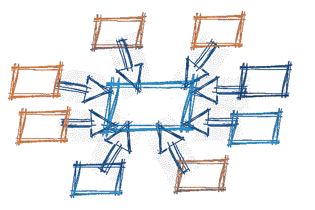
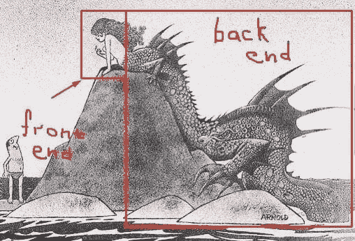

# 什么是 CDN，它是如何工作的？

> 原文：<https://www.sitepoint.com/what-is-a-cdn-and-how-does-it-work/>

CDN——你会不断看到这个缩写。也许在 URL 中，也许在登陆页面上，但是它从来没有被点击过——什么是内容交付网络，它们到底**做什么**？

我们将在这篇综述文章中解释，并在后续文章中演示两个流行的。

## CDN 基础知识

CDN 是一个传送内容的计算机网络。

更具体地说，它是地理上位于某些 web 内容的源服务器和请求它的用户之间的一组服务器，所有这些服务器的目的都是通过减少延迟来更快地交付内容。这是他们*的首要目的*。

这些在地理上更近的服务器，也称为 pop 或存在点，也缓存可缓存的内容，这从源服务器移除了大量负载。有不同类型的 cdn 提供不同种类的服务，它们可以有不同的 [*网络拓扑*](http://www.doc.ic.ac.uk/~mz4615/) :分散的 cdn 旨在让尽可能多的服务器分散在世界各地。Akamai 就是这样一个 CDN。整合 cdn 的点数较少，但针对网络性能、吞吐量和抗 DDoS 能力而构建的点数较多。

## cdn 的类型

我们说过他们的主要目的是减少延迟和加速渲染。但是在 2MB 图像和 500kb JavaScript 库的现代世界中，网站启动需要 3 分钟，这种延迟无关紧要。但是 cdn 也有其他的用途，这些用途随着时间的推移而演变。

### 面向内容的内容分发网络

最初，cdn 只是用于静态内容(JS、CSS、HTML)。您必须在创建/上传内容时将内容推送给他们(他们不知道需要用您的内容更新他们的缓存，甚至在有人请求时也不知道)。

然后，他们添加了 [origin pulling](https://knowledgelayer.softlayer.com/faq/how-does-origin-pull-work) ，使事情更加自动化——这意味着用户请求 CDN 的 URL，然后 CDN 自动请求 origin 网站的 URL，缓存它返回的任何内容。此外，可用性成为一个重要因素。许多 cdn 现在缓存网站的“最后一次活动”状态，这样，如果源关闭，用户仍然可以访问 cdn 的内容，从而创造稳定的假象，直到一切恢复正常。

此外，现代 cdn 通常提供自动优化层，该层会根据请求的图像大小自动调整图像大小并保存它们以备将来使用。这意味着，如果你的网站有一个 2MB 的标题图像，有人在 300px 宽的屏幕上请求它，CDN 将制作一个 30kb 大小和 300px 宽的副本，并在未来向所有移动用户提供，自动使网站更快。

### 面向安全的 cdn

CDNs 的最后一层实用性是 DDoS 和 bot 保护。像 Incapsula 这样的 cdn 专门研究这个。

由于 CDN 是网站基础设施的最外层，也是流量的第一接收方，它可以在早期检测到 DDoS 攻击，并使用名为*scrubber*的特殊 DDoS 保护服务器阻止它们，而不会到达原始服务器并使其崩溃。

此外，通过使用来自其众多客户的知识众包，CDN 可以*了解*可疑的 IP、垃圾邮件发送者、打包者，甚至*类型的*爬虫及其行为。例如，如果站点 B 受相同的 CDN 保护，则在站点 A 上工作的刮刀一旦被识别，也会停止在该站点上工作，因为流量过滤器会识别出它以前见过的模式。

更重要的是，虽然 cdn 允许他们的客户上传自定义证书，但他们也提供自己的证书。这有两个好处:

1.  当证书中出现大漏洞时，cdn 通常会迅速做出反应，因为他们损失最大(所有客户)。因此，在大多数人知道这个安全漏洞之前，通常已经有了一个补丁。
2.  连接速度更快，因为如果许多网站使用相同的 CDN，那么您已经通过其 SSL 证书与 CDN 建立了有效的连接和相互信任，并且不必为使用该 CDN 证书的每个网站重复此过程。这对单个网站的影响不如对整个网站的影响大。

## 最大的玩家

CDN 领域的一些最大的参与者是 Akamai、AWS Cloudfront、Cloudinary、Incapsula、MaxCDN、Fastly 等公司。

与其[对他们进行全面比较](https://www.geckoandfly.com/10077/maxcdn-amazon-cloudfront-cloudflare-cachefly-and-edgecast-cdn-comparison/)，我们将列出每个人都可能成为冠军的类别:

### 刮擦和 DDoS 保护

虽然在其他方面也很好，但 Incapsula 在刮擦和 DDoS 保护方面是无与伦比的。Incapsula 拥有一个庞大的数据库，不仅包含违规的代理 IP 地址，还包含机器人和抓取程序的鼠标和浏览模式，可以阻止大多数自动攻击。

选择是否:你是一家网络商店，不想让你的竞争对手取消你的目录

### 速度和全球影响力

Akamai 是脸书也在使用的 CDN，它有着全球可用性的良好记录。他们分散的网络拓扑模型和在世界上更贫穷地区的可用性(其他 cdn 所缺乏的)使得 Akamai 提供的内容即使在低连接性地区也能顺利加载。紧随其后的是亚马逊的 AWS Cloudfront。

选择是否:你的目标是全球扩张，从中国到美国，从芬兰到南极洲。

### 支付能力

亚马逊 Cloudfront 是付费计划中最便宜的(我们不计算免费计划，因为这些计划通常缺乏重要功能)，并且可以说是除 Akamai 之外覆盖范围最大的，Akamai 并不便宜(维护分散的拓扑结构成本很高)。

**选择是否:**价格是一个问题。

### 热链接

热链接是指有人在你网站上的图片上选择了“复制图片地址”,并将其直接包含在自己的网站中，而原始网址保持不变。对于内容窃贼来说，这通常是草率和懒惰的工作，但如果模仿者成功地在大型社交媒体网站(如脸书或 Reddit)上分享他们的网站，而你的服务器因此受损，则可能会导致巨额费用。MaxCDN 和 KeyCDN 都提供了非常好的热链接保护。

选择是否:你有一个画廊、旅游博客或任何其他图片丰富的网站，这些网站都有被热链接的风险。

### 其他的

我们鼓励你自己出去调查。有无数的帖子将 CDN 相互比较，每个 CDN 的每个计划在提供的选项上与下一个不同。要把它们都涵盖进来是极其困难的，而且情况也在不断变化。

## 实现进程

实施 CDN 通常需要在注册商(租用您域名的公司)的控制面板中更改一些 DNS 记录。这导致所有的流量首先到达 CDN，然后到达你的网站。由于这一切都发生在幕后(通过 IPs)，因此该过程对用户是透明的。

有时，网站会在他们的主域中添加一个特殊的子域，用来存放图片、JavaScript、CSS 和其他静态内容。如果你打开一个浏览器开发控制台的网络标签，或者只是在脸书这样的网站加载时注意浏览器的状态栏，你会注意到很多带有`cdn`的 URLs 这是一个有问题的网站，它只向 CDNs 请求*一些*的内容。

为什么不通过 cdn 请求所有内容？因为静态内容通常很大——2MB 图像、500 kb JS 等。这值得快速提供，因为 a)它不会经常改变，可以缓存很长时间，b)从应用程序的主服务器上移除了很大很大的负载，这可以是动态的。

## 结论

在本文中，您了解了什么是 CDN 以及它是如何工作的。您了解了不同类型的 cdn 及其潜在的工作范围，以及该领域最大的参与者。

在接下来的两篇文章中，我们将介绍 Cloudinary 和 Cloudflare，在我们的主要性能月项目中，我们将在我们的真实应用程序中实际实现其中一个，这样您就可以在一个实例中看到它的运行。敬请期待！

## 分享这篇文章