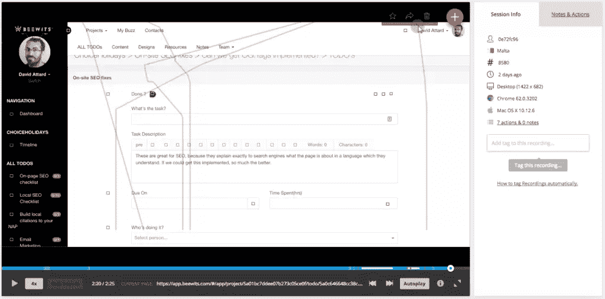
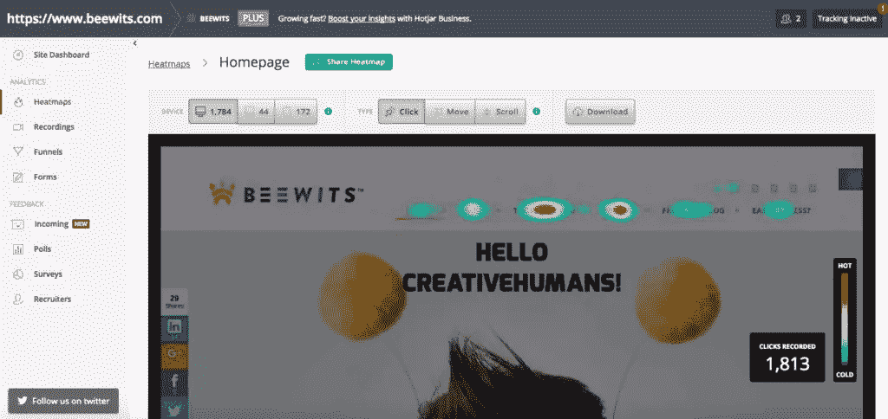
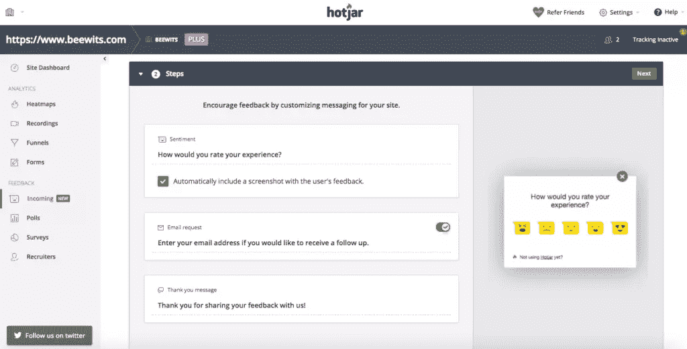

# 通过分析和 Hotjar 提高网站的 UX

> 原文：<https://www.sitepoint.com/improving-your-websites-ux-with-analytics-and-hotjar/>

曾几何时，从用户那里收集网站反馈就是把他们带到一个办公室，让他们执行特定的任务，这样我们就可以评估真实用户的 UX。这是我们当时拥有的最好的东西，但在方法上有一个缺陷。

通过让用户接受 UX 测试，我们引入了一种不自觉的认知偏差:用户被带离了他们的自然环境，有意无意地，他们的行为会发生微妙的变化。

人们会试着变得友好。他们不会透露他们真实的想法，尤其是当他们对你的提议感到失望的时候。

此外，这种古老的可用性测试速度较慢，也不太划算。所以当热图的概念被引入时，它是革命性的。我们现在可以(从字面上)通过用户的点击和滚动行为来了解他们对网站的哪些方面感兴趣，最棒的是，他们甚至不需要知道这些。

Hotjar 就是这样一个工具。

## 用 Hotjar 构建 MVP

Hotjar 可以与 Google Analytics 结合使用，其中 Google Analytics 有助于识别*你的 UX 可能在哪里*不足，Hotjar 的可用性测试可以用于识别*为什么*。也就是说，我们也可以使用 Hotjar 来创建 MVP(最小可行产品)。

作为早期测试者之一，我第一次看到 [Hotjar](https://www.hotjar.com/) 运行时，感觉就像顿悟一样。当时我们正在测试我们 SaaS 软件[的 MVP。我们刚刚构思了这个想法，我们想衡量一下人们对这个概念的兴趣。我们建立了一个网站，设计了一个价格表和电子邮件捕获表单，我们决定如果一定比例的用户感兴趣，那么我们就有所收获了。](https://www.beewits.com)

但是，我们并不只是“希望”收到电子邮件和询问用户反馈，我们还在 MVP 登录页面上设置了 Hotjar 用户记录。

Hotjar recording 是一个功能，当用户访问您的网站或 web 应用程序时，它会逐字记录用户的操作。你可以看到光标的移动，点击，并跟随用户的旅程。

本质上，你是在观察顾客最自然的状态。

因此，我们能够看到用户与网站的交互，并清楚地了解整个用户体验。通过观看这些记录，我们可以看到绊脚石，就好像我们是用户一样。在我们的例子中，我们用 Hotjar 定义了我们的 UX(并验证了我们的商业想法)。

我们甚至可以“看到”他们对不同价格方案的反应，因为我们可以观察用户的点击和悬停。我们能够从业务角度验证我们的概念，并随着时间的推移提高我们的 UX。

## 通过用户记录改进 UX

在我们对我们的想法进行了几个月的 MVP 后，我们觉得人们对这个概念有足够的兴趣，于是我们决定开发这项服务。

当我们发布早期版本的 BeeWits 时，我们希望专注于用户发现“啊哈！”时刻——他们意识到产品将如何让他们的生活变得更好的时刻。

我们的“啊哈！”当用户使用我们的一个任务模板创建一个项目时，通常会有一个时刻:他们意识到不需要每次都从头开始创建一个项目。

### 优化客户旅程

你的用户很忙。(你应该知道，因为你也是用户吧？)如果他们不能马上得到你的应用，他们就会放弃它，永远不再回来。

当我们第一次发布时，用户有一张白纸。在观看用户记录后，我们意识到我们的用户正在迷失，因为他们没有任何东西可以互动。当用户开始免费试用并发现空虚时，就像他们走进了一片荒芜的土地。用户跌跌撞撞，然后消失，但至少我们知道为什么。

我们使用谷歌分析来确定用户在哪里下车。否则，我们将花费无数个小时来查看用户记录，以首先找出问题所在，这一点都不好玩。

因此，在我们的下一次迭代中，我们让用户从一个“示例项目”开始。突然间，我们的用户有了可以使用的东西，我们的谷歌分析数据告诉我们，我们正在经历更多的参与。

### 通过更多用户记录提高参与度

Hotjar 录音的美妙之处在于，你可以不断发现绊脚石。这不是一种“砰，我们完成了，让我们从可用性测试中继续前进”的情况。我们遇到了另一个问题。

根据 Hotjar 记录的会话时间，没有完成项目的用户比实际创建项目的用户花费的时间少得多。

没有创建项目的*用户的会话时间通常不到两分钟，而那些*创建了项目的*用户花费了五分钟或更长时间。然而，创建项目的用户会回来试用，并在得到提示时联系他们的反馈。因此，我们的下一个目标是确保用户完成项目的创建，因为如果用户完成了，他们更有可能返回。*

经过一番头脑风暴后，我们决定将示例项目转化为一系列更小的任务。我们把它改名为“了解比维斯”。这个项目现在包含了许多任务，用户必须完成这些任务才能学习如何使用 BeeWits，包括创建一个项目。在进行了一百次左右的用户记录后，我们发现会话时间和回头率都有了显著的提高！

退货率是免费试用的一个重要指标，因为对于用户来说，如果他们以后转变为付费用户，那么看到他们从产品中获得大量使用是非常重要的。

## 用热图衡量用户兴趣

随着我们观看更多的用户记录，我们注意到更多不良的用户行为。我们的试用用户一直在相同的地方磕磕绊绊，每次我们修复一些东西，用户体验都有所改善，我们的分析也反映了这一点。但是…我们的设计过程并没有结束。

到目前为止，我们已经讨论了用户记录作为发现可用性缺陷的一种方式，这对于成品网站和 MVP 都有效。但是我们仍然必须为我们的服务赋予真正的价值。用户会为此支付多少？

输入热图。

热图是一个 Hotjar 特性，用于更好地了解用户想要什么，当我们试图定义我们的定价时，它特别有用。看看下面的热图截图。

正如我们所看到的，我们的用户对两件事最感兴趣——我们提供的工具和定价——所以我们对我们的网站进行了修改，以更好地解释我们提供的工具，并使定价更容易理解。

价格表上的点击也特别有趣。

我们可以看到，我们的中端定价比任何其他产品的点击率都高。我们的一些层几乎没有被点击。因此，我们再次调整了我们的网站，让最受欢迎的价格层更加突出，甚至删除了用户根本不喜欢的价格层。

## 奖金部分:调查和幸福因素

我们一直在谈论从用户的幕后行为中提取洞察力，但我们也可以使用 Hotjar 的反馈工具直接与用户对话。虽然你应该总是保持调查简短，这样用户就不会放弃他们，但他们仍然可以是非常有见地的。

除了调查之外，你还可以使用 *Incoming* 工具来明确找出用户的感受——是快乐还是沮丧。*来电*和客户调查工具都要求你定义一些快速设置(你想问的问题等)。)，你就可以走了。

## 结论

只有通过观察用户的行为，你才能做出数据驱动的决定，决定什么需要改进，通过收集用户对你的产品的反馈，你才能不断迭代和改进用户希望你改进的地方。否则，你充其量只是做出有根据的猜测，这是接近 UX 的一种冒险方式。

## 分享这篇文章