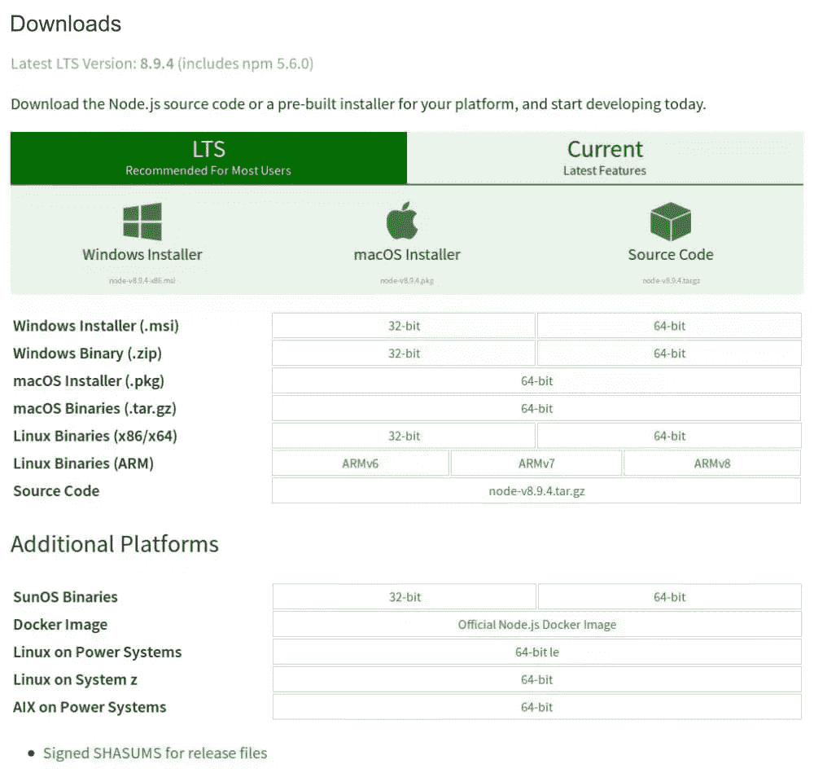
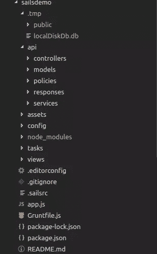
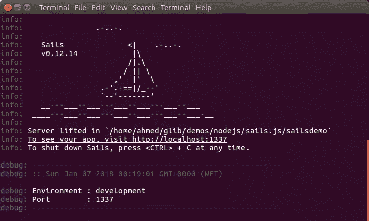
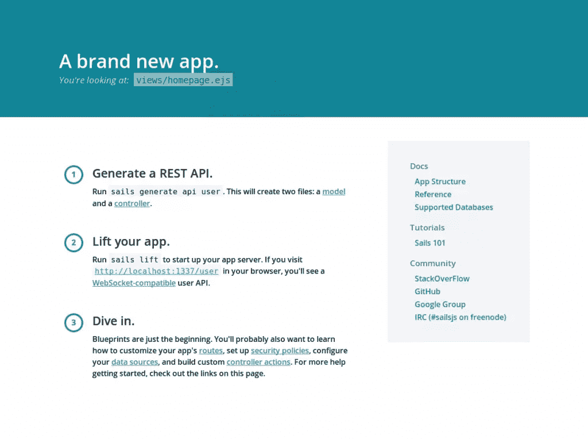
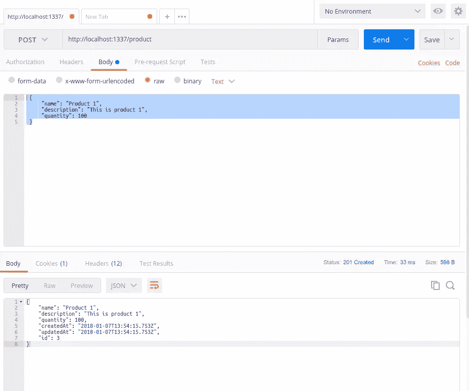
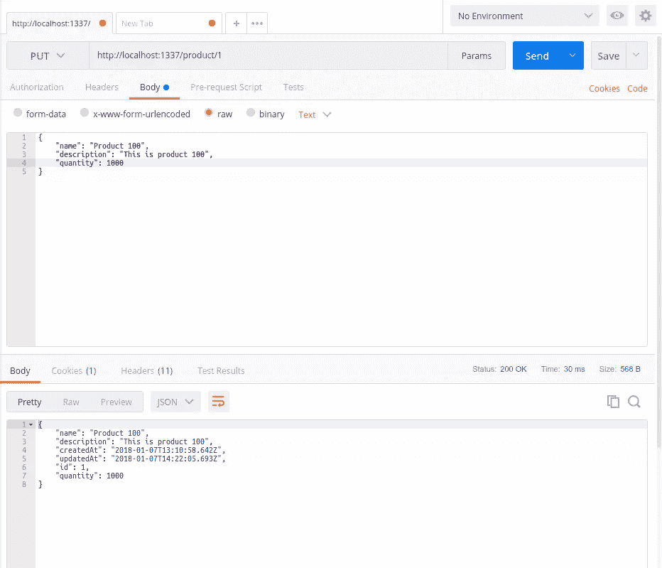

# Sails.js 简介

> 原文：<https://www.sitepoint.com/an-introduction-to-sails-js/>

**[Sails.js](https://sailsjs.com/) 是 Node.js MVC(模型-视图-控制器)框架，遵循“约定优于配置”的原则。它受流行的 Ruby on Rails web 框架的启发，允许您快速构建 REST APIs、单页应用程序和实时(基于 WebSockets)应用程序。它广泛使用了代码生成器，使您可以用更少的代码编写来构建应用程序——尤其是那些可以用其他方式搭建的常见代码。**

该框架构建在最流行的 Node.js 库之一 Express.js 和 Socket.io 之上，socket . io 是一个 JavaScript 库/引擎，用于向应用程序添加实时、双向、基于事件的通信。在撰写本文时，Sails.js 的官方稳定版为 *0.12.14* ，可从 [npm](https://www.npmjs.com/package/sails) 获得。Sails.js 1.0 版本尚未正式发布，但[据 sails . js 创作者](https://sailsjs.com/documentation/upgrading/to-v-1-0)透露，版本 **1.0** 已经在一些生产应用中使用，他们甚至建议在开始新项目时使用。

## 主要特征

Sails.js 有许多很棒的特性:

*   它是基于 Express.js 构建的
*   它对 WebSockets 有实时支持
*   它采用“约定胜于配置”的方法
*   多亏了蓝图，它有强大的代码生成功能
*   由于其强大的水线 ORM/ODM，它是数据库不可知的
*   它支持同一项目中的多个数据存储
*   它有很好的文档。

目前有一些重要的缺点，例如:

*   不支持水线中的连接查询
*   在发布 1.0 版之前不支持 SQL 事务(在撰写本文时还处于测试阶段)
*   直到 1.0 版本，它仍然使用 Express.js v3，也就是 EOL(寿命终止)
*   发展非常缓慢。

## Sails.js vs Express.js

软件开发就是构建抽象概念。Sails.js 是 Express.js(它本身是对节点 HTTP 模块的抽象)之上的一个高级抽象层，提供路由、中间件、文件服务等等。它还增加了一个强大的 ORM/ODM、MVC 架构模式和一个强大的生成器 CLI(以及其他特性)。

您可以使用 Node 的低级 HTTP 服务和其他实用程序模块(如文件系统模块)来构建 web 应用程序，但除非是为了学习 Node.js 平台，否则不建议这样做。您还可以进一步使用 Express.js，这是一个流行的、用于构建 web 应用程序的轻量级框架。

您将拥有路由和其他对 web 应用有用的构造，但是您将需要处理从配置、文件结构和代码组织到使用数据库的几乎所有事情。

Express 没有提供任何内置的工具来帮助您访问数据库，所以您需要将所需的技术结合起来构建一个完整的 web 应用程序。这就是所谓的堆栈。Web 开发者，使用 JavaScript，大多使用流行的 [MEAN stack](https://www.sitepoint.com/introduction-mean-stack/) ，分别代表 MongoDB、ExpressJS、AngularJS 和 Node.js。

MongoDB 是 Node/Express 开发人员首选的数据库系统，但是您可以使用任何想要的数据库。这里最重要的一点是，对于数据库，Express 不提供任何内置的 API。

## 水线形式/ODM

js 的一个关键特性是 Waterline，这是一个强大的 ORM(对象关系映射器)用于基于 SQL 的数据库，ODM(对象文档映射器)用于基于 NoSQL 文档的数据库。Waterline 抽象了使用数据库时的所有复杂性，最重要的是，使用 Waterline，您不必在刚开始开发时就决定选择数据库系统。当您的客户还没有决定使用哪种数据库技术时，这也不会让您感到害怕。

您可以开始构建您的应用程序，而不需要任何配置。事实上，最初你根本不需要安装数据库系统。由于内置了基于 NeDB 的文件数据库，您可以透明地使用文件系统来存储和检索数据，以测试您的应用程序功能。

一旦您准备好并决定了要用于项目的方便的数据库系统，您就可以通过为您的数据库系统安装相关的适配器来简单地切换数据库。Waterline 有官方适配器,用于流行的关系数据库系统，如 MySQL 和 PostgreSQL，以及 NoSQL 数据库，如 MongoDB 和 Redis，社区还为其他流行的数据库系统，如 Oracle、MSSQL、DB2、SQLite、CouchDB 和 neo4j 构建了许多适配器。万一你找不到你想要使用的数据库系统的适配器，你可以[开发你自己的定制适配器](https://sailsjs.com/documentation/concepts/extending-sails/adapters/custom-adapters)。

Waterline 抽象出了不同数据库系统之间的差异，并允许您的应用程序拥有一个标准化的接口来与任何支持的数据库系统进行通信。您不必使用 SQL 或任何低级 API(对于 NoSQL 数据库)，但这并不意味着您不能(至少对于基于 SQL 的数据库和 MongoDB)。

有些情况下，您需要编写自定义 SQL，例如，出于性能原因、处理复杂的数据库需求或访问特定于数据库的功能。在这种情况下，您可以使用仅在配置为使用 SQL 系统的水线模型上可用的`.query()`方法(您可以从[文档](https://sailsjs.com/documentation/reference/waterline-orm/models/query)中找到关于`query()`的更多信息)。

由于不同的数据库系统有共同的和特定于数据库的特性，只要您限制自己只使用这些共同的特性，那么 Waterline ORM/ODM 对您来说是有好处的。此外，如果您使用原始 SQL 或原生 MongoDB APIs，您将失去 Waterline 的许多特性，包括在不同数据库之间切换的能力。

## Sails.js 入门

现在我们已经介绍了 Sails.js 的基本概念和特性，让我们看看如何快速开始使用 Sails.js 创建新项目并提升它们。

### 先决条件

在使用 Sails.js 之前，您需要有一个安装了 Node.js(和 npm)的开发环境。你可以通过进入 Node.js 官方网站下载适合你操作系统的安装程序来安装这两个软件。



还要确保安装任何您想与 Sails.js 一起使用的数据库管理系统(关系数据库或 NoSQL 数据库)。如果您对使用成熟的数据库系统不感兴趣，此时您仍然可以使用 Sails.js，这要感谢`sails-disk`，它允许您拥有一个开箱即用的基于文件的数据库。

### 安装 Sails.js CLI

在满足工作开发需求后，您可以使用终端(Linux 和 macOS)或命令提示符(Windows)从 npm 全局安装 Sails.js 命令行实用程序:

```
sudo npm install sails -g 
```

如果你想安装最新的 *1.0* 版本来尝试新功能，你需要使用测试版:

```
npm install sails@beta -g 
```

根据您的 [npm 配置](https://docs.npmjs.com/getting-started/fixing-npm-permissions)，您可能需要也可能不需要 *sudo* 来全局安装包。

### 搭建 Sails.js 项目

安装 Sails.js CLI 后，您可以继续使用一个命令构建一个新项目:

```
sails new sailsdemo 
```

这将在当前目录下为您的项目创建一个名为`sailsdemo`的新文件夹。您还可以使用以下命令在现有文件夹中搭建项目文件:

```
sails new . 
```

您可以使用以下代码搭建一个没有前端的新 Sails.js 项目:

```
sails new sailsdemo --no-frontend 
```

从[文档](https://sailsjs.com/documentation/reference/command-line-interface/sails-new)中找到关于 CLI 特性的更多信息。

### Sails.js 项目剖析

以下是使用 Sails.js CLI 生成的项目截图:



Sails.js 项目是一个 Node.js 模块，带有一个`package.json`和一个`node_modules`文件夹。你可能也注意到了`Gruntfile.js`的出现。Sails.js 使用 Grunt 作为构建前端资产的构建工具。

如果你正在为浏览器开发一个应用程序，你很幸运。Sails 附带 Grunt —这意味着您的整个前端资产工作流是完全可定制的，并且附带了对已经存在的所有优秀 Grunt 模块的支持。这包括对 Less、Sass、Stylus、CoffeeScript、JST、Jade、Handlebars、Dust 等等的支持。当您准备投入生产时，您的资产会自动缩小和压缩。你甚至可以编译你的静态资产，并把它们放到像 CloudFront 这样的 CDN 上，让你的应用程序加载得更快。(你可以在 Sails.js 网站上阅读更多关于这几点的内容[。)](https://sailsjs.com/features#?asset-pipeline)

您还可以使用 Gulp 或 Webpack 作为您的构建系统，而不是 Grunt，使用自定义生成器。参见 GitHub 上的 [sails-generate-new-gulp](https://github.com/Karnith/sails-generate-new-gulp) 和 [sails-webpack](https://github.com/langateam/sails-webpack) 项目。

更多社区生成器，请参见 Sails.js 网站上的文档页面。

该项目包含许多配置文件和文件夹。其中大部分都是不言自明的，但是让我们来回顾一下您将大部分时间使用的那些:

*   `api/controllers`:这是控制器所在的文件夹。控制器对应于 *MVC* 中的 *C* 部分。它是您的应用程序的业务逻辑存在的地方。
*   `api/models`:模型所在的文件夹。模型对应于 *MVC* 架构的 *M* 部分。这是您需要放置映射到 SQL/NoSQL 数据的类或对象的地方。
*   这是您需要为您的应用程序放置策略的文件夹
*   `api/responses`:该文件夹包含服务器响应逻辑，如处理 404 和 500 响应的函数等。
*   这是你的应用程序范围的服务所在。服务是封装了通用逻辑的全局类，可以在许多控制器中使用。
*   `./views`:该文件夹包含用于显示视图的模板。默认情况下，该文件夹包含 *ejs* 引擎模板，但是您可以配置任何 Express 支持的引擎，如 ejs、Jade、Handlebars、Mustache 和下划线等。
*   `./config`:该文件夹包含许多配置文件，使您能够配置应用程序的每一个细节，如 CORS、CSRF 保护、i18n、http、模型设置、视图、日志和策略等。您将经常使用的一个重要文件是`config/routes.js`，在这里您可以创建您的应用程序路径，并将它们映射到控制器中的实际动作或直接映射到视图。
*   这个文件夹可以存放任何静态文件(CSS、JavaScript 和图片等)。)供你申请。

### 运行您的 Sails.js 项目

您可以通过从项目的根目录运行以下命令来启动开发服务器:

```
sails lift 
```

这将提示您选择一个迁移策略，然后启动 dev 服务器。



然后，您可以使用网络浏览器导航至`[http://localhost:1337/](http://localhost:1337/)`。如果你已经生成了一个带有前端的 Sails.js 项目(即没有使用*–无前端*选项)，你会看到这个主页:



### 创建水线模型

**模型**是一种抽象，通常由通用编程语言中的对象或类来表示，它引用/映射到关系数据库中的 SQL 表或 NoSQL 数据库中的文档(或键值对)。

您可以使用 Sails.js CLI 创建模型:

```
sails generate model product 
```

这将在`api/models`中创建一个包含以下内容的`Product.js`模型:

```
/**
 * Product.js
 *
 * @description :: TODO: You might write a short summary of how this model works and what it represents here.
 * @docs        :: http://sailsjs.org/documentation/concepts/models-and-orm/models
 */

module.exports = {

  attributes: {

  }
}; 
```

然后，您可以用属性扩充您的模型。例如:

```
module.exports = {

  attributes: {
    name: {
      type: 'string',
      defaultsTo: '',
      required: 'true'
    },
    description: {
      type: 'string',
      defaultsTo: ''
    },
    quantity: {
      type: 'integer'
    },
    user: { model: 'User' }
  }
}; 
```

注意我们如何定义与模型*用户*的关联(一对多或隶属关系)。通过这个 [Sails.js 关联页面](https://sailsjs.com/documentation/concepts/models-and-orm/associations)，你可以看到所有支持的关联以及如何创建它们。

有关可用模型属性的更多信息，请参见 [Sails.js 属性页面](https://sailsjs.com/documentation/concepts/models-and-orm/attributes)。

您还可以通过在模型定义中添加顶级属性来添加每个模型的配置或模型设置，这将覆盖`config/models.js`中的全局模型设置。您可以覆盖与模型属性、数据库连接等相关的设置。

例如，让我们为*产品*模型指定一个不同的数据存储，而不是在整个项目中使用的全局数据存储:

```
module.exports = {
  connection: 'mysqlcon'
  attributes: { /*...*/}
} 
```

这将指示 Sails.js 使用名为 *mysqlcon* 的连接来存储这个模型数据。确保将 *mysqlcon* 连接添加到`config/connections.js`中的*连接*对象:

```
module.exports.connections = {
  // sails-disk is installed by default.
  localDiskDb: {
    adapter: 'sails-disk'
  },
  mysqlcon: {
    adapter: 'sails-mysql',
    host: 'YOUR_MYSQL_HOST',
    user: 'YOUR_MYSQL_USER',
    password: 'YOUR_MYSQL_PASSWORD',
    database: 'YOUR_MYSQL_DB'
  }
}; 
```

您还需要从 npm 安装`sails-mysql`适配器:

```
npm install sails-mysql@for-sails-0.12 
```

您可以从 [Sails.js 模型设置页面](https://sailsjs.com/documentation/concepts/models-and-orm/model-settings)中找到您可以指定的可用模型设置。

### Sails.js 控制器

**控制器**保存你的应用程序的业务逻辑。它们位于`api/controllers`中，提供了一个粘合应用模型和视图的层。控制器包含绑定到路由的操作，并响应来自 web/mobile 客户端的 HTTP 请求。

控制器是一个 JavaScript 对象，包含称为*控制器动作*的方法，这些方法接受两个参数:请求和响应。

你可以在 [Sails.js 控制器页面](http://sailsjs.org/documentation/concepts/controllers)上找到更多关于控制器的信息。

您可以使用 Sails.js CLI 生成控制器:

```
sails generate controller product 
```

该命令将生成一个名为`api/controllers/ProductController.js`的控制器，内容如下:

```
/**
 * ProductController
 *
 * @description :: Server-side logic for managing products
 * @help        :: See http://sailsjs.org/#!/documentation/concepts/Controllers
 */

module.exports = {

}; 
```

代码导出一个空的 JavaScript 对象，您可以在其中添加新的动作或覆盖默认的(自动添加的)控制器动作。

此时，您实际上可以对您的服务器执行 CRUD 操作，而无需进一步添加任何代码。因为 Sails.js 遵循配置之上的约定，所以它将您的控制器连接到它们相应的路由，并为处理常见的 HTTP POST、GET、PUT 和 DELETE 请求等提供默认操作。

### 邮递员测试

使用 Postman，您可以发送 POST、GET 和其他请求来测试您的 API，所以请继续使用[为您的操作系统](https://www.getpostman.com/)获取 Postman 版本。接下来，输入产品端点 URL `http://localhost:1337/product`。然后选择发送的 HTTP 方法——在本例中是 POST，因为我们想要创建一个产品。接下来，您需要提供数据，因此单击 *Body 选项卡*，选择 *Raw* 选项，然后输入以下内容:

```
 {
     "name": "Product 1",
     "description": "This is product 1",
     "quantity": 100
 } 
```

然后点击发送按钮:


您应该注意返回的状态代码:200 OK 表示产品已成功创建。


然后，您可以通过发送 GET 请求来验证产品是否已创建:



您还可以通过发送 PUT 请求，按 id 更新产品:



最后，您可以通过发送删除请求，按 id 删除产品:


对于自定义逻辑，您也可以覆盖这些操作并实现自己的操作。

当您创建一个 API(即一个控制器和一个模型)时，Sails.js 会自动添加八个默认操作，它们是:

*   `add to`
*   `create`
*   `destroy`
*   `find one`
*   `find where`
*   `populate where`
*   `remove from`
*   `update`

`Find where`和`find one`、`create`、`update`和`destroy`是正常的 CRUD 动作，需要出现在大多数 API 中。其他的与外国记录有关:

*   `add to`:用于将外部记录添加到另一个记录集合(例如，将产品添加到用户的产品)。
*   `populate where`:用于为另一个记录的给定关联填充并返回外部记录。[在这里阅读更多信息](https://sailsjs.com/documentation/reference/blueprint-api/populate-where)。
*   `remove from`:用于从一个相关的记录集合关联(如用户的产品)中删除外来记录(如产品)。更多信息和示例见[此处](https://sailsjs.com/documentation/reference/blueprint-api/remove-from)。

要自定义默认操作的行为，您可以执行以下任一操作:

*   覆盖指定控制器中的操作。即创建一个与这些动作之一同名的动作:`find`、`findOne`、`create`、`update`、`destroy`、`populate`、`add`或`remove`。
*   覆盖所有控制器的默认操作。你可以通过创建一个`api/blueprints`文件夹来实现，在这里你需要为一个默认动作添加小写名称的文件(例如`find.js`、`findone.js`、`create.js`等)。).你可以通过查看 [Sails.js 蓝图 API 文档](https://sailsjs.com/documentation/reference/blueprint-api)找到更多关于蓝图的信息。

### Sails.js 中的路由

[Routes](https://sailsjs.com/documentation/concepts/routes) 允许您将 URL 映射到控制器或视图。就像默认动作一样，Sails.js 会自动为默认动作添加默认路线，允许您只需创建模型和控制器就可以拥有一个自动 API。

您还可以为自定义操作或视图添加自定义路线。要添加路线，打开`config/routes.js`文件并添加:

```
module.exports.routes = {
  '/products': {
    view: 'products'
  }
}; 
```

这将`/products`映射到视图文件夹中名为*产品*的模板。

您可以选择在 URL 中添加一个 HTTP 谓词。例如:

```
module.exports.routes = {
  'get /': {
    view: 'homepage'
  }
}; 
```

您还可以为路线指定控制器操作。例如:

```
module.exports.routes = {
    'post /product': 'ProductController.create',
}; 
```

这告诉 Sails.js 在客户端向`/product`端点发送 POST 请求时调用 *ProductController* 控制器的 *create* 动作。

## 结论

在本文中，我们向您介绍了 Sails.js。我们了解了 Sails.js 的基本概念，以及如何生成一个新的 Sails.js 项目，然后通过生成模型来创建一个 API，添加一些属性，然后生成控制器。Sails.js 还有其他先进的概念如[服务](https://sailsjs.com/documentation/concepts/services)、[政策](https://sailsjs.com/documentation/concepts/policies)、[蓝图](https://sailsjs.com/documentation/concepts/blueprints)和[挂钩](https://sailsjs.com/documentation/concepts/extending-sails/hooks)。一旦你掌握并熟悉了本简介中的基本概念，你就可以自己进一步发现这些。

## 分享这篇文章