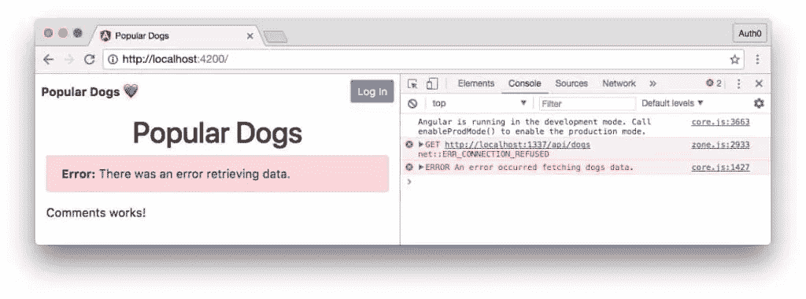
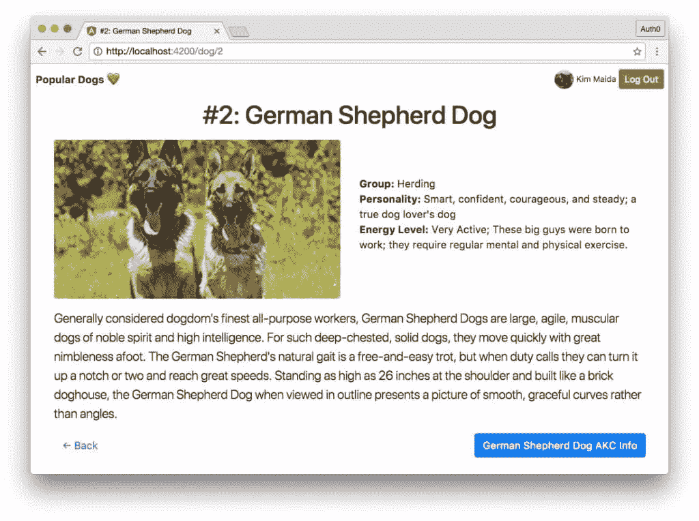
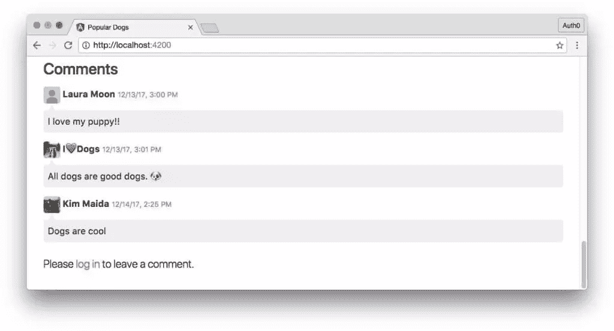
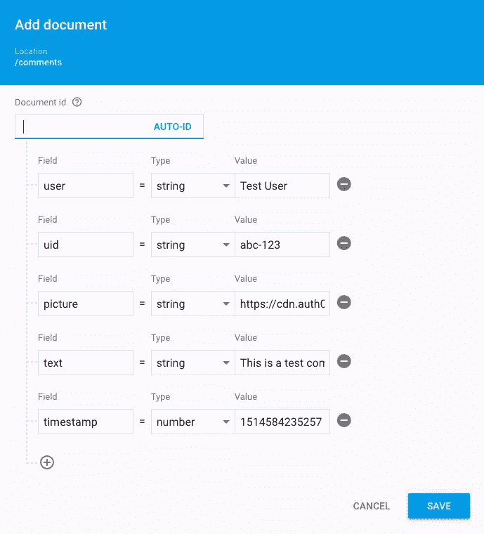
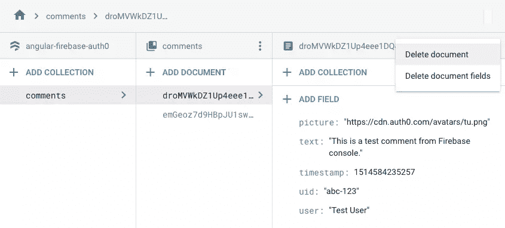
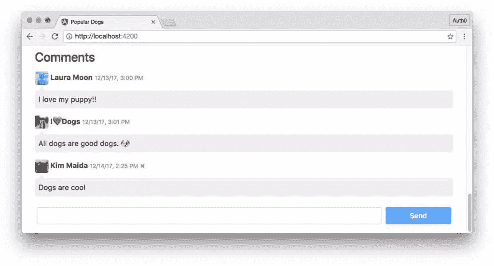
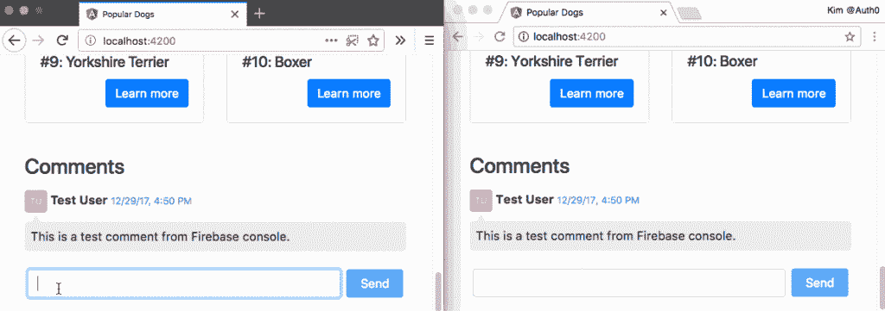

# 用 Auth0 认证 Firebase 和 Angular:第 2 部分

> 原文：<https://www.sitepoint.com/authenticating-firebase-angular-auth0-2/>

*本文最初发表在[Auth0.com 博客](https://auth0.com/blog/how-to-authenticate-firebase-and-angular-with-auth0-part-2/)上，经允许在此转载。*

在这个由两部分组成的教程系列中，我们将学习如何构建一个应用程序，通过 [Auth0](https://auth0.com) 认证来保护节点后端和有角度的前端。我们的服务器和应用程序还将使用自定义令牌对[Firebase](https://firebase.google.com)[Cloud Firestore 数据库](https://firebase.google.com/docs/firestore/)进行认证，这样用户可以在使用 Auth0 登录后以安全的方式留下实时评论。Angular 应用程序代码可以在[Angular-firebase GitHub repo](https://github.com/auth0-blog/angular-firebase)中找到，节点 API 可以在[firebase-auth 0-nodeserver repo](https://github.com/auth0-blog/firebase-auth0-nodeserver)中找到。

我们教程的第一部分[用 Auth0 认证 Firebase 和 Angular:Part 1](https://www.sitepoint.com/authenticating-firebase-angular-auth0-1)涵盖了:

*   Auth0 和 Firebase 的介绍和设置
*   实现一个安全的节点 API，它铸造定制的 Firebase 令牌并为我们的应用程序提供数据
*   具有模块和惰性加载的角度应用架构
*   使用具有服务和路由保护的 Auth0 进行角度认证
*   共享角度组件和 API 服务。

## 用 Auth0 认证 Firebase 和 Angular:第 2 部分

我们教程的第 2 部分将涵盖:

1.  [显示狗:Async 和 NgIfElse](#displayingdogsasyncandngifelse)
2.  [带有路线参数的狗的详细信息](#dogdetailswithrouteparameters)
3.  [注释模型类](#commentmodelclass)
4.  [Firebase 云 Firestore 和规则](#firebasecloudfirestoreandrules)
5.  [注释组件](#commentscomponent)
6.  [评论表单组件](#commentformcomponent)
7.  [实时评论](#realtimecomments)
8.  [结论](#conclusion)

我们完成的应用程序将如下所示:


让我们从[用 Auth0: Part 1](https://www.sitepoint.com/authenticating-firebase-angular-auth0-1) 验证 Firebase 和 Angular 的结尾离开的地方继续。

## 显示狗:异步和 NgIfElse

让我们实现应用程序的主页—狗列表。当我们设置 Angular 应用程序的架构时，我们为这个组件创建了脚手架。

重要提示:确保你的 Node.js API 正在运行。如果您需要复习 API，请参考[如何使用 Auth0 认证 Firebase 和 Angular:第 1 部分-节点 API](https://auth0.com/blog/how-to-authenticate-firebase-and-angular-with-auth0-part-1#node-api) 。

### Dogs 组件类

现在打开`dogs.component.ts`类文件并实现以下代码:

```
// src/app/dogs/dogs/dogs.component.ts
import { Component, OnInit } from '@angular/core';
import { Title } from '@angular/platform-browser';
import { ApiService } from '../../core/api.service';
import { Dog } from './../../core/dog';
import { Observable } from 'rxjs/Observable';
import { tap, catchError } from 'rxjs/operators';

@Component({
  selector: 'app-dogs',
  templateUrl: './dogs.component.html'
})
export class DogsComponent implements OnInit {
  pageTitle = 'Popular Dogs';
  dogsList$: Observable<Dog[]>;
  loading = true;
  error: boolean;

  constructor(
    private title: Title,
    private api: ApiService
  ) {
    this.dogsList$ = api.getDogs$().pipe(
      tap(val => this._onNext(val)),
      catchError((err, caught) => this._onError(err, caught))
    );
  }

  ngOnInit() {
    this.title.setTitle(this.pageTitle);
  }

  private _onNext(val: Dog[]) {
    this.loading = false;
  }

  private _onError(err, caught): Observable<any> {
    this.loading = false;
    this.error = true;
    return Observable.throw('An error occurred fetching dogs data.');
  }

} 
```

导入之后，我们将设置一些本地属性:

*   `pageTitle`:设置页面的`<h1>`和`<title>`
*   `dogsList$`:由我们的 API HTTP 请求返回的可观察对象，用于获取狗列表数据
*   `loading`:发出 API 请求时显示加载图标
*   `error`:如果从 API 获取数据出错，显示一个错误。

我们将使用声明性的[异步管道](https://angular.io/api/common/AsyncPipe)来响应 API `GET`请求返回的`dogsList$`可观察值。使用异步管道，我们不需要在我们的`DogsComponent`类中订阅或取消订阅:订阅过程将被自动管理！我们只需要建立我们的观察。

我们将通过将`Title`和`ApiService`传递给构造函数来使它们对我们的类可用，然后设置我们的`dogsList$`可观察值。我们将使用 RxJS 操作符`tap`(以前称为`do`操作符)和`catchError`来调用处理函数。`tap`操作符执行副作用，但不影响发出的数据，所以它非常适合设置其他属性。`_onNext()`功能会将`loading`设置为`false`(因为数据已经成功发送)。`_onError()`函数将适当设置`loading`和`error`并抛出错误。如前所述，我们不需要从`dogsList$`可观察对象中*订阅*或*取消订阅*，因为异步管道(我们将在模板中添加)会为我们处理这些。

在组件初始化时，我们将使用 [`ngOnInit()`来窥探 OnInit 生命周期钩子](https://angular.io/guide/lifecycle-hooks#oninit)到[设置文档`<title>`](https://angular.io/guide/set-document-title) 。

这就是我们的狗组件类！

### Dogs 组件模板

让我们来看看`dogs.component.html`的模板:

```
<!-- src/app/dogs/dogs/dogs.component.html -->
<h1 class="text-center">{{ pageTitle }}</h1>

<ng-template #noDogs>
  <app-loading *ngIf="loading"></app-loading>
  <app-error *ngIf="error"></app-error>
</ng-template>

<div *ngIf="dogsList$ | async as dogsList; else noDogs">
  <p class="lead">
    These were the top <a href="http://www.akc.org/content/news/articles/the-labrador-retriever-wins-top-breed-for-the-26th-year-in-a-row/">10 most popular dog breeds in the United States in 2016</a>, ranked by the American Kennel Club (AKC).
  </p>
  <div class="row mb-3">
    <div *ngFor="let dog of dogsList" class="col-xs-12 col-sm-6 col-md-4">
      <div class="card my-2">
        
        <div class="card-body">
          <h5 class="card-title">#{{ dog.rank }}: {{ dog.breed }}</h5>
          <p class="text-right mb-0">
            <a class="btn btn-primary" [routerLink]="['/dog', dog.rank]">Learn more</a>
          </p>
        </div>
      </div>
    </div>
  </div>
</div>

<app-comments></app-comments> 
```

在这个模板中，我们将仔细研究几件事情:

```
...
<ng-template #noDogs>
  <app-loading *ngIf="loading"></app-loading>
  <app-error *ngIf="error"></app-error>
</ng-template>

<div *ngIf="dogsList$ | async as dogsList; else noDogs">
  ...
    <div *ngFor="let dog of dogsList" ...>
      ... 
```

这段代码以声明的方式做了一些非常有用的事情。我们来探索一下。

首先我们有一个带有[模板引用变量](https://angular.io/guide/template-syntax#template-reference-variables--var-) ( `#noDogs`)的 [`<ng-template>`元素](https://angular.io/guide/structural-directives#the-ng-template)。`<ng-template>`元素从不直接呈现。它旨在与结构化指令(如 NgIf)一起使用。在这种情况下，我们用`<ng-template #noDogs>`创建了一个包含加载和错误组件的嵌入式视图。这些组件中的每一个都将基于一个条件进行渲染。除非被指示，否则`noDogs`嵌入视图本身不会呈现。

那么我们如何(以及何时)告诉这个视图进行渲染呢？

下一个`<div *ngIf="...`实际上是一个 [NgIfElse](https://angular.io/api/common/NgIf) ，使用[星号前缀作为语法糖](https://angular.io/guide/structural-directives#the-asterisk--prefix)。我们还将异步管道与我们的`dogsList$` observable 一起使用，并设置一个变量，这样我们就可以在模板(`as dogsList`)中引用流的发射值。如果`dogsList$`可观察对象出现问题，我们有一个`else noDogs`语句告诉模板呈现`<ng-template #noDogs>`视图。在从 API 成功获取数据之前，或者如果可观察对象抛出了错误，这种情况就会发生。

如果`dogsList$ | async`已经成功地发出了一个值，div 将会呈现，我们可以使用 [NgForOf ( `*ngFor`)结构指令](https://angular.io/api/common/NgForOf)迭代我们的`dogsList`值(它应该是一个由`Dog`组成的数组，在我们的组件类中指定)来显示每只狗的信息。

正如您在剩下的 HTML 中看到的，每只狗都会显示一张图片、等级、品种，以及一个到它们个人详细信息页面的链接，这是我们接下来要创建的。

通过导航到您的应用主页，在浏览器中查看 Dogs 组件，网址为 [http://localhost:4200](http://localhost:4200) 。Angular 应用程序应该向 API 发出请求，获取狗的列表并显示它们！

*注意:我们还包括了`<app-comments>`组件。因为我们已经生成了这个组件，但是还没有实现它的功能，所以它应该在 UI 中显示为“Comments works！”*

要测试错误处理，您可以停止 API 服务器(在服务器的命令提示符或终端中的`Ctrl+c`)。然后尝试重新加载页面。由于无法访问 API，应该会显示错误组件，并且我们应该会在浏览器控制台中看到相应的错误:



## 带有路线参数的狗的详细信息

接下来，我们将实现我们的狗组件。这个路由组件充当每只狗的详细信息页面。在本教程的第一部分，我们已经[建立了我们的狗模块架构](https://www.sitepoint.com/authenticating-firebase-angular-auth0-1#angularapparchitecture)以及[路由和延迟加载](https://www.sitepoint.com/authenticating-firebase-angular-auth0-1#implementroutingandlazyloadedmodules)。我们现在需要做的就是实施！

*提醒:你可能记得在[第一部中，狗的详细信息页面受到`AuthGuard`路线守卫](https://auth0.com/blog/how-to-authenticate-firebase-and-angular-with-auth0-part-1#routing-lazy-loading)的保护。这意味着访问者必须通过身份验证才能访问页面。此外， [API 调用需要一个访问令牌](https://auth0.com/blog/how-to-authenticate-firebase-and-angular-with-auth0-part-1#node-api)来返回数据。*

### 狗组件类

打开`dog.component.ts`类文件并添加:

```
// src/app/dog/dog/dog.component.ts
import { Component, OnInit, OnDestroy } from '@angular/core';
import { ActivatedRoute } from '@angular/router';
import { Title } from '@angular/platform-browser';
import { ApiService } from '../../core/api.service';
import { DogDetail } from './../../core/dog-detail';
import { Subscription } from 'rxjs/Subscription';
import { Observable } from 'rxjs/Observable';
import { tap, catchError } from 'rxjs/operators';

@Component({
  selector: 'app-dog',
  templateUrl: './dog.component.html',
  styles: [` .dog-photo {
      background-repeat: no-repeat;
      background-position: 50% 50%;
      background-size: cover;
      min-height: 250px;
      width: 100%;
    } `]
})
export class DogComponent implements OnInit, OnDestroy {
  paramSub: Subscription;
  dog$: Observable<DogDetail>;
  loading = true;
  error: boolean;

  constructor(
    private route: ActivatedRoute,
    private api: ApiService,
    private title: Title
  ) { }

  ngOnInit() {
    this.paramSub = this.route.params
      .subscribe(
        params => {
          this.dog$ = this.api.getDogByRank$(params.rank).pipe(
            tap(val => this._onNext(val)),
            catchError((err, caught) => this._onError(err, caught))
          );
        }
      );
  }

  private _onNext(val: DogDetail) {
    this.loading = false;
  }

  private _onError(err, caught): Observable<any> {
    this.loading = false;
    this.error = true;
    return Observable.throw('An error occurred fetching detail data for this dog.');
  }

  getPageTitle(dog: DogDetail): string {
    const pageTitle = `#${dog.rank}: ${dog.breed}`;
    this.title.setTitle(pageTitle);
    return pageTitle;
  }

  getImgStyle(url: string) {
    return `url(${url})`;
  }

  ngOnDestroy() {
    this.paramSub.unsubscribe();
  }

} 
```

这个组件与我们的狗列表组件非常相似，只有一些关键的不同。

我们将导入必要的依赖项，并在我们的类中私有地使用`ApiService`和`Title`服务。

Dog details 组件依赖于 route 参数来确定我们需要为哪只狗获取数据。route 参数与十只最受欢迎的狗列表中所需狗的等级相匹配，如下所示:

```
# URL for dog #2:
http://localhost:4200/dog/2 
```

为了在组件类中访问这个参数，我们需要导入 [ActivatedRoute 接口](https://angular.io/api/router/ActivatedRoute)，将其传递给构造函数，并且*向*订阅被激活的路由的 [`params`可观察的](https://angular.io/api/router/ActivatedRoute#params)。

然后，我们可以将`rank`参数传递给我们的`getDogByRank$()` API 服务方法。当组件被破坏时，我们还应该*取消*可观察的路线参数[。我们的`dog$`可观察对象可以使用`tap`和`catchError`处理程序，类似于我们的狗列表组件。](https://angular.io/guide/lifecycle-hooks#ondestroy)

我们还需要一些方法来帮助我们的模板。

`getPageTitle()`方法使用 API 数据生成包含狗的等级和品种的页面标题。

`getImgStyle()`方法使用 API 数据返回一个背景图像 CSS 值。

### 狗组件模板

现在让我们在`dog.component.html`模板中使用这些方法:

```
<!-- src/app/dog/dog/dog.component.html -->
<ng-template #noDog>
  <app-loading *ngIf="loading"></app-loading>
  <app-error *ngIf="error"></app-error>
</ng-template>

<div *ngIf="dog$ | async as dog; else noDog">
  <h1 class="text-center">{{ getPageTitle(dog) }}</h1>
  <div class="row align-items-center pt-2">
    <div class="col-12 col-sm-6">
      <div
        class="dog-photo rounded mb-2 mb-sm-0"
        [style.backgroundImage]="getImgStyle(dog.image)"></div>
    </div>
    <ul class="list-unstyled col-12 col-sm-6">
      <li><strong>Group:</strong> {{ dog.group }}</li>
      <li><strong>Personality:</strong> {{ dog.personality }}</li>
      <li><strong>Energy Level:</strong> {{ dog.energy }}</li>
    </ul>
  </div>
  <div class="row">
    <div class="col">
      <p class="lead mt-3" [innerHTML]="dog.description"></p>
      <p class="clearfix">
        <a routerLink="/" class="btn btn-link float-left">&larr; Back</a>
        <a
          class="btn btn-primary float-right"
          [href]="dog.link"
          target="_blank">{{ dog.breed }} AKC Info</a>
      </p>
    </div>
  </div>
</div> 
```

总的来说，这个模板在外观和功能上类似于我们的 Dogs listing 组件模板，除了我们没有对数组进行迭代。相反，我们只显示一只狗的信息，页面标题是动态生成的，而不是静态的。我们将使用可观察对象发出的`dog`数据(来自`dog$ | async as dog`)在[引导 CSS](http://getbootstrap.com/docs/4.0/getting-started/introduction/) 类的帮助下显示细节。

完成后，浏览器中的组件应如下所示:



要访问任何一只狗的详细信息页面，`AuthGuard`会提示一个未经认证的用户先登录。一旦他们通过身份验证，他们将被重定向到他们请求的详细信息页面。试试吧！

## 注释模型类

现在我们的狗列表和详细信息页面已经完成，是时候添加实时评论了！

我们要做的第一件事是建立注释的形状，以及初始化新注释实例的方法。让我们在 Angular 应用程序中实现`comment.ts`类:

```
// src/app/comments/comment.ts
export class Comment {
  constructor(
    public user: string,
    public uid: string,
    public picture: string,
    public text: string,
    public timestamp: number
  ) {}

  // Workaround because Firestore won't accept class instances
  // as data when adding documents; must unwrap instance to save.
  // See: https://github.com/firebase/firebase-js-sdk/issues/311
  public get getObj(): object {
    const result = {};
    Object.keys(this).map(key => result[key] = this[key]);
    return result;
  }

} 
```

与我们的`Dog`和`DogDetail`模型不同，我们的`Comment`模型是一个*类*，而不是一个*接口*。我们最终将在注释表单组件中初始化`Comment`实例，为此，需要一个类。此外，Firestore 在向集合中添加文档时只接受常规的 JS 对象，因此我们需要向我们的类中添加一个方法，将实例解包为一个对象。另一方面，接口只提供对象的描述。这对`Dog`和`DogDetail`来说足够了，但对`Comment`来说还不够。

呈现时，我们希望注释看起来像这样:



如您所见，每条评论都有用户名、图片、评论文本以及日期和时间。注释还需要一个惟一的标识符，在数据中作为`uid`提供。这个唯一的 ID 确保用户有适当的权限删除他们自己的评论，但不能删除其他人留下的评论。

既然我们心中已经有了一个评论应该是什么样子的形状，让我们去设置我们的 Firebase Firestore 规则。

## 火焰云风暴和规则

我们将使用 [Firebase 的云 Firestore 数据库](https://firebase.google.com/docs/firestore/)来存储我们应用的评论。云 Firestore 是一个 NoSQL，灵活，可伸缩，云托管的数据库，提供实时功能。在撰写本文时，Firestore 还处于测试阶段，但它是所有新的移动和网络应用程序的推荐数据库。你可以在这里阅读更多关于[选择实时数据库(RTDB)还是云 Firestore 的信息](https://firebase.google.com/docs/database/rtdb-vs-firestore)。

*提醒:如果您需要快速复习 Firebase 产品，请重新阅读[如何使用 Auth0 认证 Firebase 和 Angular–第 1 部分:Firebase 和 Auth0](https://auth0.com/blog/how-to-authenticate-firebase-and-angular-with-auth0-part-1#firebase-auth0) 。*

Firestore 将数据组织为*集合*中的*文档*。如果你有使用像 [MongoDB](https://www.mongodb.com/) 这样的[面向文档的 NoSQL 数据库](https://en.wikipedia.org/wiki/Document-oriented_database)的经验，你应该对这个数据模型很熟悉。现在让我们选择 Cloud Firestore 作为我们的数据库。

1.  登录到您在本教程第 1 部分中创建的 [Firebase 项目。](https://www.sitepoint.com/authenticating-firebase-angular-auth0-1#firebaseprojectwithserviceaccount)
2.  点击侧边栏菜单中的*数据库*。
3.  在数据库页面标题旁边的下拉列表中，选择 *Cloud Firestore* 。

### 添加收藏和第一个文档

默认情况下会显示*数据*选项卡，数据库中目前没有任何内容。让我们添加我们的集合和一个文档，这样我们就可以在 Angular 中查询我们的数据库并返回一些内容。

点击 *+添加收藏*。将你的收藏命名为`comments`，然后点击*下一个*按钮。系统会提示您添加第一个文档。



在*文档 id* 字段中，点击*自动 ID* 。这将自动为您填充一个 ID。接下来，用适当的类型和一些占位符数据添加我们之前在`comment.ts`模型中建立的字段。我们只需要这个种子文档，直到我们知道我们的列表在我们的 Angular 应用程序中正确呈现，然后我们可以使用 Firebase 控制台删除它，并使用前端的表单正确输入注释。

但是，由于我们还没有构建表单，种子数据将会很有帮助。一旦输入了正确的字段和类型，就可以随意填充值。这里有一个建议:

```
user <string>: Test User
uid <string>: abc-123
picture <string>: https://cdn.auth0.com/avatars/tu.png
text <string>: This is a test comment from Firebase console.
timestamp <number>: 1514584235257 
```

*注意:一旦我们设置了 Firebase 安全规则，带有虚构值的注释将* *而不是*验证给任何真正的认证用户。如果我们以后想删除 seed 文档，需要使用 [Firebase 控制台](https://console.firebase.google.com/u/0/project/_/database/firestore/data~2Fcomments)删除它。我们不能在 Angular 应用中使用 SDK 方法删除它，你将在下面的规则中看到。

一旦你输入了假用户的评论，点击*保存*按钮。新的集合和文档应该填充到数据库中。这提供了我们可以在 Angular 应用程序中查询的数据。

### 火灾基本规则

接下来，让我们设置 Firestore 数据库的安全性。现在切换到 *[规则](https://console.firebase.google.com/u/0/project/_/database/firestore/rules)* 标签页。

[Firebase 安全规则](https://firebase.google.com/docs/firestore/reference/security/)提供后端*安全*和*验证*。在我们应用的[节点 API 中，我们验证了用户被授权使用 Auth0 和 JWT 认证中间件](https://www.sitepoint.com/authenticating-firebase-angular-auth0-1#nodeapi)访问端点。我们已经在 API 和 Angular 应用程序中设置了 Firebase 身份验证，我们将使用规则特性来授权数据库后端的权限。

> 规则是一个表达式，通过计算来确定是否允许请求执行所需的操作。— [云火店安全规则参考](https://firebase.google.com/docs/firestore/reference/security/)

在 Firebase 数据库规则编辑器中添加以下代码。我们将在下面更详细地讨论它。

```
// Firebase Database Rules for Cloud Firestore
service cloud.firestore {
  match /databases/{database}/documents {
    match /comments/{document=**} {
      allow read: if true;
      allow create: if request.auth != null
        && request.auth.uid == request.resource.data.uid
        && request.resource.data.text is string
        && request.resource.data.text.size() <= 200;
      allow delete: if request.auth != null
        && request.auth.uid == resource.data.uid;
    }
  }
} 
```

[Firestore 有规则请求方法](https://firebase.google.com/docs/firestore/reference/security/#request_methods) : `read`和`write`。读取包括`get`和`list`操作。写入包括`create`、`update`和`delete`操作。我们将实现`read`、`create`和`delete`规则。

*注意:我们不会在我们的应用程序中添加评论编辑功能，所以`update`不包括在内。但是，如果您想自己添加这个功能，可以随意添加一个`update`规则！*

当用户请求 [`match`](https://firebase.google.com/docs/firestore/reference/security/#match) 一个文档路径时，执行规则。路径可以是全名，也可以使用通配符。我们的规则适用于我们创建的`comments`集合中的所有文档。

我们希望*每个人*都能够*阅读*评论，包括匿名用户和认证用户。因此，`allow read`的条件简单来说就是`if true`。

我们希望只有*认证的*用户能够*创建*新评论。我们将[验证用户是否登录到](https://firebase.google.com/docs/firestore/reference/security/#properties)，并确保正在保存的数据具有与用户认证`uid`(Firebase 规则中的`request.auth.uid`)匹配的`uid`属性。此外，我们可以在这里做一些字段验证。我们将检查请求的数据是否有一个`text`属性，该属性是一个字符串，长度不超过 200 个字符(我们很快也会在 Angular 应用程序中添加这个验证)。

最后，我们只希望用户能够*删除他们自己的*评论。我们可以使用`resource.data.uid`来`allow delete`验证用户的 UID 是否匹配现有评论的`uid`属性。

*注:你可以在 Firebase 文档中了解更多关于[请求](https://firebase.google.com/docs/firestore/reference/security/#request)和[资源](https://firebase.google.com/docs/firestore/reference/security/#resource_1)关键字的信息。*

## 注释组件

既然我们的数据库已经准备好了，是时候回到我们的 Angular 应用程序并实现实时评论了！

我们要做的第一件事是显示评论。我们希望评论能够实时异步更新，所以让我们来探索如何使用我们的云 Firestore 数据库和 [angularfire2 SDK](https://github.com/angular/angularfire2) 来实现这一点。

### 注释组件类

我们已经为我们的评论模块创建了架构，所以让我们从构建我们的`comments.component.ts`开始:

```
// src/app/comments/comments/comments.component.ts
import { Component } from '@angular/core';
import { AngularFirestore, AngularFirestoreCollection, AngularFirestoreDocument } from 'angularfire2/firestore';
import { Observable } from 'rxjs/Observable';
import { map, catchError } from 'rxjs/operators';
import { Comment } from './../comment';
import { AuthService } from '../../auth/auth.service';

@Component({
  selector: 'app-comments',
  templateUrl: './comments.component.html',
  styleUrls: ['./comments.component.css']
})
export class CommentsComponent {
  private _commentsCollection: AngularFirestoreCollection<Comment>;
  comments$: Observable<Comment[]>;
  loading = true;
  error: boolean;

  constructor(
    private afs: AngularFirestore,
    public auth: AuthService
  ) {
    // Get latest 15 comments from Firestore, ordered by timestamp
    this._commentsCollection = afs.collection<Comment>(
      'comments',
      ref => ref.orderBy('timestamp').limit(15)
    );
    // Set up observable of comments
    this.comments$ = this._commentsCollection.snapshotChanges()
      .pipe(
        map(res => this._onNext(res)),
        catchError((err, caught) => this._onError(err, caught))
      );
  }

  private _onNext(res) {
    this.loading = false;
    this.error = false;
    // Add Firestore ID to comments
    // The ID is necessary to delete specific comments
    return res.map(action => {
      const data = action.payload.doc.data() as Comment;
      const id = action.payload.doc.id;
      return { id, ...data };
    });
  }

  private _onError(err, caught): Observable<any> {
    this.loading = false;
    this.error = true;
    return Observable.throw('An error occurred while retrieving comments.');
  }

  onPostComment(comment: Comment) {
    // Unwrap the Comment instance to an object for Firestore
    // See https://github.com/firebase/firebase-js-sdk/issues/311
    const commentObj = <Comment>comment.getObj;
    this._commentsCollection.add(commentObj);
  }

  canDeleteComment(uid: string): boolean {
    if (!this.auth.loggedInFirebase || !this.auth.userProfile) {
      return false;
    }
    return uid === this.auth.userProfile.sub;
  }

  deleteComment(id: string) {
    // Delete comment with confirmation prompt first
    if (window.confirm('Are you sure you want to delete your comment?')) {
      const thisDoc: AngularFirestoreDocument<Comment> = this.afs.doc<Comment>(`comments/${id}`);
      thisDoc.delete();
    }
  }

} 
```

首先，我们将导入必要的 angularfire2 依赖项来使用 Firestore、集合和文档。我们还需要 RxJS 的`Observable`、`map`、`catchError`、我们的`Comment`模型和`AuthService`。

接下来我们将宣布成员。private `_commentsCollection`是一个 Firestore 集合，包含形状为`Comment`的物品。`comments$`可观测值是一个流，其值采用`Comment`的数组形式。然后我们有我们通常的`loading`和`error`属性。

在将`AngularFirestore`和`AuthService`传递给构造函数之后，我们需要从 Cloud Firestore 获取我们的收集数据。我们将使用 [angularfire2 方法`collection()`](https://github.com/angular/angularfire2/blob/master/docs/firestore/collections.md#using-angularfirestorecollection) 来这样做，指定`Comment`为类型，传递我们的集合名称(`comments`)，[通过`timestamp`对结果进行排序，并将](https://github.com/angular/angularfire2/blob/master/docs/firestore/querying-collections.md)限制为最后 15 条注释。

接下来，我们将使用`_commentsCollection`创建我们的`comments$`可观测值。我们将使用`map()`和`catchError()` RxJS 操作符来处理发出的数据和错误。

在我们的私有`_onNext()`处理程序中，我们将把`loading`和`error`设置为`false`。我们还将把 Firestore 文档 ID 添加到由`comments$`流发出的数组中的每一项中。我们需要这些 id 来允许用户删除个人评论。为了给发出的值添加 ID，我们将使用 [`snapshotChanges()`方法来访问元数据](https://github.com/angular/angularfire2/blob/master/docs/firestore/collections.md#snapshotchanges)。然后我们可以使用[扩展操作符](https://developer.mozilla.org/en-US/docs/Web/JavaScript/Reference/Operators/Spread_operator)将`id`记录到返回的数据中。

*注意:你可能会注意到，我们没有在我们的狗或狗的可观测量的成功方法中设置`error`到`false`，但是我们在这里这样做了。每次* *任何*用户实时添加评论时，评论流都会发出一个值。因此，作为响应，我们可能需要异步重置错误状态。

从我们的其他组件来看，私有的`_onError()`处理程序应该非常熟悉。它设置`loading`和`error`属性并抛出一个错误。

当用户使用 comment form 组件(我们将很快构建)提交评论时，将运行`onPostComment()`方法。`onPostComment()`负载将包含一个`Comment`实例，其中包含用户的评论数据，然后需要将其解包为一个普通对象，以便保存在 Firestore 中。我们将使用 Angular Firestore `add()`方法保存展开的注释对象。

方法检查当前用户是否是任何给定评论的所有者。如果他们创建了评论，他们也可以删除它。该方法验证登录用户的`userProfile.sub`属性与注释的`uid`匹配。

当用户点击图标删除评论时，`deleteComment()`方法将运行。该方法打开一个确认对话框，确认操作，如果确认，使用`id`参数从 Firestore 集合中删除正确的注释文档。(这就是为什么当我们绘制由我们的`comments$`可观测值发出的值时，我们需要将文档`id`添加到我们的数据中。)

注意:回想一下，我们的 Firestore 规则也禁止用户删除他们没有创建的评论。为了适当的安全性，我们应该始终确保在前端和后端的 *上都实施访问权限。*

### 注释组件模板

现在让我们在 UI 中使用我们的类功能。打开`comments.component.html`文件并添加:

```
<!-- src/app/comments/comments/comments.component.html -->
<section class="comments py-3">
  <h3>Comments</h3>

  <ng-template #noComments>
    <p class="lead" *ngIf="loading">
      <app-loading [inline]="true"></app-loading>Loading comments...
    </p>
    <app-error *ngIf="error"></app-error>
  </ng-template>

  <div *ngIf="comments$ | async; let commentsList; else noComments">
    <ul class="list-unstyled">
      <li *ngFor="let comment of commentsList" class="pt-2">
        <div class="row mb-1">
          <div class="col">
            
            <strong>{{ comment.user }}</strong>
            <small class="text-info">{{ comment.timestamp | date:'short' }}</small>
            <strong>
              <a
                *ngIf="canDeleteComment(comment.uid)"
                class="text-danger"
                title="Delete"
                (click)="deleteComment(comment.id)">&times;</a>
            </strong>
          </div>
        </div>
        <div class="row">
          <div class="col">
            <p class="comment-text rounded p-2 my-2" [innerHTML]="comment.text"></p>
          </div>
        </div>
      </li>
    </ul>

    <div *ngIf="auth.loggedInFirebase; else logInToComment">
      <app-comment-form (postComment)="onPostComment($event)"></app-comment-form>
    </div>

    <ng-template #logInToComment>
      <p class="lead" *ngIf="!auth.loggedIn">
        Please <a class="text-primary" (click)="auth.login()">log in</a> to leave a comment.
      </p>
    </ng-template>
  </div>
</section> 
```

我们将主要使用 Bootstrap 类来样式化我们的注释，还有一点我们接下来将添加的自定义 CSS。我们的注释模板，像我们的 dogs 和 dog 组件模板一样，有一个`<ng-template>`并使用带有 NgIfElse 的异步管道来显示适当的 UI。

评论列表应该显示评论的`picture`(作者的用户头像)、用户的`name`和用[数据管道](https://angular.io/api/common/DatePipe)格式化的`timestamp`。我们将把评论的`uid`传递给`canDeleteComment()`方法来决定是否应该显示一个删除链接。然后我们将显示注释`text`，使用绑定到`innerHTML` 的[属性。](https://angular.io/guide/template-syntax#property-binding--property-)

最后，我们将创建一些元素来显示评论表单或一条消息，指示用户在希望留下评论时登录。

*注意:我们的`<app-comment-form>`将使用[事件绑定](https://angular.io/guide/template-syntax#event-binding---event-)在用户提交评论时发出一个名为`postComment`的事件。`CommentsComponent`类监听该事件，并用我们创建的`onPostComment()`方法处理它，使用`$event`有效负载将提交的评论保存到 Firestore 数据库。我们将在下一节创建表单时挂接`(postComment)`事件。*

### 注释组件 CSS

最后，打开`comments.component.css`文件，让我们在注释列表中添加一些样式:

```
/* src/app/comments/comments/comments.component.css */
.avatar {
  display: inline-block;
  height: 30px;
}
.comment-text {
  background: #eee;
  position: relative;
}
.comment-text::before {
  border-bottom: 10px solid #eee;
  border-left: 6px solid transparent;
  border-right: 6px solid transparent;
  content: '';
  display: block;
  height: 1px;
  position: absolute;
    top: -10px; left: 9px;
  width: 1px;
} 
```

## 注释表单组件

现在我们有了一个实时更新的评论列表，我们需要能够在我们的前端添加新的评论。

### 注释表单组件类

打开`comment-form.component.ts`文件，让我们开始吧:

```
// src/app/comments/comment-form/comment-form.component.ts
import { Component, OnInit, Output, EventEmitter } from '@angular/core';
import { Comment } from './../../comment';
import { AuthService } from '../../../auth/auth.service';

@Component({
  selector: 'app-comment-form',
  templateUrl: './comment-form.component.html'
})
export class CommentFormComponent implements OnInit {
  @Output() postComment = new EventEmitter<Comment>();
  commentForm: Comment;

  constructor(private auth: AuthService) { }

  ngOnInit() {
    this._newComment();
  }

  private _newComment() {
    this.commentForm = new Comment(
      this.auth.userProfile.name,
      this.auth.userProfile.sub,
      this.auth.userProfile.picture,
      '',
      null);
  }

  onSubmit() {
    this.commentForm.timestamp = new Date().getTime();
    this.postComment.emit(this.commentForm);
    this._newComment();
  }

} 
```

如前所述，我们需要从这个组件向父组件`CommentsComponent`发出一个事件，父组件向 Firestore 发送新的评论。`CommentFormComponent`负责使用从经过身份验证的用户及其表单输入中收集的适当信息构建`Comment`实例，并将数据发送给父实例。为了发出`postComment`事件，我们将导入`Output`和`EventEmitter`。我们还需要我们的`Comment`类和`AuthService`来获取用户数据。

我们的评论表单组件的成员包括一个[输出装饰器](https://angular.io/api/core/Output) ( `postComment`)，它是一个类型为`Comment`的[事件发射器](https://angular.io/api/core/EventEmitter)，以及`commentForm`，它将是一个`Comment`的实例来存储表单数据。

在我们的`ngOnInit()`方法中，我们将用私有的`_newComment()`方法创建一个新的`Comment`实例。该方法将本地的`commentForm`属性设置为一个新的`Comment`实例，该实例包含经过身份验证的用户的`name`、`sub`和`picture`。注释`text`是一个空字符串，并且`timestamp`被设置为`null`(提交表单时会添加)。

当在模板中提交意见表时，将执行`onSubmit()`方法。这个方法添加了`timestamp`并以`commentForm`数据作为有效载荷发出了`postComment`事件。它还调用`_newComment()`方法来重置注释表单。

### 注释表单组件模板

打开`comment-form.component.html`文件并添加以下代码:

```
<!-- src/app/comments/comment-form/comment-form.component.html -->
<form (ngSubmit)="onSubmit()" #tplForm="ngForm">
  <div class="row form-inline m-1">
    <input
      type="text"
      class="form-control col-sm-10 mb-2 mb-sm-0"
      name="text"
      [(ngModel)]="commentForm.text"
      maxlength="200"
      required>
    <button
      class="btn btn-primary col ml-sm-2"
      [disabled]="!tplForm.valid">Send</button>
  </div>
</form> 
```

评论表单模板非常简单。该表单唯一的字段是文本输入，因为所有其他评论数据(如姓名、图片、UID 等。)是在类中动态添加的。我们将使用一个简单的[模板驱动的表单](https://angular.io/guide/forms#template-driven-forms)来实现我们的评论表单。

[`<form>`元素](https://angular.io/guide/forms#the-ngform-directive)监听一个`(ngOnSubmit)`事件，我们将用我们的`onSubmit()`方法来处理它。我们还将添加一个名为`#tplForm`的模板引用变量，并将其设置为`ngForm`。这样，我们可以在模板本身中访问表单的属性。

元素应该有一个绑定到`commentForm.text`的`[(ngModel)]`。这是我们希望在用户在表单域中键入内容时更新的属性。回想一下，我们将 Firestore 规则设置为接受 200 个字符或更少的评论文本，因此我们将把这个`maxlength`和一个`required`属性添加到我们的前端，以便用户不能提交空评论。

最后，如果表单无效，提交表单的`<button>`应该是`[disabled]`。我们可以使用添加到`<form>`元素的`tplForm`引用变量来引用`valid`属性。

## 实时评论

在浏览器中验证注释是否按预期显示。目前为止唯一的评论应该是我们直接在 Firebase 中添加的种子评论。当获取和呈现时，我们的注释列表应该如下所示:


如果用户通过了身份验证，应该会显示注释表单。登录并尝试添加评论。

### 删除种子注释

用户可以删除自己的评论。如果用户是评论的所有者，那么在评论的日期和时间旁边应该会出现一个红色的`x`。单击此删除图标会提示确认，然后实时删除注释。

请记住，我们在 Firebase 中添加的种子文档不能在 Angular 应用程序中删除，因为它的`uid`属性与任何真实用户的数据都不匹配。现在就手动删除吧。

打开[你的 Firebase 控制台](https://console.firebase.google.com/u/0/project/_/)，查看你的 Firestore `comments`收藏。查找包含种子注释的文档。使用右上角的下拉菜单，选择*删除文件*将其删除:



现在，任何添加到我们数据库的评论都应该能够被他们的作者在后端删除。

### 在 Angular 应用程序中添加评论

当添加评论时，它们应该会显示出来，这很好，但它并没有真正展示我们 Firestore 数据库的真正的实时性。我们可以使用传统的服务器和数据库在 UI 中添加注释，而不需要刷新，只需更新视图即可。



为了真正看到我们的实时数据库在工作，在第二个浏览器中打开应用程序，并使用不同的登录身份验证。查看两个浏览器，在一个浏览器中添加注释。它将同时出现在第二个浏览器中。



这就是 Firebase 的实时数据库所能做的！

## 结论

恭喜你！您现在有了一个 Angular 应用程序，它使用 Auth0 对 Firebase 进行身份验证，并构建在一个可扩展的架构上。

我们教程的第一部分[如何使用 Auth0 认证 Firebase 和 Angular:第 1 部分](https://www.sitepoint.com/authenticating-firebase-angular-auth0-1)涵盖了:

*   Auth0 和 Firebase 的介绍和设置
*   实现一个安全的节点 API，它铸造定制的 Firebase 令牌并为我们的应用程序提供数据
*   具有模块和惰性加载的角度应用架构
*   使用具有服务和路由保护的 Auth0 进行角度认证
*   共享角度组件和 API 服务。

我们教程的第二部分包括:

*   用异步管道和 NgIfElse 显示数据
*   使用路线参数
*   用类建模数据
*   Firebase 云 Firestore 数据库和安全规则
*   用 angularfire2 在 Angular 中实现 Firestore 数据库
*   具有组件交互的简单模板驱动表单。

### 角度测试资源

如果您有兴趣了解更多关于 Angular 测试的知识，我们在本教程中没有涉及到，请查看以下资源:

*   [角度测试](https://angular.io/guide/testing)
*   [深度角度测试:服务](https://auth0.com/blog/angular-2-testing-in-depth-services/)
*   [深度角度测试:HTTP 服务](https://auth0.com/blog/angular-testing-in-depth-http-services/)
*   [深度角度测试:组件](https://auth0.com/blog/angular-testing-in-depth-components)
*   [如何通过 Auth0 集成正确测试 Angular 4 应用](https://stackoverflow.com/questions/43784314/how-to-correctly-test-angular4-application-with-auth0-integration)

### 额外资源

您可以在这里找到更多关于 Firebase、Auth0 和 Angular 的资源:

*   [Firebase 文档](https://firebase.google.com/docs/)
*   [云 Firestore 文档](https://firebase.google.com/docs/firestore/)
*   [angularfire2 文档](https://github.com/angular/angularfire2/tree/master/docs)
*   [Auth0 文档](https://auth0.com/docs)
*   [Auth0 定价和功能](https://auth0.com/pricing)
*   [角度文件](https://angular.io/docs)
*   [角度 CLI](https://github.com/angular/angular-cli)
*   [角度标签页](https://angular.io/guide/cheatsheet)

### 下一步是什么？

希望您学到了很多关于使用 Angular 构建可伸缩应用程序和使用自定义令牌认证 Firebase 的知识。如果您正在寻找扩展我们已有成果的想法，这里有一些建议:

*   对评论实施不适当的语言过滤
*   实施授权角色以创建有权删除其他人评论的管理员用户
*   添加支持评论编辑的功能
*   使用额外的 Firestore 收藏为单只狗的详细信息页面添加评论
*   添加测试
*   还有更多！

## 分享这篇文章