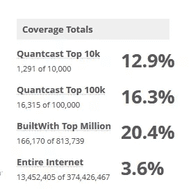

# CSS 网格布局与 CSS 框架之争

> 原文：<https://www.sitepoint.com/css-grid-layout-vs-css-frameworks-debate/>

有了像 [CSS Grid Layout](https://developer.mozilla.org/en-US/docs/Web/CSS/CSS_Grid_Layout) 和 [Flexbox](https://developer.mozilla.org/en-US/docs/Web/CSS/CSS_Flexible_Box_Layout/Basic_Concepts_of_Flexbox) 这样的尖端 CSS 标准，编写网页布局不再是一件痛苦的事情。如果再加上浏览器对 [Grid](https://caniuse.com/#search=css%20grid) 和 [Flexbox](https://caniuse.com/#search=flexbox) 的支持也非常好，那么问题就来了:为什么要考虑在我的开发工作中学习和使用 CSS 框架？

在本文中，我将重点关注 [Bootstrap](https://getbootstrap.com) ，因为它可以说是所有可用的 CSS UI 库中最流行的一个。

在我看来，今天学习和使用 Bootstrap 仍然有意义的原因还有很多。

这里有一些给你。

## 什么是 CSS 网格？

Rachel Andrew 是一位知名的演讲家和作家，她对 CSS 网格相关的所有内容做了如下定义:

> 网格是一个网格系统。它允许您在 CSS 中定义列和行，而不需要在标记中定义它们。你不需要一个工具来帮助你看起来像有一个网格，你实际上有一个网格！

这个 CSS 标准的实现为开发人员提供了用原生 CSS 代码构建页面布局的能力，除了作为包含网格工作的包装器元素之外，不依赖于 HTML 标记。想象一下网页设计的灵活性和潜在创造力吧！

例如，您不需要自定义类或标记中的额外行来构建这个简单的布局:


这是 HTML:

```
<div class="grid">
  <header>Header content</header>
  <main>Main content</main>
  <aside>Sidebar</aside>
  <footer>Footer</footer>
</div>
```

至于 CSS，这是你要建立你的视觉布局的地方。在这个简单的例子中，只需要几行代码:

```
.grid {
  display: grid;
  grid-template-columns: repeat(12, 1fr);
  grid-template-rows: 50px 150px 50px;
}

header, footer {
  grid-column: span 12;
}

main {
  grid-column: span 8;
}

aside {
  grid-column: span 4;
}
```

就这样，你完了！还不错。

## 什么是自举？

在撰写本文时，[整个互联网的 3.6%使用 Bootstrap:](https://trends.builtwith.com/docinfo/Twitter-Bootstrap)



在 Bootstrap 网站上，您可以找到以下定义:

> Bootstrap 是一个用于 HTML、CSS 和 JS 开发的开源工具包。使用我们的 Sass 变量和 mixins、响应式网格系统、广泛的预构建组件和基于 jQuery 的强大插件，快速构建您的想法原型或构建您的整个应用程序。

换句话说，Bootstrap 为您提供了现成的组件，让您可以立即创建一个漂亮的 web 页面。

只需编写适当的标记，您的应用程序开箱后看起来就很棒。

Bootstrap 还可以非常容易地根据您的喜好定制它的外观，并让您挑选项目所需的内容。

## 当我们有网格时为什么要自举？

对 Bootstrap 最大的抱怨一直是代码膨胀。原因是它包含了许多额外的 CSS 代码，而这些代码在您的项目中并没有被使用。第二个最大的抱怨是 Bootstrap 组件在每一个细节上都有风格，这可能会在覆盖一些 CSS 规则时出现一些问题。

从这个流行的前端组件库的最新版本开始，这两种批评都不攻自破:Bootstrap 是完全模块化的，所以您只需要包含您需要的东西。此外， [Sass 文件](http://getbootstrap.com/docs/4.0/getting-started/theming/)的结构可以非常方便地根据您的需求定制原始样式。

今天，反对使用 Bootstrap 的主要原因是，使用 CSS Grid，CSS 有自己的网格系统，它没有任何外部依赖性，一旦学会，开发人员就可以相对容易地构建各种布局。

虽然我是 CSS Grid 的粉丝，但我认为 Bootstrap 在前端开发中仍有一席之地，而且在未来一段时间内还会有。

这里至少有三个原因。

### 自举不仅仅是它的网格系统

的确，使用 Bootstrap 的首要原因是方便的网格系统，这使得构建响应迅速的 web 页面变得轻而易举。然而，Bootstrap 有一些很棒的组件，如多功能的新[卡组件](http://getbootstrap.com/docs/4.0/components/card/)，可以用来显示所有类型的内容，如文本、图像和视频，以及开箱即用的[响应式导航条](http://getbootstrap.com/docs/4.0/components/navbar/)。你也可以为大多数组件选择你喜欢的现成配色方案。

这些组件的功能又如何呢？使用 Bootstrap，添加动态[工具提示](http://getbootstrap.com/docs/4.0/components/tooltips/)、[传送带](http://getbootstrap.com/docs/4.0/components/carousel/)或[下拉按钮](http://getbootstrap.com/docs/4.0/components/dropdowns/)只是编写适当标记的问题。如果 JavaScript 不是您的强项，您仍然可以利用这些组件，而无需编写一行 JavaScript。

此外，如果你不是一个 CSS 奇才，你仍然可以在你的网页设计中利用 Bootstrap 的力量，同时你也在学习这个行业的技巧。

### Bootstrap 是一个很好的原型工具

有时候你只需要为客户设计一个工作原型。Bootstrap 让您可以立即完成这项工作，并且只需很少甚至不需要定制代码。这不仅适用于网格系统，也适用于它所提供的所有现成组件。

只需添加一点标记，你的原型就会拥有一个光滑的响应导航条或一个漂亮的警告框。

### 在使用 Bootstrap 构建的旧网站上工作

开发人员的一个常见任务是在由其他开发人员编码的现有网站上工作。不可否认的事实是，大量网站的前端依赖于 Bootstrap。如果由您来重构和维护代码库，那么知道如何使用框架将会非常方便。这并不是偶然的，仍然有很多招聘信息在他们想要的技能列表中有 Bootstrap。

## 结论

总之，Bootstrap 不会很快消失。最新版本对以前的版本进行了巨大的改进，从巧妙使用 Sass mixins 和 maps 来简化定制，到引入新的组件、实用程序类和更加模块化的架构。

除了这些优秀的文档和易用性，Bootstrap 仍然是前端生态系统中的强大竞争者。

你怎么想呢?你的下一个项目是用 Bootstrap 还是 CSS Grid 来构建？

**如果你听说过 Bootstrap，但因为它看起来太复杂而推迟了学习，那么请浏览我们的[Bootstrap 简介 4](https://www.sitepoint.com/premium/courses/introduction-to-bootstrap-4-2984) 课程，快速而有趣地了解 Bootstrap 的强大功能。**

## 分享这篇文章