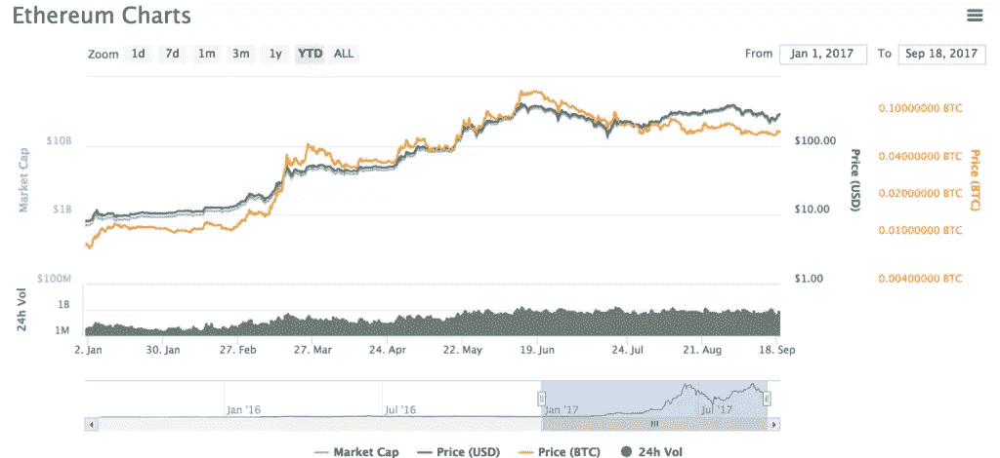
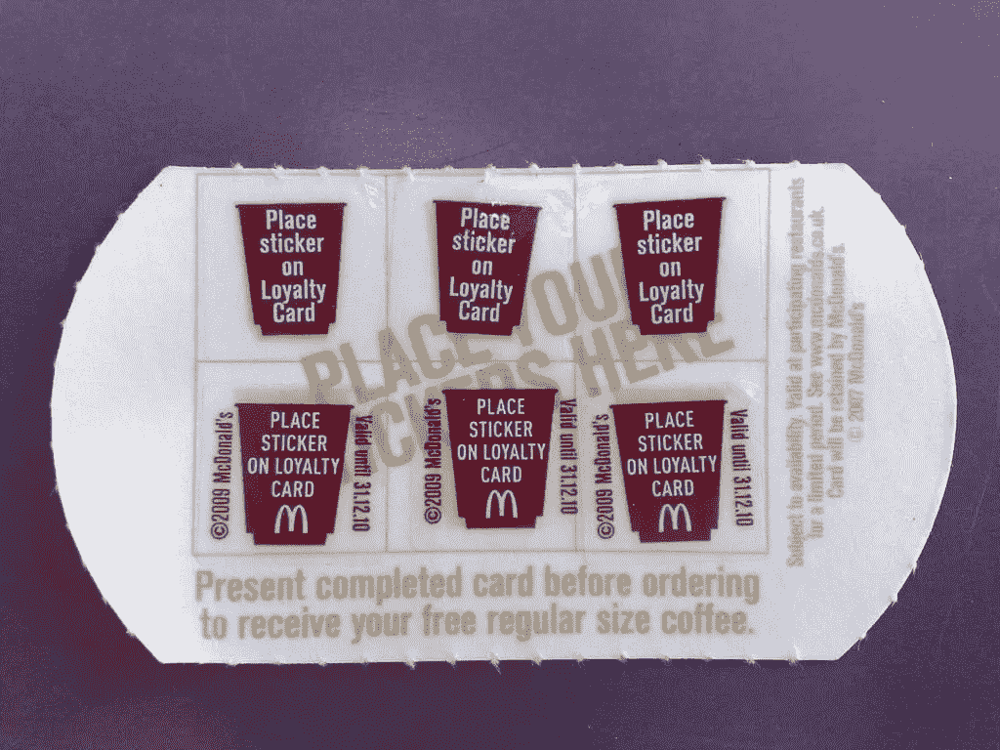

# 以太坊简介:与众不同的加密货币

> 原文：<https://www.sitepoint.com/ethereum-introduction/>

*这篇以太坊的介绍最初发表在 [Bruno 的 Bitfalls 网站](https://bitfalls.com/2017/09/19/what-ethereum-compare-to-bitcoin/)，经允许在此转载。*

*强烈建议您在继续之前阅读我们的[加密货币介绍](https://bitfalls.com/2017/08/20/cryptocurrency/)和[区块链介绍](https://bitfalls.com/2017/08/20/blockchain-explained-blockchain-works/)，以便能够更好地理解接下来的内容。*

* * *

**以太坊(Ethereum)由 Vitalik Buterin 于 2015 年推出，是一个特殊的[区块链](https://bitfalls.com/2017/08/20/blockchain-explained-blockchain-works/)，有一个特殊的令牌叫做以太(ETH 在交易所的符号)。**

以太被用作燃料(字面意思，*气体*)为以太坊网络供电，并执行*智能合约*(见下文)。在*天然气成本*中，乙醚被支付给矿工(运行网络的人)以使下面的功能成为可能，因此不如加密**石油**那么多的加密**货币**。

以下是它与比特币的不同之处，以及它在加密货币领域脱颖而出的原因。

## 定局

比特币的理论上限为 2100 万比特币，这使其成为一种通货紧缩的货币:随着时间的推移，比特币的流通总量会减少，因为人们无法进入自己的 T2 钱包，囤积比特币等。

乙醚没有限制，但有一个固定的生产比例。目前，每年开采超过 1550 万以太，相当于每秒 5 以太——远远超过比特币目前大约每 10 分钟 25 BTC 的速率。在以太坊将其采矿类型(更准确地说是**共识类型**)切换到 PoS(见下文)后，生产率将大幅下降，接近于零。

所有这一切将使以太坊的价值停止不成比例地增长，从而达到市场价格的稳定，这非常适合下面描述的实际用途。

## 智能合同

比特币支持简单的脚本。例如，你可以用比特币编写一个小程序，它将支持有多个地址作为输入的交易，或者需要多重签名(在资金释放之前需要几个人的签名)的交易。然而，用于此的语言不是*图灵完成*，因为它没有*循环*。(如果你不知道这是什么意思，没关系。)

另一方面，以太坊程序是用 Solidity 编写的，Solidity 是一种语言，这种语言*是*图灵完成的，因此在给定足够资源的情况下(在合理范围内),允许用它编写任何类型的程序。当一个程序以固态形式编写时，它需要被发送到区块链，这需要花费*汽油*，以以太支付。这个项目越大越复杂，*在区块链部署*就越昂贵。因此，效率低下需要花钱；让这些项目越小越好，这符合所有参与者的利益。

维塔利克用一个自动售货机的比喻最好地描述了智能合约:

> 自动售货机[…]基本上实现了某种协议的条件。这里的协议条件很简单。你投入 2 美元，水就出来了。你不放 2 美元进去，水就不会出来。如果你不放 2 美元进去，但是水出来了，那就不好了。自动售货机基本上是这套规则的一种编码，它还带有一种机制，至少可以保持某种程度的安全。对于 2 美元的水瓶来说足够安全。

[https://www.youtube.com/embed/r0S4qIMf4Pg](https://www.youtube.com/embed/r0S4qIMf4Pg)

当我们向智能合约支付一定数量的以太时，智能合约可以决定如何处理这个以太:根据一个条件将它发送到地址 A，根据另一个条件发送到地址 B，将其锁定一段时间，将其退还，根据外部输入移动它，根据这个以太触发外部输出，等等。

一个实际的例子是复制 Kickstarter。Kickstarter 是一个网站，让创作者在他们的项目启动前为其筹集资金。基本规则是，如果在给定的天数内超过了给定的金额，项目就成功了，钱可以发放给制造商。否则，退款。这个简单的条件很容易用智能合约复制，从等式中消除了人为错误、贪婪和中间人，提供了一种真正分散的筹资方式。

使用智能合约构建的应用程序被称为分散式应用程序或 dapps。

## 什么是 ERC20 令牌？

以太坊的一个非常重要的特点是能够在以太坊区块链上创造新的代币。代币是一种“加密货币”,由特定的智能合约构建，像其他任何东西一样使用——发送和接收地址。这些代币被发送到以太坊地址，而不是新加密货币区块链的[地址](https://bitfalls.com/2017/08/31/what-cryptocurrency-wallet/)。正因为如此，代币本身并不是真正的加密货币，而是通过智能合约执行的逻辑结果。说代币是加密货币实际上和声称程序是编程语言一样不准确。

代币可以是音乐会门票、商店中的忠诚度积分、游戏中的货币等。

随着越来越多的代币开始出现，它们的格式被标准化为[ERC 20](https://github.com/ethereum/EIPs/pull/610)——一套关于如何开发它们的规则，以使它们易于被各种交易所和系统使用。这意味着所有 ERC20 令牌都有一些共同的特征，如交易所的股票代码、图标等。通过重用以前的 ERC20 令牌所用的相同代码，使它们很容易在各种网站上列出。

结合智能合约创建 ERC20 令牌是以太坊的革命性功能，有望彻底改变我们做生意的方式。代币使自主公司成为可能，它们允许部分购买数字商品或土地，它们甚至允许创造自动驾驶的汽车，这些汽车可以自动驾驶、接送客户、接送客户、收取费用，并有效地偿还自己的债务。潜在用例的数量如此之多，我们甚至还没有触及其表面。

## 刷卡机

与比特币的第三个最大区别是，以太坊将转向另一种被称为 PoS(股权证明)而非 PoW(工作证明)的*挖掘*方式。

有了[比特币](https://bitfalls.com/2017/08/20/blockchain-explained-blockchain-works/)，工作证明的一个单位就是通过进行大规模计算获得的哈希。我们有一个关于[电力和 PoS](https://www.sitepoint.com/proof-of-stake-vs-proof-of-work/) 的单独帖子，但在这里可以说，就电力而言，PoS 系统并不浪费，考虑到[中国的矿业优势](https://bitfalls.com/2017/11/29/new-threat-bitcoin-internet-service-providers/)，这是一个重要的特征。

当然，PoS 也有自己的问题。在这个系统中，一个试图成为**节点**(这种新型的矿工)**的以太坊用户用**赌注来保证他们计算的正确性。如果他们试图欺骗系统，伪造一些无效的计算，其他节点将调用该节点，赌注就会丢失。否则，赌注者会在几个月后拿回他们的赌注(是的，几个月！)加上他们从交易或执行智能合约中获得的任何费用收入。赌注的大小阻止了恶意的行为者；最初的赌注据说是 1000 以太。

## 结论

总结一下，以太坊和比特币的区别在于以下几个方面:

*   它将很快过渡到[股权证明，而不是工作证明](https://bitfalls.com/2018/04/24/whats-the-difference-between-proof-of-work-pow-proof-of-stake-pos-and-delegated-pos/)
*   它很快就可以量子化了
*   它支持在网络上创建子令牌
*   它支持区块链中的自定义逻辑，以实现完全的财务自动化(智能合同)，例如这里的。

谈到 BTC 和瑞士联邦理工学院时，我们还想提到另一个比喻:

*   比特币是黄金。它获取复杂，转移昂贵且缓慢，但具有高度的通缩性和有限性(目前为)。这是一项很好的长期投资，取决于你问的是谁。
*   以太坊并不像许多人认为的那样是比特币的黄金。以太坊就是油。其他产品是在以太坊的帮助下制作的，ERC20 令牌对应于塑料、化妆品、油漆、橡胶……以太坊是一个全新行业的基础，虽然有几个替代产品(Tezos、EOS、Rootstock、NEO)，但它们都没有以太坊那样广泛而强大的开发者或用户社区。

## 分享这篇文章