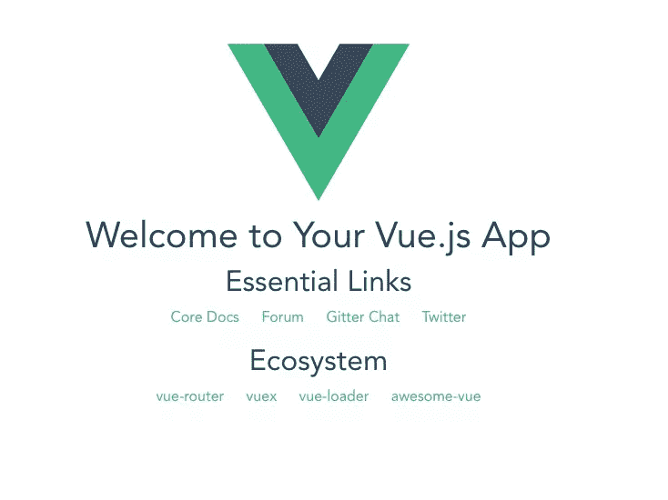

# 使用 Bootstrap-Vue 将 Bootstrap 与 Vue.js 集成

> 原文:# t0]https://www . site point . com/bootstrap-view-js-bootstrap-view/

在本文中，我们将探索如何使用 Bootstrap-Vue 将 Bootstrap 与 Vue.js 集成。

React 和 Vue.js 是前端开发的两个领先的现代 JavaScript 框架。尽管 React 有着陡峭的学习曲线和复杂的构建过程(如果您来自 jQuery 世界)，但开始使用 Vue.js 所需要做的只是一个简单的导入脚本:

```
<script src="https://unpkg.com/vue@2.5.17/dist/vue.min.js"></script> 
```

Bootstrap 已经成为构建移动响应网站的流行 HTML/CSS 框架。然而，它主要依赖于 jQuery 的核心特性和广泛的组件列表——比如警报和模态。因此，我们将探索如何将 Bootstrap 与 Vue.js 一起使用，从而消除对 jQuery 的需求。

## 自举简介

Bootstrap 最初由 Twitter Inc .的马克·奥托(Mark Otto)和雅各布·桑顿(Jacob Thornton)于 2011 年底创建，在开源后很快在 Twitter 之外流行起来。它继续成长为全球 web 开发人员最快的前端框架。

如今，Bootstrap 已经成为启动新网站项目的事实上的标准，其 CSS 和 JS 架构提供了移动响应和公共 UI 组件，并支持大多数现代浏览器。

## 用 Vue.js 连接 Bootstrap

正如我们前面提到的，将 Bootstrap 与 Vue.js 一起使用有点棘手，因为 Bootstrap 的动态组件严重依赖 jQuery。然而，至少有几个好项目正在弥合这一差距:

*   自举视图
*   你的

我们将在这里探索第一个选项 Bootstrap-Vue，因为它是最新最流行的项目。

## 引导程序视图

Bootstrap-Vue 不仅支持 Bootstrap 组件和网格系统，还包括对 [Vue.js 指令](https://012.vuejs.org/guide/directives.html)的支持，这为我们提供了来自 Vue.js 生态系统的完整功能集。

Bootstrap-Vue 的一个很酷的特性是它有一个[在线游乐场](https://bootstrap-vue.js.org/play)。这个游戏场是热重装的，也允许我们将代码导出到 JSFiddle。是不是很酷！

我相信一个好的文档和开发者生态系统是任何软件项目成功的必要条件，Bootstrap-Vue 勾选了所有的复选框。

## 使用命令行开始使用 Bootstrap-Vue

如果你一直在关注现代 web 开发趋势，你肯定知道 npm 和用它安装库。Bootstrap-Vue 可以通过以下命令与 npm 一起安装:

```
npm i bootstrap-vue 
```

Bootstrap-Vue 还提供了两个 vue-cli 模板，可以轻松搭建我们的项目:

*   webpack simple :小型应用的快速脚手架。
*   **webpack** :用于更大的生产能力项目。

首先，我们通过以下方式安装 vue-cli:

```
npm i -g vue-cli 
```

然后，我们使用 webpack-simple 模板，通过在终端中键入以下内容来初始化我们的项目——姑且称之为*入门*:

```
vue init bootstrap-vue/webpack-simple getting-started 
```

将会打开一个向导。您可以按`Return`接受默认设置。

然后，键入:

```
cd getting-started
npm install
npm run dev 
```

让我们一行一行地看看这段代码:

*   第一行以`vue init`开始，创建一个名为`getting-started`的新目录，在这里初始化一个新的 Bootstrap-Vue 项目。
*   通过`cd getting-started`，我们可以访问新项目的目录。
*   负责安装项目的所有依赖项。
*   最后用`npm run dev`编译 app，在浏览器中启动。

您的本地环境现在应该包含以下文件和文件夹:

```
├── index.html
├── node_modules
│   └── lots of files
├── package.json
├── package-lock.json
├── README.md
├── src
│   ├── App.vue
│   ├── assets
│   │   └── logo.png
│   └── main.js
└── webpack.config.js 
```

这里，`App.vue`和`main.js`是感兴趣的主要文件。如果我们启动我们的文本编辑器并打开`main.js`，我们会看到下面的代码，它导入了 Bootstrap 样式表和 Bootstrap-Vue:

```
import Vue from 'vue'
import BootstrapVue from "bootstrap-vue"
import App from './App.vue'
import "bootstrap/dist/css/bootstrap.min.css"
import "bootstrap-vue/dist/bootstrap-vue.css"

Vue.use(BootstrapVue)

new Vue({
  el: '#app',
  render: h => h(App)
}) 
```

同时，`App.vue`文件加载前端代码。

运行`npm run dev`命令后，项目的`index.html`页面应该呈现如下所示的页面:



## 在文档`<head>`部分导入带有`script`标签的 Bootstrap-Vue

虽然我们已经看到了安装和使用 Bootstrap-Vue 的 npm 方式，但是让我们看看更简单的选择:在我们的 HTML 文档中使用一个`script`标签来包含 Bootstrap-Vue:

```
<!-- Add Bootstrap and Bootstrap-Vue CSS to the <head> section -->
<link type="text/css" rel="stylesheet" href="https://unpkg.com/bootstrap/dist/css/bootstrap.min.css"/>
<link type="text/css" rel="stylesheet" href="https://unpkg.com/bootstrap-vue@latest/dist/bootstrap-vue.min.css"/>

<!-- Add Vue and Bootstrap-Vue JS just before the closing </body> tag -->
<script src="https://unpkg.com/vue/dist/vue.min.js"></script>
<script src="https://unpkg.com/bootstrap-vue@latest/dist/bootstrap-vue.min.js"></script> 
```

这将引入每个库的缩小的最新版本。在撰写本文时，这是 Bootstrap v4.1.3、Bootstrap-Vue v2.0.0-rc.11 和 Vue v2.5.17。

如果出于某种原因，您需要支持传统浏览器，您也可以包括 [@babel/polyfill](https://babeljs.io/docs/en/babel-polyfill) ，它将模拟完整的 ES2015+环境:

```
<script src="https://unpkg.com/babel-polyfill@latest/dist/polyfill.min.js"></script> 
```

现在我们可以在本地机器上使用 Vue.js、Bootstrap 和 Bootstrap-Vue。

## 使用引导程序-Vue 组件

对于本文中的演示，我们将使用 [CodePen](https://codepen.io/) 。要设置它，让我们创建我们的笔，单击设置图标，并在 CSS 选项卡中导入以下 CSS:

```
https://unpkg.com/bootstrap@4.1.3/dist/css/bootstrap.min.css
https://unpkg.com/bootstrap-vue@2.0.0-rc.11/dist/bootstrap-vue.css 
```

在 JavaScript 选项卡中，让我们导入 Vue 和引导 Vue 库:

```
https://unpkg.com/vue@2.5.17/dist/vue.min.js
https://unpkg.com/bootstrap-vue@2.0.0-rc.11/dist/bootstrap-vue.min.js 
```

另外，确保选择 *Babel* 作为 JavaScript 预处理器。

最后，让我们点击*保存&关闭*按钮。现在我们准备开始使用 Bootstrap-Vue 组件。

### 构建 Bootstrap-Vue 警报组件

为了创建 Bootstrap-Vue alert 组件，我们将在 CodePen HTML 区域添加以下内容:

```
<div id='app'>
  <b-alert show> Hello {{ name }}! </b-alert>
</div> 
```

接下来，我们将 Vue 实例添加到 JS 区域:

```
new Vue({
  el: "#app",
  data: {
    name: "Sitepoint"
  }
}); 
```

因此，我们应该看到“Hello Sitepoint！”输出视图区域中的警报:

参见 [CodePen](https://codepen.io) 上 SitePoint ( [@SitePoint](https://codepen.io/SitePoint) )的笔[入门 Bootstrap Vue](https://codepen.io/SitePoint/pen/oEmzQr/) 。