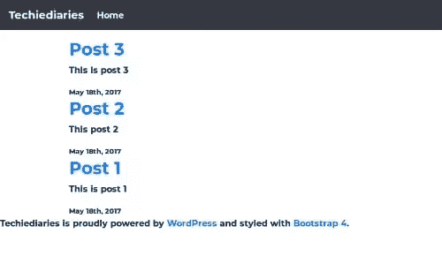

# 引导和 WordPress 主题集成在 8 个简单的步骤

> 原文：<https://www.sitepoint.com/bootstrap-wordpress-theme-integration/>

本教程解释了同时使用 Bootstrap 和 WordPress 的关键步骤，将 Bootstrap 库的最新版本与 WordPress 主题相集成。

Bootstrap 和 WordPress 都非常受欢迎:[互联网上的 3.7 网站都是用 Bootstrap](https://trends.builtwith.com/docinfo/Twitter-Bootstrap) 和[建立的，29%的网站使用 WordPress](https://wordpress.org/) 。显然，知道如何使用这两种强大而成熟的开源技术来构建网站和应用程序对于工作场所的开发人员来说是一项有价值的技能。

有很多内容要讲，所以让我们开始吧！

## 为什么选择 WordPress？

WordPress 是一款开源软件，你可以用它来创建一个漂亮的网站、博客或应用程序。

WordPress 的流行主要是因为它的易用性和强大的外观、定制和可扩展性选项(通过主题和插件)。

多亏了 WordPress 主题，几乎没有编程经验的网站管理员可以用专业的外观和定制的功能来驱动他们的网站。用户可以使用管理仪表板中的*外观*菜单轻松选择不同的主题，或者将主题文件直接复制到 *wp-content >主题*文件夹中。主题可以从专门的市场、个人开发者那里购买，也可以从 WordPress.org 的[主题目录](https://wordpress.org/themes/)中免费安装。

作为开发人员，我们可以创建自己的主题，这就是我们在本教程中要做的。更具体地说，我们将执行构建一个简单的 WordPress 主题的关键步骤，这个主题集成了最新发布的 Bootstrap 库。

## 为什么自举？

Bootstrap 是一个强大而全面的 UI 库，用于开发响应迅速、移动优先的网站和应用程序。以下是使用 Bootstrap 作为 WordPress 主题样式框架的一些优点。

### 一起使用 Bootstrap 和 WordPress 主题的优势

在我看来，使用 Bootstrap 来设计 WordPress 主题有很多好处。

*   Bootstrap 是一个流行的开源项目，经过广泛的开发和持续的维护，随着时间的推移，bug 越来越少。

*   它是一个跨浏览器的框架，支持主流浏览器，具有良好的 CSS 基线，称为[Reboot]
    (http://get bootstrap . com/docs/4.0/content/Reboot/)。

*   它有一个广泛和彻底的文件。

*   它处理重置、网格、排版、实用程序和媒体查询，从而节省了开发时间。

*   开发人员广泛使用它来设计网站，因此很容易找到教程、演示和开源项目来学习或扩展。

*   Bootstrap 可用于快速创建移动优先和移动优化的 WordPress 主题，而无需重新发明轮子。

*   社区提供了大量的入门主题，例如 [Understrap](https://understrap.com/) ，旨在为开发者提供一个快速的起点，使用 Bootstrap 创建 WordPress 主题。

*   尽管 Bootstrap 并没有考虑到 WordPress，但它可以很容易地与 WordPress 集成。

*   一旦我们对可用的类有了足够的了解，我们就可以很容易地定制 Bootstrap 来满足特定的项目需求。

*   我们可以利用数百个已经与 Bootstrap 集成的 JavaScript/jQuery 插件。

*   从 Bootstrap 4 开始，插件使用现代的 ES6。

*   随着 Bootstrap 4 的发布，该库现在使用 Sass 而不是 Less 作为首选的预处理器，这使得它能够更广泛地兼容大量的开发人员工作流。

*   Bootstrap 4 引入了新组件，如[卡组件](http://getbootstrap.com/docs/4.0/components/card/)。自举卡使创建[一个现代的、基于卡的布局](https://www.sitepoint.com/bootstrap-card-component-introduction)变得容易，比如砖石风格的界面。

*   Bootstrap 4 网格系统构建在 [flexbox](https://developer.mozilla.org/en-US/docs/Web/CSS/CSS_Flexible_Box_Layout/Basic_Concepts_of_Flexbox) 之上，这使得网格更加灵活、开发人员友好和干净。

### Bootstrap 和 WordPress 一起使用有什么缺点吗？

至于缺点，开发人员社区提出了一些问题，包括以下内容。

*   Bootstrap 并不是为与 WordPress 直接集成而设计的，但这对大多数开发者来说不应该是一个巨大的障碍。

*   如果我们需要覆盖许多预定义的引导样式来满足设计需求，使用 CSS 框架可能根本不值得。

*   确实，Bootstrap 可以很容易地将响应样式快速添加到我们的主题中。然而，我们还需要花时间学习 Bootstrap，以便能够添加我们的定制，这样我们的主题看起来就不同于互联网上众多基于 Bootstrap 的网站。

*   Bootstrap 依赖于 jQuery，所以在某些情况下我们可能不得不处理与 jQuery 相关的问题——比如过时的插件，或者不得不包含整个 jQuery 库，即使我们的项目只需要像`$.ajax()`这样的小特性。

## 跟进的先决条件

在本教程中，我假设你有一个安装了 PHP、MySQL 和 WordPress 的开发环境——比如 [Homestead 改良版](https://github.com/Swader/homestead_improved/)。这个[快速提示](https://www.sitepoint.com/quick-tip-get-homestead-vagrant-vm-running/)将帮助你立刻启动并运行一个全新的家园改进版流浪者虚拟机。

你还需要熟悉 WordPress——特别是如何安装和激活主题，添加 WordPress 菜单，创建文章和页面等。

最后，你需要了解一些如何构建 WordPress 主题的知识。事实上，这是一个关于在 WordPress 主题中集成 Bootstrap 的教程，而不是一个关于如何构建一个全功能的 WordPress 主题的教程，后者的范围比我们在本文中所能得到的要广得多。

## 集成 Bootstrap 和 WordPress 的关键步骤

在这一部分，我们将学习在一个简单的 WordPress 主题项目中集成 Bootstrap 所需的关键步骤。

首先，让我们回顾一下我们将要创建的文件。

### WordPress 主题的结构

WordPress 主题有一个预定的文件结构。WordPress 需要一些文件来识别主题。

第一个需要的文件是`style.css`。这个 CSS 文件包含了主题的样式。最重要的是，这个文件还有一个特殊的任务:它提供关于主题的元信息，比如主题名称、描述、作者和其他额外的细节。元信息需要以 CSS 注释的形式出现在文件的头部。

另一个需要的文件是`index.php`，这是主要的 WordPress 主题文件，也是 WordPress 所依赖的最后一个后备模板文件，以防找不到任何其他模板文件来显示其内容。

有许多可选文件，但是对于我们简单的基于引导的主题，我们只添加以下文件:

*   `header.php`和`footer.php`，分别展示我们 WordPress 主题的页眉和页脚部分，它们显示在我们主题的每一页上
*   在这里，我们将编写代码来加载主题的定制样式表、引导样式和脚本等等。

如果你很好奇，看看你可以从 [WordPress 文档](https://developer.wordpress.org/themes/template-files-section/post-template-files/)中定制的其他模板。

言归正传！

### 步骤 1:创建主题文件夹

首先，我们前往 WordPress 安装文件夹并导航到`wp-content -> themes`。这里，我们为我们的主题创建一个文件夹。姑且称之为`bs-theme`。

### 步骤 2:添加 style.css

让我们创建第一个必需的文件`style.css`，我们将在其中放置自定义 CSS 代码。

在这个样式表文档的顶部(确保顶部没有留白)，我们在 CSS 注释之间添加了关于主题的元信息(记得用与您自己的项目相关的值替换`<THEME_URI>`、`<AUTHOR_NAME>`和`<AUTHOR_URI>`占位符):

```
/*   
Theme Name: BS 4 Theme
Theme URI: <THEME_URI>
Description: A Theme for WordPress with Bootstrap for styling.
Author: <AUTHOR_NAME>
Author URI: <AUTHOR_URI>
Version: 1.0
*/ 
```

现在 WordPress 可以在管理区显示我们主题的信息了。

我们可以在元信息评论下面添加我们的自定义样式。例如，让我们添加一些 CSS 规则来设置`<body>`的样式:

```
@import url(https://fonts.googleapis.com/css?family=Montserrat:700);

body {
  padding-top: 4.5rem;
  font-family: 'Montserrat','Helvetica Neue',Arial,sans-serif;
  color: #001A33;
} 
```

### 步骤 3:创建标题部分

让我们从在`themes`文件夹中创建`header.php`开始。接下来，我们添加以下内容:

```
<!DOCTYPE html>
<!--[if lt IE 7]><html class="no-js lt-ie9 lt-ie8 lt-ie7"> <![endif]-->
<!--[if IE 7]><html class="no-js lt-ie9 lt-ie8"> <![endif]-->
<!--[if IE 8]><html class="no-js lt-ie9"> <![endif]-->
<!--[if gt IE 8]><!--> <html class="no-js"> <!--<![endif]-->
  <head>
    <meta charset="utf-8">
    <meta http-equiv="X-UA-Compatible" content="IE=edge,chrome=1">

    <title><?php wp_title('&laquo;', true, 'right'); ?> <?php bloginfo('name'); ?></title>

    <meta name="description" content="">
    <meta name="author" content="">

    <meta name="viewport" content="width=device-width">
    <link rel="pingback" href="<?php bloginfo('pingback_url'); ?>" />

    <?php wp_head(); ?>
</head>
<body <?php body_class(); ?>>
  <nav class="navbar navbar-expand-md navbar-dark fixed-top bg-dark">
    <a class="navbar-brand" href="#">
      <?php bloginfo('name'); ?>
    </a>
    <button class="navbar-toggler" type="button" data-toggle="collapse" data-target="#navbarCollapse" aria-controls="navbarCollapse" aria-expanded="false" aria-label="Toggle navigation">
      <span class="navbar-toggler-icon"></span>
    </button>
    <div class="collapse navbar-collapse" id="navbarCollapse">
      <ul class="navbar-nav mr-auto">
        <li class="nav-item active">
          <a class="nav-link" href="/">
            Home <span class="sr-only">(current)</span>
          </a>
        </li>
      </ul>
    </div>
  </nav> 
```

在上面的代码中，HTML `head`部分的大部分元信息是使用各种 WordPress 标签添加的，例如 [`bloginfo('name')`](https://developer.wordpress.org/reference/functions/bloginfo/) 用于获取网站名称， [`wp_title()`](https://developer.wordpress.org/reference/functions/wp_title/) 用于获取页面标题，`wp_head()`用于触发 WordPress 使用的 [wp_head 操作钩子](https://codex.wordpress.org/Plugin_API/Action_Reference/wp_head)向`head`部分添加链接和其他功能。

我们还使用了不同的引导类来创建一个响应性的导航栏。然而，实际上，导航栏并不是动态的。也就是说，它没有与 [WordPress 菜单功能](https://codex.wordpress.org/WordPress_Menu_User_Guide)集成。这意味着我们不能在管理区建立一个 WordPress 菜单，并看到它显示在我们网站的前端。

赋予静态引导导航条 WordPress 的力量将是我们的下一步。

### 步骤 4:将引导导航与 WordPress 菜单集成在一起

为了完成我们的任务，我们需要一个 [WordPress `walker`类](https://codex.wordpress.org/Class_Reference/Walker)，它允许开发人员遍历树状数据结构，以呈现 HTML 标记。互联网上有一些引导导航`walker`类。对于本教程，我们将使用 Dominic Businaro 的 [BS4navwalker](https://github.com/dupkey/bs4navwalker#bs4navwalker) ，它可以在 GitHub 上免费获得。

我们获取`bs4navwalker.php`并将其保存在主题的根目录下(在本教程的前面我们称之为`bs-theme`)。

接下来，我们将在主题的根文件夹中创建一个`functions.php`文件(这个名称是 WordPress 所必需的),我们将编写这行代码:

```
require_once('bs4navwalker.php'); 
```

现在我们可以在主题文件中使用引导导航`walker`类。

我们找到刚刚编写的`nav`元素的标记，并对其进行如下修改:

```
<nav class="navbar navbar-expand-md navbar-dark fixed-top bg-dark">
  <a class="navbar-brand" href="#">
    <?php bloginfo('name'); ?>
  </a>
  <button class="navbar-toggler" type="button" data-toggle="collapse" data-target="#navbarCollapse" aria-controls="navbarCollapse" aria-expanded="false" aria-label="Toggle navigation">
    <span class="navbar-toggler-icon"></span>
  </button>
  <?php
    wp_nav_menu([
      'menu'            => 'primary',
      'theme_location'  => 'menu-1',
      'container'       => 'div',
      'container_id'    => 'navbarCollapse',
      'container_class' => 'collapse navbar-collapse',
      'menu_id'         => false,
      'menu_class'      => 'navbar-nav mr-auto',
      'depth'           => 0,
      'fallback_cb'     => 'bs4navwalker::fallback',
      'walker'          => new bs4navwalker()
    ]);
  ?>
</nav> 
```

上面的代码*假设我们已经在 WordPress 管理区*创建了一个菜单，并且在 WordPress 数据库中存储了一些页面。

为了显示我们的导航栏，我们使用了`wp_nav_menu()`函数。

我们传递给`wp_nav_menu()`的`menu`和`theme_location`参数的值取自我们的 WordPress 菜单的设置，我们应该已经在管理区创建了这个菜单。

参数`container`、`container_id`和`container_class`的值取自引导类和`div`元素的 CSS `id`属性，该元素包装了包含导航链接列表项的`ul`元素。

`menu_class`参数的值来自于`ul`元素上的 Bootstrap 类。

`depth`参数的值表示我们的导航菜单将有多少个层级。我们已经将其设置为`0`，这是默认值，代表*所有*。

`walker`参数在这里非常重要，我们已经将它设置为`bs4navwalker`类的一个新实例，它负责呈现引导导航标记。

我们完事了。

你可以在[WordPress.org 文档页面](https://developer.wordpress.org/reference/functions/wp_nav_menu/)上找到关于`wp_nav_menu()`功能参数的完整列表的详细解释。

### 步骤 5:创建页脚部分

下一步是创建`footer.php`文件并添加以下内容:

```
 <footer>  
    </footer>
    < ?php wp_footer(); ?>
  </body>
</html> 
```

WordPress 使用`wp_footer()`在页面底部动态放置不同的标记元素，比如样式表和 JavaScript 文件的链接。

需要注意的是，许多插件使用 [`wp_head()`](https://developer.wordpress.org/reference/functions/wp_head/) 和 [`wp_footer()`](https://developer.wordpress.org/reference/functions/wp_footer/) 挂钩将所需元素放置在页面的页眉和页脚中。因此，你需要确保添加两个钩子，如本教程所示。这样做可以避免在我们的主题被激活时破坏这些插件的功能。

### 步骤 6:添加 index.php 模板文件

`index.php`是每个 WordPress 主题的第二个必需文件，所以让我们继续创建它。然后我们添加以下内容:

```
<?php get_header(); ?>
  <!-- Other Content here -->
<?php get_footer(); ?> 
```

使用`get_header()`和`get_footer()`命令 WordPress 在`index.php`中包含之前创建的模板`header.php`和`footer.php`。

### 步骤 7:添加 WordPress 循环

为了展示我们的帖子，我们将使用著名的 [WordPress 循环](https://codex.wordpress.org/The_Loop)。

在`index.php`内部，在 header 和 footer 标记之间，让我们添加以下代码:

```
<div>
  <?php if ( have_posts() ) : while ( have_posts() ) :   the_post(); ?>
    <h2>
      <a href="<?php the_permalink() ?>">
        <?php the_title(); ?>
      </a>
    </h2>
    <?php the_content(); ?>
  <?php endwhile; else: ?>
    <p>There no posts to show</p>
  <?php endif; ?>
</div> 
```

这就是上面发生的情况:

*   我们通过调用`have_posts()`来检查是否有任何帖子。
*   使用一个`while`循环，我们遍历所有现有的帖子。
*   最后，我们显示每个帖子的标题和内容。我们还可以获得额外的信息，比如帖子发布的日期、帖子的作者、与每个帖子相关的评论等等。

### 步骤 8:添加引导

添加模板文件后，我们现在有了一个好的开始主题，我们可以通过管理面板中的*外观*菜单激活它。

如果我们预览我们的主题，我们会得到一个无样式的网站，看起来像下面的截图:


为了给我们的主题一个引导外观，我们需要在我们的项目中包含引导文件。

让我们从 getbootstrap.com 的[获取引导 ZIP 文件，并将文件复制到我们的主题中。(出于组织的目的，我们可以将`css`和`js`文件夹添加到我们的项目中，并将相应的文件放在适当的文件夹中。)](https://getbootstrap.com/docs/4.0/getting-started/download/)

我们的文件夹结构应该是这样的:

```
- bs-theme
  - style.css
  - footer.php
  - functions.php
  -  header.php
  - index.php
  - single.php
  - css
      - bootstrap.min.css
  - js
    - vendor
      - bootstrap.bundle.min.css 
```

接下来，我们将执行以下操作:

*   [**入队**](https://www.sitepoint.com/enqueuing-scripts-styles-wordpress/) 引导样式表和 JavaScript 文件
*   使用 [WordPress 钩子](https://www.sitepoint.com/digging-deeper-wordpress-hooks-filters/)将引导文件插入网页。

让我们从打开`functions.php`开始，添加以下代码:

```
<?php

function themebs_enqueue_styles() {

  wp_enqueue_style( 'bootstrap', get_template_directory_uri() . '/css/bootstrap.min.css' );
  wp_enqueue_style( 'core', get_template_directory_uri() . '/style.css' );

}
add_action( 'wp_enqueue_scripts', 'themebs_enqueue_styles');

function themebs_enqueue_scripts() {
  wp_enqueue_script( 'bootstrap', get_template_directory_uri() . '/js/vendor/bootstrap.bundle.min.js', array( 'jquery' ) );
}
add_action( 'wp_enqueue_scripts', 'themebs_enqueue_scripts'); 
```

我们在这里使用了各种各样的 WordPress 方法，所以让我们简单地看一下每一种方法:

*   `wp_enqueue_style()`:该方法将作为参数传递的样式表入队并加载。在上面的代码中，我们用它来加载引导样式表和自定义 CSS 文件。
*   `wp_enqueue_script()`:该方法将一个脚本文件入队并加载。我们用它来加载 Bootstrap 的 JavaScript 包，将 [jQuery 库](http://jquery.com/)指定为依赖项。jQuery 已经和 WordPress 捆绑在一起了，所以我们不需要使用 URL 来加载它。(WordPress 完全知道从哪里得到它。)
*   `get_template_directory_uri()`:该方法获取当前激活的主题目录的 URI。
*   `add_action('wp_enqueue_scripts', '...')`:这个方法将我们的函数挂钩到 *wp_enqueue_scripts* 动作中(当需要出现在网站前端的队列样式和脚本时使用)。

你可以在 [WordPress 主题文档](https://developer.wordpress.org/themes/basics/including-css-javascript/#enqueuing-scripts-and-styles)中找到更多关于包含 CSS 和 JavaScript 文件的信息。

这是我们现在的主题，具有闪亮的引导外观:



## 结论

在本教程中，我们看到了如何创建一个简单的 WordPress 主题，它集成了最新版本的 Bootstrap。

有了这个开发者的新技能，你现在就可以创建你自己的基于 Bootstrap 的 WordPress 主题并与世界分享了！

**如果你听说过 Bootstrap，但因为它看起来太复杂而推迟了学习，那么请浏览我们的[Bootstrap 简介 4](https://www.sitepoint.com/premium/courses/introduction-to-bootstrap-4-2984) 课程，快速而有趣地了解 Bootstrap 的强大功能。**

## 分享这篇文章