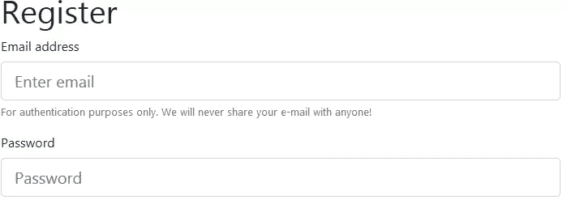
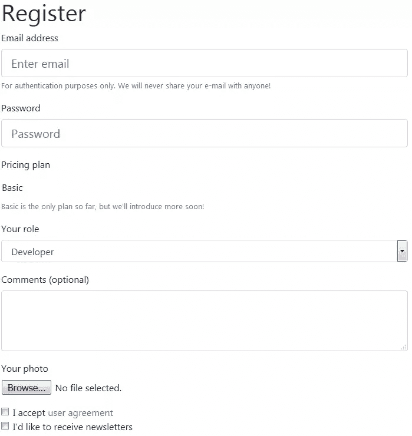

# 深入探究引导表单组件

> 原文：<https://www.sitepoint.com/deep-dive-bootstrap-form-component/>

在本文中，您将学习如何使用 Bootstrap 表单组件来设计表单元素的样式，以及如何利用网格系统来对齐这些元素。此外，我们将看到横向和内联表单的运行，并讨论表单验证。

我仍然记得(不太好)过去的日子，那时我们必须手动为网站的所有样式编码。几乎没有可靠的 CSS 解决方案，创建复杂的 ui 曾经是一件非常痛苦的事情。这就像是开发人员相互分享的神秘知识:他们讲述如何制作圆形，如何突出重点元素或创建渐变背景……我真的不怀念那些日子。幸运的是，有许多新技术可以帮助我们加速 web 应用程序的样式化过程。其中一种技术是 [Bootstrap](https://getbootstrap.com) ，今天我们将讨论它最常用的组件之一:*表单*。

有许多预定义的样式可以应用到表单中，使用它们，您可以毫不费力地创建漂亮的 ui。

## 入门指南

如果您想继续下去，请创建以下样板 HTML:

```
<!DOCTYPE html>
<html>
<head>
  <meta charset="utf-8">
  <link href="https://maxcdn.bootstrapcdn.com/bootstrap/4.0.0/css/bootstrap.min.css"
        rel="stylesheet">
</head>
<body>

    <div class="container">
    </div>

    <script src="https://code.jquery.com/jquery-3.2.1.slim.min.js"></script>
    <script src="https://cdnjs.cloudflare.com/ajax/libs/popper.js/1.12.9/umd/popper.min.js"></script>
    <script src="https://maxcdn.bootstrapcdn.com/bootstrap/4.0.0/js/bootstrap.min.js"></script>
</body>
</html> 
```

我们加载了一个例子中需要的引导样式和一些脚本。就是这个！所有的标记都应该放在作为页面主要元素的`container`块中。

我们可以进入下一部分，开始制作我们的第一个表单。

## 创建简单的表单

假设我们正在为我们闪亮的新网站创建一个注册表单。我们的表单至少应该提供电子邮件地址和密码字段:

```
<div class="container">
    <p class="h1">Register</p>

    <form>
        <label for="email">Email address</label>
      <input type="email" id="email" placeholder="Enter email">

        <label for="password">Password</label>
        <input type="password" id="password" placeholder="Password">
    </form>
</div> 
```

现在，让我们来设计一下这些字段的样式。首先，`label`和`input`应该用自举表单组件 [`form-group`类](https://getbootstrap.com/docs/4.0/components/forms/#form-groups)包装在一个元素内，它将增加一个小的顶部边距。此外，我们给输入分配了一个`form-control`类，使它们看起来更好:

```
<form>
    <div class="form-group">
        <label for="email">Email address</label>
      <input type="email" id="email" placeholder="Enter email" class="form-control">
    </div>

    <div class="form-group">
        <label for="password">Password</label>
        <input type="password" id="password" placeholder="Password" class="form-control">
    </div>
</form> 
```

请注意，Bootstrap 会自动[重启](https://getbootstrap.com/docs/4.0/content/reboot/#forms)表单元素，以便可以轻松应用新样式。

为什么我们不在电子邮件表单下面显示一些[帮助文本](https://getbootstrap.com/docs/4.0/components/forms/#help-text)来通知用户我们不会以任何恶意的方式使用他们的数据？在 Bootstrap 3 中，帮助文本用`help-block`类标记，但是最新版本的框架使用了一个名为`form-text`的类。让我们把它放在`input`的正下方(在`form-group`的内部)。同样，让我们通过应用引导表单组件`text-muted`类使文本看起来更微妙:

```
<div class="form-group">
  <label for="email">Email address</label>
  <input type="email" class="form-control"
     id="email" aria-describedby="emailHelp" placeholder="Enter email"> <!-- #1 -->
  <small id="emailHelp" class="form-text text-muted"> <!-- #2 -->
    For authentication purposes only. We will never share your email with anyone!
  </small>
</div> 
```

注意我们是如何为输入添加`aria-describedby`属性(点#1)的，以解释这个字段是由我们的帮助块(#2)描述的。

为什么不把我们的两个字段也做得大一点，以强调它们的重要性？使用自举表单组件的`form-control-lg`和`form-control-sm`类，可以很容易地[确定输入的大小](https://getbootstrap.com/docs/4.0/components/forms/#sizing):

```
<div class="form-group">
  <label for="email">Email address</label>
  <input type="email" class="form-control form-control-lg"
     id="email" aria-describedby="emailHelp" placeholder="Enter email"> <!-- #1 -->
  <small id="emailHelp" class="form-text text-muted">
    For authentication purposes only. We will never share your email with anyone!
  </small>
</div>

<div class="form-group">
  <label for="password">Password</label>
  <input type="password" class="form-control form-control-lg"
     id="password" placeholder="Password"> <!-- #2 -->
</div> 
```

结果如下:



表单看起来非常清晰，当前选择的输入有一个漂亮的蓝色边框。酷！

### 引导表单组件只读元素

假设现在我们想为我们的用户引入多种定价方案，但目前只有一个“基本”方案可用。让我们添加一个引导表单组件[只读输入，样式为纯文本](https://getbootstrap.com/docs/4.0/components/forms/#readonly-plain-text)。这就像分配`form-control-plaintext`类一样简单:

```
<div class="form-group">
  <label for="pricingPlan">Pricing plan</label>
  <input type="text" readonly class="form-control-plaintext"
     id="pricingPlan" value="Basic" aria-describedby="pricingPlanHelp"> <!-- #1 -->
  <small id="pricingPlanHelp" class="form-text text-muted">
    Basic is the only plan so far, but we'll introduce more soon!
  </small>
</div> 
```

结果如下:


### 引导表单组件支持的其他类型的输入

Bootstrap 支持所有类型输入的样式。例如，我们可以选择下拉菜单，让用户选择他们的角色:

```
<div class="form-group">
  <label for="role">Your role</label>
  <select class="form-control" id="role">
    <option>Developer</option>
    <option>Designer</option>
    <option>Manager</option>
  </select>
</div> 
```

我们再一次简单地用引导表单组件`form-group`类将所有东西包装在一个容器中，并将`form-control`类分配给下拉列表。

那`textarea`呢？我们只是遵循同样的原则:

```
<div class="form-group">
  <label for="comments">Comments (optional)</label>
  <textarea class="form-control" id="comments" rows="3"></textarea>
</div> 
```

文件上传控制？这里也没有问题:

```
<div class="form-group">
  <label for="photo">Your photo</label>
  <input type="file" class="form-control-file" id="photo">
</div> 
```

复选框？轻松点。唯一要记住的是，复选框和单选按钮[应该用`form-check`而不是`form-group`类包装在](https://getbootstrap.com/docs/4.0/components/forms/#checkboxes-and-radios)元素中。这个类添加了一些额外的填充，使这些元素看起来更好。此外，我们将`form-check-input` (#1)分配给复选框，将`form-check-label` (#2)分配给标签，以便它们正确对齐:

```
<div class="form-check">
  <input class="form-check-input" type="checkbox" value="1" id="userAgreement"> <!-- #1 -->
  <label class="form-check-label" for="userAgreement"> <!-- #2 -->
    I accept <a href="#">user agreement</a>
  </label>
</div>

<div class="form-check">
  <input class="form-check-input" type="checkbox" value="1" id="newsletter">
  <label class="form-check-label" for="newsletter">
    I'd like to receive newsletters
  </label>
</div> 
```

让我们重新加载页面并观察结果:



对于一个完全没有自定义样式的页面来说，看起来相当不错。

### 小跟班

接下来，我们将在表单底部添加一个*提交*和一个*返回*按钮。[按钮](https://getbootstrap.com/docs/4.0/components/buttons/)也可以用 Bootstrap 设计:有多种可用的[颜色](https://getbootstrap.com/docs/4.0/components/buttons/#examples)、[尺寸](https://getbootstrap.com/docs/4.0/components/buttons/#sizes)和[状态](https://getbootstrap.com/docs/4.0/components/buttons/#active-state)可供选择。

有趣的是，预定义的类不仅仅与按钮一起工作。例如，一个链接可以作为一个按钮，并且可以使用相同的类来设计。至少，应该给元素分配一个类`btn`:

```
<!-- other form elements go here... -->

<div class="mt-3">
  <button type="submit" class="btn">Register!</button>
  <a href="#" class="btn">Back</a>
</div> 
```

[`mt-3`为我们的按钮设置一个小的上边距](https://www.sitepoint.com/bootstrap-utility-classes/)。*注册！*巴顿显然是主星，所以我们要把它标为主星，让它变大。*返回*链接不需要吸引所有的注意力，所以我们将它设计成一个按钮链接:

```
<div class="mt-3">
  <button type="submit" class="btn btn-primary btn-lg">Register!</button>
  <a href="#" class="btn btn-link">Back</a>
</div> 
```

现在，由于蓝色背景，主按钮在视觉上非常突出:


如果你不喜欢这个背景，也可以借助`btn-outline-*`类将按钮的样式设置为[轮廓](https://getbootstrap.com/docs/4.0/components/buttons/#outline-buttons):

```
<button type="submit" class="btn btn-outline-primary btn-lg">Register!</button> 
```


### 输入组

Bootstrap 的另一个很酷的特性是[输入组](https://getbootstrap.com/docs/4.0/components/input-group/)。假设我们希望允许用户选择自己独特的个人资料 URL，看起来像`http://SUBDOMAIN.PROFILE.example.com`，其中:

*   `SUBDOMAIN`要么是`my.`、`private.`，要么是`own.`
*   `PROFILE`由用户定义。

因此，URL 可能是`http://my.superpage.example.com`或`http://private.dashboard.example.com`。当然，我们可以提供一个基本的文本输入，比如说“输入您唯一的配置文件名”，但是用户可能不明白发生了什么。相反，我们想提供一个可视化的例子来说明这个概要文件名将如何被使用。

为此，我们将以下列方式为文本输入提供额外的帮助:

```
<div class="form-group">
  <label for="profileUrl">Your profile URL</label>

  <div class="input-group mb-3">       <!-- #1 -->
    <div class="input-group-prepend">       <!-- #2 -->
      <span class="input-group-text">http://</span> <!-- #3 -->

      <button class="btn btn-outline-secondary dropdown-toggle">  <!-- #4 -->
        type="button" data-toggle="dropdown"
        aria-haspopup="true" aria-expanded="false">my.</button>
      <div class="dropdown-menu">       <!-- #5 -->
        <a class="dropdown-item" href="#">private.</a>
        <a class="dropdown-item" href="#">own.</a>
      </div>
    </div>

    <input type="text" id="profileUrl" class="form-control">

    <div class="input-group-append">       <!-- #6 -->
      <span class="input-group-text">.example.com</span>
    </div>
  </div>
</div> 
```

让我们一步一步地浏览上面的代码:

*   &num; 1。这是我们的输入组开始的地方。每个输入组包含一个输入和一个或多个放置在该输入之前或之后的“附件”。
*   &num; 2。我们在文本输入中添加了两个元素。
*   &num; 3。这将显示一个带有`http://`文本的附件。
*   &num; 4。这里事情变得有点复杂。我们正在显示一个带有文本“我的”的按钮(这是我们的子域)。点击此按钮时，会显示一个[下拉列表](https://getbootstrap.com/docs/4.0/components/dropdowns/)，其中包含两个其他选项:“私人”和“拥有”。不要忘记下拉菜单依赖于 JavaScript，所以要确保你已经连接了所有必要的脚本，如本文开头所解释的。
*   &num; 5。这是实际的下拉菜单，最初是隐藏的。根据文献的解释，还可以进一步称为[。](https://getbootstrap.com/docs/4.0/components/dropdowns/)
*   &num; 6。这个类为`input-group-append`的`div`表示应该追加到文本输入的最后一个附加组件。

咻！结果，我们实现了下面的 UI:


看起来很好，更重要的是，我们的用户会马上明白这个输入是干什么的！

这就结束了本文的第一部分。您可以在 CodePen 上找到最终结果:

参见 [CodePen](https://codepen.io) 上 SitePoint ( [@SitePoint](https://codepen.io/SitePoint) )的笔 [Sitepoint Bootstrap 4 简表](https://codepen.io/SitePoint/pen/GQMvwM/)。