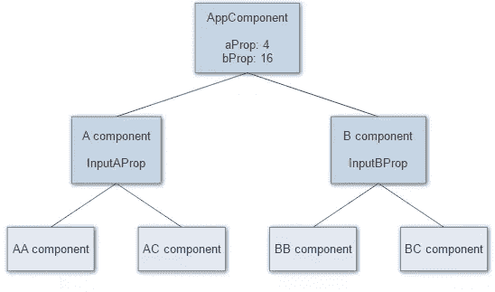
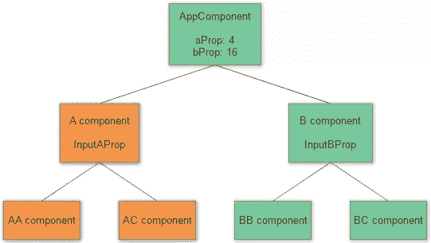

# 角度变化检测:您需要知道的一切

> 原文：<https://www.sitepoint.com/change-detection-angular/>

*这篇关于 Angular 中变化检测的文章最初发表在 Angular In Depth 博客上，经允许在此转载。*

如果你和我一样，希望全面了解 Angular 中的变化检测机制，你基本上必须探究其来源，因为网上没有太多的信息。

大多数文章都提到每个组件都有自己的变更检测器，负责检查组件，但是它们并没有超越这一点，而是主要关注于不变量和变更检测策略的用例。

这篇文章为您提供了理解*为什么*用不变的工作用例以及*变化检测策略如何影响检查所需的信息。此外，您将从本文中学到的东西将使您能够自己提出各种性能优化场景。*

本文的第一部分非常专业，包含许多源代码链接。它详细解释了变化检测机制是如何工作的。其内容基于最新的 Angular 版本(撰写本文时为 4.0.1)。这个版本中实现变更检测机制的方式不同于早期的 2.4.1。如果有兴趣，你可以在[这个堆栈溢出答案](http://stackoverflow.com/a/42807309/2545680)中了解一下它是如何工作的。

本文的后半部分展示了如何在应用程序中使用变化检测，其内容适用于 Angular 的早期 2.4.1 和最新的 4.0.1 版本，因为公共 API 没有变化。

## 作为核心概念的观点

角度应用程序是一个组件树。然而，在幕后，Angular 使用了一个叫做[视图](https://github.com/angular/angular/blob/6b79ab5abec8b5a4b43d563ce65f032990b3e3bc/packages/core/src/view/types.ts#L301)的底层抽象。视图和组件之间有直接的关系:一个视图与一个组件相关联，反之亦然。一个视图在`component`属性中保存一个对相关组件类实例的[引用](https://github.com/angular/angular/blob/6b79ab5abec8b5a4b43d563ce65f032990b3e3bc/packages/core/src/view/types.ts#L309)。所有操作——如属性检查和 DOM 更新——都是在视图上执行的。因此，从技术上来说，更正确的说法是 Angular 是一个视图树，而组件可以被描述为一个视图的更高层次的概念。下面是您可以在源代码中读到的关于视图[的内容:](https://github.com/angular/angular/blob/6b79ab5abec8b5a4b43d563ce65f032990b3e3bc/packages/core/src/linker/view_ref.ts#L31)

> 视图是应用程序 UI 的基本构建块。它是一起被创造和毁灭的元素的最小组合。
> 
> 视图中图元的属性可以更改，但视图中图元的结构(数量和顺序)不能更改。只能通过 ViewContainerRef 插入、移动或移除嵌套视图来更改元素的结构。每个视图可以包含许多视图容器。

在本文中，我将互换使用组件视图和组件的概念。

*这里需要注意的是，网上所有关于变更检测的文章和关于堆栈溢出的回答都引用了我在这里描述的视图 Change Detector Object 或 ChangeDetectorRef。实际上，没有单独的对象用于变更检测，视图是变更检测运行的基础。*

每个视图都通过[节点](https://github.com/angular/angular/blob/6b79ab5abec8b5a4b43d563ce65f032990b3e3bc/packages/core/src/view/types.ts#L316)属性链接到其子视图，因此可以对子视图执行操作。

## 视图状态

每个视图都有一个[状态](https://github.com/angular/angular/blob/6b79ab5abec8b5a4b43d563ce65f032990b3e3bc/packages/core/src/view/types.ts#L317)，它起着非常重要的作用，因为 Angular 根据它的值来决定是对视图和*所有子视图*运行变更检测，还是跳过它。有许多[可能的状态](https://github.com/angular/angular/blob/6b79ab5abec8b5a4b43d563ce65f032990b3e3bc/packages/core/src/view/types.ts#L325)，但是下面这些与本文的上下文相关:

1.  第一次检查
2.  已启用检查
3.  出错
4.  破坏

如果`ChecksEnabled`为`false`或者视图处于`Errored`或`Destroyed`状态，则跳过视图及其子视图的变化检测。默认情况下，所有视图都用`ChecksEnabled`初始化，除非使用`ChangeDetectionStrategy.OnPush`。稍后会详细介绍。这些状态可以组合在一起:例如，一个视图可以同时设置`FirstCheck`和`ChecksEnabled`标志。

Angular 有一堆高级概念来操纵视图。我已经在这里写了一些。一个这样的概念是 [ViewRef](https://github.com/angular/angular/blob/6b79ab5abec8b5a4b43d563ce65f032990b3e3bc/packages/core/src/view/refs.ts#L219) 。它封装了[底层组件视图](https://github.com/angular/angular/blob/6b79ab5abec8b5a4b43d563ce65f032990b3e3bc/packages/core/src/view/refs.ts#L221)，并有一个恰当命名的方法 [detectChanges](https://github.com/angular/angular/blob/6b79ab5abec8b5a4b43d563ce65f032990b3e3bc/packages/core/src/view/refs.ts#L239) 。当异步事件发生时，Angular [在其最顶层的 ViewRef 上触发变化检测](https://github.com/angular/angular/blob/6b79ab5abec8b5a4b43d563ce65f032990b3e3bc/packages/core/src/application_ref.ts#L552.)，ViewRef 在为自身运行变化检测*后，为其子视图*运行变化检测。

这个`viewRef`是您可以使用`ChangeDetectorRef`标记注入到组件构造函数中的内容:

```
export class AppComponent {  
    constructor(cd: ChangeDetectorRef) { ... } 
```

这可以从类的定义中看出:

```
export declare abstract class ChangeDetectorRef {  
    abstract checkNoChanges(): void;  
    abstract detach(): void;  
    abstract detectChanges(): void;  
    abstract markForCheck(): void;  
    abstract reattach(): void;  
}

export abstract class ViewRef extends ChangeDetectorRef {  
   ...
} 
```

## 变化检测操作

负责运行视图变更检测的主要逻辑驻留在 [checkAndUpdateView](https://github.com/angular/angular/blob/6b79ab5abec8b5a4b43d563ce65f032990b3e3bc/packages/core/src/view/view.ts#L325) 函数中。它的大部分功能是在**子**组件视图上执行操作。从主机组件开始，为每个组件递归调用这个函数*。这意味着当递归树展开时，子组件在下一次调用时成为父组件。*

 *当针对特定视图触发此功能时，它会按照指定的顺序执行以下操作:

1.  如果是第一次检查视图，则将`ViewState.firstCheck`设置为`true`,如果之前已经检查过，则将`false`设置为
2.  检查并[更新子组件/指令实例上的输入属性](https://github.com/angular/angular/blob/6b79ab5abec8b5a4b43d563ce65f032990b3e3bc/packages/core/src/view/provider.ts#L154)
3.  [更新](https://github.com/angular/angular/blob/6b79ab5abec8b5a4b43d563ce65f032990b3e3bc/packages/core/src/view/provider.ts#L436)子视图变化检测状态(变化检测策略实现的一部分)
4.  [对嵌入视图运行变化检测](https://github.com/angular/angular/blob/6b79ab5abec8b5a4b43d563ce65f032990b3e3bc/packages/core/src/view/view.ts#L327)(重复列表中的步骤)
5.  如果绑定改变，则[调用子组件上的](https://github.com/angular/angular/blob/6b79ab5abec8b5a4b43d563ce65f032990b3e3bc/packages/core/src/view/provider.ts#L202)生命周期挂钩
6.  [调用子组件上的](https://github.com/angular/angular/blob/6b79ab5abec8b5a4b43d563ce65f032990b3e3bc/packages/core/src/view/provider.ts#L202) `OnInit`和`ngDoCheck`(`OnInit`仅在第一次检查时调用)
7.  [更新子视图组件实例上的](https://github.com/angular/angular/blob/6b79ab5abec8b5a4b43d563ce65f032990b3e3bc/packages/core/src/view/query.ts#L91) `ContentChildren`查询列表
8.  [调用子组件实例上的](https://github.com/angular/angular/blob/6b79ab5abec8b5a4b43d563ce65f032990b3e3bc/packages/core/src/view/provider.ts#L503) `AfterContentInit`和`AfterContentChecked`生命周期挂钩(`AfterContentInit`仅在第一次检查时调用)
9.  如果*当前视图*组件实例的属性改变，则[更新*当前视图*的 DOM 插值](https://hackernoon.com/the-mechanics-of-dom-updates-in-angular-3b2970d5c03d)
10.  [为子视图运行变化检测](https://github.com/angular/angular/blob/6b79ab5abec8b5a4b43d563ce65f032990b3e3bc/packages/core/src/view/view.ts#L541)(重复列表中的步骤)
11.  [更新当前视图组件实例上的](https://github.com/angular/angular/blob/6b79ab5abec8b5a4b43d563ce65f032990b3e3bc/packages/core/src/view/query.ts#L91) `ViewChildren`查询列表
12.  [调用子组件实例上的](https://github.com/angular/angular/blob/6b79ab5abec8b5a4b43d563ce65f032990b3e3bc/packages/core/src/view/provider.ts#L503) `AfterViewInit`和`AfterViewChecked`生命周期挂钩(`AfterViewInit`仅在第一次检查时调用)
13.  [禁用当前视图的检查](https://github.com/angular/angular/blob/6b79ab5abec8b5a4b43d563ce65f032990b3e3bc/packages/core/src/view/view.ts#L346)(变更检测策略实现的一部分)

根据上面列出的操作，没有什么需要强调的。

第一件事是在检查子视图之前，在子组件上触发了`onChanges`生命周期挂钩，即使跳过子视图的变更检测，它也会被触发。这是重要的信息，我们将在文章的第二部分看到如何利用这些知识。

第二件事是，在检查视图时，视图的 DOM 作为变更检测机制的一部分被更新。这意味着如果一个组件没有被选中，那么即使模板中使用的组件属性发生变化，DOM 也不会被更新。模板在第一次检查之前呈现。我所说的 DOM 更新，其实就是插值更新。所以如果你有`<span>some {{name}}</span>`，DOM 元素`span`会在第一次检查之前呈现。在检查过程中，只有`{{name}}`部分会被渲染。

另一个有趣的观察是，子组件视图的状态可以在变化检测期间被改变。我前面提到过，默认情况下，所有组件视图都用`ChecksEnabled`初始化，但是对于所有使用`OnPush`策略的组件，在第一次检查之后，变更检测被禁用(列表中的操作 9):

```
if (view.def.flags & ViewFlags._OnPush_) {  
  view.state &= ~ViewState._ChecksEnabled_;
} 
```

这意味着在接下来的变更检测运行期间，将会跳过对该组件视图及其所有子视图的检查。关于`OnPush`策略的文档指出，只有当组件的绑定发生变化时，才会检查组件。为此，必须通过设置`ChecksEnabled`位来启用检查。这就是下面的代码所做的事情(操作 2):

```
if (compView.def.flags & ViewFlags._OnPush_) {  
  compView.state |= ViewState._ChecksEnabled_;
} 
```

仅当父视图绑定改变且子组件视图用`ChangeDetectionStrategy.OnPush`初始化时，状态才会更新。

最后，当前视图的变化检测负责启动子视图的变化检测(操作 8)。这是检查子组件视图状态的地方，如果是`ChecksEnabled`，那么对这个视图执行变更检测。以下是相关代码:

```
viewState = view.state;  
...
case ViewAction._CheckAndUpdate_:  
  if ((viewState & ViewState._ChecksEnabled_) &&  
    (viewState & (ViewState._Errored_ | ViewState._Destroyed_)) === 0) {  
    checkAndUpdateView(view);
  }  
} 
```

现在您知道视图状态控制是否对该视图及其子视图执行变更检测。所以问题来了:我们能控制这种状态吗？事实证明我们可以，这就是本文的第二部分。

一些生命周期钩子在 DOM 更新(3，4，5)之前被调用，一些在(9)之后被调用。所以如果你有组件层次结构`A -> B -> C`，这里是钩子调用和绑定更新的顺序:

```
A: AfterContentInit  
A: AfterContentChecked  
A: Update bindings  
    B: AfterContentInit  
    B: AfterContentChecked  
    B: Update bindings  
        C: AfterContentInit  
        C: AfterContentChecked  
        C: Update bindings  
        C: AfterViewInit  
        C: AfterViewChecked  
    B: AfterViewInit  
    B: AfterViewChecked  
A: AfterViewInit  
A: AfterViewChecked 
```

## 探索其中的含义

假设我们有以下组件树:



如上所述，每个组件都与一个组件视图相关联。每个视图都用`ViewState.ChecksEnabled`初始化，这意味着当 Angular 运行变化检测时，树中的每个组件都会被检查。

假设我们想要禁用对`AComponent`及其子节点的变更检测。这很容易做到——我们只需要将`ViewState.ChecksEnabled`设置为`false`。改变状态是一个低级的操作，所以 Angular 为我们提供了一堆视图上可用的公共方法。每个组件都可以通过`ChangeDetectorRef`令牌获得其相关视图。对于这个类，Angular 文档定义了以下公共接口:

```
class ChangeDetectorRef {  
  markForCheck() : void  
  detach() : void  
  reattach() : void  

  detectChanges() : void  
  checkNoChanges() : void  
} 
```

让我们看看如何使它对我们有利。

### 派遣

允许我们操作状态的第一个方法是`detach`，它简单地禁用对当前视图的检查:

```
detach(): void { this._view.state &= ~ViewState._ChecksEnabled_; } 
```

让我们看看如何在代码中使用它:

```
export class AComponent {  
  constructor(public cd: ChangeDetectorRef) {  
    this.cd.detach();
  } 
```

这确保了在以下变更检测运行时，以`AComponent`开始的左分支将被跳过(橙色组件不会被检查):



这里有两点需要注意。首先，即使我们改变了`AComponent`的状态，它的所有子组件也不会被检查。第二，因为不会对左边的分支组件执行变更检测，所以它们的模板中的 DOM 也不会被更新。这里有一个小例子来演示它:

```
@Component({  
  selector: 'a-comp',  
  template: `<span>See if I change: {{changed}}</span>`})
export class AComponent {  
  constructor(public cd: ChangeDetectorRef) {  
    this.changed = 'false';  

    setTimeout(() => {  
      this.cd.detach();  
      this.changed = 'true';
    }, 2000);  
  } 
```

第一次检查组件时，span 将用文本`See if I change: false`呈现。并且在两秒钟内，当`changed`属性更新为`true`时，span 中的文本不会改变。但是，如果我们删除线`this.cd.detach()`，一切都会按预期工作。

### 把…重新系上

如本文第一部分所示，如果输入绑定`aProp`在`AppComponent`上发生变化，那么`AComponent`仍然会触发`OnChanges`生命周期钩子。这意味着，一旦我们被通知输入属性发生了变化，我们就可以激活当前组件的变更检测器来运行变更检测，并在下一个 tick 将其分离。下面的片段演示了:

```
export class AComponent {  
  @Input() inputAProp;  

  constructor(public cd: ChangeDetectorRef) {  
    this.cd.detach();  
  }  

  ngOnChanges(values) {  
    this.cd.reattach();  
    setTimeout(() => {  
      this.cd.detach();  
    })
  } 
```

这是因为`reattach`仅仅是[设置了](https://github.com/angular/angular/blob/6b79ab5abec8b5a4b43d563ce65f032990b3e3bc/packages/core/src/view/refs.ts#L242)位:

```
reattach(): void { this._view.state |= ViewState.ChecksEnabled; } 
```

这几乎等同于当`ChangeDetectionStrategy`被设置为`OnPush`时所做的事情:它在第一次变化检测运行后禁用检查，当父组件绑定属性变化时启用检查，并在运行后禁用检查。

请注意，`OnChanges`钩子只为被禁用分支中最顶层的组件触发，而不是为被禁用分支中的每个组件触发。

### markForCheck

`reattach`方法只对当前组件启用检查，但是如果没有对其父组件启用变更检测，它将没有任何效果。这意味着`reattach`方法只对禁用分支中最顶层的组件有用。

我们需要一种方法来检查所有父组件，直到根组件。并且[有一个方法](https://github.com/angular/angular/blob/6b79ab5abec8b5a4b43d563ce65f032990b3e3bc/packages/core/src/view/util.ts#L110)为它— `markForCheck`:

```
let currView: ViewData|null = view;  
while (currView) {  
  if (currView.def.flags & ViewFlags._OnPush_) {  
    currView.state |= ViewState._ChecksEnabled_;
  }  
  currView = currView.viewContainerParent || currView.parent;  
} 
```

正如您在实现中看到的，它只是向上迭代，并对每个父组件进行检查，直到根。

这个什么时候有用？就像`ngOnChanges`一样，即使组件使用`OnPush`策略，也会触发`ngDoCheck`生命周期挂钩。同样，它只为禁用分支中最顶层的组件触发，而不是为禁用分支中的每个组件触发。但是我们可以使用这个钩子来执行定制逻辑，并将我们的组件标记为适合一个变更检测周期运行。因为 Angular 只检查对象引用，所以我们可以实现一些对象属性的脏检查:

```
Component({
  ...,
  changeDetection: ChangeDetectionStrategy.OnPush
})
MyComponent {
  @Input() items;
  prevLength;
  constructor(cd: ChangeDetectorRef) {}

  ngOnInit() {
    this.prevLength = this.items.length;
  }

  ngDoCheck() {
    if (this.items.length !== this.prevLength) {
      this.cd.markForCheck();
      this.prevLenght = this.items.length;
    }
  } 
```

### 检测变化

有一种方法可以为当前组件及其所有子组件运行一次变更检测*。这是使用`detectChanges` [方法](https://github.com/angular/angular/blob/6b79ab5abec8b5a4b43d563ce65f032990b3e3bc/packages/core/src/view/refs.ts#L239)完成的。此方法对当前组件视图运行更改检测，而不管其状态如何，这意味着对当前视图的检查可能保持禁用，并且在后续常规更改检测运行期间不会检查该组件。这里有一个例子:*

```
export class AComponent {  
  @Input() inputAProp;  

  constructor(public cd: ChangeDetectorRef) {  
    this.cd.detach();
  }  

  ngOnChanges(values) {  
    this.cd.detectChanges();
  } 
```

当输入属性发生变化时，即使变化检测器引用保持分离，DOM 也会更新。

### 检查更改

变更检测器上可用的最后一个方法确保了在变更检测的当前运行中不会发生任何变更。基本上，它执行上面列表中的操作 1、7 和 8，如果它发现一个改变的绑定或者确定 DOM 应该被更新，就抛出一个异常。

## 分享这篇文章*