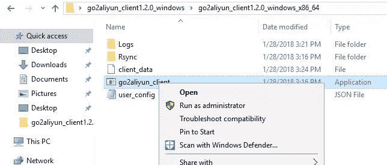
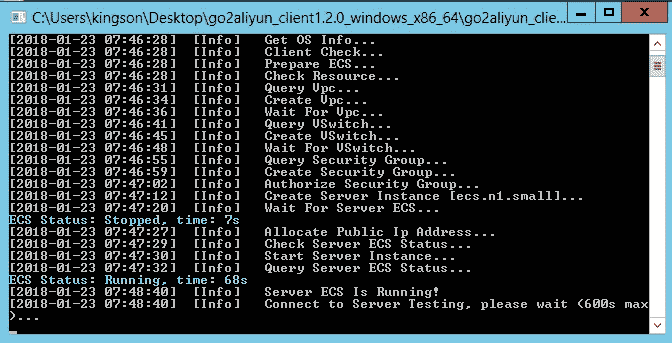
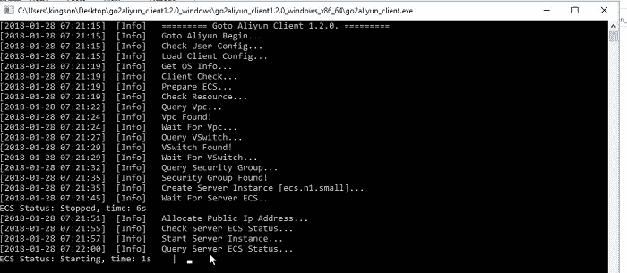
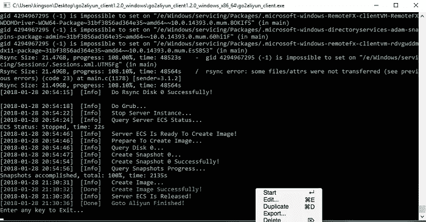

# 如何将一个简单的 Web 服务器从 Azure 迁移到阿里云

> 原文：<https://www.sitepoint.com/how-to-migrate-a-simple-web-server-from-azure-to-alibaba-cloud/>

*本文原载于[阿里云](https://www.alibabacloud.com/blog/how-to-use-the-alibaba-cloud-migration-tool_541801)。感谢您对使 SitePoint 成为可能的合作伙伴的支持。*

尽管云无处不在，但它仍然是一项新兴技术，在多个行业都有大量创新。由于其灵活性和高级安全模式，组织已经开始将其大部分 IT 工作负载转移到云。下面列出了迁移到云的一些高级原因:

*   快速高效的部署
*   较少或没有资本投资
*   可靠性、可扩展性、可持续性和资源整合
*   现收现付，没有每月承诺
*   基于实用程序的高度自动化系统
*   按需服务

谈到信息技术，尤其是迁移，无缝集成是我们都期望的。然而，这说起来容易做起来难。云迁移相当复杂，因为它涉及许多因素，从选择合适的操作系统(OS)到为我们的部署选择最佳的地理区域。迁移还涉及一些标准流程和考虑事项，这并不是一件小事。

迁移策略因具体情况而异，但是作为一个整体，云迁移应该基于以前示例中的最佳实践。有效的迁移策略应该保持可靠的实时迁移，停机时间更少或为零。迁移可以大致分为物理到虚拟(云迁移)、虚拟到虚拟(多云)和虚拟到物理(混合云)。迁移可以是这些类别的任意组合。

在本文中，我们将重点讨论物理到虚拟和虚拟到虚拟的迁移。这里的目标将是[阿里云](https://www.alibabacloud.com/?spm=a3c0i.11410314.0.0) 平台。这整个过程涉及到阿里工具进行图像转换， [OSS](https://www.alibabacloud.com/product/oss?spm=a3c0i.11410344.0.0) 进行存储，以及一些第三方工具实时同步数据。

对于成功的迁移，下面的标准流程和程序适用于大多数组织。

*   云就绪评估(涉及基础架构评估，以决定哪些工作负载可以迁移到云)
*   迁移启动会议(列出停机服务器、应用程序、停机准备、切换和其他要求)
*   创建备份计划–没有备份计划，迁移计划是不完整的。在迁移过程中，错误发生的概率总是非零的，并且损害通常是不可逆的。
*   计划迁移，如果在转换期间有任何预期的停机时间，则通知用户。
*   制作一份功能清单。
*   在转移到生产之前进行迁移后测试，以确保在功能和操作方面满足所有要求。

云迁移可以通过两种方式执行:应用程序级迁移和虚拟机(VM)迁移。选择基于虚拟/物理服务器上运行的应用程序；我们可能需要计划哪一个最适合迁移。

## 应用程序迁移

在迁移评估期间，我们需要检查有多少应用程序可以支持实时迁移。比如微软 Exchange 可以使用 native DAGSQL 复制工具可用于数据库镜像。

不管什么应用和平台，从应用专家那里获得洞察力总是更好的。通常，迁移专家会在目标平台上创建与源类似的基础设施(如[阿里云](https://www.alibabacloud.com/?spm=a3c0i.11410314.0.0))，然后使用 VPN/MPLS 建立连接，以创建站点到站点的连接。一些应用程序可以简单地使用公共 IP 进行迁移，而无需 VPN。

使用本机方法和切换进行实时复制/迁移。切换/转换需要管理员执行几个步骤，如更改 DNS、路由配置、防火墙定制等。

## 虚拟机迁移(映像迁移)

如果没有可用的应用程序迁移方法，或者如果应用程序级迁移很复杂，虚拟机迁移是一种替代方法。也称为映像迁移，虚拟机迁移是任何组织简化迁移流程的最佳选择。

这种方法有时简称为从一个平台迁移到另一个平台。[阿里云](https://www.alibabacloud.com/?spm=a3c0i.11410314.0.0)运行在 KVM/XEN 平台上，因此我们需要确保它拥有支持自动化、许可和所有其他云依赖性所需的所有驱动器。

下面列出了几个迁移场景:

*   内部(IDC)到阿里云
*   传统虚拟化平台到阿里云
*   其他公有云到阿里云
*   阿里云的一个区域到阿里云的另一个区域

## 阿里云迁移工具

不考虑任何源平台，阿里云有一个工具叫做[阿里云迁移工具](https://www.alibabacloud.com/help/doc-detail/62349.htm)(云迁移工具)来执行迁移以创建 [ECS](https://www.alibabacloud.com/product/ecs?spm=a3c0i.11410333.0.0) 实例。阿里云将资源投入到各种类别的映像迁移中，以轻松有效地执行该流程。

在使用[阿里云迁移工具](https://www.alibabacloud.com/help/doc-detail/62349.htm)之前，需要考虑以下几点:

*   本地服务器可以访问互联网，不间断地将数据传输到阿里云 [ECS](https://www.alibabacloud.com/product/ecs?spm=a3c0i.11410333.0.0) 控制台。
*   本地服务器的系统时间与实时时间同步。否则，会在迁移日志文件中记录一个指示时间戳异常的错误。
*   为了在迁移后成功启用所有服务器配置，我们建议您为本地服务器安装 cloud-init。

对于运行 Windows 操作系统的本地服务器

*   go 2 alyun _ client . exe 和 Rsyncbinrsync.exe 程序不受服务器上防火墙的限制。
*   系统启动加载程序正常。
*   以管理员身份运行阿里云迁移工具。

对于运行 Linux 操作系统的本地服务器

*   go2aliyun _ client 程序不受服务器上防火墙的限制。
*   Rsync 库已经安装。

oCentOS:运行 yum install rsync–y .
ou buntu:运行 apt-get install rsync–y .
ode bian:运行 apt-get install rsync–y .
o 其他发行版:在其官网上查看发行版的安装文档。

*   安装了 Xen 或基于内核的虚拟机(KVM)驱动程序。有关如何安装 KVM 驱动程序的更多信息，请参见[安装虚拟驱动程序](https://www.alibabacloud.com/help/doc-detail/62423.htm)。
*   SELinux 必须已被停用。您可以通过运行 setenforce 0 来临时停用 SELinux。
*   以 root 用户身份运行[阿里云迁移工具](https://www.alibabacloud.com/help/doc-detail/62349.htm)。
*   如果本地 Linux 服务器的内核太旧，并且 GRUB (GRand Unified Bootloader)的版本低于 1.9。您可以将引导加载程序 GRUB 更新到高于 1.9 的版本。

迁移过程如下:

*   从该[链接](https://page-intl.aliyun.com/form/act36318274/pc/index.htm?spm=a3c0i.o62394en.a3.8.2eea17785XIOD7)请求迁移工具
*   批准后，在源代码中解压缩文件夹，并根据需要修改 JSON 脚本
*   JSON 脚本需要有 AccessID、密钥、区域 ID、映像名称、系统磁盘大小和数据磁盘的值
*   欲了解更多详情，请参考此[链接](https://www.alibabacloud.com/help/doc-detail/62394.htm?spm=a3c0i.o58313en.a3.2.66e264d5Z1FeiV)并参考以下截图来验证流程。

## 样本迁移过程

下面是将一个简单的 web 服务器从 Azure 迁移到阿里云的步骤。

**操作系统:Windows Server 2016**

1.解压文件夹，找到 *JSON >用>记事本*打开


2.修改如下。更多参数请参考此[链接](https://www.alibabacloud.com/help/doc-detail/62394.htm?spm=a3c0i.o58313en.a3.2.66e264d5Z1FeiV)。要创建和获取新的访问密钥，请参考此处的。

```
{
    "access_id": "ENTER_YOUR_ACCESS_ID",
    "secret_key": "ENTER_YOUR_SECRET_KEY",
    "region_id": "me-east-1",
    "image_name": "KingsonWS",
    "system_disk_size": 60,
    "platform": "",
    "architecture": "",
    "data_disks": [],
    "bandwidth_limit": 0
} 
```

3.保存文件，以管理员身份运行 go2aliyun _ client 工具。



4.您可能会注意到，它自己创建了 VPC、虚拟交换机和安全组。




5.在迁移过程中，您可以看到它创建了一个名为 *INSTANCE_FOR_GOTOALIYUN* 的新实例。

6.Post sync 将使用您在 JSON 中指定的映像名称导出相同的实例，并将发布相同的实例。

7.下面是从 Azure 迁移到阿里巴巴的新 web 服务器映像的截图。





迁移前的源:


迁移后创建的映像:


迁移后的目标站点:


完成迁移后，您仍然需要检查迁移是否 100%成功。为此，您需要运行下面列出的一些测试。

**迁移后任务:**

*   确保所有服务按预期运行。
*   使用功能检查表进行比较。
*   确保通过在命令提示符下运行 slmgr.vbs /dlv 命令来激活 Windows 许可证。
*   确保将所有 DNS 重定向到阿里云实例公共 IP(如果需要)。
*   确保从云门户重新启动服务器，并监控事件以确认是否有任何问题需要注意。

**注意事项:**

*   这个迁移工具也支持数据磁盘。
*   它不支持增量同步。如果您的应用程序需要实时复制，您可能需要考虑使用本地或第三方工具。
*   同一映像也可用于启用混合灾难恢复环境。在加入域之前，需要在 active directory 环境中更正 SID。

请注意，同一个[阿里云](https://www.alibabacloud.com/?spm=a3c0i.11410314.0.0)账户内的区域级迁移可以通过拍摄快照并将副本共享到目标区域来实现。

## 包装它

我们希望本指南对您有用。我们总是建议您向专家寻求建议，以确保采用最合适的方法来实现尽可能无缝的迁移。

你知道吗，只要注册成为新用户，你就可以获得 300 美元的阿里云积分，还可以赢得高达 3840 美元的额外积分。[在阿里云](https://www.alibabacloud.com/campaign/crowdsourcingthecloud)查看详情。

## 分享这篇文章