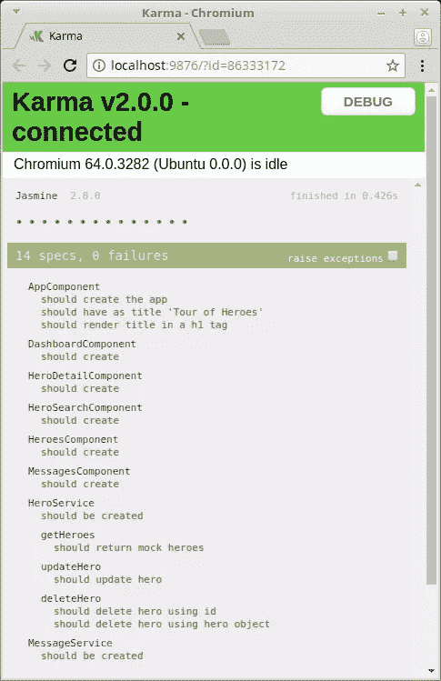
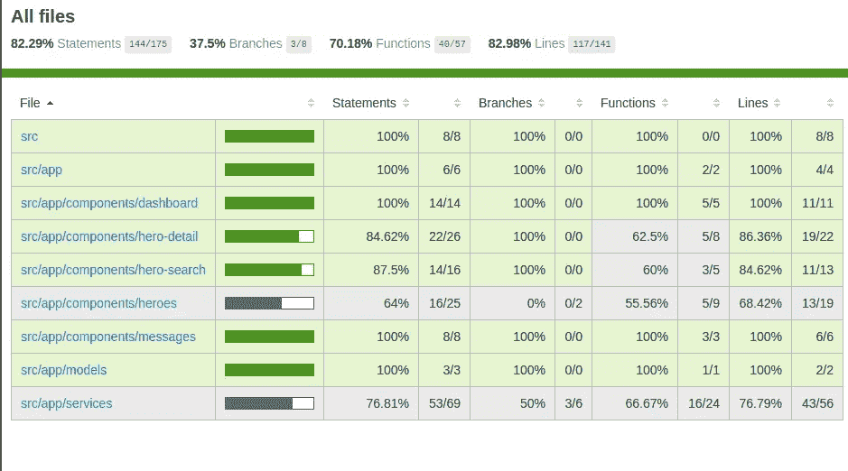
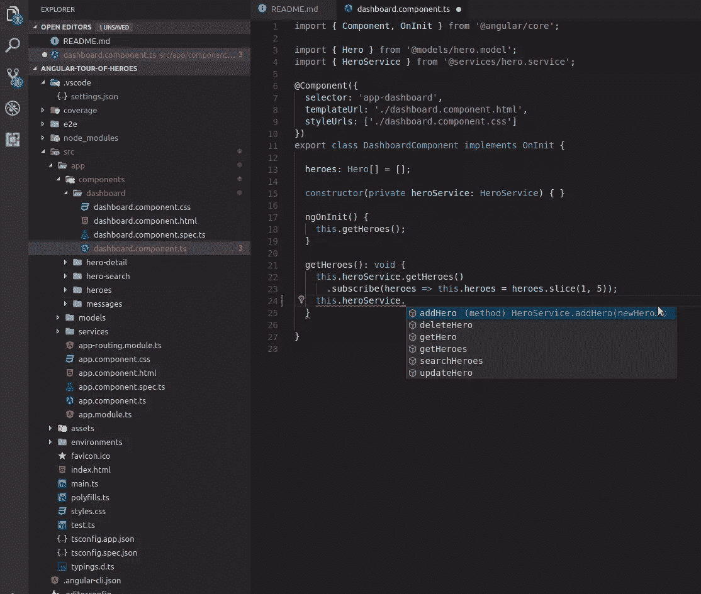

# 角度测试:开发者介绍

> 原文：<https://www.sitepoint.com/angular-testing-introduction/>

在本指南中，我们将看看如何在 Angular 5 项目中编写自动化测试。角度测试是通过 [Angular CLI](https://github.com/angular/angular-cli/blob/master/README.md) 或 [Angular quick start project](https://angular.io/guide/setup) 建立的每个项目的核心功能。

角度测试的主题非常广泛，因为它是一个非常复杂的话题。这将需要几个章节或一个完整长度的课程来涵盖它。因此，在本指南中，我将向您展示一些基础知识，帮助您入门。

## 先决条件

在撰写本文时，Angular 5.2 是当前的稳定版本——这也是我们将在这里使用的版本。本指南假设你至少已经牢固掌握了角度 4+的基本原理。它还假设您至少理解这个概念，或者拥有一些编写自动化测试的技能。

我们将基于 [Angular 的官方初学者教程](https://angular.io/tutorial)来演示如何为组件和服务编写测试。你可以在我们的 [GitHub 库](https://github.com/brandiqa/testing-tour-of-heroes)上找到完整的测试代码。在本指南结束时，您应该具备在 Angular 5 中实现几个通过测试的技能。



## 角度测试技术

正如你已经知道的，Angular 项目是由模板、组件、服务和模块组成的。它们都在所谓的角度环境中运行。虽然可以编写独立的测试，但是您不会真正知道您的代码将如何与 Angular 环境中的其他元素进行交互。

幸运的是，我们有几种技术可以帮助我们以最少的努力编写这样的单元测试。

### 1.角度测试实用程序

这是为 Angular 代码构建测试环境所需的一组类和函数。你可以在 Angular 的 [api 文档](https://angular.io/api?query=test)中找到它们。最重要的是[试验台](https://angular.io/api/core/testing/TestBed)。它用于以与`@NgModule`相同的方式配置角度模块——除了它为测试准备模块。它有一个`configureTestingModule`函数，您可以在其中为您的组件在测试环境中运行提供所有必要的依赖关系。这里有一个准备在测试环境中运行的`dashboard component`的例子。该组件需要几个依赖项才能运行测试:

```
TestBed.configureTestingModule({
  imports: [ RouterTestingModule ],
  declarations: [ DashboardComponent ],
  schemas: [ NO_ERRORS_SCHEMA ],
  providers: [
    {
      provide: HeroService,
      useClass: MockHeroService
    }
  ],
})
.compileComponents(); 
```

我们将在下面一点的地方更仔细地看看这里发生了什么。

### 2.茉莉

Jasmine 是编写角度测试的实际框架。基本上，它是一个使用行为驱动符号的测试框架。用 Jasmine 编写测试非常简单:

```
describe('createCustomer' () => {

  it('should create new customer',(customer) => {
    ...
    expect(response).toEqual(newCustomer)
  });

  it('should not create customer with missing fields', () => {
    ...
    expect(response.error.message).toEqual('missing parameters')
  });

  it('should not create customer with existing record', () => {
    ...
    expect(response.error.message).toEqual('record already exists')
  });
}); 
```

Jasmine 测试的结构至少由两个元素组成:一个是测试套件的`describe`函数，另一个是测试本身的`it`函数。我们通常使用`describe`来表示我们关注的功能，例如`createCustomer()`。然后，在套件中，我们创建多个`it`测试。每次测试都将目标函数置于不同的条件下，以确保它的行为符合预期。您可以参考 [Jasmine 文档](https://jasmine.github.io/2.0/introduction.html)了解更多信息。

### 3.因果报应

Karma 是一个在浏览器环境中针对测试代码执行源代码的工具。它支持在为其配置的每个浏览器中运行测试。结果显示在命令行和浏览器上，供开发人员检查哪些测试通过了，哪些测试失败了。Karma 还会监视文件，并在文件发生变化时触发测试重新运行。在 Angular 项目的基础上，我们有一个用于配置 Karma 的文件`karma.conf`。内容应该是这样的:

```
module.exports = function (config) {
  config.set({
    basePath: '',
    frameworks: ['jasmine', '@angular/cli'],
    plugins: [
      require('karma-jasmine'),
      require('karma-chrome-launcher'),
      require('karma-jasmine-html-reporter'),
      require('karma-coverage-istanbul-reporter'),
      require('@angular/cli/plugins/karma')
    ],
    client:{
      clearContext: false // leave Jasmine Spec Runner output visible in browser
    },
    coverageIstanbulReporter: {
      reports: [ 'html', 'lcovonly' ],
      fixWebpackSourcePaths: true
    },
    angularCli: {
      environment: 'dev'
    },
    reporters: ['progress', 'kjhtml'],
    port: 9876,
    colors: true,
    logLevel: config.LOG_INFO,
    autoWatch: true,
    browsers: ['Chrome'],
    singleRun: false
  });
}; 
```

请务必查看 [Karma 的配置文档](https://karma-runner.github.io/2.0/config/configuration-file.html)，了解如何定制它。如你所见，Chrome 被列为用于运行测试的浏览器。您需要定义一个名为`CHROME_BIN`的环境变量，它指向您的 Chrome 浏览器可执行文件的位置。如果您使用 Linux，只需将这一行添加到您的`.bashrc`文件中:

```
export CHROME_BIN="/usr/bin/chromium-browser" 
```

为了让 Karma 运行您的测试，您必须确保测试文件以`.spec.ts`结尾。你应该注意到 Karma 被设计成主要运行单元测试。要运行端到端测试，我们需要另一个工具，量角器，我们将在接下来研究它。

### 4.量角器

[量角器](http://www.protractortest.org)是一个端到端的角度测试框架。它在真实的浏览器中运行你的测试，像真人一样与之互动。不像单元测试，我们测试单独的功能，这里我们测试整个逻辑。量角器能够填写表格，点击按钮，并确认预期的数据和样式显示在 HTML 文档中。就像 Karma 一样，量角器在您的 Angular 项目的根目录下有自己的配置文件，`protractor.conf`:

```
const { SpecReporter } = require('jasmine-spec-reporter');

exports.config = {
  allScriptsTimeout: 11000,
  specs: [
    './e2e/**/*.e2e-spec.ts'
  ],
  capabilities: {
    'browserName': 'chrome'
  },
  directConnect: true,
  baseUrl: 'http://localhost:4200/',
  framework: 'jasmine',
  jasmineNodeOpts: {
    showColors: true,
    defaultTimeoutInterval: 30000,
    print: function() {}
  },
  onPrepare() {
    require('ts-node').register({
      project: 'e2e/tsconfig.e2e.json'
    });
    jasmine.getEnv().addReporter(new SpecReporter({ spec: { displayStacktrace: true } }));
  }
}; 
```

你可以在这里找到它的配置[的文档。与 Jasmine/Karma 测试不同，量角器测试位于`src`文件夹之外，在一个名为`e2e`的文件夹中。稍后我们将研究如何编写端到端测试。现在，让我们开始编写单元测试。](https://github.com/angular/protractor/blob/master/lib/config.ts)

## 编写单元测试

如前所述，Angular 提供了为项目编写自动化测试所需的一切。要开始测试，只需运行以下命令:

```
ng test 
```

Karma 将启动并运行所有可用的测试。假设你刚刚完成了“英雄之旅”教程，你应该有一个类似这样的报告:


这些测试是在您使用`Angular CLI`工具生成组件、服务和类时创建的。在创建时，这些测试中的代码是正确的。然而，当您向组件和服务中添加代码时，测试就中断了。在下一节中，我们将会看到如何解决中断的测试。

### 测试组件

对组件进行单元测试有两种方式。您可以单独测试它，也可以在 Angular 环境中测试它，看看它如何与其模板和依赖项进行交互。后者听起来很难实现，但是使用角度测试工具使得创建测试更容易。这里有一个使用`Angular CLI`工具创建组件时生成的测试代码的例子:

```
import { async, ComponentFixture, TestBed } from '@angular/core/testing';

import { HeroesComponent } from './heroes.component';

describe('HeroesComponent', () => {
  let component: HeroesComponent;
  let fixture: ComponentFixture<HeroesComponent>;

  beforeEach(async(() => {
    TestBed.configureTestingModule({
      declarations: [ HeroesComponent ]
    })
    .compileComponents();
  }));

  beforeEach(() => {
    fixture = TestBed.createComponent(HeroesComponent);
    component = fixture.componentInstance;
    fixture.detectChanges();
  });

  it('should be created', () => {
    expect(component).toBeTruthy();
  });
}); 
```

在第一个`beforeEach()`函数中，我们使用`TestBed.configureTestingModule`函数来创建一个用于测试组件的模块环境。它类似于 [NgModules](https://angular.io/guide/ngmodules) ，除了在这里我们创建一个用于测试的模块。在第二个`beforeEach()`函数中，我们创建了一个`component-under-test`的实例。一旦我们这样做了，我们就不能再配置`TestBed`，因为会抛出一个错误。

最后，我们有规格，`should be created`，在这里我们确认`component`已经被初始化。如果测试通过，这意味着组件应该可以在角度环境中正常运行。然而，如果它失败了，很可能组件有我们没有包括在测试配置中的某种依赖。让我们看看如何处理不同的问题。

### 测试使用另一个组件的组件

在 Angular 中构建用户界面时，我们经常通过选择器引用模板文件中的其他组件。看看这个`dashboard.component.html`的例子:

```
<h3>Top Heroes</h3>
...
</div>

<app-hero-search></app-hero-search> 
```

在这个例子中，我们引用了另一个具有选择器`app-hero-search`的组件。如果您尝试按原样运行初始测试，它将会失败。这是因为我们还没有在测试环境中声明引用的组件。在单元测试中，我们把所有的注意力都放在正在测试的组件上。在单元测试中，我们对其他组件不感兴趣。我们必须假设他们在按预期工作。在我们的测试中包含引用的组件可能会污染结果。为了解决这个问题，我们可以模仿被引用的组件，或者使用`NO_ERRORS_SCHEMA`指令简单地忽略它。这里有一个例子:

```
import { async, ComponentFixture, TestBed } from '@angular/core/testing';
import { NO_ERRORS_SCHEMA } from '@angular/core';

import { DashboardComponent } from './dashboard.component';

describe('DashboardComponent', () => {
  let component: DashboardComponent;
  let fixture: ComponentFixture<DashboardComponent>;

  beforeEach(async(() => {
    TestBed.configureTestingModule({
      declarations: [ DashboardComponent ],
      schemas: [ NO_ERRORS_SCHEMA
    })
    .compileComponents();
  }));

  beforeEach(() => {
    fixture = TestBed.createComponent(DashboardComponent);
    component = fixture.componentInstance;
    fixture.detectChanges();
  });

  it('should be created', () => {
    expect(component).toBeTruthy();
  });
}); 
```

现在这个测试不应该有组件依赖的问题。然而，这个测试还不能通过，因为还有另一种情况我们必须处理…

### 测试使用模块的组件

这次我们来检查一下`hero-detail.component.html`:

```
<div *ngIf="hero">
  <h2>{{ hero.name | uppercase }} Details</h2>
  <div><span>id: </span>{{hero.id}}</div>
  <div>
    <label>name:
      <input [(ngModel)]="hero.name" placeholder="name"/>
    </label>
  </div>
  <button (click)="goBack()">go back</button>
  <button (click)="save()">save</button>
</div> 
```

这里我们使用的是来自`FormsModule`库的`ngModel`指令。为了编写一个支持这个模块的测试，我们只需要导入`FormsModule`并将其包含在`TestBed`配置中:

```
import { FormsModule } from '@angular/forms';
...
  beforeEach(async(() => {
    TestBed.configureTestingModule({
      declarations: [ HeroDetailComponent ],
      imports: [ FormsModule],
    })
    .compileComponents();
  }));
  ... 
```

这应该可以解决`FormsModule`的问题。然而，在我们的测试环境中，我们还需要指定几个依赖项。

### 测试使用路由模块的组件

让我们检查一下`hero-detail.component.ts`构造函数:

```
constructor(
  private route: ActivatedRoute,
  private location: Location,
  private heroService: HeroService   
) {} 
```

组件有处理路由的`ActivatedRoute`和`Location`依赖关系。在我们的测试代码`hero-detail.component.spec.ts`中，我们可以实现类的模拟版本。然而，我发现最好的解决方案是像这样导入`RouterTestingModule`:

```
import { RouterTestingModule } from ’@angular/router/testing’;
...
beforeEach(async(() => {
  TestBed.configureTestingModule({
    declarations: [ HeroDetailComponent ],
    imports: [ FormsModule, RouterTestingModule ],
  })
  .compileComponents();
})); 
```

在我们的测试代码中，`RoutingTestingModule`很容易解决`ActivateRoute`和`Location`的依赖性。`RoutingTestingModule`还处理其他涉及路由的情况。看看`dashboard.component.html`中的这段代码:

```
<h3>Top Heroes</h3>
<div class="grid grid-pad">
  <a *ngFor="let hero of heroes" class="col-1-4" routerLink="/detail/{{hero.id}}">
    <div class="module hero">
      <h4>{{hero.name}}</h4>
    </div>
  </a>
</div> 
```

注意我们有一个名为`routerLink`的指令。是`AppRoutingModule`库提供的指令。如果运行仪表板测试，它将由于这种依赖性而失败。要修复它，只需在`dashboard.component.spec.ts`中实现`RoutingTestingModule`，就像我们为`hero-detail.component.spec.ts`所做的一样。

现在让我们看看如何测试依赖于服务的组件。

### 测试使用服务的组件

每个组件至少需要一个服务来处理逻辑。有几种方法可以测试使用服务的组件。我们来看看`message.service.ts`，它正在被`message.component.ts`使用:

```
import { Injectable } from ’@angular/core’;

@Injectable()
export class MessageService {
  messages: string[] = [];

  add(message: string) {
    this.messages.push(message);
  }

  clear() {
    this.messages = [];
  }
} 
```

`MessageService`有一个非常简单的实现。它不使用任何外部依赖。虽然建议从单元测试中排除外部逻辑，但我们将在这里破例。我不认为有必要使我们的测试复杂化。因此，我认为最好在测试中包含该服务。下面是`message.component.spec.ts`的测试代码:

```
import { MessageService } from '@services/message.service';
...

beforeEach(async(() => {
  TestBed.configureTestingModule({
    declarations: [ MessagesComponent ],
    providers: [ MessageService ]
  })
  .compileComponents();
})) 
```

现在让我们看看另一项服务，`hero-service.ts`:

```
import { Injectable } from '@angular/core';
import { Observable } from 'rxjs/Observable';
import { of } from 'rxjs/observable/of';
import { HttpClient, HttpHeaders } from '@angular/common/http';
import { catchError, map, tap } from 'rxjs/operators';
...
@Injectable()
export class HeroService {

  private heroesUrl = 'api/heroes';

  constructor(
    private http: HttpClient,
    private messageService: MessageService) { }

    /** GET heroes from the server */
    getHeroes (): Observable<Hero[]> {
      return this.http.get<Hero[]>(this.heroesUrl)
      .pipe(
         tap(heroes => this.log(`fetched ${heroes.length} heroes`)),
         catchError(this.handleError('getHeroes', []))
       );
    }

    getHero(id: number): Observable<Hero>  {
      const url = `${this.heroesUrl}/${id}`;
      return this.http.get<Hero>(url).pipe(
        tap(_ => this.log(`fetched hero id=${id}`)),
        catchError(this.handleError<Hero>(`getHero id=${id}`))
      );
    }
    ...
} 
```

`HeroService`类包含了相当多的逻辑——总共大约 104 行。它有多个依赖项，包括一个到另一个服务。此外，它的所有功能都是异步的。如此复杂的代码很有可能污染我们的单元测试。出于这个原因，我们应该排除它的逻辑。我们通过创建一个模拟版本的`hero.service.ts`来实现。只需创建一个新文件并将其命名为`hero.service.mock.ts`。模仿其功能，使其核心逻辑被剥离:

```
import { Observable } from 'rxjs/Observable';
import { of } from 'rxjs/observable/of';
import { Hero } from '@models/hero.model';

export class MockHeroService {
  getHeroes(): Observable<Hero[]> {
    return of([]);
  }

  getHero() {
    return of({});
  }
} 
```

您可以看到模拟版本要简单得多。它现在没有机会污染我们的单元测试。为了将它包含在我们的组件规范文件中，我们这样实现它:

```
import { HeroService } from '@services/hero.service';
import { MockHeroService } from '@services/hero.service.mock';
...

  TestBed.configureTestingModule({
      declarations: [ HeroDetailComponent ],
      imports: [ FormsModule, RouterTestingModule ],
      providers: [
        {
          provide: HeroService,
          useClass: MockHeroService
        },
      ],
    })
    .compileComponents();
  }));
... 
```

我们使用`providers`选项来注入`MockHeroService`作为我们的服务。使用服务为所有组件的测试代码实现这一点。

### 测试服务

既然我们已经处理了测试组件时出现的一些常见场景，那么让我们看看如何测试服务。服务执行我们应用程序的核心逻辑，所以我们彻底测试它们的功能是非常重要的。如前所述，角度测试是一个很深的主题，所以我们在这里只是触及皮毛。

打开`hero.service.ts`并检查功能。让我强调几个例子:

```
...
  /** GET heroes from the server */
  getHeroes (): Observable<Hero[]> {
    return this.http.get<Hero[]>(this.heroesUrl)
    .pipe(
       tap(heroes => this.log(`fetched ${heroes.length} heroes`)),
       catchError(this.handleError('getHeroes', []))
     );
  }

  /** UPDATE: update selected hero on the server */
  updateHero (hero: Hero): Observable<any> {
    return this.http.put(this.heroesUrl, hero, httpOptions).pipe(
      tap(_ => this.log(`updated hero id=${hero.id}`)),
      catchError(this.handleError<any>('updateHero'))
    );
  }
... 
```

每个函数都是由几行代码组成的，但是有很多事情要做。为了全面测试每一个，我们需要考虑许多场景。当我们执行`getHeroes()`时，服务器可能会

*   发回英雄列表
*   发回一个空列表
*   抛出一个错误
*   没有回应。

你也许可以想出更多可能的场景添加到列表中。既然我们已经考虑了可能的场景，是时候编写测试了。下面是一个如何为`HeroService`编写`spec`的例子:

```
import { TestBed, inject } from '@angular/core/testing';
import { HttpClientModule, HttpClient, HttpResponse } from '@angular/common/http';
import { HttpClientTestingModule, HttpTestingController } from '@angular/common/http/testing';

import { HeroService } from './hero.service';
import { MessageService } from './message.service';
import { Hero } from '@models/hero.model';

const mockData = [
  { id: 1, name: 'Hulk' },
  { id: 2, name: 'Thor'},
  { id: 3, name: 'Iron Man'}
] as Hero[];

describe('HeroService', () => {

  let service;
  let httpTestingController: HttpTestingController;

  beforeEach(() => {
    TestBed.configureTestingModule({
      imports: [
        HttpClientTestingModule
      ],
      providers: [HeroService, MessageService]
    });
    httpTestingController = TestBed.get(HttpTestingController);
  });

  beforeEach(inject([HeroService], s => {
    service = s;
  }));

  beforeEach(() => {
    this.mockHeroes = [...mockData];
    this.mockHero = this.mockHeroes[0];
    this.mockId = this.mockHero.id;
  });

  const apiUrl = (id: number) => {
    return `${service.heroesUrl}/${this.mockId}`;
  };

  afterEach(() => {
    // After every test, assert that there are no more pending requests.
    httpTestingController.verify();
  });

  it('should be created', () => {
    expect(service).toBeTruthy();
  });

  describe('getHeroes', () => {

    it('should return mock heroes', () => {
      service.getHeroes().subscribe(
        heroes => expect(heroes.length).toEqual(this.mockHeroes.length),
        fail
      );
      // Receive GET request
      const req = httpTestingController.expectOne(service.heroesUrl);
      expect(req.request.method).toEqual('GET');
      // Respond with the mock heroes
      req.flush(this.mockHeroes);
    });
  });

  describe('updateHero', () => {

    it('should update hero', () => {
      service.updateHero(this.mockHero).subscribe(
        response => expect(response).toEqual(this.mockHero),
        fail
      );
      // Receive PUT request
      const req = httpTestingController.expectOne(service.heroesUrl);
      expect(req.request.method).toEqual('PUT');
      // Respond with the updated hero
      req.flush(this.mockHero);
    });
  });

  describe('deleteHero', () => {

    it('should delete hero using id', () => {
      const mockUrl = apiUrl(this.mockId);
      service.deleteHero(this.mockId).subscribe(
        response => expect(response).toEqual(this.mockId),
        fail
      );
      // Receive DELETE request
      const req = httpTestingController.expectOne(mockUrl);
      expect(req.request.method).toEqual('DELETE');
      // Respond with the updated hero
      req.flush(this.mockId);
    });

    it('should delete hero using hero object', () => {
      const mockUrl = apiUrl(this.mockHero.id);
      service.deleteHero(this.mockHero).subscribe(
        response => expect(response).toEqual(this.mockHero.id),
        fail
      );
      // Receive DELETE request
      const req = httpTestingController.expectOne(mockUrl);
      expect(req.request.method).toEqual('DELETE');
      // Respond with the updated hero
      req.flush(this.mockHero.id);
    });
  });
}); 
```

这只是我们应该如何为与`HttpClientModule`交互的服务编写测试的一个例子。检查每个测试，注意我们使用了`HttpTestingController`类来拦截请求。在这个测试中，我们控制输入和输出来创建不同的场景。这些测试的主要目的是确保我们的服务方法能够优雅地处理每个场景。注意，我们还没有完全实现`hero.service.spec.ts`所需的所有测试，因为这超出了本指南的范围。

在本指南结束之前，我们还需要了解更多主题。

## 端到端角度测试

单元测试确保组件和服务在受控的测试环境中正确运行。然而，不能保证组件和服务会在 Angular 环境中相互交互。这就是为什么我们需要执行端到端测试。端到端测试是模拟人工测试的测试。换句话说，这些测试被设计成与我们的应用程序以同样的方式交互——通过浏览器界面。

对于我们的英雄之旅应用程序，我们可以测试许多用例，例如确保—

*   五个英雄显示在仪表板组件上
*   所有英雄都显示在英雄组件上
*   导航链接没有断开
*   一个新的英雄可以被创造
*   英雄可以更新
*   英雄可以删除。

随着更多特性的实现，您可以继续添加到这个列表中。理想情况下，端到端测试包括两个部分。

第一部分是一个助手文件，提供特定于组件的助手函数。这里有一个`app.po.ts`的例子:

```
import { browser, by, element } from 'protractor';

export class AppPage {
  navigateTo() {
    return browser.get('/');
  }

  getParagraphText() {
    return element(by.css('app-root h1')).getText();
  }
} 
```

一旦定义了助手函数，在编写 e2e 测试时就可以轻松地访问它们。这里有一个`e2e/app.e2e.spec.ts`的例子:

```
import { AppPage } from './app.po';

describe('angular-tour-of-heroes App', () => {
  let page: AppPage;

  beforeEach(() => {
    page = new AppPage();
  });

  it('should display welcome message', () => {
    page.navigateTo();
    expect(page.getParagraphText()).toEqual('Welcome to app!');
  });
}); 
```

要运行这个测试，只需执行以下命令:

```
ng e2e 
```

如果这是您第一次执行此命令，您可能需要互联网连接。一旦测试完成，您很可能会收到类似下面这样的失败消息:

```
angular-tour-of-heroes App
   ✗ should display welcome message
     - Expected 'Tour of Heroes' to equal 'Welcome to app!'. 
```

让我们按如下方式修复错误。我还增加了一个测试，以确保我们在`app-routing.module.ts`中指定的重定向工作正常:

```
import { AppPage } from './app.po';
import { browser  } from 'protractor';

describe('angular-tour-of-heroes App', () => {
  let page: AppPage;

  beforeEach(() => {
    page = new AppPage();
  });

  it('should redirect to dashboard', async () => {
    page.navigateTo();
    const url = await browser.getCurrentUrl();
    expect(url).toContain('/dashboard');
  });

  it('should display welcome message', () => {
    page.navigateTo();
    expect(page.getParagraphText()).toEqual('Tour of Heroes');
  });
}); 
```

再次运行测试。我们现在应该已经通过了测试:

```
angular-tour-of-heroes App
  ✓ should redirect to dashboard
  ✓ should display welcome message 
```

观看测试运行是一种很棒的感觉。它让您确信您的应用程序将在生产中顺利运行。既然您已经体验了`e2e`，那么是时候转向另一个很酷的测试特性了。

## 代码覆盖率

作为开发人员，我们最大的问题之一是“我们测试了足够多的代码吗？”幸运的是，我们有工具可以生成“代码覆盖率”,以确定我们测试了多少代码。要生成报告，只需运行以下命令:

```
ng test --watch=false --code-coverage 
```

将在 Angular 项目的根目录下创建一个 coverage 文件夹。在文件夹中导航，你会找到`index.html`。使用 web 浏览器打开它。您应该会看到类似这样的内容:



我不会在这里详细讨论，但是你可以看到一些类已经被完全测试了，而另一些没有完全测试。由于时间和资源的可用性，通常不可能实现 100%的测试覆盖率。然而，你可以和你的团队一起决定什么应该是最少的。要指定最小值，使用`karma.conf`来配置您的代码覆盖率设置，如下所示:

```
coverageIstanbulReporter: {
  reports: [ 'html', 'lcovonly' ],
  fixWebpackSourcePaths: true,
  thresholds: {
    statements: 80,
    lines: 80,
    branches: 80,
    functions: 80
  }
} 
```

上述阈值指定单元测试至少要覆盖 80%。

## 附加实用程序

我们现在已经介绍了角度测试的基础知识。然而，我们可以通过更进一步来提高我们的代码质量。

### 1.林挺

Angular 附带了一个执行代码林挺的工具。只需执行以下代码，对您的项目进行 lint 检查:

```
ng lint 
```

这个命令将给出关于您的代码的警告—例如，您忘记了使用分号，或者您使用了太多的空格。该命令还有助于识别语句中未使用的代码和某些错误。经常使用该命令将确保团队中的每个人都使用一致的风格编写代码。您可以在`tslint.json`文件中进一步定制 lint 选项。

### 2.智能代码编辑器

说到代码编辑器和 ide，我个人最喜欢的是 [Atom](https://atom.io/) 和 [Sublime Text](https://www.sublimetext.com/) 。然而，我最近发现了 [Visual Studio 代码](https://code.visualstudio.com/)，它有更吸引人的特性。这是一个免费的代码编辑器，可以在 Windows、macOS 和 Linux 上运行。它借鉴了 Atom 的很多东西，除此之外，它还有一些我想强调的特性:

*   智能感知
*   错误突出显示
*   现代角度延伸

目前，Atom 和 Sublime Text 都没有这些特性，尽管它们内置在 VSCode 中。您只需要安装所需的语言扩展。Intellisense 功能会在您键入代码时为您列出选项。它类似于 autocomplete，但是有一个语法正确选项的特定列表。有了这个特性，就很难犯语法错误。您还可以看到一个函数的文档，允许您看到返回类型和所需的输入。



Visual Studio 代码还具有适当的错误突出显示功能。它不仅检查语法错误，还确保赋值具有正确的类型。例如，如果您试图将一个数组赋给一个可观察函数的结果，将会为您突出显示一个错误。VSCode 还具有与 Angular 5 兼容的角度扩展。

拥有一个在您键入时检查代码错误的 IDE 对于提高工作效率是非常有益的。这有助于你花更少的时间来修复你本来会犯的错误。可能有其他代码编辑器可以完成同样的工作，但是现在我推荐 Angular 项目使用 Visual Studio 代码。

### 3.连续累计

持续集成(CI)是自动化测试和构建的过程。作为开发人员，我们通常会孤立地工作几个星期或更长时间。当我们将变更合并到主分支时，会产生许多错误和冲突。这可能需要很长时间来修复。

CI 鼓励开发人员编写测试并提交任务，通常是以较小的比特为单位。CI 服务器将自动构建和运行测试，帮助开发人员尽早发现错误，从而减少冲突和问题。有许多 CI 解决方案可供 Angular 开发人员使用。查看 SitePoint 关于在 Travis 上测试 Jasmine 和 Karma 的教程。

## 包扎

我们可以访问大量关于自动化测试的信息，以及测试驱动开发的框架，这有助于我们编写测试。然而，有几个原因让我们不应该总是写测试:

1.  不要为新的应用程序编写测试。项目的范围会根据客户的需求或市场的反应而迅速变化。
2.  除了实现特性之外，编写测试需要更多的时间。当特性范围改变时，也需要时间来维护。如果你的预算很低，跳过编写测试是没问题的。切实利用你所拥有的资源。

所以剩下的问题是什么时候是写测试的正确时间。以下是一些提示:

1.  您已经完成了原型阶段，并且确定了应用程序的核心特性。
2.  你的项目有足够的资金。

现在，假设您已经决定实施 TDD，那么将会获得很多好处:

1.  编写可测试的代码意味着你正在编写质量更好的代码。
2.  作为开发人员，您将更有信心将您的最新版本发布到产品中。
3.  编写测试是记录代码的一种方式。这意味着未来的开发人员将更容易升级遗留代码。
4.  你不需要雇人进行质量控制，因为你的 CI 服务器会为你做这项工作。

如果您决定完全跳过产品就绪应用程序的测试，请准备好将来面对愤怒和失望的客户。随着代码库规模的增加，bug 的数量将呈指数增长。

希望这是对你进行角度测试的有用介绍。如果你想了解更多，我建议你首先阅读官方的 Angular 5 文档。除非另有说明，否则大多数信息都是针对旧版本的 Angular 的。

让我们知道你在角度测试方面有什么好的建议！

## 分享这篇文章