# 提高引导可访问性的 8 个技巧

> 原文：<https://www.sitepoint.com/making-bootstrap-accessible/>

几年前，我写了我开发 Bootstrap 版本 3 项目的经历，该项目对残疾人来说是完全可访问的。这主要集中在前端设计方面的自举可访问性。(它没有涵盖屏幕阅读器方面的可访问性，因为那是另外一个故事了。)

虽然我可以看到 Bootstrap 背后的开发人员正在努力，但这个流行的 UI 库仍有一些不足之处。我还看到在项目中提出了[个问题，表明他们正在积极改进——考虑到](https://github.com/twbs/bootstrap/issues?q=is:open%20is:issue%20label:accessibility)[大约 3.6%的网站使用 Bootstrap](https://trends.builtwith.com/docinfo/Twitter-Bootstrap) ，这真是太棒了。

最近，Bootstrap 版本 4 发布了，所以让我们来看看我过去遇到的问题是否有所改善。

## 我们对设计可及性的追求

在设计网站时，有几件事需要考虑。我相信这些会改善每个人的用户体验，并且很可能涵盖你会考虑的很多要点。

### 布局

实现可访问性的一个方法是拥有一个干净、易用的布局，在所有设备上都好看，在高缩放级别也好看。高达 200%就是一个很好的指引。

**加分点**:拥有与布局相匹配的前端代码对于那些用屏幕阅读器或用键盘而不是鼠标访问网页的用户来说也是很好的。

这使得人们可以很容易地使用你的网站，而不管他们是如何浏览的。

### 字体

易于阅读的字体也是可访问性的一大优势，因为有些残疾使得阅读装饰字体或草书字体很困难。

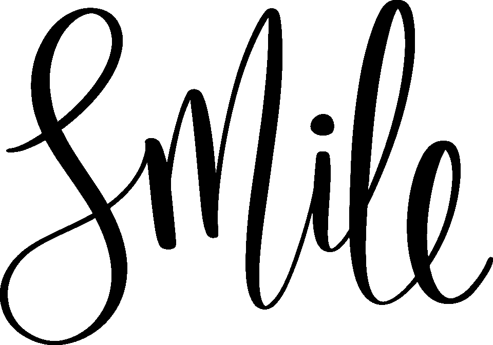

草书字体可能难以阅读

举例来说，尽管人们反对漫画字体，但如果你有阅读障碍，那么它实际上是最容易阅读的字体之一，阅读障碍的比例高达 15%。

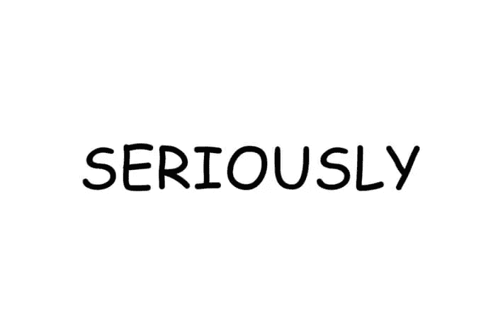

漫画虽然不受欢迎，但很容易阅读

像广泛使用的 Roboto 和 Open Sans 这样的 Sans-serif 字体通常很容易阅读，因此从该系列中选择一种是一个不错的选择。

### 颜色

颜色选择也是一大考虑因素。如果你的颜色对比太相似，会使文本难以阅读。


所以选择醒目的颜色很重要。你可以通过使用[颜色对比检查工具](https://webaim.org/resources/contrastchecker/)来测试。


## 让我们开始测试引导可访问性

让我们来看看 Bootstrap 如何符合这些标准。

### 布局

虽然你的网站可能需要定制布局，Bootstrap 提供了相当多的[示例布局](https://getbootstrap.com/docs/4.0/examples/)，以及一个[网格系统](https://getbootstrap.com/docs/4.0/layout/grid/)。人们经常将 Bootstrap 用于响应式网格系统，因为它非常健壮——在桌面上以列的形式显示内容，并优雅地折叠到平板电脑和移动视图上。

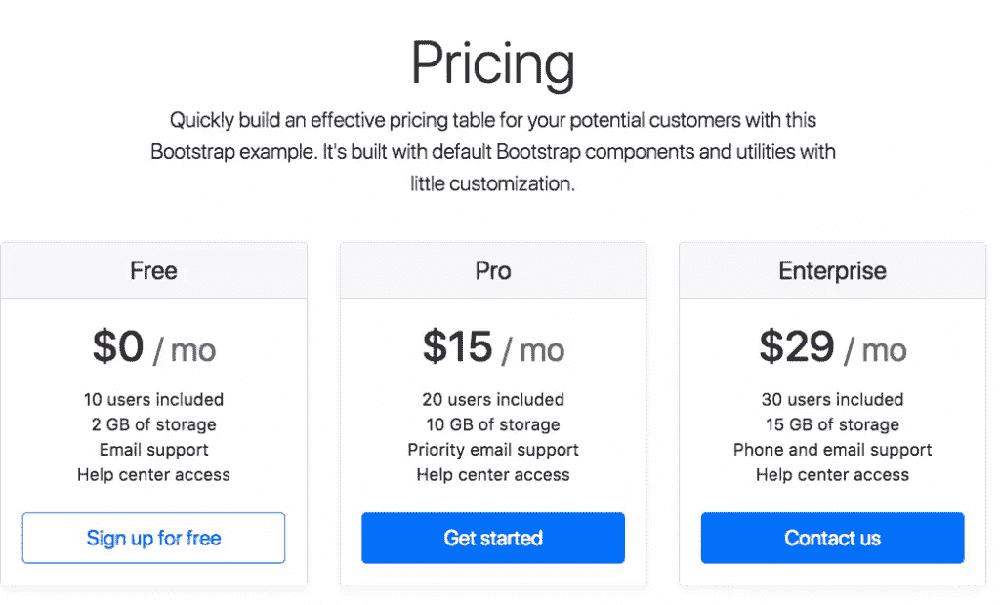

桌面视图

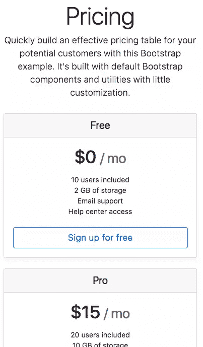

移动视图

**奖励点:**布局部分实现起来可能有点棘手，就是让代码匹配布局，所以当你用键盘([按 tab 键](https://www.nngroup.com/articles/keyboard-accessibility/))而不是鼠标导航时，它遵循逻辑顺序，你可以访问所有区域。

在下面的例子中，有一个*返回顶部*链接，但之后还有两个导航链接，所以如果你通过键盘选择它，你的视图会上升到顶部，但如果你再次按 tab，你会回到底部链接。


另一个例子是这个表单，键盘焦点在主表单之前移到了侧边栏，这可能有点混乱。

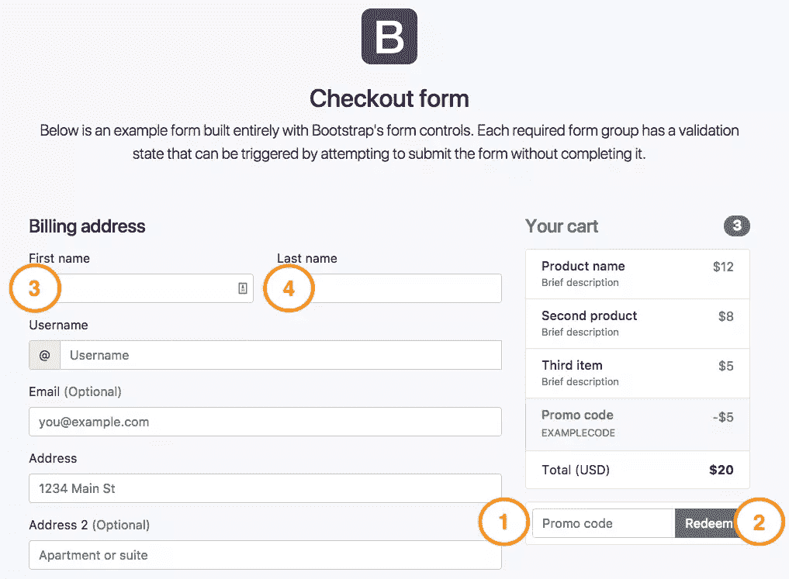

虽然这些例子有点烦人，但这比上次我测试 Bootstrap 3 的键盘焦点时有所改进，而且几乎不可能用键盘来使用他们的网站。为了提高引导程序的可访问性，他们需要添加的另一件事是复制他们的`hover`鼠标样式以匹配他们的`focus`键盘样式。例如:

```
a:hover,
a:focus {
  text-decoration: underline;
} 
```

目前，当通过键盘导航时，没有视觉提示来显示你在页面上的位置。将这一点添加到链接、输入和按钮等可聚焦元素中，将极大地提高引导程序的可访问性评级。

### 字体

默认情况下，自举自带 [Helvetica 新](https://www.myfonts.com/fonts/linotype/neue-helvetica/)这是一个无衬线字体堆栈。


无衬线字体是一种非常友好和易于阅读的字体，所以我认为这是一个无障碍的选择。他们还对它进行了设置，使其与许多浏览器和移动设备兼容，因此无论你使用什么，它看起来都是一致的。字体大小也是使用`em`单位设置的(与`px`相反),因此在较小的设备和缩放时会缩放得很好。

### 颜色

根据开发人员自己的 [Bootstrap 可访问性文档](https://getbootstrap.com/docs/4.0/getting-started/accessibility/#color-contrast)，Bootstrap 自带的默认颜色是不可访问的。

> 目前构成 Bootstrap 默认调色板的大多数颜色——在整个框架中用于按钮变化、警告变化、表单验证指示器——导致*颜色对比度不足*。

从第 3 版到第 4 版，它们已经变得更好了，但测试你网站上的任何颜色组合以确保它有足够高的对比度仍然很重要。 [Webaim 有一个很好的色彩对比检查器](https://webaim.org/resources/contrastchecker/)，否则你可以得到一个[浏览器插件来帮助检查](http://www.webaxe.org/color-contrast-tools/)。

例如，下面是测试它们默认的蓝色时的结果。它的收视率为 3.98:1(高于上一版本的 3.63:1)。如果字体大小大于 18px，这是没问题的，否则就不够高。

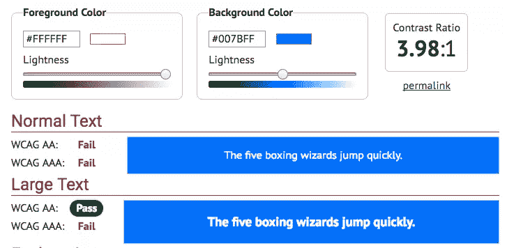

默认蓝色对比度

另一个例子是他们的警告框着色。它的评级非常高，为 8.25:1，轻松通过(高于上一版本的 4.53:1，仅刚刚通过)。

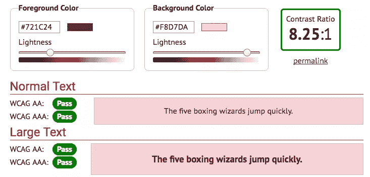

默认警告颜色对比度

其他提醒也有类似的评级——这很好，因为它们通常不是定制的，不像默认的蓝色会被网站品牌的颜色所取代。只要确保无论你用什么配色方案来覆盖它，都能通过颜色对比检查。

**加分:**让你的颜色通过色盲检查也是一件有助于无障碍的事情。[大约 8%的男性患有红绿色盲](http://www.colourblindawareness.org/colour-blindness/)，因此对一些颜色组合会有困难。如果你不确定，有一些[工具可以用色盲过滤器](https://css-tricks.com/accessibility-basics-testing-your-page-for-color-blindness/)显示你的网站。

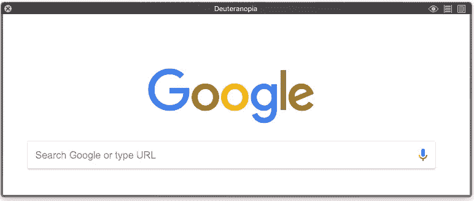

使用[模拟道尔顿制](https://itunes.apple.com/ca/app/sim-daltonism/id693112260?mt=12)

**双倍加分:**用高对比度的颜色设置来检查你的网站也有利于辅助功能。一些视力较低的人将他们的浏览器设置自定义为高对比度，以帮助他们看得更清楚。例如，如果你进入 Firefox 的首选项设置，你可以设置浏览器的背景和文本颜色:

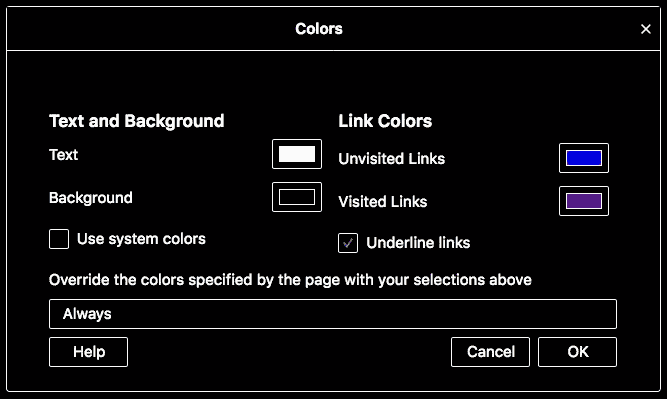

高对比度的 Firefox 颜色首选项

上次我这样测试 Bootstrap 版本 3 时，受到影响的部分是输入和按钮。当此设置打开时，两者上的文本都完全模糊，这使得网站不可用。这一次，天气在某些地方稍微好了一些。


高对比度的好例子

但是，在其他示例中，背景保持黑色，您看不到您在输入中键入的文本或按钮上的文本:

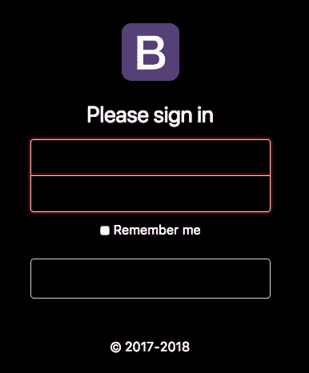

高对比度差示例

幸运的是，这是一个相当容易的解决方法:输入只需要其背景颜色是透明的而不是白色。

```
input {
  background-color: transparent !important;
} 
```

轮廓按钮(和链接按钮)比块按钮好得多。

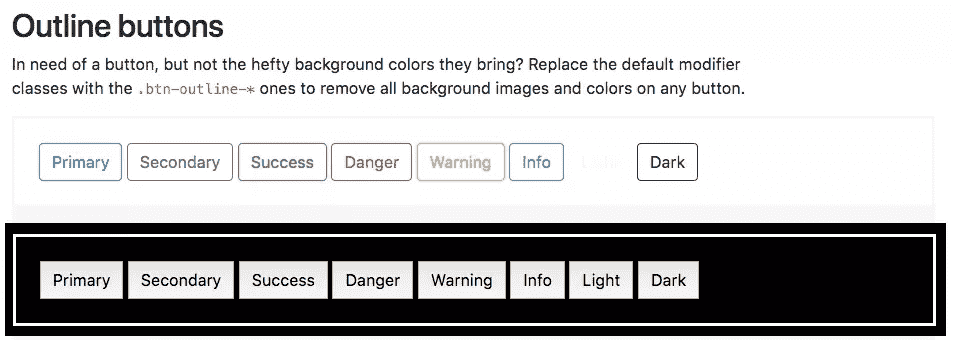

轮廓按钮高对比度

## 那么 Bootstrap 可访问吗？

简单来说，答案是不，不完全是。开发人员在他们的文档中添加了许多引导可访问性特性，很明显他们很重视它，这是一个很大的进步。然而，这并不是故事的结尾。

设计者和开发者在网站上工作时也需要考虑可访问性。经过一些小心和修改，像 Bootstrap 这样的框架可以像任何网站一样变得可访问，但它取决于网站开发者采取下一步措施来确保他们的网站可以被尽可能多的人使用。

**如果你听说过 Bootstrap，但因为它看起来太复杂而推迟了学习，那么请浏览我们的[Bootstrap 简介 4](https://www.sitepoint.com/premium/courses/introduction-to-bootstrap-4-2984) 课程，快速而有趣地了解 Bootstrap 的强大功能。**

## 分享这篇文章