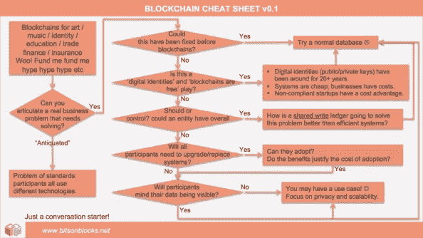
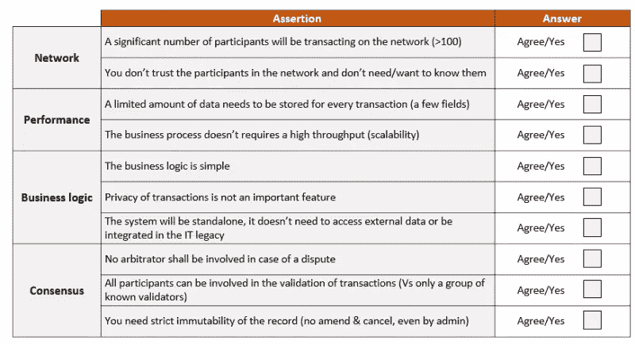

# 区块链是如何运作的？角。3

> 原文：<https://www.sitepoint.com/how-does-the-blockchain-work-pt-3/>

*本文原载于[区块链评论](https://blockchainreview.io/blockchain-work-part-3/)。感谢您对使 SitePoint 成为可能的合作伙伴的支持。*

什么是共识，为什么它很重要？

比特币的世界以及分布式账本和区块链的底层技术正经历着快速的变化和发展。

随着低信任数字系统获得追随者和不同的用例，开发人员正在创建新的变种区块链，以处理公共、财团和私人区块链技术之间不可避免的分裂。

让我们注意一下公共、财团和私人区块链之间的区别。

**公共** —完全分散和不受控制的网络，不需要访问许可——任何人都可以参与共识过程，以确定添加哪些交易块。在公共区块链中，参与者之间通常很少或没有预先存在的信任。

**财团** —新交易块的共识过程由一组固定的节点控制，例如一组预先存在高度信任的金融机构。

**私有** —访问权限受到严格控制，读取或修改区块链的权限仅限于特定用户。读取区块链的权限可能是受限的或公开的。[ [1](https://blog.ethereum.org/2015/08/07/on-public-and-private-blockchains/)

至少在一些私人区块链参与者之间通常存在某种程度的预先存在的信任。

组织需要的预先存在的信任程度，以及对参与者权限的必要控制，将决定使用哪种类型的区块链。

不同的区块链解决方案各有利弊。以每种类型的区块链在交易验证方式上的差异为例:

**工作证明(PoW)** :关于利用资源密集型散列过程“挖掘”交易，该散列过程(a)确认网络参与者之间的交易，以及(b)将确认的交易作为新块写入区块链分类账。

被接受的新区块证明工作已经完成，因此矿工可以因成功完成工作而获得 25 BTC(比特币)的报酬。PoW 问题在于它是资源密集型的，且基于计算机资源能力在矿工中产生了集中化的趋势。

**股权证明(PoS)** :关于“验证”矿工创造的区块，并要求用户证明其“股权”的所有权 [2](https://en.bitcoin.it/wiki/Proof_of_Stake) 。验证在过程中引入了随机性，使得建立验证垄断更加困难，从而增强了网络安全性。

投票站的一个问题是“没有利害关系”的问题，在这种情况下，矿工投票支持不同的区块链历史不会有什么损失，从而妨碍了达成共识。有几种解决这个问题的尝试正在进行。

该领域的其他发展希望将 PoW 与 PoS 相结合，以创建具有最高安全性和最低资源需求的混合区块链。

为此，一些开发人员专注于通过“没有挖掘的共识”来增强网络安全性。[ [3](http://tendermint.com/docs/tendermint.pdf)

Tendermint 的联合创始人 Jae Kwon 发表了一篇论文，描述了他的公司在这方面的概念和方法。

现有的工作证明和利害关系证明协议具有各种问题，例如需要巨大的能量使用支出和增加的集中化(PoW)或者参与者没有利害关系(PoS ),这可能导致对开采区块的共识破坏。

Kwon 的解决方案是双重的，不需要工作证明:

*   大多数⅔验证者需要在区块提交上签字，只有⅓能够签署重复区块而不受惩罚
*   该协议通过破坏恶意行为者的比特币账户价值，将双重消费攻击的惩罚提高到不可接受的高水平。

该算法基于 DLS 协议的修改版本，并且对拜占庭参与者的⅓具有弹性。

Kwon 和他在 Tendermint 的团队希望为区块链应用程序开发带来速度、简单性和安全性。

那么，如何决定使用哪种类型的区块链以及它们与您公司用例的相关性呢？[ [4](http://www.coindesk.com/four-genuine-blockchain-use-cases/)

根据组织的最大优先需求，以下是不同类型的区块链的几个示例:

一个考虑是保密性。例如，在公共财务区块链的情况下，所有交易都出现在每个参与者的分类账中。因此，虽然交易双方的身份不得而知，但交易本身是公开的。

一些公司正在开发“支持”区块链以避免这个问题，通过以加密形式存储或公证合同，并执行一些基本的重复检测。每家公司都将交易数据存储在自己的数据库中，但将区块链用于有限的纪念目的。

第二个考虑是你是否需要追踪出处。现有的供应链充斥着假冒和盗窃问题。集体属于供应链参与者的区块链可以减少或消除供应链中的中断，并确保跟踪供应链的数据库的完整性。

第三个例子是组织之间需要保存记录，例如法律或会计通信。为提交给案例档案库的信息打上时间戳并提供来源证明的区块链将为多个组织提供一种联合管理档案库的方式，同时确保档案库的安全，防止个人试图破坏它。

从根本上来说，区块链的运作是基于每一笔加入分类账的交易是如何达成共识的。

每种共识机制的好处是什么，在什么情况下可以得到最好的利用？

**工作证明** —矿工有尽快处理尽可能多的交易的经济动机。功率最好由高吞吐量需求系统来利用。

**股份证明** —交易验证者根据他们在网络中的“股份”数量获得一定比例的奖励。这可以通过阻止欺骗性攻击来提高网络安全性。PoS 最适合计算能力受限的组织使用。

**授权的利害关系证明**[[5](https://bitshares.org/technology/delegated-proof-of-stake-consensus/)——网络参数由选出的代表或代表决定。如果你看重一个监管干预减少的“民主化”区块链，这个版本正适合你。

**PAXOS** —一个学术性的复杂协议，以多个分布式机器为中心，就单个值达成一致。这个协议在现实世界条件下很难实现。

**RAFT** —在性能和容错上与 PAXOS 类似，只是“分解成相对独立的子问题”，更容易理解和利用。

**循环法** —利用随机方法，循环法协议要求每个块由块加法器进行数字签名，块加法器可以是一组定义的参与者。这更适合参与者相互认识的私人区块链网络。

**联合共识** —联合共识是指每个参与者都认识所有其他参与者，并且相互信任的小团体就每个交易达成一致，并且随着时间的推移，该交易被认为是有效的。适用于不需要分散控制的系统。

**专有分布式分类账**—PDL 是一种分类账由一个中央实体或财团控制或专有的分类账。这种协议的好处是，在网络参与者和商定的安全措施之间已经存在高度的预先存在的信任。适用于一个财团或一组贸易伙伴，如供应链。

**PBFT** —在 PBFT 系统中，每个节点发布一个公钥，消息由每个节点签名，在足够多的相同响应之后，交易被认为是有效的。PBFT 更适合由于高交易量而要求低延迟但不需要大吞吐量的数字资产。

**N2N** —节点到节点(N2N)系统的特点是加密交易，只有参与交易的各方才能访问数据。监管机构等第三方可能有选择加入的特权。适合需要高度交易保密性的用例。

以上列表代表了当前正在运行或来自研究的主要共识机制。

由于比特币最初的知名度，金融服务业很早就开始研究共识机制的可能用途，以简化运营、降低成本和消除欺诈活动。

数万亿美元的全球金融服务行业实际上由许多不同的部门组成，从贷款到智能合同、交易执行、信用证、保险、支付、资产注册、监管报告等等。

例如，作为一项重要的进出口贸易服务，获取信用证的流程可能会利用“联盟”方法来达成交易共识。

2016 年 8 月，银行财团 R3CEV 成功设计并执行了交易智能合约。这些类型的合同然后可以适用于应收账款发票保理和信用证交易。

对于跨境汇款的用例来说，交易双方都有许多人参与，一个“公共”共识机制可能是一个相关的选择。

由于汇款需要相对较短的交易完成等待时间，因此一种涉及股权证明方法的解决方案将是引人注目的，这种方法对验证交易的资源要求较低，并且可能具有较高的安全性。

总之，区块链国家的发展速度在全世界范围内迅速提高，但仍有许多工作要做。

众多全球 2000 强公司在其技术高管和顾问的带领下，开始参与这一革命性技术领域的开发和测试。

开始直接了解区块链技术力量的组织将有更多的机会领导他们的行业。

如果你偶然看到这篇文章，并想找到原文的快速链接，请参见 [**区块链是如何工作的？**](https://www.sitepoint.com/how-does-the-blockchain-work-pt-1) 。

该系列的其余部分在这里:

*   [区块链是如何工作的？第一部分](https://www.sitepoint.com/how-does-the-blockchain-work-pt-1)
*   [区块链是如何工作的？第 2 部分](https://www.sitepoint.com/how-does-the-blockchain-work-pt-2)–*你需要知道的 5 件大事*。
*   [区块链是如何工作的？第 4 部分](https://www.sitepoint.com/how-does-the-blockchain-work-pt-4/)–*区块链的私立、公立和财团有什么区别？*

我一直很想见到区块链的创始人、学术研究人员和从事挑战性项目的技术人员，所以请随时通过 LinkedIn 联系我，或者发邮件到 collin@intrepid.ventures

*   寻找新的加密货币？查看对[元数据库](https://medium.com/blockchain-review/metabase-a-blockchain-platform-to-build-next-generation-businesses-d08d8445584c)的介绍。
*   想推出自己的 ICO？现在在[令牌卡](https://www.tokendeck.io/)申请。

## 分享这篇文章