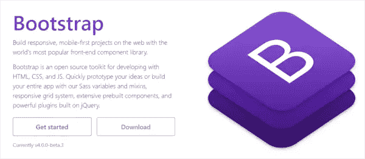
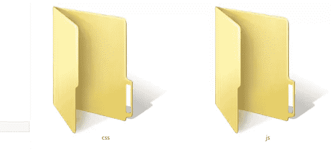

# 了解 Bootstrap:它的工作原理和新特性

> 原文：<https://www.sitepoint.com/understanding-bootstrap/>

Bootstrap 的第 4 版是对过去所有版本的一个重大改变。这是一个移动优先的框架，可以说是构建响应式网站设计的最佳 CSS 框架之一。

由于 Bootstrap 是一个移动优先的框架，默认情况下，无论你设计或创建什么，都将是移动兼容或响应的。是不是很酷？

## 入门指南

Bootstrap 有一个新的网站设计，它本身是使用 Bootstrap 框架的最新版本(撰写本文时是第 4 版)构建的。

您可以使用 CDN 包含预编译版本的 Bootstrap，或者在这里下载归档文件。

一旦你解压了存档文件，你会看到很多我们教程不需要的文件和文件夹。直接跳转到`dist`目录，并将所有文件夹复制到一个新的目的地，这将是您的项目主页。

在以前版本的框架中，下载包括一个额外的字体文件夹。现在，没有字体被包括在内，但是我们可以很容易地从[字体牛逼](http://fontawesome.io/)或者从你最喜欢的图标字体资源中抓取一些不错的字体。在我们的例子中，我们有两个目录，所以让我们来看看它们。`css`文件夹包含六个 CSS 文件:

*   `bootstrap.css`
*   `bootstrap.min.css`
*   `bootstrap-grid.css`
*   `bootstrap-grid.min.css`
*   `bootstrap-reboot.css`
*   `bootstrap-reboot.min.css`

如您所见，最新版本的 Bootstrap 比以前的版本更加模块化。如果你只是需要一个不错的 CSS 重置，只需使用`bootstrap-reboot.css`(以及它的生产缩小版)。类似地，如果你只是想使用网格，在你的项目中包含`bootstrap-grid.css`(或者`bootstrap-grid.min.css`。

对于本教程，我们的主 CSS 文件将是`bootstrap.css`，我们必须在所有的 HTML 页面中包含它。`bootstrap.min.css`只是`bootstrap.css`的缩小版。当我们实际在线部署我们的应用程序时，它是必需的。

转到`js`文件夹，我们有以下四个文件:

*   `bootstrap.bundle.js`
*   `bootstrap.bundle.min.js`
*   `bootstrap.js`
*   `bootstrap.min.js`

这些文件包含 Bootstrap 的主要 JavaScript 库，如传送带、下拉菜单、搜索自动建议和许多其他强大的 JavaScript 功能。当应用程序准备好进行部署时，我们将使用简化版本。

自 Bootstrap 4 beta 2 以来，`js`文件夹已经包含了两个新文件夹，`bootstrap-bundle.js`(以及其生产用的缩小版本)，还有 [Popper.js](https://popper.js.org/) ，这是一个用于管理 web 应用程序中的 Popper 的智能 JavaScript 库。

## 那么我们到底要建造什么？

在本文中，我们将使用 Bootstrap 4 构建一个静态登录页面，该页面将被称为“租赁假期”。先看一下[演示页面](https://codepen.io/SitePoint/pen/RQNyMe)。

参见 [CodePen](https://codepen.io) 上 SitePoint ( [@SitePoint](https://codepen.io/SitePoint) )的 Pen [引导登陆页面演示](https://codepen.io/SitePoint/pen/RQNyMe/)。