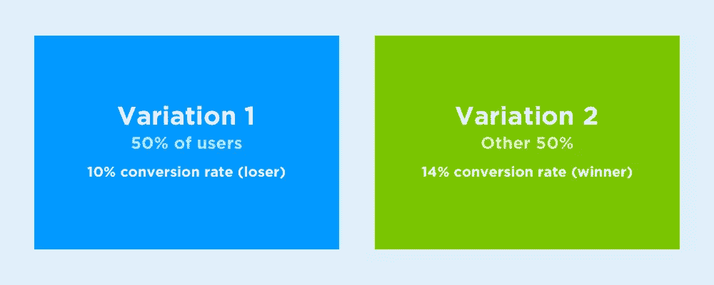
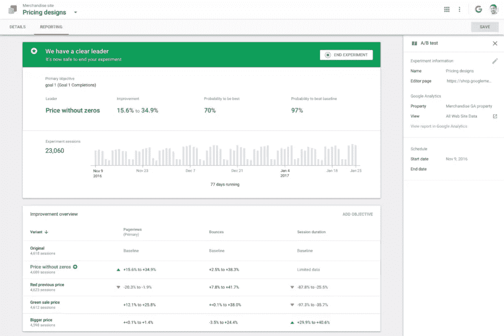
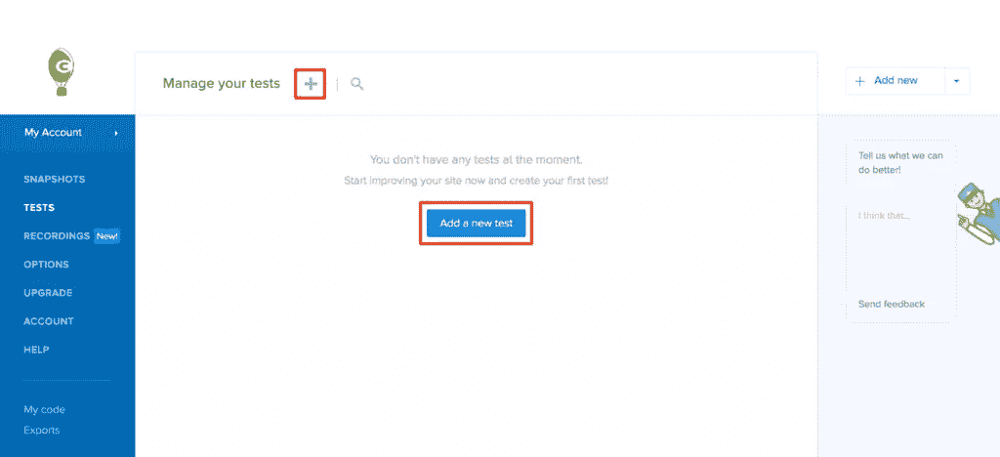

# A/B 测试简介

> 原文：<https://www.sitepoint.com/a-b-testing-introduction/>

我们最近发表了一些关于数据驱动设计的文章，或者使用分析来指导我们的 UI 设计。简而言之，我们可以使用像谷歌分析这样的分析工具来进行用户研究，了解我们的用户人口统计数据和用户行为，并确定我们网站在 UX 方面可能存在的不足。

当我们知道的用户在哪里遇到麻烦，并且我们有一些关于*和*谁遇到麻烦的背景信息时，我们可以开始假设*为什么会遇到麻烦*。然后我们可以利用可用性测试来证实(或反驳！)我们的假设，通过这一点，我们甚至有可能看到一个显而易见的解决方案。结果呢？更快乐的用户，更多的转化！

但是当解决方案没有通过可用性测试变得显而易见时会发生什么呢？如果有一个适用于一个用户组的解决方案，但对另一个用户组不太适用，会发生什么情况？您可能会修复某些用户的用户体验，而破坏另一些用户的用户体验。

让我给你介绍一下 A/B 测试。

## 什么是 A/B 测试？

**A/B 测试**，简而言之，就是实现一个设计的两个变体，看看哪一个更好，其中要测量的主要指标是转换的数量(这可能是销售、注册、订户——无论什么)。A/B 测试有系统的技术，也有工具帮助我们以公平和不引人注目的方式进行这些实验。

当有多个变量需要考虑时，我们还可以使用多变量测试(A/B 测试的一个子集)来进行实验。

## 什么是多元测试？

多变量测试更有助于发现用户更喜欢什么内容，而不是他们更喜欢哪个版本的界面，但话虽如此，内容也是 UX 的一个重要方面。想想看:用户来你的网站不是为了欣赏你的导航有多直观。UX 是用户*需要的*；内容是用户*想要的*(也是他们来的目的)。

考虑一个标题+ <abbr title="call to action">CTA</abbr> 这是主页上的主要转换漏斗。假设我们有各种各样的标题和 CTA 选项，我们想随机地用各种不同的组合来测试它们。这就是多元测试可能优先于标准 A/B 测试的地方。

## A/B 测试需要哪些工具？

本质上，您可以通过记录一个版本的结果，实现另一个版本，然后记录那个版本的结果来进行 A/B 测试。然而，有一些关键缺陷需要解决:

*   在两次测试之间，你的流量/观众可能会发生变化
*   你必须分析数据两次，并手动比较结果
*   您可能希望将测试划分给特定的用户组。

理想情况下，我们希望两个测试的结果并排显示，以便我们可以比较分析它们，并且我们还希望两个实验同时处于活动状态，以确保实验公平进行。

A/B 测试工具允许我们这样做。

### 三巨头:谷歌优化，CrazyEgg 和优化

虽然有一些著名的 A/B 测试工具，但 Google Optimize、CrazyEgg 和 Optimizely 通常被认为是三大工具。它们在很多方面也非常不同，所以您选择哪一个可能取决于您的 A/B 测试需求。

Google Optimize 与 Google Analytics 协调工作，并且像 Google Analytics 一样，它是免费的(尽管有一个针对企业团队的“Google Optimize 360”版本)。就像谷歌分析一样，免费版相当复杂，对大多数用户来说已经足够了。

实际上，CrazyEgg 将用户测试(它有热图工具)和 A/B 测试整合到一个应用程序中，允许您缩小特定可用性问题的范围，然后尝试各种解决方案，而无需切换应用程序。

优化上来说是三个中最复杂的，但也是最*强大的*，因为他们的 SDK 允许跨你的网站、移动应用甚至电视应用进行更原生的集成(尽管这些工具确实需要开发者)。但除此之外，Optimizely 还使用 A/B 测试来提供内容相关的推荐——这种推荐转换得更好，因为它们的目标受众肯定会喜欢这些推荐。

## A/B 测试中，*右*方式

说到 A/B 测试，有正确的方法和错误的方法。我们最容易犯的错误是，如果一个网站的转化率很低，我们必须设计另一个版本，看看它是否工作得更好。相反，我们应该使用分析(以及后来的可用性测试)来识别更具体的改进领域。否则，我们可能会删除设计中实际有效的部分，并且我们也无法了解我们的观众对这种体验到底喜欢什么和不喜欢什么。

## 结论

现在你知道了什么是 A/B 和多元测试，可以用来进行 A/B 测试的工具，以及如何以结构化和渐进的方式进行 A/B 实验，你可以开始采用一种更加数据驱动的方法来进行网页设计(或者任何设计，真的)。

如果你想了解更多关于分析的知识，我建议你看看我们分析系列的其他文章。预先确定关注的原因将有助于你找出你需要把你的可用性和 A/B 测试工作的重点放在哪里。

## 分享这篇文章