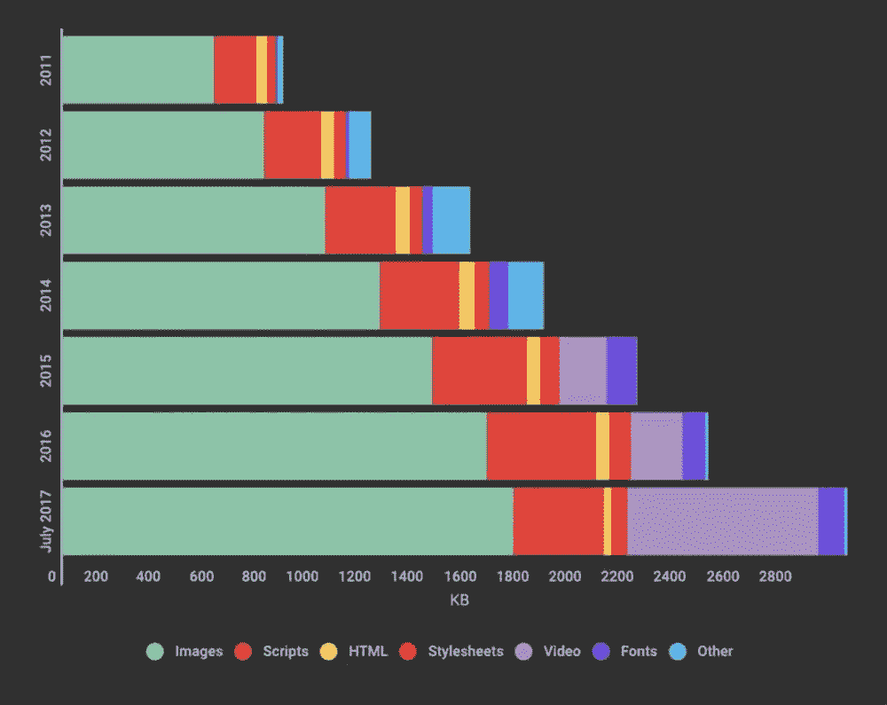
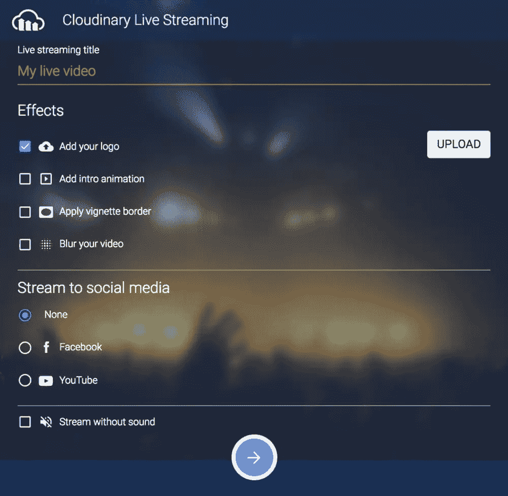

# 面向网络和移动开发者的完整视频解决方案

> 原文：<https://www.sitepoint.com/video-solution-web-and-mobile-developers/>

*本文最初发表于 [Cloudinary 博客](https://cloudinary.com/blog/introducing_the_complete_video_solution_for_web_and_mobile_developers)。感谢您对使 SitePoint 成为可能的合作伙伴的支持。*


就受欢迎程度而言，网站和应用程序中的视频开始赶上图像，它们是大多数组织媒体战略中不断增长的一部分。这意味着需要在其网站和移动应用程序中处理这些视频的开发者面临更大的挑战。 [Cloudinary 的](http://synd.co/2AezvRd)在这里解决开发者围绕图像和视频管理的需求。在本文中，我们将为开发人员介绍 Cloudinary 完整的基于云的视频管理解决方案。

以下是一些亮点:

*   视频上传 API 和 UI 小部件–将您的视频直接上传到云存储
*   用于管理视频资产的可编程交互式界面
*   通过 CDN 交付 URL 进行实时视频转码和操作
*   具有用户参与分析功能的可定制视频播放器([参见演示](http://synd.co/2juyGtJ)
*   直接来自网络和移动应用的实时视频流([参见演示](http://synd.co/2AhV4OV)
*   基于人工智能的视频标记和转录

## 网站视频正在成为主流

视频现在占了网站平均下载带宽的 25%([速度曲线分析](http://synd.co/2AhZPYw))。如下图所示，与两年前相比，这反映了大约 400%的巨大增长。2017 年绝对是视频年，虽然`<video>`没有杀死``标签，而且(可能)永远也不会，但对开发者来说，在现代网站和移动应用中管理和交付视频变得越来越复杂。



视频是页面不动产中增长最快的元素。来源:SpeedCurve 博客

当 Cloudinary 的服务在 2012 年公开推出时，我们的第一个任务是解决 web 和应用程序开发人员的图像管理需求:从**从任何设备上传**图像并**将**图像存储在云中，**动态地操纵**图像以匹配任何图形设计和屏幕分辨率，到动态地**优化**图像并**通过快速 CDN 将**图像交付给全球用户。然后，在 2015 年 5 月，我们扩展了我们的解决方案，推出了 [Cloudinary 基于云的视频上传、实时操作和优化观看服务](http://synd.co/2ih8qGp)。

我们的新产品为图像和视频提供了相同的基于云的服务 API。虽然图像管理领域在不断发展，但自 2015 年以来，我们也一直在不断增强我们的视频转码能力。如今，Cloudinary 的 **5000** 付费客户中约有 **30%** 已经每月上传和操作数千万个视频，而且这个数字还在相当快速地增长。

开发人员在网站上面对的视频挑战往往比图像更复杂。视频文件可能很大，这意味着更长的上传和下载时间，以及非常占用 CPU 的代码转换和操作。潜在的设备、分辨率、视频格式和视频编解码器的集合很大，令人困惑。理想的最佳用户体验要求现代视频播放器具有用户参与度统计，并且在某些情况下还具有货币化能力。

今天，我们很高兴地推出我们基于云的下一代视频管理服务——更先进的实时视频转码，以及现代视频播放器、实时视频流、基于人工智能的视频标记和脚本等；所有这些都旨在简化 web 和移动开发人员的视频工作流程，同时改善和增强最终用户体验。

## 面向开发人员的完整视频管理解决方案

无论您是交付高质量的专业视频还是用户生成的剪辑，无论您有一个电子商务网站、新闻频道、旅游论坛还是广告代理，快速上传并向任何位置的任何设备交付优化的高质量视频所涉及的后端挑战始终存在，调整输出以满足您的设计需求并提供出色的前端用户体验也是如此。如果你想直播视频或者在社交网络中整合和分享内容，所有这些挑战都会增加。

Cloudinary 通过将以下功能作为单一简化解决方案的一部分来解决所有这些问题以及更多问题:

### 上传、存储和管理

网站和应用程序中动态视频的端到端解决方案始于从浏览器或移动应用程序直接上传的能力。一行代码就能让用户[将任何图像或视频文件](http://synd.co/2Br5AmV)上传到云端，甚至不需要通过你的服务器:

```
 Cloudinary::Uploader.upload(file, 
            resource_type: :video, public_id: "sea_turtle") 
```

您还可以使用[上传小工具](http://synd.co/2zw4YLn)，它为您的用户选择和上传图像和视频文件提供了一个内置的用户界面。

上传的视频安全地存储在云中。上传后，您可以使用我们的[管理 API](http://synd.co/2i0mv7s) 或使用 Cloudinary 的数字资产管理用户界面来管理您的基于云的媒体文件数据库。

### 实时视频转码、处理和流式传输

视频文件可能以各种不同的格式、编解码器、分辨率和纵横比上传。这些属性很可能与你的网站的设计以及访问者使用的各种设备、浏览器和分辨率不匹配。视频通过 HTTP/S URL 传送到网站。Cloudinary 支持格式转换、视频编解码器优化，以及使用常规 CDN 交付 URL 调整视频大小和裁剪视频。视频代码转换和操作是根据 URL 中的指令执行的，而视频处理是在第一个用户访问 URL 时在云中实时进行的。

例如，下面是最初上传的视频，随后是该视频的网络友好 MP4 200×200 裁剪版本。通过将`w_200,h_200,c_fill,g_north`动态操作指令添加到视频交付 URL 中，可以即时完成代码转换和裁剪。

```
https://res.cloudinary.com/demo/video/upload/w_200,h_200,c_fill,g_north/sea_turtle.mp4 
```

有大量的[附加视频处理](http://synd.co/2AdtXpZ)构建模块，你可以混合&匹配来创建你想要的复合视频。这些包括效果、滤镜、图像、视频和文本的叠加等等。下面你可以看到一个更高级的例子，它应用了一个色彩饱和度降低滤镜，并添加了一个图像(水印)，以及在视频中选定时间的视频和文本叠加。

```
https://res.cloudinary.com/demo/video/upload/ar_21:9,c_fill,w_500,ac_none/e_saturation:-50/l_cloudinary_icon,g_north_east,e_brightness:200,o_40,x_5,y_5,w_120/l_text:Roboto_34px_bold:Cute.Animals,co_white,g_west,x_10,so_2/l_video:funny_dog,w_200,g_south_east,y_10,x_10,so_2/sea_turtle.mp4 
```

只需修改文件扩展名，就可以将视频转换成不同的格式。例如，将扩展名更改为“. m3u8”将自动生成我们内置的 **HLS 和 MPEG-DASH** [自适应比特率流](http://synd.co/2k5QG1o)所需的所有索引文件。你可以在下面的演示中看到更多在线视频转码的例子:https://demo.cloudinary.com/video/

### 可定制的视频播放器

上面的例子展示了基于 URL 的后端**技术**，您可以使用它来生成和交付视频。但 Cloudinary 希望更进一步，为开发人员提供一个完整而简单的解决方案来解决前端视频播放体验。

一款新的**云视频播放器**现已公开发售。播放器可以由一行代码启动，该代码接受视频 ID 并自动构建视频操作和交付 URL。网络友好的视频格式，如 MP4 的使用和 HLS & MPEG-DASH 自适应比特率流是自动设置的。

视频播放器可以使用 HTML 标记启动，也可以使用 JavaScript 以编程方式启动:

```
var vplayer = cld.videoPlayer("demo-player", {
   publicId: 'rafting',
   loop: true,
   controls: true,
   autoplayMode: 'on-scroll',
   transformation: { width: 400, crop: 'limit ' },
   posterOptions: {publicId: 'mypic', transformation { effect: ['sepia']}},
   sourceTypes: ["hls", "mp4"],
 }) 
```

播放器有两个内置的外观主题，可以进一步定制。它支持推荐的视频建议和自动播放列表的创建给定的标签分配给多个视频。您可以通过监控事件来跟踪用户参与度，这些事件可以直接自动发送到分析系统，如 Google Analytics。参见[视频播放器文档](http://synd.co/2Ady7OH)了解更多详情。

视频播放器是一个基于流行的 [VideoJS](http://videojs.com/) 开源视频播放器的[开源项目，拥有庞大的插件和定制生态系统。](https://github.com/cloudinary/cloudinary-video-player)

视频播放器的交互示例可以在我们的[视频播放器演示页面](https://demo.cloudinary.com/video-player)中找到。


### 实时转码的实时视频流

第一次上传视频并在完成后将其交付给用户的常见流程正在逐渐为更高级的直播视频流扫清道路。Cloudinary 现在为直接来自网站和应用程序的视频内容直播提供(测试版)支持。

视频转码和操作在实时流上实时完成，与在预上传视频上完成的方式完全相同-从原始视频中同时生成多个不同版本-不同的分辨率、裁剪模式、编码质量水平、水印、效果、个性化文本叠加等。

直播基于 WebRTC 协议，你可以指示 Cloudinary 使用 RTMP 协议自动将视频直接传输到**脸书**或 **YouTube** 。

您可以通过移动[网络演示应用](https://demo.cloudinary.com/live)体验完整的直播体验



### 基于人工智能的视频标记和转录

如果您的 web 应用程序有许多视频或支持用户生成的视频内容，智能视频管理自动化将使您的生活更加轻松，并可能提高用户参与度。

### 自动视频字幕创建

自动播放静音视频在脸书等新闻网站和社交网络上变得非常流行。新版本的网络浏览器甚至限制了自动播放功能，并阻止自动播放声音。为了让语音视频即使静音也能有效，字幕是必要的。如果你想支持上传视频到一个静音自动播放的社交 feed，你可能需要视频已经嵌入了字幕。

基于人工智能的视频脚本现在可以作为由谷歌的云语音 API 支持的[完全集成的插件](http://synd.co/2zNABo8)使用。通过将 Cloudinary 的 raw_convert upload API 参数设置为 google_speech，可以自动处理视频的音频通道，并在您的媒体库中生成一个抄本文件。

```
Cloudinary::Uploader.upload("lincoln.mp4", :resource_type => :video, :raw_convert  => "google_speech") 
```

基于自动转录生成嵌入字幕的视频非常简单，只需向动态视频交付 URL 添加另一个参数(在下面的示例中，添加`l_subtitles:lincoln.transcript`)。你甚至可以用额外的选项来增强字幕，比如你选择的字体、字号、颜色等等。最初的视频(不包括任何字幕)，现在包括了基于谷歌语音到文本人工智能引擎自动生成的字幕。

```
https://res.cloudinary.com/demo/video/upload/l_subtitles:arial_20:lincoln.transcript,co_yellow/lincoln.mp4 
```

### 自动视频标记

通过对图片和视频进行分类和标记来组织媒体数据库或电子商务产品目录，以更好地将上传的内容与用户相匹配，这是一种常见的做法。Cloudinary 现在支持上传视频的自动人工智能标记。

自动标记作为一个完全集成的插件提供，由谷歌的云视频智能支持。通过将 Cloudinary 的`categorization` upload API 参数设置为 google_video_tagging，自动分析视频，并在响应中包含检测到的标签类别列表。如果您还设置了自动标记级别，则任何超出所请求的信任级别的类别都会自动添加到资源的标记列表中。

```
Cloudinary::Uploader.upload("turtle.mp4", :resource_type => :video, :categorization => "google_video_tagging", :auto_tagging => 0.7) 
```

下面是来自自动标记的示例响应。置信度高于给定阈值的类别会被自动分配。接下来，您可以看到所有检测到的类别的完整列表以及每个建议标签适用的时间段。您可以通过 API 或我们的交互式 UI，根据自动分配的标签列出、浏览、删除和搜索图像和视频。

```
"tags": [ "turtle", "animal" ...],
"data": [
  {"tag": "turtle", "start_time_offset"=>0.0, "end_time_offset"=>13.44, 
    "confidence": 0.93},
  {"tag": "animal", "start_time_offset"=>0.0, "end_time_offset"=>13.44, 
    "confidence": 0.93} ...  ] 
```

## 图像和视频，而不是图像*和视频*

在 2012 年公开发布 Cloudinary 后的头几年，我们发布的大部分技术博客帖子都是我写的。但是我们成长了，我已经很久没写了。当我决定写这篇介绍我们下一代视频解决方案的文章时，我认为这将是一个快速的任务…

唉，我大错特错了——一点也不快。正如您所看到的，试图涵盖现有组件的亮点和我们视频解决方案的新功能导致了这篇比预期更长的博文，但我仍然觉得我跳过了这么多很酷的功能和用例。
您可能已经了解到，我们为我们增强的图像和视频管理服务及其新功能感到自豪。我们甚至在主页上做了一个微小但重要的更新，以清楚地显示视频在我们完整解决方案中的位置:


我们邀请您试用视频解决方案的新功能，并分享您的反馈([社区页面](http://synd.co/2zLA06h)或[论坛](http://synd.co/2ienwwj))。就我们而言，我们将继续努力，根据您的功能要求和建议进一步构建和增强它。

所有视频管理功能现已在我们的所有计划中提供，包括免费计划。您可以在这里创建您的免费帐户[。](http://synd.co/2AgSJn7)

## 分享这篇文章