# 渐进式网络应用:速成班

> 原文：<https://www.sitepoint.com/progressive-web-apps-a-crash-course/>

渐进式网络应用程序(pwa)试图通过向移动用户提供各自的最佳功能，来重叠移动网络应用程序和本地移动应用程序的世界。

它们提供了类似应用程序的用户体验(闪屏和主屏幕图标)，它们由 HTTPS 安全的服务器提供服务，即使在低质量或慢速网络条件下也能快速加载(得益于页面加载性能最佳实践)，并且它们具有离线支持、即时加载和推送通知。PWAs 的概念最早是由 Google 引入的，并且仍然受到许多 Chrome 功能和优秀工具的支持，例如 Lighthouse，这是一个用于可访问性、性能和进步性审计的开源工具，我们将在稍后介绍。

在整个速成课程中，我们将使用 ES6 从头构建一个 PWA，并使用 Lighthouse 逐步对其进行反应和优化，直到我们在 UX 和性能方面取得最佳结果。

术语 **progressive** 只是指 pwa 的设计方式使得它们可以在现代浏览器中*渐进增强*，在现代浏览器中，许多新功能和技术已经得到支持，但在没有前沿功能的旧浏览器中也应该工作良好。

## 原生与移动=渐进

本地应用可从移动操作系统各自的应用商店分发和下载。另一方面，只需输入地址或 URL，就可以在网络浏览器中访问移动网络应用。从用户的角度来看，启动一个浏览器，导航到一个地址，比去 app store 下载，安装，然后启动应用要方便得多。从开发者/所有者的角度来看，支付一次性费用获得一个应用程序商店帐户，然后上传他们的应用程序以供全球用户使用，这比必须处理复杂的 web 托管要好。

原生 app 可以离线使用。在需要从某个 API 服务器检索远程数据的情况下，可以很容易地设想该应用程序支持某种 SQLite 缓存最新访问的数据。

像谷歌这样的搜索引擎可以将移动网络应用编入索引，通过搜索引擎优化，你可以接触到更多的用户。对于原生应用来说也是如此，因为应用商店有自己的搜索引擎，开发者可以应用不同的技术——通常称为应用商店优化——来接触更多的用户。

本机应用程序会立即加载，至少会出现闪屏，直到所有资源都准备好供应用程序执行。

这些是最重要的感知差异。每种应用程序分发方法对最终用户都有好处(在用户体验、可用性等方面)。)和应用程序所有者(关于成本、客户覆盖范围等。).考虑到这一点，谷歌引入了 PWAs，将双方的最佳功能整合到一个概念中。谷歌 Chrome 工程师亚历克斯·罗素在这份清单中总结了这些方面。(来源:[不常提及的](https://infrequently.org/2015/06/progressive-apps-escaping-tabs-without-losing-our-soul/)。)

*   响应迅速:适合任何外形规格。
*   独立连接:逐步增强服务人员，让他们离线工作。
*   类似应用程序的交互:采用外壳+内容应用程序模型来创建应用程序导航和交互。
*   新鲜:由于服务人员的更新过程，透明地总是最新的。
*   安全:通过 TLS(服务人员要求)提供服务，以防止窥探。
*   可发现的:由于 W3C 清单和服务工作者注册范围允许搜索引擎找到它们，它们可以被识别为“应用程序”。
*   可重新参与:可以访问操作系统的重新参与 ui；例如推送通知。
*   可安装:通过浏览器提供的提示显示在主屏幕上，允许用户“保留”他们认为最有用的应用程序，而无需麻烦的应用商店。
*   可链接:意味着它们零摩擦，零安装，易于共享。URL 的社会力量很重要。

## 灯塔

[Lighthouse](https://github.com/GoogleChrome/lighthouse) 是谷歌打造的一款用于审计 web 应用的工具。它与 Chrome 开发工具集成在一起，可以从审计面板触发。

您还可以将 lighthouse 用作 node.js cli 工具

```
npm install -g lighthouse 
```

然后，您可以使用以下命令运行它:

```
lighthouse https://sitepoint.com/ 
```

Lighthouse 也可以作为 Chrome 扩展安装，但谷歌建议使用与 DevTools 集成的版本，并且只在你无法使用 DevTools 的情况下使用该扩展。

请注意，您需要在系统上安装 Chrome 才能使用 Lighthouse，即使您使用的是基于 CLI 的版本。

## 从头开始构建您的第一个 PWA

在本节中，我们将从头开始创建一个渐进式 web 应用程序。首先，我们将使用 React 和 Reddit 的 API 创建一个简单的 web 应用程序。接下来，我们将按照 Lighthouse 报告提供的说明添加 PWA 特性。

请注意，公共无认证 Reddit API 启用了 CORS 头，因此您可以从客户端应用程序使用它，而无需中间服务器。

在我们开始之前，本课程将假设您已经安装了 NodeJS 和 NPM 的开发环境。如果你不知道，那就从令人敬畏的改进版[Homestead](https://www.sitepoint.com/quick-tip-get-homestead-vagrant-vm-running/)开始吧，它运行的是每一个的最新版本，并且已经准备好进行开箱即用的开发和测试。

我们首先安装 Create React App，这是 React 团队创建的一个项目样板文件，可以让您免去 WebPack 配置的麻烦。

```
npm install -g create-react-app
create-react-app react-pwa
cd react-pwa/ 
```

### 应用程序外壳架构

应用程序外壳是渐进式 web 应用程序的一个基本概念。它只是负责呈现用户界面的最少的 HTML、CSS 和 JavaScript 代码。

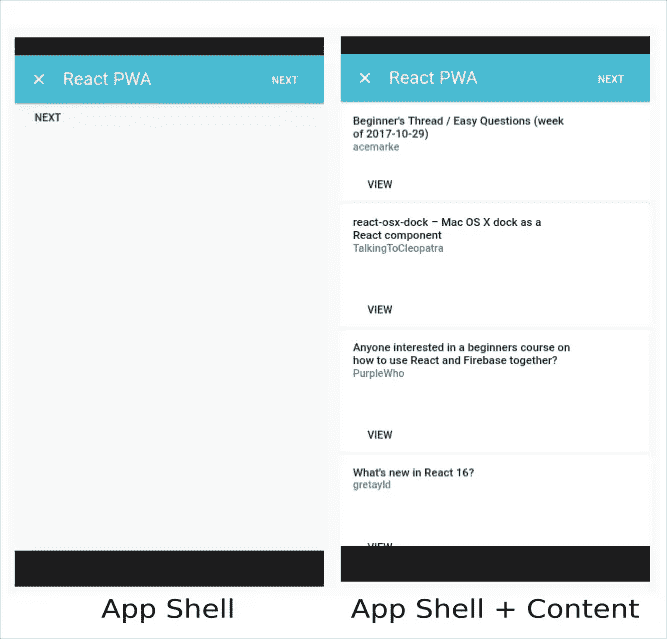

这个应用程序外壳对性能有很多好处。您可以缓存应用程序外壳，以便当用户下次访问您的应用程序时，它会立即加载，因为浏览器不需要从远程服务器获取资源。

为了构建一个简单的 UI，我们将使用 Material UI，它是 React 中 Google Material design 的一个实现。

让我们安装来自 NPM 的软件包:

```
npm install material-ui --save 
```

接下来打开`src/App.js`然后添加:

```
import React, { Component } from 'react';
import MuiThemeProvider from 'material-ui/styles/MuiThemeProvider';
import AppBar from 'material-ui/AppBar';
import {Card, CardActions, CardHeader,CardTitle,CardText} from 'material-ui/Card';
import FlatButton from 'material-ui/FlatButton';
import IconButton from 'material-ui/IconButton';
import NavigationClose from 'material-ui/svg-icons/navigation/close';

import logo from './logo.svg';
import './App.css';

class App extends Component {

  constructor(props) {
    super(props);

    this.state = {
      posts: []
    };
  }

  render() {
    return (

      <MuiThemeProvider>
        <div>
          <AppBar
            title={<span >React PWA</span>}

            iconElementLeft={<IconButton><NavigationClose /></IconButton>}
            iconElementRight={<FlatButton onClick={() => this.fetchNext('reactjs', this.state.lastPostName)} label="next" />
            }
          />

          {this.state.posts.map(function (el, index) {
            return <Card key={index}>
              <CardHeader
                title={el.data.title}

                subtitle={el.data.author}
                actAsExpander={el.data.is_self === true}
                showExpandableButton={false}
              />

              <CardText expandable={el.data.is_self === true}>
                {el.data.selftext}
              </CardText>
              <CardActions>
                <FlatButton label="View" onClick={() => {
                  window.open(el.data.url);
                }} />

              </CardActions>
            </Card>
          })}

          <FlatButton onClick={() => this.fetchNext('reactjs', this.state.lastPostName)} label="next" />
        </div>
      </MuiThemeProvider>

    );
  }
}

export default App; 
```

接下来，我们需要使用两种方法`fetchFirst()`和`fetchNext()`获取 Reddit 帖子:

```
 fetchFirst(url) {
    var that = this;
    if (url) {
      fetch('https://www.reddit.com/r/' + url + '.json').then(function (response) {
        return response.json();
      }).then(function (result) {

        that.setState({ posts: result.data.children, lastPostName: result.data.children[result.data.children.length - 1].data.name });

        console.log(that.state.posts);
      });
    }
  }  
  fetchNext(url, lastPostName) {
    var that = this;
    if (url) {
      fetch('https://www.reddit.com/r/' + url + '.json' + '?count=' + 25 + '&after=' + lastPostName).then(function (response) {
        return response.json();
      }).then(function (result) {

        that.setState({ posts: result.data.children, lastPostName: result.data.children[result.data.children.length - 1].data.name });
        console.log(that.state.posts);
      });
    }
  }
  componentWillMount() {

     this.fetchFirst("reactjs");
} 
```

你可以在这个 [GitHub 库](https://github.com/sitepoint-editors/reedit-react-pwa)中找到源代码。

在对您的应用程序运行审核之前，您需要使用本地服务器在本地构建和服务您的应用程序:

```
npm run build 
```

该命令调用`package.json`中的构建脚本，并在`react-pwa/build`文件夹中生成一个构建。

现在，您可以使用任何本地服务器来服务您的应用程序。在[家园改进版](https://www.sitepoint.com/quick-tip-get-homestead-vagrant-vm-running/)上，你可以简单地将 nginx 虚拟主机指向构建文件夹并在浏览器中打开`homestead.app`，或者你可以通过 NodeJS:

```
npm install -g serve
cd build
serve 
```

使用`serve`，您的应用将从 http://localhost:5000/提供本地服务。

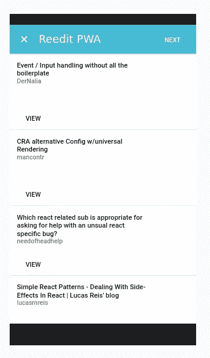

你可以毫无问题地审计你的应用，但是如果你想在移动设备上测试它，你也可以使用像`surge.sh`这样的服务，用一个命令就可以部署它！

```
npm install --global surge 
```

接下来，从任意目录中运行 surge，将该目录发布到 web 上。

你可以从这个[链接](https://reeditreactpwa.surge.sh/)找到这个应用的托管版本。

现在让我们打开 Chrome DevTools，进入审计面板，点击执行审计。

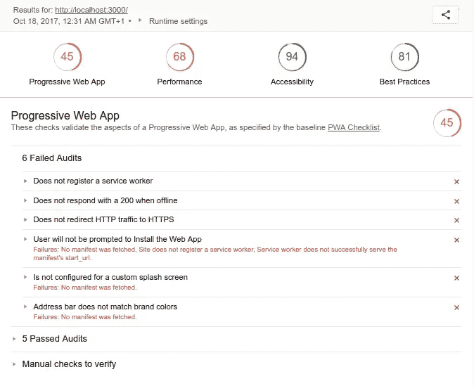

从报告中我们可以看到,**渐进式网络应用**的得分为 **45/100** ,而**的**性能**的得分为【68/100】。**

在 **Progressive Web App** 下，我们有 6 个审核失败，5 个审核通过。这是因为生成的项目已经默认添加了一些 PWA 特性，比如 web manifest、viewport meta 和`<no-script>`标签。

在**性能**下，我们有诊断和不同的计算指标，如首次有意义的绘画、首次互动、持续互动、感知速度指数和估计输入延迟。我们稍后将研究这些。

Lighthouse 建议通过减少下载大小或推迟下载不必要的资源来减少关键渲染链的长度，从而提高页面加载性能。

请注意，**性能**分数和度量值可能会在同一台机器上的不同审计会话之间发生变化，因为它们会受到许多不同条件的影响，例如您当前的网络状态以及您当前的机器状态。

## 为什么页面加载性能和速度很重要

根据 DoubleClick(一家谷歌广告公司)的调查， [53%的移动网站访问被放弃](https://www.doubleclickbygoogle.com/articles/mobile-speed-matters/)如果加载页面的时间超过 3 秒。通过优化页面加载性能和速度，PWAs 通过一组技术和策略为用户提供即时的 web 体验，我们将在接下来介绍这些技术和策略。

### 在开始构建 PWA 之前，考虑性能

 *大多数客户端应用程序都是使用某种 JavaScript 库或框架构建的，如 React、Preact、Angular、Vue 等。如果你正在构建一个 PWA，你需要确保你选择了一个移动优先的库，或者换句话说，一个首先为移动网络设计的库。否则，优化你的应用性能将是一项不可能完成的任务。

你需要使用不同的测试工具，像 Chrome DevTools，Lighthouse，Google PageSpeed 等，在不同和模拟的网络条件下对你的应用进行大量测试，这样你才能成功优化你的应用页面加载性能。

### 您需要关注的 PWA 绩效指标

您可以使用 Lighthouse 通过不同的指标、诊断和机会来衡量和优化您的应用程序的页面加载性能。

Lighthouse 使用不同的指标。让我们逐一介绍:

#### 第一幅有意义的画

第一个有意义的画面是简单地指示用户可以在屏幕上看到有意义或主要内容的时间的度量。这种审核越低，应用程序的感知性能就越好。

这是我们应用的指标。


我们看到，从 1.3s 开始，浏览器开始呈现空白背景，然后从 2s 开始，浏览器开始呈现页眉，2.4s 则呈现页眉和底部的按钮。直到第三秒才呈现帖子。整个过程耗时 3.4 秒，第一次有意义的绘制等于*2.340 ms*——在没有*下一个*按钮的表头渲染时。

第一个有意义的绘画实际上取决于我们认为什么是有意义的，这在不同的用户之间可能是不同的。如果用户只对阅读文章感兴趣，那么对他们来说第一次有意义的绘画是在 3 秒钟之后。你可以从这个文档中看到 Google 是如何计算这个指标的。

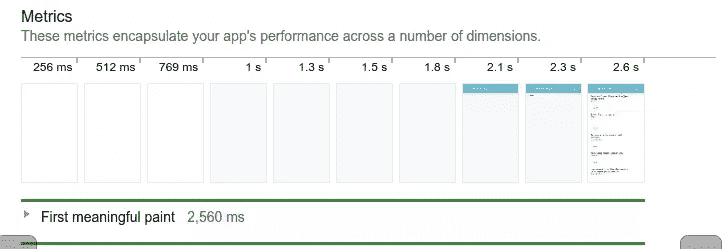

这是同一个应用程序的另一个幻灯片，在最后一个截图中，Lighthouse 报告 FMP 为*2.560 毫秒*，帖子标题完全显示在折叠区域上方。

其次，您可以看到页面是渐进呈现的，而不是一次呈现，这是性能的一个很好的指标。

您可以通过优化关键渲染路径来优化这一措施。

### 关键渲染路径

**关键呈现路径**是一个与 web 浏览器如何呈现页面相关的概念——也就是说，从接收 HTML、CSS 和 JavaScript 资产的第一瞬间到浏览器处理和呈现实际有意义内容的步骤。为了优化关键的呈现路径，您需要给与用户当前操作相关的内容更高的优先级。也就是说，如果他们要访问你的应用，你可以首先显示用户界面的可见部分，或者所谓的**折叠上方的**区域。

更多详情可以阅读“[优化关键渲染路径](https://www.sitepoint.com/optimizing-critical-rendering-path/)”。

您还可以看到这个用于内联关键 CSS 资产的管理工具列表。另外，请检查这些用于内联 JavaScript 和其他资源的工具:

*   内联器(inliner):一个节点工具，用于为网页内联图像、CSS 和 JavaScript
*   [inline-source](https://github.com/popeindustries/inline-source) :一个工具，用于在 HTML 中内联带有标记的 JS、CSS 和 IMG 源代码
*   inline-source-cli :一个用于 inline-source 的 cli 工具。

#### 关键请求链

[关键请求链](https://developers.google.com/web/tools/lighthouse/audits/critical-request-chains)是一个与关键渲染路径相关的概念，可以用一个图表来表示，该图表分解了渲染一个页面的关键资源、每个资源花费的时间以及为每个资源下载的字节数。您可以使用关键请求链图来更好地理解关键资源，以消除、推迟或标记为异步。以下是我们的 PWA 报告示例的屏幕截图:

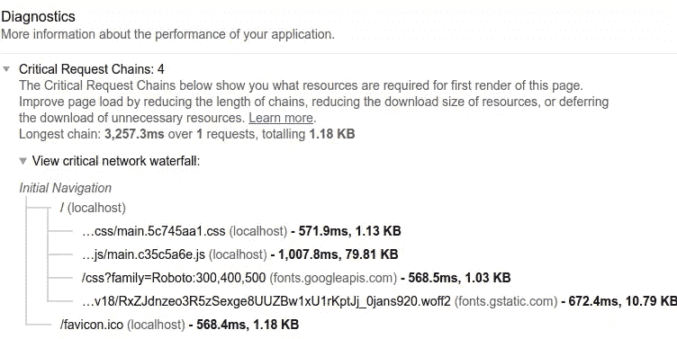

现在让我们尝试使用`inline-source`和`inline-source-cli`来解决这个问题:

```
npm install -g inline-source inline-source-cli 
```

然后我们在构建文件夹中导航并打开`index.html`，然后将关键字**内联**添加到我们想要内联的`<link>`和`<script>`元素中:

```
<link inline href="/static/css/main.5c745aa1.css" rel="stylesheet">
<script inline type="text/javascript" src="/static/js/main.c35c5a6e.js"></script> 
```

让我们内联这些资源:

```
cd build
cat ./index.html | inline-source --root ./  > ./index.html 
```

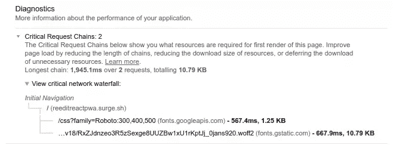

通过内联 CSS 和 JavaScript 资产，我们将关键请求链减少到了 2 个。

#### 首次互动和持续互动

这两个指标都表明了用户能够与应用程序交互的时间。这两个指标都表达了可参与性和可用性，但是它们之间是有区别的。[第一次交互](https://developers.google.com/web/tools/lighthouse/audits/first-interactive)测量页面最低限度交互的时间，而[持续交互](https://developers.google.com/web/tools/lighthouse/audits/consistently-interactive)测量页面完全交互的时间。

您可以通过优化关键渲染路径来优化交互时间。

### 感知速度指数

感知速度指数是一个衡量页面视觉性能的指标，同时考虑了布局稳定性(UI 元素不会突然移位)。它只是指示页面内容可视地填充的速度。

PSI 是 SI 或[速度指数](https://sites.google.com/a/webpagetest.org/docs/using-webpagetest/metrics/speed-index)指标的修改版本，它是在不考虑视觉稳定性的情况下，折叠(可见)区域显示的平均时间。

您还可以通过优化关键渲染路径来优化此指标。

### 估计输入延迟

估计输入延迟是一个指示主线程何时准备好处理输入的指标。

您可以在此阅读更多关于该指标以及如何通过该指标的信息[。](https://developers.google.com/web/tools/lighthouse/audits/estimated-input-latency)

### 首字节时间(TTFB)

[维基百科](https://en.wikipedia.org/wiki/Time_to_first_byte)将 TTFB 定义为:

> 首字节时间(TTFB)是一种度量标准，用于指示 web 服务器或其他网络资源的响应能力。TTFB 测量从用户或客户端发出 HTTP 请求到客户端浏览器收到页面的第一个字节的持续时间。

你可以使用像 [WebpageTest](https://www.webpagetest.org/) 和 Lighthouse 这样的工具来测量你的 PWA 的 TTFB。更多信息请参见此[链接](https://developers.google.com/web/tools/chrome-devtools/network-performance/issues)。

现在让我们看看开发人员用来优化这些指标的一组概念和常用技术。

## 代码分割和基于路径的分块

近年来，JavaScript 生态系统发生了巨大的变化，出现了一些新工具，如 WebPack 和 Browserify 这样的模块捆绑器，用于将所有脚本捆绑到一个文件中。这被认为是很好的实践，因为它有助于将对多个脚本文件的网络请求减少到一个请求(为了获得整个包)，优化关键的呈现路径(没有长时间阻塞的 JavaScript 和 CSS 资产)。但问题是，对于大型应用程序，捆绑包的大小会更大，使得下载捆绑包、处理捆绑包、然后启动应用程序的过程非常低效，这会影响即时 web 体验(增加第一次有意义的绘制的时间和 UI 变得可交互的时间)。

作为这个问题的解决方案，不同的应用程序使用代码分割和基于路线的分块(将代码分割成每个路线只需要的块)。因此，浏览器只需要下载呈现第一个页面/路线所需的第一个块，然后在用户导航其他路线时惰性地加载剩余的块。

## 服务器端渲染

服务器端呈现是在服务器而不是浏览器上呈现初始内容的过程，在许多情况下，这可以提高页面加载性能，因为浏览器可以在下载内容(纯 HTML)后立即显示内容。

单独的服务器端渲染对优化用户交互时间没有太大帮助，因为 JavaScript 资产需要下载和启动。

## PRPL 绩效模式

PRPL 是一种性能模式，它利用 HTTP/2 服务器推送、预加载头、服务工人和延迟加载等概念来提高 PWA 交付和启动的性能。

PRPL 代表:

*   初始 URL 路由的关键资源
*   **R** 安德初始路线
*   **P** 重新缓存剩余的路由
*   **L** azy 加载并按需创建剩余路线。

*[来源:谷歌网络基础](https://developers.google.com/web/fundamentals/performance/prpl-pattern/)*

### 通过缓存优化性能

缓存是将频繁请求的数据保存在靠近存储位置的过程。对于网络来说，那就是浏览器内存或数据库。浏览器实际上有一个专门为缓存网络响应而设计的缓存位置，但开发人员也可以利用其他存储机制，如 HTML5 本地存储 API 和 IndexedDB。

您可以缓存应用程序外壳(负责呈现 UI 的资产)、数据，或者理想情况下两者都缓存。缓存 UI 对于获得即时的 web 体验至关重要。但是数据呢？

这里我们可以考虑两类应用。只需要网络连接来获得负责呈现 UI 的资产和/或需要它来提供核心功能的应用程序。例如，想象一个为用户提供个人账户的应用程序，它只依赖于算法和计算(本地 CPU)。

第二类是依靠远程服务器获取更新信息的应用程序。您可能想知道为什么需要缓存数据，因为数据很快就会过时，而用户大多需要更新的信息。问题是，在世界上的许多地方，问题不是网络连接的永久中断，而是网络在慢速和良好信号之间的波动状态，这是影响用户体验的因素，即使应用程序已经加载。

该应用可以利用数据缓存(利用后台同步 API)来保证其服务，当用户在页面之间导航时，或者即使他们在短时间内离开并回到该应用，也可以通过持续观察网络状态来保证其服务，然后在不中断用户的情况下恢复获取/发送数据。

现在让我们解决失败的问题以获得更好的分数。

## 注册服务人员

第一个失败的审核是说应用程序没有注册服务人员。在改变这一点之前，让我们首先了解服务工作者和相关的特性。

服务工作者是一种现代浏览器技术，可以用作客户端代理，允许您的应用程序(通过拦截网络请求)实现缓存，以添加即时加载和离线支持等功能。

服务人员还可以用于实施更新和参与推送通知。

服务工作者不能访问页面 DOM，但是可以通过`postMessage()`方法与客户机(窗口、工作者或共享工作者)通信。

许多浏览器 API 可供服务人员内部使用，例如:

*   获取 API:用于从远程服务器获取内容(发送请求和获取响应)
*   缓存 API:用于缓存内容(创建请求响应的缓存存储)
*   推送 API:用于获取推送通知
*   后台同步 API:允许 web 应用程序推迟操作，直到用户拥有稳定的连接。

服务人员有许多需要正确处理的生命周期事件。

*   安装事件:当用户第一次访问应用程序，服务人员下载并安装应用程序时，您会得到安装事件
*   激活事件:调用`.register()`后触发(下载和安装事件后)
*   fetch 事件:在服务工作者的范围内导航或任何请求触发的范围页面的情况下，您将获得 fetch 事件。

React 项目已经包含一个服务工作者。我们既可以使用它，也可以创建一个新的，这样我们就可以更好地了解服务人员是如何工作的。

在`public`文件夹中，我们创建一个名为`service-worker.js`的新文件，然后通过在`</body>`前添加以下代码从`public/index.html`文件注册它:

```
 <script>

      if ('serviceWorker' in navigator) {

        window.addEventListener('load', function() {

          navigator.serviceWorker.register('service-worker.js').then(function(registration) {

            console.log('Service Worker successfully registered');

          }, function(err) {

            console.log('Error when registering the Service Worker  ', err);

          }).catch(function(err) {

            console.log(err)

          });

        });
      } else {

        console.log('No Support For Service Workers');

      }

    </script> 
```

这段代码首先检查浏览器是否支持服务工作者，然后监听页面加载事件。当页面被加载时，它调用`navigator.serviceWorker.register`方法来注册`public/service-worker.js`。

现在我们需要创建一个 JavaScript 文件`public/service-worker.js`并添加这段代码来设置缓存:

```
self.addEventListener('install', function(event) {

    event.waitUntil(
      caches.open('react-pwa-v1')
        .then(function(cache) {
          // The asset-manifest.json contains the names of assets to cache

          fetch("asset-manifest.json")
            .then(response => {
              return response.json()
            })
            .then(assets => {

              cache.addAll(
                [
                  "/",
                  "https://fonts.googleapis.com/css?family=Roboto:300,400,500",
                  assets["main.js"],
                  assets["main.css"],
                  assets["static/media/logo.svg"]
                ]
              );

            })
        })
    );

}); 
```

在 service worker install 事件中，我们首先使用`caches.open()`方法打开缓存，然后使用`fetch()`获取由 WebPack 生成的`asset-manifest.json`文件，以将散列资产映射到它们的原始名称。接下来，我们调用`cache.addAll()`将这些资产添加到应用程序缓存中:

```
// Serves the cached response for the corresponding request

self.addEventListener('fetch', function(event) {

    event.respondWith(
          caches.match(event.request).then(function(response) {
              if(response) return response;
              return fetch(event.request);
          })
    );

}); 
```

这段代码通过侦听 fetch 事件并使用缓存的响应(如果它存在于应用程序缓存中)来拦截每个网络请求(使用`caches.match()`方法)。否则，我们通常调用`fetch()`来获取资产:

```
self.addEventListener("activate", event => {
  event.waitUntil(
    caches.keys()
      .then(keys =>
        Promise.all(keys.map(key => {
          if (key !== 'react-pwa-v1') {
            return caches.delete(key);
          }
        }))
      )
  );
}); 
```

当应用程序被激活，我们删除旧的缓存，如果不同于当前的。

这是一个简单的服务工作器，用于缓存静态资产。我们还可以使用高级工具来培养服务人员，例如:

*   sw-precache :由 Google 创建的 NodeJS 模块，旨在与您的构建系统集成，以生成一个服务工作器来添加离线支持
*   [sw-toolbox](https://github.com/GoogleChromeLabs/sw-toolbox) :也是 Google 创建的，为动态缓存提供助手和常用缓存策略，帮助你创建自己的服务工人。

## 决赛成绩

如果我们现在对我们的应用程序进行审计，我们应该得到 91 的 PWA 分数。

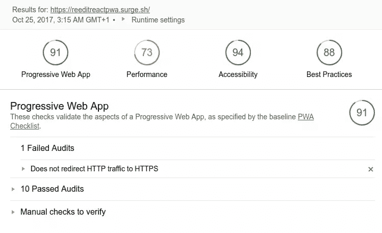

该应用程序现在可以提示用户将其安装在设备的主屏幕或架子上。

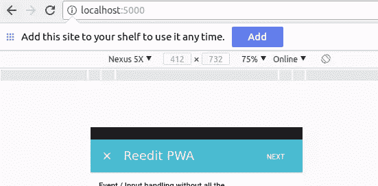

我们有一个失败的审计，它说我们需要将 HTTP 流量重定向到 HTTPS，但是这个[稍微超出了这篇文章](https://www.digicert.com/ssl-certificate-installation-nginx.htm)的范围。然而，一旦我们这样做了，这些是性能的最终结果:

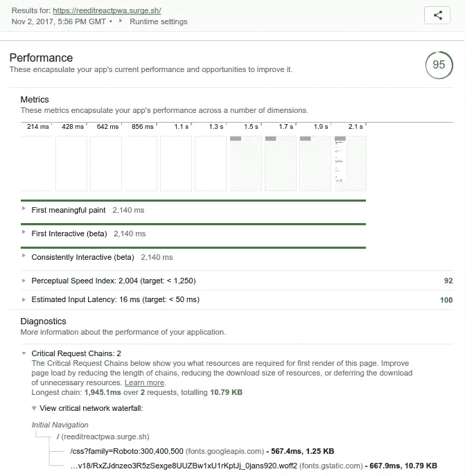

通过 JavaScript 和 CSS 内联减少*关键请求链*，我们优化了*关键渲染路径*，我们之前看到的大多数性能指标都依赖于此。但是请记住，这个 PWA 很简单；它只有一个页面，React 的设计考虑了性能。这就是我们如此快速地取得 **95/100** 绩效分数的原因。

## 通过灯塔审计

为了涵盖渐进式 web 应用程序的所有核心原则，我还将在 Lighthouse 报告中解释通过的审计。

### HTTPS

由于我们在本地审计应用程序(origin: `http://localhost`)，Lighthouse 假设它是安全的，因此 HTTPS 审计被标记为通过，但这不会发生，一旦你使用实际的主机并链接顶级域名，除非你实际上有 SSL 证书。(请注意，除了 localhost 之外，服务工作者只能从安全的来源获得服务。)

你可以用 github 页面托管你的应用，GitHub 页面会给你一个 HTTPS 安全的子域(github.io)。你也可以使用 Firebase 托管一个安全的子域或 Surge (surge.sh ),它还附带一个免费的基本 SSL 证书。

如果你决定链接你自己的顶级域名，你也有机会获得一个免费的 SSL 证书与 Let's Encrypt 或 Cloudflare。

对于本课程，我们实际上不需要用 HTTPS 安全的服务器托管应用程序，因为 Lighthouse 在本地测试时通过了这项审核。

### web 应用程序清单

web 应用程序清单是一个 JSON 文件，它提供关于 PWA 的信息，如名称、图标和描述等。它允许用户在主屏幕上安装 web 应用程序，就像本地应用程序一样，但不需要通过应用程序商店。

web 应用程序清单需要从一个使用`<link>`标签的`index.html`文件中引用，标签的*版本*属性设置为*清单*。

例如，简单生成的 React 应用程序有一个包含以下内容的`public/manifest.json`文件:

```
{
  "short_name": "ReeditPWA",
  "name": "Reedit React PWA",
  "icons": [
    {
      "src": "icon-192x192.png",
      "sizes": "192x192",
      "type": "image/png"
    }
  ],
  "start_url": "./index.html",
  "display": "standalone",
  "theme_color": "#000000",
  "background_color": "#ffffff"
} 
```

引用自`public/index.html`:

```
 <link rel="manifest" href="%PUBLIC_URL%/manifest.json"> 
```

#### 感知性能和闪屏

浏览器之前不支持 PWA 闪屏，因此当用户从主屏幕图标运行应用程序时，他们通常会经历几秒钟的白屏，然后才能看到实际的应用程序用户界面。从 Chrome 47 开始，用户可以看到一个闪屏，这提高了感知性能，并将用户从点击主屏幕图标过渡到应用程序的第一次绘画。

简而言之，感知性能是一种与用户的视角和体验更相关的衡量标准，而不是真实的性能/页面加载速度——向最终用户提供关于你的应用程序实际上有多快*的信息。*

您可以阅读[对绩效的看法文章](https://www.sitepoint.com/the-perception-of-performance/)了解更多信息。

这个闪屏是根据 web 清单中的信息为你的应用程序动态构建的，但是(根据 Lighthouse)你需要在你的`manifest.json`文件中有一个至少 512×512 大小的图标，以获得高质量的闪屏。

因此，只需准备一个至少 512×512 大小的图标，然后将以下内容添加到图标数组下的`manifest.json`:

```
{
    "src": "splashscreen-icon-512x512.png",
    "sizes": "512x512",
    "type": "image/png"
} 
```

### 渐进增强

PWAs 的核心原则之一是渐进式增强，这是指 PWAs 能够在不同的浏览器上运行，但只有在支持的情况下才能提供更高级的功能。

你也可以阅读“[JavaScript 依赖反弹:破除神话渐进增强](https://www.sitepoint.com/javascript-dependency-backlash-myth-busting-progressive-enhancement/)”来了解更多关于渐进增强的内容。

渐进式增强的一个简单例子是当一个应用程序在不支持 JavaScript 的浏览器中执行时，或者至少当 JavaScript 被禁用时。您可以使用 HTML `<noscript>`标签告诉用户应该启用 JavaScript，而不是什么都不显示:

```
<noscript>
You need to enable JavaScript to run this app.
</noscript> 
```

## 用于 PWAs 的 Chrome 开发工具

Chrome 是第一个官方支持 PWAs 的浏览器。因此，Chrome 的 DevTools 具有调试 pwa 的出色功能，具体包含在两个面板中——**审计**面板和**应用**面板。

在**审计**面板下，您可以找到我们之前看到的 Lighthouse 工具。在**应用**面板下，您可以找到许多用于调试 PWAs 核心方面的有用工具，例如:

*   web 清单显示器，它显示与您的 PWA 相关的 Web 清单文件，并允许您在货架上安装应用程序
*   服务工作器调试器，允许您查看应用程序中安装的所有服务工作器，启动和停止它们并模拟离线状态
*   存储查看器，允许您查看和清除应用程序的索引数据库、本地存储和会话存储
*   缓存查看器，用于查看和清除使用缓存 API 创建的应用程序缓存。

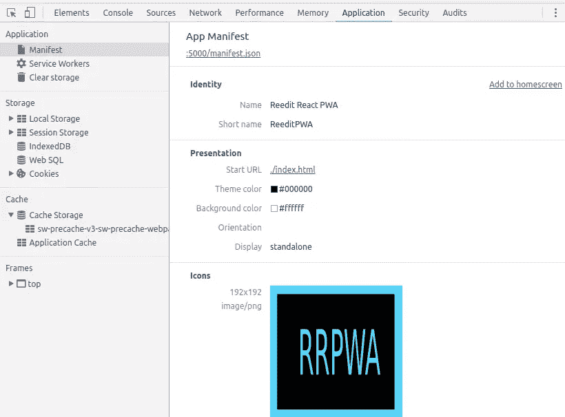

## 用于模拟网络条件的 Chrome 开发工具

在世界上的许多地方，移动设备通过缓慢而不稳定的网络连接，因此，为了提供更好的用户体验和可接受的加载时间，或者更好的是，为具有不同网络速度的大量用户提供即时 web 体验，您需要在潜在的不同条件下优化您的应用程序。借助 Chrome DevTools **网络**面板，您可以模拟多种网络条件，如慢速 3G、快速 3G 和离线状态，您甚至可以使用自己的自定义值为*下载*、*上传*和*延迟*参数创建自定义配置文件。

网络面板提供了其他功能，如缓存禁用，关闭离线状态和加载时截图。

禁用缓存和激活离线状态对于调试 pwa 特别有用。

更多信息，请查看谷歌的“[网络分析参考](https://developers.google.com/web/tools/chrome-devtools/network-performance/reference#throttling)”。

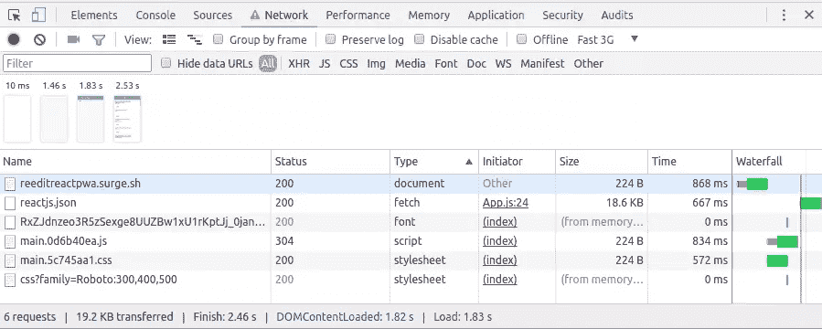

## 结论

PWA 不仅仅是另一个注重性能的应用程序。不止如此！感谢软件业的巨头——谷歌、微软等。—它们正在成为多种平台上的一流应用。

除了性能优势之外，即使您不打算构建完全合格的 PWA，PWA 也能提供以下优势:

*   利用现代标准和最佳实践为用户提供最佳体验。
*   添加到主屏幕横幅，以便提示用户将您的 PWA 添加到他们的主屏幕。当浏览器检测到你的应用很吸引人时，就会发生这种情况。最简单的例子就是用户在短时间内再次使用你的 PWA。
*   三星互联网 5.2 引入了一项名为 [ambient badging](https://samsunginter.net/docs/ambient-badging) 的功能，当用户查看 PWA 时，它会提醒用户，以便可以将其安装在他们的主屏幕上。
*   Android 版 Opera】也引入了环境标志。
*   从 Chrome 59 开始，当用户安装你的 PWA 时，一个 APK 将被创建并安装在用户的设备上，这意味着你的 [PWA 变成了一个真正的 Android 应用](https://developers.google.com/web/updates/2017/02/improved-add-to-home-screen)，带有一个`<intent-filter>`，它告诉 Android 拦截任何属于你的应用范围的链接的点击，并打开你的 PWA 而不是 Chrome。
*   微软宣布即将推出对 PWAs 的 Edge 支持。不仅如此，在 2017 年的 Edge Web 峰会上，微软宣布将 pwa 引入 Windows Store，以便它们可以作为 Windows Store 和 Bing 搜索引擎的一流应用进行搜索、发现和安装。

希望这个速成课程已经帮助你开始 PWA-ifying 你自己的网络应用！

## 分享这篇文章*